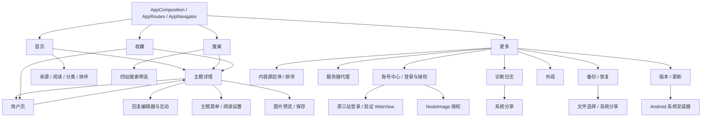

# 产品地图

## 文档职责与当前接受基线

本文件回答“App 现在有什么能力、用户从哪里进入、改动会影响哪里、交付前应回归什么”。实现方式以 `docs/architecture.md` 为准，测试强度与写操作授权以 `docs/testing-standard.md` 为准，具体命令以 `docs/operator-runbook.md` 为准。

- 当前接受基线：仓库现有能力默认都应保持可用，但不宣称零 bug。
- 用户最新明确要求优先；当前代码和实际运行结果是当前事实。本文与它们冲突时，先按事实处理，再修正文档。
- 精确的 Git revision、APK SHA、设备、登录态和一次性授权只记录在本机 `docs/emulator-baseline.md`，不得复制成长期稳定事实。
- 能力 ID 是产品/runtime 改动与回归的共同语言，不是测试用例编号；纯测试、文档或治理改动记录 evidence owner，不虚构产品 ID。
- 历史逃逸问题只在 `docs/regression-corpus.md` 追溯；表内“自动测试”和证据覆盖索引是当前 canonical evidence，不按事故追加测试清单。
- 证据按 `STATIC_PASS`、`UNIT_PASS`、`UI_PASS`、`DEVICE_REPLAY_PASS`、`LIVE_PASS`、`APK_SANITY`、`NOT_VERIFIED`、`BLOCKED_BY_ENV` 分层；任何单层通过都不能代替其他层。

## 导航拓扑



详情和用户页可以嵌套打开；返回时必须恢复前一层 route、列表、筛选、草稿、回复状态和滚动上下文，而不是简单回到某个固定首页。

Modal、BottomSheet、WebView、系统浏览器、文件选择器、系统分享和安装器也是产品入口。验收不能只检查其父页面存在，必须检查打开、取消/返回及原页面状态恢复。

## 能力清单

表内“模拟器路径”是验收定位，不自动授予真实写操作权限。涉及回复、编辑、删除、互动、上传、投票、收藏切换、清空或登录清除时，仍按 `docs/testing-standard.md` 判断授权和恢复要求。

每个能力的完整契约由本节对应行、下方四站矩阵、证据覆盖索引和共享 seam 表共同组成：本节固定入口/前置状态、用户可见行为、代码与 Vitest；证据索引固定 UI、Replay、Live 和不可自动化边界；共享 seam 表固定改动时必须展开的关联能力。证据不足的行为必须标记 `NOT_VERIFIED`，不能靠缺少入口或一次空结果推断不支持。

下文“固定四站”“三个可登录来源”描述默认全部启用时的能力集合；用户通过 `MORE-05` 停用或重排后，Feed、Search、Library、Account 与 Notifications 必须改用同一偏好的已启用子集和用户顺序，静态 Catalog 能力本身不变。内容源偏好只持久化 `source + enabled`；operation-level ReadPlan 由当前 Catalog、启用集合和账号快照纯派生，不持久化，也不把账号核对 activity 或 unknown 变成整站不可用。

### NAV：导航与状态恢复

| ID | 用户入口与行为契约 | 主要代码入口 | 自动测试 | 模拟器路径 |
| --- | --- | --- | --- | --- |
| `NAV-01` | 底部固定提供首页、搜索、收藏、更多；四个入口的点击区分别铺满现有底栏内容区内的等宽 slot、互不重叠，图标、文字、间距、底栏尺寸和安全区不变；切换 tab 不应破坏各页已有状态。 | `src/app/AppRoutes.tsx`、`src/app/AppNavigator.tsx`、`src/features/feed/FeedRoute.tsx`、`src/features/search/SearchRoute.tsx`、`src/features/library/LibraryRoute.tsx`、`src/features/more/MoreRoute.tsx`、`src/ui/navigation/NavBar.tsx` | `src/app/AppNavigator.test.ts`、`tests/integration/style-ownership.test.ts`、`tests/ui/app/app-navigator.test.tsx`、`tests/tooling/android-smoke-guard.test.ts` | `LIVE-NAV-01` 在匹配 APK 上检查四格边缘点击与视觉不变；再依次切换四个底部入口并回到原 tab 检查状态。 |
| `NAV-02` | Feed、Search、Library 可进入 Topic；Topic 和 Library 可进入 User；User 可再次进入 Topic。共享 TopicCard 的一次快速连点只允许产生一个 Topic route，窗口结束后可再次打开。NodeSeek 的 `/member?t=username` 是内部 User route，当前 Topic 找不到 UID 也不得降级为外部链接；`/space/{uid}` 直接使用 canonical UID。 | `src/app/AppNavigator.tsx`、`src/ui/topic/TopicCard.tsx`、`src/features/topic/TopicRoute.tsx`、`src/features/user/UserRoute.tsx`、`src/features/user/useUserController.ts` | `src/features/topic/useTopicSessionController.test.ts`、`src/domain/forum/userNavigation.test.ts`、`tests/integration/forum-presentation-contracts.test.ts`、`tests/ui/app/app-navigator.test.tsx`、`tests/ui/feed/feed-screen.test.tsx` | Agent Live 选择满足前置条件的对象执行列表 → Topic → User → Topic；固定数据 UI 测试不依赖动态首条。列表连点后一次 Android Back 必须返回原列表；NodeSeek 用户链接专项见 `LIVE-READ-04`。 |
| `NAV-03` | 顶栏返回、Android 物理返回和嵌套详情返回一致；每个 native Topic route 自持筛选、回复顺序、列表、草稿、回复页和滚动状态。inactive route 停止 Query、写后刷新和原图升级；返回按图片预览 → composer → native stack pop 处理，Topic A → B、Topic → User/ReadingSettings 返回原 route 实例，不依赖 snapshot restore。 | `src/app/AppNavigator.tsx`、`src/features/topic/TopicRoute.tsx`、`src/features/topic/useTopicRouteBeforeRemove.ts`、`src/features/topic/useTopicSessionController.ts` | `src/app/AppNavigator.test.ts`、`src/features/topic/useTopicSessionController.test.ts`、`tests/ui/app/app-navigator.test.tsx`、`tests/ui/topic/topic-session-controller.test.tsx` | Agent Live 从嵌套详情逐层返回并复查原列表、回复顺序与搜索条件；另在 nested Topic Loading 时立即返回，要求一次回到原详情且转场中不出现 B 内容或空白。固定 native 返回栈与 route 状态隔离由 UI 测试严格覆盖。 |

`NAV-01` 同时覆盖 More 内的 `Notifications → NotificationDetail / NotificationSettings` native stack：入口不增加第五个底部 tab，Android 摘要点击只进入指定来源的消息列表且不触发已读；可见 native header 统一取消 Android elevation 阴影，保持扁平内容层级。实现与固定 UI 证据见 `src/app/AppNavigator.tsx`、`src/app/appNavigation.ts`、`tests/ui/app/app-navigator.test.tsx`。

`NAV-02/03` 的回复导航统一使用 `ReplyLocationTarget`：点击用户名进入 User route，点击楼层才在同主题定位或把目标传给新的 Topic route；普通主题链接不得多出伪目标。`exp+wz-android://open-topic` 与 Custom Tab explicit `PendingIntent` 送入的 canonical HTTP(S) 主题 URL，在 warm event 与 cold pending queue 中都传递完整 `{ topic, targetReply? }`；四站楼层格式在进入导航前必须完整保留。HTTP(S) 入口只由明确送达 App 的 intent 消费，manifest 不声明第三方域名 intent filter；非主题、Google 页面、用户页和非受信域名拒绝。每个 Topic route 自持当前 `ReplyOrder` 与锚点窗口，定位只清内容筛选/查找而不改变顺序，嵌套返回恢复原顺序；目标身份和重复定位语义保持一致。

`NAV-02/03`：Feed、Search、Library 和 User 的共享 TopicCard 在 native push 尚未使来源页失焦时同步拒绝同一卡片的快速重复 press；门禁窗口结束后恢复正常打开，不影响不同卡片、Topic 内链接或楼层重复定位。

### FEED：首页与发现

| ID | 用户入口与行为契约 | 主要代码入口 | 自动测试 | 模拟器路径 |
| --- | --- | --- | --- | --- |
| `FEED-01` | 首页“全部”按用户顺序聚合所有已启用来源，条目保留完整 TopicCard 信息与视觉层级，包括来源/分类/访问徽章、标签、标题、摘要、作者头像与等级、时间、收藏/已读、同链来源、回复和浏览；Feed 不得以性能优化为由切换成信息合并或装饰删减的另一套 presentation。每个来源使用显式 operation ReadPlan：没有确认身份的公开 child 继续以无 Cookie lane 结算，严格 child 以 typed blocked 终态退出，不能暂停整页或借另一站成功证明；authenticated 温缓存不得投影到 public scope。单站请求或凭据存储失败不应抹掉其他已成功来源。HTTP 成功但带 `parse_empty` 诊断的页面不得当作合法空列表应用。聚合分页只追加新页，不得重新排序或平衡已加载主题；计划、启用集合或会话变化时保留仍属当前 scope 的可信来源，取消并清除失效来源及对应聚合页，迟到结果不得让列表退回 Loading、旧快照或旧 cursor。 | `src/features/feed/FeedScreen.tsx`、`src/ui/topic/TopicCard.tsx`、`src/features/feed/useFeedController.ts`、`src/platform/query/serverState.ts`、`src/sources/readGateway.ts` | `tests/ui/feed/feed-screen.test.tsx`、`tests/ui/shared/topic-card.test.tsx`、`tests/ui/feed/feed-controller-session.test.tsx`、`tests/integration/query-session-contracts.test.ts`、`src/sources/readGateway.test.ts`、`src/sources/readGatewayContract.test.ts`、`src/sources/sourceErrors.test.ts` | 首页 → 全部；确认所有已启用来源按用户顺序显示完整 TopicCard，触发分页或自然身份核对后公开来源不暂停、原可见主题不回跳，并能打开主题。 |
| `FEED-02` | 首页可切换所有已启用来源；每个单站只展示该站可用分类，切换完成后从目标列表首项开始。滑动或点选时导航先反馈，读取只在切换稳定后提交；连续选择只提交最终目标，取消不发请求。切换期间只显示目标 Loading，不回显旧来源或空列表；每次完成切换重新读取目标来源，刷新失败保留可信列表和分页位置。公开来源继续可读，需要身份的来源显示可恢复状态。 | `src/features/feed/FeedScreen.tsx`、`src/features/feed/useFeedController.ts`、`src/sources/feedRead.ts`、`src/sources/readGateway.ts` | `tests/ui/feed/feed-screen.test.tsx`、`tests/ui/feed/feed-controller-session.test.tsx`、`src/sources/feedRead.test.ts`、`src/sources/readGatewayContract.test.ts` | 逐站滑动、点选、取消和连续反向；确认导航同步、请求期无空白或旧列表、成功切换只读取一次并从首项开始。 |
| `FEED-03` | 聚合页提供全部、未读、已读、收藏；阅读和收藏来自本机资料，筛选不改变原站数据。 | `src/features/feed/useFeedController.ts`、`src/domain/reader/readerData.ts`、`src/domain/forum/topicListItemState.ts` | `src/domain/reader/readerData.test.ts`、`src/domain/forum/topicListItemState.test.ts`、`tests/ui/feed/feed-screen.test.tsx` | 在首页逐个切换阅读筛选，核对条目状态。 |
| `FEED-04` | 单站排序进入读取条件：V2EX 全部/最新/最热，linux.do 支持最新/热门/新·所有/新·话题/新·回复，NodeSeek 新帖子/新评论。切换排序回到首项；刷新、分页、旧请求和重复 cursor 不得串列表。刷新失败保留旧列表；分页失败保留重试位置；成功分页只在现有顺序后追加唯一主题。账号或启用集合变化后，不得显示旧身份或已停用来源的页面。 | `src/domain/forum/feedOptions.ts`、`src/domain/forum/feed.ts`、`src/features/feed/useFeedController.ts`、`src/platform/query/serverState.ts` | `src/domain/forum/feed.test.ts`、`tests/ui/feed/feed-controller-session.test.tsx`、`tests/integration/query-session-contracts.test.ts`、`tests/ui/feed/feed-screen.test.tsx` | 单站切换排序并触发刷新和分页，确认首项、归属、加载状态及旧页顺序。 |

`FEED-01/02/04`：聚合 Feed/Categories 的每个来源以连续墙钟 5 秒为上限；超时或已有内容后的分页全失败保留可重试 cursor，普通首屏全失败不制造空 cursor。手动刷新取消并替换同一读取。首页与搜索来源栏保持紧凑并随 Reader 字号缩放；其他共享 Tab 继续满足无障碍点击范围。

`FEED-02/04`、`SEARCH-02/04` 与共享 `ACCOUNT-01/02`：未登录妖火对每次显式首页来源/分类/刷新或单站搜索/重试意图最多自动打开一次登录页；用户关闭后，auth surface barrier、账号核对、ReadPlan scope 恢复及 Query 自动 refetch 都不得重开。新的显式意图或一次真实成功读取后，后续登录失败仍可再打开一次。

### SEARCH：搜索

| ID | 用户入口与行为契约 | 主要代码入口 | 自动测试 | 模拟器路径 |
| --- | --- | --- | --- | --- |
| `SEARCH-01` | “全部”按用户顺序结算所有已启用来源：可原生搜索的来源并行请求并渐进展示最多 2 条完整 TopicCard；处于 public lane 的 linux.do/NodeSeek 不发请求，各显示一个已结算的 Google 外部搜索入口，且绝不自动打开两个 Tab。原生来源继续使用干净默认筛选、局部失败隔离、可信预览保留、稳定结算标记和可靠作者契约；外部入口不计作空结果，不参与分页、跨站混排或“查看全部”。 | `src/features/search/SearchScreen.tsx`、`src/features/search/useSearchController.ts`、`src/features/search/listItems.ts`、`src/domain/forum/externalSearch.ts`、`src/ui/topic/TopicCard.tsx` | `src/features/search/listItems.test.ts`、`tests/ui/search/search-screen.test.tsx`、`tests/ui/search/search-controller-ai.test.tsx`、`tests/device-logged-out/logged-out-readonly.ad` | 未登录 AVD 在“全部”提交关键词，确认 L/NS 按来源顺序各有一个外部入口且没有自动弹窗；主登录 AVD 确认原生来源仍显示预览并可进入单站。 |
| `SEARCH-02` | 可切换当前已启用的单站。authenticated lane 保持 V2EX、linux.do、NodeSeek 与妖火既有原站搜索、连续分页、最近搜索、筛选和 linux.do AI 行为；public lane 的 linux.do/NodeSeek 提交后立即打开 exact `site:` Google Custom Tab，返回 Search 后保留关键词并显示“打开 Google”入口，不调用 gateway、不显示空结果或分页。清空关键词仍清空当前结果，最近搜索仍最多 20 条且可逐条删除。 | `src/features/search/SearchScreen.tsx`、`src/features/search/useSearchController.ts`、`src/features/search/history.ts`、`src/features/search/listItems.ts`、`src/domain/forum/externalSearch.ts` | `src/features/search/history.test.ts`、`src/features/search/listItems.test.ts`、`tests/ui/search/search-screen.test.tsx`、`tests/ui/search/search-controller-ai.test.tsx` | 未登录 AVD 分别提交 L/NS 查询并返回，确认关键词和再次打开入口保留；主登录 AVD 分别确认原站结果、分页和 linux.do AI 行为不变。 |
| `SEARCH-03` | 单站筛选只属于会消费它的原站协议：V2EX 与 authenticated linux.do/NodeSeek/妖火保留各自既有筛选、候选、防抖、草稿事务、分页一致性和 linux.do AI 门禁；public lane 的 linux.do/NodeSeek 隐藏筛选，不把排序、时间、分类或标签伪装成 Google 参数。Android 键盘与共享弹层几何继续遵循共享 Modal 的当前契约。 | `src/domain/forum/searchFilters.ts`、`src/features/search/SearchFilterSheet.tsx`、`src/features/search/SearchFilterForm.tsx`、`src/features/search/useSearchController.ts` | `src/domain/forum/searchFilters.test.ts`、`tests/integration/source-read-contracts/`、`tests/ui/search/search-screen.test.tsx`、`tests/ui/search/search-controller-ai.test.tsx`、`tests/ui/shared/modal-sheet-frame.test.tsx` | 未登录 L/NS 不出现筛选入口；登录态逐站检查既有筛选、候选、取消/重置/确认和分页。 |
| `SEARCH-04` | 登录、验证、授权、空结果和来源错误必须有可理解状态。L/NS authenticated lane 保持原站搜索；public lane 保持 `public:omit` scope 但 transport 为 `none`，Controller 只构造 exact Google URL，单站显式打开 Custom Tab，“全部”只显示 settled action。Google HTML、DOM selector、SearchGuard、JS gate、隐藏 WebView connector 和会话失效后的隐式降级均已删除。Custom Tab 菜单“在阅坛中打开当前主题”以 explicit mutable `PendingIntent` 回到 `MainActivity`；Deep Link 只接受既有 L/NS 主题/楼层 URL，拒绝 Google 页、首页、用户页和非受信域名，不声明第三方 intent filter/App Links。provider 不可用时退回普通浏览器并提示只能浏览。会话变为 public 时停止展示旧原站结果且不自动弹窗；重新确认 authenticated 后新 scope 才请求原站。 | `src/domain/forum/externalSearch.ts`、`src/features/search/useSearchController.ts`、`src/platform/android/forumSearchCustomTab.ts`、`plugins/withForumSearchCustomTab.js`、`src/app/useAppDeepLinkNavigation.ts`、`src/domain/forum/readPlan.ts` | `src/domain/forum/readPlan.test.ts`、`src/sources/readGatewayContract.test.ts`、`src/platform/android/forumSearchCustomTab.test.ts`、`tests/integration/security-boundaries.test.ts`、`tests/tooling/forum-search-custom-tab-plugin.test.ts`、`tests/ui/app/app-deep-link-navigation.test.tsx`、`tests/ui/search/search-screen.test.tsx`、`tests/ui/search/search-controller-ai.test.tsx` | 未登录 AVD 验证 L/NS exact Google 页面、浏览、菜单回到原生主题和 Back 保留 Search；若 Chrome 首启条款阻断则不代替用户接受并记 `BLOCKED_BY_ENV`。 |

`SEARCH-02`、`SEARCH-04`：NodeSeek 搜索只统计当前解析器实际选择的数据面；正式 `.post-list` 为空时，即使页面其他区域含 `post-*` 链接或页面壳含旧 embedded topics 也必须显示正常空态，不能误报 `parse_empty`。只有表单而结果面未完成时仍保持可重试失败，纯数字查询不改写为帖子直达。

`SEARCH-03` 的筛选状态 owner 固定为 `src/features/search/SearchFilterSheet.tsx`、`src/features/search/SearchFilterForm.tsx` 与 `src/features/search/DiscourseFilterPickers.tsx`：sheet 自持筛选入口、visibility 和草稿事务，picker 自持 visibility、debounce、候选 Query、取消和 stale-response 拒绝；对应可见行为由 `tests/ui/search/search-screen.test.tsx` 固定。

`SEARCH-02`、`SEARCH-04`：单站搜索累计结果为 0 时，空态即为终态；即使来源残留 `hasMore/nextPage`，也不得显示分页哨兵或触发自动续页。非空结果的既有自动分页与分页失败重试保持不变。


`SEARCH-03`，共享 `ACCOUNT-05`、`MORE-01`：Android `ModalSheetFrame` 只在软键盘实际显示时启用高度避让，键盘隐藏后禁用并重建残留内部补偿的 KAV，弹层关闭同样回到干净实例；V2EX 节点、Discourse 标签/分类/作者候选连续操作不得累积位移。账号凭据编辑器的显式开关和代理表单的手动 inset 保持原行为。

`SEARCH-01/02/04`：“全部”每站预览与单站连续分页使用同一来源、关键词、筛选和排序时，Query key 仍必须以 `preview/pages` lane 区分数据形状；既有 `forum → source → search` 前缀继续统一取消和失效。聚合结算后进入 V2EX 等单站必须发起合法首屏分页 Query，不得把预览对象当作 InfiniteData、退出 App 或丢失当前关键词。

### TOPIC：主题详情与阅读

`TOPIC-01/02/03`：共享 cooked HTML 样式补齐 `bbcode-b/i/u/s`、`kbd`、`mark/ins/del`、固定正文基准的 `big/small` 与 `mention-group`；颜色继续由 App 主题拥有，不放开来源背景样式。table 保持现有等宽列、最小列宽和横滑，`td/th` 只把扣除 padding/边框后的实际内容宽度提供给内部图片、贴纸和嵌套 table；视频继续随父容器 stretch，表外媒体继续使用正文宽度。不得以帖子特判、裁剪、列角色或状态机代替该宽度 owner。

`TOPIC-02/03`：NodeSeek 原站 Markdown 删除线输出原生 `<s>`，共享 Topic renderer 必须显式映射为 `line-through`，但不得复用 `<del>` 的危险语义底色。NodeSeek Composer 恢复原站支持的删除线并继续隐藏原站未提供的下划线；linux.do 仍保留两项。两站继续共用同一 Runtime，不增加帖子特判、站点样式分支或能力状态机。

`TOPIC-02/03`：NodeSeek 主楼、首屏评论、分页评论和定位评论统一归一 poll/Stardust marker；Stardust anchor 优先读取原站 `data-href` 中的完整 canonical marker，只有该属性不存在时才兼容完整可见文本，普通 `href`、`pre/code` 与非法 marker 保持惰性。每段正文只绑定自己的投票，并在 marker 原位置复用现有投票与 Stardust UI。评论投票不得进入主楼或其他评论，相同 ID 在当前加载窗口只读取一次；投票空壳清理不得删除相邻的 Stardust placeholder。

`TOPIC-02/03` 的正文、回复和引用继续先走既有图片预览、站内主题/楼层和用户导航；只有剩余 HTTP(S) 外链使用默认浏览器 Custom Tab。`TOPIC-04` 的“原站打开”继续使用完整系统浏览器。Route/Expo 边界由 `tests/ui/topic/topic-route-external-links.test.tsx` 独立固定 rejection 反馈与完整浏览器分流，App route-gate 测试不再兼任该 owner。

`TOPIC-01/02/03`、`NAV-02/03`：HTML 表格保留完整行列、`colspan`、`rowspan` 和来源顺序；窄表适配正文宽度，宽表可横向滑动，分段表格视觉连续并共享横向位置，不同表格互不影响。

`TOPIC-01/02/03`、`NAV-02/03`：正文图片加载后使用真实自然尺寸并限制在正文宽度内；滚动、离窗重进、重试和列表回收不得让已显示图片退回占位比例、错误放大窄图或接受旧请求的迟到结果。


`TOPIC-01/03`、`NAV-02/03`：虚拟与非虚拟回复共用 Header → ReplyTarget → Body → Tail 顺序。reply target 只属于首 row，必须位于正文之前；尾 row 只承载签名、统计与操作区，正文切割不得把回复关系移动到内容之后。


`TOPIC-01/02/03`、`NAV-02/03`：NodeSeek magic tabs/ANSI report 以可分段的终端报告呈现；混合 Tab 不丢 terminal 外的 code、table、rich text、media、poll 或 details，超预算只 fail-close 最小不安全 body/header child。plain/terminal code 共用选择、高亮、完整复制、横向位置与 ANSI 样式。accepted-answer preview 至少保留 header 与默认 Tab 首个 body；active tab 在同一 Topic 的过滤、回收和重挂后保持，切换 Topic 时重置。

`TOPIC-01/02/03`、`NAV-02/03`：切换 terminal Tab 后，当前 Tab 的文字和媒体必须立即可见，隐藏 Tab 不预加载；切回已查看 Tab 保留其内容，仍遵守正文媒体 warm 8、running 4 的资源上限。

`TOPIC-03`、`NAV-02/03`：楼层目标身份与定位命令分离。NodeSeek 正文 `forum-floor-link` 的同主题路径由 `TopicRoute` 为每次显式点击递增 `targetReplyRequestId`，并把同一命令同时交给 controller 与列表；LinuxDo 等结构化回复关系则由 `TopicContentList` 的稳定 ref 生成本地 request command。两条入口都让同一楼层连续点击或切换目标后再点重新定位与高亮；目标已加载时不得发网，未加载目标的每次新命令都沿既有有界定位。没有 request ID 的 route 初始 target 仍只自动处理一次，普通刷新不得重跳。

`TOPIC-01/02/03`、`NAV-02/03` ：语义 owner 先于物理预算。`pre`、独立块级 `code`、terminal code 与无离散媒体的连续富文本 subtree 不从内部切割；inline `code` 仍属于所在富文本 owner。details、callout、blockquote、list 只在自然子块或 list item 边界分段，table 只在完整 `tr`/rowspan 连通区域之间分段；图片、视频等离散媒体继续独立调度且每 row 最多 4 个网络媒体。malformed HTML、深度越界或单个不可拆媒体/table row 仍在最小单元 fail-close。

`TOPIC-01/02/03`、`NAV-02/03`：可横滑的 code/table 只在明确横向拖动时接管手势；纵向滚动、多指、无溢出和静止长按继续交给外层滚动或文字选择。横向位置在同一内容内保持并受边界限制，无障碍增减滚动继续可用。


`TOPIC-01/02/03`、`NAV-02/03`：共享 Pan 激活并移动内容后还必须取消主楼自定义选择的待决触摸流。`TopicHorizontalScroll` 用直接、不可折叠的 Native gesture owner 承载 code/table 内容，Pan 通过 external-gesture block 在横向接管时触发 `ACTION_CANCEL`；未接管时静止长按选择、纵向让行、完整复制、四个 terminal Tab、表格与无障碍滚动保持。

`TOPIC-01/02/03`、`NAV-02/03`：Android 连续选择的唯一身份是当前实际显示的 opening row 根 View marker；manifest 直接由 details/callout/引用、签名和 terminal Tab 可见性过滤后的 opening collection 生成，范围不含作者栏、操作按钮、折叠中的隐藏正文、回复、评论或已采纳答案。回复、评论和已采纳答案保持零 marker，整条长按复制由各自 `ReplyItem` 独立拥有，不能进入主楼 manifest、映射或诊断。compiler 在既有单次 post-order 内给每个 row 生成只服务逻辑复制的 opaque UTF-16 tape；正文/代码保持原文，段落和块以换行连接，表格按 row-major 以 tab 分列、换行分行，图片、Emoji 与贴纸复制 `alt` 优先、`title` 次之的标签，无标签媒体零文字但不阻断范围。主楼 coordinator 不从 `TextView` 的 selectable/layout 状态猜 selection 身份，也不以全 mounted window 完整匹配作为进入门槛；公开 `TextView.Layout` 只服务当前端点命中和 mounted `TextView` 的视觉投影；全部 opening renderer 显式设置 `selectable=false`，因此双击不产生原生局部选区。coordinator 不安装 row-wide double-tap detector、不吞普通链接 tap，只有未发生移动的静止长按进入自定义选择。选区激活后，普通短按先沿既有子树完成点击再取消选区；超过系统 touch slop 的滚动继续交给 FlashList、保留逻辑选区且不触发取消。未挂载范围由逻辑 anchor 保持；回收或布局提交中的瞬态映射缺失只跳过当前帧绘制，不取消逻辑选区，重挂后恢复可见投影。每个参与当前可见投影的 mounted `TextView` 在自身 `ViewOverlay` 绘制只补本 View padding 的 `Layout.getSelectionPath()`；两个端点使用平台主题 left/right handle、`getLineBottom(line, false)`、bidi primary/secondary horizontal 与 1/4、3/4 hotspot，主体从行底向下且不得覆盖字形行。TextView/marked-row host 会裁剪越界手柄的用户 falsifier 已成立，因此 handle wrapper 只挂到同一 ViewRoot 内的列表 viewport overlay；找不到唯一全尺寸 viewport child 时回退 `TopicSelectionSurface.overlay`，不创建 `PopupWindow` 或独立窗口。wrapper 不缓存最终 screen 坐标，而在每次 draw 读取 source/host 屏幕位置，加 host scroll、减 source `TextView` 内部 scroll 后绘制，使 pre-draw 后的纵滚、code/table 横滑、translation 与 cell 移动在同一 draw 内仍贴住 caret。route surface 不缓存全文 Path，只拥有手势、逻辑映射、ActionMode、两个触摸命中点与上述同 ViewRoot wrappers；viewport 裁剪只隐藏命中点和越界视觉。只要端点 owner 仍 mounted，wrapper 就保持与 source 绑定，使其回流首帧随文字同步出现；只有 owner 真正卸载/回收重绑、取消或 revision 失效时才从实际 viewport/surface overlay 移除，高亮则只从旧 `TextView.overlay` 移除。拖动命中至少 `48dp` 并保留手指到 hotspot 的偏移；Android 27+ 只有逻辑端点真实变化才请求 `TEXT_HANDLE_MOVE`。`ForumContentSelectionView` 不关闭 `clipChildren/clipToPadding`。FlashList 继续回收且不 pin 全文、不扩大 `drawDistance`，每 row `<=4`、warm `<=8`、running `<=4`、original `<=1` 和文字、表格、Emoji、贴纸的 bounds/baseline 全部不变。主楼 opening collection、正文身份、字号或宽度改变使 revision 失效并取消旧选区；空白或重复 row/marker、无效 tape、revision 复用时 fail closed。不创建 Compose/WebView/PopupWindow/第二 renderer。

`TOPIC-01/02/03`、`NAV-02/03`：Android ActionMode 保留稳定语义层与动态平台动作层。有效非空选区始终提供可执行 Copy；Select all 只在尚未覆盖全文时显示，全选后物理移除、端点缩回后恢复，不依赖浮动菜单是否提供返回箭头。平台层提供标准 Android Share/系统 Sharesheet，API 23+ 从设备当前可见且满足 exported/permission 边界的 `ACTION_PROCESS_TEXT` `text/plain` Activity 动态生成动作；API 24–25 不提供 classifier 动作，API 26–27 接入 TextClassifier 的单个 legacy label/icon/onClick-or-intent 动作，API 28+ 异步接入 enabled `RemoteAction` 列表。classifier 只接收当前选区纯文本；动态动作的标题、图标与组件身份来自 Android/OEM/已安装 App，不硬编码“翻译”或第三方分享目标，也不按相同标题误合并不同动作。分类结果与点击执行都必须再次匹配当前 ActionMode、generation 和 canonical 选区快照，选择变化先清旧动作，取消/destroy 后的晚到结果直接丢弃。Share 与 `PROCESS_TEXT` 只在用户点击时传递当下 canonical 纯文本，后者固定只读；classifier 动作也只在点击时执行 legacy listener/intent 或发送 `PendingIntent`。这些边界不新增 JS API、菜单阶段状态机或站点动作，且不得携带 Cookie、凭据、来源 URL、HTML、marker、manifest、logical tape 或布局诊断。

`TOPIC-02`：连续选择 document、复制顺序和公开 JS 接口保持不变；本能力只把 Android 原生选择已有的 Copy、Select all、Share、当前可用 `PROCESS_TEXT` 与 TextClassifier 动作接入同一个 ActionMode。Select all 后 Copy 仍可一级直达；平台/OEM/已安装 App 没有提供的动态动作不制造替代项，迟到动作也不能跨选区快照存活。

`TOPIC-01/03`、`NAV-02/03`：主楼引用的 summary 与展开正文共享同一引用实例 scope。summary→body 和同一 body continuation rows 之间 separator 为 0，外框按 top/continuation/bottom 连续显示；展开、收起、引用缓存、同主题当前楼层优先和正文虚拟化语义不变。

`TOPIC-02` ：正文媒体调度窗口改变时，当前排序前四个不同 request identity 才能持有运行 permit；仍在 warm window 但已排到其后的旧 row 请求必须让位给新进入 viewport 的媒体。并发上限、同 identity 去重、最多一个原图、已显示像素和暂停语义不变。

`TOPIC-01/02/03`、`NAV-03`：同主题主楼引用同时存在当前页 floor 1 投影和引用 Query 缓存时，`replyForQuotedPost` 只在当前页对象可直接渲染时保持本地优先；若本地投影没有预编译计划而缓存对象已有计划，展开必须使用缓存。普通同主题回复继续优先当前页，跨主题继续只使用目标缓存，主楼投影的回复目标与作者解析职责不变。


`TOPIC-01/02/03`：结构化 details 与 Callout 共用的 continuation Frame 在 `only/first/middle/last` 每个状态都必须提供确定的边框几何；展开切到收起时不得从 Native props 中移除上下 edge width。Android 上标题、图标和箭头必须继续绘制，正文仍按原状态挂载或卸载。

`TOPIC-01`：linux.do 详情已取得可读主楼时，以本次读取成功为准；只有明确的 HTTP 或原站协议权限错误进入权限页。Feed、搜索、分类和历史列表的权限规则不变。

`TOPIC-01/02/03`、`NAV-02/03`：正文图片以原图方向和自然尺寸决定布局，不能把下采样后的显示尺寸误作原图尺寸；单图与多图按有效媒体身份隔离，重复回调和离窗重进不得增加请求或布局跳动。

`TOPIC-01`：linux.do 主楼被作者删除但仍返回可渲染占位正文时，继续作为普通主题显示；空正文或明确删除时间仍按解析失败处理。该规则只适用于 linux.do 主楼，不改变普通删除回复或其他来源。

`TOPIC-01/03`、`NOTIFY-02`、`WRITE-01`：linux.do Emoji 目录首次成功后在本次 App 运行期复用，详情、回复和私信编辑器重进不应先显示英文 ID 或重复读取；首次失败仍可在后续进入或显式刷新时重试。

`TOPIC-01/02/03`、`NAV-02/03`：四站 inline 图片、Emoji 和 GIF 在文字流中保持正确尺寸、基线和占位；同一图片只有一个 Native 加载 owner，加载、进度、失败、取消和显式重试必须有限结算，旧请求事件不得覆盖当前内容。正文媒体同时运行最多 4 个，不按帖子、站点或图片数量特判。

`TOPIC-02/03`、`NAV-02/03`：单独一行的用户 mention 只包住文字，不拉伸成整行；混排 mention、颜色、字重和站内用户导航保持一致。

`TOPIC-01/02/03`、`NAV-02/03`：inline Emoji 与相邻文字垂直居中；较大的 sticker 不因额外偏移而裁切。四站主楼、回复和展开引用共用该行为，不按素材、帖子或站点维护偏移例外。

`TOPIC-01/02/03`、`NAV-02/03`：展开 details、callout、terminal Tab、引用或采纳答案后，当前可见区域的新媒体无需再次滚动即可进入既有有界加载队列；隐藏或离屏内容不预热，主题或会话变化立即隔离旧媒体。

`TOPIC-01/02/03`、`MORE-03`：四站主楼、回复与展开引用只保留获准的来源语义和文字颜色，由 App 统一排版；紧凑、标准、宽松三档行高保持清晰递增并随 Reader 字号缩放。物理分段不能形成重复文章边界，不引入原站 CSS、站点或帖子特判。


`TOPIC-02`、`NAV-03`：正文适屏图在原图显示后继续作为稳定底图；预览返回、原图加载、失败恢复或重试不得清空同一可见图片，原图失败时仍保留可读的适屏图。

`TOPIC-02/03`：四站 HTML 表格只显示一层周界和一套内部网格，末行末列不得叠出更粗边缘；分段表格保持连续，表头、列宽、`colspan`、横滑和 Markdown 语义不变。

`TOPIC-01/02/03`：正文、原图、预览、保存、音频、视频、贴纸和卡片图共用媒体首跳 Referrer 规则；最终策略由元素、文档和真实 URL 关系决定，不能从站点名猜测。视频按固有比例显示并使用平台 controls；音频使用受控原生卡片且不自动播放，提供播放/暂停、时间、连续拖动和手动重试。音频离窗继续播放，route/App inactive 时暂停但保留 player、lease 与位置，返回后保持暂停；只有 Topic 改变或卸载才释放。错误或超时后等待用户重试，卸载后不再访问已释放资源；poster、暂停帧、附件语义和已显示图片在滚动或 Tab 切换后保持稳定。

| ID | 用户入口与行为契约 | 主要代码入口 | 自动测试 | 模拟器路径 |
| --- | --- | --- | --- | --- |
| `TOPIC-01` | 四站主题详情展示来源、分类、标题、作者、时间、正文、适用统计和回复；Discourse 主题展示关闭、归档、置顶、已解决、采纳楼层和慢速模式等原站状态，正文后展示可折叠的已采纳答案；当前页缺少采纳楼层时静默精确补取并可就地展开全文，受限主题不得补取。linux.do emoji 目录必须经 `ReadGateway` 复用代理 fetcher、站点凭据、诊断和取消信号，迟到结果不得落地。详情请求进入后台且进程存活时不得因 AppState 被取消，后台墙钟继续计入原 timeout；deadline 内先结算则复用原请求，逾期则恢复时立即进入既有 typed timeout/fallback/recovery，不重置预算或全局 refetch；读取本地 Cookie 的 `cookie-loaded` 观察事件不得取消正在执行的同站 Query，新凭据的 `session-updated` 及其他真实身份变化必须清除该来源旧详情、释放 Loading 并保留可重试目标；来源失败或 `parse_empty` 应给出可重试状态且不得覆盖可信详情。 | `src/features/topic/TopicRoute.tsx`、`src/features/topic/TopicScreen.tsx`、`src/features/topic/components/TopicContentList.tsx`、`src/features/topic/components/ReplyItem.tsx`、`src/features/topic/useTopicController.ts`、`src/platform/query/serverState.ts`、`src/sources/discourse/reactions.ts`、`src/sources/discourseRead.ts`、`src/sources/readGateway.ts` | `src/features/topic/model/replyPagination.test.ts`、`src/features/account/sessionQueryOwnership.test.ts`、`src/features/account/browserFetchQueue.test.ts`、`tests/integration/query-session-contracts.test.ts`、`src/sources/discourse/reactions.test.ts`、`src/sources/yaohuo/parser.test.ts`、`src/features/topic/model/topicDerivedData.test.ts`、`tests/integration/source-read-contracts/`、`src/sources/readGatewayContract.test.ts`、`tests/ui/app/app-lifecycle-request-timeout.test.tsx`、`tests/ui/topic/topic-components.test.tsx`、`tests/ui/topic/topic-reply-filters.test.tsx`、`tests/ui/topic/topic-session-controller.test.tsx` | 从四站首页或搜索各打开一个主题；请求仍在飞时按 Home，分别在 deadline 内与超过 deadline 后返回，前者原请求只结算一次，后者不得再等待完整 timeout；linux.do 另核对主题状态、回应图片和采纳预览/完整回复。 |
| `TOPIC-02` | 正文正确呈现 HTML、链接、表格、代码、图片、附件、音频、视频、Emoji、贴纸、SVG 和站点格式；可信站内用户链接进入 App User route。块图先显示适屏版本并可渐进升级原图，失败时保留可读底图；预览支持相邻页、缩放、下拉关闭、重试、Back、无障碍翻页和按授权保存。安全 HTTP(S) 音频在主楼、回复、展开引用和采纳答案的原位置显示原生播放器，空源保留来源 fallback，危险源拒绝；播放器不自动播放，支持播放/暂停、连续拖动跳转、时间、失败重试与无障碍进度操作。同一 Topic 只播放一段音频，切换时保存各自位置；播放中的音频行被回收后继续播放，重新进入直接显示当前进度；route/App inactive 或媒体 paused 时暂停并保留位置，恢复后不自动续播，只有离开或切换 Topic 才释放。正文视频使用平台原生 controls 提供内联进度拖动、暂停与全屏，加载 poster 在 ready 后让出控件。inline 媒体保持文字基线，表格与代码可横滑且不破坏文字选择；Android 当前实际显示的主楼正文可跨虚拟 row 连续拖动、全选和复制，回收不改变复制顺序或原布局；起止端点使用与同页原生标题一致的平台方向手柄和 caret hotspot，手柄主体不得压住端点文字，拖动只在逻辑端点真实变化时给出系统选择触感。所有媒体遵守来源 Referrer、身份隔离、取消、有限并发和有限重试；不可信 URL、恶意或超大正文必须有限结算，安全文字不得被静默删除。 | `src/features/topic/components/TopicContentList.tsx`、`src/features/topic/components/TopicContentBlock.tsx`、`src/features/topic/selection/TopicSelectionSurface.tsx`、`modules/forum-content-selection`、`src/features/topic/rendering/useHtmlRenderingController.tsx`、`src/features/topic/media/TopicAudioSession.tsx`、`src/ui/content/ForumContentAudio.tsx`、`src/ui/content/ForumContentVideo.tsx`、`src/platform/media/imagePreviewCatalog.ts`、`src/platform/media/mediaRequestContext.ts` | `src/domain/forum/topicContentSplit.test.ts`、`src/platform/media/mediaRequestContext.test.ts`、`tests/integration/html-sanitization-contracts.test.ts`、`tests/ui/topic/topic-rich-text-selection.test.tsx`、`tests/ui/topic/topic-image-loading.test.tsx`、`tests/ui/topic/image-preview.test.tsx`、`tests/ui/topic/topic-table-rendering.test.tsx`、`npm run test:native:forum-selection`、`npm run test:instrumented:forum-selection` | 打开含表格、代码、图片、音频、视频和引用的四站主题，检查阅读、主楼跨 row 选择/复制、横滑、音频控制、预览/返回、失败重试与页面位置；选择手柄另与同页原生标题对照形状、热点和触感；保存或其他写入需另获授权。 |
| `TOPIC-03` | 回复区支持分页、正序/倒序、全部/只看楼主/只看带图、评论内查找、引用关系和楼层定位；筛选、查找、刷新及嵌套返回后保持一致。可信作者、回复目标、引用和签名用户链接进入 App User route。评论引用默认显示简介，可展开完整内容；跨主题引用按来源、主题和楼层隔离并共享同一读取。Android 回复、评论和已采纳答案不注册主楼连续选择，继续使用原有整条长按复制。回复身份优先使用原站实体 ID，同楼层不同实体不得互相覆盖。采纳答案保留普通回复能力；系统动作显示可读事件行。分页、定位和写后刷新只能合并已确认窗口，失败保留已加载内容与原 cursor。 | `src/features/topic/components/ReplyItem.tsx`、`src/features/topic/components/TopicContentList.tsx`、`src/features/topic/model/replyPagination.ts`、`src/features/topic/useTopicSessionController.ts`、`src/sources/readGateway.ts` | `src/features/topic/model/replyPagination.test.ts`、`src/domain/forum/quotedPosts.test.ts`、`tests/integration/source-read-contracts/`、`tests/ui/topic/topic-components.test.tsx`、`tests/ui/topic/topic-reply-filters.test.tsx`、`tests/ui/topic/topic-session-controller.test.tsx` | 组合回复筛选、查找、顺序、分页、楼层定位和同/跨主题引用，并确认回复/评论/采纳答案仍是整条长按复制、不进入主楼连续选择；进入作者或嵌套主题后返回，确认原位置和状态。 |
| `TOPIC-04` | 详情提供本机收藏；主题菜单提供分享、仅刷新评论、完整刷新、阅读设置和原站打开；操作后保持当前详情上下文。V2EX 超过 100 条时首屏只读取并展示第一页，保留可信总数与显式下一页游标；仅在用户触底或点击“加载更多回复”时读取下一页。“仅刷新评论”重建当前顺序的 start 窗口，“完整刷新”重取正文并复用新的 Topic 首页窗口。后续页失败保留可信正文、已加载评论和同游标评论级重试；静置不自动补齐、重试或轮询。 | `src/features/topic/components/TopicMenu.tsx`、`src/features/topic/useTopicController.ts`、`src/features/topic/useTopicSessionController.ts`、`src/sources/sourceRead.ts`、`src/app/useReaderRuntime.ts` | `src/app/AppNavigator.test.ts`、`src/features/topic/model/replyPagination.test.ts`、`src/features/topic/useTopicSessionController.test.ts`、`src/app/useReaderRuntime.test.ts`、`tests/integration/source-read-contracts/`、`tests/ui/shared/topic-and-more-controls.test.tsx`、`tests/ui/topic/topic-reply-filters.test.tsx`、`tests/ui/topic/topic-session-controller.test.tsx`、`tests/ui/app/app-navigator.test.tsx` | 打开右上菜单；分享后取消，按授权检查可恢复的本机收藏；V2EX 只读核对首屏不后台补齐、触底只追加相邻页、两种刷新不清空正文和已确认评论；阅读设置返回回归。 |

`TOPIC-02/03`：预览、引用、评论、查找、筛选和动作状态变化不得重载已显示的图片、Emoji、贴纸、音频、视频、链接卡片或 WebView；真实主题、会话或渲染配置变化时必须隔离旧内容。音频虚拟行不拥有 player 或 generation lease，离窗不能回收播放；route/App inactive 只暂停，返回后不得自动续播。

读取网络恢复只重试受影响来源仍在进行中的媒体；已经显示、尚未开始、明确失败或其他来源的媒体保持不变。保存、上传、回复和其他写入不得被自动重放。

`TOPIC-03`：超长完整引用必须按当前详情列表分段呈现，展开时先尽快显示首段再补齐其余内容；折叠重开复用已确认内容，跨主题或内容变化重新读取。头像、作者、标题和连续卡片不能因加载、分段或滚动产生跳位和空带。

`TOPIC-03` 的分页模型是任意楼层锚定后的双向窗口，不是从第一页连续加载的完整前缀。已加载目标零请求；未加载目标由来源 adapter 一次确认窗口，之后只允许以前一/后一 cursor 相邻扩展。用户接近回复窗口起点约一个可视屏时预取上一窗口，列表前插保持当前可见回复；失败保留窗口，重复 cursor 停止。编辑/删除刷新实体所在真实 `pageParam`，新回复按服务端权威尾楼重新锚定，普通整帖刷新清窗并按当前 `ReplyOrder` 重建。NodeSeek 不扩大固定 10 楼，只从有序窗口剔除页外 `hot/pinned` 展示副本；Discourse 使用 near-post，并在普通窗口批量 hydration 漏回单条时保留其他已验证回复；妖火必须由响应 URL 或 `page/replyPage` 表单确认 resolved page；V2EX 已加载评论本地定位，未加载目标由该次用户动作至多执行一次读取，结果允许为 partial。

`TOPIC-03` 另以独立 `ReplyOrder = oldest | newest` 表示服务端回复流的遍历方向，不把倒序塞进内容筛选。界面在同一行左侧保留全部、只看楼主、只看带图，右侧用显示当前值的单选菜单切换正序/倒序；排序入口、菜单与回复边界随阅读字号一致缩放。正序/倒序使用不同 Query key，并可与内容筛选和评论内查找组合；部分集合切换倒序时清空旧列表并建立真实尾窗，完整集合只有在条目数与权威回复数严格相等时才可复用。NodeSeek 按响应的 `postPageCount`、严格 pager 和当前页确认建立双向窗口，不使用主题回复总数定位或否决页面；倒序先读页拓扑，再直达其中声明的末页。页内完整性只统计固定 10 楼范围内的唯一回复：页外且明确标记为 `hot/pinned` 的展示副本先过滤，范围内热门回复保留；只有来源楼层完整覆盖当前窗口时，额外普通页外楼层才证明错页，稀疏页或缺 floor marker 的回退楼层继续展示。已确认错页、缺楼和重复 cursor 仍失败。linux.do 按 `post_stream` 真实 ID 取尾组；批量 hydration 漏回个别 ID 时展示已返回的唯一、可解析子集，cursor 仍由权威 stream offset 决定。未请求/重复 ID、整窗空缺、错误 cursor 和显式 target 未命中仍失败。妖火以主题页 `reply` / `tofloor` 链接中的最大真实楼层作为边缘路由 hint，倒序向 page + 1、正序从 `tofloor=1` 向 page - 1 遍历。`start` 请求在 `page/replyPage` 已确认且回复非空时优先展示：被删除的首楼或并发变化造成 hint 缺失，不得阻断整页；最新窗口仍限 page 1，最早窗口不生成更早 cursor，显式楼层 target 仍须精确命中。V2EX 只沿同主题正整数 `p` 的显式 HTML 链接尝试闭合；每页声明一致且合并楼层精确覆盖 `1..replyCount` 后才作为 complete 本地排序，否则保留可解析唯一行并以 partial 结算。partial 不本地反转、不显示权威边界，但必须继续可见。未确认边缘窗口、`parse_empty` 或重复 cursor 不应用；已由原站页码和连续楼层自证的 NodeSeek 相邻页不得被任何旧总数否决。最后一个 `next` 结算后当次显示“已到最新回复”或“已到最早回复”，不额外确认、不显示图标或装饰线，最终回复和系统事件不保留多余底边。整帖刷新清两个顺序缓存并重建当前顺序，楼层定位保持顺序，写后按真实窗口刷新。

`TOPIC-01`、`TOPIC-03`：NodeSeek 的当前页条数与页拓扑是两种不同事实，详情响应没有总回复数时 `replyCount` 保持缺失。`comments.length` 只表示当前页已加载条数；`postPageCount`、严格 pager、响应 `postPage` 和显式连续楼层共同确认当前窗口及前后页。详情不得为制造总数额外请求末页，主题头和未筛选的“回复列表”也不得把已加载条数显示成总数。正序、倒序和楼层定位都忽略外部传入的旧 `replyCount`；正文里的同帖引用不得生成分页。Controller 沿用现有精确 cursor 合并，不增加 NodeSeek 边缘计数恢复状态。linux.do 和妖火继续按各自原站 cursor/stream 证据翻页，V2EX 仍为完整集合零分页 transport。

`TOPIC-01/03/04`、`NAV-02/03`：V2EX 不再把主题 API、公共回复 API 与主题 HTML 的不同缓存快照拼成一份回复集合。首个主题 HTML 独立提供正文和所有逐条可解析、身份唯一的评论；不闭合时以 partial 结算，不显示权威总数。完整回复由 `ReadGateway.getReplies` 从新第一页快照开始，优先使用同一 HTML 页面集合自证。只有 HTML 不可用或无声明且无法自证时才延迟使用公共回复 API；数量匹配可 complete，非空数量不符仍返回可信 partial，合法 0/0 为 complete empty。HTML 继续提供 `Pro` 与回复元数据；其他三站窗口模型不变。

`TOPIC-01/03`、`NAV-02/03`、`NOTIFY-02`：NodeSeek 热门/置顶回复是页面展示投影，不自动属于当前 10 楼窗口。仅在 `start/cursor` 有序路径按当前页合法楼层范围过滤来源明确楼层且标记为 `hot/pinned` 的页外副本，再按 comment ID、回退楼层去重并升序用于窗口与完整性证明；范围内唯一热门回复必须保留。普通页外回复只有在来源楼层已完整覆盖固定窗口时才形成错页证据；稀疏页和缺 floor marker 的回退楼层不得因名义范围被丢弃，已确认错页、真实楼层缺口和重复 cursor 继续失败。Topic 首屏既有热门/置顶展示不变。

`TOPIC-01/03/04`、`NAV-02/03`：V2EX 首次 Topic 读取到超过 100 条的第一页时只返回正文、可信总数、第一页评论和原站明确的下一页游标，不读取第二页。Reply cursor 每次只读取对应的同主题、正整数 `p=N` 链接；query-relative 链接仍须通过同 origin、同 topic path 校验，不猜未链接页码、不把 100 当总评论上限。倒序 start 可沿显式链接定位末页窗口，target 可沿显式链接寻找目标；普通正序不聚合全集。每页按自身原始节点、有效行、楼层连续性和声明证据决定 complete/partial，已声明 HTML 不得由公共回复 API 掩盖。

`TOPIC-01/03/04`、`NAV-02/03`：V2EX 跨页快照、单条解析或计数暂时不一致不得阻断正文和其他可信评论。有效第一页即使后面还有页面也属于 complete 窗口，并以 `replyHasMore + replyNextPage` 驱动既有下拉加载；普通打开静置零 Reply transport。第二页缺一条时追加其余 46 条并标 partial，不得退回 100 条；第二页整页失败则保留前 100 条和同游标重试。倒序、楼层定位、仅刷新评论和完整刷新使用通用窗口命令，不等待或构造全集。

`TOPIC-01/03`、`NAV-02/03`：妖火楼层号是长期实体身份，主题页最大楼层和 `tofloor` 只是边缘路由 hint，不能把 hint 在当前页缺失等同为整页不可用。adapter 同时识别旧 `page` 与新 `replyPage` 页码字段；`start` 请求只要服务端确认 resolved page 且返回非空可解析回复，就展示该窗口。删除首楼时正序从当前最早可见楼开始且不生成更早 cursor；最新页 hint 因删帖或并发回复过期时仍展示确认的 page 1。显式楼层 target 仍必须精确命中，未确认页、空窗口和错页 cursor 继续失败；不修改共享 Query、窗口类型或其他来源。

`TOPIC-01/03`、`NAV-02/03`：linux.do 的 `post_stream.stream` 是窗口身份和 cursor 权威，`/posts.json` 是可能与删帖竞态的 hydration 投影。普通 `start/cursor` 请求中，只要 hydration 至少返回一条已请求、唯一的实体，adapter 就按 stream 顺序展示可解析子集，并保留原 stream offset 的相邻 cursor。未请求 ID、重复 ID、整窗空缺、错误 cursor 仍失败；显式 target/near-post 继续必须命中目标实体。不伪造楼层、不压实 post number，不修改 NodeSeek、V2EX 或妖火的来源协议。

`TOPIC-01/02/03` 的 linux.do cooked HTML 共享完整 Callout 协议：13 个主类型、alias、大小写、未知类型 Note 回退、富文本标题、`+/-` 折叠、嵌套和普通引用混排统一归一化；每个 Callout 只拥有一个初始折叠状态，当前 Topic route 是展开状态 owner，`ForumCallout` 渲染 header、配色与无障碍语义。marker 不得泄漏到正文、搜索、用户活动或引用简介；来源伪造的 canonical 属性/class、非 Discourse 内容和普通 blockquote 不得取得 Callout 语义。折叠正文未展开时不进入可见列表，标题链接不触发折叠；主题正文、普通回复、同/跨主题引用、采纳答案和超长分块行为一致。

`TOPIC-01/02/03` 的任意不可信正文必须先安全归一，再按硬预算分段渲染；主楼、普通回复与签名、完整引用和已采纳答案遵循同一规则。投票、引用、音频和视频保持原文顺序；每段最多 4 个网络媒体、80 个渲染节点、16,384 个序列化字符、64 层深度和 12,000 文本字符，无法安全拆分的内容 fail-closed。普通 block pre/code 保持语义，明确 ANSI 与 NodeSeek magic tabs 仍显示为可复制的终端报告。图片预览目录按未分片原文顺序建立；只有当前可见内容申请未完成媒体工作，inactive route 暂停等待和运行，已显示图片保持稳定。正文后控件与回复保持同一阅读顺序，非正文状态更新不得重新处理正文，Loading 返回的取消必须先于重型内容处理生效。返回行为同时展开 `NAV-02/03`。

`TOPIC-02` 的媒体 request identity 包含冻结的内容来源、进程 namespace 与该来源当前 session epoch。epoch 变化后，正文图、头像、预览图的 source headers、cache/recycling key 和 Expo Video 音视频 source 必须重建；预览仍打开时也必须重置旧缩放、Pager 和动画遮罩状态，旧解码结果与 player 不得进入新页面。JS 不读取或拼接媒体 Cookie，只发送内部来源 marker 与 opaque identity；Android 在发网前移除两个内部头，并以首跳目标和整条重定向链单调决定 Cookie 资格。identity 保留在 Expo/Glide request model 中：同进程同 epoch 可复用，不同 epoch 不得合并在途请求，重启后不得复用旧私有磁盘条目。Expo Image clone 使用 `connectTimeout=15 秒`、`readTimeout=30 秒`、`callTimeout=0`；正文图片、贴纸、iframe、音频与视频统一由 route-local `TopicBodyMediaCoordinator` 的单一最近 deadline timer 判断 30 秒无进展，图片/WebView progress 或 Expo Video `bufferedPosition` 严格增长才延后对应 deadline。普通 RN client 保持独立预算。

`TOPIC-01/02/03` 的 focused route 统一持有 `TopicBodyMediaCoordinator`：当前可见与小范围预取最多 warm 8 个未完成重媒体、同时运行最多 4 个，正文原图升级同时最多 1 个；未获许可的未完成 row 只显示稳定占位，不创建 Expo Image、player 或 OkHttp call。离开窗口或 inactive 只释放 waiting/running 工作；已经显示的图片在 cell 真正回收或媒体 identity 改变前保持像素实例。Sibling `TopicAudioSession` 唯一持有已获许可音频的 player、generation lease、活动身份和各段位置，FlashList row 回收只移除订阅；同 Topic 切换音频复用 player，route/App inactive 只暂停，Topic 结束各释放一次。正文复杂 SVG 的 consumer subscription 随未完成工作释放，最后一个 consumer 离开时排队 work 不启动、可取消 fetch 立即 abort、不可取消 Native 读取返回后不再进入 poster 阶段。同 identity 仍有其他 consumer 时继续复用进程级有界 artifact service 的 single-flight；该全局 cache/queue 不归 coordinator 所有。失败 identity 只在同一门禁内自动重试一次，第二次失败后不会因滚动/recycling/runtime 再形成请求波，同一 Topic session 只允许一次用户显式重试。runtime generation 变化只重启当前 running attempt；普通 displayed/waiting/failed 不动，当前音频 session 则暂停并保留位置后按新代换源，不自动续播。图片 renderer 的稳定视觉 key 不包含 attempt，attempt 只切换网络 source 并拒绝迟到回调。每个 Topic session 只输出一次包含 planned/media 与 warm/running/timer 高水位、`firstRowElapsedMs` 的隐私聚合。正文媒体 timeout/cancel 不触发读取 runtime rotation。

`TOPIC-02` 的 Glide `GlideUrl` 与 Expo wrapper 共用 close-safe fetcher：成功 body 保持到 cleanup，cancel 原子取消并关闭，迟到响应只关闭不回调，cleanup/cancel 任意顺序幂等，非 2xx 在失败回调前关闭且 wrapper progress 不丢失。

`TOPIC-02` 的复杂 SVG 全屏预览按 artifact 能力分流：静态 artifact 继续显示正文已经生成的 poster，不再创建第二个 Chromium renderer；只有 `animated` artifact 的当前页可挂载隔离 document view，并以同一 poster 保持首帧连续。

`TOPIC-02` 的普通栅格图全屏预览保留完整逻辑 catalog，但 Pager 只挂三个稳定 physical slots，并以无动画回中复用；槽内三组 raster/underlay Native owner 同样稳定，logical page 只更换 `source/recyclingKey` 和 logical load ownership，不按已访问页重建 Expo Image 或让 Android Pager holder 持有旧 target。旧 logical source 的迟到回调不得结算新图，不可见 underlay 必须用 `source=null` 清 target。当前与相邻页都读取原图资源、使用 disk-only cache 和显式 Native decode target，长边 `<=2,048px`、总像素 `<=4,194,304`，升为当前只改变优先级，不能把已访问页转成 decoded memory working set。相同 display/original URL 不创建第二层；不同 URL 只以普通 disk-only、downscaled Expo Image 作连续显示 underlay，远程图片不得传入 Expo `placeholder` decoder。underlay 与原图必须原子替换，不得在黑色背景上 cross-dissolve。缩放手势继续可用，保存仍读取原始文件；像素级深度缩放不通过重新启用完整 Bitmap 解码实现。正文原图覆盖层仍保留独立的 `150ms` 渐进升级。

### USER：用户页

| ID | 用户入口与行为契约 | 主要代码入口 | 自动测试 | 模拟器路径 |
| --- | --- | --- | --- | --- |
| `USER-01` | 从作者、可信正文用户链接或关注列表进入用户页，展示来源、身份、适用统计、主题/回复列表和原站主页；分页与来源错误可恢复，已缓存或刚由 Profile Query 显示的下一 cursor 必须立即可加载。`hasMore=true` 只能来自来源明确 next、权威总数与已验证页容量或有界前瞻，并同时提供非空且前进的 cursor；当前页非空本身不是下一页证据，`parse_empty` 不得覆盖可信资料或推进 cursor。凭据观察不得取消同站用户 Query；真实会话变化必须清除该来源旧资料、释放 Loading 并保留可重试定位字段，且不影响其他站。每个 User route 持有轻量 `UserReference`、controller、主题/回复筛选、列表 ref 与滚动状态；inactive route 停止 Query、刷新、分页和验证恢复。NodeSeek username-only reference 先在当前 session epoch 解析 canonical 数字 UID，再启用 Profile、主题和回复 Query，分页始终复用 UID。解析中和失败时留在 App User 页并提供刷新与显式“原站主页”；无匹配、非法响应、网络或 429 均不自动重试或外开。头像、显示名、简介、等级、统计与活动列表只来自当前 epoch 的 canonical Profile Query。 | `src/features/user/UserRoute.tsx`、`src/features/user/UserScreen.tsx`、`src/features/user/useUserController.ts`、`src/platform/query/serverState.ts`、`src/sources/readGateway.ts` | `tests/integration/forum-presentation-contracts.test.ts`、`tests/integration/source-read-contracts/`、`src/sources/readGateway.test.ts`、`src/sources/readGatewayContract.test.ts`、`src/features/user/useUserController.test.ts`、`src/features/account/sessionQueryOwnership.test.ts`、`src/features/account/browserFetchQueue.test.ts`、`tests/integration/query-session-contracts.test.ts`、`src/features/user/userScreenItems.test.ts`、`tests/ui/user/user-screen.test.tsx`、`tests/ui/user/user-controller-session.test.tsx`、`tests/ui/app/app-navigator.test.tsx` | Topic → 作者或正文用户链接；Library → 关注用户；切换主题/回复。NodeSeek username-only 专项见 `LIVE-READ-04`。 |
| `USER-02` | 本机关注可切换，状态立即反映到用户页和 Library；从用户主题进入详情并返回时保留用户页状态，User A → User B → A 也恢复 A 的筛选与滚动。只有 canonical Profile 成功后才显示关注入口并以 canonical id 持久化；未解析的 `UserReference` 不得进入 ReaderData。 | `src/features/user/UserRoute.tsx`、`src/features/user/useUserController.ts`、`src/app/useReaderRuntime.ts`、`src/ui/topic/TopicCard.tsx` | `src/domain/forum/userNavigation.test.ts`、`src/domain/reader/readerData.test.ts`、`tests/ui/shared/topic-card.test.tsx`、`src/app/useReaderRuntime.test.ts`、`tests/ui/user/user-screen.test.tsx`、`tests/ui/app/app-navigator.test.tsx` | 在获授权时关注后恢复原状态，再执行 User → Topic → 返回；解析中确认关注入口隐藏。 |

### LIBRARY：本机收藏、关注与历史

| ID | 用户入口与行为契约 | 主要代码入口 | 自动测试 | 模拟器路径 |
| --- | --- | --- | --- | --- |
| `LIBRARY-01` | 收藏帖子支持来源、该来源下的分类筛选和筛选数/总数提示，能打开详情和确认后取消本机收藏；它与原站收藏/书签是两套状态。切换 Library tab 会恢复“全部来源/全部分类”。 | `src/features/library/LibraryScreen.tsx`、`src/features/library/libraryScreenItems.ts`、`src/domain/forum/text.ts`、`src/app/useReaderRuntime.ts` | `tests/integration/feature-helper-contracts.test.ts`、`tests/tooling/android-smoke-guard.test.ts`、`src/app/useReaderRuntime.test.ts`、`tests/ui/library/library-screen.test.tsx` | 收藏 → 收藏帖子 → 来源/分类筛选 → Topic → 返回；取消收藏按授权。 |
| `LIBRARY-02` | 关注用户支持来源筛选，能打开用户页和取消关注；数量与用户页状态一致。关注记录只保存 canonical id，不保存 username-only `UserReference`；切换到关注用户时不显示分类筛选。 | `src/features/library/LibraryScreen.tsx`、`src/features/library/libraryScreenItems.ts` | `tests/tooling/android-smoke-guard.test.ts`、`src/domain/forum/userNavigation.test.ts`、`src/domain/reader/readerData.test.ts`、`tests/ui/library/library-screen.test.tsx` | 收藏 → 关注用户 → 来源筛选 → User → 返回。 |
| `LIBRARY-03` | 历史记录支持来源和分类筛选，可打开主题、删除单条或经确认后清空全部；读取、筛选和取消确认不能意外写原站。 | `src/features/library/LibraryScreen.tsx`、`src/domain/forum/text.ts`、`src/domain/reader/readerData.ts` | `tests/integration/feature-helper-contracts.test.ts`、`src/domain/reader/readerData.test.ts`、`src/app/useReaderRuntime.test.ts`、`tests/ui/library/library-screen.test.tsx` | 收藏 → 历史 → 来源/分类筛选 → Topic → 返回；删除和清空按授权。 |

`LIBRARY-01..03` 的“全部来源”固定第一，其余筛选按内容源偏好的用户顺序只显示已启用来源；停用只隐藏对应收藏、关注和历史，不删除 ReaderData。全部停用时显示“尚未启用内容源”和管理入口，旧 Topic/User 路由由停用门禁接管且不挂载远端 controller，见 `MORE-05`。

`LIBRARY-01..03` 的筛选控件保持稳定 Native topology：无状态 Pill 按位置槽复用，选中语义仍由外部 `value` 驱动；分类使用始终挂载的固定按钮，动态 taxonomy 只在用户显式打开现有 `PopupMenu` 时创建。关注用户时固定槽保持且按钮从视觉与无障碍树隐藏，没有可选分类时按钮保持挂载并禁用。收藏、历史和关注用户各自稳定拥有一个 viewport；当前页先可用，其余页延后挂载，离开 Library 后释放非活动 viewport。收藏与历史数据独立派生，普通 tab 切换不应重算或重渲染已有列表；筛选重置和位置锚定行为保持稳定。

### ACCOUNT：账号、Cookie 与站点会话

`ACCOUNT-01` 与 `ACCOUNT-02` 共享账号终态契约：上次已确认的 authenticated/anonymous 是下次启动的有效事实，普通冷启动零 Account probe。核对中的 busy 与身份事实分离；正常账号核对不复用 Feed 的 5 秒聚合预算，只等待站点协议终态，单个 HTTP 请求继续使用连续墙钟 15 秒 watchdog。网络、解析、403、429、Cloudflare 或超时只结束本次核对并保留原 snapshot/ReadPlan。只有账号协议明确终态、用户显式清除，或当前 authenticated epoch 的原始 HTTP 401 才改变身份；本地退出绝不清理 WebView Cookie。

| ID | 用户入口与行为契约 | 主要代码入口 | 自动测试 | 模拟器路径 |
| --- | --- | --- | --- | --- |
| `ACCOUNT-01` | 更多 → 账号中心按用户顺序显示已启用的 NodeSeek、linux.do、妖火。每来源稳定 `AccountSessionSnapshot` 是唯一账号事实；检查活动只由 `isVerifying` 表达，不覆盖 confirmed 身份。普通冷启动从 `account-session.v1.*` 恢复 authenticated/anonymous 终态，零 Account probe；首次升级仅对有 Cookie/SecureStore 候选的已启用来源做一次连续墙钟 5 秒迁移核对，取消并等待候选 probe 清理后才写全局 marker。正常公共刷新没有账号总预算，并行核对已启用来源，同来源快速重复刷新复用一个 Promise；同身份只更新资料，明确 anonymous/A→B 才立即发布内存终态、推进该站 epoch、隔离旧私有 Query 后串行落盘。Cookie、旧 ID、公开资料和页面可读都不是新身份正证据；失败只标记该站并保留原事实。持久化只含 source/id/username/displayName/avatar/url，不含 Cookie、token、密码、topics 或活动，也不进入备份。 | `src/features/more/components/AccountCenterPanel.tsx`、`src/features/account/useAccountStatusController.ts`、`src/platform/storage/accountSessionStore.ts`、`src/domain/session/siteSessionState.ts` | `src/platform/storage/accountSessionStore.test.ts`、`tests/ui/account/account-status-controller.test.tsx`、`tests/ui/app/app-runtime-startup.test.tsx`、`src/domain/session/siteSessionState.test.ts`、`tests/integration/query-session-contracts.test.ts` | 更多 → 账号中心 → 连续点击刷新，逐站结算且同身份不刷新首页；保留数据连续冷启动时零 Account probe。真实换号、退出或清 Cookie 需另行授权。 |
| `ACCOUNT-02` | NodeSeek、linux.do、妖火登录必须在 App 内 WebView 完成；NodeImage 授权页共享 NodeSeek 身份。打开会改变 Cookie 的登录 surface 只建立现有内存 barrier，零预检、不改身份、不清 Cookie；页面内检测只服务 UI，不提交持久身份。关闭按钮、系统返回、离开 More、切站及 NodeImage 结束均先收起页面，再只核对该来源一次；终态提交后释放 barrier，核对失败则本进程继续阻断并允许手动重试。进程中断不增加持久恢复协议，下次启动恢复上次已保存终态。首页/读取触发的 linux.do Cloudflare 面板属于 read recovery：不进入 Account barrier，不改 snapshot/epoch/ReadPlan/query key；聚合其他来源照常显示，每次显式检测最多恢复 exact Query 一次。原站 Cookie 只由网站与 Android `CookieManager` 持有；只有用户明确点击“清除登录”才定向删除。 | `src/domain/session/authSurfaceCoordinator.ts`、`src/platform/network/managedCookies.ts`、`src/features/account/useAccountStatusController.ts`、`src/features/account/useVerificationController.ts`、`src/features/account/AccountHosts.tsx` | `src/domain/session/authSurfaceCoordinator.test.ts`、`src/platform/network/managedCookies.test.ts`、`tests/ui/account/account-status-controller.test.tsx`、`src/features/account/useVerificationController.test.ts`、`tests/ui/feed/feed-controller-session.test.tsx`、`tests/ui/account/account-site-panels.test.tsx` | 保留数据打开登录页，验证打开零 probe、关闭一次核对；自然 CF 时验证其他来源保留且只恢复当前 Query。真实换号、退出和 Cookie clear 需另行授权。 |
| `ACCOUNT-03` | 保存的账号密码按站点隔离在 SecureStore；只在可信登录 URL/字段主动填入且不自动提交。单站摘要读取失败不得隐藏其他站已保存摘要，NodeSeek 登录桥接只接受站点自身 HTTPS 消息；凭据删除与网站退出互不等价。 | `src/platform/storage/credentialVault.ts`、`src/domain/session/loginFormAdapters.ts`、`src/features/account/useAccountCredentialController.ts`、`src/features/account/credentialDiagnostics.ts`、`src/features/account/useAccountController.ts` | `src/platform/storage/credentialVault.test.ts`、`src/domain/session/loginFormAdapters.test.ts`、`src/features/account/useAccountCredentialController.test.ts`、`src/features/account/credentialDiagnostics.test.ts`、`tests/ui/account/account-controller.test.tsx` | 打开可信登录页检查填入行为；不展示或记录密码。 |
| `ACCOUNT-04` | 账号中心保留 NodeSeek 签到/NodeImage、linux.do 等级要求和三个可登录来源的原站主页等站点服务；linux.do LV2+ 查看等级先直连 Connect 官方入口，只有未返回可解析官方卡片时才以 JS 内部 foreground Account intent 让既有隐藏 WebView 精确加载一次 `GET https://connect.linux.do/`，沿 linux.do SSO 与 Connect callback 续签并解析最终页；有效直连零 WebView，取消不恢复，恢复失败才保留本机估算，普通原生请求仍只读 Cookie 且响应不写回。NodeSeek 签到使用独立的全局 mutation 身份，不能继承残留 Topic。用户主动“获取 / 恢复授权”时，NodeImage 必须先确认 NodeSeek owner/epoch，再以独立 WebView mount 和声明式脚本探测现有 NodeImage session；页面已有 `#apiKeyInput` 时直接读取，否则请求 `/api/user/api-key`，取得 Key 即保存并关闭且 Connect 为零。只有该 API 返回精确 `401 + JSON error` 才进入一次 NodeSeek Connect，随后自动回到 NodeImage verify；API 的 HTML 403、网络、5xx、解析失败或成功响应缺 Key 均停止且不得再用 DOM 掩盖错误或猜成失效。Native 消息来源只证明 HTTPS origin，脚本另报精确 phase `documentUrl`；Connect ready 可每 500ms 重发，但 `/api/cAuth` 仍最多一次。三个 phase 分别在 30/60/30 秒内结算；Connect 超时必须区分尚未调用与调用后结果未知，且不自动重试。网页不可点击或刷新，不依赖按钮、popup 或 `window.opener`。三份状态保持独立，不复制 Cookie；nonce、owner、epoch、credential generation 与最终对账门禁继续生效。 | `src/features/account/useAccountRuntime.ts`、`src/features/account/useAccountController.ts`、`src/features/account/useNodeImageAuthController.ts`、`src/features/more/MoreRoute.tsx`、`src/features/more/MoreScreen.tsx`、`src/features/more/components/LinuxDoLevelPanel.tsx`、`src/sources/discourse/level.ts`、`src/sources/linuxdo/level.ts`、`src/sources/linuxdo/browserFallback.ts`、`src/sources/nodeseek/actionRequest.ts`、`src/sources/nodeimage/authFlow.ts`、`src/sources/nodeimage/credentials.ts`、`src/platform/network/loginWebViewScripts.ts`、`plugins/withNetworkProxyModule.js` | `src/sources/linuxdo/level.test.ts`、`tests/integration/source-read-contracts/`、`tests/integration/security-boundaries.test.ts`、`tests/tooling/release-packaging.test.ts`、`tests/ui/more/more-screen.test.tsx`、`tests/ui/topic/topic-actions-controller.test.tsx`、`src/sources/nodeseek/actionRequest.test.ts`、`src/sources/nodeimage/authFlow.test.ts`、`src/platform/network/loginWebViewScripts.nodeimage.test.ts`、`src/platform/network/loginWebViewScripts.test.ts`、`src/sources/nodeimage/credentials.test.ts`、`tests/ui/account/nodeimage-auth-controller.test.tsx`、`tests/ui/account/account-host.test.tsx`、`src/platform/diagnostics/diagnostics.test.ts`、`src/domain/session/accountSessionLabels.test.ts` | 保留 linux.do 当前登录态且不预先打开 Connect，点击“查看等级”应直接显示官方要求并可重复刷新；只在自然遇到 Connect 会话失效时验证单次 SSO 恢复，不清 Cookie 制造状态。保留现有 NodeImage session 时点击“获取 / 恢复授权”，应自动保存、关闭且诊断无 `connect-started`；真实失效 Connect 需配额可用时另验。 |
| `ACCOUNT-05` | 支持时，保存的账号密码使用 Android 用户身份认证保护；设备不支持时必须明确确认后才降级为本机加密。填入和删除的认证取消不得损坏凭据，用户界面统一使用“用户身份认证”。 | `src/platform/storage/credentialVault.ts`、`src/features/more/components/AccountCenterPanel.tsx`、`src/features/account/useAccountCredentialController.ts` | `src/platform/storage/credentialVault.test.ts`、`tests/ui/account/account-center.test.tsx` | 账号中心 → 自动填入；只检查设置、管理、提示和取消，不展示密码，不通过清登录制造状态。 |

`ACCOUNT-01/02/04` 共用稳定 Account Query 中唯一的 `AccountSessionSnapshot`。核对开始和失败只改 `isVerifying/lastError`，不替换 confirmed 身份；A→A 只更新资料并持久化，A→B、A→anonymous 或已知 anonymous→B 立即提交内存终态、推进目标站 epoch 并隔离旧私有 Query，随后串行落盘。登录 surface barrier 阻止该来源 strict/private/write/notification；普通核对 activity 不阻止原 confirmed 会话。公开 ReadPlan 不受阻断。

`ACCOUNT-01/02` 的账号状态协议归 `src/sources/accountRead.ts` 与三个 provider `accountStatus` adapter，统一返回 `AccountStatusObservation`；`useAccountStatusController` 负责按来源 single-flight、generation 和唯一 snapshot 提交。妖火身份读取先以首页、必要时精确登录页证明会话；只有昵称仍为数字 ID 才读取一次资料，并至多再读主题第一页推断昵称，禁止读取回复和主题分页。昵称补全失败仍一次提交已证明身份并标记 partial。可见/隐藏登录页由 `src/features/account/AccountHosts.tsx` 在 Account 内组合，App 不接收 WebView ref 或 setter。`src/platform/storage/accountSessionStore.test.ts`、`src/sources/sourceAccountRead.test.ts`、`src/sources/yaohuo/accountStatus.test.ts`、`src/domain/session/siteSessionState.test.ts`、`tests/ui/account/account-status-controller.test.tsx` 与 `tests/ui/account/account-site-panels.test.tsx` 分别固定本机终态、协议分发、妖火有限请求、snapshot 不变量、对账和 host 行为。

`ACCOUNT-04` 的 linux.do 等级刷新使用 error-first 语义：失败时可以保留旧可信数据，但必须返回本次错误、不得提示成功或自动重试。RNTL 固定成功/错误恢复入口和零自动重试；Device Replay 只确认“查看等级”入口，不发起实时 transport。动态等级由 `tests/live/agent-live.md` 独立核实，明确限流只阻塞数据验证，不得覆盖正确错误流程或阻断 Release。

`ACCOUNT-04` 的 Connect 等级卡以页面语义为唯一事实：ring/bar 是“至少达到”的正向要求，quota/veto 是“不得超过”的风险上限。通过与否只采用 Connect 的 `met/unmet` class，配额上限从页面数字读取，不在 App 内猜测边界；风险配额显示已用与剩余段，零容忍项显示通过/未通过状态，汇总统一表达为“通过 X/Y 项”。

`ACCOUNT-01/02` 的 NodeSeek `verified` 是访客 Cloudflare 验证状态，不是账号登录：它与 `anonymous` 一样保持 `isLoggedIn=false`、不增加网站登录计数、关闭写入，并让搜索展示受控 Google 外部入口而不是发起站内或外部搜索请求。隔离 AVD Replay 必须接受“未登录”与仅访客“已验证”两个准确终态，同时拒绝“已登录”、unknown 和未结算状态。

`ACCOUNT-02` 补充契约：linux.do 手动检测只由当前 WebView session、唯一 probeId 与合法 linux.do documentKey 的回执结算；事件 URL 与页面内 URL 只要求同为允许的 HTTPS host，不要求重定向后的路径逐字一致。固定延时不得提前判定，无回执超时保持 `unknown`，导航、关闭或新检查取消旧 probe。

`ACCOUNT-02` 补充契约：NodeSeek/妖火凭据填入 attempt 只关联当前 probe/fill，不得作为 WebView key；新 attempt 必须注入当前已挂载页面，只有 renderer 退出后的显式刷新才允许 remount。NodeSeek 登录 Cookie 清理必须覆盖 host-only 与 `Domain=nodeseek.com; Path=/` 身份，完成后回读确认目标 Cookie 不再可见，并保留 `cf_clearance` 与其他站状态。

`ACCOUNT-01`、`SEARCH-04`、`TOPIC-01`、`WRITE-01/03` 共享登录投影 seam：普通页面读取凭据只能发布不带身份结论的观察事件，不得把账号检测确认的登录降级；明确的当前账号验证结果仍按站独立生效。NodeSeek 当前身份只读当前首页/设置页的 `__config__.user` 或专属 self-account 结构，不调用不存在的无 ID `getInfo` 路由，也不把 `/api/account/getInfo/{id}` 公开资料当作登录证明；Account 直连响应无证据时才补 WebView，渲染脚本不得把帖子列表 ready 当作身份 ready，配置对象自有 `user === null` 或页面准确游客控件只能授权 App 投影为失效，不能授权删除原站 Cookie。清除登录是独立的用户破坏性操作。

`ACCOUNT-01/02/04` 补充 WebView 共享状态所有权：Android 同进程全部 WebView 共用认证资产，只有 Account 用户明确按站清除事务可以删除登录 Cookie。编辑器、预览器、read recovery 和普通页面只拥有自己的文档与页面状态，不得影响进程级认证资产；具体禁止项由 `docs/code-standards.md` 和 `global-webview-state-owner` 架构门禁唯一维护。

`ACCOUNT-01/02` 补充当前身份接口门禁：生产 endpoint 必须来自官方源码/文档、当前站点实际调用或成熟客户端，测试 mock 不能创造接口或状态码契约。三站分别以 NodeSeek 当前页 `__config__.user` 对象/本人控件、linux.do Cookie session current user、妖火 WAP `div.top2` 本人导航作为登录正证据；NodeSeek 不递归接受无关嵌入 profile，退出只接受渲染后配置对象自有 `user === null` 或完整游客控件。Cookie 名只用于摘要，不能直接证明登录，也不能阻止已有候选进入真实 current-session 验证；adapter 无 current user 不能保存。退出证据按站点协议分别判断，未获契约支持的状态一律 unknown。妖火公开首页 unknown 时只补读精确登录页，必须同时验证 form 名称、POST 方法、账号和密码字段，不能只看 URL，且完整 form 的退出结论不得被同页验证码脚本改成 verification。公开资料只补全已证明身份并用真实昵称替换数字 ID 占位，补全失败不得退出或清理。

`ACCOUNT-01/02` 与通知共享 canonical identity：已确认 `source:userId` 在普通账号核对、网络失败或 challenge 期间继续有效，不因 `isVerifying` 从 active 来源移除。只有确认 anonymous/退出或不同身份才按站清理 Query、投递水位和摘要，其他站不变。前台通知在首页首次内容 settled 且本机账号恢复完成后启动；后台 worker 保持 fail-closed，遇到 401 只停止本次任务，不成为第二个账号状态 owner。


### NOTIFY：统一消息与 Android 通知

`NOTIFY-02` 的公告、原消息和私信正文继续把论坛主题/楼层链接交给 App 内导航；只有剩余 HTTP(S) 外链使用默认浏览器 Custom Tab，非 HTTP(S) 仍在本地拒绝。

| ID | 用户入口与行为契约 | 主要代码入口 | 自动测试 | 模拟器路径 |
| --- | --- | --- | --- | --- |
| `NOTIFY-01` | 更多 → 消息通知按内容源偏好的用户顺序展示当前已启用且支持通知的 NodeSeek、linux.do、妖火；聚合“全部”固定第一且不显示子分类，进入单站后由该站 adapter 提供原站分类，分类进入列表 Query key，切站重置为本站默认分类。NodeSeek 为“全部/@我/回复主题/私信”，linux.do 为“所有通知/回复/赞/个人信息/聊天通知/其他通知”，妖火为“收件箱/系统/聊天”；Discourse mention 归“回复”，“其他”由服务器类型集合扣除已命名类型得出。来源、分类、未读筛选、分页、刷新和错误按站隔离，无法解析的时间保持未知，未知类型显示“其他消息”。单站和聚合分页都只有在 `hasMore=true` 且来源 cursor 非空、不同于本次请求 cursor 时继续；null 或重复 cursor 必须在 gateway 归一为终态。聚合页每个失败来源各显示自己的紧凑重试；点击只请求该来源并只 patch 对应失败页，不能重读或覆盖其他站可信数据。来源级重试绑定发起时的 exact identity 与 route-owned cancel signal；若其他来源已经翻页，恢复来源的 cursor 必须传播到聚合末页，保证后续页仍可达。消息列表、详情与设置使用无 elevation 阴影的扁平 native header；More 中“消息通知”与“服务器代理”以主题细分隔线区分。V2EX 当前不显示，未来只有在 `sourceCatalog.notifications` 开启并补齐 adapter 后才能进入。列表 Query 只在消息列表 route focused 时启用；push 详情或主题后隐藏 route 不得继续每分钟读取。进入列表、切换筛选、下拉刷新及点击 Android 摘要均不标已读；消息 route 的硬件返回归 native stack，条目读屏文案包含来源、已读状态和动作，来源与分类 Tab 双轴至少 48dp。 | `src/domain/notifications/models.ts`、`src/sources/notificationGateway.ts`、`src/sources/notificationAdapters.ts`、`src/features/notifications/NotificationRoute.tsx`、`src/features/notifications/NotificationScreens.tsx` | `src/sources/notificationGateway.test.ts`、三站 adapter 测试、`src/features/notifications/notificationPresentation.test.ts`、`src/app/AppNavigator.test.ts`、`tests/ui/notifications/notifications-screen.test.tsx`、`tests/ui/notifications/notifications-runtime.test.tsx`、`tests/ui/notifications/notifications-route.test.tsx`、`tests/ui/shared/accessibility-basics.test.tsx`、`tests/ui/more/more-screen.test.tsx`、`tests/ui/app/app-navigator.test.tsx` | 更多 → 消息通知；按用户顺序切换“全部”与当前已启用通知来源及各站原生分类，每站接受当前请求的 `data/empty/partial/error/auth` 合法终态；设备硬件返回和 TalkBack/大字号检查未执行时记 `NOT_VERIFIED`。 |
| `NOTIFY-02` | 点击具体条目先读取详情，再按原站真实协议尝试已读；失败不阻止查看且刷新后以原站状态为准。详情 route 捕获条目所属 `identityKey`，把 expected identity 与 route-owned `AbortSignal` 传给 `loadDetail/markRead/markAllRead/replyToConversation/uploadReplyImage`；gateway 在发网前复核身份、取消状态，换号、离开 route 或 unmount 取消在途 access。NodeSeek @我/回复以稳定 `comment_id`（兼容 `message_id`）为主身份；列表与完整主题链路都传递完整 `ReplyLocationTarget`，floor 缺失、无效或指向错误楼层时仍按 comment ID 匹配，floor/pageHint 只作首选分页提示，已知页界只来自响应 `postPageCount` / pager；只有缺少 comment ID 才按 floor 降级。后续页首条回复不能因共享主楼过滤而丢失；详情失败时仍可进入现有完整主题。通知 target 只表达原站明确提供的语义：只有显式 `post_id` / `post_number` / comment ID / floor 才生成 `topic-post`；只有主题 ID/URL 的主题提醒、系统通知或普通主题行生成 `topic`，详情不做帖子查找，“查看相关主题”不传 `targetReply`。Discourse `postNumber=1` 虽保留 `topic-post` 供详情读取 opening post，但进入 Topic 时不得把首帖转换成回复定位；真实回复 post number 才传 `targetReply`。NodeSeek 私信、Discourse 精确帖子/PM、妖火站内正文与最近聊天保持独立协议；Discourse 的 `/notifications` 与“个人信息”菜单只要把条目标识为私信并提供 `topic_id`，都必须生成同一个 `private-conversation` target，不能让“所有通知”退化为普通帖子详情。妖火按目标详情 URL 解析官方 `.content` 的“内容”字段，缺少该结构时明确失败，回复/删除动作不得混入正文，聊天气泡单独显示且标明原站只提供最近 20 条；“查看完整回复”以一次 `tofloor` 请求直接定位，响应页码成为后续分页锚点；原站 page 1 最新，正序定位到第 16 页后向下只能请求第 15 页，向上才请求第 17 页，不得线性抓取中间页或被同名“下一页”用户链接劫持。妖火逐条已读复核必须回到条目原分类和原页。Discourse 使用顶层 serializer 字段。现有私信会话按时间正序、靠底显示双方气泡并首次定位最新消息；作者与时间置于气泡外，底部固定整行回复入口并消费设备 bottom safe-area；普通通知的固定主题操作栏使用同一规则。NodeSeek/Discourse 发送 Markdown，并复用 `StructuredReplyComposer` 的本地结构化文档、图片与表情：NodeSeek 图片走 NodeImage，linux.do 走 `/uploads.json`，上传确认后只插入 Markdown 草稿，不自动发送；妖火由独立 `YaohuoReplyComposer` 按原表单 hidden fields 发送纯文本且不显示未核实的附件入口。失败或未确认保留内存草稿；真正 unknown 或登录 surface barrier 只暂停访问，检查中的 confirmed 身份继续有效；只有原站明确确认发送或身份已确认退出/换号才清空。正文、文件名和凭据不得进入 diagnostics。聚合页与子分类不提供批量已读；单站默认分类只为 NodeSeek、linux.do 保留批量已读，妖火需逐条打开。不提供新建私信、搜索私信、妖火发件箱、删除或收藏。 | `src/sources/nodeseek/notifications.ts`、`src/sources/discourseNotifications.ts`、`src/sources/yaohuo/notifications.ts`、`src/sources/notificationGateway.ts`、`src/features/notifications/NotificationRoute.tsx`、`src/features/notifications/MessageReplyComposerSheet.tsx`、`src/ui/composer/StructuredReplyComposer.tsx`、`src/ui/composer/YaohuoReplyComposer.tsx` | 三站 adapter 测试、`src/sources/notificationGateway.test.ts`、`tests/integration/source-read-contracts/`、`tests/ui/notifications/notifications-screen.test.tsx`、`tests/ui/notifications/notifications-route.test.tsx`、`tests/ui/topic/structured-reply-composer.test.tsx`、`tests/ui/topic/yaohuo-reply-composer.test.tsx` | Tracked Replay 不点击未读消息或触发真实写入；匹配 APK 的手动/只读 Live 可打开已有已读会话核对气泡与 composer，但不得点击图片或发送。真实逐条/批量已读、图片上传和私信回复默认 `NOT_VERIFIED`；每站写入必须另获对应站点与测试对象/内容授权后才执行 `LIVE_PASS`。 |
| `NOTIFY-03` | Android 通知默认关闭；首次主动启用才说明约 15 分钟调度并请求权限。首次 opt-in 只启用首发三站的意图，未来新增来源默认关闭。本地身份与通知设置恢复后，远端前台 snapshot 等首页首次内容 settled 再启动；普通前台约 5 分钟、消息中心约 60 秒刷新；后台 WorkManager 调度可能受 force-stop、省电和系统策略延迟。前后台共用同一身份门禁、baseline、200-ID 去重和每站摘要事务：后台每站沿 opaque cursor 逐页扫描，直到无下一页、cursor 重复、deadline 或累计 60 条；前台无论消息中心是否可见，发现新 @我、回复或私信都显示同一条 Android 每站摘要，中心可见性只改变列表刷新频率，不能跳过 native system sink 后仍消耗投递水位。snapshot 持久化按来源 all-settled，单次失败不能阻断其他成功来源。摘要不含标题、正文或私信内容；首次启用、重新启用、换号和恢复本机旧未读只建立静默 baseline，不发原生 Toast。后台注册只接受当前可读取的 active 来源；真正 unknown、未登录、登录 surface barrier 或权限撤销均保留意图但暂停任务，注册/注销串行并以最新意图为准。代理恢复失败时整轮 fail-closed。快速连续换号时只有最新 identity reconciliation 能清水位和 Query。系统通知或 identifier 保存失败必须释放本轮投递 ID；记录后、发送前及 native `notify()` ack 后再次确认全局/来源开关和身份。摘要 identifier 绑定来源与账号，native present/exact dismiss 共用串行队列，同一 source/identity 的 worker 进程内 single-flight，并在读取前以 Store current 对账已知槽；状态已变时撤销 exact identifier、释放 ID，旧账号不得复活或误删新账号摘要。NodeSeek 私信只有对方发送且原站未读的会话行才进入系统投递，自己发出但对方未查看的行不得误报。NodeSeek 缺失远端 ID 时只能派生不含参与者/对端、标题、预览和顺序的稳定 opaque ID；同一时间产生歧义时保守丢弃而不是持久化 participant-derived ID。未读消息点亮底栏“更多”时，More 内“消息通知”入口必须同步显示红点；只有版本更新时不得误亮该入口。 | `src/features/notifications/useNotificationsRuntime.ts`、`src/app/notificationBackgroundTask.ts`、`src/platform/notifications/`、`app.json`、`index.ts` | `src/platform/notifications/notificationStore.test.ts`、`src/platform/notifications/notificationWorker.test.ts`、`src/platform/notifications/notificationSystem.test.ts`、`src/sources/nodeseek/notifications.test.ts`、`src/sources/notificationForegroundAccess.test.ts`、`tests/ui/notifications/notifications-screen.test.tsx`、`tests/ui/notifications/notifications-runtime.test.tsx`、`tests/ui/more/more-screen.test.tsx`、`tests/tooling/release-packaging.test.ts` | `tests/device/notifications-readonly.ad` 固定只读消息中心、未读开关、设置三站和系统返回；权限 grant/deny/revoke、前台/后台摘要替换、锁屏隐私和冷/热点击需一次性 Android 13+ AVD，不能清主登录设备。 |

`NOTIFY-03` 的本机事务边界以 native `notify()` ack 为提交前提：ack pending 时 Store 水位与 identifier 均不变；ack 后一次 compound write 原子提交二者，随后才 exact-dismiss 旧槽。native present/exact dismiss 共享 graceful-draining 的单线程 Executor；顶层 deadline 可以 bounded 返回，但同身份 single-flight lane 必须持有到 pending commit outcome 与必要 exact dismiss 完成。强杀在 ack 与 Store commit 之间最多导致下轮重复覆盖，不得永久漏报。

冷启动时通知设置和本机调度状态可以立即恢复，但前台远端 snapshot 必须等本机账号终态恢复且首页首次内容 settled 后再启动；它不等待或触发 Account batch。headless 401 只停止本轮任务，不写 canonical Account snapshot。

`NOTIFY-02`、`WRITE-01`：NodeSeek 私信把十进制 `conversationId` 校验为正安全整数，并以 number `receiverUid` 发送；内容继续 trim，`markdown: true`，且只有原站精确返回 `success === true` 才确认成功。无效 ID 零请求，失败或未确认继续保留草稿，不乐观插入消息。

`NOTIFY-02`、`TOPIC-02`：NodeSeek 私信 Markdown 中的已知表情码由来源 adapter 转成原站同语义的 sticker HTML，通知详情复用评论的 sticker 布局、ExpoImage、媒体身份与尺寸缓存 seam；代码字面量、未知表情码和普通 Markdown 图片保持原语义，不新增私信专用 renderer。首次进入会话时继续跟随 sticker 异步尺寸变化定位最新消息，用户开始拖动后停止自动跟随。

`NOTIFY-02` 只有 `topic-post` target 的“查看完整主题”才把 `topic + ReplyLocationTarget(commentId/floor/pageHint)` 原样交给现有 `Topic` route、Controller、Gateway 和来源 adapter；`topic` target 只传主题，禁止制造 `targetReply`。`TOPIC-03` 以 `commentId` 为主身份、仅在缺少它时使用楼层。已加载目标零请求；未加载目标只应用原站确认的锚点窗口，NodeSeek 可在已知主题页界内做有界精确 ID 查找，Controller 不得逐页追赶。同楼层不同实体不得误定位，定位前恢复“全部、空搜索”但保留当前 `ReplyOrder`；任意顺序的目标窗口都可沿该顺序双向加载。不新增消息专用主题页。

`NOTIFY-01` 的一级来源 Tab 标签必须在各自至少 48dp 的点击区与选中线内水平居中；保留内容宽度和横向滚动，不强制五等分。

`NOTIFY-01/02` 的列表、设置、详情、会话、共享 Tab/按钮和回复器统一消费 Reader 字号，支持到 App 现有 130% 档位；所有已知时间统一为 `YYYY-MM-DD HH:mm`。通知富文本链接使用当前主题 primary。妖火原消息与最近聊天必须去重、清理原站协议标签并按提取后的真实时间正序显示；“回复时间”即使位于气泡正文外也必须保留，“查看主题帖/查看完整回复”链接则必须保留并进入 App 内 Topic；后者还要把原站 `tofloor` 作为精确 `targetReply.floor` 传入现有主题定位链。

`NOTIFY-02` 与 `WRITE-01/05` 共用回复模块：linux.do/NodeSeek 使用结构化编辑器，妖火使用独立纯文本编辑器；两者在 100%/130% 字号下都保持工具单行横向滑动、末尾可达，并把操作按钮保持在 Android bottom safe-area 上方。Discourse Emoji 使用按真实可用宽度自适应的图片网格，光标/选区跟随主题。

`NOTIFY-02/WRITE-01` 的消息详情 owner：`StructuredReplyComposer` 是 snapshot 唯一发布者，Topic/Notification wrapper 只等待请求完成；LinuxDo 模板列表、usage accounting 与 poll capabilities 由 `notificationGateway` 接收 route 捕获的 `identityKey + AbortSignal`，并经现有 `withFetchGuard` 在每个 GET、CSRF 和 POST 前后复核。App runtime 不再直接实现这三套协议，离开 route、换号或 unmount 必须取消在途请求。

### WRITE：回复、编辑、删除、互动与上传

`WRITE-03/05/06`：NodeSeek Composer 可生成的 Markdown、poll 与 Stardust 必须由统一详情正文 seam 完整读回；纯文本及“完整 marker 作为可见文字”的原站 anchor 均可识别，href 不参与 marker 身份判断；普通链接、`pre/code` 和非法 marker 保持惰性，投票 action cache 与 Stardust payment controller 不另建读取状态。

`WRITE-01`、`TOPIC-03`、`NAV-03`：新回复的权威尾窗应用成功后，以其中真实实体发出一次 route-scoped 单调定位命令；完整 exact target 窗口不得因“不是全量评论”被误报为 partial，真实丢行或畸形行仍保留 partial 提示与恢复入口。

| ID | 用户入口与行为契约 | 主要代码入口 | 自动测试 | 模拟器路径 |
| --- | --- | --- | --- | --- |
| `WRITE-01` | NodeSeek、linux.do、妖火详情按账户 Query 与当前验证 workflow 合并后的登录态显示回复和楼层回复，不能读取旧 workflow state 造成账号页与入口相反；某站明确失效后该站 Account Query 必须立即清空并关闭写入口，其他站不变。三站写请求只允许原 credential generation 提交结果，换号后的旧失败不得清新会话或弹登录。Topic 与私信继续共用 Bottom Sheet、草稿、楼层目标、上传和防重复写事务；linux.do/NodeSeek 的普通回复、楼层回复、回复编辑与 Markdown 私信使用 APK 内离线 `StructuredReplyComposer`，妖火继续使用独立 UBB/纯文本 `YaohuoReplyComposer`，V2EX 保持只读。Sheet 默认不超过可用高度 75%，用户可在同一 WebView 实例内手动切换全屏；关闭、路由离开、后台、切换模式和提交前结算 snapshot。 | `src/ui/composer/StructuredReplyComposer.tsx`、`src/ui/composer/YaohuoReplyComposer.tsx`、`src/ui/sheets/ComposerBottomSheet.tsx`、`src/features/topic/components/ReplyComposerSheet.tsx`、`src/features/notifications/MessageReplyComposerSheet.tsx`、`src/features/topic/actions/useTopicActionsController.ts`、各站 action client | `src/ui/composer/editorRuntime.test.ts`、`src/ui/composer/structuredComposerBridge.test.ts`、`tests/ui/topic/structured-reply-composer.test.tsx`、`tests/ui/topic/topic-components.test.tsx`、`tests/ui/topic/topic-actions-controller.test.tsx`、`tests/ui/notifications/notifications-screen.test.tsx`、`tests/ui/notifications/notifications-route.test.tsx` | 检查四类结构化 intent、妖火独立输入器、收起/恢复、Sheet/全屏和权限；真实上传与评论/私信提交必须按站点授权。 |
| `WRITE-02` | 编辑/删除只按原站解析出的逐条权限显示；Discourse 权限缺失必须 fail-closed。NodeSeek 编辑使用真实 commentId；当前请求在未传 token 时生成 16 位 `csrf-token`。linux.do 使用原站 edit/delete 权限；删除经服务器确认后本地移除并只静默刷新回复切片，不整篇重载。妖火仅在存在删除链接时可删且不提供编辑；NodeSeek 未确认删除时不显示。 | `src/features/topic/actions/useTopicActionsController.ts`、`src/sources/discourse/model.ts`、`src/sources/discourse/actionRequest.ts`、`src/sources/nodeseek/actionRequest.ts`、`src/sources/yaohuo/actionRequest.ts` | `src/sources/discourse/model.test.ts`、`src/sources/discourse/actionRequest.test.ts`、`src/sources/nodeseek/actionRequest.test.ts`、`src/sources/yaohuo/actionRequest.test.ts`、`src/features/topic/actions/actionHelpers.test.ts`、`tests/ui/topic/topic-actions-controller.test.tsx` | 检查自己的回复操作菜单和编辑器预填；真实编辑/删除评论必须按授权和清理约束。 |
| `WRITE-03` | NodeSeek 支持点赞、鸡腿、反对、原站收藏和投票；其投票只在读取/提交请求携带原站已验证的动态签名，未投时隐藏结果票数，成功加载后在原标记位置的同一正文树内渲染卡片，不拆散前后文本、不增加正文分隔线且不追加底部副本，部分失败保留失败标记并降级为 `partial`。NodeSeek 提交前必须确认“提交后不可修改”，取消为零请求；确认后只 POST 一次，再 GET 一次权威快照并同步当前 Topic 的精确 Query cache，GET 失败只保留已投/所选项和未知票数，不重投。原站 poll snapshot 的 `uid` 是普通作者管理权的唯一依据；只有当前可信 member 匹配且 `locked=false` 时显示锁定入口。取消零请求，确认只执行一次 `POST /api/vote/lock/{id}` 和一次权威 GET；POST 明确成功但刷新失败时本地保留已锁定，POST 结果不明只 GET 对账且绝不重发。linux.do 的点赞、原站书签和投票使用同一 Discourse 语义，先由合并会话投影确认站点可写，再叠加主题或逐条对象权限；该投影按站隔离，目标站失效后不得由旧 Account Query 继续开放互动；系统事件无论原始权限字段如何都不显示回复、点赞、编辑、删除或投票入口。点赞/书签先局部显示 optimistic 状态，请求失败恢复原状态，确认后同步当前 route 的精确 Query cache。linux.do 首次投票成功后的已知选项票数与参与人数只增量一次。妖火支持可切换的原站收藏和投票：收藏查询失败不阻断详情且诊断为 `partial`，只有服务端确认后才局部更新，不进入整页忙碌态或重新提交正文。NodeSeek、linux.do、妖火互动的成功/失败提交也受 credential generation 所有权保护。所有已确认 action 同步当前 route 的精确 Query cache。V2EX 只展示互动信息；不可逆或客户端不能撤销的操作不得按“可恢复切换”验收。 | `src/features/topic/components/TopicActionBar.tsx`、`src/features/topic/components/TopicPolls.tsx`、`src/features/topic/actions/useTopicActionsController.ts`、`src/features/topic/useTopicSessionController.ts`、`src/sources/discourse/actionRequest.ts`、`src/sources/discourse/permissions.ts`、`src/sources/nodeseek/polls.ts`、各站 action client、`src/sources/yaohuo/reader.ts` | `src/sources/discourse/actionRequest.test.ts`、`src/sources/discourse/permissions.test.ts`、`tests/integration/source-read-contracts/`、`src/sources/nodeseek/actionRequest.test.ts`、`src/sources/nodeseek/actionClient.test.ts`、`tests/ui/topic/topic-actions-controller.test.tsx`、`src/domain/forum/topicActionState.test.ts`、`src/sources/yaohuo/reader.test.ts`、`src/features/topic/components/TopicPolls.test.ts`、`tests/ui/topic/topic-components.test.tsx`、`tests/ui/topic/topic-reply-filters.test.tsx`、`tests/ui/topic/topic-session-controller.test.tsx` | 先看入口和权限；NodeSeek 未投目标只可打开确认并取消，真实提交必须按具体对象和选项逐次授权且不得重试；其余互动按站点、对象和可逆性核对最终状态。 |
| `WRITE-04` | NodeSeek 经 NodeImage、linux.do 经 `/uploads.json`、妖火经图床上传并插入对应 Markdown/UBB；NodeSeek 只读取已保存且属于当前身份的 Key，缺失、归属不符或上传返回 401/403 时只提示到账号中心获取授权或手动粘贴，不打开授权页、不清 Key、不重试上传或重新打开文件选择器，草稿保持不变。其他上传失败同样不得提交残缺正文或泄露凭据；三站都由完整上传工作流持有忙碌态，草稿写入后立即恢复编辑器。 | `src/sources/nodeimage/upload.ts`、`src/sources/discourse/actionRequest.ts`、`src/features/topic/actions/useTopicActionsController.ts` | `tests/integration/image-upload.test.ts`、`src/sources/discourse/actionRequest.test.ts`、`src/sources/discourse/imageUpload.test.ts`、`tests/ui/topic/topic-actions-controller.test.tsx` | 只检查选择/授权入口；真实上传因残留文件风险需单独授权。 |
| `WRITE-05` | linux.do、NodeSeek 共用结构化回复编辑器，但只展示各站真实支持的工具。默认富文本，可切换 Markdown 源码；Markdown 是草稿和发送边界。支持 GFM 表格、常用 Markdown、Emoji/贴纸、图片、投票和站点私有节点；未知块与未修改私有 marker 保留原文，合并单元格拒绝进入状态。按钮和菜单满足无障碍点击范围，工具栏可横滑；投票选项逐项编辑。表格操作只提供行、列、对齐和删除，源码模式不显示富文本菜单；命令完成后归还原选区与焦点。动态样式必须携带本地 CSP nonce。NodeSeek 投票创建与回复提交保持幂等，结果不明时禁止重复创建。本 App 不提供新主题。 | `src/ui/composer/editorRuntime.tsx`、`src/domain/forum/structuredComposer.ts`、`src/domain/forum/linuxDoPoll.ts`、`src/features/topic/actions/useTopicActionsController.ts` | `src/ui/composer/editorRuntime.test.ts`、`src/domain/forum/structuredComposer.test.ts`、`src/domain/forum/linuxDoPoll.test.ts`、`tests/ui/topic/structured-reply-composer.test.tsx`、`tests/ui/topic/topic-actions-controller.test.tsx` | 在两站检查富文本/源码切换、表格、站点私有工具、焦点、退格和同实例全屏；真实回复、投票、付款或上传必须另获授权。 |
| `WRITE-06` | NodeSeek 回复可在本地插入 `nsapp://stardust-receive` 收款 marker；receiver 固定当前登录 member，新卡 Ref 按原站 `100 + floor(100000000 * random)` 生成并可编辑，修改旧卡保留原 Ref。Reader 仍显示旧 Ref，但发布、修改和付款统一要求安全整数且 `>=100`，非法 Ref 零写请求。自定义 scheme 只按已验证前缀后的 query 解析，不依赖 Android WebView 的 `URL` 支持；源码与富文本往返必须保持结构化卡片。详情 renderer 在原正文位置显示 `NodeSeekStardustCard`，头像固定读取 `/avatar/{member_id}.png`；状态只接受原站 `{success,records,exist_more}`，数据层保留服务端业务失败 message 供诊断，卡片仅在状态成功时展示统计，加载、限额或失败在 UI 静默且不隐藏静态卡或付款入口。人数取全部 records、金额只累计正 `diff`、当前用户已付取 peer records；非一次性已付仍可再次付款，只有一次性已关闭才阻断。付款只走本地 Ref 校验 → 固定 NodeSeek origin 的 prepare → 收款人确认 → 单次 `{member_id,diff,ref_id,onetime}` send，不做 status preflight；明确 send 成功即成功，展示刷新失败不得改成 unknown，send 结果不明不猜测、不重发并在当前卡片生命周期阻断再次点击。 | `src/sources/nodeseek/stardust.ts`、`src/sources/nodeseek/stardustMarkup.ts`、`src/features/topic/components/NodeSeekStardustCard.tsx`、`src/features/topic/actions/useTopicActionsController.ts`、`src/features/topic/rendering/htmlElementModels.ts` | `src/domain/forum/structuredComposer.test.ts`、`src/sources/nodeseek/actionRequest.test.ts`、`src/sources/nodeseek/actionClient.test.ts`、`src/sources/nodeseek/stardust.test.ts`、`src/ui/composer/editorRuntime.test.ts`、`tests/ui/topic/topic-actions-controller.test.tsx`、`tests/ui/topic/topic-components.test.tsx`、`tests/integration/source-read-contracts/` | 在指定测试帖核对真实 `data-href` 卡片、旧 Ref 禁用、限额响应不进入 UI 且付款入口可用；真实付款只有用户指定对象和金额后才能单次执行，任何 unknown 立即停止。 |

`WRITE-05/06` 的结构化编辑边界：编辑器只在 Markdown 代码范围之外识别私有语法，inline/fenced/indented code 保持原文；source-mode 图片上传保留上传开始时的选区，pending 时只拒绝跨模式，当前模式仍可编辑。LinuxDo 模板先进入本地草稿，再异步记录 usage；计数失败不撤回正文、不触发评论。NodeSeek poll 在任何网络前完整核对 token/sidecar/journal，remote ID 单调不降级，且只有明确业务拒绝或 4xx 才是 `serverRejected`；5xx、timeout、网络和畸形响应都按 unknown 阻止重发。Stardust 卡片只依赖真实 loader 与收款字段，等价 `actions` wrapper 不得重复读取。

`WRITE-05/06`：业务 Builder 复用一致的 Input、checkbox、Button 和 Card 状态；Emoji/贴纸目录必须在 Bridge 上限内结算，晚到目录只更新资源，不重置草稿。表达式面板关闭重开或分类切换后保留已加载资源，当前分类独占显示并支持明确的搜索空态；硬换行和站点私有节点仍按原发布协议序列化。

`WRITE-05` 的私有节点共享同一完整编辑生命周期：连续插入不同 atom 必须保留前一个节点并把文本选区放入尾随段落；INIT、编辑预填和源码重解析后的任意终止 block 也由 Tiptap 官方 TrailingNode 保证尾随可输入段落，不能把横向 GapCursor 当成正文光标。源码未变化时不重建 Tiptap 文档；真正的程序同步不进入 Tiptap/CodeMirror 用户 undo history。Emoji/贴纸文档节点只持有 raw marker，资源预览属于 NodeView，目录晚到不产生文档 transaction。LinuxDo Emoji 不再固定截断 120 项，完整目录按 120 项增量呈现且搜索覆盖全部目录。LinuxDo poll 使用逐项选项、条件化高级字段和动态 Group Chooser；组目录与 Staff 能力由现有 host-action seam 在有效 writable ticket 内读取，搜索、多选、可删除 Chip、不可用已选组保留及失败重试均不退回自由文本。投票卡片由 raw 派生真实标题、类型、公开/结果/组/关闭摘要。

`WRITE-01..06` 的远端写请求与 NodeSeek 签到统一先经 `ensureWritableSession(source)` 取得一次性 identity/epoch ticket；只有当前身份 unknown 时才在执行前定向核对。换号、退出、surface barrier 或 ticket 过期均在 Query snapshot、optimistic update、确认、文件选择、上传、transport 和写后刷新结算前终止，所有等待后再次校验。底层 response 由 `rejectUnauthorizedResponse` 在 adapter 前拦截：只有当前 ticket 的原始 HTTP 401 通知统一 Account owner，零补账号请求、零自动重放；403、429、Cloudflare、typed auth hint、ordinary 与 permission 只结算本次 mutation。任何自动逻辑都不清 WebView Cookie。NodeImage Key 继续绑定当前已确认 NodeSeek identity。

`WRITE-01/05` 的离线 `StructuredReplyComposer` 保持单一编辑器实例与既有草稿/Bridge 生命周期；它只管理自己的文档状态，不得创建、切换或清理进程级 WebView 认证资产。挂载隐藏 Composer、切换 Sheet/全屏、renderer 恢复和覆盖安装都不得改变任一站点登录态。

`WRITE-01/02` 的服务端确认后刷新保持当前 `ReplyOrder`：编辑和删除只重读实体所在的真实服务端窗口，成功后失效另一顺序缓存；新增回复先以 `newest + start` 让 adapter 确认真实尾窗，当前为正序时再用该窗返回的真实实体定位正序窗口，不按 Discourse 回复数猜 post number。刷新失败保留可信窗口并报告 `partial`，不得把旧正序片段反转成写后倒序结果。

写成功后只以 `refetchType: none` 标记精确 Topic/Replies Query stale，随后由权威窗口刷新独占 transport。相邻窗口失败保留列表和对应 start/end 重试入口；同一 Reply Query 的普通分页由 Query 单飞。target、整帖刷新和写后刷新取消旧 Query，以 generation 保证后发命令胜出；route、Query identity 或 order 改变后旧结果必须 stale，不保存 Promise、恢复闭包或 Controller 调度队列。

`WRITE-01/02/03` 的入口与 controller 共用 `src/features/topic/actions/topicActionDecision.ts`，按来源 capability、身份可信度、对象权限、必需 target、already-complete 和 pending 返回单一 reason；`src/features/topic/actions/topicActionDecision.test.ts` 与 `tests/ui/topic/topic-actions-controller.test.tsx` 固定零请求、单次成功和完整 rollback。

### DATA：本机资料、持久化与备份

| ID | 用户入口与行为契约 | 主要代码入口 | 自动测试 | 模拟器路径 |
| --- | --- | --- | --- | --- |
| `DATA-01` | 已读、本机收藏、关注和历史作为一个 ReaderData 领域保存；写入排队、失败回滚、旧保存完成和多次快速修改不得丢数据。 | `src/domain/reader/readerData.ts`、`src/platform/storage/readerDataStore.ts`、`src/app/useReaderRuntime.ts` | `src/domain/reader/readerData.test.ts`、`src/platform/storage/readerDataStore.test.ts`、`src/app/useReaderRuntime.test.ts` | 重启前后核对收藏/关注/历史；真实切换后恢复原状态。 |
| `DATA-02` | 当前 ReaderData 使用 AsyncStorage 单键 `reader-data`、格式版本 2；设置和原子内容源偏好用 `reader-settings`，搜索历史用 `reader-search-history`。两份本地读取均有 3 秒上限；`reader-settings` 缺失、损坏、非对象、拒绝或超时必须把内容源默认成四站全启用，保留已成功读取的收藏、历史、关注和其他 ReaderData，迟到设置不再发布。ReaderData 自身失败进入既有只读恢复模式，不用默认设置覆盖用户资料。不得在无迁移和回退方案时改变 key、结构或写入时序。 | `src/platform/storage/readerDataStore.ts`、`src/domain/reader/readerData.ts`、`src/app/useReaderRuntime.ts`、`src/features/search/history.ts`、`src/features/search/useSearchController.ts` | `src/platform/storage/readerDataStore.test.ts`、`src/domain/reader/readerData.test.ts`、`src/features/search/history.test.ts`、`src/app/useReaderRuntime.test.ts` | 覆盖安装/重启后核对既有本机数据、四站默认与启动可达；不得清 App 数据制造状态。 |
| `DATA-03` | JSON 备份只包含允许的本机资料和设置，包括内容源顺序与开关；限制大小/深度并拒绝敏感字段。导出取消、损坏导入、合并和失败回滚要有明确结果。Cookie、密码、代理和 token 永不进入备份。 | `src/features/more/components/MoreUtilityPanels.tsx`、`src/features/more/useBackupStatusController.ts`、`src/domain/reader/readerBackup.ts`、`src/platform/storage/backupImportFile.ts`、`src/platform/storage/backupOperation.ts`、`src/platform/storage/backupFiles.ts` | `src/domain/reader/readerBackup.test.ts`、`src/platform/storage/backupImportFile.test.ts`、`src/platform/storage/backupOperation.test.ts`、`tests/integration/security-boundaries.test.ts`、`tests/ui/more/more-screen.test.tsx`、`tests/ui/more/backup-status-controller.test.tsx` | 更多 → 备份/恢复；导出或导入需按数据风险授权。 |

### MORE：工具、代理、诊断、外观与更新

| ID | 用户入口与行为契约 | 主要代码入口 | 自动测试 | 模拟器路径 |
| --- | --- | --- | --- | --- |
| `MORE-01` | HTTP/SOCKS5 服务器代理保存在安全存储，可做完整 TLS/HTTP 连通性测试并启停；密码输入必须遮蔽。proxy SecureStore load 最多等待 3 秒，且不阻断本地 routes；在 saved state 与完整 native apply 结算前，App 管理的网络请求和 WebView 仍 fail-closed，读取失败/超时释放等待者并显示恢复入口，慢 native apply 不被额外 JS deadline 误判为可直连。原生启动、启用、切换、关闭、WebView 回调失败或配置读取失败时旧 tunnel、受管请求和 bridge 资源必须释放，并限制正常并发；共享 deadline 必须在阻塞写时仍能终止 worker。只读 WebView CookieJar 安装在同一受管 OkHttp client 上；普通站点失败不得全局 cancel/evict 或误伤其他站请求。App 级读取 runtime 必须能原子轮换并覆盖四站后续 fetch、图片和视频。普通页面请求进入 App 后台不改变 owner，共享 JS request deadline 按连续墙钟计时且不得被 AppState 暂停。 | `src/platform/network/networkProxy.ts`、`src/platform/network/readNetworkRuntime.ts`、`src/platform/network/useNetworkProxyRuntime.ts`、`src/features/more/components/NetworkProxyModal.tsx`、`plugins/withNetworkProxyModule.js` | `src/platform/network/networkProxy.test.ts`、`tests/ui/app/app-lifecycle-request-timeout.test.tsx`、`tests/ui/app/app-runtime-startup.test.tsx`、`tests/ui/more/network-proxy-controller.test.tsx`、`tests/ui/more/network-proxy-modal.test.tsx`、`tests/ui/account/hidden-browser-host.test.tsx`、`tests/ui/account/account-host.test.tsx`、`tests/ui/account/account-site-panels.test.tsx`、`tests/ui/topic/topic-image-loading.test.tsx`、`tests/tooling/release-packaging.test.ts`、生成的 `NetworkProxyRuntimeTest.kt` | 冷启动先核对本地 Library/More 可达，再只读核对服务器代理配置与密码遮蔽；真实启停和公网连通性测试必须另获授权并最终恢复关闭。 |
| `MORE-02` | 诊断记录请求阶段、归属和终态，局部来源、凭据、解析或写后刷新失败必须把整体成功终态提升为 `partial`，但不记录内容或 secret；账号公共刷新只记录失败站并保持另外两站完成，不因缓存复位误报全站退出。Android 另以 512 条有界 Native buffer 记录读取 generation、opaque client/pool/connection ID、Dispatcher/player lease/Cronet active 数量、DNS/connect/acquired/response 与 `rotate-read-runtime` 的 `intent/publish/cancel/drain/finish`、协议和地址族；该 trace 从 JS trigger 复用到 Native 与 JS state apply，构建前先写 intent，任一路径只有一个 finish。V2EX/妖火的合格超时恢复额外记录旧/新 generation、`reason=timeout`、`state=retry`与 `retryCount=1`。重复 drain 状态不刷屏，导出前按封闭白名单转换并与 JS 事件按时间旧到新合并，不记录 URL、Host、IP、Cookie 或错误消息；JS 日志仍使用两份 1 MiB 轮转，导出走系统分享且清理临时文件。 | `src/platform/diagnostics/diagnosticPolicy.ts`、`src/platform/diagnostics/diagnostics.ts`、`src/platform/diagnostics/diagnosticFileStore.ts`、`src/platform/diagnostics/nativeReadNetworkDiagnostics.ts`、`src/sources/readGateway.ts` | `src/platform/diagnostics/diagnostics.test.ts`、`src/platform/diagnostics/diagnosticFileStore.test.ts`、`src/sources/readGatewayContract.test.ts`、`tests/ui/account/account-status-controller.test.tsx`、`tests/ui/topic/topic-actions-controller.test.tsx`、生成的 `NetworkProxyRuntimeTest.kt` | 更多 → 诊断日志 → 生成/分享后取消；检查无敏感可见内容。 |
| `MORE-03` | 外观支持字号、浅/深色主题、列表密度、行距、正文宽度和字体；切换立即生效并持久化，不应挤压主要页面。 | `src/features/more/components/AppearancePanel.tsx`、`src/features/more/useReaderSettingsController.ts`、`src/ui/theme/tokens.ts`、`src/ui/theme/ReaderStyleProvider.tsx` | `src/features/more/useReaderSettingsController.test.ts`、`tests/integration/style-ownership.test.ts`、`tests/ui/shared/topic-and-more-controls.test.tsx` | 更多 → 外观；逐项切换，检查首页/详情/弹层，并恢复原值。 |
| `MORE-04` | 检查更新读取可信 manifest，比较版本并校验下载；manifest signer 必须等于 App 内置正式 signer，下载后继续校验 hash、包名、版本和当前唯一 APK signer。检查与下载在 runtime 层互斥，不能在新检查期间下载旧 update info。不同 versionCode/SHA 的 APK 必须使用不同 cache 文件和 FileProvider URI，只清理阅坛自己的旧更新文件。安装由 Android 系统确认，代理保护覆盖更新请求。 | `src/platform/update/appUpdate.ts`、`src/platform/update/useAppUpdateRuntime.ts`、`plugins/withApkInstaller.js` | `src/platform/update/appUpdate.test.ts`、`src/platform/update/useAppUpdateRuntime.test.ts`、`tests/tooling/apk-installer-plugin.test.ts` | 更多 → 检查更新；安装包下载/安装按发布风险授权。 |
| `MORE-05` | “内容源”面板始终按用户顺序列出四站；开关独立于右侧 48dp 排序手柄，长按手柄拖拽，TalkBack 使用同一手柄的上移/下移动作。普通视觉模式在拖动和提交期间保持 source host 与 Reanimated 位置映射；screen reader 初始状态未结算或已开启时，Native children 直接按当前用户顺序渲染且 transform 为 `[]`，模式切换取消未完成 drag、清槽位并零额外持久化。排序列表只在面板展开时挂载；停用来源不删除本机内容、Cookie、凭据或可信身份，但所有业务入口 fail-closed；排序零 refetch。重新启用来源时若已有持久化终态便直接恢复，若没有则进入 unknown/public lane，不自动核对；用户可在账号中心手动刷新，通知只建立新 baseline、不补旧消息。 | `src/domain/reader/contentSourcePreferences.ts`、`src/features/more/components/ContentSourcesPanel.tsx`、`src/app/useContentSourceQueryCleanup.ts`、`src/sources/readGateway.ts`、`src/sources/notificationGateway.ts` | `src/domain/reader/contentSourcePreferences.test.ts`、`tests/ui/app/content-source-query-cleanup.test.tsx`、`tests/ui/app/content-source-navigation.test.tsx`、`tests/ui/app/content-source-route-gates.test.tsx`、`tests/ui/more/more-screen.test.tsx` | `LIVE-LOCAL-04`：记录并恢复原设置；TalkBack 下核对遍历顺序、位置朗读、上移/下移和焦点连续，关闭后再核对普通视觉拖动。不得清 Cookie 制造状态。 |

`MORE-01..05` 的 route-local 组合归 `src/features/more/MoreRoute.tsx`；账号、更新和工具/设置分别由 `src/features/more/components/MoreAccountPanel.tsx`、`src/features/more/components/MoreUpdatePanel.tsx`、`src/features/more/components/MoreUtilityPanels.tsx` 持有局部状态，`src/features/more/MoreScreen.tsx` 只布局。`tests/ui/more/more-screen.test.tsx` 固定 capability 投影与 panel 行为。

`MORE-01` 的读取网络 runtime 是整个 App 共用的 generation，不是四站各自的专用 client。每代拥有新的 ProxySelector wrapper、Dispatcher、forum/media pool、Expo Image client 与 Cronet media generation，同时复用稳定 CookieJar、代理配置及 RN TLS/缓存语义；RN fetch 每次建请求读取 current，Expo Video 先取得 generation lease 再建 player，Glide 在主线程发布新 image client。NodeSeek/linux.do 在 Direct 失败、WebView fallback 成功且内容被确认可读时触发；V2EX/妖火在当前页面的显式 foreground `content GET/HEAD` 达到 15 秒 deadline 且读取仍有效时触发，并最多整体重放一次。全 App Native fetch 边界把读取 intent 标成内部 `content/health/retained` 归属并在出网前移除 header；未标记请求不按同域猜测归属。一次 trigger 会先发布新代，再只取消旧代同来源 `content GET/HEAD` 与对应非视频媒体；同站后台 Account health、retained、无关来源、健康视频、Cronet response body 和全部写请求自然 drain，四站之后的新请求都走新代。`all` 的 5 秒单来源聚合预算、普通错误、页面/后台取消和全部写入均不触发；只有代理 transition 保留跨 generation 全局 cancel/evict 权限。

`MORE-02` 同时约束消息诊断与持久化：正文、预览、参与者、会话、Cookie、token 和原始响应不得进入诊断、ReaderData、备份或 Android 通知存储；只允许保存公开身份键、开关、每站最多 200 个投递 ID、最后成功状态及 Android identifier。More 底部圆点按 `none | update | messages | both` 区分新消息、可用更新或二者；消息入口只消费结构化未读状态并同步显示行内红点，不能从摘要文案或更新状态猜测。

`DATA-02/03` 的 `reader-settings` 与 JSON 备份现包含 `nodeSeekRecoveryThreshold`；旧数据使用默认 1，导入时取整并 clamp 到 1–5，不增加数据迁移。

### RELEASE：构建、打包与发布

| ID | 用户入口与行为契约 | 主要代码入口 | 自动测试 | 验收路径 |
| --- | --- | --- | --- | --- |
| `RELEASE-01` | `package.json`、`app.json`、更新 manifest 和产物版本一致；versionName 变化时 versionCode 必须高于上一正式 tag。发布前按仓库根解析并验证 keystore，正式 arm64 APK 必须由内置 pin 对应的唯一当前 signer 签名，x86_64 smoke 包不得上传；manifest 的 Java provenance 只接受唯一标准版本行。 | `package.json`、`app.json`、`scripts/check-version.mjs`、`scripts/release-android.mjs`、`scripts/release-environment.mjs`、`plugins/withApkInstaller.js` | `tests/tooling/version-check.test.ts`、`tests/tooling/release-environment.test.ts`、`tests/tooling/release-signing.test.ts`、`tests/tooling/release-workflow.test.ts`、`src/platform/update/appUpdate.test.ts`、`tests/tooling/apk-installer-plugin.test.ts`、生成的 `ApkInstallerSignerTest.kt`、`tests/tooling/release-packaging.test.ts` | 按 `docs/operator-runbook.md` 运行 release，只在明确发布任务中执行。 |
| `RELEASE-02` | 发布候选必须覆盖安装到指定的保留登录态设备；包级启动与日志只形成 `APK_SANITY`，普通和未登录旅程分别形成 `DEVICE_REPLAY_PASS`。Replay 只证明 App-owned 流程与当前请求 outcome，不证明第三方当天有数据；设备身份、session、录屏和清理的完整操作约束由 `docs/operator-runbook.md` 唯一维护。 | `scripts/agent-device-runtime.mjs`、`scripts/smoke-android.mjs`、`scripts/run-device-replay.mjs`、`scripts/run-logged-out-device-replay.mjs`、`scripts/release-android.mjs`、`tests/device/*.ad`、`tests/device-logged-out/*.ad` | `tests/tooling/android-smoke-guard.test.ts`、`tests/tooling/release-packaging.test.ts` | 仅在明确发布任务中按 `docs/operator-runbook.md` 执行 APK sanity、普通 Replay 与隔离未登录 Replay；不得清数据、恢复旧 APK、清理未知录屏或上传 smoke APK。 |

## 回归检索

本文件只保留稳定能力契约和共享 seam；逃逸问题的历史症状、根因、状态与当前 owner 只维护在 `docs/regression-corpus.md`。产品/runtime 改动按能力 ID 检索，纯测试、文档或治理改动按 evidence owner 检索：

```powershell
rg -n 'FEED-01' docs/regression-corpus.md
```

回归条目已记录关联能力 ID，可据此展开受影响入口；本文件不再维护第二份事故绑定或历史问题反查表。
## 筛选、排序与列表状态契约

筛选不是一个按钮，而是“选项 → 是否应用 → 请求/本机数据归属 → 分页 → 返回恢复”的完整能力。修改下列任一状态时，必须按同一行展开回归。

| 能力 ID | 入口与当前选项 | 状态与数据契约 | 最低回归 |
| --- | --- | --- | --- |
| 关联 `FEED-02` | 首页来源：全部、V2EX、linux.do、NodeSeek、妖火。 | 默认“全部”；横滑或来源栏切换在 `onIndexChange` 先更新两级视觉导航，idle 后才清空分类、删除目标来源所有 Feed Query 变体并读取目标来源。inactive scene 永远 Loading，取消零请求，连续选择只提交最终目标，每次完成切换一次新请求；各站排序值彼此独立保留，pending 即显示目标站保存排序但二级控件只读。不能把上一个或目标温缓存的列表、可视位置、错误或分页 cursor 带入。 | `tests/ui/feed/feed-screen.test.tsx`、`tests/ui/feed/feed-controller-session.test.tsx`、`tests/integration/query-session-contracts.test.ts`；逐站切换、取消并确认导航、请求次数、旧标题不可见与首项。 |
| 关联 `FEED-03` | 聚合首页阅读筛选：全部、未读、已读、收藏。 | 仅“全部来源”显示；基于 ReaderData 本机过滤，不改变原站数据；非“全部”时不触发远端自动分页循环。 | `src/domain/forum/feedOptions.test.ts`、`src/domain/reader/readerData.test.ts`；逐项切换并核对可见状态。 |
| 关联 `FEED-02`、`FEED-04` | 单站分类来自当前站；排序默认分别为 V2EX“全部”、linux.do“最新”、NodeSeek“新帖子”，妖火无额外排序；linux.do 提供最新、热门、新·所有、新·话题、新·回复。 | linux.do 可同时使用分类和排序；V2EX/NodeSeek 选中分类后隐藏排序入口但保留该站已选排序，清空分类后恢复；分类或排序变化前及下一帧显式滚顶，稳定列表不 remount，刷新、加载更多和空态必须属于当前组合；加载更多只追加唯一主题，旧 topic key 序列保持为完整前缀。 | `src/domain/forum/feedOptions.test.ts`、`src/domain/forum/feed.test.ts`、`src/sources/feedRead.test.ts`、`src/sources/searchRead.test.ts`、`src/sources/sourceTopicRead.test.ts`、`src/sources/sourceUserRead.test.ts`、`src/sources/sourceAccountRead.test.ts`、`tests/ui/feed/feed-screen.test.tsx`、`tests/ui/feed/feed-controller-session.test.tsx`；固定数据覆盖默认、分类、非默认排序、稳定列表滚顶和跨页前缀不变。Replay 只证明四站入口与聚合请求结算，真实候选与当天内容由 Agent Live。 |
| 关联 `SEARCH-02` | 关键词输入/清空/提交、最近搜索点击提交与逐条删除；“全部”按站点固定预览，单站为连续完整列表。 | 空关键词不请求；点历史立即使用当前来源和筛选提交；输入与已提交词不一致时旧结果立即失效；分页使用已提交词而不是正在编辑的词。自动分页只有单站用户滚动后才能 arm，一次滚动最多一页；“全部”不生成分页入口。 | `src/features/search/history.test.ts`、`src/features/search/listItems.test.ts`、`src/features/search/searchRun.test.ts`、`tests/ui/search/search-screen.test.tsx`、`tests/ui/search/search-controller-ai.test.tsx`；检查历史提交/删除、概览预览、单站列表、局部错误、自动分页和。 |
| 关联 `SEARCH-03` | V2EX：默认最新，另有相关、时间范围、节点、作者、任一/全部关键词；linux.do：默认最新，首层为排序、时间、全文/标题、分类和标签，作者、回访、状态、精确日期、帖子/浏览量范围及 linux.do 专家回应收入“更多筛选”；NodeSeek：默认新帖子，另有分类/新评论；妖火：版块并保持原站顺序。 | 仅单站显示筛选；四站草稿和已应用值互相隔离，“全部”始终使用逐站干净默认筛选。linux.do 标签/作者不接受任意文本，候选旧响应不得覆盖新查询。有高级条件时重开自动展开，手动收起显示“已设置”；关闭不应用，重置只重置草稿，确认后有关键词则重跑第一页。AI 只在已登录、单一 linux.do、相关度排序及已提交查询下出现。 | `src/domain/forum/searchFilters.test.ts`、`tests/integration/source-read-contracts/`、`src/sources/readGatewayContract.test.ts`、`src/features/search/searchRun.test.ts`、`tests/ui/search/search-screen.test.tsx`、`tests/ui/search/search-controller-ai.test.tsx`、`tests/ui/shared/modal-sheet-frame.test.tsx`；UI 覆盖四站默认/筛选、草稿事务、过期候选、AI 与共享键盘释放。Replay 清空关键词后遍历来源，另打开 V2EX 节点输入并收起键盘；真实候选与几何由 Agent Live。 |
| 关联 `TOPIC-03` | 回复筛选：全部、只看楼主、只看带图；可叠加“评论内查找”。 | 数量应显示当前筛选结果；筛选、查找、回复分页和新增回复状态由 mounted Topic route 持有，Topic → User → Topic 返回同一实例。 由 4 个普通 UI 回归测试保护，其中包含查询 debounce 过渡。 | `src/features/topic/useTopicSessionController.test.ts`、`tests/ui/topic/topic-reply-filters.test.tsx`；动态 Topic 的选择与停止条件按 Agent Live，筛选和作者返回使用独立目标。 |
| 关联 `USER-01` | 用户页主题/回复 tab、刷新和各自加载更多。 | 两个 tab 使用各自列表、cursor 和加载态；切换 tab 回到列表顶部，进入 Topic 后返回保留当前用户页上下文。 | `src/features/user/useUserController.test.ts`、`src/features/user/userScreenItems.test.ts`；两 tab 各打开一项并返回。 |
| 关联 `LIBRARY-01`、`LIBRARY-02`、`LIBRARY-03` | 帖子/关注用户/历史 tab；全部或四站来源；帖子和历史再提供当前来源分类。 | 切换 tab 重置来源和分类；切换来源重置分类；分类不能跨来源泄漏；筛选计数显示“当前/总数”。取消收藏、取消关注、删除和清空不属于只读筛选。 | `tests/integration/feature-helper-contracts.test.ts`、`src/features/library/libraryScreenItems.ts`、`tests/ui/library/library-screen.test.tsx`、`tests/device/library-return.ad`；UI 覆盖空库、非空库、三 tab、来源、分类、计数和重置，Replay 只要求设备无关的 ready/empty 与筛选状态，不要求本机已有对象。 |

## 四站能力矩阵

“支持”仍受当前登录态和原站逐对象权限约束；静态 capability 不能替代主题/回复解析出的 `canEdit`、`canDelete` 等事实。

| 能力 | V2EX | linux.do | NodeSeek | 妖火 |
| --- | --- | --- | --- | --- |
| 首页与分类 | 聚合/单站；全部、最新、最热 | 聚合/单站；分类；最新、热门、新·所有、新·话题、新·回复 | 聚合/单站；分类；新帖子、新评论 | 聚合/单站；分类 |
| 搜索 | 公开搜索；相关性/时间、时间范围、节点、用户、OR/AND | 登录后原站搜索与完整筛选/AI；匿名为受控 Google 页面 | 登录后原站搜索与分类/排序；匿名为受控 Google 页面 | 登录后搜索；分类 |
| 主题与回复读取 | 支持 | 支持 | 支持 | 支持，含附件/UBB 等站点内容 |
| 用户页 | 主题、回复/发言、原站主页 | 适用资料、主题/回复、原站主页 | 适用资料、主题/回复、原站主页 | 适用资料、主题/回复、原站主页 |
| 消息中心 | 当前不支持，不显示占位 | 原站分类、Discourse 通知与 PM 会话、Markdown 回复、单条/默认分类批量已读 | @我/回复主题/私信分类、会话与 Markdown 回复、单条/默认分类批量已读 | 收件箱/系统/聊天、最近会话与纯文本回复；逐条详情后复核已读，无批量 |
| 回复/楼层回复 | 只读 | 支持 | 支持 | 支持 |
| 编辑自己的回复 | 不支持 | 原站给出权限时支持 | 原站给出 `canEdit` 且有真实 commentId 时支持 | 不支持 |
| 删除自己的回复 | 不支持 | 原站给出 `can_delete` 时支持 | 当前未确认，不显示 | 原站给出删除链接时支持 |
| 主题互动 | 只展示适用互动信息 | 点赞、原站书签与投票 | 点赞、鸡腿、反对、原站收藏与投票 | 原站收藏与投票 |
| 图片上传 | 不支持 | 原站 `/uploads.json` | NodeImage | 图床后插入 UBB |
| 账号专项 | 无 App 登录要求 | App 内登录/验证、等级 | App 内登录/验证、签到、NodeImage | App 内登录 |

## 主要调用链

```text
读取页面
Screen → feature use*Controller → readGateway → feedRead / searchRead / sourceRead / discourseRead / provider reader

主题写入
TopicScreenBody / Composer / ActionBar → useTopicActionsController
  → NodeSeek action client / Discourse action request + linux.do action client / 妖火 action client
  → 各站 action client → 原站请求

本机资料
Feed / Topic / User / Library → useReaderRuntime
  → readerData domain → readerDataStore → AsyncStorage

登录与会话
More / Login WebView → account/session/verification controller
  → 三站 Android CookieManager exact-URL 只读边界 / 独立 SecureStore 凭据边界
  → Account canonical Query + Auth surface workflow → Session Epoch → gateway / writable ticket

消息
More / Android 摘要 → Notifications route → notification gateway → 三站 notification adapter
  → 前台 Query（正文只在内存）/ 后台 TaskManager + WorkManager（身份复核、代理 fail-closed、按站去重摘要）

代理
More → useNetworkProxyRuntime → networkProxy + Android generated module
  → 普通请求 / WebView / 更新请求共同门禁
```

## 证据覆盖索引

能力表中的“自动测试”列是当前 canonical evidence；下表只汇总跨文件 UI、设备和动态边界。历史 REG 不在这里绑定测试，追溯统一进入 `docs/regression-corpus.md`。

| 能力族 | Canonical UI / 设备证据 | 动态或写入边界 |
| --- | --- | --- |
| `NAV-*` | `tests/ui/app/app-navigator.test.tsx`、`tests/ui/topic/topic-session-controller.test.tsx`、`tests/ui/library/library-screen.test.tsx`；`tests/device/library-return.ad` | 真实 Feed/Search → Topic → User → Topic 与 native 转场空白帧使用匹配 APK 只读验收。 |
| `FEED-*` | `tests/ui/feed/feed-screen.test.tsx`、`tests/ui/feed/feed-controller-session.test.tsx`、`src/features/feed/useFeedController.test.ts`；`tests/device/four-source-feed.ad` | 四站当天数据、分页与帧指标由 Agent Live/Release trace 分层取证。 |
| `SEARCH-*` | `src/domain/forum/searchFilters.test.ts`、`src/features/search/searchRun.test.ts`、`tests/integration/source-read-contracts/`、`tests/ui/search/search-screen.test.tsx`、`tests/ui/search/search-controller-ai.test.tsx`；`tests/device/search-multi-source.ad` | 真实候选、Custom Tab 回接与键盘几何需匹配 APK；外部页面受阻记 `BLOCKED_BY_ENV`。 |
| `TOPIC-*` | `tests/integration/forum-presentation-contracts.test.ts`、`tests/integration/source-read-contracts/`、`tests/ui/topic/topic-components.test.tsx`、`tests/ui/topic/topic-rich-text-selection.test.tsx`、`tests/ui/topic/topic-image-loading.test.tsx`、`tests/ui/topic/topic-table-rendering.test.tsx`、`tests/ui/topic/image-preview.test.tsx`、`npm run test:native:forum-selection`、独立 AVD 上的 `npm run test:instrumented:forum-selection` | 原站动态正文、媒体、分页、选择与手势按 `tests/live/agent-live.md`；NodeSeek `post-877083-1` 核对主楼正文→标题→表格→表后文字的连续选择与复制顺序，`post-652056-1` 核对回复同时挂载时不阻断主楼选择且自身仍走整条长按复制，实际显示的评论/采纳答案同样做负向注册验收；`post-863650-1` 核对选择前/中/后的 row/media 预算、既有 `+150MB` PSS 峰值门槛和 `0px` 布局位移；保存、互动和分享按授权。 |
| `USER-*` | `src/features/user/useUserController.test.ts`、`tests/ui/user/user-screen.test.tsx`、`tests/ui/user/user-controller-session.test.tsx`、`tests/ui/app/app-navigator.test.tsx` | 真实 Profile/活动分页与关注切换需有效对象；本机写入记录并恢复原状态。 |
| `LIBRARY-*` | `tests/ui/library/library-screen.test.tsx`、`tests/ui/library/reader-data-controller.test.tsx`、`tests/ui/shared/avatar.test.tsx`；`tests/device/library-return.ad` | Replay 不要求本机存在收藏/关注/历史；删除与清空不进入默认只读验收。 |
| `ACCOUNT-*` | session/store/controller、Cookie、NodeImage 与 WebView host 测试；`tests/ui/account/account-controller.test.tsx`、`tests/ui/account/account-host.test.tsx`、`tests/device/account-readonly.ad` | App 内原站是登录事实源；真实登录、退出、Cookie clear、NodeImage Connect 与动态等级分别授权或记 `NOT_VERIFIED`。 |
| `NOTIFY-*` | notification adapter/gateway/store/worker 测试；`tests/ui/notifications/notifications-screen.test.tsx`、`tests/ui/notifications/notifications-runtime.test.tsx`、`tests/ui/notifications/notifications-route.test.tsx`；`tests/device/notifications-readonly.ad` | 当天消息、Android 权限/后台调度/锁屏与冷启动点击需匹配 APK；已读和私信回复属于远端写入。 |
| `WRITE-*` | action client/controller 测试、`src/ui/composer/editorRuntime.test.ts`、`tests/ui/topic/structured-reply-composer.test.tsx`、`tests/ui/topic/topic-actions-controller.test.tsx` | 默认 Replay 不提交评论、投票、上传或付款；Live 写入逐项绑定站点、对象、内容与停止条件。 |
| `DATA-*` | ReaderData/store/backup Vitest、`tests/ui/library/reader-data-controller.test.tsx`、`tests/ui/more/backup-status-controller.test.tsx` | 覆盖安装、重启、真实文件导入和代码回退兼容必须使用保留数据设备。 |
| `MORE-*` | `tests/ui/more/more-screen.test.tsx`、proxy/update/backup controller 测试、生成 Kotlin JUnit；`tests/device/more-readonly.ad` | 未经授权不启用真实代理、不打开安装器、不改变 TalkBack 或用户外观设置后遗留。 |
| `RELEASE-*` | release/version/signing/workflow/tooling 测试、fresh prebuild/native test/compile、APK sanity 与两类 Replay | 只有用户明确要求正式发布才执行完整 release；Chrome/设备阻碍不得产生部分发布。 |

## 共享 seam 与证据展开

修改共享 seam 时，不能只测触发 bug 的页面；至少展开到下表能力范围。

| 共享 seam | 可能影响 | 必选能力 ID | 最小回归 |
| --- | --- | --- | --- |
| `src/app/AppNavigator.tsx`、`src/features/topic/TopicRoute.tsx`、`src/features/topic/useTopicSessionController.ts` | 四 tab、Topic/User 嵌套、route-local list ref、返回和 epoch 状态隔离 | `NAV-*`、`TOPIC-03`、`USER-02` | 导航自动测试；A → B → A 保留草稿、筛选、滚动和已提交 UI；Feed/Search/Library 各进 Topic；Topic → User/ReadingSettings → Topic。 |
| `src/sources/readAggregation.ts`、`src/sources/feedRead.ts`、`src/features/account/useAccountStatusController.ts` | “全部” Feed/Categories 的单来源时限、partial/cursor/cancel，以及本机账号恢复后唯一 ReadPlan | `FEED-01/02/04`、`ACCOUNT-01/02` | 5 秒 child budget、父/child abort、冷启动零 Account probe、Feed/Categories 各一次、刷新 single-flight。 |
| `src/sources/readGateway.ts` | 四站首页、搜索、详情、回复、用户页，NodeSeek username→UID 解析，Cookie/WebView fallback 与诊断 | `FEED-*`、`SEARCH-*`、`TOPIC-01`、`TOPIC-03`、`USER-01`、`ACCOUNT-02` | gateway/controller 测试；四站 Feed、Search、Topic；至少一个用户页；NodeSeek candidate hit/miss、session epoch、取消与登录态提示。 |
| `src/ui/controls/ModalSheetFrame.tsx` | 搜索筛选、账号凭据编辑器与代理表单的 Android 键盘避让和弹层几何 | `SEARCH-03`、`ACCOUNT-05`、`MORE-01` | ModalSheetFrame 启用/禁用与 hide 后干净实例 UI oracle、Search Replay/Live 两轮键盘边界，以及账号凭据与代理 Modal 既有 UI 回归；不保存凭据、不启用代理。 |
| `src/features/topic/actions/useTopicActionsController.ts` | 三个可写来源的回复、编辑、删除、互动、投票、上传和详情刷新 | `WRITE-*`、`TOPIC-03`、`ACCOUNT-01` | action controller/client 测试；分别回归 NodeSeek 确认/写后同步、linux.do、妖火和 V2EX 只读；逐站权限和入口；真实写入只按授权。 |
| `src/domain/forum/topicContentSplit.ts`、`src/features/topic/selection/TopicSelectionSurface.tsx`、`modules/forum-content-selection` | Android 主楼正文连续选择、visible opening marker/manifest、回复/评论/采纳答案零 marker、UTF-16 logical tape、TextView-local 高亮、同 ViewRoot viewport/surface overlay 的 draw-time 平台手柄 wrapper、AOSP caret hotspot、route 触摸命中、真实端点变化的 `TEXT_HANDLE_MOVE`、稳定 Copy/Select all、标准 `ACTION_SEND` Sharesheet、API 23+ `PROCESS_TEXT` catalog、API 24–25 无 classifier / API 26–27 legacy 单动作 / API 28+ snapshot-scoped TextClassifier `RemoteAction` 列表、瞬态映射与 FlashList 回收恢复、code/table 横滑仲裁及正文/Emoji/贴纸零位移 | `TOPIC-01`、`TOPIC-02`、`TOPIC-03`、`NAV-02`、`NAV-03` | compiler、`topic-rich-text-selection` 与 `topic-components` 行为测试、`npm run test:native:forum-selection`、独立 `WZ_ForumSelection_Test_API35` 的 instrumentation；Native 另固定平台动作 query/权限/身份/排序、只读当前选区 payload、Share chooser、classifier API 分层/工作线程与 stale discard/legacy click/PendingIntent；Live 核对 `post-832584-1` 大选区三轮快速往返逐帧贴合及同页原生标题手柄对照、`post-877083-1` 主楼复制顺序、`post-652056-1` 的主楼/回复隔离及 `post-863650-1` 预算/既有 `+150MB` PSS 峰值门槛，选择前中后 bounds/baseline 位移必须为 `0px`；模拟器只证明触感事件，物理设备缺失时实际手感记 `NOT_VERIFIED`，外部动作执行未经逐项授权时记 `NOT_VERIFIED`。 |
| `src/features/topic/components/TopicContentList.tsx`、`src/features/topic/components/ReplyItem.tsx`、`src/features/topic/components/TopicContentBlock.tsx`、`src/features/topic/styles.ts`、引用 session/cache | 正文引用、评论引用、跨主题目标链接、opening-body 虚拟化、四站回复末尾内容、操作栏、分隔线和 Loading 返回恢复 | `TOPIC-01`、`TOPIC-02`、`TOPIC-03`、`NAV-03` | 来源协议、Query、UI/theme、分阶段 materialization 与 route ownership 测试；正文与评论引用分别展开；跨主题引用不得命中当前主题同楼层；opening-body 内容必须进入同一阅读列表；按四站评论末尾分支矩阵做只读视觉验收并检查 Loading/完成态返回。 |
| `src/domain/forum/forumContentMedia.ts`、`src/platform/media/imageRequestSource.ts`、`src/platform/media/imagePreviewCatalog.ts`、`src/platform/media/inlineMedia.ts`、`src/features/topic/rendering/previewRenderers.tsx`、`src/features/topic/rendering/contentMediaRenderers.tsx`、`src/platform/media/originalImageLoading.tsx`、`src/features/topic/components/TopicContentList.tsx`、`src/platform/media/compatibleImageSources.ts`、`src/ui/media/ImagePreviewModal.tsx`、`src/platform/media/imageSave.ts`、图片请求头与生成的 Android 拦截器 | 四站正文块图适屏候选、附近原图渐进升级、inline 图片/emoji/sticker、文本流、真实尺寸稳定显图、动态 SVG fallback、沉浸式原图预览/保存、会话隔离和详情返回 | `TOPIC-01`、`TOPIC-02`、`TOPIC-03`、`NAV-03`、`ACCOUNT-01`；身份 seam 展开 `USER-01`、`ACCOUNT-02`、`MORE-02` | unit/UI/native 测试；四站各检查含图与纯文本主题；冷/热完整刷新、长帖附近加载、全屏返回清晰、失败保底、动态 SVG 三图横滑、NodeSeek 凭据和返回；NodeSeek 投票后文/sticker 按当前契约回归，真实保存按授权。 |
| `src/features/topic/rendering/useHtmlRenderingController.tsx` | renderer registry 生命周期、最新链接动作，以及正文/评论/引用媒体连续性 | `TOPIC-02`、`TOPIC-03`、`NAV-03` | UI 红绿测试；媒体 epoch 反向重建；90Hz 设备逐帧检查图片预览返回和引用/评论展开收起。 |
| `src/domain/reader/readerData.ts`、`src/platform/storage/readerDataStore.ts` | 阅读状态、本机收藏、关注、历史、首页筛选、NodeSeek 恢复阈值和备份 | `FEED-03`、`USER-02`、`LIBRARY-*`、`DATA-*`、`ACCOUNT-01` | domain/store/backup 测试；NodeSeek 恢复阈值默认/取整/clamp/merge；重启前后 Library 数量与 Feed 状态；旧数据迁移。 |
| `src/domain/session/authSurfaceCoordinator.ts`、`src/platform/network/managedCookies.ts`、Account/session 状态 | 三个可登录来源状态、登录 WebView、NodeImage、受限读取和所有写权限 | `FEED-01/02`、`SEARCH-03/04`、`TOPIC-01/03`、`USER-01`、`ACCOUNT-*`、`WRITE-*` | surface/cookie/verifier/session epoch/writable gate 测试；App 内三站状态、登录页和 NodeImage；禁止清数据代测。 |
| `src/platform/network/networkProxy.ts`、`src/platform/network/readNetworkRuntime.ts`、`src/sources/readGateway.ts`、`src/sources/nodeseek/browserFallback.ts`、`src/sources/linuxdo/browserFallback.ts` 与原生代理 plugin | 四站读取、WebView、更新、登录、媒体和诊断 | `FEED-01/02/04`、`SEARCH-01/02/04`、`TOPIC-01/02/03`、`USER-01`、`ACCOUNT-01/02`、`MORE-01/02/04` | fallback/typed timeout、整体单次重放、JS generation single-flight、媒体 UI、Native 显式 ownership/诊断导出、生成 Kotlin JUnit、fresh prebuild 与 Release Kotlin 编译；默认只做本机回环/Mock transport，真实启用与公网读取需授权并恢复关闭。 |
| `src/ui/theme/tokens.ts`、`src/ui/theme/ReaderStyleProvider.tsx`、`src/ui/controls/SelectionControls.tsx`、ReaderSettings | 全部 Screen、列表、详情、编辑器和弹层；首页与搜索来源 Tab 的局部 compact 几何 | `NAV-01`、`FEED-02/04`、`SEARCH-01/02`、`TOPIC-02`、`WRITE-01`、`MORE-03` | settings/theme 测试；浅/深色、字号、密度和 compact/默认 Tab 组合检查主要页面。 |
| `app.json`、`plugins/`、release scripts | 原生能力、签名、安装、版本、代理、通用 SecureRandom 和发布 smoke | `MORE-01`、`MORE-04`、`RELEASE-*` | version/release guard 测试；fresh Expo prebuild、Native unit test 与 Release Kotlin 编译固定原生模块可生成；明确发布任务才运行完整 release。 |

## 数据、迁移与回退风险

- `reader-data` 当前是单键、格式版本 2。改变 key、schema、序列化或保存调度时，必须同时设计向前迁移、失败回滚和代码回退后的可读性；不能只证明新代码能读新数据。
- `reader-settings`、`reader-search-history`、ReaderData 与 `account-session.v1.*` 生命周期不同，不能顺手合并。账号 session store 只保存列出的最小非敏感 identity 或 anonymous 终态，不进入备份；原三站网站 Cookie 只在 Android WebView `CookieManager`，账号密码、NodeImage API Key、代理配置按各自边界进入 SecureStore。
- 备份格式是用户迁移边界。字段增删必须验证旧备份导入、新备份敏感字段过滤、超限/损坏输入和导入失败后的原数据保持。
- 覆盖安装用于保留真实本机数据；不得用卸载、清数据、清 Cookie 或重置模拟器让迁移测试“通过”。
- 原生配置只通过 `app.json` 与 `plugins/` 持久化；直接修改生成的 `android/` 不能作为完成。

## 自动测试空白与真实验收边界

- Vitest 主要固定解析、请求构造、权限映射、状态机、存储、隐私和源码 guard；它不证明原站当天 DOM/API、Cloudflare、登录态或 Android WebView 真机行为。
- 模拟器专项必须按受影响 ID 走真实入口并记录 revision、版本、APK SHA、设备、登录来源、已验证和未验证范围。
- 动态目标、真实账号和获授权写操作统一使用 `tests/live/agent-live.md`；它是 `targeted`/`full` 受监督验收，不进入 CI，不替代 Replay。
- 默认“全面测试”不授权发帖/回复、编辑、删除、上传、点赞、投票、收藏切换或其他真实写入；授权、临时内容和恢复规则见 `docs/testing-standard.md`。登录清除、清 Cookie、清 App 数据、卸载和重置设备始终需要明确授权。
- 单一账号未显示某入口、一次网络请求无变化或已加载 JS 未找到行为，只能记录为未确认，不能据此删能力或宣称成功/不支持。

## 维护规则

1. 产品/runtime 改动在任务中列出直接影响和共享 seam 展开的能力 ID；纯测试、文档或治理改动列 evidence owner。
2. 新增、移除或改变用户可见能力时，同一改动更新本文件；纯实现重构只在入口、seam 或回归范围变化时更新。
3. 产品地图只记录稳定契约和路径，不保存账号名、实时条数、主题标题、Cookie、代理地址、设备状态、APK hash 或某次临时授权。
4. 交付按能力 ID 报告：改动、自动测试、模拟器路径、真实写操作结果、已恢复状态和未验证范围。
5. 确认且获准修复的逃逸 Bug 同步更新 `docs/regression-corpus.md`，并先建立修复前失败的最低可靠 owner；历史条目可以共享 owner，不要求一条 REG 永久对应一个测试。
6. 代码、测试或路径变化后运行 `npm run test:docs`、`npm run check:docs` 和 `git diff --check`，确保引用存在且本机资料未进入 Git。
