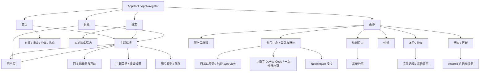

# 产品地图

## 文档职责与当前接受基线

本文件回答“App 现在有什么能力、用户从哪里进入、改动会影响哪里、交付前应回归什么”。实现方式以 `docs/architecture.md` 为准，测试强度与写操作授权以 `docs/testing-standard.md` 为准，具体命令以 `docs/operator-runbook.md` 为准。

- 当前接受基线：仓库现有能力默认都应保持可用，但不宣称零 bug。
- 用户最新明确要求优先；当前代码和实际运行结果是当前事实。本文与它们冲突时，先按事实处理，再修正文档。
- 精确的 Git revision、APK SHA、设备、登录态和一次性授权只记录在本机 `docs/emulator-baseline.md`，不得复制成长期稳定事实。
- 能力 ID 是开发与回归的共同语言，不是测试用例编号。开始改动前选择受影响 ID，交付时按 ID 报告自动测试、模拟器结果和未验证范围。
- 历史逃逸问题、精确失败 oracle 和最低可靠测试层见 `docs/regression-corpus.md`。
- 证据按 `STATIC_PASS`、`UNIT_PASS`、`UI_PASS`、`DEVICE_REPLAY_PASS`、`LIVE_PASS`、`APK_SANITY`、`NOT_VERIFIED`、`BLOCKED_BY_ENV` 分层；任何单层通过都不能代替其他层。

## 导航拓扑



详情和用户页可以嵌套打开；返回时必须恢复前一层 route、列表、筛选、草稿、回复状态和滚动上下文，而不是简单回到某个固定首页。

Modal、BottomSheet、WebView、系统浏览器、文件选择器、系统分享和安装器也是产品入口。验收不能只检查其父页面存在，必须检查打开、取消/返回及原页面状态恢复。

## 能力清单

表内“模拟器路径”是验收定位，不自动授予真实写操作权限。涉及回复、编辑、删除、互动、上传、投票、收藏切换、清空或登录清除时，仍按 `docs/testing-standard.md` 判断授权和恢复要求。

每个能力的完整契约由本节对应行、下方五站矩阵、证据覆盖索引和共享 seam 表共同组成：本节固定入口/前置状态、用户可见行为、代码与 Vitest；证据索引固定 UI、Replay、Live 和不可自动化边界；共享 seam 表固定改动时必须展开的关联能力。证据不足的行为必须标记 `NOT_VERIFIED`，不能靠缺少入口或一次空结果推断不支持。

### NAV：导航与状态恢复

| ID | 用户入口与行为契约 | 主要代码入口 | 自动测试 | 模拟器路径 |
| --- | --- | --- | --- | --- |
| `NAV-01` | 底部固定提供首页、搜索、收藏、更多；切换 tab 不应破坏各页已有状态。 | `src/app/AppNavigator.tsx`、`src/app/AppRoot.tsx`、`src/components/NavBar.tsx` | `src/app/AppNavigator.test.ts`、`src/androidSmokeGuard.test.ts` | 依次切换四个底部入口，再回到原 tab 检查状态。 |
| `NAV-02` | Feed、Search、Library 可进入 Topic；Topic 和 Library 可进入 User；User 可再次进入 Topic。 | `src/app/AppNavigator.tsx`、`src/app/useTopicSessionController.ts`、`src/app/useUserController.ts` | `src/topicSessionState.test.ts`、`src/userNavigation.test.ts` | 执行列表 → Topic → User → Topic 的嵌套链。 |
| `NAV-03` | 顶栏返回、Android 物理返回和嵌套详情返回一致；恢复筛选、列表、草稿、回复页和滚动快照。 | `src/app/backHandlerHelpers.ts`、`src/topicSessionState.ts`、`src/app/useTopicSessionController.ts` | `src/app/AppNavigator.test.ts`、`src/app/backHandlerHelpers.test.ts`、`src/app/useTopicSessionController.test.ts` | 从嵌套详情逐层返回，并复查原列表与搜索条件。 |

### FEED：首页与发现

| ID | 用户入口与行为契约 | 主要代码入口 | 自动测试 | 模拟器路径 |
| --- | --- | --- | --- | --- |
| `FEED-01` | 首页“全部”聚合五站主题，条目显示来源、分类、标题、作者、时间及适用统计；单站请求或凭据存储失败不应抹掉其他已成功来源，见 `REG-SOURCE-001`。HTTP 成功但带 `parse_empty` 诊断的页面不得当作合法空列表应用，见 `REG-SOURCE-002`。真实会话变化必须清除该站及可能混入旧私有数据的“全部”聚合 Query，同时保留其他站，见 `REG-TOPIC-022`。 | `src/screens/FeedScreen.tsx`、`src/app/useFeedController.ts`、`src/app/serverState.ts`、`src/sources/sourceGateway.ts` | `tests/ui/feed-controller-xiaoyinsi.test.tsx`、`src/app/serverState.test.ts`、`src/sources/sourceGateway.test.ts`、`src/sources/sourceGatewayContract.test.ts`、`src/sourceErrors.test.ts` | 首页 → 全部；确认五站来源均可见并能打开主题。 |
| `FEED-02` | 首页可切换 V2EX、linux.do、NodeSeek、妖火、小隐寺；每个单站只展示该站可用分类；切换后从目标列表首项开始展示。单站凭据存储读取失败必须明确失败，不能退化成匿名成功，见 `REG-SOURCE-001`；同一请求 key 刷新失败必须保留可信列表和 cursor，见 `REG-FEED-004`。 | `src/screens/FeedScreen.tsx`、`src/app/useFeedController.ts`、`src/feedCategoryRail.ts`、`src/feedLogic.ts`、`src/forumApi.ts`、`src/yaohuoApi.ts`、`src/localXiaoyinsi.ts`、`src/sources/sourceGateway.ts`、`src/components/listPerformance.ts` | `src/feedCategoryRail.test.ts`、`src/feedLogic.test.ts`、`tests/ui/feed-controller-xiaoyinsi.test.tsx`、`src/forumApi.test.ts`、`src/yaohuoApi.test.ts`、`src/localXiaoyinsi.test.ts`、`src/sources/sourceGatewayContract.test.ts`、`src/components/listPerformance.test.ts`、`tests/ui/feed-screen.test.tsx` | 逐站切换来源、分类并刷新，确认列表回到首项。 |
| `FEED-03` | 聚合页提供全部、未读、已读、收藏；阅读和收藏来自本机资料，筛选不改变原站数据。 | `src/app/useFeedController.ts`、`src/readerData.ts`、`src/topicListItemState.ts` | `src/readerData.test.ts`、`src/topicListItemState.test.ts`、`tests/ui/feed-screen.test.tsx` | 在首页逐个切换阅读筛选，核对条目状态。 |
| `FEED-04` | 单站排序进入请求 key：V2EX 全部/最新/最热，linux.do 与小隐寺各自支持最新/热门/新·所有/新·话题/新·回复，NodeSeek 新帖子/新评论；刷新、分页、旧请求和重复 cursor 不得串列表，切换排序后回到首项。同一 key 的刷新失败保留旧列表，失败或 `parse_empty` 分页不得混入半页结果、丢失失败 cursor 或误判无更多，见 `REG-FEED-004`、`REG-SOURCE-002`。小隐寺同一分类下的最新/热门也必须使用不同请求 key，见 `REG-XIAOYINSI-015`。 | `src/screens/FeedScreen.tsx`、`src/feedCategoryRail.ts`、`src/feedLogic.ts`、`src/app/useFeedController.ts`、`src/app/serverState.ts`、`src/localXiaoyinsi.ts`、`src/components/listPerformance.ts` | `src/feedLogic.test.ts`、`tests/ui/feed-controller-xiaoyinsi.test.tsx`、`src/app/serverState.test.ts`、`src/diagnostics.test.ts`、`src/localXiaoyinsi.test.ts`、`src/components/listPerformance.test.ts`、`tests/ui/feed-screen.test.tsx` | 单站切换排序，触发刷新和分页，确认列表归属、加载状态和首项位置。 |

### SEARCH：搜索

| ID | 用户入口与行为契约 | 主要代码入口 | 自动测试 | 模拟器路径 |
| --- | --- | --- | --- | --- |
| `SEARCH-01` | “全部”并行搜索五站，按固定来源顺序渐进展示不可折叠的预览区块；每站最多显示 2 条完整 TopicCard，非空区块可进入对应单站，局部请求或凭据存储失败可重试且不阻断成功来源，见 `REG-SOURCE-001`。条目继续展示来源、标题、作者和头像；小隐寺搜索命中回复时不得把回复者当作主题作者，见 `REG-XIAOYINSI-018`；不做跨站混排或自动分页。 | `src/screens/SearchScreen.tsx`、`src/app/useSearchController.ts`、`src/sources/sourceGateway.ts`、`src/localLinuxdo.ts`、`src/localXiaoyinsi.ts`、`src/components/TopicCard.tsx` | `src/app/useSearchController.test.ts`、`src/sources/sourceGatewayContract.test.ts`、`src/sourceErrors.test.ts`、`src/searchListItems.test.ts`、`src/localSources.test.ts`、`src/localXiaoyinsi.test.ts`、`tests/ui/search-screen.test.tsx` | 搜索 → 全部 → 提交同一关键词；检查五站预览、局部状态和“查看全部”，再进入单站打开结果。 |
| `SEARCH-02` | 可切换五个单站；首次输入关键词时，尚未启用的 Query 不得把提交按钮误标为 busy，见 `REG-SEARCH-006`。小隐寺单站同样按 `REG-XIAOYINSI-018` 展示真实 OP；连续列表不显示来源分组标题或展开状态，用户向下滚动且分页哨兵可见后自动续页，每次滚动最多加载一页。“全部”只提供每站最多 2 条预览且不分页。失败或 `parse_empty` 分页保留旧结果和失败页，只重试同一 cursor，见 `REG-SOURCE-002`。点击最近搜索立即以当前来源和筛选提交请求，历史最多 20 条且可逐条删除；清空关键词会清空当前结果。linux.do 的普通结果独立分页；开启 AI 搜索后仍以普通结果顺序为准，只在末尾追加去重后的 AI 独有结果。 | `src/screens/SearchScreen.tsx`、`src/app/useSearchController.ts`、`src/searchHistory.ts`、`src/searchListItems.ts`、`src/searchControllerResults.ts` | `src/app/useSearchController.test.ts`、`src/searchHistory.test.ts`、`src/searchListItems.test.ts`、`tests/ui/search-screen.test.tsx`、`tests/ui/search-controller-ai.test.tsx` | 在“全部”检查固定预览并进入单站；单站向下滚动自动续页；清空输入后点历史确认立即请求，再逐条删除历史；linux.do 开关 AI 后继续加载普通结果。 |
| `SEARCH-03` | 单站筛选按来源隔离：V2EX 支持相关性/时间、时间范围、节点、用户名、OR/AND；linux.do 支持全文/标题、层级分类候选、标签候选多选与任意/全部匹配、发帖人候选、回访范围、话题状态、快捷或精确日期、帖子/浏览量范围、专家回应及相关性/最新；小隐寺复用其中的标准 Discourse 子集（全文/标题、本站分类/标签/作者候选、任意/全部标签、回访、开放/关闭/公开/归档/无回复/单一用户/已解决/未解决、日期、帖子/浏览量范围和排序），但不显示 linux.do 专属的专家回应或 AI；并保留父分类包含子分类的服务端语义，见 `REG-XIAOYINSI-006`，标签候选参数边界见 `REG-XIAOYINSI-016`。NodeSeek 与妖火保留各自分类/排序筛选。分类、标签和发帖人只能提交对应站点候选；标签与用户请求防抖且拒绝过期响应，空作者输入不进入 Loading，分类或来源变化时不得重新展示旧标签候选。只有账号 Query 已确认身份的单一 linux.do、相关度排序和已提交查询下并行预取 AI 搜索，见 `REG-LINUXDO-005`；开关只使用当前缓存，AI 错误不阻断普通结果，新查询、筛选、排序或来源会清空缓存并关闭。弹层修改先留在草稿，关闭不应用，重置后仍需确认；确认后有关键词则从第一页重新搜索，分页和返回继续使用同一筛选。 | `src/searchFilters.ts`、`src/screens/SearchScreen.tsx`、`src/app/useSearchController.ts`、`src/localLinuxdo.ts`、`src/localXiaoyinsi.ts`、`src/sources/sourceGateway.ts` | `src/searchFilters.test.ts`、`src/localSources.test.ts`、`src/localXiaoyinsi.test.ts`、`src/sources/sourceGatewayContract.test.ts`、`src/app/useSearchController.test.ts`、`tests/ui/search-screen.test.tsx`、`tests/ui/search-controller-ai.test.tsx` | 逐站打开筛选弹层；linux.do 检查完整筛选及 AI；小隐寺检查标准子集、本站候选、解决状态、专属项缺席和父/子分类结果；检查取消、重置、确认、请求参数、分页和详情返回状态。 |
| `SEARCH-04` | 登录受限、验证、授权状态、WebView fallback、空结果和来源错误使用可理解状态；不能把登录/授权入口、旧请求或空解析误判成成功。首屏来源错误重试整来源；已有结果后的分页错误必须保留旧结果，在来源尾部提示并只重试失败页，不自动重试，见 `REG-SOURCE-002`。linux.do 前台验证按 `REG-LINUXDO-001/002/003` 在 overlay 内精确恢复原请求；过期 Cookie 按 `REG-LINUXDO-004` 以服务端当前用户或原站明确退出态判定，清理后回到匿名搜索。冷启动残留 `_t` 只作为候选，账号、搜索和 Topic 共用 canonical 会话视图；只有身份已确认才走登录搜索和 AI，匿名/登录模式使用不同 Query key，见 `REG-LINUXDO-005`。真实会话变化清除该来源普通/AI Query 并释放 Loading，但不清其他来源，见 `REG-TOPIC-022`；普通恢复失败时面板保持可重试，聚合与 AI 不自动弹出；小隐寺授权状态不阻断匿名公开搜索，也不触发 WebView；AI 的零结果、403/404 不可用、限流/网络可重试必须与普通搜索状态隔离。 | `src/screens/SearchScreen.tsx`、`src/searchListItems.ts`、`src/app/useVerificationController.ts`、`src/app/useHiddenBrowserFetchController.ts`、`src/app/HiddenBrowserHost.tsx`、`src/siteSessionPrompts.ts`、`src/app/useSearchController.ts`、`src/app/serverState.ts` | `src/searchListItems.test.ts`、`src/app/useVerificationController.test.ts`、`src/linuxdoActionClient.test.ts`、`src/loginWebViewScripts.test.ts`、`src/nodeseekBrowserFetchScript.test.ts`、`src/siteSessionPrompts.test.ts`、`src/localSources.test.ts`、`src/localXiaoyinsi.test.ts`、`src/app/useSearchController.test.ts`、`src/app/serverState.test.ts`、`src/sources/sourceGatewayContract.test.ts`、`tests/ui/search-screen.test.tsx`、`tests/ui/search-controller-ai.test.tsx`、`tests/ui/hidden-browser-host.test.tsx` | 在当前登录态检查四个可登录来源的状态提示、分页失败保留结果、原页重试和详情返回；linux.do AI 失败时确认普通结果仍可使用；保留自然残留 Cookie 冷启动并核对账号/搜索/写入口一致，不得靠清数据制造状态。 |

### TOPIC：主题详情与阅读

| ID | 用户入口与行为契约 | 主要代码入口 | 自动测试 | 模拟器路径 |
| --- | --- | --- | --- | --- |
| `TOPIC-01` | 五站主题详情展示来源、分类、标题、作者、时间、正文、适用统计和回复；Discourse 主题展示关闭、归档、置顶、已解决、采纳楼层和慢速模式等原站状态。小隐寺主题与回复的回应统计在未授权只读状态也可见，并按 `REG-XIAOYINSI-017` 使用本站 `/emojis.json` 图片而不引用 linux.do 资源；详情请求进入短后台且进程存活时，后台时长不得消耗请求 timeout 预算，恢复后原请求继续结算且不得自动重复发起，见 `REG-TOPIC-021`；读取本地 Cookie 的 `cookie-loaded` 观察事件不得取消正在执行的同站 Query，新凭据的 `session-updated` 及其他真实身份变化必须清除该来源旧详情、释放 Loading 并保留可重试目标，见 `REG-TOPIC-022`；来源失败或 `parse_empty` 应给出可重试状态且不得覆盖可信详情，见 `REG-SOURCE-002`。 | `src/screens/TopicScreen.tsx`、`src/screens/topic/TopicScreenBody.tsx`、`src/screens/topic/ReplyItem.tsx`、`src/app/useTopicController.ts`、`src/app/serverState.ts`、`src/discourseReactions.ts`、`src/discourseSourceReaders.ts`、`src/localXiaoyinsi.ts`、`src/sources/sourceGateway.ts` | `src/app/useTopicController.test.ts`、`src/app/sessionControllerHelpers.test.ts`、`src/app/serverState.test.ts`、`src/discourseReactions.test.ts`、`src/localYaohuo.test.ts`、`src/localXiaoyinsi.test.ts`、`src/topicDerivedData.test.ts`、`src/localSources.test.ts`、`tests/ui/topic-components.test.tsx`、`tests/ui/topic-reply-filters.test.tsx`、`tests/ui/topic-session-controller.test.tsx` | 从五站首页或搜索各打开一个主题；短后台路径另在请求仍在飞时按 Home，离线恢复后核对原详情无重试显示；小隐寺另核对主题状态、回应图片、采纳回复和站点切换资源隔离。 |
| `TOPIC-02` | 正文正确呈现 HTML、链接、表格、图片、附件、视频、表情和站点格式；小隐寺主题与评论 `cooked` 中的 `` 必须按 `REG-XIAOYINSI-017` 保持 inline 图片。块级正文图片冷加载只显示一个全宽 4:3 占位和一个连续 Spinner，同一 ImageRef 就绪后直接显示，热重进复用真实比例且不泄漏旧请求图片，见 `REG-TOPIC-004`；原生解码失败且响应明确为 SVG 时，正文、全屏图和已渲染缩略图使用有界、去重、保留请求凭据的兼容来源与固有比例，见 `REG-TOPIC-018` 至 `REG-TOPIC-020`；linux.do 正文引用默认显示原站简介，展开后显示被引帖完整内容，同一 reference key 的引用实例共享 Query transport 与缓存；离开 Topic 后精确取消，旧验证恢复不得落地，见 `REG-TOPIC-007`；图片预览支持多图选择、上一张/下一张、加载失败、关闭和按权限保存，快速重复点击只保存一次，见 `REG-TOPIC-006`。 | `src/screens/topic/TopicContentBlock.tsx`、`src/screens/topic/TopicBodyQuoteCard.tsx`、`src/app/useHtmlRenderingController.tsx`、`src/app/useImagePreviewController.ts`、`src/app/GlobalModalHost.tsx`、`src/components/ImagePreviewModal.tsx`、`src/compatibleImageSources.ts`、`src/imageSave.ts`、`src/topicContentHtml.ts`、`src/htmlImages.ts`、`src/nsVideoEmbeds.ts` | `src/topicContentHtml.test.ts`、`src/htmlImages.test.ts`、`src/nsVideoEmbeds.test.ts`、`src/compatibleImageSources.test.ts`、`src/imageSave.test.ts`、`src/localSources.test.ts`、`src/quotedPosts.test.ts`、`src/app/useTopicController.test.ts`、`tests/ui/topic-image-loading.test.tsx`、`tests/ui/topic-components.test.tsx`、`tests/ui/image-preview.test.tsx`、`tests/ui/image-preview-controller.test.tsx` | 打开含正文引用和媒体的主题，分别检查块图冷/热刷新、动态 SVG 比例与三张缩略图、inline emoji、简介/完整帖、预览切换、失败态、关闭和返回；保存需另按授权。 |
| `TOPIC-03` | 回复区支持分页、全部/只看楼主/只看带图/倒序、评论内查找、引用关系和楼层定位；评论引用默认显示简介，展开后显示匹配主题的完整帖子；同一 reference key 的引用实例共享 Query transport、缓存状态和精确 linux.do 验证恢复，见 `REG-TOPIC-007`；回复下一页验证恢复必须重试原 page/offset 而不是重取首屏，见 `REG-TOPIC-023`。评论保持透明平铺，仅引用区域使用卡片。Discourse 回复展示已采纳、Wiki、隐藏、折叠和系统动作等标准状态；linux.do 的待审批由 typed site extension 映射且不泄漏到其他站点，小隐寺映射其真实返回的采纳、隐藏、折叠与系统动作，并按 `REG-XIAOYINSI-017` 显示本站 reaction 图片和评论 inline emoji。筛选后的可见数量应同步更新，详情嵌套返回后恢复筛选与查找，刷新不能让旧请求覆盖新状态；小隐寺写后计数采用服务端权威总数，见 `REG-XIAOYINSI-008`。 | `src/screens/topic/ReplyItem.tsx`、`src/screens/topic/TopicScreenBody.tsx`、`src/discourseReactions.ts`、`src/screens/topic/topicScreenHelpers.ts`、`src/app/useTopicController.ts`、`src/app/useTopicSessionController.ts`、`src/app/serverState.ts`、`src/localXiaoyinsi.ts`、`src/quotedPosts.ts`、`src/themeStyles.ts` | `src/androidFeatureHelpers.test.ts`、`src/app/useTopicController.test.ts`、`src/app/serverState.test.ts`、`src/discourseReactions.test.ts`、`src/app/useTopicSessionController.test.ts`、`src/localXiaoyinsi.test.ts`、`src/screens/topic/topicScreenHelpers.test.ts`、`src/topicContentSplit.test.ts`、`src/theme.test.ts`、`tests/ui/topic-components.test.tsx`、`tests/ui/topic-reply-filters.test.tsx`、`tests/ui/topic-session-controller.test.tsx` | 逐项切换回复筛选并组合评论内查找，检查引用、原站状态、reaction 图片、inline emoji 和五站末尾内容间距，分页和进入作者页后返回主题原位置。 |
| `TOPIC-04` | 详情提供本机收藏；主题菜单提供分享、仅刷新评论、完整刷新、阅读设置和原站打开；操作后保持当前详情上下文。V2EX 评论刷新委托整篇读取时只有新详情实际落地才算成功，见 `REG-TOPIC-005`。 | `src/screens/topic/TopicMenu.tsx`、`src/app/useTopicController.ts`、`src/app/useTopicSessionController.ts`、`src/app/useReaderDataController.ts` | `src/app/AppNavigator.test.ts`、`src/app/useTopicController.test.ts`、`src/app/useTopicSessionController.test.ts`、`src/app/useReaderDataController.test.ts`、`tests/ui/topic-and-more-controls.test.tsx`、`tests/ui/topic-reply-filters.test.tsx`、`tests/ui/app-navigator.test.tsx` | 打开右上菜单；分享后取消，按授权检查可恢复的本机收藏；阅读设置返回回归见 `REG-TOPIC-002`。 |

### USER：用户页

| ID | 用户入口与行为契约 | 主要代码入口 | 自动测试 | 模拟器路径 |
| --- | --- | --- | --- | --- |
| `USER-01` | 从作者或关注列表进入用户页，展示来源、身份、适用统计、主题/回复列表和原站主页；分页与来源错误可恢复，已缓存或刚由 Profile Query 显示的下一 cursor 必须立即可加载，见 `REG-USER-001/006`；`parse_empty` 不得覆盖可信资料或推进 cursor，见 `REG-SOURCE-002`。凭据观察不得取消同站用户 Query；真实会话变化必须清除该来源旧资料、释放 Loading 并保留可重试身份，且不影响其他站，见共享回归 `REG-TOPIC-022`。小隐寺身份摘要与 authored topics 独立读取，主题只来自 `/topics/created-by/{username}.json`，见 `REG-XIAOYINSI-004`。 | `src/screens/UserScreen.tsx`、`src/app/useUserController.ts`、`src/app/serverState.ts`、`src/localXiaoyinsi.ts` | `src/app/useUserController.test.ts`、`src/app/sessionControllerHelpers.test.ts`、`src/app/serverState.test.ts`、`src/localXiaoyinsi.test.ts`、`src/screens/user/userScreenItems.test.ts`、`tests/ui/user-screen.test.tsx`、`tests/ui/user-controller-session.test.tsx` | Topic → 作者；Library → 关注用户；切换主题/回复。 |
| `USER-02` | 本机关注可切换，状态立即反映到用户页和 Library；从用户主题进入详情并返回时保留用户页状态。 | `src/app/useUserController.ts`、`src/app/useReaderDataController.ts`、`src/components/TopicCard.tsx` | `src/userNavigation.test.ts`、`src/components/TopicCard.test.ts`、`src/app/useReaderDataController.test.ts`、`tests/ui/user-screen.test.tsx` | 在获授权时关注后恢复原状态，再执行 User → Topic → 返回。 |

### LIBRARY：本机收藏、关注与历史

| ID | 用户入口与行为契约 | 主要代码入口 | 自动测试 | 模拟器路径 |
| --- | --- | --- | --- | --- |
| `LIBRARY-01` | 收藏帖子支持来源、该来源下的分类筛选和筛选数/总数提示，能打开详情和确认后取消本机收藏；它与原站收藏/书签是两套状态。切换 Library tab 会恢复“全部来源/全部分类”。 | `src/screens/LibraryScreen.tsx`、`src/screens/library/libraryScreenItems.ts`、`src/androidFeatureHelpers.ts`、`src/app/useReaderDataController.ts` | `src/androidFeatureHelpers.test.ts`、`src/androidSmokeGuard.test.ts`、`src/app/useReaderDataController.test.ts`、`tests/ui/library-screen.test.tsx` | 收藏 → 收藏帖子 → 来源/分类筛选 → Topic → 返回；取消收藏按授权。 |
| `LIBRARY-02` | 关注用户支持来源筛选，能打开用户页和取消关注；数量与用户页状态一致。切换到关注用户时不显示分类筛选。 | `src/screens/LibraryScreen.tsx`、`src/screens/library/libraryScreenItems.ts` | `src/androidSmokeGuard.test.ts`、`src/userNavigation.test.ts`、`tests/ui/library-screen.test.tsx` | 收藏 → 关注用户 → 来源筛选 → User → 返回。 |
| `LIBRARY-03` | 历史记录支持来源和分类筛选，可打开主题、删除单条或经确认后清空全部；读取、筛选和取消确认不能意外写原站。 | `src/screens/LibraryScreen.tsx`、`src/androidFeatureHelpers.ts`、`src/readerData.ts` | `src/androidFeatureHelpers.test.ts`、`src/readerData.test.ts`、`src/app/useReaderDataController.test.ts`、`tests/ui/library-screen.test.tsx` | 收藏 → 历史 → 来源/分类筛选 → Topic → 返回；删除和清空按授权。 |

### ACCOUNT：账号、Cookie、Device Code 与站点会话

| ID | 用户入口与行为契约 | 主要代码入口 | 自动测试 | 模拟器路径 |
| --- | --- | --- | --- | --- |
| `ACCOUNT-01` | 更多 → 账号中心统一显示 NodeSeek、linux.do、妖火、小隐寺状态；公共刷新由四个独立 Query 一次更新四个可登录来源，远端 data/error/busy 直接从 Query result 派生，不回写第二份 session projection；小隐寺只读账号检查也不得借授权 workflow event 回写再投影，见 `REG-ACCOUNT-016`。账户 Query 与当前验证 workflow 合并后的同一 view model 是账号页、搜索登录路径/AI 和 Topic 写入口的唯一会话权限来源，不能让各入口分别读取 workflow 或 Cookie 猜测，见 `REG-WRITE-016`、`REG-LINUXDO-005`。未登录、匿名、验证、授权中、失效和检查失败不得混淆。单站凭据、启动恢复、身份、摘要或刷新收尾失败只标记该站、保留可信状态并允许其他站完成，见 `REG-ACCOUNT-001/002/003/006/008`；刷新期间保存的新会话不能被旧 generation 的结果覆盖，见 `REG-ACCOUNT-009`；妖火和 linux.do 明确失效不得被普通清理或 Cookie 状态覆盖，见 `REG-ACCOUNT-004/008`。linux.do 不得用匿名可访问的 CSRF 接口或残留 `_t` 证明登录；冷启动 Cookie 只能建立候选态，未知检查只保留此前远端已确认的数据，不能保留本次 Cookie 猜测，见 `REG-LINUXDO-004/005`。已登录且已识别身份时可进入本人主页；小隐寺的重新授权与撤销授权仍由独立授权面板提供。 | `src/screens/more/AccountCenterPanel.tsx`、`src/app/useAccountStatusController.ts`、`src/app/useSessionController.ts`、`src/app/useAccountCredentialController.ts`、`src/app/useXiaoyinsiAuthController.ts`、`src/siteSessionState.ts` | `src/screens/more/accountCenter.test.ts`、`src/app/accountStatusHelpers.test.ts`、`tests/ui/account-status-controller.test.tsx`、`src/linuxdoActionClient.test.ts`、`src/app/sessionControllerHelpers.test.ts`、`src/app/serverState.test.ts`、`tests/ui/account-controller.test.tsx`、`src/app/accountCredentialDiagnostics.test.ts`、`src/siteSessionState.test.ts`、`tests/ui/search-controller-ai.test.tsx`、`tests/ui/xiaoyinsi-auth-controller.test.tsx`、`tests/ui/topic-actions-controller.test.tsx` | 更多 → 账号中心 → 刷新账号状态；逐站核对状态；保留自然残留 Cookie 冷启动时核对 linux.do 账号、搜索与写入口一致，已登录小隐寺进入本人主页后返回。 |
| `ACCOUNT-02` | NodeSeek、linux.do、妖火登录/验证必须在 App 内 WebView 完成；Cookie bridge、generation 和 fallback 不能让旧会话覆盖新状态，桥接消息还必须来自对应站点的 HTTPS host，见 `REG-ACCOUNT-003/004/005/009`。NodeSeek/妖火只有 SecureStore、WebView Cookie 与关联媒体 Cookie 都按同一 current generation 清理成功后才能显示已清除，部分失败或 stale 保留可重试/新会话状态；NodeSeek、linux.do、妖火写操作确认登录失效后，即使本机清理失败也必须保留 expired 与原错误并正常收口，见 `REG-ACCOUNT-007/009`。linux.do 读取恢复由 `REG-LINUXDO-001/002/003` 固定：Cookie 只是候选，原读取成功应用才算恢复；明确退出态按 `REG-LINUXDO-004` 条件清除旧登录 Cookie、保留 clearance，模糊页面不得猜测；仍为 CF 或普通恢复失败时面板保持可重试，手动入口检测后保持打开。NodeSeek 设备 Replay 必须直接由 WebView 可访问树中的真实页面内容证明页面可用，不能把弹层已打开、`onLoadEnd` 或内部 ready testID 当作页面可用；错误与 readiness 互斥由 `REG-NODESEEK-002` 的 UI 测试固定，设备判据见 `REG-NODESEEK-003`。清除某站登录只影响该站网站会话。 | `src/app/useAccountController.ts`、`src/app/useSessionController.ts`、`src/app/GlobalModalHost.tsx`、`src/app/LinuxDoVerifyModal.tsx`、`src/components/LoginWebViewModal.tsx`、`src/screens/more/MorePanels.tsx`、`src/loginWebViewScripts.ts` | `tests/ui/account-controller.test.tsx`、`src/app/useVerificationController.test.ts`、`src/loginWebViewScripts.test.ts`、`src/app/sessionControllerHelpers.test.ts`、`tests/ui/topic-actions-controller.test.tsx`、`src/nodeseekBrowserFetchScript.test.ts`、`tests/ui/hidden-browser-host.test.tsx`、`src/cookieCleanup.test.ts`、`src/yaohuoCookies.test.ts`、`src/androidSmokeGuard.test.ts`、`tests/ui/account-site-panels.test.tsx` | 分别打开原三站 App 内登录/验证页；NodeSeek 等待真实 WebView 标题、logo 和正文入口后返回；linux.do 只用自然 challenge 验收且不清 Cookie；这三站禁止用外部浏览器代替，清除登录需明确授权。 |
| `ACCOUNT-03` | 保存的账号密码按站点隔离在 SecureStore；只在可信登录 URL/字段主动填入且不自动提交。单站摘要读取失败不得隐藏其他站已保存摘要，NodeSeek 登录桥接只接受站点自身 HTTPS 消息，见 `REG-ACCOUNT-005/006`；凭据删除与网站退出互不等价。 | `src/credentialVault.ts`、`src/loginFormAdapters.ts`、`src/app/useAccountCredentialController.ts`、`src/app/accountCredentialDiagnostics.ts`、`src/app/useAccountController.ts` | `src/credentialVault.test.ts`、`src/loginFormAdapters.test.ts`、`src/app/useAccountCredentialController.test.ts`、`src/app/accountCredentialDiagnostics.test.ts`、`tests/ui/account-controller.test.tsx` | 打开可信登录页检查填入行为；不展示或记录密码。 |
| `ACCOUNT-04` | 账号中心保留 NodeSeek 签到/NodeImage、linux.do 与小隐寺的等级进度/活跃数据和四个可登录来源的原站主页等站点服务；小隐寺等级只走独立 User API Key，并在授权管理下方以独立“查看等级”入口呈现，见 `REG-XIAOYINSI-013/014`；NodeSeek 签到使用独立的全局 mutation 身份，不能继承残留 Topic，见 `REG-WRITE-015`；验证阻塞时明确提示，不伪造成功。 | `src/app/useAccountController.ts`、`src/app/useXiaoyinsiAuthController.ts`、`src/screens/MoreScreen.tsx`、`src/screens/more/LinuxDoLevelPanel.tsx`、`src/discourseLevel.ts`、`src/linuxdoLevel.ts`、`src/localXiaoyinsi.ts`、`src/nodeseekActions.ts`、`src/loginWebViewScripts.ts` | `src/linuxdoLevel.test.ts`、`src/localXiaoyinsi.test.ts`、`tests/ui/more-screen.test.tsx`、`tests/ui/xiaoyinsi-auth-controller.test.tsx`、`tests/ui/topic-actions-controller.test.tsx`、`src/nodeseekActions.test.ts`、`src/nodeimageAuthWebViewScripts.test.ts`、`src/accountSessionLabels.test.ts` | 展开 linux.do 与小隐寺等级及活跃数据；签到等写入和 NodeImage 授权按当前授权边界。 |
| `ACCOUNT-05` | 支持时，保存的账号密码使用 Android 用户身份认证保护；设备不支持时必须明确确认后才降级为本机加密。填入和删除的认证取消不得损坏凭据，用户界面统一使用“用户身份认证”。 | `src/credentialVault.ts`、`src/screens/more/AccountCenterPanel.tsx`、`src/app/useAccountCredentialController.ts` | `src/credentialVault.test.ts`、`tests/ui/account-center.test.tsx` | 账号中心 → 自动填入；只检查设置、管理、提示和取消，不展示密码，不通过清登录制造状态。 |
| `ACCOUNT-06` | 小隐寺只使用 Discourse Device Code：检查站点能力，Android Keystore 生成 RSA 2048/OAEP 密钥；系统浏览器只承载一次性 Google / Discord 身份确认与站点授权页，不提供 Cookie 或 App 登录态。App 前台按服务端间隔轮询、解密并严格校验 nonce，之后只由 User API Key、Client ID 和 `/session/current.json` 维护会话；已认证读取的 401/403 先复核该会话，不把单主题无权限直接当成退出；写操作授权复核失败不得覆盖原始操作错误或抛出恢复异常，见 `REG-XIAOYINSI-021`。Token 已保存后的普通 session 复核失败先重试现有授权，不重复生成 Device Code，见 `REG-XIAOYINSI-019`。重授权拒绝、取消或过期后的旧会话复核若只是暂时失败，保留可信状态而不清空，见 `REG-XIAOYINSI-020`。授权可在十分钟内跨进程恢复，后台暂停轮询；重授权、取消、撤销及卸载都必须使迟到的 poll/session 结果失效。User API Key 独立保存且不进 Cookie、ReaderData、备份或诊断，也不伪装成 `cookieSummary`。服务端撤销失败保留本机凭据；成功后以清理 tombstone 保证重启先清本机材料且绝不恢复旧 Device Code，部分失败退出并提供重试，见 `REG-XIAOYINSI-005`、`REG-XIAOYINSI-007`；不支持 Device Code 时保持匿名阅读，不降级 WebView。 | `src/xiaoyinsiAuth.ts`、`src/xiaoyinsiKeystore.ts`、`src/app/useXiaoyinsiAuthController.ts`、`src/app/useTopicActionsController.ts`、`src/screens/more/XiaoyinsiAuthPanel.tsx`、`src/sources/sourceGateway.ts`、`plugins/withXiaoyinsiAuthModule.js` | `src/xiaoyinsiAuth.test.ts`、`src/sources/sourceGatewayContract.test.ts`、`tests/ui/topic-actions-controller.test.tsx`、`tests/ui/xiaoyinsi-auth-controller.test.tsx`、`tests/ui/more-screen.test.tsx`、`src/releasePackaging.test.ts` | 账号中心 → 小隐寺 → 授权登录；只检查验证码复制、一次性授权页打开、等待/取消/过期/重试。真实 Google / Discord 身份确认由用户操作，Agent 不读取或输入凭据。 |

### WRITE：回复、编辑、删除、互动与上传

| ID | 用户入口与行为契约 | 主要代码入口 | 自动测试 | 模拟器路径 |
| --- | --- | --- | --- | --- |
| `WRITE-01` | NodeSeek、linux.do、妖火详情按账户 Query 与当前验证 workflow 合并后的登录态显示回复和楼层回复，不能读取旧 workflow state 造成账号页与入口相反，见 `REG-WRITE-016`；小隐寺还必须满足主题 `can_create_post`，不能回复时仍保留原站允许的逐条互动，见 `REG-XIAOYINSI-007`。三站写请求只允许原 credential generation 提交结果，换号后的旧失败不得清新会话或弹登录，见 `REG-ACCOUNT-009`。编辑器 BottomSheet 支持打开/收起、草稿恢复、引用、常用格式、表情和图片插入；小隐寺 Markdown 与上传入口由 `REG-XIAOYINSI-002` 固定，并按 `REG-XIAOYINSI-017` 从本站 emoji 目录插入 `:name:`；图片 Markdown 写入后解除编辑器忙碌态；提交期间防重复。V2EX 保持只读。 | `src/screens/topic/ReplyComposer.tsx`、`src/screens/topic/ReplyComposerSheet.tsx`、`src/screens/topic/TopicScreenBody.tsx`、`src/discourseSourceReaders.ts`、`src/app/useTopicActionsController.ts`、各站 action client | `tests/ui/topic-actions-controller.test.tsx`、`src/app/topicActionControllerHelpers.test.ts`、`src/app/topicActionHelpers.test.ts`、`src/replyImageUpload.test.ts`、`tests/ui/reply-composer.test.tsx`、`tests/ui/topic-reply-filters.test.tsx` | 只检查入口、输入、表情草稿、收起/恢复和权限；真实评论提交必须按授权。 |
| `WRITE-02` | 编辑/删除只按原站解析出的逐条权限显示；Discourse 权限缺失必须 fail-closed。NodeSeek 编辑使用真实 commentId；当前请求在未传 token 时生成 16 位 `csrf-token`。linux.do 与小隐寺使用原站 edit/delete 权限；小隐寺认证 Topic/Posts 读取必须请求并映射原始 Markdown，匿名读取不请求，见 `REG-XIAOYINSI-010`；删除经服务器确认后本地移除并只静默刷新回复切片，不整篇重载，见 `REG-XIAOYINSI-012`。妖火仅在存在删除链接时可删且不提供编辑；NodeSeek 未确认删除时不显示。 | `src/app/useTopicActionsController.ts`、`src/discourseModel.ts`、`src/discourseActions.ts`、`src/localXiaoyinsi.ts`、`src/nodeseekActions.ts`、`src/xiaoyinsiActions.ts`、`src/yaohuoActions.ts` | `src/discourseModel.test.ts`、`src/discourseActions.test.ts`、`src/localXiaoyinsi.test.ts`、`src/nodeseekActions.test.ts`、`src/xiaoyinsiActions.test.ts`、`src/yaohuoActions.test.ts`、`src/app/topicActionControllerHelpers.test.ts`、`tests/ui/topic-actions-controller.test.tsx` | 检查自己的回复操作菜单和小隐寺编辑器预填；真实编辑/删除评论必须按授权和清理约束。 |
| `WRITE-03` | NodeSeek 支持点赞、鸡腿、反对、原站收藏和投票；其投票只在读取/提交请求携带原站已验证的动态签名，未投时隐藏结果票数，成功加载后在原标记位置的同一正文树内渲染卡片，不拆散前后文本、不增加正文分隔线且不追加底部副本，部分失败保留失败标记并降级为 `partial`，见 `REG-WRITE-007`、`REG-WRITE-009`、`REG-WRITE-010`。NodeSeek 提交前必须确认“提交后不可修改”，取消为零请求；确认后只 POST 一次，再 GET 一次权威快照并同步当前 Topic 与活动 route snapshot，GET 失败只保留已投/所选项和未知票数，不重投，见 `REG-WRITE-007`、`REG-WRITE-008`。linux.do 与小隐寺的点赞、原站书签和投票使用同一 Discourse 语义，先由 `REG-WRITE-016` 的合并会话投影确认站点可写，再叠加主题或逐条对象权限；点赞/书签先局部显示 optimistic 状态，请求失败恢复原状态，确认后同步活动 route snapshot。linux.do 首次投票成功后的已知选项票数与参与人数只增量一次，见 `REG-WRITE-001`。小隐寺 Topic 取消收藏不依赖 bookmark id，见 `REG-XIAOYINSI-003`；已点赞时即使 `can_act=false` 仍允许取消，见 `REG-XIAOYINSI-009`；不整篇重载，见 `REG-XIAOYINSI-012`。妖火支持可切换的原站收藏和投票：收藏查询失败不阻断详情且诊断为 `partial`，只有服务端确认后才局部更新，不进入整页忙碌态或重新提交正文，见 `REG-WRITE-002` 至 `REG-WRITE-005`。NodeSeek、linux.do、妖火互动的成功/失败提交也受 credential generation 所有权保护，见 `REG-ACCOUNT-009`。所有已确认 action 同步活动 route snapshot，见 `REG-WRITE-006`。V2EX 只展示互动信息；不可逆或客户端不能撤销的操作不得按“可恢复切换”验收。 | `src/screens/topic/TopicActionBar.tsx`、`src/screens/topic/TopicPolls.tsx`、`src/app/useTopicActionsController.ts`、`src/app/useTopicSessionController.ts`、`src/discourseActions.ts`、`src/discourseSourceActions.ts`、`src/discoursePermissions.ts`、`src/nodeseekPolls.ts`、各站 action client、`src/yaohuoApi.ts` | `src/discourseActions.test.ts`、`src/discourseSourceActions.test.ts`、`src/discoursePermissions.test.ts`、`src/localSources.test.ts`、`src/xiaoyinsiActions.test.ts`、`src/xiaoyinsiActionClient.test.ts`、`src/nodeseekActions.test.ts`、`src/nodeseekActionClient.test.ts`、`tests/ui/topic-actions-controller.test.tsx`、`src/topicActionState.test.ts`、`src/yaohuoApi.test.ts`、`src/screens/topic/TopicPolls.test.ts`、`tests/ui/topic-components.test.tsx`、`tests/ui/topic-reply-filters.test.tsx`、`tests/ui/topic-session-controller.test.tsx` | 先看入口和权限；NodeSeek 未投目标只可打开确认并取消，真实提交必须按具体对象和选项逐次授权且不得重试；其余互动按站点、对象和可逆性核对最终状态。 |
| `WRITE-04` | NodeSeek 经 NodeImage、linux.do 与小隐寺经各自 `/uploads.json`、妖火经图床上传并插入对应 Markdown/UBB；上传失败不得提交残缺正文或泄露凭据；四站都由完整上传工作流持有忙碌态，草稿写入后立即恢复编辑器。 | `src/replyImageUpload.ts`、`src/discourseActions.ts`、`src/discourseSourceActions.ts`、`src/app/useTopicActionsController.ts` | `src/replyImageUpload.test.ts`、`src/discourseActions.test.ts`、`src/discourseSourceActions.test.ts`、`src/linuxdoUpload.test.ts`、`tests/ui/topic-actions-controller.test.tsx` | 只检查选择/授权入口；真实上传因残留文件风险需单独授权。 |

### DATA：本机资料、持久化与备份

| ID | 用户入口与行为契约 | 主要代码入口 | 自动测试 | 模拟器路径 |
| --- | --- | --- | --- | --- |
| `DATA-01` | 已读、本机收藏、关注和历史作为一个 ReaderData 领域保存；写入排队、失败回滚、旧保存完成和多次快速修改不得丢数据。 | `src/readerData.ts`、`src/readerDataStore.ts`、`src/app/useReaderDataController.ts` | `src/readerData.test.ts`、`src/readerDataStore.test.ts`、`src/app/useReaderDataController.test.ts` | 重启前后核对收藏/关注/历史；真实切换后恢复原状态。 |
| `DATA-02` | 当前 ReaderData 使用 AsyncStorage 单键 `reader-data`、格式版本 2；设置用 `reader-settings`，搜索历史用 `reader-search-history`。不得在无迁移和回退方案时改变 key、结构或写入时序。 | `src/readerDataStore.ts`、`src/readerData.ts`、`src/searchHistory.ts`、`src/app/useSearchController.ts` | `src/readerDataStore.test.ts`、`src/readerData.test.ts`、`src/searchHistory.test.ts` | 覆盖安装/重启后核对既有本机数据；不得清 App 数据制造状态。 |
| `DATA-03` | JSON 备份只包含允许的本机资料和设置；限制大小/深度并拒绝敏感字段。导出取消、损坏导入、合并和失败回滚要有明确结果。Cookie、密码、代理和 token 永不进入备份。 | `src/screens/more/MorePanels.tsx`、`src/app/useBackupStatusController.ts`、`src/readerBackup.ts`、`src/backupImportFile.ts`、`src/backupOperation.ts`、`src/backupFiles.ts` | `src/readerBackup.test.ts`、`src/backupImportFile.test.ts`、`src/backupOperation.test.ts`、`src/appSecurity.test.ts`、`tests/ui/topic-and-more-controls.test.tsx`、`tests/ui/backup-status-controller.test.tsx` | 更多 → 备份/恢复；导出或导入需按数据风险授权。 |

### MORE：工具、代理、诊断、外观与更新

| ID | 用户入口与行为契约 | 主要代码入口 | 自动测试 | 模拟器路径 |
| --- | --- | --- | --- | --- |
| `MORE-01` | HTTP/SOCKS5 服务器代理保存在安全存储，可测试延迟、启停；启用、关闭或配置读取失败时 App 请求和 WebView 都必须阻止，不能把未知状态当作未启用后静默直连，本地开发地址除外，见 `REG-PROXY-001`。 | `src/networkProxy.ts`、`src/app/useNetworkProxyController.ts`、`src/screens/more/NetworkProxyModal.tsx` | `src/networkProxy.test.ts`、`src/networkProxyControllerGuard.test.ts`、`src/webViewProxyGuard.test.ts`、`src/appUpdateProxyGuard.test.ts`、`tests/ui/network-proxy-modal.test.tsx` | 更多 → 服务器代理 → 延迟测试；获授权时启用后加载真实页面，再关闭并确认最终状态。 |
| `MORE-02` | 诊断记录请求阶段、归属和终态，局部来源、凭据、解析或写后刷新失败必须把整体成功终态提升为 `partial`，但不记录内容或 secret；两份 1 MiB 轮转，导出走系统分享且清理临时文件。 | `src/diagnostics.ts`、`src/diagnosticFileStore.ts`、`src/sources/sourceGateway.ts` | `src/diagnostics.test.ts`、`src/diagnosticFileStore.test.ts`、`src/sources/sourceGatewayContract.test.ts`、`tests/ui/account-status-controller.test.tsx`、`tests/ui/topic-actions-controller.test.tsx` | 更多 → 诊断日志 → 生成/分享后取消；检查无敏感可见内容。 |
| `MORE-03` | 外观支持字号、浅/深色主题、列表密度、行距、正文宽度和字体；切换立即生效并持久化，不应挤压主要页面。 | `src/screens/more/MorePanels.tsx`、`src/app/useReaderSettingsController.ts`、`src/theme.ts`、`src/themeCore.ts` | `src/app/useReaderSettingsController.test.ts`、`src/theme.test.ts`、`tests/ui/topic-and-more-controls.test.tsx` | 更多 → 外观；逐项切换，检查首页/详情/弹层，并恢复原值。 |
| `MORE-04` | 检查更新读取可信 manifest，比较版本并校验下载；检查与下载在 controller 层互斥，不能在新检查期间下载旧 update info，见 `REG-UPDATE-001`。安装由 Android 系统确认，代理保护覆盖更新请求。 | `src/appUpdate.ts`、`src/app/useAppUpdateController.ts` | `src/appUpdate.test.ts`、`src/app/useAppUpdateController.test.ts`、`src/appUpdateProxyGuard.test.ts` | 更多 → 检查更新；安装包下载/安装按发布风险授权。 |
| `MORE-05` | 开发版测试工具只临时模拟四个可登录来源匿名，不删除 Cookie 或小隐寺授权，重启失效；正式版不显示。 | `src/screens/MoreScreen.tsx`、`src/app/useSessionController.ts` | `src/androidFeatureHelpers.test.ts`、`src/androidSmokeGuard.test.ts` | 开发包 → 更多 → 测试工具；关闭开关或重启后核对真实状态。 |

### RELEASE：构建、打包与发布

| ID | 用户入口与行为契约 | 主要代码入口 | 自动测试 | 验收路径 |
| --- | --- | --- | --- | --- |
| `RELEASE-01` | `package.json`、`app.json`、更新 manifest 和产物版本一致；正式 arm64 APK 必须正式签名，x86_64 smoke 包不得上传。 | `package.json`、`app.json`、`scripts/check-version.mjs`、`scripts/release-android.mjs` | `src/releasePackaging.test.ts` | 按 `docs/operator-runbook.md` 运行 release，只在明确发布任务中执行。 |
| `RELEASE-02` | 发布候选覆盖安装到指定保留登录态设备；覆盖安装后的第一次启动必须从启动前设备 epoch 与 marker 起进入有界包级日志窗口，启动与日志只形成 `APK_SANITY`；tracked `.ad` 旅程形成 `DEVICE_REPLAY_PASS`，两者都通过才满足发布设备闸门，但仍不代表全部功能通过。Replay 要求 `agent-device >= 0.19.0`，不自行关闭 session，由 test harness 先停止录屏再 cleanup；runner 只恢复当前唯一 session/device manifest 归属的录屏，active manifest、对应 `.tmp`、工具 MP4 或 recorder 只要存在就阻断，未知现场不得清理，见 `REG-OPS-007`、`REG-OPS-008`。 | `scripts/agent-device-runtime.mjs`、`scripts/smoke-android.mjs`、`scripts/run-device-replay.mjs`、`scripts/release-android.mjs`、`tests/device/*.ad` | `src/androidSmokeGuard.test.ts`、`src/releasePackaging.test.ts` | 指定 `WZ_ANDROID_SMOKE_DEVICE` 执行 APK sanity 与 Replay；不得清数据、恢复旧 APK、清理未知录屏或上传 smoke APK。 |

## 本轮新增回归绑定

下表补充能力主表的事故 seam；修改这些能力时，除主表测试外还必须执行对应编号的精确 oracle。

| 能力 ID | 新增回归 | 最低回归入口 |
| --- | --- | --- |
| 关联 `FEED-02`、`FEED-04` | `REG-FEED-005` | `tests/ui/feed-controller-xiaoyinsi.test.tsx`：单站分类错误不得提交为空成功态。 |
| 关联 `SEARCH-01`、`SEARCH-04` | `REG-SEARCH-004` | `tests/ui/search-controller-ai.test.tsx`：来源级重试只由本次来源判断。 |
| 关联 `SEARCH-02`、`SEARCH-04` | `REG-SEARCH-005` | `tests/ui/search-controller-ai.test.tsx`：失败分页的 partial items 和新 cursor 均不落地。 |
| 关联 `SEARCH-01`、`SEARCH-02` | `REG-SEARCH-006` | `tests/ui/search-controller-ai.test.tsx`：未提交的 disabled Query 不得把首次搜索入口锁成 busy。 |
| 关联 `ACCOUNT-01`、`SEARCH-01` 至 `SEARCH-04`、`WRITE-01`、`WRITE-03` | `REG-LINUXDO-005` | session/account/search UI、Query key、Gateway 与 `src/localSources.test.ts`：冷启动残留 Cookie 只建立候选态，身份未知时保持匿名，已确认登录与匿名搜索不共用缓存或 transport；`more-readonly.ad` / `search-multi-source.ad` 不硬编码动态登录和 AI 状态。 |
| 关联 `TOPIC-01`、`TOPIC-03` | `REG-TOPIC-016` | `src/localSources.test.ts`：V2EX 致谢数使用 quote-aware 可见文本。 |
| 关联 `TOPIC-02`、`TOPIC-03`、`NAV-02`、`USER-01` | `REG-TOPIC-008` 至 `REG-TOPIC-013` | `src/appUtils.test.ts`、`src/androidFeatureHelpers.test.ts`、`src/htmlImages.test.ts`、`src/localHtml.test.ts`、`src/topicContentHtml.test.ts`：正文链接、复制、高亮、sticker 和 mention 的 host/HTML 边界。 |
| 关联 `TOPIC-01` | `REG-TOPIC-021` | `src/localSources.test.ts`：短后台不消耗共享请求 timeout 预算，恢复后原 NodeSeek direct 请求成功且不进入 WebView fallback。 |
| 关联 `TOPIC-01`、`USER-01`；共享所有来源读取 | `REG-TOPIC-022` | `tests/ui/topic-session-controller.test.tsx`、`src/app/sessionControllerHelpers.test.ts`、`src/app/serverState.test.ts` 与 Feed/Search/User UI 会话测试：`cookie-loaded` 不取消当前同站 Query；`session-updated` 等真实变化清除该 source 与 `all` Query cache、释放对应 Query Loading，其他来源保持不变；linux.do 精确 recovery lane 在 reset 后保留分页/回复/引用合并基线。 |
| 关联 `TOPIC-01`、`TOPIC-03`、`ACCOUNT-02` | `REG-TOPIC-023` | `tests/ui/topic-session-controller.test.tsx`：回复下一页验证恢复继续执行同一个 `fetchNextPage` page/offset，保留首屏并只合并一次。 |
| 关联 `TOPIC-02` | `REG-TOPIC-014`、`REG-TOPIC-015` | `src/imageSave.test.ts`：下载超时和真实图片扩展名。 |
| 关联 `TOPIC-04` | `REG-TOPIC-017` | `src/app/topicActionHelpers.test.ts`：系统分享与剪贴板双失败必须收口并提示。 |
| 关联 `TOPIC-02`；共享 `TOPIC-01`、`TOPIC-03`、`NAV-03` | `REG-TOPIC-018`、`REG-TOPIC-020` | compatible-image unit 与 topic/image-preview UI 测试：动态 SVG 的受限恢复、比例、全屏图和未选中缩略图。 |
| 关联 `TOPIC-02`、`ACCOUNT-01` | `REG-TOPIC-019` | preview/modal/controller/save 测试：NodeSeek 媒体凭据贯穿预览、尺寸、缩略图和保存下载。 |
| 关联 `USER-01` | `REG-USER-001`、`REG-USER-003`、`REG-USER-004`、`REG-USER-005`、`REG-USER-006` | `src/app/useUserController.test.ts`、`tests/ui/user-controller-session.test.tsx` 与四站来源测试：两 Tab cursor 所有权、Profile/Infinite Query seed 时序、站内用户路由和显式零统计。 |
| 关联 `USER-02`、`LIBRARY-02`、`DATA-01` | `REG-USER-002`、`REG-DATA-005` | `src/readerData.test.ts`：来源 URL 恢复和关注用户统计清洗。 |
| 关联 `ACCOUNT-01`、`ACCOUNT-02` | `REG-ACCOUNT-011` 至 `REG-ACCOUNT-015` | hidden-browser、session、action-client、Cookie cleanup 测试：消息来源、完整 Cookie、typed 失效、损坏存储和尽力清理。 |
| 关联 `ACCOUNT-04`、`WRITE-04` | `REG-ACCOUNT-010` | NodeImage bridge、凭据和 action controller 测试：阶段来源与 generation 所有权。 |
| 关联 `ACCOUNT-06`、`WRITE-01`、`WRITE-03` | `REG-XIAOYINSI-022` | `tests/ui/topic-actions-controller.test.tsx`：写操作复核明确失效后打开授权，未明确失效时不退出。 |
| 关联 `WRITE-02`、`TOPIC-03`、`NAV-03` | `REG-WRITE-011` 至 `REG-WRITE-013` | session、妖火 action client 和 source catalog 测试：确认删除的本地提交、两阶段确认与能力 fail-closed。 |
| 关联 `WRITE-04` | `REG-WRITE-014` | `src/replyImageUpload.test.ts`：异常百分号 URI 安全回退。 |
| 关联 `DATA-01`、`DATA-02`、`DATA-03` | `REG-DATA-002` 至 `REG-DATA-004` | store 与 reader-data controller 测试：完整快照排队、回滚失败熔断和强制恢复写。 |
| 关联 `MORE-01` | `REG-PROXY-002`、`REG-PROXY-003` | proxy controller/modal 测试：持久化与原生应用串行、损坏状态显式恢复。 |
| 关联 `MORE-04` | `REG-UPDATE-002` | `src/appUpdate.test.ts`：原生安装请求返回 false 必须失败。 |

## 筛选、排序与列表状态契约

筛选不是一个按钮，而是“选项 → 是否应用 → 请求/本机数据归属 → 分页 → 返回恢复”的完整能力。修改下列任一状态时，必须按同一行展开回归。

| 能力 ID | 入口与当前选项 | 状态与数据契约 | 最低回归 |
| --- | --- | --- | --- |
| 关联 `FEED-02` | 首页来源：全部、V2EX、linux.do、NodeSeek、妖火、小隐寺。 | 默认“全部”；切换来源会清空分类、回到列表首项并重新读取目标来源，各站排序值彼此独立保留；不能把上一个来源的列表、可视位置、错误或分页 cursor 带入。 | `tests/ui/feed-controller-xiaoyinsi.test.tsx`、`src/app/serverState.test.ts`、`src/components/listPerformance.test.ts`；逐站切换并确认首项可见。 |
| 关联 `FEED-03` | 聚合首页阅读筛选：全部、未读、已读、收藏。 | 仅“全部来源”显示；基于 ReaderData 本机过滤，不改变原站数据；非“全部”时不触发远端自动分页循环。 | `src/feedCategoryRail.test.ts`、`src/readerData.test.ts`；逐项切换并核对可见状态。 |
| 关联 `FEED-02`、`FEED-04` | 单站分类来自当前站；排序默认分别为 V2EX“全部”、linux.do“最新”、NodeSeek“新帖子”、小隐寺“最新”，妖火无额外排序；linux.do 与小隐寺都提供最新、热门、新·所有、新·话题、新·回复。 | linux.do 与小隐寺可同时使用分类和排序；V2EX/NodeSeek 选中分类后隐藏排序入口但保留该站已选排序，清空分类后恢复；分类或排序变化后回到首项，刷新、加载更多和空态必须属于当前组合；小隐寺不同排序不得复用同一非空 Feed state。 | `src/feedCategoryRail.test.ts`、`src/feedLogic.test.ts`、`src/forumApi.test.ts`、`src/localXiaoyinsi.test.ts`、`src/components/listPerformance.test.ts`、`tests/ui/feed-screen.test.tsx`、`tests/ui/feed-controller-xiaoyinsi.test.tsx`、`tests/device/four-source-feed.ad`；各站至少验证默认、一个分类和一个非默认排序。 |
| 关联 `SEARCH-02` | 关键词输入/清空/提交、最近搜索点击提交与逐条删除；“全部”按站点固定预览，单站为连续完整列表。 | 空关键词不请求；点历史立即使用当前来源和筛选提交；输入与已提交词不一致时旧结果立即失效；分页使用已提交词而不是正在编辑的词。自动分页只有单站用户滚动后才能 arm，一次滚动最多一页；“全部”不生成分页入口。 | `src/searchHistory.test.ts`、`src/searchListItems.test.ts`、`src/app/useSearchController.test.ts`、`tests/ui/search-screen.test.tsx`、`tests/ui/search-controller-ai.test.tsx`；检查历史提交/删除、概览预览、单站列表、局部错误、自动分页和 `REG-SEARCH-002`。 |
| 关联 `SEARCH-03` | V2EX：排序、24小时/7天/30天/1年、节点、作者、任一/全部关键词；linux.do：全文/标题、层级分类候选、标签候选多选与任意/全部、作者候选、回访范围、状态、快捷/精确日期、帖子/浏览量范围、专家回应、排序和 AI 搜索；小隐寺：同一套标准 Discourse 子集和本站候选，包含原站解决/未解决状态，但不含专家回应或 AI；NodeSeek：分类、新评论/新帖子；妖火：版块。 | 仅单站显示筛选；五站草稿和已应用值互相隔离。linux.do 与小隐寺标签/作者不接受任意文本，候选旧响应不得覆盖新查询；小隐寺候选只走本站 User API 凭据，标签候选不发送原站拒绝的 `limit` 参数并在本地限量。关闭不应用，重置只重置草稿，确认后有关键词则重跑第一页；结构化 Query key、分页 `pageParam` 和详情返回都必须携带同一已提交筛选深快照。AI 只在已登录、单一 linux.do、相关度排序及已提交查询下出现，普通分页不请求 AI，开关不重复请求。 | `src/searchFilters.test.ts`、`src/localSources.test.ts`、`src/localXiaoyinsi.test.ts`、`src/sources/sourceGatewayContract.test.ts`、`src/app/useSearchController.test.ts`、`tests/ui/search-screen.test.tsx`、`tests/ui/search-controller-ai.test.tsx`、`tests/device/search-topic-user-return.ad`、`tests/device/search-multi-source.ad`；UI 已覆盖五站筛选、草稿/确认、过期候选和 AI 状态，Replay 等待小隐寺真实标签候选；动态结果内容不固定标题或数量。 |
| 关联 `TOPIC-03` | 回复筛选：全部、只看楼主、只看带图、倒序；可叠加“评论内查找”。 | 数量应显示当前筛选结果；筛选、查找、回复分页和新增回复状态进入 Topic session snapshot，Topic → User → Topic 返回后恢复。`REG-TOPIC-001` 由 4 个普通 UI 回归测试保护，其中包含查询 debounce 过渡。 | `src/app/useTopicSessionController.test.ts`、`tests/ui/topic-reply-filters.test.tsx`；动态 Topic 的选择与停止条件按 Agent Live，筛选和作者返回使用独立目标。 |
| 关联 `USER-01` | 用户页主题/回复 tab、刷新和各自加载更多。 | 两个 tab 使用各自列表、cursor 和加载态；切换 tab 回到列表顶部，进入 Topic 后返回保留当前用户页上下文。 | `src/app/useUserController.test.ts`、`src/screens/user/userScreenItems.test.ts`；两 tab 各打开一项并返回。 |
| 关联 `LIBRARY-01`、`LIBRARY-02`、`LIBRARY-03` | 帖子/关注用户/历史 tab；全部或五站来源；帖子和历史再提供当前来源分类。 | 切换 tab 重置来源和分类；切换来源重置分类；分类不能跨来源泄漏；筛选计数显示“当前/总数”。取消收藏、取消关注、删除和清空不属于只读筛选。 | `src/androidFeatureHelpers.test.ts`、`src/screens/library/libraryScreenItems.ts`、`tests/ui/library-screen.test.tsx`、`tests/device/library-return.ad`；UI 已覆盖三 tab 的来源、分类、计数和重置，Replay 覆盖 tab/返回与来源选择，动态分类组合仍按设备结果报告。 |

## 五站能力矩阵

“支持”仍受当前登录态和原站逐对象权限约束；静态 capability 不能替代主题/回复解析出的 `canEdit`、`canDelete` 等事实。

| 能力 | V2EX | linux.do | NodeSeek | 妖火 | 小隐寺 |
| --- | --- | --- | --- | --- | --- |
| 首页与分类 | 聚合/单站；全部、最新、最热 | 聚合/单站；分类；最新、热门、新·所有、新·话题、新·回复 | 聚合/单站；分类；新帖子、新评论 | 聚合/单站；分类 | 聚合/单站；分类；最新、热门、新·所有、新·话题、新·回复 |
| 搜索 | 公开搜索；相关性/时间、时间范围、节点、用户、OR/AND | 登录态搜索；全文/标题、层级分类、标签任意/全部、回访范围、话题状态、快捷/精确日期、帖子/浏览量范围、专家回应、用户、排序及可选 AI 结果 | 登录态站内搜索；分类、新帖子/新评论；受限时有 WebView/fallback 状态 | 登录后搜索；分类 | 公开搜索；标准 Discourse 全文/标题、分类、标签、回访、含解决/未解决的话题状态、日期、范围、作者和排序；有授权时自动附 User API headers；无 L 站专属 AI/专家项 |
| 主题与回复读取 | 支持 | 支持 | 支持 | 支持，含附件/UBB 等站点内容 | 支持，匿名可读；显示回应统计及主题/回复状态 |
| 用户页 | 主题、回复/发言、原站主页 | 适用资料、主题/回复、原站主页 | 适用资料、主题/回复、原站主页 | 适用资料、主题/回复、原站主页 | 适用资料、主题/回复、原站主页 |
| 回复/楼层回复 | 只读 | 支持 | 支持 | 支持 | User API Key 授权后支持 |
| 编辑自己的回复 | 不支持 | 原站给出权限时支持 | 原站给出 `canEdit` 且有真实 commentId 时支持 | 不支持 | 原站给出权限时支持 |
| 删除自己的回复 | 不支持 | 原站给出 `can_delete` 时支持 | 当前未确认，不显示 | 原站给出删除链接时支持 | 原站给出 `can_delete` 时支持 |
| 主题互动 | 只展示适用互动信息 | 点赞可恢复；原站书签可恢复；投票 | 点赞、鸡腿、反对在当前客户端不可取消；原站收藏可恢复；投票 | 原站收藏为提交动作；投票 | 点赞/取消、原站书签/取消、投票；服务器确认后局部更新，Live 刷新/重进核对 |
| 图片上传 | 不支持 | 原站 `/uploads.json` | NodeImage | 图床后插入 UBB | 原站 `/uploads.json` |
| 账号专项 | 无 App 登录要求 | App 内登录/验证、等级 | App 内登录/验证、签到、NodeImage | App 内登录 | 独立 User API 会话；Device Code 一次性授权页；无密码自动填入 |

## 主要调用链

```text
读取页面
Screen → use*Controller → sourceGateway → forumApi / yaohuoApi / independent local parser

主题写入
TopicScreenBody / ReplyComposer / ActionBar → useTopicActionsController
  → nodeseekActions / discourseActions + discourseSourceActions / yaohuoActions
  → 各站 action client → 原站请求

本机资料
Feed / Topic / User / Library → useReaderDataController
  → readerData domain → readerDataStore → AsyncStorage

登录与会话
More / Login WebView / 系统浏览器 → account/session/verification/xiaoyinsiAuth controller
  → 原三站 Cookie bridge 或小隐寺 Device Code + SecureStore/Keystore
  → SiteSessionState → gateway/action capability

代理
More → useNetworkProxyController → networkProxy + Android generated module
  → 普通请求 / WebView / 更新请求共同门禁
```

## 证据覆盖索引

能力表中的 Vitest 负责确定性逻辑；下表补充用户可见 UI、设备 Replay 和必须手工确认的动态边界。没有列为 UI/Replay 的能力不等于不需要回归，而是按对应模拟器路径形成 `LIVE_PASS` 或明确 `NOT_VERIFIED`。

| 能力 ID | UI / 设备证据 | 动态或写入边界 |
| --- | --- | --- |
| `NAV-01`、`NAV-02`、`NAV-03` | `tests/ui/app-navigator.test.tsx` 固定四 tab 状态和 Topic → User 逐层返回；`tests/device/feed-topic-return.ad`、`tests/device/search-topic-user-return.ad`、`tests/device/library-return.ad`；Feed 列表滚动状态由 `tests/ui/feed-screen.test.tsx` 固定 | Replay 证明 route、tab、筛选和列表可达；嵌套 Pager 内的精确滚动偏移不使用坐标或不稳定手势冒充设备证据。 |
| `FEED-01`、`FEED-04` | `tests/ui/feed-screen.test.tsx`、`tests/ui/topic-card.test.tsx`、`tests/ui/feed-controller-xiaoyinsi.test.tsx` 固定 `REG-SOURCE-002` 的解析空与失败分页不落地，`tests/device/feed-topic-return.ad` | 五站当天内容、分页和局部失败继续做 Live 验收。 |
| `FEED-02`、`FEED-03` | `REG-FEED-002` 由 `src/components/listPerformance.test.ts` 固定根因配置，`tests/device/four-source-feed.ad` 先让旧首项离开可视区，再固定 NodeSeek 排序后新首项可见；`tests/ui/feed-screen.test.tsx` 固定筛选行为 | 阅读状态与本机收藏切换需记录原状态并恢复。 |
| `SEARCH-01`、`SEARCH-02`、`SEARCH-03` | `src/searchFilters.test.ts`、`src/localSources.test.ts`、`src/app/useSearchController.test.ts`、`src/searchListItems.test.ts`、`tests/ui/search-screen.test.tsx`、`tests/ui/search-controller-ai.test.tsx`、`tests/device/search-topic-user-return.ad`、`tests/device/search-multi-source.ad`；“全部”覆盖固定预览和单站进入，V2EX 覆盖筛选、详情和逐层返回，linux.do 覆盖历史立即提交、候选筛选、AI 并发/缓存/去重、普通分页与返回，NodeSeek、妖火覆盖独立查询完成、来源隔离、首条结果打开与返回；`REG-SEARCH-002` 固定单站自动续页的滚动门禁和分页错误不隐藏旧结果，`REG-SOURCE-002` 固定解析空失败页保留 cursor，`REG-SEARCH-003` 固定 linux.do 标准搜索 post 的作者和头像映射 | 动态结果只断言可打开、来源和状态，不固定标题或数量；AI 零结果或当前不可用不得误判普通搜索失败。 |
| `SEARCH-04` | `REG-SEARCH-002` 与 `REG-SOURCE-002` 由 `src/searchListItems.test.ts`、`tests/ui/search-screen.test.tsx` 和 `tests/ui/search-controller-ai.test.tsx` 固定首屏/分页错误分流、旧结果保留、失败 cursor、解析空及普通/验证回调原页重试；`REG-LINUXDO-001/002/003` 由 transport、verification controller、Search controller 与隐藏 WebView 测试固定 429 分类、完整正文、overlay 内精确恢复和普通恢复失败不误报成功；`REG-NODESEEK-002` 由 `tests/ui/account-site-panels.test.tsx` 固定错误状态不暴露 ready；`REG-NODESEEK-003` 由 `src/androidSmokeGuard.test.ts` 禁止退回内部 marker，`tests/device/nodeseek-session.ad` 直接等待真实 WebView 标题、logo 和正文入口 | 受限、验证和 fallback 必须以 App 内会话为事实；动态分页失败不靠隐藏结果或自动重试掩盖。 |
| `TOPIC-01`、`TOPIC-03`、`USER-01` | `tests/ui/topic-session-controller.test.tsx`、`tests/ui/user-controller-session.test.tsx`、`tests/ui/feed-controller-xiaoyinsi.test.tsx` 与 `tests/ui/search-controller-ai.test.tsx` 固定 `REG-LINUXDO-002/003` 的精确 Query 恢复、`REG-TOPIC-007` 的引用去重以及 `REG-SOURCE-002` 的解析空结果不落 cache；`src/localXiaoyinsi.test.ts` 固定小隐寺详情、回复和用户转换；`tests/ui/topic-reply-filters.test.tsx`、`tests/ui/topic-components.test.tsx`、`tests/ui/topic-card.test.tsx`、`tests/ui/user-screen.test.tsx`；Feed/Search/Library 三条返回 Replay 固定导航与返回 | `REG-TOPIC-001` 的 4 个普通 UI 测试固定筛选计数及查询 debounce 过渡；`REG-TOPIC-003` 独立固定评论引用简介/完整帖、跨主题缓存隔离和透明评论外层；`REG-TOPIC-007` 固定同一 reference key 的并发观察只发一个 transport，动态设备验收只走正常展开/收起。动态 Feed 首项不保证回复控件可见，真实筛选、五站字段、分页、评论间距和原站主页按 `tests/live/agent-live.md` 当前对象核实。 |
| `USER-02` | `src/app/useReaderDataController.test.ts`、`src/userNavigation.test.ts`、`tests/ui/user-screen.test.tsx`；Search/Library 返回 Replay 固定导航与返回 | 关注切换属于本机写入；真实验收需记录原状态并恢复。 |
| `TOPIC-02`、`TOPIC-04` | `src/app/AppNavigator.test.ts` 固定打开阅读设置前先保存当前 Topic route；`tests/ui/topic-session-controller.test.tsx` 固定设置期间完成的 action 不被旧快照覆盖；`tests/ui/topic-image-loading.test.tsx` 固定块图单 ImageRef 生命周期、冷/热几何、请求切换、错误态、动态 SVG fallback 和 inline 隔离；`src/compatibleImageSources.test.ts` 固定 SVG 内容/比例/缓存边界，`tests/ui/image-preview.test.tsx` 与 `tests/ui/image-preview-controller.test.tsx` 固定全屏图、缩略图、NodeSeek 凭据和保存门禁；`tests/ui/topic-session-controller.test.tsx` 固定 `REG-TOPIC-007` 的引用 Query 去重、route 取消与精确验证恢复；`tests/ui/topic-components.test.tsx` 独立固定正文引用简介/完整帖；`tests/ui/topic-and-more-controls.test.tsx`、`tests/ui/topic-reply-filters.test.tsx`、`tests/ui/app-navigator.test.tsx`；Replay 只证明详情可达，图片和分享仍走专项路径 | `REG-TOPIC-002` 与 `REG-WRITE-006` 共同固定阅读设置作为 Topic 临时子页打开，返回后原 Topic 内部状态和期间确认的 action 都保留；`REG-TOPIC-003` 要求正文引用和评论引用分别验收；`REG-TOPIC-004` 要求图片冷/热刷新并回归五站文本、预览和返回；`REG-TOPIC-007` 的并发与取消边界由 `QueryClientProvider` RNTL 负责；`REG-TOPIC-018` 至 `REG-TOPIC-020` 另走动态 SVG 正文/全屏/缩略图专项路径；保存图片、收藏切换和系统分享按授权并恢复。 |
| `LIBRARY-01`、`LIBRARY-02`、`LIBRARY-03` | `tests/ui/library-screen.test.tsx`、`tests/device/library-return.ad` | 取消收藏、取消关注、删除/清空历史不进入默认 Replay。 |
| `ACCOUNT-01`、`ACCOUNT-02`、`ACCOUNT-03`、`ACCOUNT-04` | `REG-LINUXDO-001/002/003` 由 `src/app/useVerificationController.test.ts`、四类带 `QueryClientProvider` 的 read controller RNTL、`src/app/sessionControllerHelpers.test.ts`、`src/nodeseekBrowserFetchScript.test.ts` 和 `tests/ui/hidden-browser-host.test.tsx` 固定；`REG-ACCOUNT-001/002/008/009` 由 `tests/ui/account-status-controller.test.tsx` 固定身份、凭据、收尾失败隔离及刷新 generation 提交门禁，`REG-ACCOUNT-003/004/005/006/007` 由 session/account/credential controller 与 gateway 测试固定启动恢复、失效终态、消息 origin、部分摘要和 multi-store 清理；`tests/ui/account-site-panels.test.tsx` 固定原三站登录 WebView 的加载、失败、刷新、关闭及 `REG-NODESEEK-002` 错误/readiness 互斥；`src/androidSmokeGuard.test.ts` 与 `tests/device/nodeseek-session.ad` 固定 `REG-NODESEEK-003` 的真实页面判据 | 原三站登录、Cookie 和 WebView 的最终状态只接受 App 内证据；linux.do challenge 只自然触发，不清登录。 |
| `ACCOUNT-04`、`ACCOUNT-05`、`ACCOUNT-06` | `tests/ui/account-site-panels.test.tsx` 固定 linux.do 等级和 NodeImage 入口；`tests/ui/account-center.test.tsx` 固定四个可登录来源的状态、命令和原三站凭据门禁；`tests/ui/topic-actions-controller.test.tsx` 的 `REG-WRITE-015` 固定签到的 NodeSeek/global mutation 身份；`src/xiaoyinsiAuth.test.ts` 与 `tests/ui/xiaoyinsi-auth-controller.test.tsx` 固定 Device Code、安全存储、前后台恢复、`REG-XIAOYINSI-019/020` 现有授权重试和授权 UI | 签到、真实 NodeImage 授权、真实填入和等级动态数据按 `tests/live/agent-live.md` 核实；小隐寺 Google / Discord 登录由用户在系统浏览器完成，Agent 不读取凭据。 |
| `WRITE-01`、`WRITE-02`、`WRITE-03`、`WRITE-04` | `tests/ui/reply-composer.test.tsx` 固定楼层回复、编辑、表情和上传入口；`tests/ui/topic-components.test.tsx` 固定逐站回复权限、互动入口和投票约束；小隐寺 action/request 由 `src/xiaoyinsiActions.test.ts`、`src/xiaoyinsiActionClient.test.ts` 和 controller 测试固定；`REG-WRITE-001` 至 `REG-WRITE-010` 保持既有消费者回归 | 默认 Replay 不提交评论或写入；获授权操作按 `tests/live/agent-live.md` 逐项记录可逆性、恢复和残留。 |
| `DATA-01`、`DATA-02`、`DATA-03` | ReaderData/store/backup Vitest；`tests/ui/topic-and-more-controls.test.tsx` 固定备份忙碌门禁，`tests/ui/backup-status-controller.test.tsx` 固定取消、损坏、合并、导出分享失败和临时文件清理；`tests/device/more-readonly.ad` 只证明备份导入/导出入口可达，Library Replay 只证明读取路径 | 覆盖安装、重启、真实文件导入和回退兼容必须使用保留数据设备。 |
| `MORE-01`、`MORE-02`、`MORE-03`、`MORE-04`、`MORE-05` | `src/networkProxyControllerGuard.test.ts` 固定 `REG-PROXY-001` 的加载失败门禁；`tests/ui/network-proxy-modal.test.tsx` 固定代理校验、选择、编辑、延迟、启停和删除确认；`tests/ui/more-screen.test.tsx` 固定诊断、更新、备份和开发工具状态；`tests/ui/topic-and-more-controls.test.tsx` 固定外观选择；`tests/device/more-readonly.ad` 只读覆盖代理 Modal、诊断、备份和外观入口 | 代理原生恢复、系统分享、文件选择、安装器和开发工具重启后的最终状态必须记录。 |
| `RELEASE-01`、`RELEASE-02` | `REG-OPS-006` 至 `REG-OPS-008` 由 `src/androidSmokeGuard.test.ts` 固定 Replay 不自行 close、录屏文件存在性门禁和最低工具版本；同文件固定首次安装后启动日志和录屏所有权边界；`scripts/smoke-android.mjs` 输出 `APK_SANITY`，`npm run test:device` 输出 `DEVICE_REPLAY_PASS` | 只有明确发布任务运行正式签名与上传流程。 |

## 共享 seam 与回归展开

修改共享 seam 时，不能只测触发 bug 的页面；至少展开到下表能力范围。

| 共享 seam | 可能影响 | 必选能力 ID | 最小回归 |
| --- | --- | --- | --- |
| `src/app/AppNavigator.tsx`、`src/topicSessionState.ts` | 四 tab、Topic/User 嵌套、返回和状态恢复 | `NAV-*`、`TOPIC-03`、`USER-02` | 导航自动测试；Feed/Search/Library 各进 Topic；Topic → User → Topic → 逐层返回。 |
| `src/sources/sourceGateway.ts` | 五站首页、搜索、详情、回复、用户页，Cookie/WebView fallback、小隐寺 User API headers 与诊断 | `FEED-*`、`SEARCH-*`、`TOPIC-01`、`TOPIC-03`、`USER-01`、`ACCOUNT-02`、`ACCOUNT-06` | gateway/controller 测试；五站 Feed、Search、Topic；至少一个用户页；登录态提示。 |
| `src/app/useTopicActionsController.ts` | 四个可写来源的回复、编辑、删除、互动、投票、上传和详情刷新 | `WRITE-*`、`TOPIC-03`、`ACCOUNT-01`、`ACCOUNT-06` | action controller/client 测试；分别回归 NodeSeek 确认/写后同步、linux.do、妖火、小隐寺和 V2EX 只读；逐站权限和入口；真实写入只按授权。 |
| `src/screens/topic/TopicScreenBody.tsx`、`src/screens/topic/ReplyItem.tsx`、`src/screens/topic/TopicContentBlock.tsx`、`src/themeStyles.ts`、引用 session/cache | 正文引用、评论引用、五站回复末尾内容、操作栏、分隔线和返回恢复 | `TOPIC-01`、`TOPIC-02`、`TOPIC-03`、`NAV-03` | `REG-TOPIC-003` 的数据/UI/theme 测试；正文与评论引用分别展开；按五站评论末尾分支矩阵做只读视觉验收并检查返回状态。 |
| `src/app/useHtmlRenderingController.tsx`、`src/compatibleImageSources.ts`、`src/components/ImagePreviewModal.tsx`、`src/imageSave.ts`、HTML 图片 renderer、图片请求头 | 五站正文块图、inline 图片/emoji/sticker、文本流、动态 SVG fallback、图片预览/缩略图/保存和详情返回 | `TOPIC-01`、`TOPIC-02`、`TOPIC-03`、`NAV-03`、`ACCOUNT-01` | `REG-TOPIC-004` 与 `REG-TOPIC-018` 至 `REG-TOPIC-020` unit/UI 测试；五站各检查含图与纯文本主题；冷/热完整刷新、动态 SVG 三图预览、NodeSeek 凭据和返回；NodeSeek 投票后文/sticker 按 `REG-WRITE-010` 回归，真实保存按授权。 |
| `src/readerData.ts`、`src/readerDataStore.ts` | 阅读状态、本机收藏、关注、历史、首页筛选、备份 | `FEED-03`、`USER-02`、`LIBRARY-*`、`DATA-*` | domain/store/backup 测试；重启前后 Library 数量与 Feed 状态；旧数据迁移。 |
| Cookie bridge、`src/xiaoyinsiAuth.ts`、`src/siteSessionState.ts` | 四个可登录来源状态、原三站登录 WebView、小隐寺 Device Code、受限读取和所有写权限 | `SEARCH-04`、`ACCOUNT-*`、`WRITE-*` | session/cookie/verification/Device Code 测试；App 内四站状态、原三站登录页和小隐寺授权页；禁止清数据代测。 |
| `src/networkProxy.ts` 与原生代理 plugin | 普通请求、WebView、更新、登录和诊断 | `FEED-01`、`SEARCH-01`、`ACCOUNT-02`、`MORE-01`、`MORE-04` | proxy guard 测试；代理启用失败门禁；启用后真实读取并恢复关闭。 |
| `src/theme.ts`、ReaderSettings | 全部 Screen、列表、详情、编辑器和弹层 | `NAV-01`、`TOPIC-02`、`WRITE-01`、`MORE-03` | settings/theme 测试；浅/深色与密度组合检查主要页面。 |
| `app.json`、`plugins/`、release scripts | 原生能力、签名、安装、版本、代理、Android Keystore 和发布 smoke | `ACCOUNT-06`、`MORE-01`、`MORE-04`、`RELEASE-*` | version/release guard 测试；Expo prebuild + Android debug 构建固定小隐寺原生模块可生成；明确发布任务才运行完整 release。 |

## 数据、迁移与回退风险

- `reader-data` 当前是单键、格式版本 2。改变 key、schema、序列化或保存调度时，必须同时设计向前迁移、失败回滚和代码回退后的可读性；不能只证明新代码能读新数据。
- `reader-settings`、`reader-search-history` 和 ReaderData 生命周期不同，不能顺手合并；Cookie、账号密码、小隐寺 User API Key / Client ID / pending authorization、代理配置在 SecureStore，永不进入 ReaderData 或备份。
- 备份格式是用户迁移边界。字段增删必须验证旧备份导入、新备份敏感字段过滤、超限/损坏输入和导入失败后的原数据保持。
- 覆盖安装用于保留真实本机数据；不得用卸载、清数据、清 Cookie 或重置模拟器让迁移测试“通过”。
- 原生配置只通过 `app.json` 与 `plugins/` 持久化；直接修改生成的 `android/` 不能作为完成。

## 自动测试空白与真实验收边界

- Vitest 主要固定解析、请求构造、权限映射、状态机、存储、隐私和源码 guard；它不证明原站当天 DOM/API、Cloudflare、登录态或 Android WebView 真机行为。
- 模拟器专项必须按受影响 ID 走真实入口并记录 revision、版本、APK SHA、设备、登录来源、已验证和未验证范围。
- 动态目标、真实账号和获授权写操作统一使用 `tests/live/agent-live.md`；它是 `targeted`/`full` 受监督验收，不进入 CI，不替代 Replay。
- 默认“全面测试”不授权发帖/回复、编辑、删除、上传、点赞、投票、收藏切换或其他真实写入；授权、临时内容和恢复规则见 `docs/testing-standard.md`。登录清除、清 Cookie、清 App 数据、卸载和重置设备始终需要明确授权。
- 单一账号未显示某入口、一次网络请求无变化或已加载 JS 未找到行为，只能记录为未确认，不能据此删能力或宣称成功/不支持。

## 历史问题反查

| 历史问题 | 先选 ID | 必查影响面与回归 |
| --- | --- | --- |
| [Feed Loading、分页或旧请求覆盖](regression-corpus.md#reg-feed-001-首次加载出现两套-loading) | `FEED-01`、`FEED-02`、`FEED-04`，若 gateway 改动再加 `SEARCH-01`、`TOPIC-01` | `useFeedController`、gateway、分页门禁、server-state key/取消、诊断；聚合局部失败、五单站、分类/排序、刷新/分页和返回状态。 |
| [聚合读取被单站凭据存储失败整体阻断](regression-corpus.md#reg-source-001-聚合读取被单站凭据存储失败整体阻断) | `FEED-01`、`FEED-04`、`SEARCH-01`、`SEARCH-04`、`MORE-02` | gateway 聚合凭据装配、三种单站存储失败隔离、匿名/公开来源继续读取、来源错误归属与 `partial` 诊断；单站读取仍必须失败。 |
| [HTTP 成功但解析为空被当成有效页面](regression-corpus.md#reg-source-002-http-成功但解析为空被当成有效页面) | `FEED-01`、`FEED-04`、`SEARCH-01`、`SEARCH-02`、`SEARCH-04`、`TOPIC-01`、`TOPIC-03`、`USER-01`、`MORE-02` | Feed/Search/Topic/User controller 的 `parse_empty` 门禁、旧数据保留、失败 cursor 原页重试、聚合半页抑制与真实合法空结果负向边界。 |
| [Feed 切换后旧可视位置覆盖滚顶](regression-corpus.md#reg-feed-002-切换来源或排序后列表没有回到顶部) | `FEED-02`、`FEED-04` | Feed FlashList 位置策略、筛选滚顶、首项 testID；自动测试固定根因配置，既有四站 Replay 保持，小隐寺用同一首项 oracle 补做专项验收。 |
| [小隐寺分类字典未回填](regression-corpus.md#reg-xiaoyinsi-001-小隐寺分类全部显示为未分类) | `FEED-01`、`FEED-02`、`FEED-04`、`SEARCH-01`、`SEARCH-02`、`TOPIC-01`、`USER-01` | `localXiaoyinsi` 的列表、详情、搜索和用户主题共用分类回填；夹具不得在业务响应中伪造分类字典，真实只读验收对照 `/site.json`。 |
| [小隐寺编辑器能力未接到 UI](regression-corpus.md#reg-xiaoyinsi-002-小隐寺回复编辑器缺少格式栏和上传入口) | `WRITE-01`、`WRITE-04` | Markdown 来源能力、编辑器上传回调、楼层/编辑草稿与 V2EX/妖火负向矩阵。 |
| [小隐寺缺少 bookmark id 无法取消](regression-corpus.md#reg-xiaoyinsi-003-已收藏主题因缺少-bookmark-id-无法取消) | `WRITE-03` | Topic 级取消请求、Post id 门禁、权威刷新和真实可逆状态恢复。 |
| [小隐寺已点赞却无法取消](regression-corpus.md#reg-xiaoyinsi-009-已点赞帖子显示取消入口但控制器拒绝取消) | `WRITE-03` | `acted` 与 `can_act` 的撤销语义分离、取消请求和写后权威刷新。 |
| [小隐寺用户主题来源错误](regression-corpus.md#reg-xiaoyinsi-004-用户页把互动过的主题当成用户发帖) | `USER-01`、`NAV-03` | summary 身份与 created-by 发帖列表分离、作者映射、分页和 User → Topic → 返回。 |
| [已授权小隐寺缺少等级入口](regression-corpus.md#reg-xiaoyinsi-013-已授权小隐寺缺少等级入口) | `ACCOUNT-04`、`ACCOUNT-06` | 账号站点服务注入、User API summary、等级/活跃数据 UI 和 linux.do Cookie/Connect 负向隔离。 |
| [小隐寺等级入口被授权管理淹没](regression-corpus.md#reg-xiaoyinsi-014-小隐寺等级入口被授权管理淹没) | `ACCOUNT-04`、`ACCOUNT-06` | 已授权账号卡片的信息顺序、精简授权说明、底部独立“查看等级”入口和展开后的等级数据。 |
| [小隐寺 Device Code 生命周期竞态](regression-corpus.md#reg-xiaoyinsi-005-device-code-重授权取消与撤销存在竞态) | `ACCOUNT-01`、`ACCOUNT-06` | pending 恢复优先级、Abort/generation、解密提交、服务端撤销与本机 partial 清理；浏览器 Cookie 不属于 App 会话模型。 |
| [小隐寺已保存 Token 的暂时复核失败重复授权](regression-corpus.md#reg-xiaoyinsi-019-token-已保存但首次-session-复核失败后重复发起授权) | `ACCOUNT-01`、`ACCOUNT-06` | poll 后首次 session 普通失败、error 重试优先恢复现有凭据、401/403 才进入新 Device Code。 |
| [小隐寺父分类搜索丢结果](regression-corpus.md#reg-xiaoyinsi-006-父分类搜索丢弃子分类结果) | `SEARCH-02`、`SEARCH-03` | Discourse 服务端分类语义、小隐寺本地过滤例外和其他来源回归。 |
| [小隐寺标签候选携带 limit 后固定失败](regression-corpus.md#reg-xiaoyinsi-016-小隐寺标签候选携带-limit-后固定失败) | `SEARCH-03`、`SEARCH-04` | 小隐寺标签候选独立参数契约、本地限量、本站 User API 凭据和真实候选 Replay；linux.do 候选请求保持不变。 |
| [小隐寺回应表情被渲染成英文文字](regression-corpus.md#reg-xiaoyinsi-017-小隐寺回应表情被渲染成英文文字) | `TOPIC-01`、`TOPIC-02`、`TOPIC-03`、`WRITE-01` | 每站独立 emoji 目录、reaction 图片、评论 inline emoji、编辑器 `:name:` 插入和跨站目录隔离。 |
| [小隐寺登录态与对象权限混淆](regression-corpus.md#reg-xiaoyinsi-007-登录态被错误当成所有写权限且读取失效不同步) | `TOPIC-01`、`ACCOUNT-01`、`ACCOUNT-06`、`WRITE-*` | `can_create_post`、逐条 edit/delete/like、Topic bookmark、单站/聚合 401/403 会话复核；App 会话不读取浏览器状态。 |
| [小隐寺写后回复数不权威](regression-corpus.md#reg-xiaoyinsi-008-回复成功后数量按旧值加一而非服务端总数) | `TOPIC-01`、`TOPIC-03`、`WRITE-01` | `post_stream.stream` 总数、分页 offset 和 after-submit controller 合并；不发送真实评论。 |
| [搜索分页失败隐藏已有结果](regression-corpus.md#reg-search-002-分页失败隐藏已有结果) | `SEARCH-01`、`SEARCH-02`、`SEARCH-04` | 搜索列表构建、单站分页哨兵门禁和失败页重试路由；检查已加载结果、尾部错误和原页重试，并确认“全部”只生成预览、不触发分页。 |
| [linux.do 搜索作者和头像丢失](regression-corpus.md#reg-search-003-linuxdo-搜索作者和头像丢失) | `SEARCH-01`、`SEARCH-02`、`SEARCH-03` | Discourse 搜索 `posts[]` 与 `topics[]` 关联、作者 fallback、普通/AI 共用转换层；检查登录态单站和“全部”结果。 |
| [linux.do CF 429 被降级或正文被截断](regression-corpus.md#reg-linuxdo-001-linuxdo-cloudflare-429-被降级且大响应被截断) | `FEED-01`、`FEED-02`、`FEED-04`、`SEARCH-01`、`SEARCH-02`、`SEARCH-03`、`SEARCH-04`、`TOPIC-01`、`TOPIC-03`、`USER-01`、`ACCOUNT-01`、`ACCOUNT-02`、`ACCOUNT-04` | 可信 CF 分类、主文档 WebView 生命周期、bridge 完整正文/超限失败、typed CF 保真和普通 429 原样返回。 |
| [linux.do 验证关闭重开并无限循环](regression-corpus.md#reg-linuxdo-002-linuxdo-验证关闭重开并无限循环) | `FEED-01`、`FEED-02`、`FEED-04`、`SEARCH-01`、`SEARCH-02`、`SEARCH-03`、`SEARCH-04`、`TOPIC-01`、`TOPIC-03`、`USER-01`、`ACCOUNT-01`、`ACCOUNT-02`、`ACCOUNT-04` | overlay 内 Cookie 保存与原请求 resume、suppress、latest-wins、手动关闭/迟到事件、Account 手动入口和隐藏 `cookie-loaded` 语义；不得恢复 close 后 Topic 重开。 |
| [linux.do 验证后原页面恢复失败却提示成功](regression-corpus.md#reg-linuxdo-003-验证后的原页面恢复失败却提示成功) | `FEED-01`、`FEED-02`、`FEED-04`、`SEARCH-01`、`SEARCH-02`、`SEARCH-04`、`TOPIC-01`、`TOPIC-03`、`USER-01`、`ACCOUNT-01`、`ACCOUNT-02`、`MORE-02`、`WRITE-01` | read recovery 的 failed 终态、overlay 保留与显式重试、引用帖恢复精确传播，以及写成功后刷新失败的 partial 诊断。 |
| [账号身份读取失败覆盖可信状态](regression-corpus.md#reg-account-001-身份读取失败覆盖已确认账号状态) | `ACCOUNT-01`、`MORE-02` | NodeSeek/linux.do/妖火身份检查的 `check-failed` 终态、上次可信身份保留、禁止同站后续 `cookie-loaded` 覆盖，以及其他站继续刷新。 |
| [单站凭据读取失败阻断全部账号刷新](regression-corpus.md#reg-account-002-单站凭据读取失败阻断全部账号刷新) | `ACCOUNT-01`、`MORE-02` | 三站 credential loader 的 `allSettled` 隔离、失败站 store 诊断、其他站状态完成和公共 partial 终态。 |
| [旧账号刷新覆盖刷新期间保存的新会话](regression-corpus.md#reg-account-009-旧账号刷新覆盖刷新期间保存的新会话) | `ACCOUNT-01`、`ACCOUNT-02`、`MORE-02`、`WRITE-01`、`WRITE-03` | NodeSeek、linux.do、妖火各自的 credential generation snapshot、异步检查/action/清理后的 current 门禁和旧 session/登录提示抑制。 |
| [小隐寺账号 Query 回写授权 workflow](regression-corpus.md#reg-account-016-小隐寺账号-query-回写授权-workflow) | `ACCOUNT-01`、`MORE-02` | 小隐寺只读授权检查必须返回 session event 作为 Query data，账号视图不得回退到该检查写入的 `SiteSessionState`。 |
| [NodeSeek WebView、验证或登录态读取](regression-corpus.md#reg-nodeseek-001-nodeseek-webview会话状态被错误证明) | `SEARCH-04`、`ACCOUNT-01`、`ACCOUNT-02`，若写权限受影响再加 `WRITE-*` | session generation、Cookie bridge、browser fetch script、验证弹层、代理门禁；App 内登录页、NodeSeek 搜索/详情、账号刷新和未确认状态。 |
| [NodeSeek 超时页被误判为 ready](regression-corpus.md#reg-nodeseek-002-nodeseek-页面超时却被-replay-判为-ready) | `SEARCH-04`、`ACCOUNT-02`、`RELEASE-02` | WebView readiness/error 互斥、状态等待、超时错误负向断言和 App 内返回链；固定等待不能替代 ready。 |
| [ReaderData 格式或代码回退](regression-corpus.md#reg-data-001-readerdata-实验与代码回退不兼容) | `FEED-03`、`LIBRARY-*`、`DATA-*` | `reader-data` key/version、store 调度、备份兼容、首页筛选、收藏/关注/历史数量；覆盖安装和重启后旧数据仍可读，失败不覆盖原数据。 |
| [APK、Smoke 或 Replay 证据链](regression-corpus.md#reg-ops-002-设备侧录屏分片耗尽-replay-空间) | `RELEASE-02` | APK/version/SHA 身份、`APK_SANITY` 与 `DEVICE_REPLAY_PASS` 分离、最终安装构建、失败首证据、设备侧 agent-device 录屏 scratch 和本机 ignored 产物；不得用诊断重跑覆盖首败。 |
| [Replay 设备 ID 与名称映射](regression-corpus.md#reg-ops-003-replay-把设备-id-当成设备名称) | `RELEASE-02` | 环境选择可使用 ID 或名称；ADB 身份校验必须使用解析后的 ID，`agent-device test` 必须使用解析后的显示名称；单元映射和五条 `retries=0` Replay 都要通过。 |
| [AVD 名与 booted device 显示名映射](regression-corpus.md#reg-ops-004-avd-名与设备显示名不一致导致-replay-被拒绝) | `RELEASE-02` | Smoke 可用 AVD 名启动；Replay 设备发现只把下划线/空白差异视为同名且必须唯一，不能模糊选择其他设备；单元映射、APK sanity 和七条零重试 Replay 都要通过。 |
| [覆盖安装后的首次启动逃出日志窗口](regression-corpus.md#reg-ops-005-覆盖安装后的首次启动逃出日志窗口) | `RELEASE-02` | 覆盖安装、首次启动前设备 epoch 与 marker、`logcat -T` 有界读取、包名/PID 日志裁剪、首次启动崩溃 oracle 与后续 session 日志；不得清空全局 logcat，也不能用第二次健康 relaunch 覆盖第一次失败。 |
| [Replay 自行 close 导致录屏复活](regression-corpus.md#reg-ops-006-replay-自行关闭-session-导致录屏复活并丢失-manifest) | `RELEASE-02` | 七条 tracked Replay 不执行 `close`，test harness 先停止视频再清理 session；完整 Replay 后录屏 manifest、进程和 scratch 都必须归零，所有权门禁不得放宽。 |
| [空 manifest 或 `.tmp` 绕过录屏门禁](regression-corpus.md#reg-ops-007-空-manifest-或原子写入临时文件绕过录屏门禁) | `RELEASE-02` | 两个受控根目录中的正式 manifest、`.tmp`、时间戳 MP4 和 recorder 进程只要存在就阻断；未知现场必须保留。 |
| [最低 agent-device 版本不支持 Replay 参数](regression-corpus.md#reg-ops-008-允许的-agent-device-版本不支持-replay-参数) | `RELEASE-02` | 运行时与 README 均要求 0.19.0；低版本必须在设备发现、录屏和 App 操作前被拒绝。 |
| [妖火收藏成功被误报为结果不明](regression-corpus.md#reg-write-002-妖火收藏成功被误报为结果不明) | `WRITE-03` | `yaohuoActionClient` 只发一次收藏 GET，保留既有参数和全局登录态；同源收藏夹重定向是成功 oracle，其他长页面仍不得猜测成功；真实结果必须在 App 内妖火“我的收藏”核对。 |
| [妖火收藏无法取消且页面不显示已收藏](regression-corpus.md#reg-write-003-妖火收藏无法取消且页面不显示已收藏) | `WRITE-03` | 收藏列表的帖子 id 与 `data-fav-id` 收藏记录 id 映射、收藏查询失败时详情降级、`partial` 诊断与未知按钮门禁、收藏成功响应解析、取消收藏 POST、服务端确认后本地状态补丁和黄色激活样式；真实验收必须恢复初始收藏状态。 |
| [妖火收藏触发整页忙碌闪动](regression-corpus.md#reg-write-004-妖火收藏触发整页忙碌闪动) | `WRITE-03` | 妖火请求 helper 的可选 busy 边界、收藏调用的非全局忙碌路径和确认后的局部 `bookmark` 补丁；真实验收需保持内容与滚动位置稳定。 |
| [妖火收藏确认后正文被重新提交并闪烁](regression-corpus.md#reg-write-005-妖火收藏确认后正文被重新提交并闪烁) | `WRITE-03` | bookmark-only 详情更新的布局/HTML 输入引用、Topic handler 稳定转发和收藏 Context 边界；真实验收必须用 30 fps 录屏覆盖收藏与取消两个方向，最终截图不能替代。 |
| [阅读设置返回覆盖已确认收藏](regression-corpus.md#reg-write-006-阅读设置返回覆盖已确认的原站收藏) | `WRITE-03`、`TOPIC-04`、`NAV-03` | action update 必须同步当前活动 route snapshot；设置期间完成的收藏、互动或投票返回后仍保留，真实写入按逐次授权。 |
| [NodeSeek 投票读取失败且提交后伪造票数](regression-corpus.md#reg-write-007-nodeseek-投票读取失败且提交后伪造票数) | `TOPIC-01`、`WRITE-03` | 投票专用动态 header、未投/已投归一化、逐标记清理与 partial、`POST × 1 → GET × 1`、权威快照和未知票数降级；未来 403 先记新 bug，不猜签名或改走 DOM。 |
| [NodeSeek 不可逆投票未经确认直接提交](regression-corpus.md#reg-write-008-nodeseek-不可逆投票未经确认直接提交) | `WRITE-03` | 仅 NodeSeek 提交前确认；取消零请求且保留选择，确认只提交一次；LinuxDo、妖火保持现状，V2EX 只读。 |
| [NodeSeek 投票脱离正文被追加到底部](regression-corpus.md#reg-write-009-nodeseek-投票脱离正文被追加到底部) | `TOPIC-01`、`WRITE-03` | API 标记和渲染表单保留站点专属正文占位；RNTL 固定前文、投票、后文顺序且无底部副本；其他站点和公共 `TopicPolls` 不变。 |
| [NodeSeek 投票替换破坏正文段落并导致内容重叠](regression-corpus.md#reg-write-010-nodeseek-投票替换破坏正文段落并导致内容重叠) | `TOPIC-01`、`TOPIC-02`、`WRITE-03`；共享回归 `TOPIC-03`、`NAV-03` | 首轮 parser 只定位原始 range，不序列化其已修正结构的 AST；按原始 range 原位替换投票面板，整篇正文只渲染一个 HTML 树，合法 `>` 文本不被清理；目标帖无泄漏前缀、额外正文分隔线、后文/sticker 重叠或底部副本，其他来源与回复保持不变。 |
| [评论引用改动误伤正文引用](regression-corpus.md#reg-topic-003-评论引用改动误伤正文引用) | `TOPIC-01`、`TOPIC-02`、`TOPIC-03`、`NAV-03` | 正文/评论引用分开实现与测试，简介/完整帖数据边界、来源+主题+帖子缓存键、完整帖加载、评论透明外层、五站末尾内容和操作栏/分隔线间距。 |
| [主题图片尺寸探测与显示各加载一次](regression-corpus.md#reg-topic-004-主题图片尺寸探测与显示各加载一次) | `TOPIC-01`、`TOPIC-02`；共享回归 `TOPIC-03`、`NAV-03` | 块级正文图片只走一次 `useImage` 下载/解码；同一 ImageRef 提供尺寸并直接显示，冷首帧全宽 4:3 且只有一个连续 Spinner，进程内按规范化 URL 复用真实比例，请求变化不泄漏旧图；inline 媒体、文本、投票树、预览和返回保持独立。 |
| [Android 不兼容的动态 SVG 被当作图片加载失败](regression-corpus.md#reg-topic-018-android-不兼容的动态-svg-被当作图片加载失败) | `TOPIC-02`；共享回归 `TOPIC-01`、`TOPIC-03`、`NAV-03` | 原生失败后才允许受限 SVG fallback；请求头、quote-aware 转换、数值/相对尺寸、缓存、过期响应、正文和全屏比例一起回归。 |
| [NodeSeek 私有图片在预览和保存时丢失会话凭据](regression-corpus.md#reg-topic-019-nodeseek-私有图片在预览和保存时丢失会话凭据) | `TOPIC-02`、`ACCOUNT-01` | 当前 Cookie/User-Agent 贯穿正文、尺寸、全屏、缩略图、fallback 和保存 fetch；凭据不进入 URL、持久化或日志。 |
| [Android 不兼容 SVG 的未选中缩略图保持空白](regression-corpus.md#reg-topic-020-android-不兼容-svg-的未选中缩略图保持空白) | `TOPIC-02` | 每个已渲染缩略图独立触发共享、去重的受限恢复；健康图片不额外 fetch，未选择的第三张动态 SVG 也必须出现缩略图。 |
| [NodeSeek 短后台恢复被超时抢先判失败](regression-corpus.md#reg-topic-021-nodeseek-短后台恢复被超时抢先判失败) | `TOPIC-01` | `AppState` 驱动共享 active-time timeout 预算；短后台期间原请求不被墙钟 timeout 抢先结算，恢复后继续剩余预算且不自动重发。 |
| [凭据观察事件取消正在执行的同站 Query](regression-corpus.md#reg-topic-022-凭据观察事件取消正在执行的同站-query) | `TOPIC-01`、`USER-01`；共享所有来源读取 | `cookie-loaded` 与恢复后的 `verification-succeeded` 只更新会话视图；`session-updated`、登录确认变化、过期和清除只失效对应 source 与 `all` Query cache，并由 Query result 同步 Loading，其他来源保持不变；linux.do 只以完全匹配的结构化 `recoveryQueryKey` 恢复，分页/回复/引用保留原数据和 cursor 后合并。 |
| [V2EX 评论刷新失败却记录成功](regression-corpus.md#reg-topic-005-v2ex-评论刷新失败却记录成功) | `TOPIC-04`、`MORE-02` | V2EX 评论刷新委托、详情 Query refetch 结果、旧详情保留及父/子诊断终态一致；失败不得自动重试。 |

## 维护规则

1. 开发前在任务中列出直接影响和共享 seam 展开的能力 ID；无法判断时，从用户入口沿调用链向下定位。
2. 新增、移除或改变用户可见能力时，同一改动更新本文件；纯实现重构只在入口、seam 或回归范围变化时更新。
3. 产品地图只记录稳定契约和路径，不保存账号名、实时条数、主题标题、Cookie、代理地址、设备状态、APK hash 或某次临时授权。
4. 交付按能力 ID 报告：改动、自动测试、模拟器路径、真实写操作结果、已恢复状态和未验证范围。
5. 逃逸到用户侧的 bug 必须同步更新 `docs/regression-corpus.md`，并留下能在修复前失败的最低可靠测试。
6. 代码、测试或路径变化后运行 `npm run test:docs`、`npm run check:docs` 和 `git diff --check`，确保引用存在且本机资料未进入 Git。
