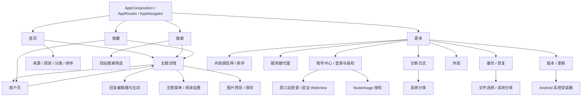

# 产品地图

## 文档职责与当前接受基线

本文件回答“App 现在有什么能力、用户从哪里进入、改动会影响哪里、交付前应回归什么”。实现方式以 `docs/architecture.md` 为准，测试强度与写操作授权以 `docs/testing-standard.md` 为准，具体命令以 `docs/operator-runbook.md` 为准。

- 当前接受基线：仓库现有能力默认都应保持可用，但不宣称零 bug。
- 用户最新明确要求优先；当前代码和实际运行结果是当前事实。本文与它们冲突时，先按事实处理，再修正文档。
- 精确的 Git revision、APK SHA、设备、登录态和一次性授权只记录在本机 `docs/emulator-baseline.md`，不得复制成长期稳定事实。
- 能力 ID 是开发与回归的共同语言，不是测试用例编号。开始改动前选择受影响 ID，交付时按 ID 报告自动测试、模拟器结果和未验证范围。
- 历史逃逸问题、精确失败 oracle 和最低可靠测试层见 `docs/regression-corpus.md`。
- 证据按 `STATIC_PASS`、`UNIT_PASS`、`UI_PASS`、`DEVICE_REPLAY_PASS`、`LIVE_PASS`、`APK_SANITY`、`NOT_VERIFIED`、`BLOCKED_BY_ENV` 分层；任何单层通过都不能代替其他层。

## 导航拓扑



详情和用户页可以嵌套打开；返回时必须恢复前一层 route、列表、筛选、草稿、回复状态和滚动上下文，而不是简单回到某个固定首页。

Modal、BottomSheet、WebView、系统浏览器、文件选择器、系统分享和安装器也是产品入口。验收不能只检查其父页面存在，必须检查打开、取消/返回及原页面状态恢复。

## 能力清单

表内“模拟器路径”是验收定位，不自动授予真实写操作权限。涉及回复、编辑、删除、互动、上传、投票、收藏切换、清空或登录清除时，仍按 `docs/testing-standard.md` 判断授权和恢复要求。

每个能力的完整契约由本节对应行、下方四站矩阵、证据覆盖索引和共享 seam 表共同组成：本节固定入口/前置状态、用户可见行为、代码与 Vitest；证据索引固定 UI、Replay、Live 和不可自动化边界；共享 seam 表固定改动时必须展开的关联能力。证据不足的行为必须标记 `NOT_VERIFIED`，不能靠缺少入口或一次空结果推断不支持。

下文“固定四站”“三个可登录来源”描述默认全部启用时的能力集合；用户通过 `MORE-05` 停用或重排后，Feed、Search、Library、Account 与 Notifications 必须改用同一偏好的已启用子集和用户顺序，静态 Catalog 能力本身不变。内容源偏好只持久化 `source + enabled`；operation-level ReadPlan 由当前 Catalog、启用集合和账号快照纯派生，不持久化，也不把账号核对 activity 或 unknown 变成整站不可用。

### NAV：导航与状态恢复

| ID | 用户入口与行为契约 | 主要代码入口 | 自动测试 | 模拟器路径 |
| --- | --- | --- | --- | --- |
| `NAV-01` | 底部固定提供首页、搜索、收藏、更多；四个入口的点击区分别铺满现有底栏内容区内的等宽 slot、互不重叠，图标、文字、间距、底栏尺寸和安全区不变，见 `REG-NAV-001`；切换 tab 不应破坏各页已有状态。 | `src/app/AppRoutes.tsx`、`src/app/AppNavigator.tsx`、`src/features/feed/FeedRoute.tsx`、`src/features/search/SearchRoute.tsx`、`src/features/library/LibraryRoute.tsx`、`src/features/more/MoreRoute.tsx`、`src/ui/navigation/NavBar.tsx` | `src/app/AppNavigator.test.ts`、`tests/integration/style-ownership.test.ts`、`tests/ui/app/app-navigator.test.tsx`、`tests/tooling/android-smoke-guard.test.ts` | `LIVE-NAV-01` 在匹配 APK 上检查四格边缘点击与视觉不变；再依次切换四个底部入口并回到原 tab 检查状态。 |
| `NAV-02` | Feed、Search、Library 可进入 Topic；Topic 和 Library 可进入 User；User 可再次进入 Topic。共享 TopicCard 的一次快速连点只允许产生一个 Topic route，窗口结束后可再次打开，见 `REG-NAV-002`。NodeSeek 的 `/member?t=username` 是内部 User route，当前 Topic 找不到 UID 也不得降级为外部链接；`/space/{uid}` 直接使用 canonical UID。 | `src/app/AppNavigator.tsx`、`src/ui/topic/TopicCard.tsx`、`src/features/topic/TopicRoute.tsx`、`src/features/user/UserRoute.tsx`、`src/features/user/useUserController.ts` | `src/features/topic/useTopicSessionController.test.ts`、`src/domain/forum/userNavigation.test.ts`、`tests/integration/forum-presentation-contracts.test.ts`、`tests/ui/app/app-navigator.test.tsx`、`tests/ui/feed/feed-screen.test.tsx` | Agent Live 选择满足前置条件的对象执行列表 → Topic → User → Topic；固定数据 UI 测试不依赖动态首条。列表连点后一次 Android Back 必须返回原列表；NodeSeek 用户链接专项见 `LIVE-READ-04`。 |
| `NAV-03` | 顶栏返回、Android 物理返回和嵌套详情返回一致；每个 native Topic route 自持筛选、回复顺序、列表、草稿、回复页和滚动状态。inactive route 停止 Query、写后刷新和原图升级；返回按图片预览 → composer → native stack pop 处理，Topic A → B、Topic → User/ReadingSettings 返回原 route 实例，不依赖 snapshot restore，见 `REG-PERF-008`、`REG-TOPIC-057`、`REG-TOPIC-067`。 | `src/app/AppNavigator.tsx`、`src/features/topic/TopicRoute.tsx`、`src/features/topic/useTopicRouteBeforeRemove.ts`、`src/features/topic/useTopicSessionController.ts` | `src/app/AppNavigator.test.ts`、`src/features/topic/useTopicSessionController.test.ts`、`tests/ui/app/app-navigator.test.tsx`、`tests/ui/topic/topic-session-controller.test.tsx` | Agent Live 从嵌套详情逐层返回并复查原列表、回复顺序与搜索条件；另在 nested Topic Loading 时立即返回，要求一次回到原详情且转场中不出现 B 内容或空白。固定 native 返回栈与 route 状态隔离由 UI 测试严格覆盖。 |

`NAV-01` 同时覆盖 More 内的 `Notifications → NotificationDetail / NotificationSettings` native stack：入口不增加第五个底部 tab，Android 摘要点击只进入指定来源的消息列表且不触发已读；可见 native header 统一取消 Android elevation 阴影，保持扁平内容层级，见 `REG-NOTIFY-003`。实现与固定 UI 证据见 `src/app/AppNavigator.tsx`、`src/app/appNavigation.ts`、`tests/ui/app/app-navigator.test.tsx`。

`NAV-02/03` 的回复导航统一使用 `ReplyLocationTarget`：点击用户名进入 User route，点击楼层才在同主题定位或把目标传给新的 Topic route；普通主题链接不得多出伪目标。每个 Topic route 自持当前 `ReplyOrder` 与锚点窗口，定位只清内容筛选/查找而不改变顺序，嵌套返回恢复原顺序；离开目标 Topic 后清除该 route 持有的非首屏窗口，不能让中段或另一顺序的缓存冒充首屏。目标身份只负责匹配楼层；同主题 HTML 楼层链接由 route 为每次点击附加单调 request command，结构化回复入口在列表内生成同类命令，因此同一目标重复点击也重新定位并高亮。已加载目标零网络，没有 request command 的 route 初始目标仍只自动处理一次，见 `REG-TOPIC-062/067/092`。

`REG-NAV-002` 补充 `NAV-02/03`：Feed、Search、Library 和 User 的共享 TopicCard 在 native push 尚未使来源页失焦时同步拒绝同一卡片的快速重复 press；门禁窗口结束后恢复正常打开，不影响不同卡片、Topic 内链接或楼层重复定位。

### FEED：首页与发现

| ID | 用户入口与行为契约 | 主要代码入口 | 自动测试 | 模拟器路径 |
| --- | --- | --- | --- | --- |
| `FEED-01` | 首页“全部”按用户顺序聚合所有已启用来源，条目保留完整 TopicCard 信息与视觉层级，包括来源/分类/访问徽章、标签、标题、摘要、作者头像与等级、时间、收藏/已读、同链来源、回复和浏览；Feed 不得以性能优化为由切换成信息合并或装饰删减的另一套 presentation，见 `REG-PERF-005`。每个来源使用显式 operation ReadPlan：没有确认身份的公开 child 继续以无 Cookie lane 结算，严格 child 以 typed blocked 终态退出，不能暂停整页或借另一站成功证明；authenticated 温缓存不得投影到 public scope，见 `REG-SOURCE-011`。单站请求或凭据存储失败不应抹掉其他已成功来源，见 `REG-SOURCE-001`。HTTP 成功但带 `parse_empty` 诊断的页面不得当作合法空列表应用，见 `REG-SOURCE-002`。聚合分页只追加新页，不得重新排序或平衡已加载主题，见 `REG-FEED-008/009`；计划、启用集合或会话变化时保留仍属当前 scope 的可信来源，取消并清除失效来源及对应聚合页，迟到结果不得让列表退回 Loading、旧快照或旧 cursor，见 `REG-FEED-010/011`、`REG-TOPIC-022`。 | `src/features/feed/FeedScreen.tsx`、`src/ui/topic/TopicCard.tsx`、`src/features/feed/useFeedController.ts`、`src/platform/query/serverState.ts`、`src/sources/readGateway.ts` | `tests/ui/feed/feed-screen.test.tsx`、`tests/ui/shared/topic-card.test.tsx`、`tests/ui/feed/feed-controller-session.test.tsx`、`tests/integration/query-session-contracts.test.ts`、`src/sources/readGateway.test.ts`、`src/sources/readGatewayContract.test.ts`、`src/sources/sourceErrors.test.ts` | 首页 → 全部；确认所有已启用来源按用户顺序显示完整 TopicCard，触发分页或自然身份核对后公开来源不暂停、原可见主题不回跳，并能打开主题。 |
| `FEED-02` | 首页可切换所有已启用来源；每个单站只展示该站可用分类；切换后从目标列表首项开始展示。Pager `onIndexChange` 时顶部来源与二级导航立即切到视觉目标，但 Query 来源只在完全 idle 后提交；pending 二级控件只读，顶部来源仍可连续选择。inactive scene 永远只显示 Loading，任意时刻最多一棵 active rich FlashList；目标 active 请求尚无数据且仍在读取或等待 strict 终态时，继续复用预铺 Loading，不挂空 `FlashList`，取得数据或终态后才切换，见 `REG-FEED-013`。取消零请求，未 idle 的连续选择只提交最终目标。每次真正完成的横滑或来源栏切换都清除目标来源全部 Feed 分类/排序缓存并重新请求一次，旧列表不得回显；点击当前来源 no-op。Categories、阅读筛选和各站排序偏好继续保留，见 `REG-PERF-003/006`。active Feed 完整保留 rich TopicCard，见 `REG-PERF-005`；双温列表方案已被取代。当前同 revision 90Hz Release 的功能与 Replay 通过，但严格帧门槛仍为稳态连续 miss、冷态 miss/RT 失败，见 `REG-PERF-004` 与 `docs/emulator-baseline.md`。同一请求 key 刷新失败必须保留可信列表和 cursor，见 `REG-FEED-004`；加载下一页不得移动已加载主题，见 `REG-FEED-008`。每个单站直接使用当前 operation ReadPlan：没有确认身份的公开来源继续读取，妖火等 strict 能力以可恢复 blocked 终态结算；账号核对 activity 不拥有 Feed 的全局门禁，见 `REG-SOURCE-011`、`REG-ACCOUNT-041`。 | `src/features/feed/FeedScreen.tsx`、`src/ui/topic/TopicCard.tsx`、`src/features/feed/useFeedController.ts`、`src/domain/forum/feedOptions.ts`、`src/domain/forum/feed.ts`、`src/sources/feedRead.ts`、`src/sources/yaohuo/reader.ts`、`src/sources/readGateway.ts` | `src/domain/forum/feedOptions.test.ts`、`src/domain/forum/feed.test.ts`、`tests/ui/feed/feed-screen.test.tsx`、`tests/ui/shared/topic-card.test.tsx`、`tests/ui/feed/feed-controller-session.test.tsx`、`src/sources/feedRead.test.ts`、`src/sources/searchRead.test.ts`、`src/sources/sourceTopicRead.test.ts`、`src/sources/sourceUserRead.test.ts`、`src/sources/sourceAccountRead.test.ts`、`src/sources/yaohuo/reader.test.ts`、`src/sources/readGatewayContract.test.ts` | 逐站横滑、来源栏切换、取消、连续反向、分类并刷新；执行“全部 → V2EX → 全部”，每次等待本次合法 outcome，检查导航同步、请求期无空白/旧列表、成功切换各一次新请求、单 active rich list、首项与分页位置稳定；按 `REG-PERF-004` 分开统计 drag、settling 与请求返回后的列表挂载。 |
| `FEED-03` | 聚合页提供全部、未读、已读、收藏；阅读和收藏来自本机资料，筛选不改变原站数据。 | `src/features/feed/useFeedController.ts`、`src/domain/reader/readerData.ts`、`src/domain/forum/topicListItemState.ts` | `src/domain/reader/readerData.test.ts`、`src/domain/forum/topicListItemState.test.ts`、`tests/ui/feed/feed-screen.test.tsx` | 在首页逐个切换阅读筛选，核对条目状态。 |
| `FEED-04` | 单站排序进入请求 key：V2EX 全部/最新/最热，linux.do 支持最新/热门/新·所有/新·话题/新·回复，NodeSeek 新帖子/新评论；刷新、分页、旧请求和重复 cursor 不得串列表，切换排序后以稳定 FlashList 在提交前和下一帧滚回首项，不得 remount，见 `REG-FEED-002`、`REG-PERF-003`。同一 key 的刷新失败保留旧列表，失败或 `parse_empty` 分页不得混入半页结果、丢失失败 cursor 或误判无更多，见 `REG-FEED-004`、`REG-SOURCE-002`。成功分页必须保持旧 topic key 序列为完整前缀，见 `REG-FEED-008`；账号或启用集合变化时，只能保留仍属于当前 ReadPlan scope 的可信多页并保持顺序，旧 scope 的 cursor、错误和迟到结果不得暴露或回滚页面，见 `REG-FEED-009/010/011`、`REG-SOURCE-011`。 | `src/features/feed/FeedScreen.tsx`、`src/domain/forum/feedOptions.ts`、`src/domain/forum/feed.ts`、`src/features/feed/useFeedController.ts`、`src/platform/query/serverState.ts` | `src/domain/forum/feed.test.ts`、`tests/ui/feed/feed-controller-session.test.tsx`、`tests/integration/query-session-contracts.test.ts`、`src/platform/diagnostics/diagnostics.test.ts`、`tests/ui/feed/feed-screen.test.tsx` | 单站切换排序，触发刷新和分页，确认列表实例稳定、首项、归属、加载状态及旧页顺序。 |

`FEED-01/02/04` 另共享本轮故障隔离契约：“全部” Feed/Categories 的每个来源以 active time 5 秒为上限，超时或已有 buffer 的分页全失败都保留可重试 cursor，只有无输入 cursor 的普通全失败不制造空 cursor，聚合调用复用现有 diagnostic trace，并为每个 child 恰记录一次脱敏终态与耗时，见 `REG-FEED-014`；手动刷新必须 exact cancel 并替换同 key 在途请求，分页语义不变，见 `REG-FEED-015`。首页与搜索顶部来源栏统一使用 compact Tab：100% 为 40dp/自然宽/13 号字，Reader 130% 仍缩放为 17，其他共享 Tab 保持 48×48，见 `REG-FEED-016`、`REG-SEARCH-020`。

### SEARCH：搜索

| ID | 用户入口与行为契约 | 主要代码入口 | 自动测试 | 模拟器路径 |
| --- | --- | --- | --- | --- |
| `SEARCH-01` | “全部”按用户顺序并行搜索已启用来源，渐进展示不可折叠的预览区块；每个来源使用不含单站自定义条件的干净默认筛选，V2EX 按主题时间、linux.do 按最新主题、NodeSeek 按新帖子，妖火保持已验证的原站顺序。每站最多显示 2 条完整 TopicCard，非空区块可进入对应单站，局部请求、strict blocked 或凭据存储失败可重试且不阻断成功来源，见 `REG-SOURCE-001/011`、`REG-SEARCH-024`；刷新失败还必须保留该站已加载的可信预览并显示本次错误，见 `REG-SEARCH-008`。自动化结算状态不得创建参与布局的空节点；聚合结算只附着在既有列表且覆盖当前已启用搜索来源，见 `REG-SEARCH-016`。条目继续展示来源、标题和可确认的主题作者/头像；linux.do 的回复命中必须保留，缺少可靠 OP 时显示未知作者，不得把回复者或最后回复者冒充楼主，见 `REG-SEARCH-013`；不做跨站混排或自动分页。 | `src/features/search/SearchScreen.tsx`、`src/features/search/useSearchController.ts`、`src/sources/readGateway.ts`、`src/sources/linuxdo/search.ts`、`src/ui/topic/TopicCard.tsx` | `src/features/search/searchRun.test.ts`、`src/sources/readGatewayContract.test.ts`、`src/sources/sourceErrors.test.ts`、`src/features/search/listItems.test.ts`、`tests/integration/source-read-contracts/`、`tests/ui/search/search-screen.test.tsx`、`tests/ui/search/search-controller-ai.test.tsx` | 搜索 → 全部 → 提交同一关键词；检查所有已启用来源按用户顺序渐进结算、默认最新、局部状态和“查看全部”，再进入单站打开结果。 |
| `SEARCH-02` | 可切换当前已启用的单站；V2EX、linux.do 和 NodeSeek 的无额外条件默认分别为按时间、最新和新帖子，筛选入口仍显示“默认”，妖火保持原站顺序。首次输入关键词时，尚未启用的 Query 不得把提交按钮误标为 busy，见 `REG-SEARCH-006`。linux.do 单站按 `REG-SEARCH-013` 保留回复命中并只展示可靠 OP；连续列表不显示来源分组标题或展开状态，用户向下滚动且分页哨兵可见后自动续页，每次滚动最多加载一页。“全部”只提供每站最多 2 条预览且不分页。失败或 `parse_empty` 分页保留旧结果和失败页，只重试同一 cursor，见 `REG-SOURCE-002`。点击最近搜索立即以当前来源和筛选提交请求，历史最多 20 条且可逐条删除；清空关键词会清空当前结果。linux.do 的普通结果独立分页；只有显式切换“相关”时才提供 AI 搜索，开启后仍以普通结果顺序为准，只在末尾追加去重后的 AI 独有结果。 | `src/features/search/SearchScreen.tsx`、`src/features/search/useSearchController.ts`、`src/features/search/history.ts`、`src/features/search/listItems.ts`、`src/features/search/searchRun.ts` | `src/features/search/searchRun.test.ts`、`src/features/search/history.test.ts`、`src/features/search/listItems.test.ts`、`tests/ui/search/search-screen.test.tsx`、`tests/ui/search/search-controller-ai.test.tsx` | 在“全部”按用户顺序检查已启用来源预览并进入单站；单站检查默认最新并向下滚动自动续页；清空输入后点历史确认立即请求，再逐条删除历史；linux.do 切换“相关”并开关 AI 后继续加载普通结果。 |
| `SEARCH-03` | 单站筛选按来源隔离：V2EX 支持相关性/时间、时间范围、节点、用户名、OR/AND；linux.do 支持全文/标题、层级分类候选、标签候选多选与任意/全部匹配、发帖人候选、回访范围、话题状态、快捷或精确日期、帖子/浏览量范围、专家回应及相关性/最新。NodeSeek 与妖火保留各自分类/排序筛选。linux.do 首层只展示排序、时间、搜索范围、分类和标签；作者、回访、状态、精确日期、数值范围及站点扩展默认收入“更多筛选”，有高级条件时重新打开自动展开，手动收起仍显示“已设置”。分类、标签和发帖人只能提交对应站点候选；标签与用户请求防抖且拒绝过期响应，空作者输入不进入 Loading，分类或来源变化时不得重新展示旧标签候选。只有账号 Query 已确认身份的单一 linux.do、相关度排序和已提交查询下并行预取 AI 搜索，见 `REG-LINUXDO-005`；开关只使用当前缓存，AI 错误不阻断普通结果，新查询、筛选、排序或来源会清空缓存并关闭。弹层修改先留在草稿，关闭不应用，重置后仍需确认；确认后有关键词则从第一页重新搜索，分页和返回继续使用同一筛选。Android 键盘关闭后共享弹层必须恢复打开前几何且不累积偏移，见 `REG-SEARCH-026`。 | `src/domain/forum/searchFilters.ts`、`src/features/search/SearchFilterForm.tsx`、`src/features/search/useSearchController.ts`、`src/ui/controls/ModalSheetFrame.tsx`、`src/sources/readGateway.ts` | `src/domain/forum/searchFilters.test.ts`、`tests/integration/source-read-contracts/`、`src/features/search/searchRun.test.ts`、`tests/ui/search/search-screen.test.tsx`、`tests/ui/search/search-controller-ai.test.tsx`、`tests/ui/shared/modal-sheet-frame.test.tsx` | 逐站打开筛选弹层；linux.do 检查首层与“更多筛选”、本站候选和完整请求；V2EX 节点及 Discourse 候选输入连续两次打开/关闭键盘后位置恢复；检查取消、重置、确认、分页和详情返回状态。 |
| `SEARCH-04` | 登录受限、验证、授权状态、WebView fallback、空结果和来源错误使用可理解状态；不能把登录/授权入口、旧请求或空解析误判成成功。首次进入未提交搜索时不显示“账号未知/暂停搜索”；提交后每个来源按 operation ReadPlan 结算：V2EX、NodeSeek、linux.do 的公开搜索在没有确认身份时继续以 `credentials: omit` 运行，AI、候选等私有操作保持严格，妖火远程搜索只接受已确认会话；strict unknown/未登录分别显示可重试核对或登录动作且零搜索 transport，不能锁死整页，见 `REG-SOURCE-011`、`REG-SEARCH-024`。验证只能由响应协议或 challenge 页面结构触发，正常 JSON、纯文本和可读业务 DOM 中的关键词不能拉起面板，见 `REG-VERIFICATION-002`。首屏来源错误重试整来源；已有结果后的分页错误必须保留旧结果，在来源尾部提示并只重试失败页，不自动重试，见 `REG-SOURCE-002`；聚合刷新失败同样保留可信预览并暴露来源级重试，见 `REG-SEARCH-008`。真实会话变化只切换该来源 ReadPlan scope、清除普通/AI 旧 Query 并释放 Loading，不清其他来源，见 `REG-TOPIC-022`；普通恢复失败时面板保持可重试，聚合与 AI 不自动弹出登录或验证面板，见 `REG-SEARCH-007`。四站公开/严格协议保持各自真实实现：V2EX 走 SoV2EX，NodeSeek/linux.do 走受限 Google connector，妖火需要会话；Google 的精确 JS capability gate、普通搜索导航和最终结果都必须绑定 initial 同站任务，不能跨回论坛域、转成另一搜索或扩成任意 Google 白名单，见 `REG-SEARCH-014`。SearchGuard 的 exact `SG_REL` 访问故障仍须拦截且不得结算，但必须显示 Google 环境验证受限而非外部链接；只允许用户显式重试，见 `REG-SEARCH-015`。 | `src/features/search/SearchScreen.tsx`、`src/features/search/listItems.ts`、`src/sources/searchFallback.ts`、`src/features/account/useVerificationController.ts`、`src/features/account/useHiddenBrowserFetchController.ts`、`src/features/account/HiddenBrowserHost.tsx`、`src/domain/session/siteSessionPrompts.ts`、`src/features/search/useSearchController.ts`、`src/domain/forum/readPlan.ts`、`src/platform/query/serverState.ts` | `tests/integration/security-boundaries.test.ts`、`src/features/search/listItems.test.ts`、`src/features/account/useVerificationController.test.ts`、`src/platform/network/loginWebViewScripts.test.ts`、`tests/integration/hidden-browser-scripts.test.ts`、`tests/integration/session-presentation-contracts.test.ts`、`tests/integration/source-read-contracts/`、`src/features/search/searchRun.test.ts`、`tests/integration/query-session-contracts.test.ts`、`src/domain/forum/readPlan.test.ts`、`src/sources/readGatewayContract.test.ts`、`tests/ui/search/search-screen.test.tsx`、`tests/ui/search/search-controller-ai.test.tsx` | 在当前登录态检查各来源独立结算、分页失败保留结果、原页重试和详情返回；账号自然核对期间公开来源不得显示暂停，妖火保持登录限制；不得靠清数据制造状态。 |

`REG-SEARCH-018` 补充 `SEARCH-02`、`SEARCH-04`：NodeSeek 搜索只统计当前解析器实际选择的数据面；正式 `.post-list` 为空时，即使页面其他区域含 `post-*` 链接或页面壳含旧 embedded topics 也必须显示正常空态，不能误报 `parse_empty`。只有表单而结果面未完成时仍保持可重试失败，纯数字查询不改写为帖子直达。

`SEARCH-03` 的筛选状态 owner 固定为 `src/features/search/SearchFilterSheet.tsx`、`src/features/search/SearchFilterForm.tsx` 与 `src/features/search/DiscourseFilterPickers.tsx`：sheet 自持筛选入口、visibility 和草稿事务，picker 自持 visibility、debounce、候选 Query、取消和 stale-response 拒绝；对应可见行为由 `tests/ui/search/search-screen.test.tsx` 固定。

`REG-SEARCH-019` 补充 `SEARCH-02`、`SEARCH-04`：单站搜索累计结果为 0 时，空态即为终态；即使来源残留 `hasMore/nextPage`，也不得显示分页哨兵或触发自动续页。非空结果的既有自动分页与分页失败重试保持不变。

`REG-SEARCH-020` 补充 `SEARCH-01`、`SEARCH-02`：搜索页四站来源栏与首页复用同一 compact Tab 几何，100% 为 40dp/自然宽/13 号字并继续随 Reader 字号缩放；不得全局缩小其他共享 Tab。

`REG-SEARCH-021` 补充 `SEARCH-01`、`SEARCH-04`：linux.do 搜索在请求前确认已登录、但服务端响应已明确会话失效时，当前请求直接切到既有 Google site-search 并有限结算；只接受 HTTP 401 或明确的登录要求，不把权限、Cloudflare、网络或取消错误降级，也不在 Search Controller 增加超时或重试队列。

`REG-SEARCH-022` 补充 `SEARCH-01`、`SEARCH-02`、`SEARCH-04`：linux.do Google site-search 只接受结果块内的明确标题或可靠 accessible label；URL、面包屑、slug 和摘要不得成为标题。候选全部缺标题或页面结构无法确认时必须显式失败，空标题不得通过 `searchRead` 进入 Query cache，TopicCard 不再制造“无标题”结果。

`REG-SEARCH-023` 补充 `SEARCH-04`：Google 隐藏 WebView 以 site、查询与页码共同定义搜索任务身份；允许初始 scoped search、身份不变且只增加单个受限 `sei` 会话参数的 `/search`，以及精确 JS capability gate。被拒绝的 `/sorry`、consent、login 和未知 Google 流程分别显示准确原因，查询或页码变化、额外参数及真正跨站继续拒绝。诊断只保留 host、path 与参数键名，不记录查询值或完整 URL。

`REG-SEARCH-026` 补充 `SEARCH-03`，共享 `ACCOUNT-05`、`MORE-01`：Android `ModalSheetFrame` 只在软键盘实际显示时启用高度避让，键盘隐藏后禁用并重建残留内部补偿的 KAV，弹层关闭同样回到干净实例；V2EX 节点、Discourse 标签/分类/作者候选连续操作不得累积位移。账号凭据编辑器的显式开关和代理表单的手动 inset 保持原行为。

### TOPIC：主题详情与阅读

`TOPIC-02/03` 的正文、回复和引用继续先走既有图片预览、站内主题/楼层和用户导航；只有剩余 HTTP(S) 外链使用默认浏览器 Custom Tab。`TOPIC-04` 的“原站打开”继续使用完整系统浏览器。Route/Expo 边界由 `tests/ui/topic/topic-route-external-links.test.tsx` 独立固定 rejection 反馈与完整浏览器分流，App route-gate 测试不再兼任该 owner。

`REG-TOPIC-084` 补充 `TOPIC-01/02/03`、`NAV-02/03`：table 在 HTML 分片前被编译成携带稳定 `semanticId`、统一列模型和完整行组的 typed row；能满足预算的 V2EX 18 行表保持一个 row，超大表只在完整 `tr`/rowspan 连通区域之间分段。renderer 按正文宽度与 `96dp × 阅读字号` 最小列宽统一分配列，窄表铺满、宽表原生横滑、`colspan` 按列单位占宽。同表分段零间距并同步横向 offset，独立表之间固定 `12dp`；不同正文 scope 和 route 不共享位置。

`REG-TOPIC-085` 补充 `TOPIC-01/02/03`、`NAV-02/03`：块图有效 `onLoad` 必须先同步保存当前媒体 identity 的自然尺寸，再更新组件状态；已挂载图片和未完成占位必须共用 `min(自然宽度, 正文宽度)` 等比几何。Viewability 只调度 waiting/running 工作，已经显示的像素在 cell 真正回收或内容 identity 改变前不得被 lease 抖动撤销。媒体 URL、session/Referrer identity 和 preview/original variant 构成稳定视觉 key；`attemptId` 只拒绝迟到事件并区分网络重试，不进入 React/Expo recycling identity。同批次未完成 lease 回收、离窗、FlashList recycling 和重挂载不得让已知图片退回 4:3，也不得把窄图强行放大到正文宽度后改变行高。

`REG-TOPIC-086` 补充 `TOPIC-01/02/03`、`NAV-02/03`：FlashList row 只是物理调度单元。compiler 在 budget packing 之前建立 typed semantic blocks；每个 row 直接携带 scope-local DOM path 产生的 `semanticId`、segment/part 和完整 `ancestorFrames`，不再生成 `data-wz-*`、sidecar 或 RenderHTML TNode 绑定。table、block pre/code、details、callout、blockquote 与 list 直接消费 typed payload；代码先归一文本 runs 并保持单一 owner，table 等可拆容器只在自然子项边界分段。

`REG-TOPIC-087` 补充 `TOPIC-01/03`、`NAV-02/03`：虚拟与非虚拟回复共用 Header → ReplyTarget → Body → Tail 顺序。reply target 只属于首 row，必须位于正文之前；尾 row 只承载签名、统计与操作区，正文切割不得把回复关系移动到内容之后。

`REG-TOPIC-088` 补充 `TOPIC-01/02/03`、`NAV-02/03`：局部 compiler sidecar 或 renderer 测试通过不能替代真实 `compileForumContent → reply/topic model → TopicContentList → FlashList → ReplyItem → TopicContentBlock` 链路。第 9 层式 52 行装饰 `<pre>` 必须在编译前归一为一个 semantic code owner；单 Cell reply 的 FlashList view type 必须包含 payload kind，完整 compiled row 逐层传递，最终只挂一个代码框且 ReplyTarget 在前。旧 `data-wz-node + logicalSlices + TNode` 路线禁止恢复。

`REG-TOPIC-089` 补充 `TOPIC-01/02/03`、`NAV-02/03`：共享 sanitizer 必须保留普通 `<pre><code>` 到 semantic compiler，不能先改写为 `forum-terminal-code`。明确的 ANSI code 与 NodeSeek terminal report 继续走专用转换；普通代码经 `sanitize → compile → model → FlashList → renderer` 后仍是一个 typed code owner，不因空格实体膨胀退回 richText 分片。

`REG-TOPIC-090` 补充 `TOPIC-01/02/03`、`NAV-02/03`：NodeSeek magic tabs/ANSI report 不再作为一个 opaque RNRH island。`compileForumContent()` 生成可按预算分段的 `terminalReportHeader` 与带 `terminalTab` ancestor 的 code/table/richText/media/poll/details 等既有 typed rows；混合 Tab 不丢 terminal 外的语义，超预算只 fail-close 最小不安全 body/header child。每个 plain/terminal code 都保持单一 CodeFrame owner，并共用选择、高亮、完整复制、横向位置与 ANSI 样式。accepted-answer preview 至少保留 header 与默认 Tab 首个 body；active tab 由 `route identity + content scope + report semanticId` 持有，过滤、回收和重挂保持，Topic identity 改变时重置。

`REG-TOPIC-091` 补充 `TOPIC-01/02/03`、`NAV-02/03`：terminal Tab 切换会替换 FlashList 中同一逻辑位置的 typed rows；若旧 Tab 的 viewability callback 已结算而切回时没有新滚动，媒体 coordinator 仍必须把同一有界窗口映射到新 Tab row，使已显示或待加载的长图重新取得 permit。旧 key 仍存在时继续按 key 保持实体身份，只在 key 因语义过滤消失时按已记录 index 重投影；不得预热隐藏 Tab、扩大 `warm <= 8 / running <= 4`、重挂整列表或用重试掩盖。

`REG-TOPIC-092` 补充 `TOPIC-03`、`NAV-02/03`：楼层目标身份与定位命令分离。NodeSeek 正文 `forum-floor-link` 的同主题路径由 `TopicRoute` 为每次显式点击递增 `targetReplyRequestId`，并把同一命令同时交给 controller 与列表；LinuxDo 等结构化回复关系则由 `TopicContentList` 的稳定 ref 生成本地 request command。两条入口都让同一楼层连续点击或切换目标后再点重新定位与高亮；目标已加载时不得发网，未加载目标的每次新命令都沿既有有界定位。没有 request ID 的 route 初始 target 仍只自动处理一次，普通刷新不得重跳。

`REG-TOPIC-093` 补充 `TOPIC-01/02/03`、`NAV-02/03` 与 `REG-PERF-010`：语义 owner 先于物理预算。`pre`、独立块级 `code`、terminal code 与无离散媒体的连续富文本 subtree 不从内部切割；inline `code` 仍属于所在富文本 owner。details、callout、blockquote、list 只在自然子块或 list item 边界分段，table 只在完整 `tr`/rowspan 连通区域之间分段；图片、视频等离散媒体继续独立调度且每 row 最多 4 个网络媒体。malformed HTML、深度越界或单个不可拆媒体/table row 仍在最小单元 fail-close。

`REG-TOPIC-094` 补充 `TOPIC-01/02/03`、`NAV-02/03`：code/table 共用一个手动激活的 Pan owner；单指达到 `4dp` 后只有横向占优才接管，纵向占优或相等、多指及无 overflow 立即交还外层 FlashList。被动 `Animated.ScrollView` 只负责裁剪和测量；横向 offset 按 route scope 与 `semanticId` 共享、严格 clamp 并用 decay 收尾，同时保留文本选择、复制、查询高亮、terminal Tab 和无障碍增减滚动。

`REG-TOPIC-097` 补充 `TOPIC-01/02/03`、`NAV-02/03`：Android selectable code 的原生长按选择不能在慢横拖时先于共享 Pan 取得所有权。`TopicHorizontalScroll` 在 UI thread 内以 `4dp` 锁定方向；阈值内静止长按仍可选择，横向占优只激活一次，纵向占优、多指和无 overflow 失败让行。匹配 APK 的 `240px / 5s` 慢拖不得出现放大镜、handles 或 ActionMode，静止长按、完整复制、四个 terminal Tab、表格与外层纵向滚动必须保持。

`REG-TOPIC-098` 补充 `TOPIC-01/02/03`、`NAV-02/03`、`REG-A11Y-001`：共享 Pan 激活并移动内容后还必须取消 Android selectable Text 的原生触摸流。`TopicHorizontalScroll` 用直接、不可折叠的 Native gesture owner 承载 code/table 内容，Pan 通过 external-gesture block 在横向接管时触发 `ACTION_CANCEL`；未接管时静止长按选择、纵向让行、完整复制、四个 terminal Tab、表格与无障碍滚动保持。

`REG-TOPIC-099` 补充 `TOPIC-01/03`、`NAV-02/03`：主楼引用的 summary 与展开正文共享同一引用实例 scope。summary→body 和同一 body continuation rows 之间 separator 为 0，外框按 top/continuation/bottom 连续显示；展开、收起、引用缓存、同主题当前楼层优先和正文虚拟化语义不变。

`REG-TOPIC-108` 补充 `TOPIC-02` 与 `REG-PERF-010`：正文媒体调度窗口改变时，当前排序前四个不同 request identity 才能持有运行 permit；仍在 warm window 但已排到其后的旧 row 请求必须让位给新进入 viewport 的媒体。并发上限、同 identity 去重、最多一个原图、已显示像素和暂停语义不变。

`REG-TOPIC-109` 补充 `TOPIC-01/02/03`、`NAV-03`：同主题主楼引用同时存在当前页 floor 1 投影和引用 Query 缓存时，`replyForQuotedPost` 只在当前页对象可直接渲染时保持本地优先；若本地投影没有预编译计划而缓存对象已有计划，展开必须使用缓存。普通同主题回复继续优先当前页，跨主题继续只使用目标缓存，主楼投影的回复目标与作者解析职责不变。

`REG-TOPIC-110` 补充 `TOPIC-01/02/03` 与 `REG-PERF-017`：整页抓取与论坛正文使用两个命名明确的 HTML parser Interface；只有正文 parser 展开 `<pre>` 内的 `<code>`、`span` 和 `br` 语义。sanitizer 与 direct compiler 必须共用该正文策略并复用同一 DOM，production `preparedContent` 的 code `text/copyText/runs` 不得包含字面标签；测试不得通过重新编译已序列化 HTML 制造假绿。

`REG-TOPIC-111` 补充 `TOPIC-01/02/03`：结构化 details 与 Callout 共用的 continuation Frame 在 `only/first/middle/last` 每个状态都必须提供确定的边框几何；展开切到收起时不得从 Native props 中移除上下 edge width。Android 上标题、图标和箭头必须继续绘制，正文仍按原状态挂载或卸载。

`REG-TOPIC-113` 补充 `TOPIC-01`：linux.do 详情 200 响应已解析出有效主楼正文时，详情以当前读取成功为准，不能把分类 `read_restricted` 或等级策略继续投影为当前账号拒绝；只有明确 HTTP/协议权限错误进入权限页。Feed、搜索、分类和历史列表的权限规则不变。详情权限卡片仅在“需权限”标签后增加 `4dp`，标题到说明仍保持 `8dp`。

`REG-TOPIC-114` 补充 `TOPIC-01/02/03`、`NAV-02/03`：Android `expo-image` 的 `onLoad.source.width/height` 必须优先返回同一次 Glide 解码记录的 upright 原图尺寸，不能把目标 View 下采样后的 Drawable 尺寸误报为自然尺寸；原图尺寸不可得时才回退 intrinsic。单图与多图继续按完整媒体 request identity 独立缓存几何，冷图每个 identity 最多一次必要的 FlashList 布局提交，重复回调、离窗重进和重挂载不得增加提交、请求或 Native owner；`REG-TOPIC-048/075/085` 的下采样、内存、真实窄图和稳定 identity 契约不变。

`REG-TOPIC-115` 补充 `TOPIC-01`：linux.do 主楼同时满足 `user_deleted=true`、`deleted_at` 为空且 `cooked` 可渲染时，继续返回普通 `TopicDetail` 并沿既有正文管线显示原站删除占位；只有 linux.do 主楼显式启用该策略。可渲染性由 prepared-content compiler 的同一次 sanitized root 判定并复用该 prepared result，media-only 主楼不得预解析第二次。空正文或带 `deleted_at` 的主楼仍解析失败，普通删除回复和其他共享调用方继续按默认规则过滤；不得新增删除状态、重试、请求、解析或 render owner。

`REG-TOPIC-116` 补充 `TOPIC-01/03`、`NOTIFY-02`、`WRITE-01`：linux.do 的 `/emojis.json` 枚举按来源隔离，并在 App JS 进程内保留首次成功解析出的同一 map；详情、回复和私信编辑器卸载后重进必须首帧直接复用，不得重新执行枚举 loader、先显示英文 ID 或新增计算/render owner。首次失败不产生成功缓存，后续挂载或显式刷新仍可重试；进程终止以及既有账号显式重置边界不变。NodeSeek sticker、正文 emoji 图片和图片字节缓存不在此契约内。

`TOPIC-01/02/03` 的四站 Topic adapter、主楼与回复共用媒体首跳 Referrer 契约：adapter 保留最终 Topic URL，妖火额外保留 HTML 响应策略；媒体按元素策略、文档策略和真实 URL 关系解析最终 `Referer`，不从 `contentSource` 推导，也不按站点或图床分支。正文、原图升级、预览、保存、原生视频、贴纸和卡片图共用该契约，缓存与协调身份区分最终 `Referer`/`none`，见 `REG-TOPIC-078`。原生正文视频错误或超时释放 permit 后稳定等待点按重试，不自动重建 player；显式重试只创建一次，卸载释放由 Expo 独占且组件不再访问已释放 player，见 `REG-TOPIC-079`。正文视频按 track 固有比例布局、最窄限制 `1:2` 且不因比例变化重建 player，见 `REG-TOPIC-080`。opening 虚拟化 rows 共同呈现为一篇连续文章，隐藏占位不泄漏，妖火附件由 adapter 归一为共享语义卡片；quote、poll、accepted answer 等边界保持，见 `REG-TOPIC-081`。原生视频保留真实 poster，封面由独立图片 permit 管理，首次播放后才退出且暂停保留当前帧，见 `REG-TOPIC-082`。结构化内容由 typed semantic rows 保持祖先身份与文档顺序；FlashList row 只负责调度，code 和连续文本保持单一语义 owner，table 等容器只按自然子项分段；code/table 共用方向判定与横向位置 owner，回复定位的每次显式点击都产生独立命令，并由完整 sanitizer→compiler→FlashList 贯通测试守住。图片自然尺寸先于未完成 lease 回收同步保存，已显示像素不再受 viewability 撤销；Tab 替换可见 row 时继续以同一有界窗口驱动媒体 permit，当前 viewport 排序又可抢占仍 warm 的旧 row 请求，见 `REG-TOPIC-084/085/086/087/088/089/090/091/092/093/094/097/098/108/110`。图片、WebView 视频和贴纸仍保留既有自动重试。

| ID | 用户入口与行为契约 | 主要代码入口 | 自动测试 | 模拟器路径 |
| --- | --- | --- | --- | --- |
| `TOPIC-01` | 四站主题详情展示来源、分类、标题、作者、时间、正文、适用统计和回复；Discourse 主题展示关闭、归档、置顶、已解决、采纳楼层和慢速模式等原站状态，正文后展示可折叠的已采纳答案；当前页缺少采纳楼层时静默精确补取并可就地展开全文，受限主题不得补取，见 `REG-TOPIC-026`。linux.do emoji 目录必须经 `ReadGateway` 复用代理 fetcher、站点凭据、诊断和取消信号，迟到结果不得落地，见 `REG-TOPIC-027`。详情请求进入短后台且进程存活时，后台时长不得消耗请求 timeout 预算，恢复后原请求继续结算且不得自动重复发起，见 `REG-TOPIC-021`；读取本地 Cookie 的 `cookie-loaded` 观察事件不得取消正在执行的同站 Query，新凭据的 `session-updated` 及其他真实身份变化必须清除该来源旧详情、释放 Loading 并保留可重试目标，见 `REG-TOPIC-022`；来源失败或 `parse_empty` 应给出可重试状态且不得覆盖可信详情，见 `REG-SOURCE-002`。 | `src/features/topic/TopicRoute.tsx`、`src/features/topic/TopicScreen.tsx`、`src/features/topic/components/TopicContentList.tsx`、`src/features/topic/components/ReplyItem.tsx`、`src/features/topic/useTopicController.ts`、`src/platform/query/serverState.ts`、`src/sources/discourse/reactions.ts`、`src/sources/discourseRead.ts`、`src/sources/readGateway.ts` | `src/features/topic/model/replyPagination.test.ts`、`src/features/account/sessionQueryOwnership.test.ts`、`src/features/account/browserFetchQueue.test.ts`、`tests/integration/query-session-contracts.test.ts`、`src/sources/discourse/reactions.test.ts`、`src/sources/yaohuo/parser.test.ts`、`src/features/topic/model/topicDerivedData.test.ts`、`tests/integration/source-read-contracts/`、`src/sources/readGatewayContract.test.ts`、`tests/ui/topic/topic-components.test.tsx`、`tests/ui/topic/topic-reply-filters.test.tsx`、`tests/ui/topic/topic-session-controller.test.tsx` | 从四站首页或搜索各打开一个主题；短后台路径另在请求仍在飞时按 Home，离线恢复后核对原详情无重试显示；linux.do 另核对主题状态、回应图片和采纳预览/完整回复。 |
| `TOPIC-02` | 正文正确呈现 HTML、链接、表格、图片、附件、视频、表情和站点格式；可信站内用户链接必须进入 App User route，NodeSeek 用户名链接不能因当前详情缺少 UID 候选而外开，见 `REG-TOPIC-039`。块级正文图片使用“适屏展示图 + 原图”双层模型：正文按 CSS 宽度与设备 DPR 选择最小足够候选作为首个、可随页面卸载取消的 native 请求；冷加载先用 4:3 占位与一个连续 Spinner，适屏图 `onLoad` 取得真实尺寸并完成布局后仍遮罩，`onDisplay` 才让图片可见，不能先露小图再跳大；热重进复用同会话真实比例。适屏图完成 `onLoad + onDisplay` 后，评论仅在 FlashList `720px` render window 内、主楼仅在同距离已测量分块内以低优先级启动原图覆盖层，点击立即升为高优先级；适屏图作为独立底层维持连续性，原图覆盖层不接收远程 placeholder，只以 `150ms` 过渡覆盖既有 frame；原图成功后才卸载底层，失败继续保留适屏图，全屏匹配完整媒体 request identity 的 `onDisplay` 会使外层复用同一 Glide 缓存或已有 SVG poster；相同 URL 不重复请求，见 `REG-TOPIC-004/040/048`。原生解码失败且响应明确为 SVG 时，共享 artifact 保留原始文档，正文显示单例 Chromium 生成的静态海报；全屏首帧沿用正文海报与 artifact 固有尺寸，动画 document 只在当前页挂载；poster 已 `onDisplay` 后，双指缩放起始或双击进入放大时把固定 1 倍 document 透明隐藏并切回同尺寸海报，回到 1 倍后直接显示同一 document，poster 未显示时不得隐藏当前动画制造空白；动画 WebView 必须是当前 physical slot 内、缩放树外的绝对定位 sibling，任何 scale 都只能作用于海报；邻页和后台原图升级不得抢占昂贵恢复，保存仍取原始 SVG，见 `REG-TOPIC-018/020/038/045`。NodeSeek 透明动态贴纸使用受限 Chromium media island 并以 PNG 作 ready 前 fallback，普通视频仍走 native player；React 重渲染和前后台切换不得重建动画，见 `REG-TOPIC-065`。无显式宽高的图片贴纸以 Expo Image 解码后的真实尺寸和比例为最终布局，限制在 100dp 内并按媒体 session 有界缓存；目录级尺寸只能首帧兜底，不能把同目录不同素材统一压小，见 `REG-TOPIC-066`。图片预览使用非循环三物理槽 Reanimated ring，每槽由 ResumableZoom 负责缩放且只挂载当前与相邻页；单一 manual parent Pan 在 UI thread 上按 shared zoom scale 仲裁，一指、1 倍、横向占优才分页，纵向占优才下拉关闭，两指或 scale 大于 1 时立即失败并交给图片缩放/平移。翻页结算先在同一 worklet 旋转槽 role 并归零位移，React 再提交 index 且只更新离屏槽 source，动画中的目标媒体不得换 owner 或闪现 `i±2`；快速/反向请求按最新 desired index 逐页结算，idle 的非相邻外部 index 无动画重建，见 `REG-TOPIC-046/095`。当前与相邻页均请求原图，但只保留 previous/current/next 三槽，统一使用 disk-only cache 并按 View 尺寸下采样解码；升为当前页只切换基础层高优先级，静止后另以同一 Glide 缓存文件为当前静态页挂载唯一可见区域高清层，手势中回收、结束后按屏幕物理像素重新区域解码，邻页与离屏页为零；真实原图尺寸驱动 DPR-aware 1:1 最大缩放，不保留固定 8 倍上限，见 `REG-TOPIC-112`；支持缩放、双击、单击显隐控制层、1 倍缩放下拉关闭、失败重试、Android Back、无障碍增减页和按权限保存；不显示原图缩略图栏或左右箭头，快速重复点击只保存一次，见 `REG-TOPIC-006`。所有媒体授权由内容来源和原生重定向链决定，跨站匿名但继续加载；危险/相对候选不得成为主动 URL，预览与正文必须有限结算，见 `REG-TOPIC-029` 至 `REG-TOPIC-033`。带内部标记的媒体不得读写未分区的共享 OkHttp cache；opaque session identity 必须以进程 namespace + epoch 参与 Glide 模型与 cache key，并在出网前移除，使不同 epoch 的在途请求不能合并、重启后不能复用旧私有磁盘条目，见 `REG-TOPIC-037/041/042`。 | `src/features/topic/components/TopicContentBlock.tsx`、`src/features/topic/components/TopicBodyQuoteCard.tsx`、`src/features/topic/components/TopicContentList.tsx`、`src/features/topic/rendering/useHtmlRenderingController.tsx`、`src/features/topic/rendering/previewRenderers.tsx`、`src/features/topic/rendering/contentMediaRenderers.tsx`、`src/features/topic/rendering/TopicSplitDisclosure.tsx`、`src/features/topic/rendering/topicTableRenderers.tsx`、`src/platform/media/originalImageLoading.tsx`、`src/features/topic/media/useImagePreviewController.ts`、`src/features/account/AccountHost.tsx`、`src/ui/media/ImagePreviewModal.tsx`、`src/ui/media/PreviewRegionImage.tsx`、`src/ui/content/CompatibleSvgDocumentView.tsx`、`src/platform/media/compatibleImageSources.ts`、`src/platform/media/svgPosterRenderer.native.ts`、`src/platform/media/imageSave.ts`、`src/domain/forum/topicContentHtml.ts`、`src/domain/forum/forumContentMedia.ts`、`src/platform/media/mediaRequestContext.ts`、`src/platform/media/mediaSessionEpoch.tsx`、`src/domain/forum/videoEmbeds.ts`、`plugins/withNetworkProxyModule.js`、`plugins/withPreviewRegionImageNative.js`、`plugins/withSvgRendererModule.js` | `tests/integration/forum-presentation-contracts.test.ts`、`src/domain/forum/topicContentHtml.test.ts`、`src/domain/forum/forumContentMedia.test.ts`、`src/platform/media/imageRequestSource.test.ts`、`src/platform/media/imagePreviewCatalog.test.ts`、`src/platform/media/inlineMedia.test.ts`、`src/platform/media/originalImageLoading.test.ts`、`src/platform/media/previewBitmapBudget.test.ts`、`src/domain/forum/videoEmbeds.test.ts`、`src/platform/media/compatibleImageSources.test.ts`、`src/platform/media/imageSave.test.ts`、`src/platform/media/mediaRequestContext.test.ts`、`src/platform/media/mediaSessionEpoch.test.ts`、`tests/integration/source-read-contracts/`、`src/domain/forum/quotedPosts.test.ts`、`src/features/topic/model/replyPagination.test.ts`、`tests/ui/topic/topic-image-loading.test.tsx`、`tests/ui/topic/topic-components.test.tsx`、`tests/ui/topic/image-preview.test.tsx`、`tests/ui/shared/compatible-svg-document-view.test.tsx`、`tests/ui/topic/image-preview-controller.test.tsx`、生成的 `NetworkProxyRuntimeTest.kt`、`PreviewRegionImageMathTest.kt`、`SvgRendererPolicyTest.kt` 与 `SvgRendererInstrumentedTest.kt` | 打开含正文引用和媒体的主题，分别检查站内用户链接、块图冷/热刷新与小图不露出、适屏图后附近原图渐进清晰、长帖远段不抢加载、点开原图并返回后外层保持适屏像素、不跳位，并可从原图磁盘缓存恢复升级层、原图失败保留适屏图、NodeSeek 静态/GIF/透明动态贴纸及前后台恢复、动态 SVG 静态正文海报与当前页动画、inline emoji、简介/完整帖、横滑/缩放/下拉关闭、普通图/长图/旋转 JPEG 的静止当前视口清晰与 1:1 细节、失败重试、保存 busy、Android Back 和返回；NodeSeek 用户链接专项见 `LIVE-READ-04`，保存需另按授权。 |
| `TOPIC-03` | 回复区支持分页、全部/只看楼主/只看带图、评论内查找、引用关系和楼层定位；回复正文、回复目标、引用作者和签名中的可信用户链接共用内部 UserReference 导航，NodeSeek 用户名定位规则见 `REG-TOPIC-039`；Discourse 仍只有明确 username 可导航，display label 不得猜作 username，见 `REG-TOPIC-035`。评论引用默认显示简介，展开后显示匹配主题的完整帖子；跨主题引用从 parser 到 Query 始终使用 `source + topicId + postNumber`，保留目标主题内部链接且不得复用当前主题同楼层，见 `REG-TOPIC-053`；同一 reference key 的引用实例共享 Query transport、缓存状态和精确 linux.do 验证恢复，见 `REG-TOPIC-007`；回复下一页验证恢复必须重试原 page/offset 而不是重取首屏，见 `REG-TOPIC-023`。回复实体存在 `commentId` 时必须以其作为稳定列表身份，楼层只承担展示、引用和缺少 id 时的回退；同楼层的不同实体不得复用 FlashList 高度，见 `REG-TOPIC-028`。NodeSeek 后续页首个带楼层或 `commentId` 的内容项必须保留为回复，不能继续按首屏主楼过滤，见 `REG-TOPIC-060`。评论保持透明平铺，仅引用区域使用卡片；普通评论正文保持头像列后的 `42px` 横向缩进，纵向间距独立调整，见 `REG-TOPIC-047`。回复目标使用结构化 `{ floor, author }`，关系标签保持紧凑，48dp 可点击范围由 `hitSlop` 扩展，不得用 `minHeight` 把标签撑成大按钮；妖火从 `.reother` 保留目标楼层，只在同一响应已有目标楼时补全作者，跨页不得为显示作者增加请求，见 `REG-TOPIC-058/061`。Discourse 采纳回复保留普通回复结构与合法操作，并显示“已解决/解决方案”；首帖采纳预览在筛选或查找隐藏答案时恢复“全部”和空查询后精确定位。系统动作使用无楼层、正文占位或互动入口的紧凑事件行，关闭、重开及未知动作均提供可读文案且不泄露 action code，见 `REG-TOPIC-026`；Wiki、隐藏、折叠等状态继续按标准字段展示；linux.do 的待审批由 typed site extension 映射且不泄漏到其他站点；linux.do emoji 目录卸载时取消旧读取且迟到结果不能覆盖当前页面，见 `REG-TOPIC-027`。筛选后的可见数量应同步更新，详情嵌套返回后恢复筛选与查找，刷新不能让旧请求覆盖新状态。 | `src/features/topic/components/ReplyItem.tsx`、`src/features/topic/components/TopicContentList.tsx`、`src/sources/nodeseek/topicParser.ts`、`src/sources/nodeseek/reader.ts`、`src/sources/yaohuo/topicParser.ts`、`src/sources/discourse/model.ts`、`src/sources/discourse/content.ts`、`src/sources/discourse/reactions.ts`、`src/sources/v2ex/reader.ts`、`src/features/topic/model/replyListModel.ts`、`src/features/topic/model/topicContentIdentity.ts`、`src/features/topic/model/topicHeaderModel.ts`、`src/features/topic/model/topicError.ts`、`src/features/topic/useTopicController.ts`、`src/features/topic/useTopicSessionController.ts`、`src/platform/query/serverState.ts`、`src/sources/readGateway.ts`、`src/domain/forum/quotedPosts.ts`、`src/features/topic/styles.ts` | `src/sources/yaohuo/parser.test.ts`、`src/sources/discourse/model.test.ts`、`tests/integration/forum-presentation-contracts.test.ts`、`tests/integration/feature-helper-contracts.test.ts`、`tests/integration/discourse-content-contracts.test.ts`、`src/features/topic/model/replyPagination.test.ts`、`tests/integration/query-session-contracts.test.ts`、`src/sources/discourse/reactions.test.ts`、`src/features/topic/useTopicSessionController.test.ts`、`tests/integration/source-read-contracts/`、`src/sources/readGatewayContract.test.ts`、`src/features/topic/model/replyListModel.test.ts`、`src/features/topic/model/topicContentIdentity.test.ts`、`src/domain/forum/topicContentSplit.test.ts`、`tests/integration/style-ownership.test.ts`、`tests/ui/topic/topic-components.test.tsx`、`tests/ui/topic/topic-reply-filters.test.tsx`、`tests/ui/topic/topic-session-controller.test.tsx` | 逐项切换回复筛选并组合评论内查，检查同主题/跨主题引用、目标主题内部链接、站内用户链接、原站状态、reaction 图片、inline emoji、`42px` 正文横向缩进和四站末尾纵向间距；NodeSeek 后续页另检查首个真实楼层未丢失；妖火 90 楼专项检查“回复 @流金岁月 · #88”，跨页只显示目标楼层且不预取其他页；对有稳定用户目标的标签另检查不被撑成大按钮且仍能进入用户页；跨主题链接 Loading 与加载后分别返回，分页和进入作者页后返回主题原位置；NodeSeek 专项见 `LIVE-READ-04`。 |
| `TOPIC-04` | 详情提供本机收藏；主题菜单提供分享、仅刷新评论、完整刷新、阅读设置和原站打开；操作后保持当前详情上下文。V2EX 超过 100 条时首屏只读取并展示第一页，保留可信总数与显式下一页游标；仅在用户触底或点击“加载更多回复”时读取下一页。“仅刷新评论”重建当前顺序的 start 窗口，“完整刷新”重取正文并复用新的 Topic 首页窗口。后续页失败保留可信正文、已加载评论和同游标评论级重试；静置不自动补齐、重试或轮询，见 `REG-TOPIC-005/069/071/076/077/083`。 | `src/features/topic/components/TopicMenu.tsx`、`src/features/topic/useTopicController.ts`、`src/features/topic/useTopicSessionController.ts`、`src/sources/sourceRead.ts`、`src/app/useReaderRuntime.ts` | `src/app/AppNavigator.test.ts`、`src/features/topic/model/replyPagination.test.ts`、`src/features/topic/useTopicSessionController.test.ts`、`src/app/useReaderRuntime.test.ts`、`tests/integration/source-read-contracts/`、`tests/ui/shared/topic-and-more-controls.test.tsx`、`tests/ui/topic/topic-reply-filters.test.tsx`、`tests/ui/topic/topic-session-controller.test.tsx`、`tests/ui/app/app-navigator.test.tsx` | 打开右上菜单；分享后取消，按授权检查可恢复的本机收藏；V2EX 只读核对首屏不后台补齐、触底只追加相邻页、两种刷新不清空正文和已确认评论；阅读设置返回回归见 `REG-TOPIC-002`。 |

`TOPIC-02/03` 的共享 HTML renderer registry 只由 Topic/source、媒体 session identity、主题、字号和媒体策略等真实渲染配置拥有；预览、引用、评论、查找、筛选或动作状态只能更新稳定代理后的最新 handler，不得重挂载已显示的图片、inline emoji、贴纸、视频、链接卡片或 WebView。图片预览返回及引用/评论展开收起必须保持现有像素和加载终态；真实 Topic/session/config 变化仍主动重建，见 `REG-TOPIC-059`，共享返回链展开 `NAV-03`。

读取 runtime generation 轮换不是 Topic/session/config 变化，也不全局刷新 Query：Topic 正文只由 `TopicBodyMediaCoordinator` 为 trigger 来源当前 running 工作集换 attempt，仍受四请求与单 deadline 门禁；已显示、尚未获许可和已终结失败的正文媒体不重放。当前预览页按独立三槽 owner 局部恢复，相邻健康页不动；managed video 的新 attempt 先原子 retain Native current，再按精确 generation 取得同代 client，`readyToPlay`/播放中/正常暂停视频保持实例。新打开的四站详情、SVG fallback 及其新媒体请求自然读取 App current generation，保存、上传、回复和其他 mutation 不自动重放，见 `REG-PROXY-010`。

`TOPIC-03` 的超长完整评论引用必须由详情页唯一的 FlashList 按稳定分段 rows 虚拟化；目标首帖优先复用同 epoch Topic cache，返回 route 从同 epoch reply cache 恢复，实例 key 绑定 reply entity 而非展示楼层，折叠只移除内容 rows。冷引用先 materialize 2 个 rows，首个真实 layout 后下一帧再放开同实例其余内容；折叠重开复用 primed token，内容或 route 改变重新测量，完整正文不重复简介。头像位、长作者/标题及连续卡片间距不得因加载、分块或滚动产生位移和空带，见 `REG-TOPIC-054/055`。

`TOPIC-03` 的分页模型是任意楼层锚定后的双向窗口，不是从第一页连续加载的完整前缀。已加载目标零请求；未加载目标由来源 adapter 一次确认窗口，之后只允许以前一/后一 cursor 相邻扩展。用户接近回复窗口起点约一个可视屏时预取上一窗口，列表前插保持当前可见回复；失败保留窗口，重复 cursor 停止。编辑/删除刷新实体所在真实 `pageParam`，新回复按服务端权威尾楼重新锚定，普通整帖刷新清窗并按当前 `ReplyOrder` 重建。NodeSeek 不扩大固定 10 楼，只从有序窗口剔除页外 `hot/pinned` 展示副本；Discourse 使用 near-post，并在普通窗口批量 hydration 漏回单条时保留其他已验证回复；妖火必须由响应 URL 或 `page/replyPage` 表单确认 resolved page；V2EX 已加载评论本地定位，未加载目标由该次用户动作至多执行一次读取，结果允许为 partial，见 `REG-TOPIC-062/063/067/070/071/072/073/076`。

`TOPIC-03` 另以独立 `ReplyOrder = oldest | newest` 表示服务端回复流的遍历方向，不把倒序塞进内容筛选。界面在同一行左侧保留全部、只看楼主、只看带图，右侧用显示当前值的单选菜单切换正序/倒序；排序入口、菜单与回复边界随阅读字号一致缩放。正序/倒序使用不同 Query key，并可与内容筛选和评论内查找组合；部分集合切换倒序时清空旧列表并建立真实尾窗，完整集合只有在条目数与权威回复数严格相等时才可复用。NodeSeek 按响应的 `postPageCount`、严格 pager 和当前页确认建立双向窗口，不使用主题回复总数定位或否决页面；倒序先读页拓扑，再直达其中声明的末页。页内完整性只统计固定 10 楼范围内的唯一回复：页外且明确标记为 `hot/pinned` 的展示副本先过滤，范围内热门回复保留；只有来源楼层完整覆盖当前窗口时，额外普通页外楼层才证明错页，稀疏页或缺 floor marker 的回退楼层继续展示。已确认错页、缺楼和重复 cursor 仍失败。linux.do 按 `post_stream` 真实 ID 取尾组；批量 hydration 漏回个别 ID 时展示已返回的唯一、可解析子集，cursor 仍由权威 stream offset 决定。未请求/重复 ID、整窗空缺、错误 cursor 和显式 target 未命中仍失败。妖火以主题页 `reply` / `tofloor` 链接中的最大真实楼层作为边缘路由 hint，倒序向 page + 1、正序从 `tofloor=1` 向 page - 1 遍历。`start` 请求在 `page/replyPage` 已确认且回复非空时优先展示：被删除的首楼或并发变化造成 hint 缺失，不得阻断整页；最新窗口仍限 page 1，最早窗口不生成更早 cursor，显式楼层 target 仍须精确命中。V2EX 只沿同主题正整数 `p` 的显式 HTML 链接尝试闭合；每页声明一致且合并楼层精确覆盖 `1..replyCount` 后才作为 complete 本地排序，否则保留可解析唯一行并以 partial 结算。partial 不本地反转、不显示权威边界，但必须继续可见。未确认边缘窗口、`parse_empty` 或重复 cursor 不应用；已由原站页码和连续楼层自证的 NodeSeek 相邻页不得被任何旧总数否决。最后一个 `next` 结算后当次显示“已到最新回复”或“已到最早回复”，不额外确认、不显示图标或装饰线，最终回复和系统事件不保留多余底边。整帖刷新清两个顺序缓存并重建当前顺序，楼层定位保持顺序，写后按真实窗口刷新，见 `REG-TOPIC-067/069/070/071/072/073/077`。

`REG-TOPIC-068` 补充 `TOPIC-01`、`TOPIC-03`：NodeSeek 的当前页条数与页拓扑是两种不同事实，详情响应没有总回复数时 `replyCount` 保持缺失。`comments.length` 只表示当前页已加载条数；`postPageCount`、严格 pager、响应 `postPage` 和显式连续楼层共同确认当前窗口及前后页。详情不得为制造总数额外请求末页，主题头和未筛选的“回复列表”也不得把已加载条数显示成总数。正序、倒序和楼层定位都忽略外部传入的旧 `replyCount`；正文里的同帖引用不得生成分页。Controller 沿用现有精确 cursor 合并，不增加 NodeSeek 边缘计数恢复状态。linux.do 和妖火继续按各自原站 cursor/stream 证据翻页，V2EX 仍为完整集合零分页 transport。

`REG-TOPIC-069` 补充 `TOPIC-01/03/04`、`NAV-02/03`：V2EX 不再把主题 API、公共回复 API 与主题 HTML 的不同缓存快照拼成一份回复集合。首个主题 HTML 独立提供正文和所有逐条可解析、身份唯一的评论；不闭合时以 partial 结算，不显示权威总数。完整回复由 `ReadGateway.getReplies` 从新第一页快照开始，优先使用同一 HTML 页面集合自证。只有 HTML 不可用或无声明且无法自证时才延迟使用公共回复 API；数量匹配可 complete，非空数量不符仍返回可信 partial，合法 0/0 为 complete empty。HTML 继续提供 `Pro` 与回复元数据；其他三站窗口模型不变。

`REG-TOPIC-070` 补充 `TOPIC-01/03`、`NAV-02/03`、`NOTIFY-02`：NodeSeek 热门/置顶回复是页面展示投影，不自动属于当前 10 楼窗口。仅在 `start/cursor` 有序路径按当前页合法楼层范围过滤来源明确楼层且标记为 `hot/pinned` 的页外副本，再按 comment ID、回退楼层去重并升序用于窗口与完整性证明；范围内唯一热门回复必须保留。普通页外回复只有在来源楼层已完整覆盖固定窗口时才形成错页证据；稀疏页和缺 floor marker 的回退楼层不得因名义范围被丢弃，已确认错页、真实楼层缺口和重复 cursor 继续失败。Topic 首屏既有热门/置顶展示不变。

`REG-TOPIC-071` 补充 `TOPIC-01/03/04`、`NAV-02/03`：V2EX 首次 Topic 读取到超过 100 条的第一页时只返回正文、可信总数、第一页评论和原站明确的下一页游标，不读取第二页。Reply cursor 每次只读取对应的同主题、正整数 `p=N` 链接；query-relative 链接仍须通过同 origin、同 topic path 校验，不猜未链接页码、不把 100 当总评论上限。倒序 start 可沿显式链接定位末页窗口，target 可沿显式链接寻找目标；普通正序不聚合全集。每页按自身原始节点、有效行、楼层连续性和声明证据决定 complete/partial，已声明 HTML 不得由公共回复 API 掩盖。

`REG-TOPIC-076/077/083` 补充 `TOPIC-01/03/04`、`NAV-02/03`：V2EX 跨页快照、单条解析或计数暂时不一致不得阻断正文和其他可信评论。有效第一页即使后面还有页面也属于 complete 窗口，并以 `replyHasMore + replyNextPage` 驱动既有下拉加载；普通打开静置零 Reply transport。第二页缺一条时追加其余 46 条并标 partial，不得退回 100 条；第二页整页失败则保留前 100 条和同游标重试。倒序、楼层定位、仅刷新评论和完整刷新使用通用窗口命令，不等待或构造全集。

`REG-TOPIC-072` 补充 `TOPIC-01/03`、`NAV-02/03`：妖火楼层号是长期实体身份，主题页最大楼层和 `tofloor` 只是边缘路由 hint，不能把 hint 在当前页缺失等同为整页不可用。adapter 同时识别旧 `page` 与新 `replyPage` 页码字段；`start` 请求只要服务端确认 resolved page 且返回非空可解析回复，就展示该窗口。删除首楼时正序从当前最早可见楼开始且不生成更早 cursor；最新页 hint 因删帖或并发回复过期时仍展示确认的 page 1。显式楼层 target 仍必须精确命中，未确认页、空窗口和错页 cursor 继续失败；不修改共享 Query、窗口类型或其他来源。

`REG-TOPIC-073` 补充 `TOPIC-01/03`、`NAV-02/03`：linux.do 的 `post_stream.stream` 是窗口身份和 cursor 权威，`/posts.json` 是可能与删帖竞态的 hydration 投影。普通 `start/cursor` 请求中，只要 hydration 至少返回一条已请求、唯一的实体，adapter 就按 stream 顺序展示可解析子集，并保留原 stream offset 的相邻 cursor。未请求 ID、重复 ID、整窗空缺、错误 cursor 仍失败；显式 target/near-post 继续必须命中目标实体。不伪造楼层、不压实 post number，不修改 NodeSeek、V2EX 或妖火的来源协议。

`TOPIC-01/02/03` 的 linux.do cooked HTML 共享完整 Callout 协议：13 个主类型、alias、大小写、未知类型 Note 回退、富文本标题、`+/-` 折叠、嵌套和普通引用混排均先在 `discourseContent` 归一化，再由唯一 Native renderer 使用 App theme 呈现。marker 不得泄漏到正文、搜索、用户活动或引用简介；来源伪造的 canonical 属性/class、非 Discourse 内容和普通 blockquote 不得取得 Callout 语义。折叠正文未展开时不挂载，标题链接不触发折叠；主题正文、普通回复、同/跨主题引用、采纳答案和超长分块行为一致，见 `REG-TOPIC-056`。

`TOPIC-01/02/03` 的任意不可信正文只通过 `compileForumContent()` 编译成有硬预算的 typed 父 FlashList direct rows；主楼、普通回复与签名、评论完整引用、主楼内嵌完整引用和已采纳答案展开正文都不得自行 parse DOM、调用旧 splitter 或在单个 RNRH cell 内 `.map()` 完整内容。compiler 统一拥有 poll/quote 原位提升、原生视频分类、语义块建立和预算分段；每 row 最多 4 个网络媒体、80 个 RNRH node、16,384 个序列化字符、64 层深度和 12,000 文本字符。每个 typed row 直接携带 `semanticId/segmentIndex/part/ancestorFrames/networkMediaCount`；普通相邻 rich text 只在祖先路径和预算兼容时合并，无法安全拆分的 semantic unit fail-closed，输出不含 compiler binding 属性。共享 sanitizer 只做安全归一并保留普通 block pre/code；明确 ANSI 与 NodeSeek magic tabs 规范化后仍由 compiler 拆为 terminal header 与带 tab ancestor 的既有 typed rows，不能恢复单个 opaque terminal cell。FlashList keys 使用 owner scope、semantic id 与 segment，view type 包含 payload kind。图片预览目录仍从未分片原文保序建立。mounted row 才可申请未完成媒体工作；inactive route 必须暂停 waiting/running，已显示图片由实际 mounted cell 持有。正文后控件与回复继续位于同一列表顺序。LinuxDo source transform 与 sanitizer 共用一次 DOM parse，非正文状态更新不得重编译；Loading 返回的已排队取消必须在重型编译前胜出。返回行为同时展开 `NAV-02/03`，见 `REG-PERF-008/010`、`REG-TOPIC-086/088/089/090`。

`TOPIC-02` 的媒体 request identity 包含冻结的内容来源、进程 namespace 与该来源当前 session epoch。epoch 变化后，正文图、头像、预览图的 source headers、cache/recycling key 和 Expo Video source 必须重建；预览仍打开时也必须重置旧缩放、Pager 和动画遮罩状态，旧解码结果与 player 不得进入新页面。JS 不读取或拼接媒体 Cookie，只发送内部来源 marker 与 opaque identity；Android 在发网前移除两个内部头，并以首跳目标和整条重定向链单调决定 Cookie 资格。identity 保留在 Expo/Glide request model 中：同进程同 epoch 可复用，不同 epoch 不得合并在途请求，重启后不得复用旧私有磁盘条目。Expo Image clone 使用 `connectTimeout=15 秒`、`readTimeout=30 秒`、`callTimeout=0`；正文图片、贴纸、iframe 与视频统一由 route-local `TopicBodyMediaCoordinator` 的单一最近 deadline timer 判断 30 秒无进展，图片/WebView progress 或 Expo Video `bufferedPosition` 严格增长才延后对应 deadline。普通 RN client 保持独立预算。见 `REG-TOPIC-029/031/032/041/042`、`REG-ACCOUNT-029/031`、`REG-TEST-003`。

`TOPIC-01/02/03` 的 focused route 统一持有 `TopicBodyMediaCoordinator`：当前可见与小范围预取最多 warm 8 个未完成重媒体、同时运行最多 4 个，正文原图升级同时最多 1 个；未获许可的未完成 row 只显示稳定占位，不创建 Expo Image、player 或 OkHttp call。离开窗口或 inactive 只释放 waiting/running 工作；已经显示的图片在 cell 真正回收或媒体 identity 改变前保持像素实例。正文复杂 SVG 的 consumer subscription 随未完成工作释放，最后一个 consumer 离开时排队 work 不启动、可取消 fetch 立即 abort、不可取消 Native 读取返回后不再进入 poster 阶段。同 identity 仍有其他 consumer 时继续复用进程级有界 artifact service 的 single-flight；该全局 cache/queue 不归 coordinator 所有。失败 identity 只在同一门禁内自动重试一次，第二次失败后不会因滚动/recycling/runtime 再形成请求波，同一 Topic session 只允许一次用户显式重试。runtime generation 变化只重启当前 running attempt，displayed/waiting/failed 不动；图片 renderer 的稳定视觉 key 不包含 attempt，attempt 只切换网络 source 并拒绝迟到回调。每个 Topic session 只输出一次包含 planned/media 与 warm/running/timer 高水位、`firstRowElapsedMs` 的隐私聚合。正文媒体 timeout/cancel 不触发读取 runtime rotation。见 `REG-PERF-010`、`REG-TOPIC-032/085`。

`TOPIC-02` 的 Glide `GlideUrl` 与 Expo wrapper 共用 close-safe fetcher：成功 body 保持到 cleanup，cancel 原子取消并关闭，迟到响应只关闭不回调，cleanup/cancel 任意顺序幂等，非 2xx 在失败回调前关闭且 wrapper progress 不丢失。见 `REG-TOPIC-074`。

`TOPIC-02` 的复杂 SVG 全屏预览按 artifact 能力分流：静态 artifact 继续显示正文已经生成的 poster，不再创建第二个 Chromium renderer；只有 `animated` artifact 的当前页可挂载隔离 document view，并以同一 poster 保持首帧连续。见 `REG-TOPIC-018/020/038/043`。

`TOPIC-02` 的普通栅格图全屏预览保留完整逻辑 catalog，但 Pager 只挂三个稳定 physical slots，并以无动画回中复用；槽内三组 raster/underlay Native owner 同样稳定，logical page 只更换 `source/recyclingKey` 和 logical load ownership，不按已访问页重建 Expo Image 或让 Android Pager holder 持有旧 target。旧 logical source 的迟到回调不得结算新图，不可见 underlay 必须用 `source=null` 清 target。当前与相邻页都读取原图资源、使用 disk-only cache 和显式 Native decode target，长边 `<=2,048px`、总像素 `<=4,194,304`，升为当前只改变优先级，不能把已访问页转成 decoded memory working set。相同 display/original URL 不创建第二层；不同 URL 只以普通 disk-only、downscaled Expo Image 作连续显示 underlay，远程图片不得传入 Expo `placeholder` decoder。underlay 与原图必须原子替换，不得在黑色背景上 cross-dissolve。缩放手势继续可用，保存仍读取原始文件；像素级深度缩放不通过重新启用完整 Bitmap 解码实现。正文原图覆盖层仍保留独立的 `150ms` 渐进升级，见 `REG-PERF-010/020`、`REG-TOPIC-048/050/075`。

### USER：用户页

| ID | 用户入口与行为契约 | 主要代码入口 | 自动测试 | 模拟器路径 |
| --- | --- | --- | --- | --- |
| `USER-01` | 从作者、可信正文用户链接或关注列表进入用户页，展示来源、身份、适用统计、主题/回复列表和原站主页；分页与来源错误可恢复，已缓存或刚由 Profile Query 显示的下一 cursor 必须立即可加载，见 `REG-USER-001/006`；`parse_empty` 不得覆盖可信资料或推进 cursor，见 `REG-SOURCE-002`。凭据观察不得取消同站用户 Query；真实会话变化必须清除该来源旧资料、释放 Loading 并保留可重试定位字段，且不影响其他站，见共享回归 `REG-TOPIC-022/ACCOUNT-031`。每个 User route 持有轻量 `UserReference`、controller、主题/回复筛选、列表 ref 与滚动状态；inactive route 停止 Query、刷新、分页和验证恢复。NodeSeek username-only reference 先在当前 session epoch 解析 canonical 数字 UID，再启用 Profile、主题和回复 Query，分页始终复用 UID，见 `REG-TOPIC-039`。解析中和失败时留在 App User 页并提供刷新与显式“原站主页”；无匹配、非法响应、网络或 429 均不自动重试或外开。头像、显示名、简介、等级、统计与活动列表只来自当前 epoch 的 canonical Profile Query。 | `src/features/user/UserRoute.tsx`、`src/features/user/UserScreen.tsx`、`src/features/user/useUserController.ts`、`src/platform/query/serverState.ts`、`src/sources/readGateway.ts` | `tests/integration/forum-presentation-contracts.test.ts`、`tests/integration/source-read-contracts/`、`src/sources/readGateway.test.ts`、`src/sources/readGatewayContract.test.ts`、`src/features/user/useUserController.test.ts`、`src/features/account/sessionQueryOwnership.test.ts`、`src/features/account/browserFetchQueue.test.ts`、`tests/integration/query-session-contracts.test.ts`、`src/features/user/userScreenItems.test.ts`、`tests/ui/user/user-screen.test.tsx`、`tests/ui/user/user-controller-session.test.tsx`、`tests/ui/app/app-navigator.test.tsx` | Topic → 作者或正文用户链接；Library → 关注用户；切换主题/回复。NodeSeek username-only 专项见 `LIVE-READ-04`。 |
| `USER-02` | 本机关注可切换，状态立即反映到用户页和 Library；从用户主题进入详情并返回时保留用户页状态，User A → User B → A 也恢复 A 的筛选与滚动。只有 canonical Profile 成功后才显示关注入口并以 canonical id 持久化；未解析的 `UserReference` 不得进入 ReaderData。 | `src/features/user/UserRoute.tsx`、`src/features/user/useUserController.ts`、`src/app/useReaderRuntime.ts`、`src/ui/topic/TopicCard.tsx` | `src/domain/forum/userNavigation.test.ts`、`src/domain/reader/readerData.test.ts`、`tests/ui/shared/topic-card.test.tsx`、`src/app/useReaderRuntime.test.ts`、`tests/ui/user/user-screen.test.tsx`、`tests/ui/app/app-navigator.test.tsx` | 在获授权时关注后恢复原状态，再执行 User → Topic → 返回；解析中确认关注入口隐藏。 |

### LIBRARY：本机收藏、关注与历史

| ID | 用户入口与行为契约 | 主要代码入口 | 自动测试 | 模拟器路径 |
| --- | --- | --- | --- | --- |
| `LIBRARY-01` | 收藏帖子支持来源、该来源下的分类筛选和筛选数/总数提示，能打开详情和确认后取消本机收藏；它与原站收藏/书签是两套状态。切换 Library tab 会恢复“全部来源/全部分类”。 | `src/features/library/LibraryScreen.tsx`、`src/features/library/libraryScreenItems.ts`、`src/domain/forum/text.ts`、`src/app/useReaderRuntime.ts` | `tests/integration/feature-helper-contracts.test.ts`、`tests/tooling/android-smoke-guard.test.ts`、`src/app/useReaderRuntime.test.ts`、`tests/ui/library/library-screen.test.tsx` | 收藏 → 收藏帖子 → 来源/分类筛选 → Topic → 返回；取消收藏按授权。 |
| `LIBRARY-02` | 关注用户支持来源筛选，能打开用户页和取消关注；数量与用户页状态一致。关注记录只保存 canonical id，不保存 username-only `UserReference`；切换到关注用户时不显示分类筛选。 | `src/features/library/LibraryScreen.tsx`、`src/features/library/libraryScreenItems.ts` | `tests/tooling/android-smoke-guard.test.ts`、`src/domain/forum/userNavigation.test.ts`、`src/domain/reader/readerData.test.ts`、`tests/ui/library/library-screen.test.tsx` | 收藏 → 关注用户 → 来源筛选 → User → 返回。 |
| `LIBRARY-03` | 历史记录支持来源和分类筛选，可打开主题、删除单条或经确认后清空全部；读取、筛选和取消确认不能意外写原站。 | `src/features/library/LibraryScreen.tsx`、`src/domain/forum/text.ts`、`src/domain/reader/readerData.ts` | `tests/integration/feature-helper-contracts.test.ts`、`src/domain/reader/readerData.test.ts`、`src/app/useReaderRuntime.test.ts`、`tests/ui/library/library-screen.test.tsx` | 收藏 → 历史 → 来源/分类筛选 → Topic → 返回；删除和清空按授权。 |

`LIBRARY-01..03` 的“全部来源”固定第一，其余筛选按内容源偏好的用户顺序只显示已启用来源；停用只隐藏对应收藏、关注和历史，不删除 ReaderData。全部停用时显示“尚未启用内容源”和管理入口，旧 Topic/User 路由由停用门禁接管且不挂载远端 controller，见 `MORE-05`、`REG-SOURCE-010`。

`LIBRARY-01..03` 的筛选控件保持稳定 Native topology：无状态 Pill 按位置槽复用，选中语义仍由外部 `value` 驱动；分类使用始终挂载的固定按钮，动态 taxonomy 只在用户显式打开现有 `PopupMenu` 时创建。关注用户时固定槽保持且按钮从视觉与无障碍树隐藏，没有可选分类时按钮保持挂载并禁用。收藏、历史和关注用户各自稳定拥有一个 viewport；当前同步挂载，另两个按 `onLoad` 分帧挂载，离开 Library 后释放非活动 viewport。收藏/历史数据独立派生且普通 tab 切换不重算、不重渲染 FlashList；筛选重置、无动画滚顶、250px draw distance 与位置锚定契约不变，见 `REG-PERF-001/021/022`。

### ACCOUNT：账号、Cookie 与站点会话

`ACCOUNT-01` 与 `ACCOUNT-02` 共享账号终态契约：上次已确认的 authenticated/anonymous 是下次启动的有效事实，普通冷启动零 Account probe。核对中的 busy 与身份事实分离；正常账号核对不复用 Feed 的 5 秒聚合预算，只等待站点协议终态，单个 HTTP 请求继续使用 active time 15 秒 watchdog。网络、解析、403、429、Cloudflare 或超时只结束本次核对并保留原 snapshot/ReadPlan。只有账号协议明确终态、用户显式清除，或当前 authenticated epoch 的原始 HTTP 401 才改变身份；本地退出绝不清理 WebView Cookie。见 `REG-ACCOUNT-041/044`、`REG-PERF-019`。

| ID | 用户入口与行为契约 | 主要代码入口 | 自动测试 | 模拟器路径 |
| --- | --- | --- | --- | --- |
| `ACCOUNT-01` | 更多 → 账号中心按用户顺序显示已启用的 NodeSeek、linux.do、妖火。每来源稳定 `AccountSessionSnapshot` 是唯一账号事实；检查活动只由 `isVerifying` 表达，不覆盖 confirmed 身份。普通冷启动从 `account-session.v1.*` 恢复 authenticated/anonymous 终态，零 Account probe；首次升级仅对有 Cookie/SecureStore 候选的已启用来源做一次 active time 5 秒迁移核对，取消并等待候选 probe 清理后才写全局 marker。正常公共刷新没有账号总预算，并行核对已启用来源，同来源快速重复刷新复用一个 Promise；同身份只更新资料，明确 anonymous/A→B 才立即发布内存终态、推进该站 epoch、隔离旧私有 Query 后串行落盘。Cookie、旧 ID、公开资料和页面可读都不是新身份正证据；失败只标记该站并保留原事实。持久化只含 source/id/username/displayName/avatar/url，不含 Cookie、token、密码、topics 或活动，也不进入备份。 | `src/features/more/components/AccountCenterPanel.tsx`、`src/features/account/useAccountStatusController.ts`、`src/platform/storage/accountSessionStore.ts`、`src/domain/session/siteSessionState.ts` | `src/platform/storage/accountSessionStore.test.ts`、`tests/ui/account/account-status-controller.test.tsx`、`tests/ui/app/app-runtime-startup.test.tsx`、`src/domain/session/siteSessionState.test.ts`、`tests/integration/query-session-contracts.test.ts` | 更多 → 账号中心 → 连续点击刷新，逐站结算且同身份不刷新首页；保留数据连续冷启动时零 Account probe。真实换号、退出或清 Cookie 需另行授权。 |
| `ACCOUNT-02` | NodeSeek、linux.do、妖火登录必须在 App 内 WebView 完成；NodeImage 授权页共享 NodeSeek 身份。打开会改变 Cookie 的登录 surface 只建立现有内存 barrier，零预检、不改身份、不清 Cookie；页面内检测只服务 UI，不提交持久身份。关闭按钮、系统返回、离开 More、切站及 NodeImage 结束均先收起页面，再只核对该来源一次；终态提交后释放 barrier，核对失败则本进程继续阻断并允许手动重试。进程中断不增加持久恢复协议，下次启动恢复上次已保存终态。首页/读取触发的 linux.do Cloudflare 面板属于 read recovery：不进入 Account barrier，不改 snapshot/epoch/ReadPlan/query key；聚合其他来源照常显示，每次显式检测最多恢复 exact Query 一次。原站 Cookie 只由网站与 Android `CookieManager` 持有；只有用户明确点击“清除登录”才定向删除。 | `src/domain/session/authSurfaceCoordinator.ts`、`src/platform/network/managedCookies.ts`、`src/features/account/useAccountStatusController.ts`、`src/features/account/useVerificationController.ts`、`src/features/account/AccountHosts.tsx` | `src/domain/session/authSurfaceCoordinator.test.ts`、`src/platform/network/managedCookies.test.ts`、`tests/ui/account/account-status-controller.test.tsx`、`src/features/account/useVerificationController.test.ts`、`tests/ui/feed/feed-controller-session.test.tsx`、`tests/ui/account/account-site-panels.test.tsx` | 保留数据打开登录页，验证打开零 probe、关闭一次核对；自然 CF 时验证其他来源保留且只恢复当前 Query。真实换号、退出和 Cookie clear 需另行授权。 |
| `ACCOUNT-03` | 保存的账号密码按站点隔离在 SecureStore；只在可信登录 URL/字段主动填入且不自动提交。单站摘要读取失败不得隐藏其他站已保存摘要，NodeSeek 登录桥接只接受站点自身 HTTPS 消息，见 `REG-ACCOUNT-005/006`；凭据删除与网站退出互不等价。 | `src/platform/storage/credentialVault.ts`、`src/domain/session/loginFormAdapters.ts`、`src/features/account/useAccountCredentialController.ts`、`src/features/account/credentialDiagnostics.ts`、`src/features/account/useAccountController.ts` | `src/platform/storage/credentialVault.test.ts`、`src/domain/session/loginFormAdapters.test.ts`、`src/features/account/useAccountCredentialController.test.ts`、`src/features/account/credentialDiagnostics.test.ts`、`tests/ui/account/account-controller.test.tsx` | 打开可信登录页检查填入行为；不展示或记录密码。 |
| `ACCOUNT-04` | 账号中心保留 NodeSeek 签到/NodeImage、linux.do 等级进度和三个可登录来源的原站主页等站点服务；linux.do LV2+ 查看等级先直连 Connect 官方入口，只有未返回可解析官方卡片时才以 JS 内部 foreground Account intent 让既有隐藏 WebView 精确加载一次 `GET https://connect.linux.do/`，沿 linux.do SSO 与 Connect callback 续签并解析最终页；有效直连零 WebView，取消不恢复，恢复失败才保留本机估算，普通原生请求仍只读 Cookie 且响应不写回，见 `REG-LINUXDO-009`。NodeSeek 签到使用独立的全局 mutation 身份，不能继承残留 Topic，见 `REG-WRITE-015`。用户主动“获取 / 恢复授权”时，NodeImage 必须先确认 NodeSeek owner/epoch，再以独立 WebView mount 和声明式脚本探测现有 NodeImage session；页面已有 `#apiKeyInput` 时直接读取，否则请求 `/api/user/api-key`，取得 Key 即保存并关闭且 Connect 为零。只有该 API 返回精确 `401 + JSON error` 才进入一次 NodeSeek Connect，随后自动回到 NodeImage verify；API 的 HTML 403、网络、5xx、解析失败或成功响应缺 Key 均停止且不得再用 DOM 掩盖错误或猜成失效。Native 消息来源只证明 HTTPS origin，脚本另报精确 phase `documentUrl`；Connect ready 可每 500ms 重发，但 `/api/cAuth` 仍最多一次。三个 phase 分别在 30/60/30 秒内结算；Connect 超时必须区分尚未调用与调用后结果未知，且不自动重试。网页不可点击或刷新，不依赖按钮、popup 或 `window.opener`。三份状态保持独立，不复制 Cookie；nonce、owner、epoch、credential generation 与最终对账门禁继续生效，见 `REG-ACCOUNT-010/038/040`。 | `src/features/account/useAccountRuntime.ts`、`src/features/account/useAccountController.ts`、`src/features/account/useNodeImageAuthController.ts`、`src/features/more/MoreRoute.tsx`、`src/features/more/MoreScreen.tsx`、`src/features/more/components/LinuxDoLevelPanel.tsx`、`src/sources/discourse/level.ts`、`src/sources/linuxdo/level.ts`、`src/sources/linuxdo/browserFallback.ts`、`src/sources/nodeseek/actionRequest.ts`、`src/sources/nodeimage/authFlow.ts`、`src/sources/nodeimage/credentials.ts`、`src/platform/network/loginWebViewScripts.ts`、`plugins/withNetworkProxyModule.js` | `src/sources/linuxdo/level.test.ts`、`tests/integration/source-read-contracts/`、`tests/integration/security-boundaries.test.ts`、`tests/tooling/release-packaging.test.ts`、`tests/ui/more/more-screen.test.tsx`、`tests/ui/topic/topic-actions-controller.test.tsx`、`src/sources/nodeseek/actionRequest.test.ts`、`src/sources/nodeimage/authFlow.test.ts`、`src/platform/network/loginWebViewScripts.nodeimage.test.ts`、`src/platform/network/loginWebViewScripts.test.ts`、`src/sources/nodeimage/credentials.test.ts`、`tests/ui/account/nodeimage-auth-controller.test.tsx`、`tests/ui/account/account-host.test.tsx`、`src/platform/diagnostics/diagnostics.test.ts`、`src/domain/session/accountSessionLabels.test.ts` | 保留 linux.do 当前登录态且不预先打开 Connect，点击“查看等级”应直接显示官方进度并可重复刷新；只在自然遇到 Connect 会话失效时验证单次 SSO 恢复，不清 Cookie 制造状态。保留现有 NodeImage session 时点击“获取 / 恢复授权”，应自动保存、关闭且诊断无 `connect-started`；真实失效 Connect 需配额可用时另验。 |
| `ACCOUNT-05` | 支持时，保存的账号密码使用 Android 用户身份认证保护；设备不支持时必须明确确认后才降级为本机加密。填入和删除的认证取消不得损坏凭据，用户界面统一使用“用户身份认证”。 | `src/platform/storage/credentialVault.ts`、`src/features/more/components/AccountCenterPanel.tsx`、`src/features/account/useAccountCredentialController.ts` | `src/platform/storage/credentialVault.test.ts`、`tests/ui/account/account-center.test.tsx` | 账号中心 → 自动填入；只检查设置、管理、提示和取消，不展示密码，不通过清登录制造状态。 |

`ACCOUNT-01/02/04` 共用稳定 Account Query 中唯一的 `AccountSessionSnapshot`。核对开始和失败只改 `isVerifying/lastError`，不替换 confirmed 身份；A→A 只更新资料并持久化，A→B、A→anonymous 或已知 anonymous→B 立即提交内存终态、推进目标站 epoch 并隔离旧私有 Query，随后串行落盘。登录 surface barrier 阻止该来源 strict/private/write/notification；普通核对 activity 不阻止原 confirmed 会话。公开 ReadPlan 不受阻断。见 `REG-ACCOUNT-031/035/041/042`、`REG-SOURCE-011`、`REG-PERF-019`。

`ACCOUNT-01/02` 的账号状态协议归 `src/sources/accountRead.ts` 与三个 provider `accountStatus` adapter，统一返回 `AccountStatusObservation`；`useAccountStatusController` 负责按来源 single-flight、generation 和唯一 snapshot 提交。妖火身份读取先以首页、必要时精确登录页证明会话；只有昵称仍为数字 ID 才读取一次资料，并至多再读主题第一页推断昵称，禁止读取回复和主题分页。昵称补全失败仍一次提交已证明身份并标记 partial，见 `REG-ACCOUNT-044`。可见/隐藏登录页由 `src/features/account/AccountHosts.tsx` 在 Account 内组合，App 不接收 WebView ref 或 setter。`src/platform/storage/accountSessionStore.test.ts`、`src/sources/sourceAccountRead.test.ts`、`src/sources/yaohuo/accountStatus.test.ts`、`src/domain/session/siteSessionState.test.ts`、`tests/ui/account/account-status-controller.test.tsx` 与 `tests/ui/account/account-site-panels.test.tsx` 分别固定本机终态、协议分发、妖火有限请求、snapshot 不变量、对账和 host 行为。

`ACCOUNT-04` 的 linux.do 等级刷新使用 error-first 语义：失败时可以保留旧可信数据，但必须返回本次错误、不得提示成功或自动重试，见 `REG-ACCOUNT-018`。RNTL 固定成功/错误恢复入口和零自动重试；Device Replay 只确认“查看等级”入口，不发起实时 transport。动态等级由 `tests/live/agent-live.md` 独立核实，明确限流只阻塞数据验证，不得覆盖正确错误流程或阻断 Release，见 `REG-TEST-005/009`。

`ACCOUNT-01/02` 的 NodeSeek `verified` 是访客 Cloudflare 验证状态，不是账号登录：它与 `anonymous` 一样保持 `isLoggedIn=false`、不增加网站登录计数、关闭写入并使用匿名 Google 搜索。隔离 AVD Replay 必须接受“未登录”与仅访客“已验证”两个准确终态，同时拒绝“已登录”、unknown 和未结算状态，见 `REG-TEST-004`。

`ACCOUNT-02` 补充契约：linux.do 手动检测只由当前 WebView session、唯一 probeId 与合法 linux.do documentKey 的回执结算；事件 URL 与页面内 URL 只要求同为允许的 HTTPS host，不要求重定向后的路径逐字一致。固定延时不得提前判定，无回执超时保持 `unknown`，导航、关闭或新检查取消旧 probe，见 `REG-ACCOUNT-021`。

`ACCOUNT-02` 补充契约：NodeSeek/妖火凭据填入 attempt 只关联当前 probe/fill，不得作为 WebView key；新 attempt 必须注入当前已挂载页面，只有 renderer 退出后的显式刷新才允许 remount。NodeSeek 登录 Cookie 清理必须覆盖 host-only 与 `Domain=nodeseek.com; Path=/` 身份，完成后回读确认目标 Cookie 不再可见，并保留 `cf_clearance` 与其他站状态，见 `REG-ACCOUNT-022`。

`ACCOUNT-01`、`SEARCH-04`、`TOPIC-01`、`WRITE-01/03` 共享登录投影 seam：普通页面读取凭据只能发布不带身份结论的观察事件，不得把账号检测确认的登录降级；明确的当前账号验证结果仍按站独立生效，见 `REG-ACCOUNT-023`。NodeSeek 当前身份只读当前首页/设置页的 `__config__.user` 或专属 self-account 结构，不调用不存在的无 ID `getInfo` 路由，也不把 `/api/account/getInfo/{id}` 公开资料当作登录证明；Account 直连响应无证据时才补 WebView，渲染脚本不得把帖子列表 ready 当作身份 ready，配置对象自有 `user === null` 或页面准确游客控件只能授权 App 投影为失效，不能授权删除原站 Cookie。清除登录是独立的用户破坏性操作，见 `REG-ACCOUNT-024/026/037`。

`ACCOUNT-01/02` 补充当前身份接口门禁：生产 endpoint 必须来自官方源码/文档、当前站点实际调用或成熟客户端，测试 mock 不能创造接口或状态码契约。三站分别以 NodeSeek 当前页 `__config__.user` 对象/本人控件、linux.do Cookie session current user、妖火 WAP `div.top2` 本人导航作为登录正证据；NodeSeek 不递归接受无关嵌入 profile，退出只接受渲染后配置对象自有 `user === null` 或完整游客控件。Cookie 名只用于摘要，不能直接证明登录，也不能阻止已有候选进入真实 current-session 验证；adapter 无 current user 不能保存。退出证据按站点协议分别判断，未获契约支持的状态一律 unknown。妖火公开首页 unknown 时只补读精确登录页，必须同时验证 form 名称、POST 方法、账号和密码字段，不能只看 URL，且完整 form 的退出结论不得被同页验证码脚本改成 verification。公开资料只补全已证明身份并用真实昵称替换数字 ID 占位，补全失败不得退出或清理。见 `REG-ACCOUNT-025/026/037`。

`ACCOUNT-01/02` 与通知共享 canonical identity：已确认 `source:userId` 在普通账号核对、网络失败或 challenge 期间继续有效，不因 `isVerifying` 从 active 来源移除。只有确认 anonymous/退出或不同身份才按站清理 Query、投递水位和摘要，其他站不变，见 `REG-NOTIFY-006/007/016/019`。前台通知在首页首次内容 settled 且本机账号恢复完成后启动；后台 worker 保持 fail-closed，遇到 401 只停止本次任务，不成为第二个账号状态 owner。


### NOTIFY：统一消息与 Android 通知

`NOTIFY-02` 的公告、原消息和私信正文继续把论坛主题/楼层链接交给 App 内导航；只有剩余 HTTP(S) 外链使用默认浏览器 Custom Tab，非 HTTP(S) 仍在本地拒绝。

| ID | 用户入口与行为契约 | 主要代码入口 | 自动测试 | 模拟器路径 |
| --- | --- | --- | --- | --- |
| `NOTIFY-01` | 更多 → 消息通知按内容源偏好的用户顺序展示当前已启用且支持通知的 NodeSeek、linux.do、妖火；聚合“全部”固定第一且不显示子分类，进入单站后由该站 adapter 提供原站分类，分类进入列表 Query key，切站重置为本站默认分类。NodeSeek 为“全部/@我/回复主题/私信”，linux.do 为“所有通知/回复/赞/个人信息/聊天通知/其他通知”，妖火为“收件箱/系统/聊天”；Discourse mention 归“回复”，“其他”由服务器类型集合扣除已命名类型得出。来源、分类、未读筛选、分页、刷新和错误按站隔离，无法解析的时间保持未知，未知类型显示“其他消息”。聚合页每个失败来源各显示自己的紧凑重试；点击只请求该来源并只 patch 对应失败页，不能重读或覆盖其他站可信数据，见 `REG-NOTIFY-015`。来源级重试绑定发起时的 exact identity 与 route-owned cancel signal；若其他来源已经翻页，恢复来源的 cursor 必须传播到聚合末页，保证后续页仍可达，见 `REG-NOTIFY-021`。消息列表、详情与设置使用无 elevation 阴影的扁平 native header，见 `REG-NOTIFY-003`；More 中“消息通知”与“服务器代理”以主题细分隔线区分，见 `REG-NOTIFY-002`。V2EX 当前不显示，未来只有在 `sourceCatalog.notifications` 开启并补齐 adapter 后才能进入。列表 Query 只在消息列表 route focused 时启用；push 详情或主题后隐藏 route 不得继续每分钟读取，见 `REG-NOTIFY-027`。进入列表、切换筛选、下拉刷新及点击 Android 摘要均不标已读；消息 route 的硬件返回归 native stack，条目读屏文案包含来源、已读状态和动作，来源与分类 Tab 双轴至少 48dp，见 `REG-NOTIFY-004/013/014/031`。 | `src/domain/notifications/models.ts`、`src/sources/notificationGateway.ts`、`src/sources/notificationAdapters.ts`、`src/features/notifications/NotificationRoute.tsx`、`src/features/notifications/NotificationScreens.tsx` | `src/sources/notificationGateway.test.ts`、三站 adapter 测试、`src/features/notifications/notificationPresentation.test.ts`、`src/app/AppNavigator.test.ts`、`tests/ui/notifications/notifications-screen.test.tsx`、`tests/ui/notifications/notifications-runtime.test.tsx`、`tests/ui/notifications/notifications-route.test.tsx`、`tests/ui/shared/accessibility-basics.test.tsx`、`tests/ui/more/more-screen.test.tsx`、`tests/ui/app/app-navigator.test.tsx` | 更多 → 消息通知；按用户顺序切换“全部”与当前已启用通知来源及各站原生分类，每站接受当前请求的 `data/empty/partial/error/auth` 合法终态；设备硬件返回和 TalkBack/大字号检查未执行时记 `NOT_VERIFIED`。 |
| `NOTIFY-02` | 点击具体条目先读取详情，再按原站真实协议尝试已读；失败不阻止查看且刷新后以原站状态为准。详情 route 捕获条目所属 `identityKey`，把 expected identity 与 route-owned `AbortSignal` 传给 `loadDetail/markRead/markAllRead/replyToConversation/uploadReplyImage`；gateway 在发网前复核身份、取消状态，换号、离开 route 或 unmount 取消在途 access，见 `REG-NOTIFY-007/031/032`。NodeSeek @我/回复以稳定 `comment_id`（兼容 `message_id`）为主身份；列表与完整主题链路都传递完整 `ReplyLocationTarget`，floor 缺失、无效或指向错误楼层时仍按 comment ID 匹配，floor/pageHint 只作首选分页提示，已知页界只来自响应 `postPageCount` / pager，见 `REG-NOTIFY-033/047/048`；只有缺少 comment ID 才按 floor 降级。后续页首条回复不能因共享主楼过滤而丢失，见 `REG-TOPIC-060`；详情失败时仍可进入现有完整主题。通知 target 只表达原站明确提供的语义：只有显式 `post_id` / `post_number` / comment ID / floor 才生成 `topic-post`；只有主题 ID/URL 的主题提醒、系统通知或普通主题行生成 `topic`，详情不做帖子查找，“查看相关主题”不传 `targetReply`，见 `REG-NOTIFY-053`。Discourse `postNumber=1` 虽保留 `topic-post` 供详情读取 opening post，但进入 Topic 时不得把首帖转换成回复定位；真实回复 post number 才传 `targetReply`，见 `REG-NOTIFY-054`。NodeSeek 私信、Discourse 精确帖子/PM、妖火站内正文与最近聊天保持独立协议；Discourse 的 `/notifications` 与“个人信息”菜单只要把条目标识为私信并提供 `topic_id`，都必须生成同一个 `private-conversation` target，不能让“所有通知”退化为普通帖子详情，见 `REG-NOTIFY-043`。妖火按目标详情 URL 解析官方 `.content` 的“内容”字段，缺少该结构时明确失败，回复/删除动作不得混入正文，聊天气泡单独显示且标明原站只提供最近 20 条；“查看完整回复”以一次 `tofloor` 请求直接定位，响应页码成为后续分页锚点；原站 page 1 最新，正序定位到第 16 页后向下只能请求第 15 页，向上才请求第 17 页，不得线性抓取中间页或被同名“下一页”用户链接劫持，见 `REG-NOTIFY-010/011/031/046`。妖火逐条已读复核必须回到条目原分类和原页，见 `REG-NOTIFY-051`。Discourse 使用顶层 serializer 字段。现有私信会话按时间正序、靠底显示双方气泡并首次定位最新消息；作者与时间置于气泡外，底部固定整行回复入口并消费设备 bottom safe-area；普通通知的固定主题操作栏使用同一规则，见 `REG-NOTIFY-034`。NodeSeek/Discourse 发送 Markdown，并复用共享 composer 的图片与表情：NodeSeek 图片走 NodeImage，linux.do 走 `/uploads.json`，上传确认后只插入 Markdown 草稿，不自动发送；妖火按原表单 hidden fields 发送纯文本且不显示未核实的附件入口。失败或未确认保留内存草稿；真正 unknown 或登录 surface barrier 只暂停访问，检查中的 confirmed 身份继续有效；只有原站明确确认发送或身份已确认退出/换号才清空，见 `REG-NOTIFY-049`。正文、文件名和凭据不得进入 diagnostics。聚合页与子分类不提供批量已读；单站默认分类只为 NodeSeek、linux.do 保留批量已读，妖火需逐条打开。不提供新建私信、搜索私信、妖火发件箱、删除或收藏。 | `src/sources/nodeseek/notifications.ts`、`src/sources/discourseNotifications.ts`、`src/sources/yaohuo/notifications.ts`、`src/sources/notificationGateway.ts`、`src/features/notifications/NotificationRoute.tsx`、`src/features/notifications/MessageReplyComposerSheet.tsx`、`src/ui/composer/ReplyComposer.tsx` | 三站 adapter 测试、`src/sources/notificationGateway.test.ts`、`tests/integration/source-read-contracts/`、`tests/ui/notifications/notifications-screen.test.tsx`、`tests/ui/notifications/notifications-route.test.tsx`、`tests/ui/topic/reply-composer.test.tsx`、`tests/ui/topic/topic-session-controller.test.tsx` | Tracked Replay 不点击未读消息或触发真实写入；匹配 APK 的手动/只读 Live 可打开已有已读会话核对气泡与 composer，但不得点击图片或发送。真实逐条/批量已读、图片上传和私信回复默认 `NOT_VERIFIED`；每站写入必须另获对应站点与测试对象/内容授权后才执行 `LIVE_PASS`。 |
| `NOTIFY-03` | Android 通知默认关闭；首次主动启用才说明约 15 分钟调度并请求权限。首次 opt-in 只启用首发三站的意图，未来新增来源默认关闭。本地身份与通知设置恢复后，远端前台 snapshot 等首页首次内容 settled 再启动；普通前台约 5 分钟、消息中心约 60 秒刷新；后台 WorkManager 调度可能受 force-stop、省电和系统策略延迟。前后台共用同一身份门禁、baseline、200-ID 去重和每站摘要事务：后台每站沿 opaque cursor 逐页扫描，直到无下一页、cursor 重复、deadline 或累计 60 条；前台无论消息中心是否可见，发现新 @我、回复或私信都显示同一条 Android 每站摘要，中心可见性只改变列表刷新频率，不能跳过 native system sink 后仍消耗投递水位，见 `REG-NOTIFY-025`。snapshot 持久化按来源 all-settled，单次失败不能阻断其他成功来源，见 `REG-NOTIFY-026`。摘要不含标题、正文或私信内容；首次启用、重新启用、换号和恢复本机旧未读只建立静默 baseline，不发原生 Toast，见 `REG-NOTIFY-001/018`。后台注册只接受当前可读取的 active 来源；真正 unknown、未登录、登录 surface barrier 或权限撤销均保留意图但暂停任务，注册/注销串行并以最新意图为准，见 `REG-NOTIFY-022`。代理恢复失败时整轮 fail-closed。快速连续换号时只有最新 identity reconciliation 能清水位和 Query，见 `REG-NOTIFY-023`。系统通知或 identifier 保存失败必须释放本轮投递 ID；记录后、发送前及 native `notify()` ack 后再次确认全局/来源开关和身份。摘要 identifier 绑定来源与账号，native present/exact dismiss 共用串行队列，同一 source/identity 的 worker 进程内 single-flight，并在读取前以 Store current 对账已知槽；状态已变时撤销 exact identifier、释放 ID，旧账号不得复活或误删新账号摘要，见 `REG-NOTIFY-008/009/024`。NodeSeek 私信只有对方发送且原站未读的会话行才进入系统投递，自己发出但对方未查看的行不得误报，见 `REG-NOTIFY-030`。NodeSeek 缺失远端 ID 时只能派生不含参与者/对端、标题、预览和顺序的稳定 opaque ID；同一时间产生歧义时保守丢弃而不是持久化 participant-derived ID，见 `REG-NOTIFY-012`。未读消息点亮底栏“更多”时，More 内“消息通知”入口必须同步显示红点；只有版本更新时不得误亮该入口，见 `REG-NOTIFY-052`。 | `src/features/notifications/useNotificationsRuntime.ts`、`src/app/notificationBackgroundTask.ts`、`src/platform/notifications/`、`app.json`、`index.ts` | `src/platform/notifications/notificationStore.test.ts`、`src/platform/notifications/notificationWorker.test.ts`、`src/platform/notifications/notificationSystem.test.ts`、`src/sources/nodeseek/notifications.test.ts`、`src/sources/notificationForegroundAccess.test.ts`、`tests/ui/notifications/notifications-screen.test.tsx`、`tests/ui/notifications/notifications-runtime.test.tsx`、`tests/ui/more/more-screen.test.tsx`、`tests/tooling/release-packaging.test.ts` | `tests/device/notifications-readonly.ad` 固定只读消息中心、未读开关、设置三站和系统返回；权限 grant/deny/revoke、前台/后台摘要替换、锁屏隐私和冷/热点击需一次性 Android 13+ AVD，不能清主登录设备。 |

`NOTIFY-03` 的本机事务边界以 native `notify()` ack 为提交前提：ack pending 时 Store 水位与 identifier 均不变；ack 后一次 compound write 原子提交二者，随后才 exact-dismiss 旧槽。native present/exact dismiss 共享 graceful-draining 的单线程 Executor；顶层 deadline 可以 bounded 返回，但同身份 single-flight lane 必须持有到 pending commit outcome 与必要 exact dismiss 完成。强杀在 ack 与 Store commit 之间最多导致下轮重复覆盖，不得永久漏报，见 `REG-NOTIFY-024`。

冷启动时通知设置和本机调度状态可以立即恢复，但前台远端 snapshot 必须等本机账号终态恢复且首页首次内容 settled 后再启动；它不等待或触发 Account batch。headless 401 只停止本轮任务，不写 canonical Account snapshot。

`REG-NOTIFY-056` 补充 `NOTIFY-02`、`WRITE-01`：NodeSeek 私信把十进制 `conversationId` 校验为正安全整数，并以 number `receiverUid` 发送；内容继续 trim，`markdown: true`，且只有原站精确返回 `success === true` 才确认成功。无效 ID 零请求，失败或未确认继续保留草稿，不乐观插入消息。

`REG-NOTIFY-057` 补充 `NOTIFY-02`、`TOPIC-02`：NodeSeek 私信 Markdown 中的已知表情码由来源 adapter 转成原站同语义的 sticker HTML，通知详情复用评论的 sticker 布局、ExpoImage、媒体身份与尺寸缓存 seam；代码字面量、未知表情码和普通 Markdown 图片保持原语义，不新增私信专用 renderer。首次进入会话时继续跟随 sticker 异步尺寸变化定位最新消息，用户开始拖动后停止自动跟随。

`NOTIFY-02` 只有 `topic-post` target 的“查看完整主题”才把 `topic + ReplyLocationTarget(commentId/floor/pageHint)` 原样交给现有 `Topic` route、Controller、Gateway 和来源 adapter；`topic` target 只传主题，禁止制造 `targetReply`。`TOPIC-03` 以 `commentId` 为主身份、仅在缺少它时使用楼层。已加载目标零请求；未加载目标只应用原站确认的锚点窗口，NodeSeek 可在已知主题页界内做有界精确 ID 查找，Controller 不得逐页追赶。同楼层不同实体不得误定位，定位前恢复“全部、空搜索”但保留当前 `ReplyOrder`；任意顺序的目标窗口都可沿该顺序双向加载。不新增消息专用主题页，见 `REG-NOTIFY-047/048/053`、`REG-TOPIC-062/063/067`。

`NOTIFY-01` 的一级来源 Tab 标签必须在各自至少 48dp 的点击区与选中线内水平居中，见 `REG-NOTIFY-035`；保留内容宽度和横向滚动，不强制五等分。

`NOTIFY-01/02` 的列表、设置、详情、会话、共享 Tab/按钮和回复器统一消费 Reader 字号，支持到 App 现有 130% 档位，见 `REG-NOTIFY-036/050`；所有已知时间统一为 `YYYY-MM-DD HH:mm`，见 `REG-NOTIFY-039`。通知富文本链接使用当前主题 primary，见 `REG-NOTIFY-040`。妖火原消息与最近聊天必须去重、清理原站协议标签并按提取后的真实时间正序显示；“回复时间”即使位于气泡正文外也必须保留，“查看主题帖/查看完整回复”链接则必须保留并通过共享 parser 进入 App 内 Topic；后者还要把原站 `tofloor` 作为精确 `targetReply.floor` 传入现有主题定位链，见 `REG-NOTIFY-037/042/044/045`。

`NOTIFY-02` 与 `WRITE-01` 共用的 ReplyComposer 在 100%/130% 字号下保持单行横向滑动，禁止换行、隐藏系统滚动指示器且末尾工具可达；Discourse emoji 为五列图片网格，光标/选区跟随主题。Bottom Sheet 展开表情或贴纸后仍把操作按钮保持在 Android bottom safe-area 上方，见 `REG-NOTIFY-038/041/055`。

### WRITE：回复、编辑、删除、互动与上传

| ID | 用户入口与行为契约 | 主要代码入口 | 自动测试 | 模拟器路径 |
| --- | --- | --- | --- | --- |
| `WRITE-01` | NodeSeek、linux.do、妖火详情按账户 Query 与当前验证 workflow 合并后的登录态显示回复和楼层回复，不能读取旧 workflow state 造成账号页与入口相反，见 `REG-WRITE-016`；某站明确失效后该站 Account Query 必须立即清空并关闭写入口，其他站不变，见 `REG-ACCOUNT-019`。三站写请求只允许原 credential generation 提交结果，换号后的旧失败不得清新会话或弹登录，见 `REG-ACCOUNT-009`。Topic 与私信共用 `src/ui/composer/ReplyComposer.tsx` 的 BottomSheet 编辑能力：打开/收起、草稿恢复、引用、常用格式、表情和图片插入；图片 Markdown 写入后解除编辑器忙碌态且不自动提交；提交期间防重复，见 `REG-NOTIFY-032`。共享编辑器还必须按 Reader 字号缩放，以单行横向滑动让完整工具在 100%/130% 下可达，并在展开表情/贴纸后保持底部操作不进入系统导航栏，见 `REG-NOTIFY-036/038/041/055`。V2EX 保持只读。 | `src/ui/composer/ReplyComposer.tsx`、`src/ui/sheets/ComposerBottomSheet.tsx`、`src/features/topic/components/ReplyComposerSheet.tsx`、`src/features/topic/TopicScreen.tsx`、`src/sources/discourseRead.ts`、`src/features/topic/actions/useTopicActionsController.ts`、各站 action client | `tests/ui/topic/topic-actions-controller.test.tsx`、`src/features/topic/actions/actionHelpers.test.ts`、`src/features/topic/shareTopic.test.ts`、`tests/integration/image-upload.test.ts`、`tests/ui/topic/reply-composer.test.tsx`、`tests/ui/topic/topic-reply-filters.test.tsx`、`tests/ui/notifications/notifications-screen.test.tsx`、`tests/ui/notifications/notifications-route.test.tsx` | 只检查入口、输入、表情草稿、收起/恢复和权限；真实上传与评论/私信提交必须按站点授权。 |
| `WRITE-02` | 编辑/删除只按原站解析出的逐条权限显示；Discourse 权限缺失必须 fail-closed。NodeSeek 编辑使用真实 commentId；当前请求在未传 token 时生成 16 位 `csrf-token`。linux.do 使用原站 edit/delete 权限；删除经服务器确认后本地移除并只静默刷新回复切片，不整篇重载。妖火仅在存在删除链接时可删且不提供编辑；NodeSeek 未确认删除时不显示。 | `src/features/topic/actions/useTopicActionsController.ts`、`src/sources/discourse/model.ts`、`src/sources/discourse/actionRequest.ts`、`src/sources/nodeseek/actionRequest.ts`、`src/sources/yaohuo/actionRequest.ts` | `src/sources/discourse/model.test.ts`、`src/sources/discourse/actionRequest.test.ts`、`src/sources/nodeseek/actionRequest.test.ts`、`src/sources/yaohuo/actionRequest.test.ts`、`src/features/topic/actions/actionHelpers.test.ts`、`tests/ui/topic/topic-actions-controller.test.tsx` | 检查自己的回复操作菜单和编辑器预填；真实编辑/删除评论必须按授权和清理约束。 |
| `WRITE-03` | NodeSeek 支持点赞、鸡腿、反对、原站收藏和投票；其投票只在读取/提交请求携带原站已验证的动态签名，未投时隐藏结果票数，成功加载后在原标记位置的同一正文树内渲染卡片，不拆散前后文本、不增加正文分隔线且不追加底部副本，部分失败保留失败标记并降级为 `partial`，见 `REG-WRITE-007`、`REG-WRITE-009`、`REG-WRITE-010`。NodeSeek 提交前必须确认“提交后不可修改”，取消为零请求；确认后只 POST 一次，再 GET 一次权威快照并同步当前 Topic 的精确 Query cache，GET 失败只保留已投/所选项和未知票数，不重投，见 `REG-WRITE-007`、`REG-WRITE-008`。linux.do 的点赞、原站书签和投票使用同一 Discourse 语义，先由 `REG-WRITE-016` 的合并会话投影确认站点可写，再叠加主题或逐条对象权限；该投影按站隔离，目标站失效后不得由旧 Account Query 继续开放互动，见 `REG-ACCOUNT-019`；系统事件无论原始权限字段如何都不显示回复、点赞、编辑、删除或投票入口，见 `REG-TOPIC-026`。点赞/书签先局部显示 optimistic 状态，请求失败恢复原状态，确认后同步当前 route 的精确 Query cache。linux.do 首次投票成功后的已知选项票数与参与人数只增量一次，见 `REG-WRITE-001`。妖火支持可切换的原站收藏和投票：收藏查询失败不阻断详情且诊断为 `partial`，只有服务端确认后才局部更新，不进入整页忙碌态或重新提交正文，见 `REG-WRITE-002` 至 `REG-WRITE-005`。NodeSeek、linux.do、妖火互动的成功/失败提交也受 credential generation 所有权保护，见 `REG-ACCOUNT-009`。所有已确认 action 同步当前 route 的精确 Query cache，见 `REG-WRITE-006`。V2EX 只展示互动信息；不可逆或客户端不能撤销的操作不得按“可恢复切换”验收。 | `src/features/topic/components/TopicActionBar.tsx`、`src/features/topic/components/TopicPolls.tsx`、`src/features/topic/actions/useTopicActionsController.ts`、`src/features/topic/useTopicSessionController.ts`、`src/sources/discourse/actionRequest.ts`、`src/sources/discourseActions.ts`、`src/sources/discourse/permissions.ts`、`src/sources/nodeseek/polls.ts`、各站 action client、`src/sources/yaohuo/reader.ts` | `src/sources/discourse/actionRequest.test.ts`、`src/sources/discourseActions.test.ts`、`src/sources/discourse/permissions.test.ts`、`tests/integration/source-read-contracts/`、`src/sources/nodeseek/actionRequest.test.ts`、`src/sources/nodeseek/actionClient.test.ts`、`tests/ui/topic/topic-actions-controller.test.tsx`、`src/domain/forum/topicActionState.test.ts`、`src/sources/yaohuo/reader.test.ts`、`src/features/topic/components/TopicPolls.test.ts`、`tests/ui/topic/topic-components.test.tsx`、`tests/ui/topic/topic-reply-filters.test.tsx`、`tests/ui/topic/topic-session-controller.test.tsx` | 先看入口和权限；NodeSeek 未投目标只可打开确认并取消，真实提交必须按具体对象和选项逐次授权且不得重试；其余互动按站点、对象和可逆性核对最终状态。 |
| `WRITE-04` | NodeSeek 经 NodeImage、linux.do 经 `/uploads.json`、妖火经图床上传并插入对应 Markdown/UBB；NodeSeek 只读取已保存且属于当前身份的 Key，缺失、归属不符或上传返回 401/403 时只提示到账号中心获取授权或手动粘贴，不打开授权页、不清 Key、不重试上传或重新打开文件选择器，草稿保持不变。其他上传失败同样不得提交残缺正文或泄露凭据；三站都由完整上传工作流持有忙碌态，草稿写入后立即恢复编辑器。 | `src/sources/nodeimage/upload.ts`、`src/sources/discourse/actionRequest.ts`、`src/sources/discourseActions.ts`、`src/features/topic/actions/useTopicActionsController.ts` | `tests/integration/image-upload.test.ts`、`src/sources/discourse/actionRequest.test.ts`、`src/sources/discourseActions.test.ts`、`src/sources/discourse/imageUpload.test.ts`、`tests/ui/topic/topic-actions-controller.test.tsx` | 只检查选择/授权入口；真实上传因残留文件风险需单独授权。 |

`WRITE-01/02/03/04` 与 NodeSeek 签到统一先经 `ensureWritableSession(source)` 取得一次性 identity/epoch ticket；只有当前身份 unknown 时才在执行前定向核对。换号、退出、surface barrier 或 ticket 过期均在 Query snapshot、optimistic update、文件选择、上传、transport 和写后刷新结算前终止，所有等待后再次校验。底层 response 由 `rejectUnauthorizedResponse` 在 adapter 前拦截：只有当前 ticket 的原始 HTTP 401 通知统一 Account owner，零补账号请求、零自动重放；403、429、Cloudflare、typed auth hint、ordinary 与 permission 只结算本次 mutation。任何自动逻辑都不清 WebView Cookie。NodeImage Key 继续绑定当前已确认 NodeSeek identity。见 `REG-WRITE-022/023/024/025`。

`WRITE-01/02` 的服务端确认后刷新保持当前 `ReplyOrder`：编辑和删除只重读实体所在的真实服务端窗口，成功后失效另一顺序缓存；新增回复先以 `newest + start` 让 adapter 确认真实尾窗，当前为正序时再用该窗返回的真实实体定位正序窗口，不按 Discourse 回复数猜 post number。刷新失败保留可信窗口并报告 `partial`，不得把旧正序片段反转成写后倒序结果，见 `REG-WRITE-017`、`REG-TOPIC-067`。

写成功后只以 `refetchType: none` 标记精确 Topic/Replies Query stale，随后由权威窗口刷新独占 transport。相邻窗口失败保留列表和对应 start/end 重试入口；同一 Reply Query 的普通分页由 Query 单飞。target、整帖刷新和写后刷新取消旧 Query，以 generation 保证后发命令胜出；route、Query identity 或 order 改变后旧结果必须 stale，不保存 Promise、恢复闭包或 Controller 调度队列，见 `REG-LINUXDO-006`、`REG-TOPIC-062/067`。

`WRITE-01/02/03` 的入口与 controller 共用 `src/features/topic/actions/topicActionDecision.ts`，按来源 capability、身份可信度、对象权限、必需 target、already-complete 和 pending 返回单一 reason；`src/features/topic/actions/topicActionDecision.test.ts` 与 `tests/ui/topic/topic-actions-controller.test.tsx` 固定零请求、单次成功和完整 rollback。

### DATA：本机资料、持久化与备份

| ID | 用户入口与行为契约 | 主要代码入口 | 自动测试 | 模拟器路径 |
| --- | --- | --- | --- | --- |
| `DATA-01` | 已读、本机收藏、关注和历史作为一个 ReaderData 领域保存；写入排队、失败回滚、旧保存完成和多次快速修改不得丢数据。 | `src/domain/reader/readerData.ts`、`src/platform/storage/readerDataStore.ts`、`src/app/useReaderRuntime.ts` | `src/domain/reader/readerData.test.ts`、`src/platform/storage/readerDataStore.test.ts`、`src/app/useReaderRuntime.test.ts` | 重启前后核对收藏/关注/历史；真实切换后恢复原状态。 |
| `DATA-02` | 当前 ReaderData 使用 AsyncStorage 单键 `reader-data`、格式版本 2；设置和原子内容源偏好用 `reader-settings`，搜索历史用 `reader-search-history`。两份本地读取均有 3 秒上限；`reader-settings` 缺失、损坏、非对象、拒绝或超时必须把内容源默认成四站全启用，保留已成功读取的收藏、历史、关注和其他 ReaderData，迟到设置不再发布。ReaderData 自身失败进入既有只读恢复模式，不用默认设置覆盖用户资料，见 `REG-DATA-007`。不得在无迁移和回退方案时改变 key、结构或写入时序。 | `src/platform/storage/readerDataStore.ts`、`src/domain/reader/readerData.ts`、`src/app/useReaderRuntime.ts`、`src/features/search/history.ts`、`src/features/search/useSearchController.ts` | `src/platform/storage/readerDataStore.test.ts`、`src/domain/reader/readerData.test.ts`、`src/features/search/history.test.ts`、`src/app/useReaderRuntime.test.ts` | 覆盖安装/重启后核对既有本机数据、四站默认与启动可达；不得清 App 数据制造状态。 |
| `DATA-03` | JSON 备份只包含允许的本机资料和设置，包括内容源顺序与开关；限制大小/深度并拒绝敏感字段。导出取消、损坏导入、合并和失败回滚要有明确结果。Cookie、密码、代理和 token 永不进入备份。 | `src/features/more/components/MoreUtilityPanels.tsx`、`src/features/more/useBackupStatusController.ts`、`src/domain/reader/readerBackup.ts`、`src/platform/storage/backupImportFile.ts`、`src/platform/storage/backupOperation.ts`、`src/platform/storage/backupFiles.ts` | `src/domain/reader/readerBackup.test.ts`、`src/platform/storage/backupImportFile.test.ts`、`src/platform/storage/backupOperation.test.ts`、`tests/integration/security-boundaries.test.ts`、`tests/ui/more/more-screen.test.tsx`、`tests/ui/more/backup-status-controller.test.tsx` | 更多 → 备份/恢复；导出或导入需按数据风险授权。 |

### MORE：工具、代理、诊断、外观与更新

| ID | 用户入口与行为契约 | 主要代码入口 | 自动测试 | 模拟器路径 |
| --- | --- | --- | --- | --- |
| `MORE-01` | HTTP/SOCKS5 服务器代理保存在安全存储，可做完整 TLS/HTTP 连通性测试并启停；密码输入必须遮蔽。proxy SecureStore load 最多等待 3 秒，且不阻断本地 routes；在 saved state 与完整 native apply 结算前，App 管理的网络请求和 WebView 仍 fail-closed，读取失败/超时释放等待者并显示恢复入口，慢 native apply 不被额外 JS deadline 误判为可直连，见 `REG-PROXY-011`。原生启动、启用、切换、关闭、WebView 回调失败或配置读取失败时旧 tunnel、受管请求和 bridge 资源必须释放，并限制正常并发；共享 deadline 必须在阻塞写时仍能终止 worker，见 `REG-PROXY-001`、`REG-PROXY-004/005/007/008`。只读 WebView CookieJar 安装在同一受管 OkHttp client 上；普通站点失败不得全局 cancel/evict 或误伤其他站请求。App 级读取 runtime 必须能原子轮换并覆盖四站后续 fetch、图片和视频，见 `REG-PROXY-006/009/010`。 | `src/platform/network/networkProxy.ts`、`src/platform/network/readNetworkRuntime.ts`、`src/platform/network/useNetworkProxyRuntime.ts`、`src/features/more/components/NetworkProxyModal.tsx`、`plugins/withNetworkProxyModule.js` | `src/platform/network/networkProxy.test.ts`、`tests/ui/app/app-runtime-startup.test.tsx`、`tests/ui/more/network-proxy-controller.test.tsx`、`tests/ui/more/network-proxy-modal.test.tsx`、`tests/ui/account/hidden-browser-host.test.tsx`、`tests/ui/account/account-host.test.tsx`、`tests/ui/account/account-site-panels.test.tsx`、`tests/ui/topic/topic-image-loading.test.tsx`、`tests/tooling/release-packaging.test.ts`、生成的 `NetworkProxyRuntimeTest.kt` | 冷启动先核对本地 Library/More 可达，再只读核对服务器代理配置与密码遮蔽；真实启停和公网连通性测试必须另获授权并最终恢复关闭。 |
| `MORE-02` | 诊断记录请求阶段、归属和终态，局部来源、凭据、解析或写后刷新失败必须把整体成功终态提升为 `partial`，但不记录内容或 secret；账号公共刷新只记录失败站并保持另外两站完成，不因缓存复位误报全站退出，见 `REG-ACCOUNT-019`。Android 另以 512 条有界 Native buffer 记录读取 generation、opaque client/pool/connection ID、Dispatcher/player lease/Cronet active 数量、DNS/connect/acquired/response 与 `rotate-read-runtime` 的 `intent/publish/cancel/drain/finish`、协议和地址族；该 trace 从 JS trigger 复用到 Native 与 JS state apply，构建前先写 intent，任一路径只有一个 finish。V2EX/妖火的合格超时恢复额外记录旧/新 generation、`reason=timeout`、`state=retry`与 `retryCount=1`，见 `REG-PROXY-012`。重复 drain 状态不刷屏，导出前按封闭白名单转换并与 JS 事件按时间旧到新合并，不记录 URL、Host、IP、Cookie 或错误消息；JS 日志仍使用两份 1 MiB 轮转，导出走系统分享且清理临时文件。 | `src/platform/diagnostics/diagnosticPolicy.ts`、`src/platform/diagnostics/diagnostics.ts`、`src/platform/diagnostics/diagnosticFileStore.ts`、`src/platform/diagnostics/nativeReadNetworkDiagnostics.ts`、`src/sources/readGateway.ts` | `src/platform/diagnostics/diagnostics.test.ts`、`src/platform/diagnostics/diagnosticFileStore.test.ts`、`src/sources/readGatewayContract.test.ts`、`tests/ui/account/account-status-controller.test.tsx`、`tests/ui/topic/topic-actions-controller.test.tsx`、生成的 `NetworkProxyRuntimeTest.kt` | 更多 → 诊断日志 → 生成/分享后取消；检查无敏感可见内容。 |
| `MORE-03` | 外观支持字号、浅/深色主题、列表密度、行距、正文宽度和字体；切换立即生效并持久化，不应挤压主要页面。 | `src/features/more/components/AppearancePanel.tsx`、`src/features/more/useReaderSettingsController.ts`、`src/ui/theme/tokens.ts`、`src/ui/theme/ReaderStyleProvider.tsx` | `src/features/more/useReaderSettingsController.test.ts`、`tests/integration/style-ownership.test.ts`、`tests/ui/shared/topic-and-more-controls.test.tsx` | 更多 → 外观；逐项切换，检查首页/详情/弹层，并恢复原值。 |
| `MORE-04` | 检查更新读取可信 manifest，比较版本并校验下载；manifest signer 必须等于 App 内置正式 signer，下载后继续校验 hash、包名、版本和当前唯一 APK signer，见 `REG-UPDATE-003/004`。检查与下载在 runtime 层互斥，不能在新检查期间下载旧 update info，见 `REG-UPDATE-001`。不同 versionCode/SHA 的 APK 必须使用不同 cache 文件和 FileProvider URI，只清理阅坛自己的旧更新文件，见 `REG-UPDATE-005/006`。安装由 Android 系统确认，代理保护覆盖更新请求。 | `src/platform/update/appUpdate.ts`、`src/platform/update/useAppUpdateRuntime.ts`、`plugins/withApkInstaller.js` | `src/platform/update/appUpdate.test.ts`、`src/platform/update/useAppUpdateRuntime.test.ts`、`tests/tooling/apk-installer-plugin.test.ts` | 更多 → 检查更新；安装包下载/安装按发布风险授权。 |
| `MORE-05` | “内容源”面板始终按用户顺序列出四站；开关独立于右侧 48dp 排序手柄，长按手柄拖拽，TalkBack 使用同一手柄的上移/下移动作。停用来源不删除本机内容、Cookie、凭据或可信身份，但所有业务入口 fail-closed；排序零 refetch。重新启用来源时若已有持久化终态便直接恢复，若没有则进入 unknown/public lane，不自动核对；用户可在账号中心手动刷新，通知只建立新 baseline、不补旧消息。 | `src/domain/reader/contentSourcePreferences.ts`、`src/features/more/components/ContentSourcesPanel.tsx`、`src/app/useContentSourceQueryCleanup.ts`、`src/sources/readGateway.ts`、`src/sources/notificationGateway.ts` | `src/domain/reader/contentSourcePreferences.test.ts`、`tests/ui/app/content-source-query-cleanup.test.tsx`、`tests/ui/app/content-source-navigation.test.tsx`、`tests/ui/app/content-source-route-gates.test.tsx`、`tests/ui/more/more-screen.test.tsx` | `LIVE-LOCAL-04`：记录并恢复原设置，核对五个入口顺序、零 refetch 与停用 fail-closed；不得清 Cookie 制造状态。 |

`MORE-01..05` 的 route-local 组合归 `src/features/more/MoreRoute.tsx`；账号、更新和工具/设置分别由 `src/features/more/components/MoreAccountPanel.tsx`、`src/features/more/components/MoreUpdatePanel.tsx`、`src/features/more/components/MoreUtilityPanels.tsx` 持有局部状态，`src/features/more/MoreScreen.tsx` 只布局。`tests/ui/more/more-screen.test.tsx` 固定 capability 投影与 panel 行为。

`MORE-01` 的读取网络 runtime 是整个 App 共用的 generation，不是四站各自的专用 client。每代拥有新的 ProxySelector wrapper、Dispatcher、forum/media pool、Expo Image client 与 Cronet media generation，同时复用稳定 CookieJar、代理配置及 RN TLS/缓存语义；RN fetch 每次建请求读取 current，Expo Video 先取得 generation lease 再建 player，Glide 在主线程发布新 image client。NodeSeek/linux.do 在 Direct 失败、WebView fallback 成功且 parser 接受内容时触发；V2EX/妖火在当前页面的显式 foreground `content GET/HEAD` 达到 15 秒 deadline 且读取仍有效时触发，并最多整体重放一次。全 App Native fetch 边界把读取 intent 标成内部 `content/health/retained` 归属并在出网前移除 header；未标记请求不按同域猜测归属。一次 trigger 会先发布新代，再只取消旧代同来源 `content GET/HEAD` 与对应非视频媒体；同站后台 Account health、retained、无关来源、健康视频、Cronet response body 和全部写请求自然 drain，四站之后的新请求都走新代。`all` 的 5 秒单来源聚合预算、普通错误、页面/后台取消和全部写入均不触发；只有代理 transition 保留跨 generation 全局 cancel/evict 权限，见 `REG-PROXY-009/010/012`。

`MORE-02` 同时约束消息诊断与持久化：正文、预览、参与者、会话、Cookie、token 和原始响应不得进入诊断、ReaderData、备份或 Android 通知存储；只允许保存公开身份键、开关、每站最多 200 个投递 ID、最后成功状态及 Android identifier。More 底部圆点按 `none | update | messages | both` 区分新消息、可用更新或二者；消息入口只消费结构化未读状态并同步显示行内红点，不能从摘要文案或更新状态猜测，见 `REG-NOTIFY-052`。

`DATA-02/03` 的 `reader-settings` 与 JSON 备份现包含 `nodeSeekRecoveryThreshold`；旧数据使用默认 1，导入时取整并 clamp 到 1–5，不增加数据迁移，见 `REG-NODESEEK-004`。

### RELEASE：构建、打包与发布

| ID | 用户入口与行为契约 | 主要代码入口 | 自动测试 | 验收路径 |
| --- | --- | --- | --- | --- |
| `RELEASE-01` | `package.json`、`app.json`、更新 manifest 和产物版本一致；versionName 变化时 versionCode 必须高于上一正式 tag。发布前按仓库根解析并验证 keystore，正式 arm64 APK 必须由内置 pin 对应的唯一当前 signer 签名，x86_64 smoke 包不得上传；manifest 的 Java provenance 只接受唯一标准版本行，见 `REG-OPS-012/013/016`、`REG-UPDATE-003/004`。 | `package.json`、`app.json`、`scripts/check-version.mjs`、`scripts/release-android.mjs`、`scripts/release-environment.mjs`、`plugins/withApkInstaller.js` | `tests/tooling/version-check.test.ts`、`tests/tooling/release-environment.test.ts`、`tests/tooling/release-signing.test.ts`、`tests/tooling/release-workflow.test.ts`、`src/platform/update/appUpdate.test.ts`、`tests/tooling/apk-installer-plugin.test.ts`、生成的 `ApkInstallerSignerTest.kt`、`tests/tooling/release-packaging.test.ts` | 按 `docs/operator-runbook.md` 运行 release，只在明确发布任务中执行。 |
| `RELEASE-02` | 发布候选覆盖安装到指定保留登录态设备；覆盖安装后的第一次启动必须从启动前设备 epoch 与 marker 起进入有界包级日志窗口，boot、首次打开与日志统一使用一个 `wz-apk-sanity` session，且在 Replay 前关闭；若 Smoke 负责启动 AVD，必须使用默认 GUI 模式并保持模拟器窗口可见，见 `REG-OPS-014/017`。启动与日志只形成 `APK_SANITY`；`tests/device/` 七条普通旅程形成发布包的 `DEVICE_REPLAY_PASS`，`tests/device-logged-out/` 另在显式隔离 AVD 证明真实未登录，见 `REG-OPS-009`。Replay 要求 `agent-device >= 0.19.0`，不自行关闭 session，由 test harness 先停止录屏再 cleanup；runner 只恢复当前唯一 session/device manifest 归属的录屏，active manifest、对应 `.tmp`、工具 MP4 或 recorder 只要存在就阻断，未知现场不得清理；机器可读 capture 只解析 stdout，不把 stderr 诊断拼入 JSON；每条 tracked Replay 自己声明 wall-clock budget，runner 不覆盖。`DEVICE_REPLAY_PASS` 只证明 App-owned 流程和当前请求 outcome，不证明第三方当天有数据，见 `REG-OPS-007/008/010/011`、`REG-TEST-006/007`。 | `scripts/agent-device-runtime.mjs`、`scripts/smoke-android.mjs`、`scripts/run-device-replay.mjs`、`scripts/run-logged-out-device-replay.mjs`、`scripts/release-android.mjs`、`tests/device/*.ad`、`tests/device-logged-out/*.ad` | `tests/tooling/android-smoke-guard.test.ts`、`tests/tooling/release-packaging.test.ts` | 当前开发包在主设备跑七条普通 Replay，并在隔离 AVD 跑一条未登录 Replay；随后指定 `WZ_ANDROID_SMOKE_DEVICE` 执行 APK sanity 与七条普通 Replay。不得清数据、恢复旧 APK、清理未知录屏或上传 smoke APK。 |

## 本轮新增回归绑定

下表补充能力主表的事故 seam；修改这些能力时，除主表测试外还必须执行对应编号的精确 oracle。

| 能力 ID | 新增回归 | 最低回归入口 |
| --- | --- | --- |
| 关联 `NAV-01`、`LIBRARY-01`、`LIBRARY-02`、`LIBRARY-03`、`FEED-01/02/03`、`SEARCH-01/02`、`TOPIC-01/02/03`、`USER-01`、`ACCOUNT-01`、`DATA-01/02/03` | `REG-PERF-001` | `tests/ui/library/library-screen.test.tsx`：三 tab 各自稳定拥有一个 viewport，真正切换时目标首帧筛选已归“全部”，切换前与下一帧无动画滚顶，Library 禁用旧位置锚定并固定 250px 预绘制窗口；`tests/ui/shared/avatar.test.tsx`：共享 Avatar 的正常位图不发 SVG probe，原生失败一次重试、再次失败才走有身份隔离的 SVG fallback；ReaderData helper/controller 测试：历史写入自身保留最新 1000 条，只有可信 `history-recorded` 跳过全量 sanitize，保存队列和失败回滚不变。 |
| 关联 `NAV-02`、`NAV-03`、`TOPIC-01` 至 `TOPIC-04`、`USER-01`、`USER-02` | `REG-PERF-002`、`REG-PERF-008` | `tests/ui/app/app-navigator.test.tsx` 固定 route-bound presentation、跨 epoch 拒绝、inactive 原图暂停与返回可见隔离；`tests/ui/topic/topic-reply-filters.test.tsx` 固定 opening-body FlashList data/mounted-cell gate及正文 memo；`tests/integration/html-sanitization-contracts.test.ts`、`tests/integration/discourse-content-contracts.test.ts`、`src/domain/forum/topicContentSplit.test.ts`、`tests/integration/source-read-contracts/` 固定单次必要 parse、fast path 与解析前取消；返回 helper/session 测试固定一次 pop、精确 restore、route-miss fallback 和保存顺序。 |
| 关联 `TOPIC-01/02/03`、`NAV-02/03` | `REG-PERF-010` | `src/domain/forum/topicContentSplit.test.ts` 固定单个 `<p>` 中 2000 张图仍保序且每 row 满足硬预算；opening/reply/quote/accepted-answer 模型与 RNTL 固定所有展开正文都是父 FlashList direct rows；`tests/ui/topic/topic-media-coordinator.test.tsx` 固定 warm `<=8`、running `<=4`、单 deadline、一次门禁内自动重试、第二次失败后零隐式第三波与一次显式重试；`tests/ui/topic/image-preview.test.tsx` 固定完整 catalog 只产生 3 个 physical ring slots。 |
| 关联 `TOPIC-01/02/03`、`NAV-03`；共享 `REG-PERF-010`、`REG-TOPIC-048` | `REG-PERF-020` | `tests/ui/topic/topic-image-loading.test.tsx` 固定原图 Expo Image 无远程 placeholder、独立适屏底图在升级期间保持且只在原图 `onDisplay` 后卸载；匹配 Release APK 固定 `post-863650-1` 的 PSS/Native Heap/View/FrameTimeline、反向滚动与 1/4/20 图回归。 |
| 关联 `LIBRARY-01/02/03`、`NAV-01`；共享 `REG-PERF-001` | `REG-PERF-021` | `tests/ui/library/library-screen.test.tsx` 固定 taxonomy 更换后同槽 Pill instance 不变、来源切换复用同一分类按钮、动态分类项只在菜单打开时出现，按钮隐藏/恢复仍复用同一 owner 且隐藏时不进入无障碍树；匹配 Release APK 对关注用户↔收藏、全部来源↔V2EX 各三组 20 次取帧指标。 |
| 关联 `LIBRARY-01/02/03`、`NAV-01`；共享 `REG-PERF-001/021` | `REG-PERF-022` | `tests/ui/library/library-screen.test.tsx` 固定当前 viewport 同步挂载、其余按 `onLoad` 分帧挂载、每 tab 单 owner、收藏/历史 array identity、普通 tab 切换零 FlashList render、失焦释放两个非活动 owner及隐藏无障碍树；Release APK 同时使用空收藏和至少 20 条真实收藏，记录三组切换、纵向滚动、View 与 30 秒 PSS/Native Heap 收敛。 |
| 关联 `NAV-01`、`SEARCH-01`、`NOTIFY-03` | `REG-PERF-023` | Notifications UI 固定等价 errors 与无错误来源清理返回旧对象并保持 fetch/持久化/worker 次数；App runtime UI 固定 `routes.onReady` 引用、通知 → lifecycle 顺序和各一次调用；Search controller UI 固定单来源结算后 `searchGroups` 引用与一次请求。 |
| 关联 `FEED-01/02/04`、`SEARCH-01/02`、`TOPIC-01/02/03`、`USER-01/02`、`NAV-02/03` | `REG-PERF-017` | 六个 source parse-once 测试固定正常 response/final fragment 只建立一次 DOM；compiler 固定单次 semantic analysis、最终 root 单次序列化、普通图片沿唯一 richText renderer 输出且完整 descriptor/catalog 行为不变；匹配 Release APK 从正常 Library/History 进入巨图帖，关联记录 plan/catalog/row/media 与帧。 |
| 关联 `FEED-01`、`FEED-02`、`FEED-03`、`FEED-04` | `REG-PERF-003` | `tests/ui/feed/feed-screen.test.tsx`：inactive Loading 预布局、idle 前零 Query 来源提交、取消与连续选择、最多一棵真实列表、inactive 零交互和 active 筛选不 remount；controller UI 固定 barrier 与迟到结果隔离。 |
| 关联 `FEED-01/02/04`；共享 `NAV-01`、`MORE-05` | `REG-FEED-017` | `tests/ui/app/content-source-navigation.test.tsx`：来源顺序变化即结束旧 Feed 会话；新会话按最新顺序从 `全部` 开始，旧 Pager 的数字位置、来源选择和滚动状态均不继续复用。Query key、缓存、来源参数和普通切源/横滑行为不变。 |
| 关联 `FEED-01`、`FEED-02`、`FEED-03`、`FEED-04` | `REG-PERF-006` | `tests/ui/feed/feed-screen.test.tsx`：`onIndexChange` 同 render 同步两级导航、目标缓存分类/保存排序、pending 二级只读而来源栏可继续选择、inactive/lazy Loading、缓存标题不可见和单 rich list；`tests/ui/feed/feed-controller-session.test.tsx`：目标 Categories 保留，默认/分类/排序 Feed cache 全清、每次激活一次新 transport、同来源 no-op、ReadPlan scope、账号变化和迟到结果隔离。 |
| 关联 `FEED-01`、`FEED-02`、`FEED-03`、`FEED-04` | `REG-PERF-004`、`REG-PERF-005` | `tests/ui/feed/feed-screen.test.tsx`：active Feed 保留完整 rich TopicCard 的徽章、标签、Avatar、摘要、作者元数据、统计、已读样式与 Android ripple，并固定 inactive Loading 与最多一棵 rich list。`REG-PERF-004` 的双温方案已被 `REG-PERF-006` 取代，但仍要求同 revision、同 APK 的三组 Release Perfetto 固定 drag/settling 绝对帧门槛；历史数据不得作为现实现证据，物理 90/120Hz 真机仍为 `NOT_VERIFIED`。 |
| 关联 `FEED-02`、`FEED-04` | `REG-FEED-005` | `tests/ui/feed/feed-controller-session.test.tsx`：单站分类错误不得提交为空成功态。 |
| 关联 `SEARCH-01`、`SEARCH-04` | `REG-SEARCH-004` | `tests/ui/search/search-controller-ai.test.tsx`：来源级重试只由本次来源判断。 |
| 关联 `SEARCH-02`、`SEARCH-04` | `REG-SEARCH-005` | `tests/ui/search/search-controller-ai.test.tsx`：失败分页的 partial items 和新 cursor 均不落地。 |
| 关联 `SEARCH-01`、`SEARCH-02` | `REG-SEARCH-006` | `tests/ui/search/search-controller-ai.test.tsx`：未提交的 disabled Query 不得把首次搜索入口锁成 busy。 |
| 关联 `SEARCH-01`、`SEARCH-04` | `REG-SEARCH-007`、`REG-SEARCH-008` | `tests/ui/search/search-controller-ai.test.tsx`：聚合搜索不自动打开登录/验证面板，妖火单站登录失败只打开一次面板；刷新失败保留可信预览并显示来源错误。 |
| 关联 `ACCOUNT-01`、`SEARCH-01` 至 `SEARCH-04`、`WRITE-01`、`WRITE-03` | `REG-LINUXDO-005` | session/account/search UI、Query key、Gateway 与 `tests/integration/source-read-contracts/`：冷启动残留 Cookie 只建立候选态，身份未知时保持匿名，已确认登录与匿名搜索不共用缓存或 transport；`search-multi-source.ad` 不硬编码动态登录和 AI 状态，`tests/device-logged-out/logged-out-readonly.ad` 在隔离 AVD 上固定真实未登录 fallback、受限来源和 relaunch。 |
| 关联 `FEED-01/02/04`、`SEARCH-01` 至 `SEARCH-04`、`ACCOUNT-01/02/04`；共享 `TOPIC-01/03`、`USER-01` | `REG-LINUXDO-006` | AppNavigator/Feed/Search/Account controller UI 与 verification/session unit：每次根 Tab 切换同步 screen，离页 abort 且 scope 变化不后台重启，linux.do 验证期暂停其 AI、当前 linux.do 候选与 categories，其他来源候选只按本源 ReadPlan 运行；Search 认证 key 稳定，Level exact recovery 首次成功只执行原请求 + resume；Topic/User 精确恢复继续通过。 |
| 关联 `ACCOUNT-01/02`、`TOPIC-01/03`；共享 `FEED-01/02/04`、`SEARCH-01/02/03/04`、`USER-01` | `REG-LINUXDO-007` | `src/sources/feedRead.test.ts`、`src/sources/searchRead.test.ts`、`src/sources/sourceTopicRead.test.ts`、`src/sources/sourceUserRead.test.ts`、`src/sources/sourceAccountRead.test.ts`、`tests/integration/source-read-contracts/`、`src/features/account/useVerificationController.test.ts` 与 Account/Feed/Search/Topic/User UI：canonical Account probe 的 exact direct `network_error` 只核对一次 hidden WebView；WebView 成功后提交权威身份并轮换 App 读取 runtime，但该 background health request 不进入旧代取消集合；可信 challenge 和普通失败分别结算为单次前台验证入口和可重试错误。身份未结算时 Query 为零但页面不得无限 Loading；聚合、后台、AI、写入、普通 HTTP、timeout、cancel、其他 owner/URL 不得 fallback 或自动弹窗。 |
| 关联 `ACCOUNT-04`；共享 `ACCOUNT-02` | `REG-LINUXDO-009` | `src/sources/linuxdo/level.test.ts`、`tests/integration/source-read-contracts/`、`tests/integration/security-boundaries.test.ts` 与 fresh prebuild 的 `NetworkProxyRuntimeTest.kt`：LV2+ 直连官方卡片时零 WebView；登录页/不可解析页只以精确 Connect GET 恢复一次，成功返回 `source: connect / estimate: false`，失败才估算；取消、LV0/LV1、其他 URL/方法零恢复；SSO/callback 允许而外域拒绝；显式清除覆盖 Connect `auth.session-token`，普通响应写回继续 no-op。 |
| 关联 `ACCOUNT-02/04`；共享 `FEED-01`、`SEARCH-01`、`TOPIC-01/03`、`USER-01` | `REG-VERIFICATION-001` | linux.do、NodeSeek、妖火的 WebView readiness/message 只记录候选与诊断，不得自动检测、保存、恢复或关闭；每次已结算的用户检测都重新读取当前凭据，linux.do exact recovery 只有原读取成功才关闭。NodeImage OAuth 继续按协议回调完成。 |
| 关联 `FEED-01`、`SEARCH-01/04`、`TOPIC-01/03`、`USER-01`、`ACCOUNT-02/04`、`WRITE-01/03` | `REG-VERIFICATION-002` | LinuxDo/NodeSeek direct 与隐藏 WebView、妖火 adapter：`cf-mitigated: challenge` 保持权威；缺 header 时只接受严格 HTML/DOM/script 结构证据，普通 403/429、登录接口 404、JSON、纯文本、可读业务 DOM 和正文关键词不得触发验证。 |
| 关联 `ACCOUNT-02/04`、`MORE-02`；共享 `RELEASE-02` | `REG-VERIFICATION-004` | NodeSeek、linux.do、妖火可见登录 WebView：12 秒 timeout 或 renderer gone 必须卸载当前 generation，保留错误与刷新入口；只有用户显式刷新才 remount。`tests/ui/account/account-site-panels.test.tsx` 固定三站生命周期；真实 Android WebView settled、刷新和返回由 Agent Live 核实，固定 Replay 只检查账号 terminal 与恢复入口，见 `REG-TEST-009`。 |
| 关联 `TOPIC-01`、`TOPIC-03` | `REG-TOPIC-016` | `tests/integration/source-read-contracts/`：V2EX 致谢数使用 quote-aware 可见文本。 |
| 关联 `TOPIC-02`、`TOPIC-03`、`NAV-02`、`USER-01` | `REG-TOPIC-008` 至 `REG-TOPIC-013` | `tests/integration/forum-presentation-contracts.test.ts`、`tests/integration/feature-helper-contracts.test.ts`、`src/platform/media/imageRequestSource.test.ts`、`src/platform/media/imagePreviewCatalog.test.ts`、`src/domain/forum/forumContentMedia.test.ts`、`tests/integration/html-sanitization-contracts.test.ts`、`src/domain/forum/topicContentHtml.test.ts`：正文链接、复制、高亮、sticker 和 mention 的 host/HTML 边界。 |
| 关联 `TOPIC-02`、`TOPIC-03`、`USER-01`、`NAV-02`；共享 `USER-02`、`LIBRARY-02`、`NAV-03` | `REG-TOPIC-039` | parser、NodeSeek resolver、Gateway/Query 与 Topic/User UI：`/member?t=username` 缺少候选 UID 时仍进入 App；候选 UID 只作零请求 hint，解析后 Profile、分页和关注只认 canonical UID；失败留在 App 且物理返回恢复原 Topic。 |
| 关联 `TOPIC-01` | `REG-TOPIC-021` | `tests/integration/source-read-contracts/`：短后台不消耗共享请求 timeout 预算，恢复后原 NodeSeek direct 请求成功且不进入 WebView fallback。 |
| 关联 `TOPIC-01`、`USER-01`；共享所有来源读取 | `REG-TOPIC-022` | `tests/ui/topic/topic-session-controller.test.tsx`、`src/features/account/sessionQueryOwnership.test.ts`、`src/features/account/browserFetchQueue.test.ts`、`tests/integration/query-session-contracts.test.ts` 与 Feed/Search/User UI 会话测试：`cookie-loaded` 不取消当前同站 Query；`session-updated` 等真实变化清除该 source 与 `all` Query cache、释放对应 Query Loading，其他来源保持不变；linux.do 精确 recovery lane 在 reset 后保留分页/回复/引用合并基线。 |
| 关联 `TOPIC-01`、`TOPIC-03`、`ACCOUNT-02` | `REG-TOPIC-023` | `tests/ui/topic/topic-session-controller.test.tsx`：回复下一页验证恢复继续执行同一个 `fetchNextPage` page/offset，保留首屏并只合并一次。 |
| 关联 `TOPIC-01`、`TOPIC-03`、`WRITE-03` | `REG-TOPIC-026` | `src/sources/discourse/model.test.ts`、`tests/ui/topic/topic-components.test.tsx`、`tests/ui/topic/topic-reply-filters.test.tsx` 与 `tests/ui/topic/topic-session-controller.test.tsx`：采纳预览、静默精确补取、访问门禁、解决语义及无写入口系统事件共享两站 oracle。 |
| 关联 `TOPIC-01`、`TOPIC-03`；共享 `MORE-01` 网络 seam | `REG-TOPIC-027` | `src/sources/readGatewayContract.test.ts`、`tests/ui/topic/topic-reply-filters.test.tsx`：emoji 目录经受管 fetcher/凭据/诊断/AbortSignal，切站 abort 且迟到结果不落地；站点级 adapter cache 保留。 |
| 关联 `TOPIC-03` | `REG-TOPIC-028` | `src/features/topic/model/replyListModel.test.ts`、`src/features/topic/model/topicContentIdentity.test.ts`：不同 `commentId` 即使显示同一楼层也产生不同列表身份；同一实体换楼层保持身份，无 id 时才回退楼层。 |
| 关联 `TOPIC-02` | `REG-TOPIC-014`、`REG-TOPIC-015` | `src/platform/media/imageSave.test.ts`：下载超时和真实图片扩展名。 |
| 关联 `TOPIC-04` | `REG-TOPIC-017` | `src/features/topic/shareTopic.test.ts`：系统分享与剪贴板双失败必须收口并提示。 |
| 关联 `TOPIC-02`；共享 `TOPIC-01`、`TOPIC-03`、`NAV-03` | `REG-TOPIC-018`、`REG-TOPIC-020` | compatible-image unit 与 topic/image-preview UI 测试：动态 SVG 的受限恢复、比例、当前全屏页，以及相邻页不得抢占昂贵恢复。 |
| 关联 `TOPIC-02`；共享 `TOPIC-01`、`TOPIC-03`、`NAV-03`、`ACCOUNT-01` | `REG-TOPIC-040` | image media policy unit 与 topic-image-loading UI：正文按 CSS 像素×DPR 只请求最小足够的适屏候选，灯箱原图只进入预览/保存，别名与安全边界不回退。 |
| 关联 `TOPIC-02`、`USER-01`、`ACCOUNT-01`、`ACCOUNT-02`、`MORE-02` | `REG-TOPIC-041` | media request unit 与 fresh prebuild Kotlin：opaque epoch identity 参与 Glide model equality，两个内部头出网前移除；同 epoch 可共享，不同 epoch 不合并。 |
| 关联 `TOPIC-02`、`USER-01`、`ACCOUNT-01`、`ACCOUNT-02`、`MORE-02` | `REG-TOPIC-042` | media session unit 与 UI：私有 identity 使用进程 namespace + epoch；同进程同 epoch 可复用，换 epoch 或重启后不复用旧私有磁盘条目，公共 namespace 保持稳定。 |
| 关联 `TOPIC-02` | `REG-TOPIC-043` | image-preview UI 与只读设备验收：复杂静态 SVG 全屏只显示已生成 poster，不挂载 Chromium；动画 artifact 仍只在当前页挂载隔离 document view。 |
| 关联 `TOPIC-02` | `REG-TOPIC-044` | fresh prebuild 原生 instrumentation 与只读设备验收：海报 Chromium 只在排队批次内复用，队列空闲立即销毁；动画预览不得与残留离屏 renderer 叠加导致 tile 内存耗尽。 |
| 关联 `TOPIC-02` | `REG-TOPIC-045` | image-preview UI 与只读设备验收：动画 SVG 只在当前页挂载同一个缩放树外 document view；poster ready 后缩放仅透明隐藏 document，回到 1 倍直接恢复同一 target，不销毁或重新读取。 |
| 关联 `TOPIC-01`、`TOPIC-02`、`TOPIC-03`、`NAV-03` | `REG-TOPIC-047` | `tests/integration/style-ownership.test.ts` 固定评论正文容器 `42px` 左缩进与既有纵向几何；`tests/ui/topic/topic-components.test.tsx` 固定真实 ReplyItem 的正文/签名宽度扣减，而主楼保持完整列宽；Release 设备按四站评论末尾分支矩阵只读复核，并确认 Topic 返回后恢复原列表位置。 |
| 关联 `TOPIC-02`、`TOPIC-03` | `REG-TOPIC-049` | `src/domain/forum/videoEmbeds.test.ts`：Bilibili 外链页在 Mobile UA 下跳转到准确 HTTPS 移动播放器端点且携带合法 `bvid`/`aid` 时放行；普通 Bilibili 页面、其他 host 和危险协议仍拒绝。设备只读打开事故帖第 `#6` 楼，播放器不得为空白。 |
| 关联 `TOPIC-02` | `REG-TOPIC-050` | `tests/ui/topic/image-preview.test.tsx`：普通栅格预览的当前页、相邻页及切页后均不配置 transition，同时保持低/高优先级并统一使用 `cachePolicy=disk`、`allowDownscaling=true`；不同 display/original URL 用普通受预算 underlay 保持连续，不进入 Expo remote placeholder decoder。`tests/ui/topic/topic-image-loading.test.tsx` 继续固定正文原图覆盖层的 `150ms` 过渡。设备逐帧验收要求横切时无黑帧或局部亮度谷值。 |
| 关联 `TOPIC-02`、`ACCOUNT-01` | `REG-TOPIC-019`；媒体授权现由 `REG-TOPIC-029` 取代旧 JS bridge | 原生 Cookie policy、RN/Fresco/Expo Image/Expo Video managed client、preview/modal/controller/save 测试：同来源首跳可按准确 URL 实时读取，跨来源/失败匿名仍加载，重定向离源后永久降权；JS 只传内部来源与 identity 头，响应不写回且不保留 Cookie 快照。 |
| 关联 `USER-01` | `REG-USER-001`、`REG-USER-003`、`REG-USER-004`、`REG-USER-005`、`REG-USER-006` | `src/features/user/useUserController.test.ts`、`tests/ui/user/user-controller-session.test.tsx` 与四站来源测试：两 Tab cursor 所有权、Profile/Infinite Query seed 时序、站内用户路由和显式零统计。 |
| 关联 `USER-02`、`LIBRARY-02`、`DATA-01` | `REG-DATA-005` | `src/domain/reader/readerData.test.ts`：来源 URL 恢复和关注用户统计清洗。 |
| 关联 `ACCOUNT-01`、`ACCOUNT-02` | `REG-ACCOUNT-011` 至 `REG-ACCOUNT-015` | hidden-browser、session、action-client、Cookie cleanup 测试：消息来源、完整 Cookie、typed 失效、损坏存储和尽力清理。 |
| 关联 `ACCOUNT-01/02`；共享 `FEED-01/02`、`SEARCH-01/02/04`、`TOPIC-01/03`、`USER-01`、`NOTIFY-02`、`WRITE-01..04` | `REG-ACCOUNT-043` | `tests/ui/app/content-source-route-gates.test.tsx`：More 初始 inactive 和后台 runtime 回调换代均不得关闭全局 auth surface；focused 回调换代也不清理，只有真实 blur 调用最新 `closeAll` 一次。`REG-ACCOUNT-031` 继续固定手动关闭、系统返回、切站、surface 结算与对账。 |
| 关联 `ACCOUNT-01`、`ACCOUNT-02`、`SEARCH-04`、`MORE-02`、`WRITE-01`、`WRITE-03` | `REG-ACCOUNT-019` | NodeSeek 当前会话证明与 WebView 三态；三站 Account Query 只 reset 目标站，More、Search 和 Topic 使用同一按站投影。 |
| 关联 `ACCOUNT-01`、`ACCOUNT-02`、`SEARCH-04`、`MORE-02`、`WRITE-01`、`WRITE-03` | `REG-ACCOUNT-025` | 四站当前身份 endpoint 来源、按站正/负证据与破坏性清理权限；NodeSeek 拒绝无关嵌入 profile；妖火支持候选 Cookie 进入真实验证、无 current user 不保存、资料昵称替换 ID 占位且补全失败保留已证明身份。 |
| 关联 `ACCOUNT-01`、`ACCOUNT-02`、`SEARCH-04`、`MORE-02`、`WRITE-01`、`WRITE-03` | `REG-ACCOUNT-026` | 原站 WebView Cookie 只读映射、仅用户明确清除、共享 CookieManager 隐藏 fallback、禁止 App 快照回灌/私有数据库读取，以及四站 Cookie 名不替代 current-session 验证。 |
| 关联 `ACCOUNT-01`、`ACCOUNT-02`、`SEARCH-04`、`WRITE-01`、`WRITE-03` | `REG-ACCOUNT-020` | 妖火 verifier 候选与 transport 分流：current-session 请求按准确 URL 使用原生只读 CookieJar，self-account 结构证明身份，公开资料只补全，重启继续执行同一身份协议。 |
| 关联 `ACCOUNT-02`、`MORE-02`、`SEARCH-04`、`WRITE-01` | `REG-ACCOUNT-021` | linux.do 当前文档 probe 由唯一 ID、session 与合法同站文档回执驱动结算；固定等待或同站 URL 路径漂移不得丢弃有效登录证明，超时保持 unknown，导航、关闭或新检查取消旧 probe。 |
| 关联 `ACCOUNT-02` | `REG-ACCOUNT-022/031` | `src/platform/network/managedCookies.test.ts` 与 `tests/tooling/release-packaging.test.ts` 固定显式清除端口、准确 URL 读取及删除后回验；`src/domain/session/authSurfaceCoordinator.test.ts`、`tests/ui/account/account-site-panels.test.tsx` 固定 surface lifecycle、NodeSeek/妖火新凭据 attempt 只向原 WebView 注入且不销毁页面。 |
| 关联 `ACCOUNT-04`、`WRITE-04` | `REG-ACCOUNT-010/038/040` | NodeImage session-first 三阶段消息编排与完成回调、source origin + 精确 document URL 双证据、安全随机 nonce（Web Crypto 或现有 Native `SecureRandom`）、owner/epoch/credential generation 保存门禁、ready 重发与单次 Connect、三阶段 watchdog、终止与迟到消息、声明式 remount、无全局注入和上传零自动授权测试。 |
| 关联 `ACCOUNT-01`、`ACCOUNT-02`、`FEED-01`、`SEARCH-01`、`TOPIC-01`、`USER-01`、`WRITE-01` 至 `WRITE-04` | `REG-ACCOUNT-035` | Account snapshot 同步提交、verification 释放、关闭/卸载后恢复原 Query 与新 epoch 零写入。 |
| 关联 `ACCOUNT-01`、`ACCOUNT-02`、`WRITE-01`、`WRITE-02` | `REG-ACCOUNT-036` | 妖火 SID parser/request builder：忽略空值和 `-2`、同值合并、冲突 SID 零 transport。 |
| 关联 `ACCOUNT-01`、`ACCOUNT-02`、`SEARCH-01` 至 `SEARCH-04`、`WRITE-01`、`WRITE-03` | `REG-ACCOUNT-037` | NodeSeek Account direct→WebView 快慢路径、request owner 与身份 ready 条件；妖火 session 页→精确登录 form 两阶段三态；隔离 AVD 未登录 Replay。 |
| 关联 `WRITE-02`、`TOPIC-03`、`NAV-03` | `REG-WRITE-011` 至 `REG-WRITE-013` | session、妖火 action client 和 source catalog 测试：确认删除的本地提交、两阶段确认与能力 fail-closed。 |
| 关联 `WRITE-04` | `REG-WRITE-014` | `tests/integration/image-upload.test.ts`：异常百分号 URI 安全回退。 |
| 关联 `DATA-01`、`DATA-02`、`DATA-03` | `REG-DATA-002` 至 `REG-DATA-004` | store 与 reader-data controller 测试：完整快照排队、回滚失败熔断和强制恢复写。 |
| 关联 `MORE-01`；共享 `FEED-01`、`SEARCH-01`、`ACCOUNT-02`、`MORE-04` 网络 seam | `REG-PROXY-002` 至 `REG-PROXY-005` | proxy controller/modal、打包守卫与生成 Kotlin JUnit：持久化与原生应用串行、损坏状态显式恢复、原生 fail-closed/资源所有权/并发上限、完整 TLS/HTTP 探测与密码输入语义。 |
| 关联 `MORE-01`；共享 `FEED-01/02/04`、`SEARCH-01/02/04`、`TOPIC-01/02/03`、`USER-01`、`ACCOUNT-01/02` 网络 seam | `REG-PROXY-006/012` | 普通站点失败不得调用代理 transition 的全局 dispatcher/connection-pool 清理；NodeSeek/linux.do 只有合格成功 fallback，V2EX/妖火只有当前 foreground content 15 秒超时，才按 `REG-PROXY-010` 原子轮换 App 读取 generation。稳定 CookieJar/代理语义跨代保留，新一代 transport 对象全部更换，旧代仅取消显式标记的同来源论坛正文/非视频媒体 `GET/HEAD`，无关健康请求与写请求自然 drain。 |
| 关联 `MORE-04`、`RELEASE-01` | `REG-UPDATE-002` 至 `REG-UPDATE-004` | `src/platform/update/appUpdate.test.ts` 固定安装器 false、manifest signer pin；`tests/tooling/apk-installer-plugin.test.ts` 与生成的 `ApkInstallerSignerTest.kt` 固定只读取当前唯一 APK signer，忽略 history 并拒绝空/多 signer。 |
| 关联 `RELEASE-01` | `REG-OPS-012/013` | `tests/tooling/version-check.test.ts` 用真实临时 Git 仓库固定 versionCode 递增与 strict baseline；`tests/tooling/release-signing.test.ts` 固定 keystore 根路径和普通文件预检；`tests/tooling/release-workflow.test.ts` 固定门禁顺序、完整 CI tags 与 React Doctor commit pin。 |
| 关联 `RELEASE-02` | `REG-OPS-014` | `tests/tooling/android-smoke-guard.test.ts` 固定 APK sanity 从 boot 到 close 只使用一个命名 session，失败也释放设备，Replay 在其后独立启动。 |
| 关联 `FEED-04` | `REG-FEED-007` | `tests/ui/feed/feed-controller-session.test.tsx`：返回 Feed 不重放同一个缓存 partial errors 对象，没有新请求就没有第二次通知。 |
| 关联 `FEED-01`、`FEED-02`、`FEED-04` | `REG-FEED-008` | `tests/ui/feed/feed-controller-session.test.tsx`：聚合与 NodeSeek 加载下一页后，旧 topic key 序列保持为完整前缀，新页只追加。 |
| 关联 `FEED-01`、`FEED-04`、`ACCOUNT-02` | `REG-FEED-009` | `tests/ui/feed/feed-controller-session.test.tsx`：账号 scope 改变前后的可信多页保持 topic key 顺序，失效 scope 的 cursor 与迟到结果不进入当前列表。 |
| 关联 `FEED-01`、`FEED-02`、`FEED-04`、`ACCOUNT-01`、`ACCOUNT-02` | `REG-FEED-010/011`、`REG-PERF-019` | store、Account/App startup 与 Feed controller UI：本机三站终态恢复前只显示骨架；三站已保存终态时 Account probe=0、Feed=1、Categories=1，列表无 V2EX-only；迁移只尝试一次，单来源损坏不影响 sibling，authenticated cache 不跨 public scope。 |
| 关联 `FEED-01`、`SEARCH-01`、`TOPIC-01`、`USER-01`、`ACCOUNT-01` | `REG-SOURCE-008` | `src/domain/forum/sourceCatalog.test.ts` 与 typecheck：`managedSession` 是会话来源唯一事实源，V2EX 保持非 managed，Gateway epoch 与 barrier 使用派生 `SessionSource`。 |
| 关联 `FEED-01`、`SEARCH-01`、`TOPIC-01`、`USER-01`、`ACCOUNT-01/02`、`MORE-01` | `REG-SOURCE-009` | `tests/integration/source-read-contracts/`、`src/sources/readGatewayContract.test.ts`、`src/sources/forumSourceReadAttempt.test.ts`、`src/sources/feedRead.test.ts`、`src/sources/searchRead.test.ts` 与 `src/sources/accountRead.test.ts` 穿过真实 NodeSeek/linux.do fallback、parser、managed gateway、Feed/Categories/Search aggregate 与 Account orchestrator：只有绑定具体 Response 的 source-readable proof，且最外层 typed operation 结算时 Gateway generation/signal 仍有效，才能提交轮换；先完成的 child 只暂存证据，generic/malformed/被 partial 吞掉的辅助响应、无 scope、outer 取消/supersede 和迟到旧证据 fail-closed，合法空/匿名结果、rotation failure 与原 Gateway 取消语义保持。 |
| 关联 `MORE-05`；共享 `FEED-01/02/04`、`SEARCH-01..04`、`LIBRARY-01..03`、`NAV-01/02`、`TOPIC-01`、`USER-01`、`ACCOUNT-01/02`、`NOTIFY-01..03`、`DATA-01..03` | `REG-SOURCE-010` | 偏好 sanitizer/storage/backup、ReadGateway/aggregate/cursor、Account restore、Query cleanup、Feed/Search direct gate、Library filter、disabled route 与 Notifications 共同固定：停用来源在 credential/fetch/probe/background 与旧入口均为零请求；排序不换 key，启停才切换快照；重新启用有终态则恢复、无终态则 unknown/public 且零自动 probe。 |
| 关联 `MORE-05` | `REG-PERF-011` | `tests/ui/more/more-screen.test.tsx`：大量同槽 update 零逐帧 JS bridge，只有 start、真实 slot change 和 finalize 同步 React；实测中心、首尾 clamp、成功单次持久化、取消/外部设置变化零写，并保持 Switch 与 TalkBack 上移/下移。 |
| 关联 `MORE-05` | `REG-PERF-012` | `tests/ui/more/more-screen.test.tsx`：每个来源跨持久化提交保持同一 native host，实测槽位只作为 Reanimated 位置映射；兄弟行越阈值即完成预览，抬手前把活动行对齐目标槽，提交不再换 host、换内容或续跑尾动画，避免回弹、缺行、整块闪动和相邻名字补换位。 |
| 关联 `FEED-01/02/04`、`SEARCH-01..04`、`TOPIC-01/03`、`USER-01`、`ACCOUNT-01/02`、`MORE-05` | `REG-SOURCE-011` | `src/domain/forum/readPlan.test.ts`、`src/sources/readGatewayContract.test.ts`、`tests/integration/query-session-contracts.test.ts` 与 Feed/Search/Topic/User controller UI：ReadPlan 由当前能力、enabled set 与 account snapshot 纯派生；公开 lane 强制 `credentials: omit` 且零 credential/Cookie/managed fallback，严格 lane typed blocked，妖火远程不降级；direct/aggregate/写缓存绑定 plan scope，计划变化拒绝迟到结果。 |
| 关联 `MORE-05`；共享 `FEED-01`、`SEARCH-01`、`LIBRARY-01`、`TOPIC-01`、`USER-01`、`NOTIFY-02`、`NAV-01/02` | `REG-SOURCE-012` | `tests/ui/app/content-source-navigation.test.tsx` 以真实 Feed/Search/Library Route、Root Stack 与 Bottom Tabs 固定管理意图到 More 的完整链路，并证明导航结算后参数已被消费、用户收起后离开再返回不会复开；`tests/ui/app/content-source-route-gates.test.tsx` 继续固定 disabled Topic/User/NotificationDetail 门禁与真实 MoreRoute/ContentSourcesPanel。 |
| 关联 `SEARCH-01..04`；共享 `ACCOUNT-01/02` | `REG-SEARCH-024` | Search Screen/Controller、session presentation、Query key 与 Gateway tests：首次未提交不显示账号暂停；提交后没有确认身份的公开来源渐进结算，strict source 形成可重试终态且零 transport，AI 保持关闭；身份 confirmed 后切新 scope，不复用 public cache。 |
| 关联 `ACCOUNT-01/02`、`MORE-05`；共享 `WRITE-01..04`、`NOTIFY-01..03` | `REG-ACCOUNT-041` | Account snapshot/status/account-center 与 notification tests：每来源单一 canonical owner，快速刷新 single-flight；核对 busy/失败不改变 confirmed 身份或 ReadPlan，明确终态才提交；confirmed-only 计登录、unknown 计待核对；worker 在分页/提交前复核最新 allowlist、通知意图和 exact identity。 |
| 关联 `ACCOUNT-01/02`；共享 `FEED-01/02`、`SEARCH-01/03/04`、`TOPIC-01/03`、`USER-01`、`WRITE-01..04`、`NOTIFY-01..03` | `REG-ACCOUNT-042` | L 站成功 observation 原子提交稳定 snapshot；账号中心与同步权限门禁读取同一份事实；内容 epoch reset 不迁移或删除 Account，关闭验证面板不依赖公共刷新或重复成功事件。 |
| 关联 `TOPIC-01/03/04`；共享 `NAV-02/03`、`WRITE-01/02`、`NOTIFY-02` | `REG-TOPIC-077` | 四站 reply adapter fixture、page 投影/helper unit 与 Topic controller UI：共享层按 page 顺序保留 adapter 的 `items + completeness`，不跨站合并身份或二次否决 target；写后只按精确 `comment-id/delete-path` 查找和删除，妖火 `reid` 不生成通用 `commentId`；NodeSeek target 保留实际 partial。普通 partial 零自动重试，各站成员、identity、floor、target 和 cursor 规则继续独立；V2EX 也只按显式 cursor 或用户命令读取窗口。 |
| 关联 `DATA-01/02/03`、`NAV-01`、`MORE-05` | `REG-DATA-007` | `src/platform/storage/readerDataStore.test.ts`、内容源偏好与 Reader runtime/AppComposition tests：双 key 本地读取 3 秒有界；`reader-settings` missing/malformed/non-object/reject/timeout/late 均默认四站全开并保留有效 ReaderData，ReaderData 自身失败仍进入既有恢复模式。 |
| 关联 `MORE-01`、`NAV-01`、`LIBRARY-01`；共享全部 managed network/WebView 入口 | `REG-PROXY-011` | App startup、proxy controller/network、media epoch 与 Avatar tests：本地 routes 不等 proxy；SecureStore load 3 秒有界，失败/owner 结束释放 waiter 但网络/WebView fail-closed；慢 native apply 继续权威串行，readiness 变化进入媒体 identity。 |
| 关联 `ACCOUNT-01/02`、`TOPIC-01`、`SEARCH-04` | `REG-ACCOUNT-039` | `src/features/account/useVerificationController.test.ts`：canonical 登录确认在 page recovery 前完整提交，恢复异常只记录读取错误并保留可信 logged-in。 |
| 关联 `TOPIC-02`、`USER-01`、`ACCOUNT-02`、`MORE-02` | `REG-TOPIC-029` 至 `REG-TOPIC-033` | media context、HTML 图片、预览/正文 UI、诊断与生成 Kotlin tests：同源授权、跨站匿名、主动 URL allowlist、快速缓存结算、Expo Image `connect=15 秒/read=30 秒/call=0`、正文单一无进展 deadline 和单趟属性解码。 |
| 关联 `TOPIC-02`；共享 `TOPIC-01/03`、`NAV-02/03` 的正文媒体生命周期 | `REG-TOPIC-074` | fresh prebuild 生成的 `NetworkProxyRuntimeTest.kt` 固定 cancel-after-200、late-200、cleanup/cancel 任意顺序、非 2xx 与 Expo wrapper progress；`tests/tooling/network-proxy-plugin.test.ts` 和 Release packaging 门禁固定两种 Glide loader 都注册 close-safe fetcher。 |
| 关联 `TOPIC-02`、`ACCOUNT-01` | `REG-TOPIC-037` | 生成的 Kotlin test 使用真实 OkHttp cache 固定：带标记媒体绕过旧共享条目且不写入新条目；无标记 API cache 不变。 |
| 关联 `FEED-04` | `REG-FEED-006` | `tests/ui/feed/feed-controller-session.test.tsx`：多页列表 refetch 的后续页失败不得误走加载更多并跳过失败 cursor。 |
| 关联 `FEED-01`、`FEED-04`、`SEARCH-02`、`SEARCH-04` | `REG-SOURCE-003` | Feed/Search controller UI：signal 已 abort 时，即使 transport 以 reject 结算也只产生 canceled 诊断。 |
| 关联 `FEED-01`、`FEED-02`、`FEED-04`、`SEARCH-01`、`SEARCH-03`、`SEARCH-04`、`TOPIC-01`、`TOPIC-03`、`USER-01` | `REG-SOURCE-004` | `src/sources/discourseRead.test.ts`、`src/sources/feedRead.test.ts`、`src/sources/searchRead.test.ts`、`src/sources/sourceTopicRead.test.ts`、`src/sources/sourceUserRead.test.ts`、`src/sources/sourceAccountRead.test.ts`、`tests/integration/source-read-contracts/` 与 Gateway contract：受管 linux.do 请求只加载一次 access，并把同一份认证上下文显式传给 adapter，不再由 adapter 读取 SecureStore。 |
| 关联 `FEED-01/02/04`、`SEARCH-01/02/04`、`TOPIC-01/03`、`USER-01`、`ACCOUNT-01/02` | `REG-SOURCE-005`、`REG-SOURCE-006` | NodeSeek/linux.do 隐藏 fallback 使用 `write > foreground > background`、同级 FIFO、无抢占稳定队列；排队不消耗执行 timeout，单请求 Abort 和 outer timeout handoff 不误取消其他任务。首页 direct 请求不被后台账号刷新阻塞。 |
| 关联 `SEARCH-01`、`SEARCH-02`、`SEARCH-04` | `REG-SEARCH-009` | `tests/ui/search/search-controller-ai.test.tsx`：首屏失败和 action-required 必须 reject Query，不得作为可信 data 进入缓存。 |
| 关联 `SEARCH-02`、`SEARCH-04` | `REG-SEARCH-010` | `tests/ui/search/search-controller-ai.test.tsx`：多页 refetch 失败保留旧页和失败 cursor，不请求下一 cursor。 |
| 关联 `SEARCH-02` | `REG-SEARCH-011` | `tests/ui/search/search-controller-ai.test.tsx`：同 key refetch 期间 controller 对外保持 busy。 |
| 关联 `SEARCH-04` | `REG-SEARCH-012` | `tests/ui/search/search-controller-ai.test.tsx`：输入已变化时，旧提交的 action-required 结果不得打开登录或验证面板。 |
| 关联 `SEARCH-01`、`SEARCH-02`、`SEARCH-04` | `REG-SEARCH-013` | `tests/integration/source-read-contracts/`：Discourse 回复命中缺少可靠 OP 时保留结果、作者为空且不产生 `parse_empty`。 |
| 关联 `SEARCH-01`、`SEARCH-02`、`SEARCH-04` | `REG-SEARCH-014` | `tests/integration/security-boundaries.test.ts`、`tests/ui/account/hidden-browser-host.test.tsx`、`tests/ui/account/session-controller-browser-flow.test.tsx` 与 `tests/device-logged-out/logged-out-readonly.ad`：四站匿名搜索协议分流；两站生产 connector 可达 hidden WebView，Google JS gate、普通导航和最终结果都绑定原始同站 scoped task，跨任务/外部导航仍 fail-closed。 |
| 关联 `SEARCH-02`、`SEARCH-04` | `REG-SEARCH-018` | `tests/integration/source-read-contracts/`：NodeSeek 正式搜索面为空且页面其他区域带 `post-*` 链接或 stale embedded topics 时保持正常空结果；候选统计与当前解析面一致，不吞掉真正未完成的搜索页。 |
| 关联 `SEARCH-02`、`SEARCH-04` | `REG-SEARCH-019` | `tests/ui/search/search-screen.test.tsx`：单站空结果即使带有残留下一页 cursor，也只显示空态，不生成分页哨兵。 |
| 关联 `TOPIC-03` | `REG-TOPIC-024` | `tests/integration/source-read-contracts/`：linux.do 回复读取每次使用当前 topic stream，不复用模块全局服务端缓存。 |
| 关联 `TOPIC-02` | `REG-TOPIC-034` | `src/platform/media/compatibleImageSources.test.ts`：接近 1 MiB 的 SVG 保持原始字节，只做有界门禁并交给隔离 renderer，不在 JS 扫描或改写整篇文档。 |
| 关联 `TOPIC-03`、`NAV-02` | `REG-TOPIC-035`、`REG-TOPIC-036` | Discourse 引用将显示标签与可导航 username 分离；NodeSeek 渲染页缺楼层标记时按当前 page/offset 补齐，诊断保留原始缺失数。由来源测试与 `tests/ui/topic/topic-components.test.tsx` 固定。 |
| 关联 `TOPIC-04` | `REG-TOPIC-025` | `tests/ui/topic/topic-session-controller.test.tsx`：完整刷新以新首屏替换全部旧回复页和 cursor。 |
| 关联 `USER-01` | `REG-USER-007` | `tests/ui/user/user-controller-session.test.tsx`：刷新显示 busy，并用权威首屏替换旧分页页与 cursor。 |
| 关联 `ACCOUNT-04` | `REG-ACCOUNT-018` | linux.do 等级 controller/UI：refetch 必须先处理本次 error，不能因保留旧 data 误报成功。 |
| 关联 `WRITE-01`、`WRITE-02`、`TOPIC-03` | `REG-WRITE-017` | `tests/ui/topic/topic-session-controller.test.tsx`：确认写入后的 Query 定向刷新合并目标页、保留已加载页；刷新失败只报告 partial。 |
| 关联 `WRITE-03` | `REG-WRITE-018` | `tests/ui/topic/topic-actions-controller.test.tsx`：同 scope mutation 的取消、snapshot、optimistic patch 与 rollback 全部在串行区内执行。 |
| 关联 `WRITE-01` | `REG-WRITE-019` | `tests/ui/topic/topic-actions-controller.test.tsx`：同一非幂等回复在 rerender 前也只能进入 MutationCache 一次。 |
| 关联 `WRITE-01`、`WRITE-03`、`WRITE-04` | `REG-WRITE-020` | `tests/ui/topic/topic-actions-controller.test.tsx`：凭据准备等 raw mutation 错误必须提示，已归类错误不得重复提示。 |
| 关联 `WRITE-01`、`NAV-03` | `REG-WRITE-021` | `tests/ui/topic/topic-actions-controller.test.tsx`：离开原 Topic 后才结算的成功写入清除旧 route cache，不能在返回时复活旧详情。 |
| 关联 `ACCOUNT-01`、`WRITE-01/02/04`、`TOPIC-03`、`NAV-03` | `REG-WRITE-026` | `tests/ui/topic/topic-actions-controller.test.tsx` 与 session tests：编辑目标绑定 `source + identityKey + sessionEpoch + topicId + reply`；A→B、epoch 变化、inactive route 恢复、回复缺失、`canEdit=false`、跨页重复权限冲突，或 Discourse runtime 准备期间权限失效时关闭编辑并保留文本，且文件选择、NodeImage Key、上传、optimistic update 与 transport 均为零。 |
| 关联 `DATA-01/02/03`、`FEED-03`、`LIBRARY-01/02/03` | `REG-DATA-006` | `src/domain/reader/readerData.test.ts`、`src/domain/reader/readerBackup.test.ts` 与 `tests/integration/security-boundaries.test.ts`：Topic/User URL 由来源和实体标识重建；avatar/media URL 只保留合法 HTTP(S) 的 origin + pathname，userinfo、query 与 hash 在保存、导出、导入后均不存在；ReaderData 仍为 version 2。 |
| 关联 `TOPIC-01/02/03` | `REG-TOPIC-051` | `src/sources/nodeseek/markdown.test.ts`：NodeSeek 保留普通短文本与 linkify 行为，显式限制 `maxNesting=100`；超过 256 KiB 的输入不进入 Markdown/linkify，只产生固定且经过 sanitizer 的安全提示。 |
| 关联 `TOPIC-02` | `REG-TOPIC-052` | `tests/ui/topic/image-preview.test.tsx`：同一完整媒体 request identity 已在全屏 `onDisplay` 成功后，关闭并再次打开直接复用显示 revision 与现有 disk/underlay 像素；重开和随后同一请求的 `onLoadStart` 均不得恢复 Spinner，但内部 timeout 仍能失败且显式重试重新显示 Spinner；冷图、新 session 与 SVG poster 保持原生命周期和本次 `onDisplay` 门槛。 |
| 关联 `MORE-01`；共享 WebView 网络 seam | `REG-PROXY-007` | `tests/tooling/network-proxy-plugin.test.ts`、`tests/ui/more/network-proxy-controller.test.tsx` 与 fresh prebuild 生成的 `NetworkProxyRuntimeTest.kt`：relay 仅接受 HTTP 80/HTTPS CONNECT 443，拒绝非法 request-line、host、userinfo、控制字符、非标准 numeric IPv4、IPv4-compatible/mapped IPv6 和危险 IP literal，合法公网 IPv6 以带方括号的 authority-form 转发给 HTTP upstream；非 CONNECT 只按唯一 `Content-Length` 转发首个 request body，拒绝 `Transfer-Encoding`、歧义长度及流水线第二 target；backlog/并发为 16、header 为 64 KiB，共享双向 idle deadline 为 120 秒，任一方向读到字节续期且仅双向静默超时；停止、切换与超时释放全部 socket/copy task，改名或 ID 变化不重启。 |
| 关联 `TOPIC-01`、`NAV-03` | `REG-TOPIC-057` | `tests/ui/app/app-navigator.test.tsx`：epoch 0 内容可见；route epoch 变为 1 且内容仍为 0 时旧内容立即消失并 Loading；epoch 1 内容到达后恢复同一 Topic。inactive route 失效/返回、嵌套 Topic cache 与无 seed 入口保持相同 identity/generation 边界。 |
| 关联 `TOPIC-03`、`REG-A11Y-001` | `REG-TOPIC-058` | `tests/integration/style-ownership.test.ts` 和既有 `tests/ui/topic/topic-components.test.tsx` 回复用例：回复目标 pill 保持原紧凑 padding，不得使用 `minHeight/justifyContent` 撑大；Pressable 以 `hitSlop=12` 保留 48dp 可点范围和 User route。Release 设备在 V2EX 真实回复目标楼层截图复核。 |
| 关联 `TOPIC-02`、`TOPIC-03`、`NAV-03` | `REG-TOPIC-059` | `tests/ui/topic/topic-image-loading.test.tsx`：已显示块图在动作 handler 更新后不恢复 Spinner，共享 renderer registry 保持稳定且链接使用最新 handler、相对链接基准和 User 候选；参数化反向用例及 `REG-ACCOUNT-029` 固定 Topic/source、主题、字体、字号、行高、User-Agent、WebView 策略和媒体 epoch 变化仍重建。90Hz 设备逐帧复核预览返回和评论/引用展开收起。 |
| 关联 `MORE-01`；共享 WebView 网络 seam | `REG-PROXY-008` | fresh prebuild 生成的 `NetworkProxyRuntimeTest.kt`：fake `Socket`/阻塞 `OutputStream` 的写永不返回时，共享 deadline 仍关闭双方 socket 并让 `pipeBoth` 结算；单向活动续期及 `REG-PROXY-007` 的 stop/worker cleanup 继续通过。 |
| 关联 `RELEASE-01/02` | `REG-OPS-015` | `tests/tooling/release-environment.test.ts`、`tests/tooling/release-workflow.test.ts`、`tests/tooling/release-signing.test.ts`、`tests/tooling/release-packaging.test.ts` 与 `tests/tooling/android-smoke-guard.test.ts`：Node 22 与 clean tree 在发布起点阻断；普通子进程删除四个签名变量，只有最终正式 `assembleRelease` 注入；prebuild 使用 `--no-install`，先执行无签名 native tests/compile；manifest 记录 Git、lockfile、toolchain 与 ABI provenance。 |
| 关联 `RELEASE-01/02` | `REG-OPS-016` | `tests/tooling/release-environment.test.ts`：Java 输出只接受唯一完整的 OpenJDK/Oracle 版本行；忽略 stdout/stderr 顺序中的 `JAVA_TOOL_OPTIONS`/`JDK_JAVA_OPTIONS` 提示，零匹配和多匹配以不含原始输出或 marker 的通用错误失败。npm 版本路径与 manifest schema 不变。 |
| 关联 `RELEASE-02` | `REG-OPS-017` | `tests/tooling/android-smoke-guard.test.ts`：Smoke boot 保留显式设备与唯一 session，但不得传 `--headless`；由 runner 启动的本机 Android Emulator 使用默认 GUI 窗口。 |
| 关联 `RELEASE-02`；共享 `ACCOUNT-01/02/04`、`DATA-01/02/03` | `REG-OPS-018` | `tests/tooling/android-smoke-guard.test.ts` 经公开 `runApkSanity` 固定 pre `dumpsys` → 单次 replacement `install` → post `dumpsys`；安装成败都执行 post，前后值必须各自唯一非空且相同。成功后的 post 缺失/重复/抛错，以及安装失败后的 post 缺失/重复/变化/抛错都优先在首次 `open` / Replay 前 `BLOCKED_BY_ENV`，相同后才报告安装失败。结构门禁继续拒绝 `uninstall/reinstall/pm clear` 并固定同一显式 session。 |
| 关联 `RELEASE-02` | `REG-OPS-019` | `tests/tooling/android-smoke-guard.test.ts` 经公开 `withSmokeSession` 固定 booted emulator ID 先通过一次只读 `adb emu avd name` 解析为 AVD 名，再启动同一 Smoke session；空输出、仅 `OK`、`KO:` 或 ADB 抛错必须在 boot/action/close 均为 0 时归一失败且不泄露原始输出。AVD 名与显示名继续直传，原 selector 仍用于设备身份和 Replay。 |
| 关联 `FEED-01/02/03/04`、`SEARCH-02`、`USER-01`、`LIBRARY-01/02/03` | `REG-FEED-012` | `tests/ui/shared/topic-card.test.tsx`：稳定 props 继续浅比较，但 Topic 只接受同一 immutable object reference；展示文本相同而 `url/categoryId/authorId` 变化时必须重渲染，点击与 trailing action 使用新对象。 |
| 关联 `SEARCH-03`、`ACCOUNT-04`、`WRITE-04`、`TOPIC-03`、`MORE-03` | `REG-A11Y-001` | `tests/ui/shared/accessibility-basics.test.tsx`、相关 screen UI tests 与 `tests/integration/style-ownership.test.ts`：Loading 作为单一 polite/busy status 播报；筛选、NodeImage Key 与评论搜索有明确 label；appearance、字号和回复 header 的布局至少 48dp，紧凑的回复 target 由 `hitSlop` 扩展到同等可点范围，同时保持 `REG-TOPIC-047/058` 的正文缩进与视觉几何。 |
| 关联 `MORE-04` | `REG-UPDATE-005/006` | `src/platform/update/useAppUpdateRuntime.test.ts`：versionCode/SHA 派生唯一 cache APK 与安装器 URI；下载前只清理 legacy/旧更新 APK，失败删除 partial，成功保留当前文件，连续版本不积累历史 APK。 |
| 关联 `TOPIC-01/02/03`、`ACCOUNT-01`、`MORE-02`、`DATA-01/02` | `REG-PERF-007` | `src/platform/media/originalImageLoading.test.ts`、`src/features/topic/rendering/useHtmlRenderingController.test.tsx`、`src/platform/diagnostics/diagnostics.test.ts`、`src/features/topic/model/topicDerivedData.test.ts`：图片尺寸/revision 使用 512 项 LRU 并隔离 session epoch，revision 只通知同 identity 且 active listener 不淘汰；诊断 raw/issued refs 分别有 4096/8192 上限且 ID 不复用；ReaderData 首次才序列化；相同 map/reference 时 comparator 不扫描 HTML signature。 |
| 关联 `TOPIC-02/03` | `REG-PERF-009` | `src/features/topic/rendering/useHtmlRenderingController.test.tsx`、`src/platform/media/originalImageLoading.test.ts`、`src/platform/media/compatibleImageSources.test.ts`：render/getSnapshot 只读取图片尺寸、display revision 与 SVG artifact，不改变全局 LRU；已提交 effect/subscription、recovery 与写入继续提升热项，既有容量和完整媒体 identity 不变。 |
| 关联 `NAV-01`、`NOTIFY-01` | `REG-NOTIFY-004/013/014` | `src/app/AppNavigator.test.ts`、`src/features/notifications/notificationPresentation.test.ts`、`tests/ui/notifications/notifications-screen.test.tsx` 与 `tests/ui/shared/accessibility-basics.test.tsx`：消息 native route 归 stack 硬件返回，条目 label 包含来源/已读/动作，短来源 Tab 双轴至少 48dp。 |
| 关联 `ACCOUNT-01/02`、`NOTIFY-01/02/03` | `REG-NOTIFY-006/007/016` | `src/sources/notificationGateway.test.ts`、`src/app/AppNavigator.test.ts`、Notifications RNTL：pending 身份保留可信键、退出 active 来源并显示“账号确认中”；详情/已读/全部已读绑定 expected identity，换号或 unmount 取消在途 access，adapter 调用为零。 |
| 关联 `NOTIFY-03`、`MORE-02` | `REG-NOTIFY-008/009/012/028/029/030` | `src/platform/notifications/notificationStore.test.ts`、`src/platform/notifications/notificationWorker.test.ts` 与 `src/sources/nodeseek/notifications.test.ts`：系统投递/identifier 失败释放 ID；记录后开关或身份变化阻止发送；缺失远端 ID 的 fallback 稳定且不含敏感内容；NodeSeek 省略 `viewed` 的列表行仍按未读进入投递，@我/回复以 `comment_id` 投递去重、列表行 ID 只供远端已读，自己发出的私信会话行不进入系统投递。 |
| 关联 `ACCOUNT-01/02`、`NOTIFY-03` | `REG-NOTIFY-023/024` | `tests/ui/notifications/notifications-runtime.test.tsx`、`src/platform/notifications/notificationWorker.test.ts` 与 `src/platform/notifications/notificationSystem.test.ts`：旧 identity effect 不能覆盖最新账号；A/B 非当前槽 stage、Store CAS 与最终 currentness 失败时只撤 staged 槽并保留旧摘要/identifier。 |
| 关联 `NOTIFY-01/03` | `REG-NOTIFY-022/025/026/027` | `src/platform/notifications/notificationSystem.test.ts`、`tests/ui/notifications/notifications-runtime.test.tsx` 与 `tests/ui/notifications/notifications-route.test.tsx`：后台 registration 以最新调用为准；前台在展示时读取中心可见性；snapshot 写失败不阻断投递；隐藏列表停止读取。 |
| 关联 `NOTIFY-01/02` | `REG-NOTIFY-010/011` | `src/sources/yaohuo/notifications.test.ts` 与 `src/sources/discourseNotifications.test.ts`：妖火时间/删除动作、官方详情内容字段、写操作与聊天历史隔离、内容结构缺失失败和列表复核；Discourse 顶层 serializer 标题、actor 与头像字段进入统一模型。 |
| 关联 `NOTIFY-01` | `REG-NOTIFY-015` | `tests/ui/notifications/notifications-screen.test.tsx` 与 `tests/ui/notifications/notifications-route.test.tsx`：聚合页按失败来源分别重试，只调用目标来源 `listPage` 并局部 patch 对应失败页；其他来源/页的可信数据与 `listAllPage` 请求次数不变。 |
| 关联 `NOTIFY-02/03`、`TOPIC-03` | `REG-NOTIFY-047/048` | `tests/integration/source-read-contracts/`、NodeSeek adapter 与 Topic Controller 测试固定完整目标、`message_id` target 和 comment ID 有界定位。 |
| 关联 `ACCOUNT-01/02`、`NOTIFY-02` | `REG-NOTIFY-049` | Notifications Route RNTL 固定同身份登录 surface barrier 期间草稿保留及确认换号清空。 |
| 关联 `MORE-03`、`FEED-02/03/04`、`SEARCH-02/03`、`LIBRARY-01/02/03`、`TOPIC-01/03`、`USER-01`、`ACCOUNT-01/02`、`NOTIFY-01/02`、`WRITE-01` | `REG-NOTIFY-050` | shared accessibility RNTL 固定 `PillRail`/`AppButton` 130% 字号；全量 Feed、Search、Library、Topic、User、Account、More 与 Notifications UI suites 固定共享消费者不回退。 |
| 关联 `NOTIFY-01/02` | `REG-NOTIFY-051` | 妖火 adapter fixture 固定逐条已读复核保留原分类和原页。 |
| 关联 `NOTIFY-02`、`NAV-03` | `REG-NOTIFY-053` | Discourse/NodeSeek adapter 测试固定只有显式帖子定位字段才生成 `topic-post`；Notifications Route RNTL 固定主题级通知打开 Topic 时 `targetReply` 缺失。 |
| 关联 `NOTIFY-02`、`NAV-03`、`TOPIC-03` | `REG-NOTIFY-054` | Notifications Route RNTL 固定 Discourse `postNumber=1` 仍可按 post ID 读取完整详情，但“查看相关主题”不生成 opening-post 回复定位；大于 1 的精确帖子协议保持。 |
| 关联 `NOTIFY-02`、`WRITE-01` | `REG-NOTIFY-055` | 共享 ReplyComposer RNTL 在 100%/130% 下固定 toolbar `horizontal=true`、单行不换行、嵌套手势、隐藏系统滚动指示器及末尾“列表”可达；Topic 与已有已读私信共用同一组件。 |
| 关联 `NOTIFY-02` | `REG-NOTIFY-059` | Notifications Route RNTL 固定 Screen 无平台 fallback、详情外链只允许 HTTP(S)：Android `WebBrowser.openBrowserAsync` rejection 通过既有 `notify` 提示，非 HTTP(S) scheme 本地拒绝；普通详情、会话原消息与消息气泡都经同一 Route callback，两条失败路径保持 `loadDetail=1`、App navigation=0。 |
| 关联 `TOPIC-03`、`NAV-02/03`、`NOTIFY-02` | `REG-TOPIC-062` | `src/domain/forum/links.test.ts`、四站 adapter/unit、`tests/ui/topic/topic-session-controller.test.tsx`、`tests/ui/topic/topic-components.test.tsx` 与 `tests/ui/topic/topic-reply-filters.test.tsx`：四站原生 anchor 保留完整目标；极大楼层只请求目标锚点及用户触发的相邻前/后窗口；用户名/楼层独立导航，前插保持位置、失败保留、真实 write cursor 和权威尾窗刷新均固定。 |
| 关联 `TOPIC-03` | `REG-TOPIC-063` | `tests/ui/topic/topic-reply-filters.test.tsx`：回复顺序控件与内容筛选独立，UI 不得对已加载片段执行本地反转；用户向上进入窗口起点前约一个可视屏时即预取上一 cursor，不等待重试按钮可见，同一滚动手势仍只触发一次；前插后重新计算预取带，最后一窗前插也保持原可见位置。 |
| 关联 `TOPIC-03`、`NAV-02/03`、`NOTIFY-02`、`WRITE-01` | `REG-TOPIC-067` | 四站 adapter、Query contract、Controller 与 RNTL：正倒序 Query key 隔离；NodeSeek 首次倒序直达末页、Discourse 只取 stream 尾部 IDs、妖火以 `tofloor` 确认末页、V2EX 只在严格全集后本地切序；未确认尾窗、重复 cursor 和非 V2EX 计数竞态均不应用局部结果。 |
| `TOPIC-01/03/04`；关联 `NAV-02/03` | `REG-TOPIC-069` | V2EX 来源 fixture 固定单页自洽 HTML、无声明 HTML 自证与 API 降级边界；明确声明的 HTML 缺陷不得由公共 API 掩盖，`Pro`/感谢数/回复目标保持。完整集合由 `getReplies` 返回，首屏 Topic 不再跨快照拼接。 |
| `TOPIC-01/03`；关联 `NAV-02/03`、`NOTIFY-02` | `REG-TOPIC-070` | NodeSeek 来源 fixture 固定页 1 热门/置顶投影与普通 `#1..#10` 混排，倒序请求 `[1, 44, 43]` 并返回连续尾窗；完整窗口外普通楼层、真实缺楼和重复 cursor 继续失败，稀疏/回退楼层继续可读。 |
| `TOPIC-01/03/04`；关联 `NAV-02/03` | `REG-TOPIC-071` | V2EX 来源 fixture 固定 Topic 首屏只返回 `#1..#100 + total + p=2` 且零第二页请求；请求 cursor `p=2` 时只访问第二页并返回 `#101..#107`。倒序 start 返回末页窗口，target 返回目标所在窗口；外站或错主题分页链接不成为 cursor。 |
| `TOPIC-01/03/04`；关联 `NAV-02/03` | `REG-TOPIC-076/077/083` | Adapter/Vitest 固定任一页的单条 malformed、缺楼、重复或计数变化只降低该窗口 completeness、只丢失效项且保留其他可信评论；Controller/RNTL 固定 100 条首屏静置零 transport、显式加载一次后得到 147 条、第二页缺一条时显示 146 条 partial、失败仍保留 100 条及 end retry、route target 只发一个 target Query，60 秒零额外调用。 |
| `TOPIC-01/03`；关联 `NAV-02/03` | `REG-TOPIC-072` | 妖火 fixture 固定新 `replyPage`、删除首楼与过期尾楼 hint；已确认且非空的 `start` 窗口必须展示，显式 target、未确认页和空窗口仍失败。 |
| `TOPIC-01/03`；关联 `NAV-02/03` | `REG-TOPIC-073` | Discourse 共享 model 与 linux.do fixture 固定单条 hydration 漏回时展示其他已验证回复，并保持 stream offset/cursor；外来、重复、整窗空缺和精确 target 负例仍失败。 |
| 关联 `TOPIC-02`；共享 `TOPIC-01/03`、`NAV-03`、`USER-01`、`ACCOUNT-01/02`、`MORE-02` | `REG-TOPIC-064` | 图片画像 Vitest 与真实 Topic/video RNTL 固定未知 CDN 的通用请求画像、零 JS Cookie 和 video Accept；`Referer` 由 `REG-TOPIC-078` 独立固定。fresh prebuild 生成的 Kotlin 行为测试固定只有 `GET/HEAD + Cf-Mitigated: challenge` 才以 bundled Cronet 流式重试一次，普通响应不初始化、失败/二次 challenge 保留原结果、代理 `DISALLOW_DIRECT`、generation 释放旧 transport，SVG 复取共享图片 client。匹配 APK 对照 NodeSeek `post-857589-1` 原站 WebView 与原生详情，并回归 `post-841430-1` 动态 SVG。 |
| `TOPIC-01/02/03`；关联 `NAV-03`、`ACCOUNT-01/02`、`MORE-02` | `REG-TOPIC-078` | Resolver Vitest 同时固定妖火/V2EX 首跳无 `Referer`、NodeSeek/linux.do 跨域首跳为 origin，并覆盖八种策略、降级、sanitizer、预览/保存与 identity 隔离；匹配 APK 走 App 内原站入口对照四站媒体首跳 Header 和显示结果。 |
| `TOPIC-02/03`；关联 `NAV-03` | `REG-TOPIC-079` | Coordinator 与真实 renderer 的 Jest/RNTL 固定原生视频错误不自动创建第二个 player、点按只重建一次且释放 permit，并固定 Expo 释放后组件零访问；匹配 APK 连续播放妖火指定视频后直接进入另一个 Topic，核对无 Fatal 且 App PID 稳定。 |
| `TOPIC-02`；共享 `TOPIC-01/03` | `REG-TOPIC-080` | Jest/RNTL 固定 `576×1024 → 9:16`、超高素材最窄 `1:2`、无效元数据回退 `16:9` 且比例变化不重建 player；匹配 APK 核对妖火目标视频竖屏布局。 |
| `TOPIC-01/02/03` | `REG-TOPIC-081` | Sanitizer/adapter Vitest 与 article/样式 RNTL 固定相邻 row 单一顶部边界、语义 `<hr>`、隐藏/边界空白移除及妖火单一附件语义块；匹配 APK 只读核对 `bbs-1540797.html`，不点击下载。 |
| `TOPIC-02`；共享 `TOPIC-01/03` | `REG-TOPIC-082` | Sanitizer/compiler/opening Vitest 固定安全 poster 的普通与 fallback typed seam；真实 renderer RNTL 固定独立 Referrer-aware poster permit、加载/ready/首次播放/暂停/失败状态、56dp 播放按钮、48dp 全屏入口和 player identity；匹配 APK 核对妖火目标视频的真实封面、播放、暂停与全屏。 |
| `TOPIC-01/03/04`；关联 `NAV-02/03` | `REG-TOPIC-083` | Controller/RNTL 固定 V2EX Topic 首页 100 条是可继续分页的完整窗口：普通打开零 Reply transport；触底只请求 `p=2` 并追加到 147；第二页单条失效仍保留 146 条，整页失败保留 100 条及同游标重试；来源 fixture 固定 exact cursor 单页读取、倒序尾窗和 target window。 |
| `TOPIC-01/02/03`；关联 `NAV-02/03` | `REG-TOPIC-084` | Compiler Vitest 固定 V2EX 式 18 行表为一个 typed table row、超大表按完整行组分段、统一 columns、唯一表头、完整行序与硬预算；renderer RNTL 固定 NodeSeek 3/2 列表铺满、`12dp` 表间距、`colspan`、6 列横滑、分段连续与 offset 同步/重挂恢复。Targeted Agent Live 直达 NodeSeek `post-652056-1` 与 V2EX `t/1233470`。 |
| `TOPIC-01/02/03`；关联 `NAV-02/03` | `REG-TOPIC-085` | 图片 renderer RNTL 固定自然尺寸同步缓存；已显示图片连续 20 次移出/移入 viewport 仍保持相同视觉 identity、零 idle、零新增请求波，未显示工作撤销仍取消，cell 换 URL 则立即清旧状态。既有迟到事件、失败重试、原图覆盖、session/Referrer 隔离与媒体预算测试继续通过。Targeted Agent Live 直达 linux.do `t/topic/2556285`。 |
| `TOPIC-01/02/03`；关联 `NAV-02/03` | `REG-TOPIC-086` | Compiler Vitest 用 52 行、191 个装饰元素的单个 pre 和嵌套 `details > callout > listItem > pre/table` 固定单一 code owner、自然子项分段、完整 `ancestorFrames` 与保序；RNTL 固定一个代码 frame、一个复制入口和共享横向位置。Targeted Agent Live 对照 linux.do `t/topic/2556285` 第 9 层。 |
| `TOPIC-01/03`；关联 `NAV-02/03` | `REG-TOPIC-087` | Reply RNTL 固定单 row 与多 row 都按 Header → ReplyTarget → Body → Tail；首片有 target，尾片无 target，第 9 层式 52 行代码仍位于 target 之后且完整有序。Targeted Agent Live 通过“更多”对照 linux.do `t/topic/2556285` 第 9 层。 |
| `TOPIC-01/02/03`；关联 `NAV-02/03` | `REG-TOPIC-088` | Compiler/模型/TopicContentList/FlashList/真实 ReplyItem 与 TopicContentBlock 贯通测试固定 52 行装饰 pre 只有一个 semantic owner、`reply:codeBlock` view type、一个代码框和正文前 ReplyTarget；源码反查固定零 `data-wz-node/logicalSlices/TNode` 绑定。Targeted Agent Live 与 `REG-TOPIC-086/087` 共用 linux.do 第 9 层。 |
| `TOPIC-01/02/03`；关联 `NAV-02/03` | `REG-TOPIC-089` | Vitest 固定普通 `<pre><code>` 经共享 sanitizer 后仍由 compiler 生成一个 typed code owner；RNTL 贯通 sanitizer、模型、FlashList 与 renderer，禁止退回多个 richText frame。ANSI code 与 NodeSeek terminal report 专用测试继续通过；Targeted Agent Live 共用 linux.do 第 9 层。 |
| `TOPIC-01/02/03`；关联 `NAV-02/03` | `REG-TOPIC-090` | NodeSeek source fixture 贯通 magic tabs/ANSI sanitizer 与 compiler；Vitest 固定超预算 report 保留全部 tab、混合 typed body、每个 terminal code 一个完整 owner，以及单个不安全 body 的局部 fail-close。模型测试覆盖 opening、reply、signature、完整引用与 accepted preview/full；RNTL 固定真实 reply 管线、route-scoped tab 状态、过滤/回收/Topic 切换、ANSI 前/背景色、选择、高亮、复制成功/失败与共享横向位置。Targeted Agent Live 直达 NodeSeek `post-812712-1`。 |
| `TOPIC-03`；关联 `NAV-02/03` | `REG-TOPIC-092` | Route RNTL 固定真实同主题 HTML 楼层链接在已有 request `7` 后连续产生 `8/9`，controller RNTL 固定未加载目标收到新 request 后重试有界定位，Topic RNTL 固定两个 route request 及结构化关系目标重复点击都分别触发两次 `scrollToIndex` 与两轮可观察高亮；已加载目标零网络，没有 request ID 的初始 target 只消费一次。Targeted Agent Live 直达 NodeSeek `post-859086-2#14`。 |
| `TOPIC-01/02/03`；关联 `NAV-02/03`、`REG-PERF-010` | `REG-TOPIC-093` | Compiler Vitest 固定 240 行 plain/terminal code 均只产生一个 typed row、完整首尾复制文本，超旧字符预算的连续段落仍为一个 owner；图片保持每 row 最多 4 个，table/list/details 只按自然子项分段，malformed/depth/不可拆单元继续 fail-close。RNTL 固定一个 code frame 与一个复制入口。Targeted Agent Live 直达 NodeSeek `post-812712-1`。 |
| `TOPIC-01/02/03`；关联 `NAV-02/03` | `REG-TOPIC-094` | Renderer RNTL 固定 code/table 共用 `manualActivation`、`4dp` 横纵方向锁、单指、被动 ScrollView、clamp/decay、无障碍增减滚动及 table segment offset 同步/重挂恢复。Targeted Agent Live 直达 linux.do `t/topic/2556285` 第 9 楼。 |
| `TOPIC-01/02/03`；关联 `NAV-02/03` | `REG-TOPIC-097` | RNTL 固定 `<4dp` 未决、横向占优单次激活、纵向/相等/多指/无 overflow 失败及 selectable code 不降级；Targeted Agent Live 在 NodeSeek `post-812712-1` 固定 `240px / 5s` 慢拖零 ActionMode，并以静止长按、四 Tab、复制、表格和纵向滚动做正向回归。坐标 pan 不进入 tracked Replay。 |
| `TOPIC-01/02/03`；关联 `NAV-02/03`、`REG-A11Y-001` | `REG-TOPIC-098` | Renderer RNTL 固定共享 Pan block 内容树 Native gesture，且 selectable、复制和方向仲裁不降级；Targeted Agent Live 在 NodeSeek `post-812712-1` 固定横滑前后 App TextView 均不 focused、内容确实移动且零放大镜/handles/ActionMode，再以静止长按和 code/table 共用 seam 作正向回归。坐标 pan 不进入 tracked Replay。 |
| `TOPIC-01/03`；关联 `NAV-02/03` | `REG-TOPIC-099` | `tests/ui/topic/topic-components.test.tsx` 固定展开主楼引用 header 采用 open-bottom top frame；`tests/ui/topic/topic-reply-filters.test.tsx` 固定 summary→首个 body 与同一引用 body rows separator 为 0。匹配 APK 只读展开 linux.do `t/topic/2756057` 的引用并核对单一连续卡片。 |
| `TOPIC-02`；共享 `TOPIC-01/03`、`NAV-02/03`、`REG-PERF-010` | `REG-TOPIC-095/096` | RNTL 固定三槽 ring 的稳定 owner、UI-thread 分页/缩放仲裁，以及 compiler ready descriptors → Topic 原始内容顺序聚合 → catalog 注册 → identity 查 index 的完整链路；2000 图从 compiler 到点击只 parse 一次，带 Referrer 的 catalog 构造最多调用 `URL` `descriptors + 1` 次，关闭重开、筛选、排序和等价重渲染不重建 catalog，内容、inline identity、宽度/DPR 与 media session/Referrer 才失效。匹配 Release APK 用当前有效的只读三图 fixture 回归手势，并用 NodeSeek `post-863650-1` 验证首次及三次重开完整 `1/<预览目录计数>` 与点击反馈。 |
| `TOPIC-02`；关联 `REG-PERF-010` | `REG-TOPIC-108` | Coordinator RNTL 固定四个旧 behind-row 请求占满 permit 后，新 visible row 进入时立即获得 permit，旧请求退回 waiting 且总 admitted 仍为四；匹配 APK 在 NodeSeek `post-877083-1` 连续滚动，当前 viewport 图片不得等待已离屏请求完成。 |
| `TOPIC-01/02/03`；关联 `NAV-03`、`REG-TOPIC-003/054/099` | `REG-TOPIC-109` | `src/features/topic/model/replyListModel.test.ts` 固定本地主楼投影无计划、引用缓存有计划时，展开生成完整 `replyQuoteContent` 而不触发严格计划异常；既有 Topic controller/components RNTL 保持缓存先准备、普通同主题当前回复优先与跨主题缓存。匹配 APK 只读直达 linux.do `t/2768624`，连续展开、收起和再展开时进程必须存活。 |
| `TOPIC-01/02/03`；关联 `REG-PERF-017`、`REG-TOPIC-088/089/093` | `REG-TOPIC-110` | `src/sources/nodeseek/reader.test.ts` 穿过真实 source reader 和 production prepared plan，固定 `<pre><code>` 只生成一个 code row，五行 `text/copyText/runs` 不含标签且序列化 HTML 保留结构；parse-count 与 compiler/UI code owner 回归保持。匹配 APK 只读直达 NodeSeek `post-879597-1` 并核对显示和复制。 |
| `TOPIC-02`；共享 `REG-TOPIC-075/095/096` | `REG-TOPIC-112` | RNTL 固定三槽基础 owner 不变、当前静态页最多一个 cache-only 高清 owner、切页结算后才转移，以及手势 start suspend / end 单次 viewport 更新；Vitest 固定 DPR-aware 1:1 最大缩放，fresh prebuild Kotlin JUnit 固定八种 EXIF 映射、sample 与 stale generation。匹配 APK 用普通图、`1080×10000` 长图和旋转 JPEG 核对静止当前视口清晰、1:1 细节、手势结束 `<=300ms` 恢复、零新 HTTP 和连续切图内存不增长。 |
| `TOPIC-01`；关联 linux.do 详情成功/拒绝 seam | `REG-TOPIC-113` | `tests/integration/source-access-requirements.test.ts` 固定 linux.do 详情 200、分类 `read_restricted=true` 与有效主楼正文时保留正文且权限态为空；既有真实 403 和权限提示 RNTL 继续通过。Targeted Agent Live 用 canonical deep link 直达 `https://linux.do/t/2777081`，再经 App 内“更多 → 账号中心 → linux.do → 检测或重新登录”打开同一原网址对照；动态权限态不新增 tracked Replay。 |
| `TOPIC-01/02/03`；关联 `NAV-02/03`、`REG-TOPIC-048/075/085` | `REG-TOPIC-114` | `expo-image` Release Kotlin unit test 固定原图 `1000×5000`、降采样 Drawable `68×342` 时事件仍返回 `1000×5000`，并固定无效 source 尺寸回退 intrinsic；图片 renderer RNTL 乱序加载长图、真实窄图、小横图和普通宽图，固定每个 identity 只更新自身 frame、首次未知尺寸恰好一次列表布局通知、重复回调与重挂载零新增通知、`source/recyclingKey` 稳定且每图仅一个 Expo Image owner。匹配 APK process-cold 核对当前主题首停留尺寸与重进一致，再只读核对 linux.do `t/topic/2556285` 前四图的首次加载、滚离返回和退出重进。 |
| `TOPIC-01`；关联共享 Discourse 删除回复过滤 | `REG-TOPIC-115` | `src/sources/linuxdo/reader.test.ts` 固定真实文本与 media-only 删除主楼、原标题、删除占位、空 `cooked` 反例、一次 fetch 与 media marker DOM parse `=1`；`src/sources/discourse/model.test.ts` 固定默认拒绝、显式放行及非空 `deleted_at` 仍拒绝，既有 Discourse contract 固定删除回复继续过滤。Targeted Agent Live 只恢复一次 `https://linux.do/t/topic/2780439`，确认显示原标题和“（话题已被作者删除）”且无解析失败；动态目标不新增 tracked Replay。 |
| `TOPIC-01/03`；关联 `NOTIFY-02`、`WRITE-01` | `REG-TOPIC-116` | Topic 与 Notifications Route RNTL 把默认 Query GC 压缩后固定首次成功 loader=1、卸载跨过 GC、重进首帧直接命中同一来源 map，并固定首次失败后可再次请求；既有站点切换取消继续通过。匹配 APK 在同一 PID 直达 linux.do `t/topic/2693802`，退出详情超过旧 GC 窗口后重进不得闪英文 ID；process-cold 允许重新获取一次。 |

## 筛选、排序与列表状态契约

筛选不是一个按钮，而是“选项 → 是否应用 → 请求/本机数据归属 → 分页 → 返回恢复”的完整能力。修改下列任一状态时，必须按同一行展开回归。

| 能力 ID | 入口与当前选项 | 状态与数据契约 | 最低回归 |
| --- | --- | --- | --- |
| 关联 `FEED-02` | 首页来源：全部、V2EX、linux.do、NodeSeek、妖火。 | 默认“全部”；横滑或来源栏切换在 `onIndexChange` 先更新两级视觉导航，idle 后才清空分类、删除目标来源所有 Feed Query 变体并读取目标来源。inactive scene 永远 Loading，取消零请求，连续选择只提交最终目标，每次完成切换一次新请求；各站排序值彼此独立保留，pending 即显示目标站保存排序但二级控件只读。不能把上一个或目标温缓存的列表、可视位置、错误或分页 cursor 带入。 | `tests/ui/feed/feed-screen.test.tsx`、`tests/ui/feed/feed-controller-session.test.tsx`、`tests/integration/query-session-contracts.test.ts`、`src/ui/list/performance.test.ts`；逐站切换、取消并确认导航、请求次数、旧标题不可见与首项。 |
| 关联 `FEED-03` | 聚合首页阅读筛选：全部、未读、已读、收藏。 | 仅“全部来源”显示；基于 ReaderData 本机过滤，不改变原站数据；非“全部”时不触发远端自动分页循环。 | `src/domain/forum/feedOptions.test.ts`、`src/domain/reader/readerData.test.ts`；逐项切换并核对可见状态。 |
| 关联 `FEED-02`、`FEED-04` | 单站分类来自当前站；排序默认分别为 V2EX“全部”、linux.do“最新”、NodeSeek“新帖子”，妖火无额外排序；linux.do 提供最新、热门、新·所有、新·话题、新·回复。 | linux.do 可同时使用分类和排序；V2EX/NodeSeek 选中分类后隐藏排序入口但保留该站已选排序，清空分类后恢复；分类或排序变化前及下一帧显式滚顶，稳定列表不 remount，刷新、加载更多和空态必须属于当前组合；加载更多只追加唯一主题，旧 topic key 序列保持为完整前缀。 | `src/domain/forum/feedOptions.test.ts`、`src/domain/forum/feed.test.ts`、`src/sources/feedRead.test.ts`、`src/sources/searchRead.test.ts`、`src/sources/sourceTopicRead.test.ts`、`src/sources/sourceUserRead.test.ts`、`src/sources/sourceAccountRead.test.ts`、`src/ui/list/performance.test.ts`、`tests/ui/feed/feed-screen.test.tsx`、`tests/ui/feed/feed-controller-session.test.tsx`；固定数据覆盖默认、分类、非默认排序、稳定列表滚顶和跨页前缀不变。Replay 只证明四站入口与聚合请求结算，真实候选与当天内容由 Agent Live。 |
| 关联 `SEARCH-02` | 关键词输入/清空/提交、最近搜索点击提交与逐条删除；“全部”按站点固定预览，单站为连续完整列表。 | 空关键词不请求；点历史立即使用当前来源和筛选提交；输入与已提交词不一致时旧结果立即失效；分页使用已提交词而不是正在编辑的词。自动分页只有单站用户滚动后才能 arm，一次滚动最多一页；“全部”不生成分页入口。 | `src/features/search/history.test.ts`、`src/features/search/listItems.test.ts`、`src/features/search/searchRun.test.ts`、`tests/ui/search/search-screen.test.tsx`、`tests/ui/search/search-controller-ai.test.tsx`；检查历史提交/删除、概览预览、单站列表、局部错误、自动分页和 `REG-SEARCH-002`。 |
| 关联 `SEARCH-03` | V2EX：默认最新，另有相关、时间范围、节点、作者、任一/全部关键词；linux.do：默认最新，首层为排序、时间、全文/标题、分类和标签，作者、回访、状态、精确日期、帖子/浏览量范围及 linux.do 专家回应收入“更多筛选”；NodeSeek：默认新帖子，另有分类/新评论；妖火：版块并保持原站顺序。 | 仅单站显示筛选；四站草稿和已应用值互相隔离，“全部”始终使用逐站干净默认筛选。linux.do 标签/作者不接受任意文本，候选旧响应不得覆盖新查询。有高级条件时重开自动展开，手动收起显示“已设置”；关闭不应用，重置只重置草稿，确认后有关键词则重跑第一页。AI 只在已登录、单一 linux.do、相关度排序及已提交查询下出现。 | `src/domain/forum/searchFilters.test.ts`、`tests/integration/source-read-contracts/`、`src/sources/readGatewayContract.test.ts`、`src/features/search/searchRun.test.ts`、`tests/ui/search/search-screen.test.tsx`、`tests/ui/search/search-controller-ai.test.tsx`、`tests/ui/shared/modal-sheet-frame.test.tsx`；UI 覆盖四站默认/筛选、草稿事务、过期候选、AI 与共享键盘释放。Replay 清空关键词后遍历来源，另打开 V2EX 节点输入并收起键盘；真实候选与几何由 Agent Live。 |
| 关联 `TOPIC-03` | 回复筛选：全部、只看楼主、只看带图；可叠加“评论内查找”。 | 数量应显示当前筛选结果；筛选、查找、回复分页和新增回复状态由 mounted Topic route 持有，Topic → User → Topic 返回同一实例。`REG-TOPIC-001` 由 4 个普通 UI 回归测试保护，其中包含查询 debounce 过渡。 | `src/features/topic/useTopicSessionController.test.ts`、`tests/ui/topic/topic-reply-filters.test.tsx`；动态 Topic 的选择与停止条件按 Agent Live，筛选和作者返回使用独立目标。 |
| 关联 `USER-01` | 用户页主题/回复 tab、刷新和各自加载更多。 | 两个 tab 使用各自列表、cursor 和加载态；切换 tab 回到列表顶部，进入 Topic 后返回保留当前用户页上下文。 | `src/features/user/useUserController.test.ts`、`src/features/user/userScreenItems.test.ts`；两 tab 各打开一项并返回。 |
| 关联 `LIBRARY-01`、`LIBRARY-02`、`LIBRARY-03` | 帖子/关注用户/历史 tab；全部或四站来源；帖子和历史再提供当前来源分类。 | 切换 tab 重置来源和分类；切换来源重置分类；分类不能跨来源泄漏；筛选计数显示“当前/总数”。取消收藏、取消关注、删除和清空不属于只读筛选。 | `tests/integration/feature-helper-contracts.test.ts`、`src/features/library/libraryScreenItems.ts`、`tests/ui/library/library-screen.test.tsx`、`tests/device/library-return.ad`；UI 覆盖空库、非空库、三 tab、来源、分类、计数和重置，Replay 只要求设备无关的 ready/empty 与筛选状态，不要求本机已有对象。 |

## 四站能力矩阵

“支持”仍受当前登录态和原站逐对象权限约束；静态 capability 不能替代主题/回复解析出的 `canEdit`、`canDelete` 等事实。

| 能力 | V2EX | linux.do | NodeSeek | 妖火 |
| --- | --- | --- | --- | --- |
| 首页与分类 | 聚合/单站；全部、最新、最热 | 聚合/单站；分类；最新、热门、新·所有、新·话题、新·回复 | 聚合/单站；分类；新帖子、新评论 | 聚合/单站；分类 |
| 搜索 | 公开搜索；相关性/时间、时间范围、节点、用户、OR/AND | 公开搜索；全文/标题、层级分类、标签任意/全部、回访范围、话题状态、日期、范围、用户、排序及登录后的可选 AI | 公开 Google connector；分类、新帖子/新评论 | 登录后搜索；分类 |
| 主题与回复读取 | 支持 | 支持 | 支持 | 支持，含附件/UBB 等站点内容 |
| 用户页 | 主题、回复/发言、原站主页 | 适用资料、主题/回复、原站主页 | 适用资料、主题/回复、原站主页 | 适用资料、主题/回复、原站主页 |
| 消息中心 | 当前不支持，不显示占位 | 原站分类、Discourse 通知与 PM 会话、Markdown 回复、单条/默认分类批量已读 | @我/回复主题/私信分类、会话与 Markdown 回复、单条/默认分类批量已读 | 收件箱/系统/聊天、最近会话与纯文本回复；逐条详情后复核已读，无批量 |
| 回复/楼层回复 | 只读 | 支持 | 支持 | 支持 |
| 编辑自己的回复 | 不支持 | 原站给出权限时支持 | 原站给出 `canEdit` 且有真实 commentId 时支持 | 不支持 |
| 删除自己的回复 | 不支持 | 原站给出 `can_delete` 时支持 | 当前未确认，不显示 | 原站给出删除链接时支持 |
| 主题互动 | 只展示适用互动信息 | 点赞、原站书签与投票 | 点赞、鸡腿、反对、原站收藏与投票 | 原站收藏与投票 |
| 图片上传 | 不支持 | 原站 `/uploads.json` | NodeImage | 图床后插入 UBB |
| 账号专项 | 无 App 登录要求 | App 内登录/验证、等级 | App 内登录/验证、签到、NodeImage | App 内登录 |

## 主要调用链

```text
读取页面
Screen → feature use*Controller → readGateway → feedRead / searchRead / sourceRead / discourseRead / provider reader

主题写入
TopicScreenBody / ReplyComposer / ActionBar → useTopicActionsController
  → NodeSeek action client / discourseActions / 妖火 action client
  → 各站 action client → 原站请求

本机资料
Feed / Topic / User / Library → useReaderRuntime
  → readerData domain → readerDataStore → AsyncStorage

登录与会话
More / Login WebView → account/session/verification controller
  → 三站 Android CookieManager exact-URL 只读边界 / 独立 SecureStore 凭据边界
  → Account canonical Query + Auth surface workflow → Session Epoch → gateway / writable ticket

消息
More / Android 摘要 → Notifications route → notification gateway → 三站 notification adapter
  → 前台 Query（正文只在内存）/ 后台 TaskManager + WorkManager（身份复核、代理 fail-closed、按站去重摘要）

代理
More → useNetworkProxyRuntime → networkProxy + Android generated module
  → 普通请求 / WebView / 更新请求共同门禁
```

## 证据覆盖索引

能力表中的 Vitest 负责确定性逻辑；下表补充用户可见 UI、设备 Replay 和必须手工确认的动态边界。没有列为 UI/Replay 的能力不等于不需要回归，而是按对应模拟器路径形成 `LIVE_PASS` 或明确 `NOT_VERIFIED`。

| 能力 ID | UI / 设备证据 | 动态或写入边界 |
| --- | --- | --- |
| `NOTIFY-01`、`NOTIFY-02`、`NOTIFY-03` | 三站 adapter/gateway/store/worker Vitest 固定 auth/CF/畸形响应、原站分类与 endpoint/type/form、PM 会话、Markdown/plain-text、明确成功 oracle、跨页 60 条、来源隔离、身份/scope/取消、稳定 ID、失败回滚、发送前竞态、正文隐私与摘要；`tests/ui/notifications/notifications-screen.test.tsx`、`tests/ui/notifications/notifications-runtime.test.tsx`、`tests/ui/notifications/notifications-route.test.tsx`、共享 ReplyComposer、AppNavigator、More 与 accessibility 测试固定列表、分类 Query/切站重置、子分类无批量已读、来源级重试/局部 Query patch、会话气泡、草稿确认语义、设置、返回和无障碍；`REG-NOTIFY-036..055` 另固定 Reader 字号、妖火聊天清理/时间/站内主题链接与 `tofloor` 精确定位、工具栏单行横滑、五列表情、统一绝对时间、主题链接色、Bottom Sheet 安全高度、Discourse 私信跨分类 target、NodeSeek 完整回复身份、pending 草稿和妖火已读来源上下文；`tests/device/notifications-readonly.ad` 只读遍历总览/三站合法 outcome、切换未读、打开设置确认三站并系统返回列表与 More | 第三方当天是否有消息、原站分类/已有已读会话/字号/TalkBack、Android 13+ 权限/调度/锁屏及冷启动点击需匹配 APK 手动或一次性 AVD；无数据 Replay 不强制这些路径。逐条/批量已读与私信回复是原站写入；每个站点未获“站点、收件人、测试内容”单独授权一律 `NOT_VERIFIED`。 |
| `NAV-01`、`NAV-02`、`NAV-03` | `REG-PERF-001/002/008` 由 `tests/ui/library/library-screen.test.tsx`、`tests/ui/app/app-navigator.test.tsx` 与 `tests/ui/topic/topic-session-controller.test.tsx` 固定 Library 列表 identity、A/B Topic route 实例隔离、inactive gate、User/ReadingSettings 返回和 native pop；`tests/device/library-return.ad` 只证明 Library tab 与筛选入口可达，Feed 列表滚动状态由 `tests/ui/feed/feed-screen.test.tsx` 固定 | 真实 Feed/Search → Topic → User → Topic 由 Agent Live 选择满足前置条件的对象执行；nested Topic 转场空白帧仍需匹配 APK 只读验收，不把随机首条作者仍有主题作为设备证据。 |
| `FEED-01`、`FEED-04` | `src/features/feed/useFeedController.test.ts` 和 `tests/ui/feed/feed-screen.test.tsx` 固定 `data/empty/partial/error/auth`、Loading 不暴露终态、来源/筛选隔离；`REG-PERF-003/006` 另固定 inactive Loading、单 active list、idle 冷激活和每次成功切换一次新 transport；`tests/ui/feed/feed-controller-session.test.tsx` 固定 `REG-SOURCE-002` 的解析空与失败分页不落地、`REG-FEED-008/009` 的跨页与身份屏障顺序，以及 `REG-FEED-010` 的温缓存隐私、安全占位、空投影 Loading、来源级条目/错误过滤和旧 cursor 门禁；`tests/device/four-source-feed.ad` 执行“全部 → V2EX → 全部”并分别等待合法 outcome | 四站当天内容、首条可打开性、分页位置和局部失败继续做 Agent Live；Replay outcome 不证明第三方当前健康或精确请求次数。 |
| `FEED-02`、`FEED-03` | `REG-FEED-002` 由 `src/ui/list/performance.test.ts` 和 `tests/ui/feed/feed-screen.test.tsx` 固定稳定列表滚顶与筛选行为；`REG-PERF-003/006` 固定两级导航同步、inactive Loading、最多一棵真实列表、取消/连续选择、目标缓存清除和本地阅读筛选零额外 transport；`REG-PERF-001` 由 ReaderData helper/controller 测试固定历史热路径的 1000 条上限、可信快路径和持久化队列；`REG-FEED-008` 由 controller UI 测试固定单站加载更多不移动旧主题；`tests/device/four-source-feed.ad` 固定“全部”与四个单站入口，以及“全部 → V2EX → 全部”均可结算 | 阅读状态与本机收藏切换需记录原状态并恢复；真实分类/排序候选、精确 transport 次数、横滑帧指标与分页位置按 UI 测试、Agent Live/Release trace 分层取证。 |
| `SEARCH-01`、`SEARCH-02`、`SEARCH-03` | `src/domain/forum/searchFilters.test.ts`、`tests/integration/source-read-contracts/`、`src/features/search/searchRun.test.ts`、`src/features/search/listItems.test.ts`、`tests/ui/search/search-screen.test.tsx` 和 `tests/ui/search/search-controller-ai.test.tsx` 固定默认最新、聚合默认筛选隔离、预览/单站、筛选层级、分页、历史、AI、来源状态及 `REG-SEARCH-016/017/026`；`tests/ui/shared/modal-sheet-frame.test.tsx` 固定 Android 两轮键盘避让释放，账号和代理 UI 测试固定共享回归；`tests/device/search-multi-source.ad` 与未登录 Replay 各只提交一次聚合搜索，主 Replay 另只读打开 V2EX 节点输入并收起键盘；`REG-TEST-002` 禁止旧完成标记冒充当前结果 | 各站当天是否有结果、首条可打开性、真实候选和 Search → Topic 返回由 Agent Live 独立报告；V2EX 与 Discourse 候选输入的键盘几何用匹配 APK 记录；AI 零结果或当前不可用不得误判普通搜索失败。 |
| `SEARCH-04` | `REG-SEARCH-002`、`REG-SEARCH-007/008` 与 `REG-SOURCE-002` 由 `src/features/search/listItems.test.ts`、`tests/ui/search/search-screen.test.tsx` 和 `tests/ui/search/search-controller-ai.test.tsx` 固定 data/partial/首屏错误、旧结果保留、失败 cursor、解析空及显式恢复；`REG-SEARCH-014/015` 由安全、诊断和 hidden WebView UI 测试固定 Google flow-bound gate/result 与 SearchGuard 分类；`REG-SEARCH-017` 固定真实 Loading 不冒充身份等待；未登录 Replay 固定三站权威身份、catalog-complete 搜索结算和 relaunch 状态 | 受限、验证和 fallback 必须以 App 内会话为事实；外部数据可得性由 Agent Live 报告，不能靠隐藏结果、自动重试或错误态冒充成功。 |
| `TOPIC-01`、`TOPIC-03`、`USER-01` | 既有 Topic/User controller 与组件测试固定恢复、引用、解析和权限；`REG-TOPIC-039` 由 parser、NodeSeek resolver、Gateway/Query 与 Topic/User UI 固定 username-only 内部导航、canonical UID 和失败留在 App；`tests/ui/app/app-navigator.test.tsx` 用固定 Feed/Search 数据覆盖 Topic → User → Topic 两条完整返回栈，不依赖动态对象 | 真实 Feed/Search → Topic → User → Topic、四站字段、分页、筛选、评论间距和原站主页由 Agent Live 选择满足前置条件的对象核实；NodeSeek 用户链接走条件式 `LIVE-READ-04`。 |
| `USER-02` | `src/app/useReaderRuntime.test.ts`、`src/domain/forum/userNavigation.test.ts`、`src/domain/reader/readerData.test.ts`、`tests/ui/user/user-screen.test.tsx` 和 `tests/ui/app/app-navigator.test.tsx` 固定 canonical 关注状态、解析前入口隐藏与 User 返回栈 | 关注切换属于本机写入；真实验收需记录原状态并恢复，Replay 不要求可变 Library 中存在用户。 |
| `TOPIC-02`、`TOPIC-04` | `src/app/AppNavigator.test.ts` 固定打开阅读设置前先保存当前 Topic route；`tests/ui/topic/topic-session-controller.test.tsx` 固定设置期间完成的 action 不被旧快照覆盖；`tests/ui/topic/topic-image-loading.test.tsx` 固定适屏块图单 native view、`onLoad` 先定真实尺寸且 `onDisplay` 后才露图，以及原图不早启、低/高优先级、无远程 placeholder、独立底图生命周期、稳定几何、失败保底、附近门禁与 session 隔离；`src/platform/media/originalImageLoading.test.ts` 固定 `720px` 边界和完整媒体 identity，`src/platform/media/compatibleImageSources.test.ts` 固定 SVG 内容/比例/缓存边界，`tests/ui/topic/image-preview.test.tsx` 与 `tests/ui/topic/image-preview-controller.test.tsx` 固定全屏 `onDisplay` ready、虚拟窗口、横滑/缩放/下拉关闭、相邻 SVG 不抢恢复、NodeSeek 凭据和原图保存门禁；`tests/ui/topic/topic-session-controller.test.tsx` 固定 `REG-TOPIC-007/053` 的引用 Query 去重、跨主题身份、route 取消与精确验证恢复；`tests/ui/topic/topic-components.test.tsx` 独立固定正文引用和评论跨主题引用；`tests/ui/shared/topic-and-more-controls.test.tsx`、`tests/ui/topic/topic-reply-filters.test.tsx`、`tests/ui/app/app-navigator.test.tsx` 固定详情与返回行为 | 真实详情、图片和分享由具备前置数据的 Agent Live 走专项路径；`REG-TOPIC-002` 与 `REG-WRITE-006` 共同固定阅读设置作为 Topic 临时子页打开，返回后原 Topic 内部状态和期间确认的 action 都保留；`REG-TOPIC-003/053` 要求正文引用和评论跨主题引用分别验收；`REG-TOPIC-004/040/048` 与 `REG-PERF-020` 要求图片冷/热刷新、适屏首个请求、附近渐进升级、全屏返回同步并回归四站文本、预览和返回；`REG-TOPIC-007` 的并发与取消边界由 `QueryClientProvider` RNTL 负责；`REG-TOPIC-018` 至 `REG-TOPIC-020` 另走动态 SVG 正文/当前页/相邻页专项路径；保存图片、收藏切换和系统分享按授权并恢复。 |
| `LIBRARY-01`、`LIBRARY-02`、`LIBRARY-03` | `REG-PERF-001/021/022` 由 `tests/ui/library/library-screen.test.tsx` 固定三 tab 稳定 viewport、按 `onLoad` 分帧挂载、失焦释放、稳定 data/零重复 FlashList render、目标首帧筛选、仅真实切换才滚顶、禁用位置锚定、250px 预绘制窗口、Pill 同槽复用及固定分类按钮/菜单/无障碍生命周期；`tests/ui/shared/avatar.test.tsx` 固定 Library 与其他列表共用的头像 fallback；同文件继续固定空库与非空库、来源/分类/计数、删除和清空确认；`tests/device/library-return.ad` 只证明三个 tab、ready/empty 与筛选状态，不要求本机已有收藏、关注或历史 | 非空对象打开/返回由固定 UI 或具备前置数据的 Agent Live；取消收藏、取消关注、删除/清空历史不进入默认 Replay。 |
| `ACCOUNT-01`、`ACCOUNT-02`、`ACCOUNT-03`、`ACCOUNT-04` | store、Account controller、startup、surface、Cookie、401 和写门禁测试固定本机终态恢复、零普通启动 probe、刷新 single-flight、失败保留身份、epoch 隔离与显式 Cookie 清理；`REG-FEED-010/011`、`REG-PERF-019` 固定“骨架 → 一次正常列表”且无 V2EX-only；登录 WebView 测试固定打开零 probe、关闭一次核对；linux.do read recovery 独立固定 aggregate partial 与一次 exact refetch | 原三站登录、Cookie 和 WebView 的最终状态只接受 App 内证据；linux.do challenge 只自然触发，不清登录。真实 WebView、A→B、真实退出与 Cookie clear 未授权时记 `NOT_VERIFIED`。 |
| `ACCOUNT-01`、`ACCOUNT-02`、`FEED-01`、`FEED-02`、`SEARCH-01`、`SEARCH-04` | `REG-ACCOUNT-032..034` 固定妖火 surface barrier 与 Cookie 清理边界；`REG-SOURCE-007/011` 固定真正 unknown/auth-surface 只阻止 strict operation，已确认身份的普通核对 activity 不改变 ReadPlan，公开 operation 始终使用无 Cookie lane | 冷启动与妖火会话页可只读验收；真实清除 Cookie 仍须用户明确授权。 |
| `ACCOUNT-04`、`ACCOUNT-05` | Account、NodeImage、linux.do 等级和安全存储测试固定入口、凭据与生命周期；`tests/ui/more/more-screen.test.tsx` 固定等级空态/错误/数据状态；`tests/device/account-readonly.ad` 只确认等级入口，不发起动态读取 | 现有 NodeImage session 仅验自动保存/关闭和零 Connect；签到、真实失效 Connect、真实填入和等级动态数据按 `tests/live/agent-live.md` 分轴核实。 |
| `WRITE-01`、`WRITE-02`、`WRITE-03`、`WRITE-04` | `src/platform/network/request.test.ts` 与 `tests/ui/topic/topic-actions-controller.test.tsx` 固定 raw 401 在 adapter 前终止、当前 ticket 只失效一次、零 Account probe/零重放；`REG-WRITE-023/024` 固定执行前 ticket 门禁，以及 403/429/CF/typed hint/ordinary/permission 均不改变身份。写成功后的 stale 结算、草稿、权限和 rollback 既有测试继续覆盖 | 默认 Replay 不提交评论或写入；获授权操作按 `tests/live/agent-live.md` 逐项记录可逆性、恢复和残留。 |
| `DATA-01`、`DATA-02`、`DATA-03` | `REG-PERF-001` 由 `src/domain/reader/readerData.test.ts`、`src/app/useReaderRuntime.test.ts` 和 `tests/ui/library/reader-data-controller.test.tsx` 固定历史写入上限、可信快路径、收藏摘要、tombstone、保存等待与失败回滚；其余 ReaderData/store/backup Vitest 继续固定加载、导入和合并校验；`tests/ui/more/more-screen.test.tsx` 固定备份忙碌门禁，`tests/ui/more/backup-status-controller.test.tsx` 固定取消、损坏、合并、导出分享失败和临时文件清理；`tests/device/more-readonly.ad` 只证明备份导入/导出入口可达，Library Replay 只证明读取路径 | 覆盖安装、重启、真实文件导入和回退兼容必须使用保留数据设备。 |
| `MORE-01`、`MORE-02`、`MORE-03`、`MORE-04` | `tests/ui/more/network-proxy-controller.test.tsx` 固定 `REG-PROXY-001` 的加载/原生关闭失败门禁与诊断 trace；`tests/ui/more/network-proxy-modal.test.tsx` 固定代理校验、选择、编辑、连通性测试、密码遮蔽、启停和删除确认；生成的 Kotlin JUnit 与 `tests/tooling/release-packaging.test.ts` 固定代理和受管只读 CookieJar；`tests/ui/more/more-screen.test.tsx` 固定诊断、更新、备份及 App 内无伪匿名入口；`tests/ui/shared/topic-and-more-controls.test.tsx` 固定外观选择；`tests/device/more-readonly.ad` 只读覆盖代理 Modal、诊断、备份和外观入口 | 代理原生恢复、真实公网代理、系统分享、文件选择和安装器必须记录；未经授权不启用代理。 |
| `RELEASE-01`、`RELEASE-02` | `REG-OPS-006` 至 `REG-OPS-014`、`REG-OPS-017/018`、`REG-TEST-002` 至 `REG-TEST-008` 与 `REG-SEARCH-016` 由 release/version/signing/workflow 守卫、`tests/tooling/android-smoke-guard.test.ts` 和 `tests/ui/app/app-composition.test.tsx` 固定版本、签名、keystore、replacement install、单一可见窗口 Smoke session、七文件/七次普通 relaunch、两次未登录 relaunch、零 retry、无固定 sleep/坐标/写入、冷启动始终存在静态 accessibility 状态、非 Feed 旅程不依赖聚合 Feed、聚合 Search 等待 catalog-complete 且不创建布局节点、NodeSeek App-owned settled、三站权威未登录身份和聚合搜索共同结算 oracle；`scripts/smoke-android.mjs` 只以 `main-tab-feed`、前台包名和无崩溃日志输出 `APK_SANITY`，Replay 独立输出 `DEVICE_REPLAY_PASS` | 只有明确发布任务运行正式签名与上传流程；两种证据都不证明第三方当天有数据。 |

| 能力 ID | UI / 设备证据 | 动态或写入边界 |
| --- | --- | --- |
| `FEED-01/02/04` | `REG-FEED-014` 由 Feed adapter 固定聚合每来源 active 5 秒预算、partial/cursor、诊断终态与父取消。 | 真实单站超时只在自然发生时验收；Replay 不破坏网络。 |
| `ACCOUNT-01/02`；共享 `MORE-02`、`SEARCH-04`、`ACCOUNT-04`、`WRITE-01/03` | `REG-ACCOUNT-044` 由 Account controller 固定正常核对越过 5 秒仍等待协议、三站独立提交、首次迁移单 deadline/清理/新 probe；妖火 adapter 固定有限身份与昵称请求、无回复和主题分页、补全失败 partial。 | 匹配 APK 在现有代理下连续检测已登录妖火 5 次；不清 Cookie、不退出账号、不制造网络故障。 |
| `FEED-01/02/04` | `REG-FEED-015` 由 Feed controller 测试固定有/无缓存的手动刷新替换，既有分页回归继续固定 append/cursor。 | 真实下拉刷新在匹配 APK 只读验收，不断网制造故障。 |
| `FEED-02/04`、`SEARCH-01/02`、`MORE-03` | `REG-FEED-016`、`REG-SEARCH-020` 由真实 FeedScreen、SearchScreen 与共享 PillRail UI 测试固定来源栏 100% compact 几何、130% 缩放，`REG-NOTIFY-050` 继续固定其他共享 Tab 为 48 区域。 | 匹配 APK 在 100%/130% 下只读对照首页、搜索和消息 Tab，验收后恢复原设置。 |
| `FEED-01/02/04`、`SEARCH-01/02/04`、`TOPIC-01/02/03`、`USER-01`、`ACCOUNT-01/02`、`MORE-01/02`、`DATA-02/03` | `REG-NODESEEK-004`、`REG-LINUXDO-008`、`REG-PROXY-009/010/012` 由 fallback 行为测试、typed timeout/cancel、Gateway 整体单次重放与负例、Feed Loading/数据/错误 UI、request-start generation 跨来源 CAS、媒体局部 remount、Native 诊断导出与 fresh prebuild Kotlin JUnit 固定四站触发门禁、显式归属、对象轮换、取消计数和旧代 drain。 | 必须用匹配 APK 及自然故障才能形成 `LIVE_PASS`；新 generation 已发布但第二次直连仍超时时，必须退出 Loading 并停止叠加 workaround，再用安全 EventListener phase 区分 DNS/connect/acquired/response。 |

`REG-TEST-005/009` 由 `tests/tooling/android-smoke-guard.test.ts` 固定 `account-readonly.ad` 不刷新账号、只检查 terminal 账号标签和 linux.do 等级入口；More RNTL 固定等级空态、错误和数据状态。它们覆盖 `ACCOUNT-01/02/04`、`RELEASE-02`；`more-readonly.ad` 独立覆盖 `MORE-01/02/03/04`，不受账号或等级波动阻断。

## 共享 seam 与回归展开

修改共享 seam 时，不能只测触发 bug 的页面；至少展开到下表能力范围。

| 共享 seam | 可能影响 | 必选能力 ID | 最小回归 |
| --- | --- | --- | --- |
| `src/app/AppNavigator.tsx`、`src/features/topic/TopicRoute.tsx`、`src/features/topic/useTopicSessionController.ts` | 四 tab、Topic/User 嵌套、route-local list ref、返回和 epoch 状态隔离 | `NAV-*`、`TOPIC-03`、`USER-02` | 导航自动测试；A → B → A 保留草稿、筛选、滚动和已提交 UI；Feed/Search/Library 各进 Topic；Topic → User/ReadingSettings → Topic。 |
| `src/sources/readAggregation.ts`、`src/sources/feedRead.ts`、`src/features/account/useAccountStatusController.ts` | “全部” Feed/Categories 的单来源时限、partial/cursor/cancel，以及本机账号恢复后唯一 ReadPlan | `FEED-01/02/04`、`ACCOUNT-01/02` | `REG-FEED-010/011/014/015`、`REG-PERF-019`；5 秒 child budget、父/child abort、冷启动零 Account probe、Feed/Categories 各一次、刷新 single-flight。 |
| `src/sources/readGateway.ts` | 四站首页、搜索、详情、回复、用户页，NodeSeek username→UID 解析，Cookie/WebView fallback 与诊断 | `FEED-*`、`SEARCH-*`、`TOPIC-01`、`TOPIC-03`、`USER-01`、`ACCOUNT-02` | gateway/controller 测试；四站 Feed、Search、Topic；至少一个用户页；NodeSeek candidate hit/miss、session epoch、取消与登录态提示。 |
| `src/ui/controls/ModalSheetFrame.tsx` | 搜索筛选、账号凭据编辑器与代理表单的 Android 键盘避让和弹层几何 | `SEARCH-03`、`ACCOUNT-05`、`MORE-01` | `REG-SEARCH-026` 的启用/禁用与 hide 后干净实例 UI oracle、Search Replay/Live 两轮键盘边界，以及账号凭据与代理 Modal 既有 UI 回归；不保存凭据、不启用代理。 |
| `src/features/topic/actions/useTopicActionsController.ts` | 三个可写来源的回复、编辑、删除、互动、投票、上传和详情刷新 | `WRITE-*`、`TOPIC-03`、`ACCOUNT-01` | action controller/client 测试；分别回归 NodeSeek 确认/写后同步、linux.do、妖火和 V2EX 只读；逐站权限和入口；真实写入只按授权。 |
| `src/features/topic/components/TopicContentList.tsx`、`src/features/topic/components/ReplyItem.tsx`、`src/features/topic/components/TopicContentBlock.tsx`、`src/features/topic/styles.ts`、引用 session/cache | 正文引用、评论引用、跨主题目标链接、opening-body 虚拟化、四站回复末尾内容、操作栏、分隔线和 Loading 返回恢复 | `TOPIC-01`、`TOPIC-02`、`TOPIC-03`、`NAV-03` | `REG-TOPIC-003/007/053/054/055` 的 parser、adapter、Query、UI/theme、分阶段 materialization 测试和 `REG-PERF-008` 的 route ownership/body list-shape 测试；正文与评论引用分别展开；跨主题引用不得命中当前主题同楼层；opening-body chunk 必须在 FlashList data 中；按四站评论末尾分支矩阵做只读视觉验收并检查 Loading/完成态返回。 |
| `src/domain/forum/forumContentMedia.ts`、`src/platform/media/imageRequestSource.ts`、`src/platform/media/imagePreviewCatalog.ts`、`src/platform/media/inlineMedia.ts`、`src/features/topic/rendering/previewRenderers.tsx`、`src/features/topic/rendering/contentMediaRenderers.tsx`、`src/platform/media/originalImageLoading.tsx`、`src/features/topic/components/TopicContentList.tsx`、`src/platform/media/compatibleImageSources.ts`、`src/ui/media/ImagePreviewModal.tsx`、`src/platform/media/imageSave.ts`、图片请求头与生成的 Android 拦截器 | 四站正文块图适屏候选、附近原图渐进升级、inline 图片/emoji/sticker、文本流、真实尺寸稳定显图、动态 SVG fallback、沉浸式原图预览/保存、会话隔离和详情返回 | `TOPIC-01`、`TOPIC-02`、`TOPIC-03`、`NAV-03`、`ACCOUNT-01`；身份 seam 展开 `USER-01`、`ACCOUNT-02`、`MORE-02` | `REG-TOPIC-004`、`REG-TOPIC-018` 至 `REG-TOPIC-020`、`REG-TOPIC-029` 至 `REG-TOPIC-034`、`REG-TOPIC-037/038/040/041/046/048/050` unit/UI/native 测试；四站各检查含图与纯文本主题；冷/热完整刷新、长帖附近加载、全屏返回清晰、失败保底、动态 SVG 三图横滑、NodeSeek 凭据和返回；NodeSeek 投票后文/sticker 按 `REG-WRITE-010` 回归，真实保存按授权。 |
| `src/features/topic/rendering/useHtmlRenderingController.tsx` | renderer registry 生命周期、最新链接动作，以及正文/评论/引用媒体连续性 | `TOPIC-02`、`TOPIC-03`、`NAV-03` | `REG-TOPIC-059` 的 UI 红绿测试；媒体 epoch 反向重建；90Hz 设备逐帧检查图片预览返回和引用/评论展开收起。 |
| `src/domain/reader/readerData.ts`、`src/platform/storage/readerDataStore.ts` | 阅读状态、本机收藏、关注、历史、首页筛选、NodeSeek 恢复阈值和备份 | `FEED-03`、`USER-02`、`LIBRARY-*`、`DATA-*`、`ACCOUNT-01` | domain/store/backup 测试；`REG-NODESEEK-004` 默认/取整/clamp/merge；重启前后 Library 数量与 Feed 状态；旧数据迁移。 |
| `src/domain/session/authSurfaceCoordinator.ts`、`src/platform/network/managedCookies.ts`、Account/session 状态 | 三个可登录来源状态、登录 WebView、NodeImage、受限读取和所有写权限 | `FEED-01/02`、`SEARCH-03/04`、`TOPIC-01/03`、`USER-01`、`ACCOUNT-*`、`WRITE-*` | surface/cookie/verifier/session epoch/writable gate 测试；App 内三站状态、登录页和 NodeImage；禁止清数据代测。 |
| `src/platform/network/networkProxy.ts`、`src/platform/network/readNetworkRuntime.ts`、`src/sources/readGateway.ts`、`src/sources/nodeseek/browserFallback.ts`、`src/sources/linuxdo/browserFallback.ts` 与原生代理 plugin | 四站读取、WebView、更新、登录、媒体和诊断 | `FEED-01/02/04`、`SEARCH-01/02/04`、`TOPIC-01/02/03`、`USER-01`、`ACCOUNT-01/02`、`MORE-01/02/04` | `REG-NODESEEK-004`、`REG-LINUXDO-008`、`REG-PROXY-009/010/012`；fallback/typed timeout、整体单次重放、JS generation single-flight、媒体 UI、Native 显式 ownership/诊断导出、生成 Kotlin JUnit、fresh prebuild 与 Release Kotlin 编译；默认只做本机回环/Mock transport，真实启用与公网读取需授权并恢复关闭。 |
| `src/ui/theme/tokens.ts`、`src/ui/theme/ReaderStyleProvider.tsx`、`src/ui/controls/SelectionControls.tsx`、ReaderSettings | 全部 Screen、列表、详情、编辑器和弹层；首页与搜索来源 Tab 的局部 compact 几何 | `NAV-01`、`FEED-02/04`、`SEARCH-01/02`、`TOPIC-02`、`WRITE-01`、`MORE-03` | settings/theme 测试与 `REG-FEED-016/SEARCH-020/NOTIFY-050`；浅/深色、字号、密度和 compact/默认 Tab 组合检查主要页面。 |
| `app.json`、`plugins/`、release scripts | 原生能力、签名、安装、版本、代理、通用 SecureRandom 和发布 smoke | `MORE-01`、`MORE-04`、`RELEASE-*` | version/release guard 测试；fresh Expo prebuild、Native unit test 与 Release Kotlin 编译固定原生模块可生成；明确发布任务才运行完整 release。 |

## 数据、迁移与回退风险

- `reader-data` 当前是单键、格式版本 2。改变 key、schema、序列化或保存调度时，必须同时设计向前迁移、失败回滚和代码回退后的可读性；不能只证明新代码能读新数据。
- `reader-settings`、`reader-search-history`、ReaderData 与 `account-session.v1.*` 生命周期不同，不能顺手合并。账号 session store 只保存列出的最小非敏感 identity 或 anonymous 终态，不进入备份；原三站网站 Cookie 只在 Android WebView `CookieManager`，账号密码、NodeImage API Key、代理配置按各自边界进入 SecureStore。
- 备份格式是用户迁移边界。字段增删必须验证旧备份导入、新备份敏感字段过滤、超限/损坏输入和导入失败后的原数据保持。
- 覆盖安装用于保留真实本机数据；不得用卸载、清数据、清 Cookie 或重置模拟器让迁移测试“通过”。
- 原生配置只通过 `app.json` 与 `plugins/` 持久化；直接修改生成的 `android/` 不能作为完成。

## 自动测试空白与真实验收边界

- Vitest 主要固定解析、请求构造、权限映射、状态机、存储、隐私和源码 guard；它不证明原站当天 DOM/API、Cloudflare、登录态或 Android WebView 真机行为。
- 模拟器专项必须按受影响 ID 走真实入口并记录 revision、版本、APK SHA、设备、登录来源、已验证和未验证范围。
- 动态目标、真实账号和获授权写操作统一使用 `tests/live/agent-live.md`；它是 `targeted`/`full` 受监督验收，不进入 CI，不替代 Replay。
- 默认“全面测试”不授权发帖/回复、编辑、删除、上传、点赞、投票、收藏切换或其他真实写入；授权、临时内容和恢复规则见 `docs/testing-standard.md`。登录清除、清 Cookie、清 App 数据、卸载和重置设备始终需要明确授权。
- 单一账号未显示某入口、一次网络请求无变化或已加载 JS 未找到行为，只能记录为未确认，不能据此删能力或宣称成功/不支持。

## 历史问题反查

| 历史问题 | 先选 ID | 必查影响面与回归 |
| --- | --- | --- |
| [内容源设置未读到就按全关处理或永久阻塞启动](regression-corpus.md#reg-data-007-内容源设置未读到就按全关处理或永久阻塞启动) | `DATA-01/02/03`、`NAV-01`、`MORE-05`；共享 `FEED-01`、`SEARCH-01`、`LIBRARY-01`、`ACCOUNT-01`、`NOTIFY-03` | `reader-data` 与 `reader-settings` 双 key 的 3 秒有界读取、默认四站全开、有效 ReaderData 保留、迟到设置拒绝、静态可访问启动状态和 headless 同源设置。 |
| [代理初始化冻结本地页面或失败后静默直连](regression-corpus.md#reg-proxy-011-代理初始化冻结本地页面或失败后静默直连) | `MORE-01`、`NAV-01`、`LIBRARY-01`；共享全部 managed network/WebView 入口 | routes 只等待统一 ReaderData 加载；proxy SecureStore load 3 秒有界，失败释放 waiter，但 transport fail-closed；慢 native apply 保持权威，media identity 随 readiness 恢复。 |
| [账号未知被当成整站不可用并锁死公开读取](regression-corpus.md#reg-source-011-账号未知被当成整站不可用并锁死公开读取) | `FEED-01/02/04`、`SEARCH-01..04`、`TOPIC-01/03`、`USER-01`、`ACCOUNT-01/02`、`MORE-05` | 纯派生且不持久化的 ReadPlan、public `credentials: omit` 与零凭据/fallback、strict typed blocked、妖火远程严格、direct/aggregate Query scope 和迟到结果拒绝。 |
| [首次进入搜索被账号提示占据且来源不能独立结算](regression-corpus.md#reg-search-024-首次进入搜索被账号提示占据且来源不能独立结算) | `SEARCH-01/02/03/04`；共享 `ACCOUNT-01/02` | 未提交首屏零账号暂停提示；提交后按用户顺序逐来源结算，公开来源不等账号、strict 来源有界恢复、AI 保持关闭，public/auth cache 不混。 |
| [页面级账号状态重复来源级搜索结果](regression-corpus.md#reg-search-025-页面级账号状态重复来源级搜索结果) | `SEARCH-01/02/04`；共享 `ACCOUNT-01/02` | 搜索状态只由本次来源结果组拥有；无固定站点账号条、无重复提示，strict 来源恢复动作仍保留。 |
| [账号刷新覆盖可信身份、重复 owner 或 unknown 被计为已登录](regression-corpus.md#reg-account-041-账号刷新覆盖可信身份重复-owner-或-unknown-被计为已登录) | `ACCOUNT-01/02`、`MORE-05`；共享 `WRITE-01..04`、`NOTIFY-01..03` | 检查 activity 与身份事实分离、每来源 single-flight、临时失败保留 confirmed、confirmed-only 计数，以及 worker 在分页/记录/投递前复核当前 allowlist、意图和 identity。 |
| [回复数或稀疏窗口不一致时整窗被丢弃](regression-corpus.md#reg-topic-077-回复数或稀疏窗口不一致时整窗被丢弃) | `TOPIC-01/03`；共享 `NAV-02/03`、`WRITE-01/02`、`NOTIFY-02` | Gateway 将缺省 completeness 保守归一为 partial；partial 保留已校验行，后续读取只由明确 cursor 或用户动作驱动。complete/exact target/写后实体、重复 ID 和错误 cursor 保持严格。 |
| [Feed Loading、分页或旧请求覆盖](regression-corpus.md#reg-feed-001-首次加载出现两套-loading) | `FEED-01`、`FEED-02`、`FEED-04`，若 gateway 改动再加 `SEARCH-01`、`TOPIC-01` | `useFeedController`、gateway、分页门禁、server-state key/取消、诊断；聚合局部失败、五单站、分类/排序、刷新/分页和返回状态。 |
| [列表主题快速连点压入两个相同详情页](regression-corpus.md#reg-nav-002-列表主题快速连点压入两个相同详情页) | `NAV-02`、`NAV-03`；共享 `FEED-01/02`、`SEARCH-01/02`、`LIBRARY-01/03`、`USER-01` | 共享 TopicCard 同步重复激活门禁、窗口后重新打开、四类列表 sibling 入口与单次 Android Back。 |
| [聚合读取被单站凭据存储失败整体阻断](regression-corpus.md#reg-source-001-聚合读取被单站凭据存储失败整体阻断) | `FEED-01`、`FEED-04`、`SEARCH-01`、`SEARCH-04`、`MORE-02` | gateway 聚合凭据装配、三种单站存储失败隔离、匿名/公开来源继续读取、来源错误归属与 `partial` 诊断；单站读取仍必须失败。 |
| [HTTP 成功但解析为空被当成有效页面](regression-corpus.md#reg-source-002-http-成功但解析为空被当成有效页面) | `FEED-01`、`FEED-04`、`SEARCH-01`、`SEARCH-02`、`SEARCH-04`、`TOPIC-01`、`TOPIC-03`、`USER-01`、`MORE-02` | Feed/Search/Topic/User controller 的 `parse_empty` 门禁、旧数据保留、失败 cursor 原页重试、聚合半页抑制与真实合法空结果负向边界。 |
| [Feed 切换后旧可视位置覆盖滚顶](regression-corpus.md#reg-feed-002-切换来源或排序后列表没有回到顶部) | `FEED-02`、`FEED-04` | Feed FlashList 位置策略、筛选滚顶、首项 testID；自动测试固定根因配置，既有四站 Replay 保持。 |
| [Feed 目标列表先出现但二级导航慢一步，温缓存阻止重读](regression-corpus.md#reg-perf-006-feed-目标列表先出现但二级导航慢一步温缓存阻止重读) | `FEED-01`、`FEED-02`、`FEED-03`、`FEED-04` | FeedScreen 的 visual/query source 生命周期、pending 控件、单 active list；controller 的目标来源 Feed cache 删除范围、ReadPlan scope、迟到结果和每次激活 transport 次数；Replay 与 Release trace。 |
| [Feed 分页加载后已浏览主题回跳](regression-corpus.md#reg-feed-008-分页加载后已浏览主题回跳) | `FEED-01`、`FEED-02`、`FEED-04` | `useFeedController` 的跨页追加与单页聚合边界、topic key 前缀不变式、分页 cursor/错误保留；首页聚合和各单站单向下滑验收。 |
| [身份屏障复用可信多页时再次重排](regression-corpus.md#reg-feed-009-身份屏障复用可信多页时再次重排) | `FEED-01`、`FEED-04`、`ACCOUNT-02` | `useFeedController` 的 trusted placeholder 合并、ReadPlan/epoch 切换前后 topic key 顺序、旧 scope 数据清理；只在自然验证或账号对账入口验收。 |
| [启动身份对账让 Feed 旧列表闪现后退回 Loading](regression-corpus.md#reg-feed-010-启动身份对账让-feed-旧列表闪现后退回-loading) | `FEED-01`、`FEED-02`、`FEED-04`、`ACCOUNT-01`、`ACCOUNT-02` | 冷启动等待本机终态恢复后只派生一次 ReadPlan；Feed/Categories 各一次，序列只有骨架→正常列表，authenticated 温缓存不跨 public scope。 |
| [整批身份对账逐站发布导致聚合请求风暴](regression-corpus.md#reg-feed-011-整批身份对账逐站发布导致聚合请求风暴) | `FEED-01`、`FEED-02`、`FEED-04`、`ACCOUNT-01`、`ACCOUNT-02` | 删除普通启动 batch；一次性迁移只核对有候选来源且完成后才启动唯一 Feed/Categories，后续启动零 probe。 |
| [Feed 请求期间先露空白再出现 Loading](regression-corpus.md#reg-feed-013-feed-请求期间先露空白再出现-loading) | `FEED-01`、`FEED-02`、`FEED-04` | FeedScreen 的 active busy-empty scene、Pager 预铺 Loading、FlashList mount 时机、身份确认与数据/错误/空终态；Release 来源往返逐帧观察。 |
| [动态来源成功被错误作为唯一 Replay 终态](regression-corpus.md#reg-test-006-动态来源成功被错误作为唯一-replay-终态) | `FEED-01/02/04`、`SEARCH-01/02/03/04`、`TOPIC-01`、`USER-01`、`LIBRARY-*`、`ACCOUNT-01/02`、`RELEASE-02`；共享 `NAV-02/03` | 固定 fixture 严格覆盖成功与失败分支；Replay 只证明当前请求 outcome、App-owned 恢复和返回，Agent Live 独立证明第三方数据当前可得。 |
| [所有旅程经聚合 Feed 启动并制造无关失败与请求突发](regression-corpus.md#reg-test-007-所有旅程经聚合-feed-启动并制造无关失败与请求突发) | `NAV-01`、`FEED-01`、`SEARCH-01`、`LIBRARY-*`、`ACCOUNT-04`、`MORE-*`、`NOTIFY-01`、`RELEASE-02` | 七个普通 Replay 从自己的主 tab 建立前置；非 Feed/Smoke 不等待聚合 Feed，账号等级、本地 More 和统一消息中心分文件，runner 继续保持零 retry 与文件间继续。 |
| [搜索分页失败隐藏已有结果](regression-corpus.md#reg-search-002-分页失败隐藏已有结果) | `SEARCH-01`、`SEARCH-02`、`SEARCH-04` | 搜索列表构建、单站分页哨兵门禁和失败页重试路由；检查已加载结果、尾部错误和原页重试，并确认“全部”只生成预览、不触发分页。 |
| [Google JavaScript capability gate 被当成外部跳转](regression-corpus.md#reg-search-014-google-javascript-capability-gate-被当成外部跳转) | `SEARCH-01`、`SEARCH-02`、`SEARCH-04` | 四站搜索 transport 矩阵、NodeSeek/linux.do scoped Google 初始请求与同源精确 JS gate、最终 bridge URL、外部导航拒绝及隔离 AVD 未登录 Replay。 |
| [Google SearchGuard 访问故障被误报为外部链接](regression-corpus.md#reg-search-015-google-searchguard-访问故障被误报为外部链接) | `SEARCH-01`、`SEARCH-02`、`SEARCH-04` | exact `q/start/sca_esv/emsg=SG_REL/sei` 分类、两站 WebView 文案、`verification_required` 诊断、外部/另一任务负例和零自动重试。 |
| [自动化结算节点撑高搜索页](regression-corpus.md#reg-search-016-自动化结算节点撑高搜索页) | `SEARCH-01`、`SEARCH-02`、`RELEASE-02` | Search Header 禁止 test-only 空 flow child；聚合结算附着既有 FlashList，并由 `aggregateSearchSources` 完整性门禁；模拟器对照提交前布局基线。 |
| [未结算判断吞掉真实搜索 Loading](regression-corpus.md#reg-search-017-未结算判断吞掉真实搜索-loading) | `SEARCH-01`、`SEARCH-04` | `loading` 优先于泛化 `settled:false`，真实来源请求尚未结算时仍保持等待态；列表模型与 RNTL 同时固定。 |
| [搜索筛选收起键盘后弹层持续上跳](regression-corpus.md#reg-search-026-搜索筛选收起键盘后弹层持续上跳) | `SEARCH-03`；共享 `ACCOUNT-05`、`MORE-01` | Android 共享弹层只在键盘显示时启用高度避让，隐藏时禁用并重建 KAV、关闭时回到干净实例；V2EX 节点及 Discourse 候选连续两轮不累积位移，账号覆盖逻辑和代理手动 inset 保持。 |
| [linux.do 搜索作者和头像丢失](regression-corpus.md#reg-search-003-linuxdo-搜索作者和头像丢失) | `SEARCH-01`、`SEARCH-02`、`SEARCH-03` | Discourse 搜索 `posts[]` 与 `topics[]` 关联、作者 fallback、普通/AI 共用转换层；检查登录态单站和“全部”结果。 |
| [linux.do CF 429 被降级或正文被截断](regression-corpus.md#reg-linuxdo-001-linuxdo-cloudflare-429-被降级且大响应被截断) | `FEED-01`、`FEED-02`、`FEED-04`、`SEARCH-01`、`SEARCH-02`、`SEARCH-03`、`SEARCH-04`、`TOPIC-01`、`TOPIC-03`、`USER-01`、`ACCOUNT-01`、`ACCOUNT-02`、`ACCOUNT-04` | 可信 CF 分类、主文档 WebView 生命周期、bridge 完整正文/超限失败、typed CF 保真和普通 429 原样返回。 |
| [linux.do 验证关闭重开并无限循环](regression-corpus.md#reg-linuxdo-002-linuxdo-验证关闭重开并无限循环) | `FEED-01`、`FEED-02`、`FEED-04`、`SEARCH-01`、`SEARCH-02`、`SEARCH-03`、`SEARCH-04`、`TOPIC-01`、`TOPIC-03`、`USER-01`、`ACCOUNT-01`、`ACCOUNT-02`、`ACCOUNT-04` | overlay 内 Cookie 保存与原请求 resume、suppress、latest-wins、手动关闭/迟到事件、Account 手动入口和隐藏 `cookie-loaded` 语义；不得恢复 close 后 Topic 重开。 |
| [页面退出后的后台 Query 串扰验证与等级恢复](regression-corpus.md#reg-linuxdo-006-页面退出后的后台-query-串扰验证与等级恢复) | `FEED-01`、`FEED-02`、`FEED-04`、`SEARCH-01`、`SEARCH-02`、`SEARCH-03`、`SEARCH-04`、`TOPIC-01`、`TOPIC-03`、`USER-01`、`ACCOUNT-01`、`ACCOUNT-02`、`ACCOUNT-04` | controller 页面所有权与显式 cancel、验证期 secondary Query 暂停、Search 稳定认证 key、Level exact active recovery 与验证控制器 cache 所有权；逐入口检查面板回调和恢复次数。 |
| [Connect 会话失效让官方等级退回本机估算](regression-corpus.md#reg-linuxdo-009-connect-会话失效让官方等级退回本机估算) | `ACCOUNT-04`、`ACCOUNT-02` | 等级直连优先、仅失败后一次隐藏 WebView SSO、精确 GET/URL/Abort 边界、官方卡片解析、外域导航拒绝、显式 Connect Cookie 清理及普通原生响应 no-op。 |
| [WebView 页面事件取代用户检测](regression-corpus.md#reg-verification-001-webview-页面事件取代用户检测) | `FEED-01`、`SEARCH-01`、`TOPIC-01`、`TOPIC-03`、`USER-01`、`ACCOUNT-02`、`ACCOUNT-04` | 三站 WebView 页面事件保持被动；每次已结算的用户检测重新读取当前凭据，exact recovery 只以原读取成功为完成；NodeImage OAuth 协议回调保持独立。 |
| [linux.do 验证后原页面恢复失败却提示成功](regression-corpus.md#reg-linuxdo-003-验证后的原页面恢复失败却提示成功) | `FEED-01`、`FEED-02`、`FEED-04`、`SEARCH-01`、`SEARCH-02`、`SEARCH-04`、`TOPIC-01`、`TOPIC-03`、`USER-01`、`ACCOUNT-01`、`ACCOUNT-02`、`MORE-02`、`WRITE-01` | read recovery 的 failed 终态、overlay 保留与显式重试、引用帖恢复精确传播，以及写成功后刷新失败的 partial 诊断。 |
| [账号身份读取失败覆盖可信状态](regression-corpus.md#reg-account-001-身份读取失败覆盖已确认账号状态) | `ACCOUNT-01`、`MORE-02` | NodeSeek/linux.do/妖火身份检查的 `check-failed` 终态、上次可信身份保留、禁止同站后续 `cookie-loaded` 覆盖，以及其他站继续刷新。 |
| [单站凭据读取失败阻断全部账号刷新](regression-corpus.md#reg-account-002-单站凭据读取失败阻断全部账号刷新) | `ACCOUNT-01`、`MORE-02` | 三站 credential loader 的 `allSettled` 隔离、失败站 store 诊断、其他站状态完成和公共 partial 终态。 |
| [旧账号刷新覆盖刷新期间保存的新会话](regression-corpus.md#reg-account-009-旧账号刷新覆盖刷新期间保存的新会话) | `ACCOUNT-01`、`ACCOUNT-02`、`MORE-02`、`WRITE-01`、`WRITE-03` | NodeSeek、linux.do、妖火各自的 credential generation snapshot、异步检查/action/用户显式清除后的 current 门禁和旧 session/登录提示抑制。 |
| [NodeSeek WebView、验证或登录态读取](regression-corpus.md#reg-nodeseek-001-nodeseek-webview会话状态被错误证明) | `SEARCH-04`、`ACCOUNT-01`、`ACCOUNT-02`，若写权限受影响再加 `WRITE-*` | session generation、Cookie bridge、browser fetch script、验证弹层、代理门禁；App 内登录页、NodeSeek 搜索/详情、账号刷新和未确认状态。 |
| [三站登录态投影不一致](regression-corpus.md#reg-account-019-三站登录态投影不一致) | `ACCOUNT-01`、`ACCOUNT-02`、`SEARCH-04`、`MORE-02`、`WRITE-01`、`WRITE-03` | 三站只以当前身份/可信 self-account 为登录正证据；Cookie、旧 ID、Topic/公开资料和业务文案不作证明；NodeSeek 明确游客优先并识别 `.html` 入口；两站 probe 不跨文档；妖火公开页 unknown；退出只接受各站协议明确的匿名证据，其他状态与畸形 200 保持 unknown；外部变化 reset 目标 Query，自身失效只迁移 exact expired 到新 scope，普通新 scope 不继承旧登录。 |
| [NodeSeek 超时页被误判为 ready](regression-corpus.md#reg-nodeseek-002-nodeseek-页面超时却被-replay-判为-ready) | `SEARCH-04`、`ACCOUNT-02`、`RELEASE-02` | 成功、明确错误或代理阻断共享 App-owned settled；Loading 不结算，错误保留刷新和返回链，Replay 不把 settled 冒充原站成功。 |
| [NodeSeek 登录成功后仍回到游客页并反复验证](regression-corpus.md#reg-account-022-nodeseek-登录成功后仍回到游客页并反复验证) | `ACCOUNT-02` | 同名 Cookie 的 host/domain 身份、清理后回验、`cf_clearance` 保留，以及凭据 attempt 与 WebView key 解耦；只在 renderer 退出时 remount。 |
| [普通凭据读取把已确认登录降级](regression-corpus.md#reg-account-023-普通凭据读取把已确认登录降级) | `ACCOUNT-01`、`SEARCH-04`、`TOPIC-01`、`MORE-02`、`WRITE-01`、`WRITE-03` | `cookie-loaded` 的凭据观察与身份结论分流；四站 reducer、NodeSeek/妖火普通读取、linux.do 隐藏读取及 More→Search/Topic 设备链路。 |
| [NodeSeek 不存在的当前账号端点触发登录 Cookie 清理](regression-corpus.md#reg-account-024-nodeseek-不存在的当前账号端点触发登录-cookie-清理) | `ACCOUNT-01`、`ACCOUNT-02`、`SEARCH-04`、`MORE-02`、`WRITE-01`、`WRITE-03` | HTTP 状态与明确游客证据分流；真实 reader 的页面 fallback、Account 清理能力不可达和保留原站会话的设备链路。 |
| [臆造当前身份接口或失效语义](regression-corpus.md#reg-account-025-臆造当前身份接口或失效语义导致误登录误清理) | `ACCOUNT-01`、`ACCOUNT-02`、`SEARCH-04`、`MORE-02`、`WRITE-01`、`WRITE-03` | endpoint 来源门禁、四站正向 current-user 证据、按站退出契约和非契约状态 unknown；NodeSeek 只认当前配置用户/本人控件；妖火候选 Cookie 必须经当前账号页证明、无身份不保存，资料补全失败保留已证明身份。 |
| [账号检测误用首页五秒预算并读取完整妖火活动](regression-corpus.md#reg-account-044-账号检测误用首页五秒预算并读取完整妖火活动) | `ACCOUNT-01`、`ACCOUNT-02`、`MORE-02`、`SEARCH-04`、`ACCOUNT-04`、`WRITE-01`、`WRITE-03` | 正常账号核对无聚合总预算、每请求 15 秒、三站独立终态；首次迁移唯一 5 秒 deadline；妖火身份最多两步、昵称补全最多两步且无回复/分页，只终态提交一次。 |
| [App 快照回灌或自动清理破坏原站 WebView 会话](regression-corpus.md#reg-account-026-app-快照回灌或自动清理破坏原站-webview-会话) | `ACCOUNT-01`、`ACCOUNT-02`、`SEARCH-04`、`MORE-02`、`WRITE-01`、`WRITE-03` | 原站 Cookie 只读映射、仅用户显式清除、共享 CookieManager 隐藏 fallback、禁止快照 header/私有数据库，以及 Cookie 名不替代 current-session verifier。 |
| [React Native 请求隐式读写 WebView CookieJar](regression-corpus.md#reg-account-027-react-native-请求隐式读写-webview-cookiejar) | `FEED-01`、`FEED-02`、`FEED-04`、`SEARCH-01`、`SEARCH-02`、`SEARCH-04`、`TOPIC-01`、`TOPIC-03`、`USER-01`、`ACCOUNT-01`、`ACCOUNT-02`、`MORE-01`、`WRITE-01`、`WRITE-03` | `fetchWithTimeout` 最终强制 `credentials: include` 以沿用受管 client；原生 handler 只读请求 Cookie、忽略响应写入，并与代理复用 selector、dispatcher 和 connection pool。 |
| [空凭据被动读取误清可信身份](regression-corpus.md#reg-account-028-空凭据被动读取误清可信身份) | `ACCOUNT-01`、`ACCOUNT-02`、`SEARCH-04`、`TOPIC-01`、`MORE-02`、`WRITE-01`、`WRITE-03` | NodeSeek 空快照只产生无身份结论的凭据观察；不得发布验证、失效或清除，也不得改写 current user、确认时间或 Query scope；显式手动清除保持独立事务。 |
| [手工 Cookie 白名单破坏原生请求身份完整性](regression-corpus.md#reg-account-029-手工-cookie-白名单破坏原生请求身份完整性) | `FEED-01`、`FEED-02`、`FEED-04`、`SEARCH-01`、`SEARCH-02`、`SEARCH-04`、`TOPIC-01`、`TOPIC-03`、`USER-01`、`ACCOUNT-01`、`ACCOUNT-02`、`MORE-01`、`WRITE-01`、`WRITE-03` | 三个 WebView 站点按准确 URL 实时读取完整 Cookie，不按名称过滤、不回退旧 header、不保存响应；source/action/media 共用只读 bridge。 |
| [React Native/Fresco 替换只读 CookieJar](regression-corpus.md#reg-account-030-react-nativefresco-替换只读-cookiejar) | `FEED-01`、`SEARCH-01`、`TOPIC-01`、`TOPIC-02`、`USER-01`、`ACCOUNT-01`、`MORE-01`、`WRITE-01` | 共享 Jar 实现 RN `CookieJarContainer` 契约，但拒绝生命周期 set/remove 替换只读 delegate；App 必须可启动，Fresco/Networking 不得恢复响应写回。 |
| [登录页面打开破坏会话或关闭后继续信任旧账号](regression-corpus.md#reg-account-031-登录页面打开即破坏会话关闭后又继续信任旧账号) | `ACCOUNT-01`、`ACCOUNT-02`、`ACCOUNT-04`、`FEED-01`、`FEED-02`、`SEARCH-03`、`SEARCH-04`、`TOPIC-01`、`TOPIC-03`、`USER-01`、`WRITE-*` | 四类 auth surface ticket、所有关闭原因、严格三态 verifier、Account probe 原子提交、strict operation 门禁、public ReadPlan、session epoch、source/`all` Query 与媒体隔离；打开页面不写 Cookie，关闭时自动对账。 |
| [妖火已登录会话在身份核对时打开登录页](regression-corpus.md#reg-account-032-妖火已登录会话在身份核对时打开登录页) | `ACCOUNT-01`、`ACCOUNT-02` | 页面选址使用上次确认的 `isLoggedIn`，`canWrite` 只承担 pending 写入门禁；明确匿名和凭据填入仍进入登录表单。 |
| [妖火匿名 Cookie 被误判为清理失败](regression-corpus.md#reg-account-033-妖火匿名-cookie-被误判为清理失败) | `ACCOUNT-01`、`ACCOUNT-02` | 定向过期的 host/domain/path 组合、异步回调与 `flush` 保持；回读只让有效 `sidyaohuo` 阻止成功，匿名辅助 Cookie 不冒充登录，其他站点不清理。 |
| [妖火旧版 www domain Cookie 未被清除](regression-corpus.md#reg-account-034-妖火旧版-www-domain-cookie-未被清除) | `ACCOUNT-01`、`ACCOUNT-02` | 清理计划覆盖 `.www.yaohuo.me`、`.yaohuo.me` 与两种 host-only 作用域，只在合法 URL 写对应 domain 过期 Cookie；不全量清理其他站点。 |
| [可读公开页让真实未登录账号长期停在 unknown](regression-corpus.md#reg-account-037-可读公开页让真实未登录账号长期停在-unknown) | `ACCOUNT-01`、`ACCOUNT-02`、`SEARCH-01` 至 `SEARCH-04`、`WRITE-01`、`WRITE-03` | NodeSeek 直连明确证据快路径、模糊 SSR 的 Account-only WebView fallback 与身份 ready；妖火精确登录 form 正负协议；隔离 AVD 账号状态、搜索分流和 relaunch。 |
| [未登录 Replay 把访客已验证误判为账号登录](regression-corpus.md#reg-test-004-未登录-replay-把访客已验证误判为账号登录) | `ACCOUNT-01`、`ACCOUNT-02`、`SEARCH-01`、`SEARCH-04`、`RELEASE-02` | NodeSeek `anonymous/verified` 都保持 `isLoggedIn=false`；Replay 精确接受“未登录”或仅访客“已验证”，继续验证 Google fallback，并拒绝已登录与未结算状态。 |
| [冷启动 fallback 的后台账号请求取消前台列表](regression-corpus.md#reg-source-005-冷启动-fallback-的后台账号请求取消前台列表) | `FEED-01`、`FEED-02`、`FEED-04`、`SEARCH-01`、`SEARCH-02`、`SEARCH-04`、`TOPIC-01`、`TOPIC-03`、`USER-01`、`ACCOUNT-01`、`ACCOUNT-02` | 普通冷启动零后台 Account 请求；首次迁移在 Feed 前有界结算。用户手动刷新与前台读取并发时，隐藏 WebView 仍按站稳定优先级/FIFO，互不取消。 |
| [fallback 排队时间耗尽请求超时并跨任务取消](regression-corpus.md#reg-source-006-fallback-排队时间耗尽请求超时并跨任务取消) | `FEED-01`、`FEED-02`、`FEED-04`、`SEARCH-01`、`SEARCH-02`、`SEARCH-04`、`TOPIC-01`、`TOPIC-03`、`USER-01`、`ACCOUNT-01`、`ACCOUNT-02` | 排队不消耗 WebView 执行预算，fallback handoff 停止当前 outer timeout，单个 Abort 不影响其他任务；direct 与 fallback 各至多一次。 |
| [身份核对中的四站被误报暂不可用](regression-corpus.md#reg-source-007-身份核对中的四站被误报暂不可用) | `FEED-01`、`FEED-02`、`SEARCH-01`、`SEARCH-04`、`ACCOUNT-01`、`ACCOUNT-02` | 聚合 Feed、Categories、Search 对公开 operation 使用 public lane 并过滤 authenticated 陈旧条目；妖火等 strict operation 的 typed blocked 不冒充普通来源故障，真实 transport/解析错误仍显示。 |
| [普通站点失败清空全局连接并取消其他站请求](regression-corpus.md#reg-proxy-006-普通站点失败清空全局连接并取消其他站请求) | `MORE-01`、`FEED-01`、`FEED-02`、`FEED-04`、`SEARCH-01`、`SEARCH-02`、`SEARCH-04`、`TOPIC-01`、`TOPIC-03`、`USER-01`、`ACCOUNT-01`、`ACCOUNT-02` | 只有代理配置 transition 可全局 cancel/evict；普通来源失败只结算自己的请求，Cookie bridge 继续复用既有代理 client 资源。 |
| [写操作确认失效后未更新统一会话投影](regression-corpus.md#reg-write-022-写操作确认失效后未更新统一会话投影) | `ACCOUNT-01`、`SEARCH-04`、`TOPIC-01`、`MORE-02`、`WRITE-01`、`WRITE-03` | 网络 wrapper 在 adapter 前拦截原始 HTTP 401；当前 identity/epoch ticket 只通知统一 Account owner 一次，零 Account probe、零 Cookie 清理、零自动重放。 |
| [旧 Topic 或账号在身份待确认、换号后继续写入](regression-corpus.md#reg-write-023-旧主题或账号在身份待确认换号后继续写入) | `ACCOUNT-01`、`ACCOUNT-02`、`ACCOUNT-04`、`TOPIC-01`、`TOPIC-03`、`WRITE-*` | `ensureWritableSession` 仅在 unknown 时定向核对；identity/epoch ticket 在 optimistic/snapshot/picker/upload/transport/afterSuccess 前后复核；迟到成功只结算 `stale + serverConfirmed`。 |
| [普通写失败误触发身份 barrier](regression-corpus.md#reg-write-024-普通写失败误触发身份-barrier) | `ACCOUNT-01`、`ACCOUNT-02`、`ACCOUNT-04`、`SEARCH-04`、`TOPIC-03`、`WRITE-01`、`WRITE-02`、`WRITE-03`、`WRITE-04` | 403/429/CF/typed auth hint/ordinary/permission 都只结算当前 mutation；零 Account probe、零 barrier/epoch/Cookie 变化和零重放。 |
| [妖火结果文案被当作控制协议](regression-corpus.md#reg-write-025-妖火结果文案被当作控制协议) | `TOPIC-03`、`WRITE-01`、`WRITE-02`、`WRITE-03` | 妖火 client 的 `confirmed/unknown` 判别联合、明确成功 oracle、Controller status 分支、unknown rollback/提示及零对账；展示文案可以独立修改。 |
| [ReaderData 格式或代码回退](regression-corpus.md#reg-data-001-readerdata-实验与代码回退不兼容) | `FEED-03`、`LIBRARY-*`、`DATA-*` | `reader-data` key/version、store 调度、备份兼容、首页筛选、收藏/关注/历史数量；覆盖安装和重启后旧数据仍可读，失败不覆盖原数据。 |
| [APK、Smoke 或 Replay 证据链](regression-corpus.md#reg-ops-002-设备侧录屏分片耗尽-replay-空间) | `RELEASE-02` | APK/version/SHA 身份、`APK_SANITY` 与 `DEVICE_REPLAY_PASS` 分离、最终安装构建、失败首证据、设备侧 agent-device 录屏 scratch 和本机 ignored 产物；不得用诊断重跑覆盖首败。 |
| [Replay 设备 ID 与名称映射](regression-corpus.md#reg-ops-003-replay-把设备-id-当成设备名称) | `RELEASE-02` | 环境选择可使用 ID 或名称；ADB 身份校验必须使用解析后的 ID，`agent-device test` 必须使用解析后的显示名称；单元映射、七条普通和一条隔离未登录 `retries=0` Replay 都要通过。 |
| [AVD 名与 booted device 显示名映射](regression-corpus.md#reg-ops-004-avd-名与设备显示名不一致导致-replay-被拒绝) | `RELEASE-02` | Smoke 可用 AVD 名启动；Replay 设备发现只把下划线/空白差异视为同名且必须唯一，不能模糊选择其他设备；单元映射、APK sanity、七条普通及一条隔离未登录 Replay 都要零重试通过。 |
| [Android Smoke 强制无窗口启动模拟器](regression-corpus.md#reg-ops-017-android-smoke-强制无窗口启动模拟器) | `RELEASE-02` | Smoke runner 的 boot 命令不得传 `--headless`；从关机态启动主 AVD 后必须存在可见且未最小化的 Emulator 窗口，不得清数据或重启外部已启动设备。 |
| [正常代码更新误用 agent-device reinstall 重置主 AVD App 数据](regression-corpus.md#reg-ops-018-正常代码更新误用-agent-device-reinstall-重置主-avd-app-数据) | `RELEASE-02`、`ACCOUNT-01/02/04`、`DATA-01/02/03` | 主 AVD 正常更新只用 replacement install；独立未登录 AVD 只服务未登录旅程。前后 `firstInstallTime` 必须不变；状态异常后冻结 AVD 与 Quick Boot，只读核对包时间和 `snapshot.trace`，不得根据账号 UI 猜测或无副本恢复。 |
| [覆盖安装后的首次启动逃出日志窗口](regression-corpus.md#reg-ops-005-覆盖安装后的首次启动逃出日志窗口) | `RELEASE-02` | 覆盖安装、首次启动前设备 epoch 与 marker、`logcat -T` 有界读取、包名/PID 日志裁剪、首次启动崩溃 oracle 与后续 session 日志；不得清空全局 logcat，也不能用第二次健康 relaunch 覆盖第一次失败。 |
| [Replay 自行 close 导致录屏复活](regression-corpus.md#reg-ops-006-replay-自行关闭-session-导致录屏复活并丢失-manifest) | `RELEASE-02` | 七条普通与一条隔离未登录 Replay 都不执行 `close`；test harness 均先停止视频再清理 session，结束后 manifest、进程和 scratch 必须归零。 |
| [空 manifest 或 `.tmp` 绕过录屏门禁](regression-corpus.md#reg-ops-007-空-manifest-或原子写入临时文件绕过录屏门禁) | `RELEASE-02` | 两个受控根目录中的正式 manifest、`.tmp`、时间戳 MP4 和 recorder 进程只要存在就阻断；未知现场必须保留。 |
| [最低 agent-device 版本不支持 Replay 参数](regression-corpus.md#reg-ops-008-允许的-agent-device-版本不支持-replay-参数) | `RELEASE-02` | 运行时与 README 均要求 0.19.0；低版本必须在设备发现、录屏和 App 操作前被拒绝。 |
| [未登录 Replay 与主设备套件混用](regression-corpus.md#reg-ops-009-未登录-replay-与主设备套件混用) | `RELEASE-02` | 普通/Release 套件固定七条；真实未登录旅程只从独立目录和显式 `WZ_ANDROID_LOGGED_OUT_DEVICE` 运行，不能触碰主设备数据。 |
| [妖火收藏成功被误报为结果不明](regression-corpus.md#reg-write-002-妖火收藏成功被误报为结果不明) | `WRITE-03` | `yaohuoActionClient` 只发一次收藏 GET，保留既有参数和全局登录态；同源收藏夹重定向是成功 oracle，其他长页面仍不得猜测成功；真实结果必须在 App 内妖火“我的收藏”核对。 |
| [妖火收藏无法取消且页面不显示已收藏](regression-corpus.md#reg-write-003-妖火收藏无法取消且页面不显示已收藏) | `WRITE-03` | 收藏列表的帖子 id 与 `data-fav-id` 收藏记录 id 映射、收藏查询失败时详情降级、`partial` 诊断与未知按钮门禁、收藏成功响应解析、取消收藏 POST、服务端确认后本地状态补丁和黄色激活样式；真实验收必须恢复初始收藏状态。 |
| [妖火收藏触发整页忙碌闪动](regression-corpus.md#reg-write-004-妖火收藏触发整页忙碌闪动) | `WRITE-03` | 妖火请求 helper 的可选 busy 边界、收藏调用的非全局忙碌路径和确认后的局部 `bookmark` 补丁；真实验收需保持内容与滚动位置稳定。 |
| [妖火收藏确认后正文被重新提交并闪烁](regression-corpus.md#reg-write-005-妖火收藏确认后正文被重新提交并闪烁) | `WRITE-03` | bookmark-only 详情更新的布局/HTML 输入引用、Topic handler 稳定转发和收藏 Context 边界；真实验收必须用 30 fps 录屏覆盖收藏与取消两个方向，最终截图不能替代。 |
| [阅读设置返回覆盖已确认收藏](regression-corpus.md#reg-write-006-阅读设置返回覆盖已确认的原站收藏) | `WRITE-03`、`TOPIC-04`、`NAV-03` | ReadingSettings 必须保留 mounted Topic route，action update 继续写精确 Query cache；返回后仍显示已确认状态，真实写入按逐次授权。 |
| [NodeSeek 投票读取失败且提交后伪造票数](regression-corpus.md#reg-write-007-nodeseek-投票读取失败且提交后伪造票数) | `TOPIC-01`、`WRITE-03` | 投票专用动态 header、未投/已投归一化、逐标记清理与 partial、`POST × 1 → GET × 1`、权威快照和未知票数降级；未来 403 先记新 bug，不猜签名或改走 DOM。 |
| [NodeSeek 不可逆投票未经确认直接提交](regression-corpus.md#reg-write-008-nodeseek-不可逆投票未经确认直接提交) | `WRITE-03` | 仅 NodeSeek 提交前确认；取消零请求且保留选择，确认只提交一次；LinuxDo、妖火保持现状，V2EX 只读。 |
| [NodeSeek 投票脱离正文被追加到底部](regression-corpus.md#reg-write-009-nodeseek-投票脱离正文被追加到底部) | `TOPIC-01`、`WRITE-03` | API 标记和渲染表单保留站点专属正文占位；RNTL 固定前文、投票、后文顺序且无底部副本；其他站点和公共 `TopicPolls` 不变。 |
| [NodeSeek 投票替换破坏正文段落并导致内容重叠](regression-corpus.md#reg-write-010-nodeseek-投票替换破坏正文段落并导致内容重叠) | `TOPIC-01`、`TOPIC-02`、`WRITE-03`；共享回归 `TOPIC-03`、`NAV-03` | 首轮 parser 只定位原始 range，不序列化其已修正结构的 AST；按原始 range 原位替换投票面板，整篇正文只渲染一个 HTML 树，合法 `>` 文本不被清理；目标帖无泄漏前缀、额外正文分隔线、后文/sticker 重叠或底部副本，其他来源与回复保持不变。 |
| [评论引用改动误伤正文引用](regression-corpus.md#reg-topic-003-评论引用改动误伤正文引用) | `TOPIC-01`、`TOPIC-02`、`TOPIC-03`、`NAV-03` | 正文/评论引用分开实现与测试，简介/完整帖数据边界、来源+主题+帖子缓存键、完整帖加载、评论透明外层、四站末尾内容和操作栏/分隔线间距。 |
| [展开同主题主楼引用导致 App 闪退](regression-corpus.md#reg-topic-109-展开同主题主楼引用导致-app-闪退) | `TOPIC-01`、`TOPIC-02`、`TOPIC-03`、`NAV-03` | 引用 resolver 在当前主楼投影无计划、Query 缓存已有计划时选择缓存；普通同主题回复与跨主题引用优先级不变，渲染阶段不补编译或吞异常。 |
| [普通代码块显示并复制字面 code 标签](regression-corpus.md#reg-topic-110-普通代码块显示并复制字面-code-标签) | `TOPIC-01`、`TOPIC-02`、`TOPIC-03` | 整页与正文 parser policy 分名；sanitizer/compiler 共用正文语义 DOM，production prepared plan 直接固定 code text、runs 与复制内容，不允许测试二次解析绕过。 |
| [Discourse Callout marker 被当作普通灰色引用](regression-corpus.md#reg-topic-056-discourse-callout-marker-被当作普通灰色引用) | `TOPIC-01`、`TOPIC-02`、`TOPIC-03` | 两站同 parse normalizer、固定类型/alias/折叠/嵌套协议、伪造属性清理、共享 Native renderer、普通引用负例、主题/回复/引用/采纳/分块入口、摘要 marker 清理、主题链接与 Android Back。 |
| [评论纵向间距调整误删正文横向缩进](regression-corpus.md#reg-topic-047-评论纵向间距调整误删正文横向缩进) | `TOPIC-01`、`TOPIC-02`、`TOPIC-03`、`NAV-03` | 评论正文容器保留头像列后的 `42px` 左缩进，HTML 宽度同步扣减；主楼保持完整列宽，现有签名、统计、感谢、采纳和操作栏纵向几何不变，Topic 返回后恢复原列表位置。 |
| [海量正文图片把内容总量线性转换成 App 运行时工作集](regression-corpus.md#reg-perf-010-海量正文图片把内容总量线性转换成-app-运行时工作集) | `TOPIC-01`、`TOPIC-02`、`TOPIC-03`、`NAV-02`、`NAV-03` | 任意正文统一编译为有预算的父 FlashList direct rows；route coordinator 固定 warm/running/timer 工作集；预览只保留 3 个 physical ring slots，完整内容顺序和自动滚动加载不变。 |
| [巨图编译对同一 URL 候选重复分析](regression-corpus.md#reg-perf-013-巨图编译对同一-url-候选重复分析) | `TOPIC-01`、`TOPIC-02`、`TOPIC-03`；共享 `REG-PERF-010` | 单次 compiler 内每个唯一非空 URL 候选最多解析一次；完整目录、顺序、Referrer、lightbox/srcset/lazy/placeholder/inline/sticker 和 preview descriptor 保持。 |
| [普通启动与站内详情重复请求](regression-corpus.md#reg-perf-014-普通启动与站内详情重复请求) | `NAV-01/02`、`FEED-01/02`、`TOPIC-01`、`ACCOUNT-01/02`、`NOTIFY-03` | ReaderData 与本机账号终态并行恢复后启动一次 Feed/Categories，零普通启动 Account probe；首屏后才启动更新/通知。同进程 Topic 重入复用 QueryClient RAM 数据。 |
| [ReaderData 重复建索引且四个 Tab 冷启动全挂载](regression-corpus.md#reg-perf-015-readerdata-重复建索引且四个-tab-冷启动全挂载) | `NAV-01`、`FEED-03`、`SEARCH-01/02`、`LIBRARY-01/03`、`USER-01/02` | 四 route 共用一份仅按 favorites/history/listDensity 派生的索引；Bottom Tabs 默认 lazy + freeze，首访后状态保留，真实 blur 清理不回退。 |
| [LinuxDo 列表为探测下一条多翻页且分类重复读取](regression-corpus.md#reg-perf-016-linuxdo-列表为探测下一条多翻页且分类重复读取) | `FEED-01/02`、`SEARCH-01/02`；共享 `ACCOUNT-01/02` | Feed/Search 达到 limit 后直接使用服务端 cursor；同一身份 scope 的 Catalog、Feed、Search 共用一份 `/site.json` RAM 结果与 in-flight，请求与分类数据不跨身份。 |
| [来源页面和最终正文被重复解释](regression-corpus.md#reg-perf-017-来源页面和最终正文被重复解释) | `FEED-01/02/04`、`SEARCH-01/02`、`TOPIC-01/02/03`、`USER-01/02`、`NOTIFY-02`；共享 `NAV-02/03`、`REG-PERF-010/013` | 正常响应由最外层单次解析并共享 root；V2EX 用户页、妖火通知详情与每个最终正文 fragment 固定单次解析，同时保持分页、聊天、去重、只读协议和完整富文本行为。 |
| [稳定 Query 结果和局部图片状态触发全局重复渲染](regression-corpus.md#reg-perf-018-稳定-query-结果和局部图片状态触发全局重复渲染) | `SEARCH-01/02`、`TOPIC-01/02/03`；共享 `NAV-02/03`、`REG-PERF-010/013/017` | Query 输出稳定最小投影；inline 状态只失效实际引用 descriptor 的 compiled row；图片 descriptor 只 prepare 一次再按 session/Referrer/inline 状态 project；reaction 每 render 单次计算。 |
| [冷启动丢弃已确认会话并重复请求首页](regression-corpus.md#reg-perf-019-首页冷启动丢弃已确认会话并重复请求首页) | `FEED-01/02/04`、`ACCOUNT-01/02`；共享 `SEARCH-04`、`MORE-02`、`WRITE-01/03`、`NOTIFY-03`、`NAV-01/02` | 四个持久终态冷启动 Account probe=0、Feed=1、Categories=1，列表序列无 V2EX-only；迁移一次、单来源损坏隔离、明确 401 单次失效及 CF aggregate 一次恢复。 |
| [正文原图重复解码适屏图并扩大重图工作集](regression-corpus.md#reg-perf-020-正文原图重复解码适屏图并扩大重图工作集) | `TOPIC-02`；共享 `TOPIC-01/03`、`NAV-03`、`REG-PERF-010`、`REG-TOPIC-048` | 原图 Expo Image 不接收远程 placeholder；独立适屏底图维持连续性，并以设备门槛选择最大可用回收池，完整图片与自动加载不变。 |
| [Library 动态筛选通过批量 Native 节点重建结算](regression-corpus.md#reg-perf-021-library-动态筛选通过批量-native-节点重建结算) | `LIBRARY-01/02/03`；共享 `NAV-01`、`REG-PERF-001` | Pill 以位置槽复用；Library 分类使用固定按钮，动态 taxonomy 只在显式菜单中创建，隐藏时保持 owner 且不进入无障碍树；稳定 viewport、重置、滚顶与筛选语义不变。 |
| [Library 空收藏假绿与富内容 tab 复用所有权错误](regression-corpus.md#reg-perf-022-library-空收藏假绿与富内容-tab-复用所有权错误) | `LIBRARY-01/02/03`；共享 `NAV-01`、`REG-PERF-001/021` | 性能样本必须含至少 20 条真实收藏；每 tab 稳定 viewport、data identity 和 renderer，按 `onLoad` 分帧挂载，失焦释放非活动 owner；普通 tab 切换零 FlashList render。 |
| [新增通知来源重读稳定 sibling snapshot](regression-corpus.md#reg-notify-058-新增通知来源重读稳定-sibling-snapshot) | `NOTIFY-03`；共享 `ACCOUNT-01/02` | snapshot Query 按 `source + identityKey` 独立；来源扩展/换号不重读 sibling，每个 `dataUpdatedAt` 只落盘并触发对应投递一次。 |
| [主题图片尺寸探测与显示各加载一次](regression-corpus.md#reg-topic-004-主题图片尺寸探测与显示各加载一次) | `TOPIC-01`、`TOPIC-02`；共享回归 `TOPIC-03`、`NAV-03` | 块级正文图片只挂载一次 native 请求；`onLoad` 先取得真实尺寸并完成布局，Spinner 遮罩保持到 `onDisplay`，不能先露小图再跳大；同会话进程内复用真实比例，请求变化不泄漏旧图；inline 媒体、文本、投票树、预览和返回保持独立。 |
| [Glide 取消竞态泄漏 ResponseBody](regression-corpus.md#reg-topic-074-glide-取消竞态泄漏-responsebody) | `TOPIC-02`；共享 `TOPIC-01`、`TOPIC-03`、`NAV-02`、`NAV-03` | `GlideUrl` 与 Expo wrapper 共用 close-safe fetcher；cancel、迟到 response、cleanup、非 2xx 与 progress listener 的资源所有权必须成对回归。 |
| [全屏原图翻页累积 decoded Bitmap](regression-corpus.md#reg-topic-075-全屏原图翻页把已访问图片累积成-decoded-bitmap-工作集) | `TOPIC-02`；共享 `NAV-03`、`REG-PERF-010` | current/adjacent/continuity/static poster 均使用 disk-only cache 与有界 downscale；原图 URL、保存、三槽和缩放手势保持，禁止 current 页恢复无预算完整 Bitmap。 |
| [Android 不兼容的动态 SVG 被当作图片加载失败](regression-corpus.md#reg-topic-018-android-不兼容的动态-svg-被当作图片加载失败) | `TOPIC-02`；共享回归 `TOPIC-01`、`TOPIC-03`、`NAV-03` | 原生失败后才允许受限 SVG fallback；请求头、quote-aware 转换、数值/相对尺寸、缓存、过期响应、正文和全屏比例一起回归。 |
| [NodeSeek 私有媒体在预览和保存时丢失实时会话](regression-corpus.md#reg-topic-019-nodeseek-私有媒体在预览和保存时丢失实时会话) | `TOPIC-02`、`ACCOUNT-01` | 保留同来源 NodeSeek 受保护媒体的实时会话、零快照和响应 no-op；旧 JS Expo Video Cookie bridge 已由 `REG-TOPIC-029` 的内容来源 marker、原生首跳授权和重定向单调降权取代，跨来源或媒体 Cookie 读取失败时匿名仍加载。 |
| [Android 不兼容 SVG 在非当前预览页抢占昂贵恢复](regression-corpus.md#reg-topic-020-android-不兼容-svg-在非当前预览页抢占昂贵恢复) | `TOPIC-02` | 相邻页只允许低优先级原生请求与受预算 display underlay；原生失败后等成为当前页才启动一次受限 SVG 恢复，远页不挂载且不恢复缩略图栏。 |
| [正文误把预览原图当作适屏图片下载](regression-corpus.md#reg-topic-040-正文误把预览原图当作适屏图片下载) | `TOPIC-02`；共享 `TOPIC-01`、`TOPIC-03`、`NAV-03`、`ACCOUNT-01` | `w/x srcset`、占位 src、安全候选与 alias catalog 统一产出 display/original 双层模型；正文首个请求只取最小足够候选，原图仅在预览、保存或 `REG-TOPIC-048` 的第二阶段升级中使用。 |
| [适屏图显示后不渐进升级且全屏返回仍模糊](regression-corpus.md#reg-topic-048-适屏图显示后不渐进升级且全屏返回仍模糊) | `TOPIC-02`；共享 `TOPIC-01`、`TOPIC-03`、`NAV-03`、`ACCOUNT-01` | 适屏图显示后仅在评论 render window 或主楼 `720px` 附近分块低优先级升级；点击升高优先级，稳定 frame、失败保底、同 URL 去重，完整 session identity 的全屏 `onDisplay` 使外层保持已显示适屏像素，并复用原图磁盘缓存或 SVG poster。 |
| [Bilibili 移动播放器跳转被导航白名单拦截](regression-corpus.md#reg-topic-049-bilibili-移动播放器跳转被导航白名单拦截) | `TOPIC-02`、`TOPIC-03` | 外链播放器只放行带合法 `bvid`/`aid` 的准确桌面与移动播放器端点；Mobile UA 跳转后必须出现播放器正文，普通 Bilibili 页面和外站导航继续拒绝。 |
| [全屏图片切换时高清升级闪黑](regression-corpus.md#reg-topic-050-全屏图片切换时高清升级闪黑) | `TOPIC-02` | Pager 继续负责页间位移；当前与相邻栅格页保持同一 disk-only 下采样策略，升为当前只改变优先级；同一媒体原子替换，不在黑色背景上 cross-dissolve。 |
| [无关 Topic 状态变化重挂载已显示富媒体](regression-corpus.md#reg-topic-059-无关-topic-状态变化重挂载已显示富媒体) | `TOPIC-02`、`TOPIC-03`、`NAV-03` | renderer registry 只依赖真实渲染配置；预览、引用、评论和动作状态使用稳定最新代理，已显示媒体不恢复占位或 Spinner，真实 Topic/session/config 变化仍重建。 |
| [NodeSeek 后续页首条回复被当作主楼过滤](regression-corpus.md#reg-topic-060-nodeseek-后续页首条回复被当作主楼过滤) | `TOPIC-03`；共享 `NOTIFY-02` | rendered parser 必须结合页码和真实楼层/`commentId` 区分主楼与后续页首条回复；普通分页保留该回复，消息详情以稳定 `comment_id` 精确命中。 |
| [妖火回复目标楼层和作者丢失](regression-corpus.md#reg-topic-061-妖火回复目标楼层和作者丢失) | `TOPIC-03` | `.reother` 的 `tofloor` 映射为结构化回复目标；同页补全稳定作者，跨页只保留楼层且零额外请求，关系标签与 User route 门禁一起回归。 |
| [不同会话 epoch 的同 URL 图片请求被 Glide 合并](regression-corpus.md#reg-topic-041-不同会话-epoch-的同-url-图片请求被-glide-合并) | `TOPIC-02`、`USER-01`、`ACCOUNT-01`、`ACCOUNT-02`、`MORE-02` | opaque identity 进入 Expo/Glide request model 且出网前移除；同 epoch 可共享，不同 epoch 不相等，Cookie/no-store 与普通请求边界不回退。 |
| [App 重启后私有图片磁盘缓存命名空间复用](regression-corpus.md#reg-topic-042-app-重启后私有图片磁盘缓存命名空间复用) | `TOPIC-02`、`USER-01`、`ACCOUNT-01`、`ACCOUNT-02`、`MORE-02` | 私有媒体 identity 使用进程 namespace + epoch；同进程同 epoch 可复用，换 epoch 或重启后不能命中旧私有磁盘条目，公共媒体 namespace 保持稳定。 |
| [NodeSeek 短后台恢复被超时抢先判失败](regression-corpus.md#reg-topic-021-nodeseek-短后台恢复被超时抢先判失败) | `TOPIC-01` | `AppState` 驱动共享 active-time timeout 预算；短后台期间原请求不被墙钟 timeout 抢先结算，恢复后继续剩余预算且不自动重发。 |
| [凭据观察事件取消正在执行的同站 Query](regression-corpus.md#reg-topic-022-凭据观察事件取消正在执行的同站-query) | `TOPIC-01`、`USER-01`；共享所有来源读取 | 不含身份结论的 `cookie-loaded` 只更新稳定 Account snapshot 的凭据事实；完整身份 observation、`session-updated`、过期和清除经唯一 commit seam 更新 snapshot，只有已知身份变化才失效对应 source 与 `all` Query cache。linux.do 只以完全匹配的结构化 `recoveryQueryKey` 恢复，分页/回复/引用保留原数据和 cursor 后合并。 |
| [NodeSeek 用户名 mention 被候选 UID 优化误作内部导航门禁](regression-corpus.md#reg-topic-039-nodeseek-用户名-mention-被候选-uid-优化误作内部导航门禁) | `TOPIC-02`、`TOPIC-03`、`USER-01`、`NAV-02`；共享 `USER-02`、`LIBRARY-02`、`NAV-03` | `/member?t=username` parser、候选 UID hint、managed resolver、session epoch Query、canonical Profile/分页/关注、错误留在 App 与 Topic 返回位置；条件式 `LIVE-READ-04` 只读验收。 |
| [V2EX 评论刷新失败却记录成功](regression-corpus.md#reg-topic-005-v2ex-评论刷新失败却记录成功) | `TOPIC-04`、`MORE-02` | V2EX 评论刷新委托、详情 Query refetch 结果、旧详情保留及父/子诊断终态一致；失败不得自动重试。 |

## 维护规则

1. 开发前在任务中列出直接影响和共享 seam 展开的能力 ID；无法判断时，从用户入口沿调用链向下定位。
2. 新增、移除或改变用户可见能力时，同一改动更新本文件；纯实现重构只在入口、seam 或回归范围变化时更新。
3. 产品地图只记录稳定契约和路径，不保存账号名、实时条数、主题标题、Cookie、代理地址、设备状态、APK hash 或某次临时授权。
4. 交付按能力 ID 报告：改动、自动测试、模拟器路径、真实写操作结果、已恢复状态和未验证范围。
5. 逃逸到用户侧的 bug 必须同步更新 `docs/regression-corpus.md`，并留下能在修复前失败的最低可靠测试。
6. 代码、测试或路径变化后运行 `npm run test:docs`、`npm run check:docs` 和 `git diff --check`，确保引用存在且本机资料未进入 Git。
