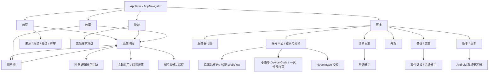

# 产品地图

## 文档职责与当前接受基线

本文件回答“App 现在有什么能力、用户从哪里进入、改动会影响哪里、交付前应回归什么”。实现方式以 `docs/architecture.md` 为准，测试强度与写操作授权以 `docs/testing-standard.md` 为准，具体命令以 `docs/operator-runbook.md` 为准。

- 当前接受基线：仓库现有能力默认都应保持可用，但不宣称零 bug。
- 用户最新明确要求优先；当前代码和实际运行结果是当前事实。本文与它们冲突时，先按事实处理，再修正文档。
- 精确的 Git revision、APK SHA、设备、登录态和一次性授权只记录在本机 `docs/emulator-baseline.md`，不得复制成长期稳定事实。
- 能力 ID 是开发与回归的共同语言，不是测试用例编号。开始改动前选择受影响 ID，交付时按 ID 报告自动测试、模拟器结果和未验证范围。
- 历史逃逸问题、精确失败 oracle 和最低可靠测试层见 `docs/regression-corpus.md`。
- 证据按 `STATIC_PASS`、`UNIT_PASS`、`UI_PASS`、`DEVICE_REPLAY_PASS`、`LIVE_PASS`、`APK_SANITY`、`NOT_VERIFIED`、`BLOCKED_BY_ENV` 分层；任何单层通过都不能代替其他层。

## 导航拓扑



详情和用户页可以嵌套打开；返回时必须恢复前一层 route、列表、筛选、草稿、回复状态和滚动上下文，而不是简单回到某个固定首页。

Modal、BottomSheet、WebView、系统浏览器、文件选择器、系统分享和安装器也是产品入口。验收不能只检查其父页面存在，必须检查打开、取消/返回及原页面状态恢复。

## 能力清单

表内“模拟器路径”是验收定位，不自动授予真实写操作权限。涉及回复、编辑、删除、互动、上传、投票、收藏切换、清空或登录清除时，仍按 `docs/testing-standard.md` 判断授权和恢复要求。

每个能力的完整契约由本节对应行、下方五站矩阵、证据覆盖索引和共享 seam 表共同组成：本节固定入口/前置状态、用户可见行为、代码与 Vitest；证据索引固定 UI、Replay、Live 和不可自动化边界；共享 seam 表固定改动时必须展开的关联能力。证据不足的行为必须标记 `NOT_VERIFIED`，不能靠缺少入口或一次空结果推断不支持。

### NAV：导航与状态恢复

| ID | 用户入口与行为契约 | 主要代码入口 | 自动测试 | 模拟器路径 |
| --- | --- | --- | --- | --- |
| `NAV-01` | 底部固定提供首页、搜索、收藏、更多；切换 tab 不应破坏各页已有状态。 | `src/app/AppNavigator.tsx`、`src/app/AppRoot.tsx`、`src/components/NavBar.tsx` | `src/app/AppNavigator.test.ts`、`src/androidSmokeGuard.test.ts` | 依次切换四个底部入口，再回到原 tab 检查状态。 |
| `NAV-02` | Feed、Search、Library 可进入 Topic；Topic 和 Library 可进入 User；User 可再次进入 Topic。NodeSeek 的 `/member?t=username` 是内部 User route，当前 Topic 找不到 UID 也不得降级为外部链接；`/space/{uid}` 直接使用 canonical UID。 | `src/app/AppNavigator.tsx`、`src/app/useTopicSessionController.ts`、`src/app/useUserController.ts` | `src/topicSessionState.test.ts`、`src/userNavigation.test.ts`、`src/appUtils.test.ts`、`tests/ui/app-navigator.test.tsx` | Agent Live 选择满足前置条件的对象执行列表 → Topic → User → Topic；固定数据 UI 测试不依赖动态首条。NodeSeek 用户链接专项见 `LIVE-READ-04`。 |
| `NAV-03` | 顶栏返回、Android 物理返回和嵌套详情返回一致；恢复筛选、列表、草稿、回复页和滚动快照。 | `src/app/backHandlerHelpers.ts`、`src/topicSessionState.ts`、`src/app/useTopicSessionController.ts` | `src/app/AppNavigator.test.ts`、`src/app/backHandlerHelpers.test.ts`、`src/app/useTopicSessionController.test.ts`、`tests/ui/app-navigator.test.tsx` | Agent Live 从嵌套详情逐层返回并复查原列表与搜索条件；固定返回栈由 UI 测试严格覆盖。 |

### FEED：首页与发现

| ID | 用户入口与行为契约 | 主要代码入口 | 自动测试 | 模拟器路径 |
| --- | --- | --- | --- | --- |
| `FEED-01` | 首页“全部”聚合五站主题，条目显示来源、分类、标题、作者、时间及适用统计；单站请求或凭据存储失败不应抹掉其他已成功来源，见 `REG-SOURCE-001`。HTTP 成功但带 `parse_empty` 诊断的页面不得当作合法空列表应用，见 `REG-SOURCE-002`。聚合分页只追加新页，不得重新排序或平衡已加载主题，见 `REG-FEED-008`；identity barrier 复用可信多页时同样不得重排，见 `REG-FEED-009`。启动身份未确认的来源不得从温缓存回显；安全来源一旦可见，在途读取、bootstrap key 切换和旧目标缓存都不得让列表退回 Loading 或旧快照，见 `REG-FEED-010`。整批身份对账的中间 barrier 不得成为 Query key；启动结算后 Feed/Categories 各聚合一次，身份不变的后续对账不重读，见 `REG-FEED-011`。真实会话变化必须清除该站及可能混入旧私有数据的“全部”聚合 Query，同时保留其他站，见 `REG-TOPIC-022`。 | `src/screens/FeedScreen.tsx`、`src/app/useFeedController.ts`、`src/app/serverState.ts`、`src/sources/sourceGateway.ts` | `tests/ui/feed-controller-xiaoyinsi.test.tsx`、`src/app/serverState.test.ts`、`src/sources/sourceGateway.test.ts`、`src/sources/sourceGatewayContract.test.ts`、`src/sourceErrors.test.ts` | 首页 → 全部；确认五站来源均可见，触发分页或自然身份对账后原可见主题不回跳，并能打开主题。 |
| `FEED-02` | 首页可切换 V2EX、linux.do、NodeSeek、妖火、小隐寺；每个单站只展示该站可用分类；切换后从目标列表首项开始展示。单站凭据存储读取失败必须明确失败，不能退化成匿名成功，见 `REG-SOURCE-001`；同一请求 key 刷新失败必须保留可信列表和 cursor，见 `REG-FEED-004`；加载下一页不得移动已加载主题，见 `REG-FEED-008`。managed 来源启动身份未确认时保持屏障，V2EX 与其他未变化来源继续可见，见 `REG-FEED-010`；整批账号对账只约束“全部”聚合，单站仍按自己的 barrier 独立工作，见 `REG-FEED-011`。 | `src/screens/FeedScreen.tsx`、`src/app/useFeedController.ts`、`src/feedCategoryRail.ts`、`src/feedLogic.ts`、`src/forumApi.ts`、`src/yaohuoApi.ts`、`src/localXiaoyinsi.ts`、`src/sources/sourceGateway.ts`、`src/components/listPerformance.ts` | `src/feedCategoryRail.test.ts`、`src/feedLogic.test.ts`、`tests/ui/feed-controller-xiaoyinsi.test.tsx`、`src/forumApi.test.ts`、`src/yaohuoApi.test.ts`、`src/localXiaoyinsi.test.ts`、`src/sources/sourceGatewayContract.test.ts`、`src/components/listPerformance.test.ts`、`tests/ui/feed-screen.test.tsx` | 逐站切换来源、分类并刷新，确认列表回到首项；触发分页后当前位置稳定。 |
| `FEED-03` | 聚合页提供全部、未读、已读、收藏；阅读和收藏来自本机资料，筛选不改变原站数据。 | `src/app/useFeedController.ts`、`src/readerData.ts`、`src/topicListItemState.ts` | `src/readerData.test.ts`、`src/topicListItemState.test.ts`、`tests/ui/feed-screen.test.tsx` | 在首页逐个切换阅读筛选，核对条目状态。 |
| `FEED-04` | 单站排序进入请求 key：V2EX 全部/最新/最热，linux.do 与小隐寺各自支持最新/热门/新·所有/新·话题/新·回复，NodeSeek 新帖子/新评论；刷新、分页、旧请求和重复 cursor 不得串列表，切换排序后回到首项。同一 key 的刷新失败保留旧列表，失败或 `parse_empty` 分页不得混入半页结果、丢失失败 cursor 或误判无更多，见 `REG-FEED-004`、`REG-SOURCE-002`。成功分页必须保持旧 topic key 序列为完整前缀，见 `REG-FEED-008`；可信多页进入 identity barrier 时继续保持该顺序，见 `REG-FEED-009`。身份 key 占位期间不得暴露旧 cursor；已有非空安全列表时，最后一个启动 barrier 解除不得回到 Loading，见 `REG-FEED-010`；整批身份事务期间不得创建中间 key 或使用旧 cursor，见 `REG-FEED-011`。小隐寺同一分类下的最新/热门也必须使用不同请求 key，见 `REG-XIAOYINSI-015`。 | `src/screens/FeedScreen.tsx`、`src/feedCategoryRail.ts`、`src/feedLogic.ts`、`src/app/useFeedController.ts`、`src/app/serverState.ts`、`src/localXiaoyinsi.ts`、`src/components/listPerformance.ts` | `src/feedLogic.test.ts`、`tests/ui/feed-controller-xiaoyinsi.test.tsx`、`src/app/serverState.test.ts`、`src/diagnostics.test.ts`、`src/localXiaoyinsi.test.ts`、`src/components/listPerformance.test.ts`、`tests/ui/feed-screen.test.tsx` | 单站切换排序，触发刷新和分页，确认列表归属、加载状态、旧页顺序和当前位置。 |

### SEARCH：搜索

| ID | 用户入口与行为契约 | 主要代码入口 | 自动测试 | 模拟器路径 |
| --- | --- | --- | --- | --- |
| `SEARCH-01` | “全部”并行搜索五站，按固定来源顺序渐进展示不可折叠的预览区块；每站最多显示 2 条完整 TopicCard，非空区块可进入对应单站，局部请求或凭据存储失败可重试且不阻断成功来源，见 `REG-SOURCE-001`；刷新失败还必须保留该站已加载的可信预览并显示本次错误，见 `REG-SEARCH-008`。自动化结算状态不得创建参与布局的空节点；聚合结算只附着在既有列表且覆盖 catalog 声明的全部搜索来源，见 `REG-SEARCH-016`。条目继续展示来源、标题和可确认的主题作者/头像；linux.do 与小隐寺的回复命中必须保留，缺少可靠 OP 时显示未知作者，不得把回复者或最后回复者冒充楼主，见 `REG-XIAOYINSI-018`、`REG-SEARCH-013`；不做跨站混排或自动分页。 | `src/screens/SearchScreen.tsx`、`src/app/useSearchController.ts`、`src/sources/sourceGateway.ts`、`src/localLinuxdo.ts`、`src/localXiaoyinsi.ts`、`src/components/TopicCard.tsx` | `src/app/useSearchController.test.ts`、`src/sources/sourceGatewayContract.test.ts`、`src/sourceErrors.test.ts`、`src/searchListItems.test.ts`、`src/localSources.test.ts`、`src/localXiaoyinsi.test.ts`、`tests/ui/search-screen.test.tsx`、`tests/ui/search-controller-ai.test.tsx` | 搜索 → 全部 → 提交同一关键词；检查五站预览、局部状态和“查看全部”，再进入单站打开结果。 |
| `SEARCH-02` | 可切换五个单站；首次输入关键词时，尚未启用的 Query 不得把提交按钮误标为 busy，见 `REG-SEARCH-006`。linux.do 与小隐寺单站按 `REG-XIAOYINSI-018`、`REG-SEARCH-013` 保留回复命中并只展示可靠 OP；连续列表不显示来源分组标题或展开状态，用户向下滚动且分页哨兵可见后自动续页，每次滚动最多加载一页。“全部”只提供每站最多 2 条预览且不分页。失败或 `parse_empty` 分页保留旧结果和失败页，只重试同一 cursor，见 `REG-SOURCE-002`。点击最近搜索立即以当前来源和筛选提交请求，历史最多 20 条且可逐条删除；清空关键词会清空当前结果。linux.do 的普通结果独立分页；开启 AI 搜索后仍以普通结果顺序为准，只在末尾追加去重后的 AI 独有结果。 | `src/screens/SearchScreen.tsx`、`src/app/useSearchController.ts`、`src/searchHistory.ts`、`src/searchListItems.ts`、`src/searchControllerResults.ts` | `src/app/useSearchController.test.ts`、`src/searchHistory.test.ts`、`src/searchListItems.test.ts`、`tests/ui/search-screen.test.tsx`、`tests/ui/search-controller-ai.test.tsx` | 在“全部”检查固定预览并进入单站；单站向下滚动自动续页；清空输入后点历史确认立即请求，再逐条删除历史；linux.do 开关 AI 后继续加载普通结果。 |
| `SEARCH-03` | 单站筛选按来源隔离：V2EX 支持相关性/时间、时间范围、节点、用户名、OR/AND；linux.do 支持全文/标题、层级分类候选、标签候选多选与任意/全部匹配、发帖人候选、回访范围、话题状态、快捷或精确日期、帖子/浏览量范围、专家回应及相关性/最新；小隐寺复用其中的标准 Discourse 子集（全文/标题、本站分类/标签/作者候选、任意/全部标签、回访、开放/关闭/公开/归档/无回复/单一用户/已解决/未解决、日期、帖子/浏览量范围和排序），但不显示 linux.do 专属的专家回应或 AI；并保留父分类包含子分类的服务端语义，见 `REG-XIAOYINSI-006`，标签候选参数边界见 `REG-XIAOYINSI-016`。NodeSeek 与妖火保留各自分类/排序筛选。分类、标签和发帖人只能提交对应站点候选；标签与用户请求防抖且拒绝过期响应，空作者输入不进入 Loading，分类或来源变化时不得重新展示旧标签候选。只有账号 Query 已确认身份的单一 linux.do、相关度排序和已提交查询下并行预取 AI 搜索，见 `REG-LINUXDO-005`；开关只使用当前缓存，AI 错误不阻断普通结果，新查询、筛选、排序或来源会清空缓存并关闭。弹层修改先留在草稿，关闭不应用，重置后仍需确认；确认后有关键词则从第一页重新搜索，分页和返回继续使用同一筛选。 | `src/searchFilters.ts`、`src/screens/SearchScreen.tsx`、`src/app/useSearchController.ts`、`src/localLinuxdo.ts`、`src/localXiaoyinsi.ts`、`src/sources/sourceGateway.ts` | `src/searchFilters.test.ts`、`src/localSources.test.ts`、`src/localXiaoyinsi.test.ts`、`src/sources/sourceGatewayContract.test.ts`、`src/app/useSearchController.test.ts`、`tests/ui/search-screen.test.tsx`、`tests/ui/search-controller-ai.test.tsx` | 逐站打开筛选弹层；linux.do 检查完整筛选及 AI；小隐寺检查标准子集、本站候选、解决状态、专属项缺席和父/子分类结果；检查取消、重置、确认、请求参数、分页和详情返回状态。 |
| `SEARCH-04` | 登录受限、验证、授权状态、WebView fallback、空结果和来源错误使用可理解状态；不能把登录/授权入口、旧请求或空解析误判成成功。验证只能由响应协议或 challenge 页面结构触发，正常 JSON、纯文本和可读业务 DOM 中的关键词不能拉起面板，见 `REG-VERIFICATION-002`。首屏来源错误重试整来源；已有结果后的分页错误必须保留旧结果，在来源尾部提示并只重试失败页，不自动重试，见 `REG-SOURCE-002`；聚合刷新失败同样保留可信预览并暴露来源级重试，见 `REG-SEARCH-008`。linux.do 前台验证按 `REG-LINUXDO-001/002/003` 在 overlay 内精确恢复原请求；服务端或原站明确退出时按 `REG-LINUXDO-004` 将 App 投影切回未登录搜索，但检测流程不得删除原站 Cookie。冷启动残留 `_t` 只作为候选，账号、搜索和 Topic 共用 canonical 会话视图；只有身份已确认才走登录搜索和 AI，未登录/登录模式使用不同 Query key，见 `REG-LINUXDO-005`。真实会话变化清除该来源普通/AI Query 并释放 Loading，但不清其他来源，见 `REG-TOPIC-022`；普通恢复失败时面板保持可重试，聚合与 AI 不自动弹出登录或验证面板，见 `REG-SEARCH-007`；NodeSeek 明确失效后必须与 More、Topic 同时使用该站未登录投影，灯不得保持登录绿色，并提示“未登录搜索使用 Google，结果可能不完整”，见 `REG-ACCOUNT-019`。五站未登录搜索保持各自真实协议：V2EX 走 SoV2EX，NodeSeek/linux.do 才走受限 Google fallback，小隐寺走公开 `/search.json`，妖火需要会话；Google 的精确 JS capability gate、普通搜索导航和最终结果都必须绑定 initial 同站任务，不能跨回论坛域、转成另一搜索或扩成任意 Google 白名单，见 `REG-SEARCH-014`。SearchGuard 的 exact `SG_REL` 访问故障仍须拦截且不得结算，但必须显示 Google 环境验证受限而非外部链接；只允许用户显式重试，见 `REG-SEARCH-015`。小隐寺授权状态不阻断未登录公开搜索，也不触发 WebView；AI 的零结果、403/404 不可用、限流/网络可重试必须与普通搜索状态隔离。 | `src/screens/SearchScreen.tsx`、`src/searchListItems.ts`、`src/googleSearchFallback.ts`、`src/app/useVerificationController.ts`、`src/app/useHiddenBrowserFetchController.ts`、`src/app/HiddenBrowserHost.tsx`、`src/siteSessionPrompts.ts`、`src/app/useSearchController.ts`、`src/app/serverState.ts` | `src/appSecurity.test.ts`、`src/searchListItems.test.ts`、`src/app/useVerificationController.test.ts`、`src/linuxdoActionClient.test.ts`、`src/loginWebViewScripts.test.ts`、`src/nodeseekBrowserFetchScript.test.ts`、`src/siteSessionPrompts.test.ts`、`src/localSources.test.ts`、`src/localXiaoyinsi.test.ts`、`src/app/useSearchController.test.ts`、`src/app/serverState.test.ts`、`src/sources/sourceGatewayContract.test.ts`、`tests/ui/search-screen.test.tsx`、`tests/ui/search-controller-ai.test.tsx`、`tests/ui/hidden-browser-host.test.tsx`、`tests/ui/session-controller-browser-flow.test.tsx` | 在当前登录态检查四个可登录来源的状态提示、分页失败保留结果、原页重试和详情返回；隔离未登录 Replay 以同一词检查 V2EX、NodeSeek、linux.do、小隐寺结果和妖火登录限制；linux.do AI 失败时确认普通结果仍可使用；不得靠清数据制造状态。 |

### TOPIC：主题详情与阅读

| ID | 用户入口与行为契约 | 主要代码入口 | 自动测试 | 模拟器路径 |
| --- | --- | --- | --- | --- |
| `TOPIC-01` | 五站主题详情展示来源、分类、标题、作者、时间、正文、适用统计和回复；Discourse 主题展示关闭、归档、置顶、已解决、采纳楼层和慢速模式等原站状态，正文后展示可折叠的已采纳答案；当前页缺少采纳楼层时静默精确补取并可就地展开全文，受限主题不得补取，见 `REG-TOPIC-026`。小隐寺主题与回复的回应统计在未授权只读状态也可见，并按 `REG-XIAOYINSI-017` 使用本站 `/emojis.json` 图片而不引用 linux.do 资源；emoji 目录必须经 `SourceGateway` 复用代理 fetcher、站点凭据、诊断和取消信号，切站后的迟到结果不得落地，见 `REG-TOPIC-027`。详情请求进入短后台且进程存活时，后台时长不得消耗请求 timeout 预算，恢复后原请求继续结算且不得自动重复发起，见 `REG-TOPIC-021`；读取本地 Cookie 的 `cookie-loaded` 观察事件不得取消正在执行的同站 Query，新凭据的 `session-updated` 及其他真实身份变化必须清除该来源旧详情、释放 Loading 并保留可重试目标，见 `REG-TOPIC-022`；来源失败或 `parse_empty` 应给出可重试状态且不得覆盖可信详情，见 `REG-SOURCE-002`。 | `src/screens/TopicScreen.tsx`、`src/screens/topic/TopicScreenBody.tsx`、`src/screens/topic/ReplyItem.tsx`、`src/app/useTopicController.ts`、`src/app/serverState.ts`、`src/discourseReactions.ts`、`src/discourseSourceReaders.ts`、`src/localXiaoyinsi.ts`、`src/sources/sourceGateway.ts` | `src/app/useTopicController.test.ts`、`src/app/sessionControllerHelpers.test.ts`、`src/app/serverState.test.ts`、`src/discourseReactions.test.ts`、`src/localYaohuo.test.ts`、`src/localXiaoyinsi.test.ts`、`src/topicDerivedData.test.ts`、`src/localSources.test.ts`、`src/sources/sourceGatewayContract.test.ts`、`tests/ui/topic-components.test.tsx`、`tests/ui/topic-reply-filters.test.tsx`、`tests/ui/topic-session-controller.test.tsx` | 从五站首页或搜索各打开一个主题；短后台路径另在请求仍在飞时按 Home，离线恢复后核对原详情无重试显示；小隐寺另核对主题状态、回应图片、采纳预览/完整回复和站点切换资源隔离。 |
| `TOPIC-02` | 正文正确呈现 HTML、链接、表格、图片、附件、视频、表情和站点格式；可信站内用户链接必须进入 App User route，NodeSeek 用户名链接不能因当前详情缺少 UID 候选而外开，见 `REG-TOPIC-039`。小隐寺主题与评论 `cooked` 中的 `` 必须按 `REG-XIAOYINSI-017` 保持 inline 图片。块级正文图片使用“适屏展示图 + 原图”双层模型：正文按 CSS 宽度与设备 DPR 选择最小足够候选，只挂载一次可随页面卸载取消的 native 请求；冷加载先用 4:3 占位与一个连续 Spinner，同一次请求 `onLoad` 取得真实尺寸并完成布局后仍遮罩，`onDisplay` 才让图片可见，不能先露小图再跳大；热重进复用同会话真实比例，见 `REG-TOPIC-004/040`。原生解码失败且响应明确为 SVG 时，共享 artifact 保留原始文档，正文显示单例 Chromium 生成的静态海报；全屏首帧沿用正文海报与 artifact 固有尺寸，动画 document 只在当前页挂载；poster 已 `onDisplay` 后，双指缩放起始或双击进入放大时把固定 1 倍 document 透明隐藏并切回同尺寸海报，回到 1 倍后直接显示同一 document，poster 未显示时不得隐藏当前动画制造空白；动画 WebView 必须是 Pager page 内、缩放树外的绝对定位 sibling，任何 scale 都只能作用于海报；邻页不得抢占昂贵恢复，保存仍取原始 SVG，见 `REG-TOPIC-018/020/038/045`。图片预览使用非循环横向 PagerView，每页由 ResumableZoom 负责缩放，只挂载当前与相邻页；父级方向手势保证 1 倍缩放下的慢拖和快速横滑都能推进 Pager，见 `REG-TOPIC-046`；初次相邻页低优先级下采样预热，升为当前页后切换高优先级并禁用原图下采样；支持缩放、双击、单击显隐控制层、1 倍缩放下拉关闭、失败重试、Android Back、无障碍增减页和按权限保存；不显示原图缩略图栏或左右箭头，快速重复点击只保存一次，见 `REG-TOPIC-006`。所有媒体授权由内容来源和原生重定向链决定，跨站匿名但继续加载；危险/相对候选不得成为主动 URL，预览与正文必须有限结算，见 `REG-TOPIC-029` 至 `REG-TOPIC-033`。带内部标记的媒体不得读写未分区的共享 OkHttp cache；opaque session identity 必须以进程 namespace + epoch 参与 Glide 模型与 cache key，并在出网前移除，使不同 epoch 的在途请求不能合并、重启后不能复用旧私有磁盘条目，见 `REG-TOPIC-037/041/042`。 | `src/screens/topic/TopicContentBlock.tsx`、`src/screens/topic/TopicBodyQuoteCard.tsx`、`src/app/useHtmlRenderingController.tsx`、`src/app/useImagePreviewController.ts`、`src/app/GlobalModalHost.tsx`、`src/components/ImagePreviewModal.tsx`、`src/components/CompatibleSvgDocumentView.tsx`、`src/compatibleImageSources.ts`、`src/svgPosterRenderer.native.ts`、`src/imageSave.ts`、`src/topicContentHtml.ts`、`src/mediaRequestContext.ts`、`src/mediaSessionEpoch.tsx`、`src/nsVideoEmbeds.ts`、`plugins/withNetworkProxyModule.js`、`plugins/withSvgRendererModule.js` | `src/appUtils.test.ts`、`src/topicContentHtml.test.ts`、`src/htmlImages.test.ts`、`src/nsVideoEmbeds.test.ts`、`src/compatibleImageSources.test.ts`、`src/imageSave.test.ts`、`src/mediaRequestContext.test.ts`、`src/mediaSessionEpoch.test.ts`、`src/localSources.test.ts`、`src/quotedPosts.test.ts`、`src/app/useTopicController.test.ts`、`tests/ui/topic-image-loading.test.tsx`、`tests/ui/topic-components.test.tsx`、`tests/ui/image-preview.test.tsx`、`tests/ui/compatible-svg-document-view.test.tsx`、`tests/ui/image-preview-controller.test.tsx`、生成的 `NetworkProxyRuntimeTest.kt`、`SvgRendererPolicyTest.kt` 与 `SvgRendererInstrumentedTest.kt` | 打开含正文引用和媒体的主题，分别检查站内用户链接、块图冷/热刷新与小图不露出、适屏正文/原图预览首帧连续、动态 SVG 静态正文海报与当前页动画、inline emoji、简介/完整帖、横滑/缩放/下拉关闭、失败重试、保存 busy、Android Back 和返回；NodeSeek 用户链接专项见 `LIVE-READ-04`，保存需另按授权。 |
| `TOPIC-03` | 回复区支持分页、全部/只看楼主/只看带图/倒序、评论内查找、引用关系和楼层定位；回复正文、回复目标、引用作者和签名中的可信用户链接共用内部 UserReference 导航，NodeSeek 用户名定位规则见 `REG-TOPIC-039`；Discourse 仍只有明确 username 可导航，display label 不得猜作 username，见 `REG-TOPIC-035`。评论引用默认显示简介，展开后显示匹配主题的完整帖子；同一 reference key 的引用实例共享 Query transport、缓存状态和精确 linux.do 验证恢复，见 `REG-TOPIC-007`；回复下一页验证恢复必须重试原 page/offset 而不是重取首屏，见 `REG-TOPIC-023`。回复实体存在 `commentId` 时必须以其作为稳定列表身份，楼层只承担展示、引用和缺少 id 时的回退；同楼层的不同实体不得复用 FlashList 高度，见 `REG-TOPIC-028`。评论保持透明平铺，仅引用区域使用卡片。Discourse 采纳回复保留普通回复结构与合法操作，并显示“已解决/解决方案”；首帖采纳预览在筛选或查找隐藏答案时恢复“全部”和空查询后精确定位。系统动作使用无楼层、正文占位或互动入口的紧凑事件行，关闭、重开及未知动作均提供可读文案且不泄露 action code，见 `REG-TOPIC-026`；Wiki、隐藏、折叠等状态继续按标准字段展示；linux.do 的待审批由 typed site extension 映射且不泄漏到其他站点，小隐寺映射其真实返回的采纳、隐藏、折叠与系统动作，并按 `REG-XIAOYINSI-017` 显示本站 reaction 图片和评论 inline emoji；emoji 目录切站/卸载时取消旧读取且迟到结果不能覆盖当前站点，见 `REG-TOPIC-027`。筛选后的可见数量应同步更新，详情嵌套返回后恢复筛选与查找，刷新不能让旧请求覆盖新状态；小隐寺写后计数采用服务端权威总数，见 `REG-XIAOYINSI-008`。 | `src/screens/topic/ReplyItem.tsx`、`src/screens/topic/TopicScreenBody.tsx`、`src/discourseReactions.ts`、`src/screens/topic/topicScreenHelpers.ts`、`src/app/useTopicController.ts`、`src/app/useTopicSessionController.ts`、`src/app/serverState.ts`、`src/localXiaoyinsi.ts`、`src/sources/sourceGateway.ts`、`src/quotedPosts.ts`、`src/themeStyles.ts` | `src/appUtils.test.ts`、`src/androidFeatureHelpers.test.ts`、`src/app/useTopicController.test.ts`、`src/app/serverState.test.ts`、`src/discourseReactions.test.ts`、`src/app/useTopicSessionController.test.ts`、`src/localXiaoyinsi.test.ts`、`src/sources/sourceGatewayContract.test.ts`、`src/screens/topic/topicScreenHelpers.test.ts`、`src/topicContentSplit.test.ts`、`src/theme.test.ts`、`tests/ui/topic-components.test.tsx`、`tests/ui/topic-reply-filters.test.tsx`、`tests/ui/topic-session-controller.test.tsx` | 逐项切换回复筛选并组合评论内查找，检查引用、站内用户链接、原站状态、reaction 图片、inline emoji 和五站末尾内容间距，分页和进入作者页后返回主题原位置；NodeSeek 专项见 `LIVE-READ-04`。 |
| `TOPIC-04` | 详情提供本机收藏；主题菜单提供分享、仅刷新评论、完整刷新、阅读设置和原站打开；操作后保持当前详情上下文。V2EX 评论刷新委托整篇读取时只有新详情实际落地才算成功，见 `REG-TOPIC-005`。 | `src/screens/topic/TopicMenu.tsx`、`src/app/useTopicController.ts`、`src/app/useTopicSessionController.ts`、`src/app/useReaderDataController.ts` | `src/app/AppNavigator.test.ts`、`src/app/useTopicController.test.ts`、`src/app/useTopicSessionController.test.ts`、`src/app/useReaderDataController.test.ts`、`tests/ui/topic-and-more-controls.test.tsx`、`tests/ui/topic-reply-filters.test.tsx`、`tests/ui/app-navigator.test.tsx` | 打开右上菜单；分享后取消，按授权检查可恢复的本机收藏；阅读设置返回回归见 `REG-TOPIC-002`。 |

`TOPIC-02` 的媒体 request identity 包含冻结的内容来源、进程 namespace 与该来源当前 session epoch。epoch 变化后，正文图、头像、预览图的 source headers、cache/recycling key 和 Expo Video source 必须重建；预览仍打开时也必须重置旧缩放、Pager 和动画遮罩状态，旧解码结果与 player 不得进入新页面。JS 不读取或拼接媒体 Cookie，只发送内部来源 marker 与 opaque identity；Android 在发网前移除两个内部头，并以首跳目标和整条重定向链单调决定 Cookie 资格。identity 保留在 Expo/Glide request model 中：同进程同 epoch 可复用，不同 epoch 不得合并在途请求，重启后不得复用旧私有磁盘条目。Glide 独立 clone 使用 30 秒总时限，普通 RN client 与视频保持原预算。见 `REG-TOPIC-029/031/032/041/042`、`REG-ACCOUNT-029/031`、`REG-TEST-003`。

`TOPIC-02` 的复杂 SVG 全屏预览按 artifact 能力分流：静态 artifact 继续显示正文已经生成的 poster，不再创建第二个 Chromium renderer；只有 `animated` artifact 的当前页可挂载隔离 document view，并以同一 poster 保持首帧连续。见 `REG-TOPIC-018/020/038/043`。

### USER：用户页

| ID | 用户入口与行为契约 | 主要代码入口 | 自动测试 | 模拟器路径 |
| --- | --- | --- | --- | --- |
| `USER-01` | 从作者、可信正文用户链接或关注列表进入用户页，展示来源、身份、适用统计、主题/回复列表和原站主页；分页与来源错误可恢复，已缓存或刚由 Profile Query 显示的下一 cursor 必须立即可加载，见 `REG-USER-001/006`；`parse_empty` 不得覆盖可信资料或推进 cursor，见 `REG-SOURCE-002`。凭据观察不得取消同站用户 Query；真实会话变化必须清除该来源旧资料、释放 Loading 并保留可重试定位字段，且不影响其他站，见共享回归 `REG-TOPIC-022/ACCOUNT-031`。User route 持有轻量 `UserReference`：source、可选 id/username、原站 URL 和展示 hint；NodeSeek username-only reference 先在当前 session epoch 解析 canonical 数字 UID，再启用 Profile、主题和回复 Query，分页始终复用 UID，见 `REG-TOPIC-039`。解析中和失败时留在 App User 页并提供刷新与显式“原站主页”；无匹配、非法响应、网络或 429 均不自动重试或外开。头像、显示名、简介、等级、统计与活动列表只来自当前 epoch 的 canonical Profile Query。小隐寺身份摘要与 authored topics 独立读取，主题只来自 `/topics/created-by/{username}.json`，见 `REG-XIAOYINSI-004`。 | `src/screens/UserScreen.tsx`、`src/app/useUserController.ts`、`src/app/serverState.ts`、`src/sources/sourceGateway.ts`、`src/localXiaoyinsi.ts` | `src/appUtils.test.ts`、`src/localSources.test.ts`、`src/sources/sourceGateway.test.ts`、`src/sources/sourceGatewayContract.test.ts`、`src/app/useUserController.test.ts`、`src/app/sessionControllerHelpers.test.ts`、`src/app/serverState.test.ts`、`src/localXiaoyinsi.test.ts`、`src/screens/user/userScreenItems.test.ts`、`tests/ui/user-screen.test.tsx`、`tests/ui/user-controller-session.test.tsx` | Topic → 作者或正文用户链接；Library → 关注用户；切换主题/回复。NodeSeek username-only 专项见 `LIVE-READ-04`。 |
| `USER-02` | 本机关注可切换，状态立即反映到用户页和 Library；从用户主题进入详情并返回时保留用户页状态。只有 canonical Profile 成功后才显示关注入口并以 canonical id 持久化；未解析的 `UserReference` 不得进入 ReaderData。 | `src/app/useUserController.ts`、`src/app/useReaderDataController.ts`、`src/components/TopicCard.tsx` | `src/userNavigation.test.ts`、`src/readerData.test.ts`、`src/components/TopicCard.test.ts`、`src/app/useReaderDataController.test.ts`、`tests/ui/user-screen.test.tsx` | 在获授权时关注后恢复原状态，再执行 User → Topic → 返回；解析中确认关注入口隐藏。 |

### LIBRARY：本机收藏、关注与历史

| ID | 用户入口与行为契约 | 主要代码入口 | 自动测试 | 模拟器路径 |
| --- | --- | --- | --- | --- |
| `LIBRARY-01` | 收藏帖子支持来源、该来源下的分类筛选和筛选数/总数提示，能打开详情和确认后取消本机收藏；它与原站收藏/书签是两套状态。切换 Library tab 会恢复“全部来源/全部分类”。 | `src/screens/LibraryScreen.tsx`、`src/screens/library/libraryScreenItems.ts`、`src/androidFeatureHelpers.ts`、`src/app/useReaderDataController.ts` | `src/androidFeatureHelpers.test.ts`、`src/androidSmokeGuard.test.ts`、`src/app/useReaderDataController.test.ts`、`tests/ui/library-screen.test.tsx` | 收藏 → 收藏帖子 → 来源/分类筛选 → Topic → 返回；取消收藏按授权。 |
| `LIBRARY-02` | 关注用户支持来源筛选，能打开用户页和取消关注；数量与用户页状态一致。关注记录只保存 canonical id，不保存 username-only `UserReference`；切换到关注用户时不显示分类筛选。 | `src/screens/LibraryScreen.tsx`、`src/screens/library/libraryScreenItems.ts` | `src/androidSmokeGuard.test.ts`、`src/userNavigation.test.ts`、`src/readerData.test.ts`、`tests/ui/library-screen.test.tsx` | 收藏 → 关注用户 → 来源筛选 → User → 返回。 |
| `LIBRARY-03` | 历史记录支持来源和分类筛选，可打开主题、删除单条或经确认后清空全部；读取、筛选和取消确认不能意外写原站。 | `src/screens/LibraryScreen.tsx`、`src/androidFeatureHelpers.ts`、`src/readerData.ts` | `src/androidFeatureHelpers.test.ts`、`src/readerData.test.ts`、`src/app/useReaderDataController.test.ts`、`tests/ui/library-screen.test.tsx` | 收藏 → 历史 → 来源/分类筛选 → Topic → 返回；删除和清空按授权。 |

### ACCOUNT：账号、Cookie、Device Code 与站点会话

`ACCOUNT-01` 与 `ACCOUNT-02` 共享启动身份契约：所有 managed 来源从 App runtime 首帧起为 pending；四站整批 probe 是一次 identity reconciliation transaction，默认“全部”在最终快照前不执行聚合读取，见 `REG-FEED-011`。只有本 runtime 已确认的来源后来再次进入 barrier 时才能只读复用旧内容，首次确认前的单站条目与旧错误均不可见，见 `REG-FEED-010`。

| ID | 用户入口与行为契约 | 主要代码入口 | 自动测试 | 模拟器路径 |
| --- | --- | --- | --- | --- |
| `ACCOUNT-01` | 更多 → 账号中心统一显示 NodeSeek、linux.do、妖火、小隐寺状态；公共刷新由四个独立 Query 一次更新四个可登录来源，远端 data/error/busy 直接从 Query result 派生，不回写第二份 session projection；小隐寺只读账号检查也不得借授权 workflow event 回写再投影，见 `REG-ACCOUNT-016`，普通检查失败必须保留上一份可信 Query 身份并只显示该站错误，见 `REG-ACCOUNT-017`。保存、清除、换号和重新授权等外部会话变化必须 reset 目标站 active/disabled Account Query；查询自身确认失效时先提交 exact `expired`，再只 seed 该结果到新 generation key，普通新 scope 不得继承旧登录；其他三站 data/error/busy 保持不变，见 `REG-ACCOUNT-019`。Account Query 与当前验证 workflow 合并后的同一 view model 是账号页、搜索登录路径/AI 和 Topic 写入口的唯一会话权限来源，不能让各入口分别读取 workflow 或 Cookie 猜测，见 `REG-WRITE-016`、`REG-LINUXDO-005`。未登录、匿名、验证、授权中、失效和检查失败不得混淆。单站凭据、启动恢复、身份、摘要或刷新收尾失败只标记该站、保留可信状态并允许其他站完成，见 `REG-ACCOUNT-001/002/003/006/008/017/019`；刷新期间保存的新会话不能被旧 generation 的结果覆盖，见 `REG-ACCOUNT-009`；妖火和 linux.do 明确失效不得被普通清理或 Cookie 状态覆盖，见 `REG-ACCOUNT-004/008`。四站只有当前凭据返回 current user 或可信账号容器内的 self-account 结构才算登录；明确匿名状态码/字段或准确游客结构才算退出，其他响应均 unknown。Cookie、旧 ID、Topic 作者、公开资料、普通业务文案和“页面可读”都不是身份正证据；NodeSeek 直连页面无身份证据时只为 Account probe 补渲染，身份脚本在 document 建立后提前等待 current user、配置对象自有 `user === null` 或完整登录/注册游客控件，并保留加载结束 fallback 与同请求幂等 guard；普通读取不提前注入，`false`、缺字段和空对象保持 unknown；linux.do 不得用匿名 CSRF 或残留 `_t` 证明登录；妖火公开内容里的“我的/欢迎”不得证明登录，只有精确登录 URL 上完整登录 form 才是退出证据，完整 form 优先于同页自带的验证码资源；小隐寺只以 User API `/session/current.json` 为准，见 `REG-ACCOUNT-037`。冷启动凭据只能建立候选态，未知检查只保留此前远端已确认的数据，不能保留本次 Cookie 猜测。已登录且已识别身份时可进入本人主页；小隐寺的重新授权与撤销授权仍由独立授权面板提供。 | `src/screens/more/AccountCenterPanel.tsx`、`src/app/useAccountStatusController.ts`、`src/app/useSessionController.ts`、`src/app/useAccountCredentialController.ts`、`src/app/useXiaoyinsiAuthController.ts`、`src/siteSessionState.ts` | `src/screens/more/accountCenter.test.ts`、`tests/ui/account-status-controller.test.tsx`、`src/linuxdoActionClient.test.ts`、`src/app/sessionControllerHelpers.test.ts`、`src/app/serverState.test.ts`、`tests/ui/account-controller.test.tsx`、`src/app/accountCredentialDiagnostics.test.ts`、`src/siteSessionState.test.ts`、`tests/ui/search-controller-ai.test.tsx`、`tests/ui/xiaoyinsi-auth-controller.test.tsx`、`tests/ui/topic-actions-controller.test.tsx`、`src/localSources.test.ts`、`src/nodeseekBrowserFetchScript.test.ts`、`src/yaohuoApi.test.ts`、`src/yaohuoActionClient.test.ts`、`src/forumApi.test.ts` | 更多 → 账号中心 → 刷新账号状态；逐站核对状态；隔离未登录 AVD 必须让 NodeSeek、妖火结算为未登录并进入既有只读/搜索协议；保留自然残留 Cookie 冷启动时核对四站账号、搜索与写入口一致。 |
| `ACCOUNT-02` | NodeSeek、linux.do、妖火登录/验证必须在 App 内 WebView 完成；NodeImage 授权页共享 NodeSeek 身份。打开任一登录 surface 只建立 identity barrier，不清、写或覆盖 Cookie，也不删除可信缓存；Feed 复用旧可信多页时不得重新排序，见 `REG-FEED-009`。关闭按钮、系统返回、离开 More、切换站点及 NodeImage 成功/取消均立即收起页面并异步对账，隐藏页面重复关闭与 linux.do inactive 暂时卸载必须 no-op，见 `REG-ACCOUNT-031`。四站 verifier 只接受 current-user、准确游客或 unknown 三态；仅位于 login/register URL 不是退出证据，必须同时出现站点契约的准确游客结构；unknown 保留旧身份只读并暂停写入。原站 Cookie 只由网站与 Android `CookieManager` 持有，原生接口只按准确 URL 读取，响应不回写；读取空值与错误分离且读取前不调用 `flush()`。只有用户明确点击“清除登录”才允许 `clearManagedLoginCookies(source)` 定向过期并回读确认，NodeSeek/linux.do 保留 Cloudflare Cookie，其他站不受影响，见 `REG-ACCOUNT-026/027/029/031`。可见 WebView 使用 Android provider 的真实默认 UA；fallback 首跳不附加 App Cookie header，桥接消息只接受对应 HTTPS origin。 | `src/authSurfaceCoordinator.ts`、`src/managedCookies.ts`、`plugins/withNetworkProxyModule.js`、`src/nodeseekSession.ts`、`src/linuxdoSession.ts`、`src/yaohuoSession.ts`、`src/app/useAccountStatusController.ts`、`src/app/useAccountController.ts`、`src/app/useSessionController.ts`、`src/app/useVerificationController.ts`、`src/app/HiddenBrowserHost.tsx`、`src/app/GlobalModalHost.tsx`、`src/components/LoginWebViewModal.tsx` | `src/authSurfaceCoordinator.test.ts`、`src/managedCookies.test.ts`、`src/nodeseekSession.test.ts`、`src/linuxdoSession.test.ts`、`src/yaohuoSession.test.ts`、`src/loginWebViewScripts.test.ts`、`src/releasePackaging.test.ts`、`tests/ui/account-status-controller.test.tsx`、`tests/ui/account-controller.test.tsx`、`src/app/useVerificationController.test.ts`、`src/app/sessionControllerHelpers.test.ts`、`tests/ui/account-site-panels.test.tsx`、`tests/ui/hidden-browser-host.test.tsx` | 保留 App 数据分别打开三站登录页与 NodeImage 后通过关闭、系统返回、离开 More 和切站退出；核对页面打开不退出、关闭后 A→A 自动对账。真实换号、退出和清除 Cookie 需另行授权。 |
| `ACCOUNT-03` | 保存的账号密码按站点隔离在 SecureStore；只在可信登录 URL/字段主动填入且不自动提交。单站摘要读取失败不得隐藏其他站已保存摘要，NodeSeek 登录桥接只接受站点自身 HTTPS 消息，见 `REG-ACCOUNT-005/006`；凭据删除与网站退出互不等价。 | `src/credentialVault.ts`、`src/loginFormAdapters.ts`、`src/app/useAccountCredentialController.ts`、`src/app/accountCredentialDiagnostics.ts`、`src/app/useAccountController.ts` | `src/credentialVault.test.ts`、`src/loginFormAdapters.test.ts`、`src/app/useAccountCredentialController.test.ts`、`src/app/accountCredentialDiagnostics.test.ts`、`tests/ui/account-controller.test.tsx` | 打开可信登录页检查填入行为；不展示或记录密码。 |
| `ACCOUNT-04` | 账号中心保留 NodeSeek 签到/NodeImage、linux.do 与小隐寺的等级进度/活跃数据和四个可登录来源的原站主页等站点服务；小隐寺等级只走独立 User API Key，并在授权管理下方以独立“查看等级”入口呈现，见 `REG-XIAOYINSI-013/014`；NodeSeek 签到使用独立的全局 mutation 身份，不能继承残留 Topic，见 `REG-WRITE-015`。用户主动“获取 / 恢复授权”时，NodeImage 必须先确认 NodeSeek owner/epoch，再以独立 WebView mount 和声明式脚本探测现有 NodeImage session；页面已有 `#apiKeyInput` 时直接读取，否则请求 `/api/user/api-key`，取得 Key 即保存并关闭且 Connect 为零。只有该 API 返回精确 `401 + JSON error` 才进入一次 NodeSeek Connect，随后自动回到 NodeImage verify；API 的 HTML 403、网络、5xx、解析失败或成功响应缺 Key 均停止且不得再用 DOM 掩盖错误或猜成失效。Native 消息来源只证明 HTTPS origin，脚本另报精确 phase `documentUrl`；Connect ready 可每 500ms 重发，但 `/api/cAuth` 仍最多一次。三个 phase 分别在 30/60/30 秒内结算；Connect 超时必须区分尚未调用与调用后结果未知，且不自动重试。网页不可点击或刷新，不依赖按钮、popup 或 `window.opener`。三份状态保持独立，不复制 Cookie；nonce、owner、epoch、credential generation 与最终对账门禁继续生效，见 `REG-ACCOUNT-010/038/040`。 | `src/app/useAccountController.ts`、`src/app/useXiaoyinsiAuthController.ts`、`src/app/useNodeImageAuthController.ts`、`src/app/AppRoot.tsx`、`src/screens/MoreScreen.tsx`、`src/screens/more/LinuxDoLevelPanel.tsx`、`src/discourseLevel.ts`、`src/linuxdoLevel.ts`、`src/localXiaoyinsi.ts`、`src/nodeseekActions.ts`、`src/nodeimageAuthFlow.ts`、`src/nodeimageCredentials.ts`、`src/loginWebViewScripts.ts` | `src/linuxdoLevel.test.ts`、`src/localXiaoyinsi.test.ts`、`tests/ui/more-screen.test.tsx`、`tests/ui/xiaoyinsi-auth-controller.test.tsx`、`tests/ui/topic-actions-controller.test.tsx`、`src/nodeseekActions.test.ts`、`src/nodeimageAuthFlow.test.ts`、`src/nodeimageAuthWebViewScripts.test.ts`、`src/loginWebViewScripts.test.ts`、`src/nodeimageCredentials.test.ts`、`tests/ui/nodeimage-auth-controller.test.tsx`、`tests/ui/global-modal-host.test.tsx`、`src/diagnostics.test.ts`、`src/accountSessionLabels.test.ts` | 保留现有 NodeImage session 时点击“获取 / 恢复授权”，应自动保存、关闭且诊断无 `connect-started`；真实失效 Connect 需配额可用时另验。 |
| `ACCOUNT-05` | 支持时，保存的账号密码使用 Android 用户身份认证保护；设备不支持时必须明确确认后才降级为本机加密。填入和删除的认证取消不得损坏凭据，用户界面统一使用“用户身份认证”。 | `src/credentialVault.ts`、`src/screens/more/AccountCenterPanel.tsx`、`src/app/useAccountCredentialController.ts` | `src/credentialVault.test.ts`、`tests/ui/account-center.test.tsx` | 账号中心 → 自动填入；只检查设置、管理、提示和取消，不展示密码，不通过清登录制造状态。 |
| `ACCOUNT-06` | 小隐寺只使用 Discourse Device Code：检查站点能力，Android Keystore 生成 RSA 2048/OAEP 密钥；系统浏览器只承载一次性 Google / Discord 身份确认与站点授权页，不提供 Cookie 或 App 登录态。App 前台按服务端间隔轮询、解密并严格校验 nonce，之后只由 User API Key、Client ID 和 `/session/current.json` 维护会话；已认证读取的 401/403 先复核该会话，不把单主题无权限直接当成退出；写操作授权复核失败不得覆盖原始操作错误或抛出恢复异常，见 `REG-XIAOYINSI-021`。Token 已保存后的普通 session 复核失败先重试现有授权，不重复生成 Device Code，见 `REG-XIAOYINSI-019`。重授权拒绝、取消或过期后的旧会话复核若只是暂时失败，保留可信状态而不清空，见 `REG-XIAOYINSI-020`。授权可在十分钟内跨进程恢复，后台暂停轮询；重授权、取消、撤销及卸载都必须使迟到的 poll/session 结果失效。User API Key 独立保存且不进 Cookie、ReaderData、备份或诊断，也不伪装成 `cookieSummary`。服务端撤销失败保留本机凭据；成功后以清理 tombstone 保证重启先清本机材料且绝不恢复旧 Device Code，部分失败退出并提供重试，见 `REG-XIAOYINSI-005`、`REG-XIAOYINSI-007`；不支持 Device Code 时保持匿名阅读，不降级 WebView。 | `src/xiaoyinsiAuth.ts`、`src/xiaoyinsiKeystore.ts`、`src/app/useXiaoyinsiAuthController.ts`、`src/app/useTopicActionsController.ts`、`src/screens/more/XiaoyinsiAuthPanel.tsx`、`src/sources/sourceGateway.ts`、`plugins/withXiaoyinsiAuthModule.js` | `src/xiaoyinsiAuth.test.ts`、`src/sources/sourceGatewayContract.test.ts`、`tests/ui/topic-actions-controller.test.tsx`、`tests/ui/xiaoyinsi-auth-controller.test.tsx`、`tests/ui/more-screen.test.tsx`、`src/releasePackaging.test.ts` | 账号中心 → 小隐寺 → 授权登录；只检查验证码复制、一次性授权页打开、等待/取消/过期/重试。真实 Google / Discord 身份确认由用户操作，Agent 不读取或输入凭据。 |

`ACCOUNT-01/02/04/06` 共用 Account canonical identity、同步 `SessionRuntimeSnapshot` 与 `ForumSessionEpochs`：probe 开始和 canonical commit 先同步 runtime 再完成 Promise；身份 pending、登录 surface 尚未卸载或恢复屏障存在时不发新私有请求。A→A 只解除 barrier；A→B、A→anonymous 或 anonymous→B 原子提交新身份、递增目标站 epoch并清理目标站及 `all` 私有 Query、Level/AI、Topic 服务端数据和 managed media 身份缓存；unknown 保留上一份可信身份与已加载内容只读。验证恢复先关闭并卸载面板，再恢复原 Query。Feed/Search 聚合只暂停 dirty 来源，其他来源继续刷新；Topic route 的选择、滚动、筛选和草稿保留，但正文、回复和用户资料不能跨 epoch 复用。见 `REG-ACCOUNT-031/035`。

`ACCOUNT-04` 的等级刷新使用 error-first 语义：失败时可以保留旧可信数据，但必须返回本次错误、不得提示成功或自动重试，见 `REG-ACCOUNT-018`。Device Replay 会从小隐寺“查看等级”入口发起一次读取，先等待只在 profile/error 结算后出现的 `xiaoyinsi-level-settled`，再确认成功和错误共有的“刷新等级”，不要求第三方实时数据成功；动态等级与活跃数据由 `tests/live/agent-live.md` 独立核实，明确限流只阻塞数据验证，不得覆盖正确错误流程或阻断其他 More 旅程，见 `REG-TEST-005`。

`ACCOUNT-01/02` 的 NodeSeek `verified` 是访客 Cloudflare 验证状态，不是账号登录：它与 `anonymous` 一样保持 `isLoggedIn=false`、不增加网站登录计数、关闭写入并使用匿名 Google 搜索。隔离 AVD Replay 必须接受“未登录”与仅访客“已验证”两个准确终态，同时拒绝“已登录”、pending、unknown 和 expired，见 `REG-TEST-004`。

`ACCOUNT-02` 补充契约：linux.do 手动检测只由当前 WebView session、唯一 probeId 与合法 linux.do documentKey 的回执结算；事件 URL 与页面内 URL 只要求同为允许的 HTTPS host，不要求重定向后的路径逐字一致。固定延时不得提前判定，无回执超时保持 `unknown`，导航、关闭或新检查取消旧 probe，见 `REG-ACCOUNT-021`。

`ACCOUNT-02` 补充契约：NodeSeek/妖火凭据填入 attempt 只关联当前 probe/fill，不得作为 WebView key；新 attempt 必须注入当前已挂载页面，只有 renderer 退出后的显式刷新才允许 remount。NodeSeek 登录 Cookie 清理必须覆盖 host-only 与 `Domain=nodeseek.com; Path=/` 身份，完成后回读确认目标 Cookie 不再可见，并保留 `cf_clearance` 与其他站状态，见 `REG-ACCOUNT-022`。

`ACCOUNT-01`、`SEARCH-04`、`TOPIC-01`、`WRITE-01/03` 共享登录投影 seam：普通页面读取凭据只能发布不带身份结论的观察事件，不得把账号检测确认的登录降级；明确的当前账号验证结果仍按站独立生效，见 `REG-ACCOUNT-023`。NodeSeek 当前身份只读当前首页/设置页的 `__config__.user` 或专属 self-account 结构，不调用不存在的无 ID `getInfo` 路由，也不把 `/api/account/getInfo/{id}` 公开资料当作登录证明；Account 直连响应无证据时才补 WebView，渲染脚本不得把帖子列表 ready 当作身份 ready，配置对象自有 `user === null` 或页面准确游客控件只能授权 App 投影为失效，不能授权删除原站 Cookie。清除登录是独立的用户破坏性操作，见 `REG-ACCOUNT-024/026/037`。

`ACCOUNT-01/02` 补充当前身份接口门禁：生产 endpoint 必须来自官方源码/文档、当前站点实际调用或成熟客户端，测试 mock 不能创造接口或状态码契约。四站分别以 NodeSeek 当前页 `__config__.user` 对象/本人控件、linux.do Cookie session current user、小隐寺 User API session current user、妖火 WAP `div.top2` 本人导航作为登录正证据；NodeSeek 不递归接受无关嵌入 profile，退出只接受渲染后配置对象自有 `user === null` 或完整游客控件。Cookie 名只用于摘要，不能直接证明登录，也不能阻止已有候选进入真实 current-session 验证；adapter 无 current user 不能保存。退出证据按站点协议分别判断，未获契约支持的状态一律 unknown。小隐寺只有 reader 识别 Discourse JSON `invalid_access` 后产生的 typed expiry 可以退出，Controller 不解释原始 403；妖火公开首页 unknown 时只补读精确登录页，必须同时验证 form 名称、POST 方法、账号和密码字段，不能只看 URL，且完整 form 的退出结论不得被同页验证码脚本改成 verification。公开资料只补全已证明身份并用真实昵称替换数字 ID 占位，补全失败不得退出或清理。见 `REG-ACCOUNT-025/026/037`。

### WRITE：回复、编辑、删除、互动与上传

| ID | 用户入口与行为契约 | 主要代码入口 | 自动测试 | 模拟器路径 |
| --- | --- | --- | --- | --- |
| `WRITE-01` | NodeSeek、linux.do、妖火详情按账户 Query 与当前验证 workflow 合并后的登录态显示回复和楼层回复，不能读取旧 workflow state 造成账号页与入口相反，见 `REG-WRITE-016`；某站明确失效后该站 Account Query 必须立即清空并关闭写入口，其他站不变，见 `REG-ACCOUNT-019`；小隐寺还必须满足主题 `can_create_post`，不能回复时仍保留原站允许的逐条互动，见 `REG-XIAOYINSI-007`。三站写请求只允许原 credential generation 提交结果，换号后的旧失败不得清新会话或弹登录，见 `REG-ACCOUNT-009`。编辑器 BottomSheet 支持打开/收起、草稿恢复、引用、常用格式、表情和图片插入；小隐寺 Markdown 与上传入口由 `REG-XIAOYINSI-002` 固定，并按 `REG-XIAOYINSI-017` 从本站 emoji 目录插入 `:name:`；图片 Markdown 写入后解除编辑器忙碌态；提交期间防重复。V2EX 保持只读。 | `src/screens/topic/ReplyComposer.tsx`、`src/screens/topic/ReplyComposerSheet.tsx`、`src/screens/topic/TopicScreenBody.tsx`、`src/discourseSourceReaders.ts`、`src/app/useTopicActionsController.ts`、各站 action client | `tests/ui/topic-actions-controller.test.tsx`、`src/app/topicActionControllerHelpers.test.ts`、`src/app/topicActionHelpers.test.ts`、`src/replyImageUpload.test.ts`、`tests/ui/reply-composer.test.tsx`、`tests/ui/topic-reply-filters.test.tsx` | 只检查入口、输入、表情草稿、收起/恢复和权限；真实评论提交必须按授权。 |
| `WRITE-02` | 编辑/删除只按原站解析出的逐条权限显示；Discourse 权限缺失必须 fail-closed。NodeSeek 编辑使用真实 commentId；当前请求在未传 token 时生成 16 位 `csrf-token`。linux.do 与小隐寺使用原站 edit/delete 权限；小隐寺认证 Topic/Posts 读取必须请求并映射原始 Markdown，匿名读取不请求，见 `REG-XIAOYINSI-010`；删除经服务器确认后本地移除并只静默刷新回复切片，不整篇重载，见 `REG-XIAOYINSI-012`。妖火仅在存在删除链接时可删且不提供编辑；NodeSeek 未确认删除时不显示。 | `src/app/useTopicActionsController.ts`、`src/discourseModel.ts`、`src/discourseActions.ts`、`src/localXiaoyinsi.ts`、`src/nodeseekActions.ts`、`src/xiaoyinsiActions.ts`、`src/yaohuoActions.ts` | `src/discourseModel.test.ts`、`src/discourseActions.test.ts`、`src/localXiaoyinsi.test.ts`、`src/nodeseekActions.test.ts`、`src/xiaoyinsiActions.test.ts`、`src/yaohuoActions.test.ts`、`src/app/topicActionControllerHelpers.test.ts`、`tests/ui/topic-actions-controller.test.tsx` | 检查自己的回复操作菜单和小隐寺编辑器预填；真实编辑/删除评论必须按授权和清理约束。 |
| `WRITE-03` | NodeSeek 支持点赞、鸡腿、反对、原站收藏和投票；其投票只在读取/提交请求携带原站已验证的动态签名，未投时隐藏结果票数，成功加载后在原标记位置的同一正文树内渲染卡片，不拆散前后文本、不增加正文分隔线且不追加底部副本，部分失败保留失败标记并降级为 `partial`，见 `REG-WRITE-007`、`REG-WRITE-009`、`REG-WRITE-010`。NodeSeek 提交前必须确认“提交后不可修改”，取消为零请求；确认后只 POST 一次，再 GET 一次权威快照并同步当前 Topic 与活动 route snapshot，GET 失败只保留已投/所选项和未知票数，不重投，见 `REG-WRITE-007`、`REG-WRITE-008`。linux.do 与小隐寺的点赞、原站书签和投票使用同一 Discourse 语义，先由 `REG-WRITE-016` 的合并会话投影确认站点可写，再叠加主题或逐条对象权限；该投影按站隔离，目标站失效后不得由旧 Account Query 继续开放互动，见 `REG-ACCOUNT-019`；系统事件无论原始权限字段如何都不显示回复、点赞、编辑、删除或投票入口，见 `REG-TOPIC-026`。点赞/书签先局部显示 optimistic 状态，请求失败恢复原状态，确认后同步活动 route snapshot。linux.do 首次投票成功后的已知选项票数与参与人数只增量一次，见 `REG-WRITE-001`。小隐寺 Topic 取消收藏不依赖 bookmark id，见 `REG-XIAOYINSI-003`；已点赞时即使 `can_act=false` 仍允许取消，见 `REG-XIAOYINSI-009`；不整篇重载，见 `REG-XIAOYINSI-012`。妖火支持可切换的原站收藏和投票：收藏查询失败不阻断详情且诊断为 `partial`，只有服务端确认后才局部更新，不进入整页忙碌态或重新提交正文，见 `REG-WRITE-002` 至 `REG-WRITE-005`。NodeSeek、linux.do、妖火互动的成功/失败提交也受 credential generation 所有权保护，见 `REG-ACCOUNT-009`。所有已确认 action 同步活动 route snapshot，见 `REG-WRITE-006`。V2EX 只展示互动信息；不可逆或客户端不能撤销的操作不得按“可恢复切换”验收。 | `src/screens/topic/TopicActionBar.tsx`、`src/screens/topic/TopicPolls.tsx`、`src/app/useTopicActionsController.ts`、`src/app/useTopicSessionController.ts`、`src/discourseActions.ts`、`src/discourseSourceActions.ts`、`src/discoursePermissions.ts`、`src/nodeseekPolls.ts`、各站 action client、`src/yaohuoApi.ts` | `src/discourseActions.test.ts`、`src/discourseSourceActions.test.ts`、`src/discoursePermissions.test.ts`、`src/localSources.test.ts`、`src/xiaoyinsiActions.test.ts`、`src/xiaoyinsiActionClient.test.ts`、`src/nodeseekActions.test.ts`、`src/nodeseekActionClient.test.ts`、`tests/ui/topic-actions-controller.test.tsx`、`src/topicActionState.test.ts`、`src/yaohuoApi.test.ts`、`src/screens/topic/TopicPolls.test.ts`、`tests/ui/topic-components.test.tsx`、`tests/ui/topic-reply-filters.test.tsx`、`tests/ui/topic-session-controller.test.tsx` | 先看入口和权限；NodeSeek 未投目标只可打开确认并取消，真实提交必须按具体对象和选项逐次授权且不得重试；其余互动按站点、对象和可逆性核对最终状态。 |
| `WRITE-04` | NodeSeek 经 NodeImage、linux.do 与小隐寺经各自 `/uploads.json`、妖火经图床上传并插入对应 Markdown/UBB；NodeSeek 只读取已保存且属于当前身份的 Key，缺失、归属不符或上传返回 401/403 时只提示到账号中心获取授权或手动粘贴，不打开授权页、不清 Key、不重试上传或重新打开文件选择器，草稿保持不变。其他上传失败同样不得提交残缺正文或泄露凭据；四站都由完整上传工作流持有忙碌态，草稿写入后立即恢复编辑器。 | `src/replyImageUpload.ts`、`src/discourseActions.ts`、`src/discourseSourceActions.ts`、`src/app/useTopicActionsController.ts` | `src/replyImageUpload.test.ts`、`src/discourseActions.test.ts`、`src/discourseSourceActions.test.ts`、`src/linuxdoUpload.test.ts`、`tests/ui/topic-actions-controller.test.tsx` | 只检查选择/授权入口；真实上传因残留文件风险需单独授权。 |

`WRITE-01/02/03/04` 与 NodeSeek 签到统一先经 `ensureWritableSession(source)` 取得一次性 identity/epoch ticket。dirty 会话先复核；换号、退出、unknown 或 ticket 过期均在 Query snapshot、optimistic update、文件选择、上传、transport 和写后刷新结算前终止，所有等待后再次校验。未确认失败恢复仍存在的旧 scope optimistic snapshot，但不重建已清除的旧 epoch Query；已确认后换代只结算 `stale + serverConfirmed`，不回滚或写新 epoch。只有站点 client/runtime 给出的 `login-required`、`login-expired`、`verification-required` 请求一次 Account Query 对账；`ordinary` 与 `permission-denied` 只结算本次 mutation，不建立 barrier，也不自动重放非幂等请求。NodeImage 自动取得或在账号中心手动粘贴的 Key 都在保存时绑定当前已确认的 NodeSeek identity；旧版未验证 Key 不可用于上传，用户需重新获取授权或重新粘贴。见 `REG-WRITE-023/024/025`。

### DATA：本机资料、持久化与备份

| ID | 用户入口与行为契约 | 主要代码入口 | 自动测试 | 模拟器路径 |
| --- | --- | --- | --- | --- |
| `DATA-01` | 已读、本机收藏、关注和历史作为一个 ReaderData 领域保存；写入排队、失败回滚、旧保存完成和多次快速修改不得丢数据。 | `src/readerData.ts`、`src/readerDataStore.ts`、`src/app/useReaderDataController.ts` | `src/readerData.test.ts`、`src/readerDataStore.test.ts`、`src/app/useReaderDataController.test.ts` | 重启前后核对收藏/关注/历史；真实切换后恢复原状态。 |
| `DATA-02` | 当前 ReaderData 使用 AsyncStorage 单键 `reader-data`、格式版本 2；设置用 `reader-settings`，搜索历史用 `reader-search-history`。不得在无迁移和回退方案时改变 key、结构或写入时序。 | `src/readerDataStore.ts`、`src/readerData.ts`、`src/searchHistory.ts`、`src/app/useSearchController.ts` | `src/readerDataStore.test.ts`、`src/readerData.test.ts`、`src/searchHistory.test.ts` | 覆盖安装/重启后核对既有本机数据；不得清 App 数据制造状态。 |
| `DATA-03` | JSON 备份只包含允许的本机资料和设置；限制大小/深度并拒绝敏感字段。导出取消、损坏导入、合并和失败回滚要有明确结果。Cookie、密码、代理和 token 永不进入备份。 | `src/screens/more/MorePanels.tsx`、`src/app/useBackupStatusController.ts`、`src/readerBackup.ts`、`src/backupImportFile.ts`、`src/backupOperation.ts`、`src/backupFiles.ts` | `src/readerBackup.test.ts`、`src/backupImportFile.test.ts`、`src/backupOperation.test.ts`、`src/appSecurity.test.ts`、`tests/ui/topic-and-more-controls.test.tsx`、`tests/ui/backup-status-controller.test.tsx` | 更多 → 备份/恢复；导出或导入需按数据风险授权。 |

### MORE：工具、代理、诊断、外观与更新

| ID | 用户入口与行为契约 | 主要代码入口 | 自动测试 | 模拟器路径 |
| --- | --- | --- | --- | --- |
| `MORE-01` | HTTP/SOCKS5 服务器代理保存在安全存储，可做完整 TLS/HTTP 连通性测试并启停；密码输入必须遮蔽。原生启动、启用、切换、关闭、WebView 回调失败或配置读取失败时 App 请求和 WebView 都必须 fail-closed，旧 tunnel、受管请求和 bridge 资源必须释放，并限制正常并发；本地开发地址除外，见 `REG-PROXY-001`、`REG-PROXY-004`、`REG-PROXY-005`。只读 WebView CookieJar 安装在同一受管 OkHttp client 上；普通站点失败不得全局 cancel/evict 或误伤其他站请求，见 `REG-PROXY-006`。 | `src/networkProxy.ts`、`src/app/useNetworkProxyController.ts`、`src/screens/more/NetworkProxyModal.tsx`、`plugins/withNetworkProxyModule.js` | `src/networkProxy.test.ts`、`src/networkProxyControllerGuard.test.ts`、`src/networkProxyModalGuard.test.ts`、`src/webViewProxyGuard.test.ts`、`src/appUpdateProxyGuard.test.ts`、`src/releasePackaging.test.ts`、生成的 `NetworkProxyRuntimeTest.kt`、`tests/ui/network-proxy-modal.test.tsx` | 更多 → 服务器代理；默认只读核对配置与密码遮蔽。真实启停和公网连通性测试必须另获授权并最终恢复关闭。 |
| `MORE-02` | 诊断记录请求阶段、归属和终态，局部来源、凭据、解析或写后刷新失败必须把整体成功终态提升为 `partial`，但不记录内容或 secret；账号公共刷新只记录失败站并保持另外三站完成，不因缓存复位误报全站退出，见 `REG-ACCOUNT-019`；两份 1 MiB 轮转，导出走系统分享且清理临时文件。 | `src/diagnostics.ts`、`src/diagnosticFileStore.ts`、`src/sources/sourceGateway.ts` | `src/diagnostics.test.ts`、`src/diagnosticFileStore.test.ts`、`src/sources/sourceGatewayContract.test.ts`、`tests/ui/account-status-controller.test.tsx`、`tests/ui/topic-actions-controller.test.tsx` | 更多 → 诊断日志 → 生成/分享后取消；检查无敏感可见内容。 |
| `MORE-03` | 外观支持字号、浅/深色主题、列表密度、行距、正文宽度和字体；切换立即生效并持久化，不应挤压主要页面。 | `src/screens/more/MorePanels.tsx`、`src/app/useReaderSettingsController.ts`、`src/theme.ts`、`src/themeCore.ts` | `src/app/useReaderSettingsController.test.ts`、`src/theme.test.ts`、`tests/ui/topic-and-more-controls.test.tsx` | 更多 → 外观；逐项切换，检查首页/详情/弹层，并恢复原值。 |
| `MORE-04` | 检查更新读取可信 manifest，比较版本并校验下载；manifest signer 必须等于 App 内置正式 signer，下载后继续校验 hash、包名、版本和当前唯一 APK signer，见 `REG-UPDATE-003/004`。检查与下载在 controller 层互斥，不能在新检查期间下载旧 update info，见 `REG-UPDATE-001`。安装由 Android 系统确认，代理保护覆盖更新请求。 | `src/appUpdate.ts`、`src/app/useAppUpdateController.ts`、`plugins/withApkInstaller.js` | `src/appUpdate.test.ts`、`src/app/useAppUpdateController.test.ts`、`src/appUpdateProxyGuard.test.ts`、`src/apkInstallerPlugin.test.ts` | 更多 → 检查更新；安装包下载/安装按发布风险授权。 |

### RELEASE：构建、打包与发布

| ID | 用户入口与行为契约 | 主要代码入口 | 自动测试 | 验收路径 |
| --- | --- | --- | --- | --- |
| `RELEASE-01` | `package.json`、`app.json`、更新 manifest 和产物版本一致；versionName 变化时 versionCode 必须高于上一正式 tag。发布前按仓库根解析并验证 keystore，正式 arm64 APK 必须由内置 pin 对应的唯一当前 signer 签名，x86_64 smoke 包不得上传，见 `REG-OPS-012/013`、`REG-UPDATE-003/004`。 | `package.json`、`app.json`、`scripts/check-version.mjs`、`scripts/release-android.mjs`、`plugins/withApkInstaller.js` | `src/versionCheck.test.ts`、`src/releaseSigning.test.ts`、`src/releaseWorkflow.test.ts`、`src/appUpdate.test.ts`、`src/apkInstallerPlugin.test.ts`、生成的 `ApkInstallerSignerTest.kt`、`src/releasePackaging.test.ts` | 按 `docs/operator-runbook.md` 运行 release，只在明确发布任务中执行。 |
| `RELEASE-02` | 发布候选覆盖安装到指定保留登录态设备；覆盖安装后的第一次启动必须从启动前设备 epoch 与 marker 起进入有界包级日志窗口，boot、首次打开与日志统一使用一个 `wz-apk-sanity` session，且在 Replay 前关闭，见 `REG-OPS-014`。启动与日志只形成 `APK_SANITY`；`tests/device/` 六条普通旅程形成发布包的 `DEVICE_REPLAY_PASS`，`tests/device-logged-out/` 另在显式隔离 AVD 证明真实未登录，见 `REG-OPS-009`。Replay 要求 `agent-device >= 0.19.0`，不自行关闭 session，由 test harness 先停止录屏再 cleanup；runner 只恢复当前唯一 session/device manifest 归属的录屏，active manifest、对应 `.tmp`、工具 MP4 或 recorder 只要存在就阻断，未知现场不得清理；机器可读 capture 只解析 stdout，不把 stderr 诊断拼入 JSON；每条 tracked Replay 自己声明 wall-clock budget，runner 不覆盖。`DEVICE_REPLAY_PASS` 只证明 App-owned 流程和当前请求 outcome，不证明第三方当天有数据，见 `REG-OPS-007/008/010/011`、`REG-TEST-006/007`。 | `scripts/agent-device-runtime.mjs`、`scripts/smoke-android.mjs`、`scripts/run-device-replay.mjs`、`scripts/run-logged-out-device-replay.mjs`、`scripts/release-android.mjs`、`tests/device/*.ad`、`tests/device-logged-out/*.ad` | `src/androidSmokeGuard.test.ts`、`src/releasePackaging.test.ts` | 当前开发包在主设备跑六条普通 Replay，并在隔离 AVD 跑一条未登录 Replay；随后指定 `WZ_ANDROID_SMOKE_DEVICE` 执行 APK sanity 与六条普通 Replay。不得清数据、恢复旧 APK、清理未知录屏或上传 smoke APK。 |

## 本轮新增回归绑定

下表补充能力主表的事故 seam；修改这些能力时，除主表测试外还必须执行对应编号的精确 oracle。

| 能力 ID | 新增回归 | 最低回归入口 |
| --- | --- | --- |
| 关联 `NAV-01`、`LIBRARY-01`、`LIBRARY-02`、`LIBRARY-03`、`FEED-01/02/03`、`SEARCH-01/02`、`TOPIC-01/02/03`、`USER-01`、`ACCOUNT-01`、`DATA-01/02/03` | `REG-PERF-001` | `tests/ui/library-screen.test.tsx`：三 tab 共用同一 FlashList，真正切换时目标首帧筛选已归“全部”，切换前与下一帧无动画滚顶，Library 禁用旧位置锚定并固定 250px 预绘制窗口；`tests/ui/avatar.test.tsx`：共享 Avatar 的正常位图不发 SVG probe，原生失败一次重试、再次失败才走有身份隔离的 SVG fallback；ReaderData helper/controller 测试：历史写入自身保留最新 1000 条，只有可信 `history-recorded` 跳过全量 sanitize，保存队列和失败回滚不变。 |
| 关联 `NAV-02`、`NAV-03`、`TOPIC-01` 至 `TOPIC-04`、`USER-01`、`USER-02` | `REG-PERF-002` | `src/app/backHandlerHelpers.test.ts` 与 `tests/ui/topic-session-controller.test.tsx`：正常 native pop 只走 route-key，当前 active route 重复恢复 no-op；只有缺 route/不能 pop 才用完整 snapshot fallback。 |
| 关联 `FEED-02`、`FEED-04` | `REG-FEED-005` | `tests/ui/feed-controller-xiaoyinsi.test.tsx`：单站分类错误不得提交为空成功态。 |
| 关联 `SEARCH-01`、`SEARCH-04` | `REG-SEARCH-004` | `tests/ui/search-controller-ai.test.tsx`：来源级重试只由本次来源判断。 |
| 关联 `SEARCH-02`、`SEARCH-04` | `REG-SEARCH-005` | `tests/ui/search-controller-ai.test.tsx`：失败分页的 partial items 和新 cursor 均不落地。 |
| 关联 `SEARCH-01`、`SEARCH-02` | `REG-SEARCH-006` | `tests/ui/search-controller-ai.test.tsx`：未提交的 disabled Query 不得把首次搜索入口锁成 busy。 |
| 关联 `SEARCH-01`、`SEARCH-04` | `REG-SEARCH-007`、`REG-SEARCH-008` | `tests/ui/search-controller-ai.test.tsx`：聚合搜索不自动打开登录/验证面板；刷新失败保留可信预览并显示来源错误。 |
| 关联 `ACCOUNT-01`、`SEARCH-01` 至 `SEARCH-04`、`WRITE-01`、`WRITE-03` | `REG-LINUXDO-005` | session/account/search UI、Query key、Gateway 与 `src/localSources.test.ts`：冷启动残留 Cookie 只建立候选态，身份未知时保持匿名，已确认登录与匿名搜索不共用缓存或 transport；`search-multi-source.ad` 不硬编码动态登录和 AI 状态，`tests/device-logged-out/logged-out-readonly.ad` 在隔离 AVD 上固定真实未登录 fallback、受限来源和 relaunch。 |
| 关联 `FEED-01/02/04`、`SEARCH-01` 至 `SEARCH-04`、`ACCOUNT-01/02/04`；共享 `TOPIC-01/03`、`USER-01` | `REG-LINUXDO-006` | AppNavigator/Feed/Search/Account controller UI 与 verification/session unit：每次根 Tab 切换同步 screen，离页 abort 且 scope 变化不后台重启，验证期暂停次要 Query，Search 认证 key 稳定，Level exact recovery 首次成功只执行原请求 + resume；Topic/User 精确恢复继续通过。 |
| 关联 `ACCOUNT-01/02`、`TOPIC-01/03`；共享 `FEED-01/02/04`、`SEARCH-01/02/03/04`、`USER-01` | `REG-LINUXDO-007` | `src/forumApi.test.ts`、`src/localSources.test.ts`、`src/app/useVerificationController.test.ts` 与 Account/Feed/Search/Topic/User UI：canonical Account probe 的 exact direct `network_error` 只核对一次 hidden WebView；成功、可信 challenge、普通失败分别结算为身份、单次前台验证入口和可重试错误。身份未结算时 Query 为零但页面不得无限 Loading；聚合、后台、AI、写入、普通 HTTP、timeout、cancel、其他 owner/URL 不得 fallback 或自动弹窗。 |
| 关联 `ACCOUNT-02/04`；共享 `FEED-01`、`SEARCH-01`、`TOPIC-01/03`、`USER-01` | `REG-VERIFICATION-001` | linux.do、NodeSeek、妖火的 WebView readiness/message 只记录候选与诊断，不得自动检测、保存、恢复或关闭；每次已结算的用户检测都重新读取当前凭据，linux.do exact recovery 只有原读取成功才关闭。小隐寺 Device Code 与 NodeImage OAuth 继续按协议回调完成。 |
| 关联 `FEED-01`、`SEARCH-01/04`、`TOPIC-01/03`、`USER-01`、`ACCOUNT-02/04`、`WRITE-01/03` | `REG-VERIFICATION-002` | LinuxDo/NodeSeek direct 与隐藏 WebView、妖火 adapter：`cf-mitigated: challenge` 保持权威；缺 header 时只接受严格 HTML/DOM/script 结构证据，普通 403/429、登录接口 404、JSON、纯文本、可读业务 DOM 和正文关键词不得触发验证。 |
| 关联 `TOPIC-01`、`TOPIC-03` | `REG-TOPIC-016` | `src/localSources.test.ts`：V2EX 致谢数使用 quote-aware 可见文本。 |
| 关联 `TOPIC-02`、`TOPIC-03`、`NAV-02`、`USER-01` | `REG-TOPIC-008` 至 `REG-TOPIC-013` | `src/appUtils.test.ts`、`src/androidFeatureHelpers.test.ts`、`src/htmlImages.test.ts`、`src/localHtml.test.ts`、`src/topicContentHtml.test.ts`：正文链接、复制、高亮、sticker 和 mention 的 host/HTML 边界。 |
| 关联 `TOPIC-02`、`TOPIC-03`、`USER-01`、`NAV-02`；共享 `USER-02`、`LIBRARY-02`、`NAV-03` | `REG-TOPIC-039` | parser、NodeSeek resolver、Gateway/Query 与 Topic/User UI：`/member?t=username` 缺少候选 UID 时仍进入 App；候选 UID 只作零请求 hint，解析后 Profile、分页和关注只认 canonical UID；失败留在 App 且物理返回恢复原 Topic。 |
| 关联 `TOPIC-01` | `REG-TOPIC-021` | `src/localSources.test.ts`：短后台不消耗共享请求 timeout 预算，恢复后原 NodeSeek direct 请求成功且不进入 WebView fallback。 |
| 关联 `TOPIC-01`、`USER-01`；共享所有来源读取 | `REG-TOPIC-022` | `tests/ui/topic-session-controller.test.tsx`、`src/app/sessionControllerHelpers.test.ts`、`src/app/serverState.test.ts` 与 Feed/Search/User UI 会话测试：`cookie-loaded` 不取消当前同站 Query；`session-updated` 等真实变化清除该 source 与 `all` Query cache、释放对应 Query Loading，其他来源保持不变；linux.do 精确 recovery lane 在 reset 后保留分页/回复/引用合并基线。 |
| 关联 `TOPIC-01`、`TOPIC-03`、`ACCOUNT-02` | `REG-TOPIC-023` | `tests/ui/topic-session-controller.test.tsx`：回复下一页验证恢复继续执行同一个 `fetchNextPage` page/offset，保留首屏并只合并一次。 |
| 关联 `TOPIC-01`、`TOPIC-03`、`WRITE-03` | `REG-TOPIC-026` | `src/discourseModel.test.ts`、`tests/ui/topic-components.test.tsx`、`tests/ui/topic-reply-filters.test.tsx` 与 `tests/ui/topic-session-controller.test.tsx`：采纳预览、静默精确补取、访问门禁、解决语义及无写入口系统事件共享两站 oracle。 |
| 关联 `TOPIC-01`、`TOPIC-03`；共享 `MORE-01` 网络 seam | `REG-TOPIC-027` | `src/sources/sourceGatewayContract.test.ts`、`tests/ui/topic-reply-filters.test.tsx`：emoji 目录经受管 fetcher/凭据/诊断/AbortSignal，切站 abort 且迟到结果不落地；站点级 adapter cache 保留。 |
| 关联 `TOPIC-03` | `REG-TOPIC-028` | `src/screens/topic/topicScreenHelpers.test.ts`：不同 `commentId` 即使显示同一楼层也产生不同列表身份；同一实体换楼层保持身份，无 id 时才回退楼层。 |
| 关联 `TOPIC-02` | `REG-TOPIC-014`、`REG-TOPIC-015` | `src/imageSave.test.ts`：下载超时和真实图片扩展名。 |
| 关联 `TOPIC-04` | `REG-TOPIC-017` | `src/app/topicActionHelpers.test.ts`：系统分享与剪贴板双失败必须收口并提示。 |
| 关联 `TOPIC-02`；共享 `TOPIC-01`、`TOPIC-03`、`NAV-03` | `REG-TOPIC-018`、`REG-TOPIC-020` | compatible-image unit 与 topic/image-preview UI 测试：动态 SVG 的受限恢复、比例、当前全屏页，以及相邻页不得抢占昂贵恢复。 |
| 关联 `TOPIC-02`；共享 `TOPIC-01`、`TOPIC-03`、`NAV-03`、`ACCOUNT-01` | `REG-TOPIC-040` | htmlImages unit 与 topic-image-loading UI：正文按 CSS 像素×DPR 只请求最小足够的适屏候选，灯箱原图只进入预览/保存，别名与安全边界不回退。 |
| 关联 `TOPIC-02`、`USER-01`、`ACCOUNT-01`、`ACCOUNT-02`、`MORE-02` | `REG-TOPIC-041` | media request unit 与 fresh prebuild Kotlin：opaque epoch identity 参与 Glide model equality，两个内部头出网前移除；同 epoch 可共享，不同 epoch 不合并。 |
| 关联 `TOPIC-02`、`USER-01`、`ACCOUNT-01`、`ACCOUNT-02`、`MORE-02` | `REG-TOPIC-042` | media session unit 与 UI：私有 identity 使用进程 namespace + epoch；同进程同 epoch 可复用，换 epoch 或重启后不复用旧私有磁盘条目，公共 namespace 保持稳定。 |
| 关联 `TOPIC-02` | `REG-TOPIC-043` | image-preview UI 与只读设备验收：复杂静态 SVG 全屏只显示已生成 poster，不挂载 Chromium；动画 artifact 仍只在当前页挂载隔离 document view。 |
| 关联 `TOPIC-02` | `REG-TOPIC-044` | fresh prebuild 原生 instrumentation 与只读设备验收：海报 Chromium 只在排队批次内复用，队列空闲立即销毁；动画预览不得与残留离屏 renderer 叠加导致 tile 内存耗尽。 |
| 关联 `TOPIC-02` | `REG-TOPIC-045` | image-preview UI 与只读设备验收：动画 SVG 只在当前页挂载同一个缩放树外 document view；poster ready 后缩放仅透明隐藏 document，回到 1 倍直接恢复同一 target，不销毁或重新读取。 |
| 关联 `TOPIC-02`、`ACCOUNT-01` | `REG-TOPIC-019`；媒体授权现由 `REG-TOPIC-029` 取代旧 JS bridge | 原生 Cookie policy、RN/Fresco/Expo Image/Expo Video managed client、preview/modal/controller/save 测试：同来源首跳可按准确 URL 实时读取，跨来源/失败匿名仍加载，重定向离源后永久降权；JS 只传内部来源与 identity 头，响应不写回且不保留 Cookie 快照。 |
| 关联 `USER-01` | `REG-USER-001`、`REG-USER-003`、`REG-USER-004`、`REG-USER-005`、`REG-USER-006` | `src/app/useUserController.test.ts`、`tests/ui/user-controller-session.test.tsx` 与四站来源测试：两 Tab cursor 所有权、Profile/Infinite Query seed 时序、站内用户路由和显式零统计。 |
| 关联 `USER-02`、`LIBRARY-02`、`DATA-01` | `REG-USER-002`、`REG-DATA-005` | `src/readerData.test.ts`：来源 URL 恢复和关注用户统计清洗。 |
| 关联 `ACCOUNT-01`、`ACCOUNT-02` | `REG-ACCOUNT-011` 至 `REG-ACCOUNT-015` | hidden-browser、session、action-client、Cookie cleanup 测试：消息来源、完整 Cookie、typed 失效、损坏存储和尽力清理。 |
| 关联 `ACCOUNT-01` | `REG-ACCOUNT-017` | `tests/ui/account-status-controller.test.tsx`：小隐寺普通刷新失败保留最后确认身份，只挂单站错误。 |
| 关联 `ACCOUNT-01`、`ACCOUNT-02`、`SEARCH-04`、`MORE-02`、`WRITE-01`、`WRITE-03` | `REG-ACCOUNT-019` | NodeSeek 当前会话证明与 WebView 三态；四站 Account Query 只 reset 目标站，More、Search 和 Topic 使用同一按站投影。 |
| 关联 `ACCOUNT-01`、`ACCOUNT-02`、`SEARCH-04`、`MORE-02`、`WRITE-01`、`WRITE-03` | `REG-ACCOUNT-025` | 四站当前身份 endpoint 来源、按站正/负证据与破坏性清理权限；NodeSeek 拒绝无关嵌入 profile；妖火支持候选 Cookie 进入真实验证、无 current user 不保存、资料昵称替换 ID 占位且补全失败保留已证明身份。 |
| 关联 `ACCOUNT-01`、`ACCOUNT-02`、`SEARCH-04`、`MORE-02`、`WRITE-01`、`WRITE-03` | `REG-ACCOUNT-026` | 原站 WebView Cookie 只读映射、仅用户明确清除、共享 CookieManager 隐藏 fallback、禁止 App 快照回灌/私有数据库读取，以及四站 Cookie 名不替代 current-session 验证。 |
| 关联 `ACCOUNT-01`、`ACCOUNT-02`、`SEARCH-04`、`WRITE-01`、`WRITE-03` | `REG-ACCOUNT-020` | 妖火 verifier 候选与 transport 分流：current-session 请求按准确 URL 使用原生只读 CookieJar，self-account 结构证明身份，公开资料只补全，重启继续执行同一身份协议。 |
| 关联 `ACCOUNT-02`、`MORE-02`、`SEARCH-04`、`WRITE-01` | `REG-ACCOUNT-021` | linux.do 当前文档 probe 由唯一 ID、session 与合法同站文档回执驱动结算；固定等待或同站 URL 路径漂移不得丢弃有效登录证明，超时保持 unknown，导航、关闭或新检查取消旧 probe。 |
| 关联 `ACCOUNT-02` | `REG-ACCOUNT-022/031` | `src/managedCookies.test.ts` 与 `src/releasePackaging.test.ts` 固定显式清除端口、准确 URL 读取及删除后回验；`src/authSurfaceCoordinator.test.ts`、`tests/ui/account-site-panels.test.tsx` 固定 surface lifecycle、NodeSeek/妖火新凭据 attempt 只向原 WebView 注入且不销毁页面。 |
| 关联 `ACCOUNT-04`、`WRITE-04` | `REG-ACCOUNT-010/038/040` | NodeImage session-first 三阶段消息编排与完成回调、source origin + 精确 document URL 双证据、安全随机 nonce（Web Crypto 或现有 Native `SecureRandom`）、owner/epoch/credential generation 保存门禁、ready 重发与单次 Connect、三阶段 watchdog、终止与迟到消息、声明式 remount、无全局注入和上传零自动授权测试。 |
| 关联 `ACCOUNT-01`、`ACCOUNT-02`、`FEED-01`、`SEARCH-01`、`TOPIC-01`、`USER-01`、`WRITE-01` 至 `WRITE-04` | `REG-ACCOUNT-035` | Account runtime 同步提交、verification 释放、关闭/卸载后恢复原 Query 与新 epoch 零写入。 |
| 关联 `ACCOUNT-01`、`ACCOUNT-02`、`WRITE-01`、`WRITE-02` | `REG-ACCOUNT-036` | 妖火 SID parser/request builder：忽略空值和 `-2`、同值合并、冲突 SID 零 transport。 |
| 关联 `ACCOUNT-01`、`ACCOUNT-02`、`SEARCH-01` 至 `SEARCH-04`、`WRITE-01`、`WRITE-03` | `REG-ACCOUNT-037` | NodeSeek Account direct→WebView 快慢路径、request owner 与身份 ready 条件；妖火 session 页→精确登录 form 两阶段三态；隔离 AVD 未登录 Replay。 |
| 关联 `ACCOUNT-06`、`WRITE-01`、`WRITE-03` | `REG-XIAOYINSI-022` | `tests/ui/topic-actions-controller.test.tsx`：写操作复核明确失效后打开授权，未明确失效时不退出。 |
| 关联 `WRITE-02`、`TOPIC-03`、`NAV-03` | `REG-WRITE-011` 至 `REG-WRITE-013` | session、妖火 action client 和 source catalog 测试：确认删除的本地提交、两阶段确认与能力 fail-closed。 |
| 关联 `WRITE-04` | `REG-WRITE-014` | `src/replyImageUpload.test.ts`：异常百分号 URI 安全回退。 |
| 关联 `DATA-01`、`DATA-02`、`DATA-03` | `REG-DATA-002` 至 `REG-DATA-004` | store 与 reader-data controller 测试：完整快照排队、回滚失败熔断和强制恢复写。 |
| 关联 `MORE-01`；共享 `FEED-01`、`SEARCH-01`、`ACCOUNT-02`、`MORE-04` 网络 seam | `REG-PROXY-002` 至 `REG-PROXY-005` | proxy controller/modal、打包守卫与生成 Kotlin JUnit：持久化与原生应用串行、损坏状态显式恢复、原生 fail-closed/资源所有权/并发上限、完整 TLS/HTTP 探测与密码输入语义。 |
| 关联 `MORE-01`；共享 `FEED-01/02/04`、`SEARCH-01/02/04`、`TOPIC-01/03`、`USER-01`、`ACCOUNT-01/02` 网络 seam | `REG-PROXY-006` | 普通站点失败不得调用全局 dispatcher/connection pool 清理；只读 CookieJar 与代理复用同一 OkHttp selector、dispatcher、pool，只有代理 transition 可以 cancel/evict。 |
| 关联 `MORE-04`、`RELEASE-01` | `REG-UPDATE-002` 至 `REG-UPDATE-004` | `src/appUpdate.test.ts` 固定安装器 false、manifest signer pin；`src/apkInstallerPlugin.test.ts` 与生成的 `ApkInstallerSignerTest.kt` 固定只读取当前唯一 APK signer，忽略 history 并拒绝空/多 signer。 |
| 关联 `RELEASE-01` | `REG-OPS-012/013` | `src/versionCheck.test.ts` 用真实临时 Git 仓库固定 versionCode 递增与 strict baseline；`src/releaseSigning.test.ts` 固定 keystore 根路径和普通文件预检；`src/releaseWorkflow.test.ts` 固定门禁顺序、完整 CI tags 与 React Doctor commit pin。 |
| 关联 `RELEASE-02` | `REG-OPS-014` | `src/androidSmokeGuard.test.ts` 固定 APK sanity 从 boot 到 close 只使用一个命名 session，失败也释放设备，Replay 在其后独立启动。 |
| 关联 `FEED-04` | `REG-FEED-007` | `tests/ui/feed-controller-xiaoyinsi.test.tsx`：返回 Feed 不重放同一个缓存 partial errors 对象，没有新请求就没有第二次通知。 |
| 关联 `FEED-01`、`FEED-02`、`FEED-04` | `REG-FEED-008` | `tests/ui/feed-controller-xiaoyinsi.test.tsx`：聚合与 NodeSeek 加载下一页后，旧 topic key 序列保持为完整前缀，新页只追加。 |
| 关联 `FEED-01`、`FEED-04`、`ACCOUNT-02` | `REG-FEED-009` | `tests/ui/feed-controller-xiaoyinsi.test.tsx`：identity barrier 请求前占位和安全来源结算后都保持可信多页 topic key 顺序。 |
| 关联 `FEED-01`、`FEED-02`、`FEED-04`、`ACCOUNT-01`、`ACCOUNT-02` | `REG-FEED-010` | Account/Feed controller UI：四站首帧 pending、首次 probe 不取消安全聚合、温缓存私有条目零帧可见、Feed/Categories 按来源安全投影、直接 epoch 变化保留未变化来源的安全尾页与分类、空投影回 Loading 且占位不暴露旧 cursor。 |
| 关联 `FEED-01`、`SEARCH-01`、`TOPIC-01`、`USER-01`、`ACCOUNT-01` | `REG-SOURCE-008` | `src/sourceCatalog.test.ts` 与 typecheck：`managedSession` 是会话来源唯一事实源，V2EX 保持非 managed，Gateway epoch 与 barrier 使用派生 `SessionSource`。 |
| 关联 `ACCOUNT-01/02`、`TOPIC-01`、`SEARCH-04` | `REG-ACCOUNT-039` | `src/app/useVerificationController.test.ts`：canonical 登录确认在 page recovery 前完整提交，恢复异常只记录读取错误并保留可信 logged-in。 |
| 关联 `TOPIC-02`、`USER-01`、`ACCOUNT-02`、`MORE-02` | `REG-TOPIC-029` 至 `REG-TOPIC-033` | media context、HTML 图片、预览/正文 UI、诊断与生成 Kotlin tests：同源授权、跨站匿名、主动 URL allowlist、快速缓存结算、Glide 30 秒总时限和单趟属性解码。 |
| 关联 `TOPIC-02`、`ACCOUNT-01` | `REG-TOPIC-037` | 生成的 Kotlin test 使用真实 OkHttp cache 固定：带标记媒体绕过旧共享条目且不写入新条目；无标记 API cache 不变。 |
| 关联 `FEED-04` | `REG-FEED-006` | `tests/ui/feed-controller-xiaoyinsi.test.tsx`：多页列表 refetch 的后续页失败不得误走加载更多并跳过失败 cursor。 |
| 关联 `FEED-01`、`FEED-04`、`SEARCH-02`、`SEARCH-04` | `REG-SOURCE-003` | Feed/Search controller UI：signal 已 abort 时，即使 transport 以 reject 结算也只产生 canceled 诊断。 |
| 关联 `FEED-01`、`FEED-02`、`FEED-04`、`SEARCH-01`、`SEARCH-03`、`SEARCH-04`、`TOPIC-01`、`TOPIC-03`、`USER-01` | `REG-SOURCE-004` | `src/discourseSourceReaders.test.ts`、`src/forumApi.test.ts`、`src/localSources.test.ts` 与 Gateway contract：受管 linux.do 请求只加载一次 access，并把同一份认证上下文显式传给 adapter，不再由 adapter 读取 SecureStore。 |
| 关联 `FEED-01/02/04`、`SEARCH-01/02/04`、`TOPIC-01/03`、`USER-01`、`ACCOUNT-01/02` | `REG-SOURCE-005`、`REG-SOURCE-006` | NodeSeek/linux.do 隐藏 fallback 使用 `write > foreground > background`、同级 FIFO、无抢占稳定队列；排队不消耗执行 timeout，单请求 Abort 和 outer timeout handoff 不误取消其他任务。首页 direct 请求不被后台账号刷新阻塞。 |
| 关联 `SEARCH-01`、`SEARCH-02`、`SEARCH-04` | `REG-SEARCH-009` | `tests/ui/search-controller-ai.test.tsx`：首屏失败和 action-required 必须 reject Query，不得作为可信 data 进入缓存。 |
| 关联 `SEARCH-02`、`SEARCH-04` | `REG-SEARCH-010` | `tests/ui/search-controller-ai.test.tsx`：多页 refetch 失败保留旧页和失败 cursor，不请求下一 cursor。 |
| 关联 `SEARCH-02` | `REG-SEARCH-011` | `tests/ui/search-controller-ai.test.tsx`：同 key refetch 期间 controller 对外保持 busy。 |
| 关联 `SEARCH-04` | `REG-SEARCH-012` | `tests/ui/search-controller-ai.test.tsx`：输入已变化时，旧提交的 action-required 结果不得打开登录或验证面板。 |
| 关联 `SEARCH-01`、`SEARCH-02`、`SEARCH-04` | `REG-SEARCH-013` | `src/localSources.test.ts`、`src/localXiaoyinsi.test.ts`：Discourse 回复命中缺少可靠 OP 时保留结果、作者为空且不产生 `parse_empty`。 |
| 关联 `SEARCH-01`、`SEARCH-02`、`SEARCH-04` | `REG-SEARCH-014` | `src/appSecurity.test.ts`、`tests/ui/hidden-browser-host.test.tsx`、`tests/ui/session-controller-browser-flow.test.tsx` 与 `tests/device-logged-out/logged-out-readonly.ad`：五站匿名搜索协议分流；两站生产 connector 可达 hidden WebView，Google JS gate、普通导航和最终结果都绑定原始同站 scoped task，跨任务/外部导航仍 fail-closed。 |
| 关联 `TOPIC-03` | `REG-TOPIC-024` | `src/localSources.test.ts`：linux.do 回复读取每次使用当前 topic stream，不复用模块全局服务端缓存。 |
| 关联 `TOPIC-02` | `REG-TOPIC-034` | `src/compatibleImageSources.test.ts`：接近 1 MiB 的 SVG 保持原始字节，只做有界门禁并交给隔离 renderer，不在 JS 扫描或改写整篇文档。 |
| 关联 `TOPIC-03`、`NAV-02` | `REG-TOPIC-035`、`REG-TOPIC-036` | Discourse 引用将显示标签与可导航 username 分离；NodeSeek 渲染页缺楼层标记时按当前 page/offset 补齐，诊断保留原始缺失数。由来源测试与 `tests/ui/topic-components.test.tsx` 固定。 |
| 关联 `FEED-01`、`FEED-02`、`SEARCH-01`、`SEARCH-02`、`TOPIC-01`、`TOPIC-03`、`USER-01`、`ACCOUNT-01` | `REG-XIAOYINSI-023` | `src/localXiaoyinsi.test.ts`：畸形可选头像只降级头像字段，不拒绝整页；linux.do 与小隐寺共用安全 Discourse 头像规范化。 |
| 关联 `TOPIC-04` | `REG-TOPIC-025` | `tests/ui/topic-session-controller.test.tsx`：完整刷新以新首屏替换全部旧回复页和 cursor。 |
| 关联 `USER-01` | `REG-USER-007` | `tests/ui/user-controller-session.test.tsx`：刷新显示 busy，并用权威首屏替换旧分页页与 cursor。 |
| 关联 `ACCOUNT-04` | `REG-ACCOUNT-018` | account/Xiaoyinsi controller UI：等级 refetch 必须先处理本次 error，不能因保留旧 data 误报成功。 |
| 关联 `WRITE-01`、`WRITE-02`、`TOPIC-03` | `REG-WRITE-017` | `tests/ui/topic-session-controller.test.tsx`：确认写入后的 Query 定向刷新合并目标页、保留已加载页；刷新失败只报告 partial。 |
| 关联 `WRITE-03` | `REG-WRITE-018` | `tests/ui/topic-actions-controller.test.tsx`：同 scope mutation 的取消、snapshot、optimistic patch 与 rollback 全部在串行区内执行。 |
| 关联 `WRITE-01` | `REG-WRITE-019` | `tests/ui/topic-actions-controller.test.tsx`：同一非幂等回复在 rerender 前也只能进入 MutationCache 一次。 |
| 关联 `WRITE-01`、`WRITE-03`、`WRITE-04` | `REG-WRITE-020` | `tests/ui/topic-actions-controller.test.tsx`：凭据准备等 raw mutation 错误必须提示，已归类错误不得重复提示。 |
| 关联 `WRITE-01`、`NAV-03` | `REG-WRITE-021` | `tests/ui/topic-actions-controller.test.tsx`：离开原 Topic 后才结算的成功写入清除旧 route cache，不能在返回时复活旧详情。 |

## 筛选、排序与列表状态契约

筛选不是一个按钮，而是“选项 → 是否应用 → 请求/本机数据归属 → 分页 → 返回恢复”的完整能力。修改下列任一状态时，必须按同一行展开回归。

| 能力 ID | 入口与当前选项 | 状态与数据契约 | 最低回归 |
| --- | --- | --- | --- |
| 关联 `FEED-02` | 首页来源：全部、V2EX、linux.do、NodeSeek、妖火、小隐寺。 | 默认“全部”；切换来源会清空分类、回到列表首项并重新读取目标来源，各站排序值彼此独立保留；不能把上一个来源的列表、可视位置、错误或分页 cursor 带入。 | `tests/ui/feed-controller-xiaoyinsi.test.tsx`、`src/app/serverState.test.ts`、`src/components/listPerformance.test.ts`；逐站切换并确认首项可见。 |
| 关联 `FEED-03` | 聚合首页阅读筛选：全部、未读、已读、收藏。 | 仅“全部来源”显示；基于 ReaderData 本机过滤，不改变原站数据；非“全部”时不触发远端自动分页循环。 | `src/feedCategoryRail.test.ts`、`src/readerData.test.ts`；逐项切换并核对可见状态。 |
| 关联 `FEED-02`、`FEED-04` | 单站分类来自当前站；排序默认分别为 V2EX“全部”、linux.do“最新”、NodeSeek“新帖子”、小隐寺“最新”，妖火无额外排序；linux.do 与小隐寺都提供最新、热门、新·所有、新·话题、新·回复。 | linux.do 与小隐寺可同时使用分类和排序；V2EX/NodeSeek 选中分类后隐藏排序入口但保留该站已选排序，清空分类后恢复；分类或排序变化后回到首项，刷新、加载更多和空态必须属于当前组合；加载更多只追加唯一主题，旧 topic key 序列保持为完整前缀；小隐寺不同排序不得复用同一非空 Feed state。 | `src/feedCategoryRail.test.ts`、`src/feedLogic.test.ts`、`src/forumApi.test.ts`、`src/localXiaoyinsi.test.ts`、`src/components/listPerformance.test.ts`、`tests/ui/feed-screen.test.tsx`、`tests/ui/feed-controller-xiaoyinsi.test.tsx`；固定数据覆盖默认、分类、非默认排序、滚顶和跨页前缀不变。Replay 只证明五站入口与聚合请求结算，真实候选与当天内容由 Agent Live。 |
| 关联 `SEARCH-02` | 关键词输入/清空/提交、最近搜索点击提交与逐条删除；“全部”按站点固定预览，单站为连续完整列表。 | 空关键词不请求；点历史立即使用当前来源和筛选提交；输入与已提交词不一致时旧结果立即失效；分页使用已提交词而不是正在编辑的词。自动分页只有单站用户滚动后才能 arm，一次滚动最多一页；“全部”不生成分页入口。 | `src/searchHistory.test.ts`、`src/searchListItems.test.ts`、`src/app/useSearchController.test.ts`、`tests/ui/search-screen.test.tsx`、`tests/ui/search-controller-ai.test.tsx`；检查历史提交/删除、概览预览、单站列表、局部错误、自动分页和 `REG-SEARCH-002`。 |
| 关联 `SEARCH-03` | V2EX：排序、24小时/7天/30天/1年、节点、作者、任一/全部关键词；linux.do：全文/标题、层级分类候选、标签候选多选与任意/全部、作者候选、回访范围、状态、快捷/精确日期、帖子/浏览量范围、专家回应、排序和 AI 搜索；小隐寺：同一套标准 Discourse 子集和本站候选，包含原站解决/未解决状态，但不含专家回应或 AI；NodeSeek：分类、新评论/新帖子；妖火：版块。 | 仅单站显示筛选；五站草稿和已应用值互相隔离。linux.do 与小隐寺标签/作者不接受任意文本，候选旧响应不得覆盖新查询；小隐寺候选只走本站 User API 凭据，标签候选不发送原站拒绝的 `limit` 参数并在本地限量。关闭不应用，重置只重置草稿，确认后有关键词则重跑第一页；结构化 Query key、分页 `pageParam` 和详情返回都必须携带同一已提交筛选深快照。AI 只在已登录、单一 linux.do、相关度排序及已提交查询下出现，普通分页不请求 AI，开关不重复请求。 | `src/searchFilters.test.ts`、`src/localSources.test.ts`、`src/localXiaoyinsi.test.ts`、`src/sources/sourceGatewayContract.test.ts`、`src/app/useSearchController.test.ts`、`tests/ui/search-screen.test.tsx`、`tests/ui/search-controller-ai.test.tsx`；UI 严格覆盖五站筛选、草稿/确认、过期候选和 AI 状态。Replay 只检查清空关键词后的来源与筛选入口，真实候选由 Agent Live。 |
| 关联 `TOPIC-03` | 回复筛选：全部、只看楼主、只看带图、倒序；可叠加“评论内查找”。 | 数量应显示当前筛选结果；筛选、查找、回复分页和新增回复状态进入 Topic session snapshot，Topic → User → Topic 返回后恢复。`REG-TOPIC-001` 由 4 个普通 UI 回归测试保护，其中包含查询 debounce 过渡。 | `src/app/useTopicSessionController.test.ts`、`tests/ui/topic-reply-filters.test.tsx`；动态 Topic 的选择与停止条件按 Agent Live，筛选和作者返回使用独立目标。 |
| 关联 `USER-01` | 用户页主题/回复 tab、刷新和各自加载更多。 | 两个 tab 使用各自列表、cursor 和加载态；切换 tab 回到列表顶部，进入 Topic 后返回保留当前用户页上下文。 | `src/app/useUserController.test.ts`、`src/screens/user/userScreenItems.test.ts`；两 tab 各打开一项并返回。 |
| 关联 `LIBRARY-01`、`LIBRARY-02`、`LIBRARY-03` | 帖子/关注用户/历史 tab；全部或五站来源；帖子和历史再提供当前来源分类。 | 切换 tab 重置来源和分类；切换来源重置分类；分类不能跨来源泄漏；筛选计数显示“当前/总数”。取消收藏、取消关注、删除和清空不属于只读筛选。 | `src/androidFeatureHelpers.test.ts`、`src/screens/library/libraryScreenItems.ts`、`tests/ui/library-screen.test.tsx`、`tests/device/library-return.ad`；UI 覆盖空库、非空库、三 tab、来源、分类、计数和重置，Replay 只要求设备无关的 ready/empty 与筛选状态，不要求本机已有对象。 |

## 五站能力矩阵

“支持”仍受当前登录态和原站逐对象权限约束；静态 capability 不能替代主题/回复解析出的 `canEdit`、`canDelete` 等事实。

| 能力 | V2EX | linux.do | NodeSeek | 妖火 | 小隐寺 |
| --- | --- | --- | --- | --- | --- |
| 首页与分类 | 聚合/单站；全部、最新、最热 | 聚合/单站；分类；最新、热门、新·所有、新·话题、新·回复 | 聚合/单站；分类；新帖子、新评论 | 聚合/单站；分类 | 聚合/单站；分类；最新、热门、新·所有、新·话题、新·回复 |
| 搜索 | 公开搜索；相关性/时间、时间范围、节点、用户、OR/AND | 登录态搜索；全文/标题、层级分类、标签任意/全部、回访范围、话题状态、快捷/精确日期、帖子/浏览量范围、专家回应、用户、排序及可选 AI 结果 | 登录态站内搜索；分类、新帖子/新评论；受限时有 WebView/fallback 状态 | 登录后搜索；分类 | 公开搜索；标准 Discourse 全文/标题、分类、标签、回访、含解决/未解决的话题状态、日期、范围、作者和排序；有授权时自动附 User API headers；无 L 站专属 AI/专家项 |
| 主题与回复读取 | 支持 | 支持 | 支持 | 支持，含附件/UBB 等站点内容 | 支持，匿名可读；显示回应统计及主题/回复状态 |
| 用户页 | 主题、回复/发言、原站主页 | 适用资料、主题/回复、原站主页 | 适用资料、主题/回复、原站主页 | 适用资料、主题/回复、原站主页 | 适用资料、主题/回复、原站主页 |
| 回复/楼层回复 | 只读 | 支持 | 支持 | 支持 | User API Key 授权后支持 |
| 编辑自己的回复 | 不支持 | 原站给出权限时支持 | 原站给出 `canEdit` 且有真实 commentId 时支持 | 不支持 | 原站给出权限时支持 |
| 删除自己的回复 | 不支持 | 原站给出 `can_delete` 时支持 | 当前未确认，不显示 | 原站给出删除链接时支持 | 原站给出 `can_delete` 时支持 |
| 主题互动 | 只展示适用互动信息 | 点赞可恢复；原站书签可恢复；投票 | 点赞、鸡腿、反对在当前客户端不可取消；原站收藏可恢复；投票 | 原站收藏为提交动作；投票 | 点赞/取消、原站书签/取消、投票；服务器确认后局部更新，Live 刷新/重进核对 |
| 图片上传 | 不支持 | 原站 `/uploads.json` | NodeImage | 图床后插入 UBB | 原站 `/uploads.json` |
| 账号专项 | 无 App 登录要求 | App 内登录/验证、等级 | App 内登录/验证、签到、NodeImage | App 内登录 | 独立 User API 会话；Device Code 一次性授权页；等级进度与活跃数据；无密码自动填入 |

## 主要调用链

```text
读取页面
Screen → use*Controller → sourceGateway → forumApi / yaohuoApi / independent local parser

主题写入
TopicScreenBody / ReplyComposer / ActionBar → useTopicActionsController
  → nodeseekActions / discourseActions + discourseSourceActions / yaohuoActions
  → 各站 action client → 原站请求

本机资料
Feed / Topic / User / Library → useReaderDataController
  → readerData domain → readerDataStore → AsyncStorage

登录与会话
More / Login WebView / 系统浏览器 → account/session/verification/xiaoyinsiAuth controller
  → 原三站 Android CookieManager exact-URL 只读边界 / 小隐寺 Device Code + SecureStore/Keystore
  → Account canonical Query + Auth surface workflow → Session Epoch → gateway / writable ticket

代理
More → useNetworkProxyController → networkProxy + Android generated module
  → 普通请求 / WebView / 更新请求共同门禁
```

## 证据覆盖索引

能力表中的 Vitest 负责确定性逻辑；下表补充用户可见 UI、设备 Replay 和必须手工确认的动态边界。没有列为 UI/Replay 的能力不等于不需要回归，而是按对应模拟器路径形成 `LIVE_PASS` 或明确 `NOT_VERIFIED`。

| 能力 ID | UI / 设备证据 | 动态或写入边界 |
| --- | --- | --- |
| `NAV-01`、`NAV-02`、`NAV-03` | `REG-PERF-001/002` 由 `tests/ui/library-screen.test.tsx`、`tests/ui/topic-session-controller.test.tsx` 与 `src/app/backHandlerHelpers.test.ts` 固定 Library 列表 identity、route 恢复幂等和 native pop 策略；`tests/ui/app-navigator.test.tsx` 用固定 Feed/Search Topic 与 User 数据覆盖四 tab、两条 Topic → User → Topic 完整返回栈；`tests/device/library-return.ad` 只证明 Library tab 与筛选入口可达，Feed 列表滚动状态由 `tests/ui/feed-screen.test.tsx` 固定 | 真实 Feed/Search → Topic → User → Topic 由 Agent Live 选择满足前置条件的对象执行；不把随机首条作者仍有主题作为 Replay 前置。 |
| `FEED-01`、`FEED-04` | `src/app/useFeedController.test.ts` 和 `tests/ui/feed-screen.test.tsx` 固定 `data/empty/partial/error/auth`、Loading 不暴露终态、来源/筛选隔离；`tests/ui/feed-controller-xiaoyinsi.test.tsx` 固定 `REG-SOURCE-002` 的解析空与失败分页不落地、`REG-FEED-008/009` 的跨页与身份屏障顺序，以及 `REG-FEED-010` 的温缓存隐私、安全占位、空投影 Loading、来源级条目/错误过滤和旧 cursor 门禁；`tests/device/four-source-feed.ad` 与未登录 Replay 只等待聚合 Feed 当前请求进入合法 outcome | 五站当天内容、首条可打开性、分页位置和局部失败继续做 Agent Live；Replay outcome 不证明第三方当前健康。 |
| `FEED-02`、`FEED-03` | `REG-FEED-002` 由 `src/components/listPerformance.test.ts` 和 `tests/ui/feed-screen.test.tsx` 固定滚顶与筛选行为；`REG-PERF-001` 由 ReaderData helper/controller 测试固定历史热路径的 1000 条上限、可信快路径和持久化队列；`REG-FEED-008` 由 controller UI 测试固定单站加载更多不移动旧主题；`tests/device/four-source-feed.ad` 固定五站入口存在且聚合请求可结算 | 阅读状态与本机收藏切换需记录原状态并恢复；真实分类/排序候选与分页位置按 Agent Live 取证。 |
| `SEARCH-01`、`SEARCH-02`、`SEARCH-03` | `src/searchFilters.test.ts`、`src/localSources.test.ts`、`src/app/useSearchController.test.ts`、`src/searchListItems.test.ts`、`tests/ui/search-screen.test.tsx` 和 `tests/ui/search-controller-ai.test.tsx` 固定预览/单站、筛选、分页、历史、AI、来源状态及 `REG-SEARCH-016/017` 的布局和 Loading；`tests/device/search-multi-source.ad` 与未登录 Replay 各只提交一次聚合搜索，等待 catalog-complete 聚合结算，清空后检查来源和筛选 UI；`REG-TEST-002` 禁止旧完成标记冒充当前结果 | 各站当天是否有结果、首条可打开性、真实候选和 Search → Topic 返回由 Agent Live 独立报告；AI 零结果或当前不可用不得误判普通搜索失败。 |
| `SEARCH-04` | `REG-SEARCH-002`、`REG-SEARCH-007/008` 与 `REG-SOURCE-002` 由 `src/searchListItems.test.ts`、`tests/ui/search-screen.test.tsx` 和 `tests/ui/search-controller-ai.test.tsx` 固定 data/partial/首屏错误、旧结果保留、失败 cursor、解析空及显式恢复；`REG-SEARCH-014/015` 由安全、诊断和 hidden WebView UI 测试固定 Google flow-bound gate/result 与 SearchGuard 分类；`REG-SEARCH-017` 固定真实 Loading 不冒充身份等待；未登录 Replay 固定四站权威身份、catalog-complete 搜索结算和 relaunch 状态 | 受限、验证和 fallback 必须以 App 内会话为事实；外部数据可得性由 Agent Live 报告，不能靠隐藏结果、自动重试或错误态冒充成功。 |
| `TOPIC-01`、`TOPIC-03`、`USER-01` | 既有 Topic/User controller 与组件测试固定恢复、引用、解析和权限；`REG-TOPIC-039` 由 parser、NodeSeek resolver、Gateway/Query 与 Topic/User UI 固定 username-only 内部导航、canonical UID 和失败留在 App；`tests/ui/app-navigator.test.tsx` 用固定 Feed/Search 数据覆盖 Topic → User → Topic 两条完整返回栈，不依赖动态对象；`src/localXiaoyinsi.test.ts` 固定小隐寺详情、回复和用户转换 | 真实 Feed/Search → Topic → User → Topic、五站字段、分页、筛选、评论间距和原站主页由 Agent Live 选择满足前置条件的对象核实；NodeSeek 用户链接走条件式 `LIVE-READ-04`。 |
| `USER-02` | `src/app/useReaderDataController.test.ts`、`src/userNavigation.test.ts`、`src/readerData.test.ts`、`tests/ui/user-screen.test.tsx` 和 `tests/ui/app-navigator.test.tsx` 固定 canonical 关注状态、解析前入口隐藏与 User 返回栈 | 关注切换属于本机写入；真实验收需记录原状态并恢复，Replay 不要求可变 Library 中存在用户。 |
| `TOPIC-02`、`TOPIC-04` | `src/app/AppNavigator.test.ts` 固定打开阅读设置前先保存当前 Topic route；`tests/ui/topic-session-controller.test.tsx` 固定设置期间完成的 action 不被旧快照覆盖；`tests/ui/topic-image-loading.test.tsx` 固定块图单 native view、`onLoad` 先定真实尺寸且 `onDisplay` 后才露图、适屏候选、冷/热几何、请求切换、错误态、动态 SVG fallback 和 inline 隔离；`src/compatibleImageSources.test.ts` 固定 SVG 内容/比例/缓存边界，`tests/ui/image-preview.test.tsx` 与 `tests/ui/image-preview-controller.test.tsx` 固定虚拟窗口、横滑/缩放/下拉关闭、相邻 SVG 不抢恢复、NodeSeek 凭据和原图保存门禁；`tests/ui/topic-session-controller.test.tsx` 固定 `REG-TOPIC-007` 的引用 Query 去重、route 取消与精确验证恢复；`tests/ui/topic-components.test.tsx` 独立固定正文引用简介/完整帖；`tests/ui/topic-and-more-controls.test.tsx`、`tests/ui/topic-reply-filters.test.tsx`、`tests/ui/app-navigator.test.tsx` 固定详情与返回行为 | 真实详情、图片和分享由具备前置数据的 Agent Live 走专项路径；`REG-TOPIC-002` 与 `REG-WRITE-006` 共同固定阅读设置作为 Topic 临时子页打开，返回后原 Topic 内部状态和期间确认的 action 都保留；`REG-TOPIC-003` 要求正文引用和评论引用分别验收；`REG-TOPIC-004/040` 要求图片冷/热刷新、适屏交付并回归五站文本、预览和返回；`REG-TOPIC-007` 的并发与取消边界由 `QueryClientProvider` RNTL 负责；`REG-TOPIC-018` 至 `REG-TOPIC-020` 另走动态 SVG 正文/当前页/相邻页专项路径；保存图片、收藏切换和系统分享按授权并恢复。 |
| `LIBRARY-01`、`LIBRARY-02`、`LIBRARY-03` | `REG-PERF-001` 由 `tests/ui/library-screen.test.tsx` 固定三 tab 共用列表、目标首帧筛选、仅真实切换才滚顶、禁用位置锚定和 250px 预绘制窗口；`tests/ui/avatar.test.tsx` 固定 Library 与其他列表共用的头像 fallback；同文件继续固定空库与非空库、来源/分类/计数、删除和清空确认；`tests/device/library-return.ad` 只证明三个 tab、ready/empty 与筛选状态，不要求本机已有收藏、关注或历史 | 非空对象打开/返回由固定 UI 或具备前置数据的 Agent Live；取消收藏、取消关注、删除/清空历史不进入默认 Replay。 |
| `ACCOUNT-01`、`ACCOUNT-02`、`ACCOUNT-03`、`ACCOUNT-04` | 既有 verification、session、surface、Cookie、Account 和写门禁测试固定三态身份、epoch、barrier、失败隔离与显式清理；`REG-FEED-010` 由 Account controller UI 固定 managed 来源首帧 pending、bootstrap no-abort 与 confirmed→pending cancel；`REG-FEED-011` 固定首次及后续整批对账只有一个 transaction owner，逐站结算不发布聚合 Query key；`tests/ui/account-site-panels.test.tsx` 固定原三站登录 WebView 的加载、成功/错误共享 settled、刷新和关闭；`tests/device/nodeseek-session.ad` 只验证 App 自有 `nodeseek-login-webview-settled`、刷新和返回，不读取第三方 DOM | 原三站登录、Cookie 和 WebView 的最终状态只接受 App 内证据；linux.do challenge 只自然触发，不清登录。第三方正文可用性、NodeImage 真实失效、A→B、真实退出与 Cookie clear 未授权时分别记 `NOT_VERIFIED`。 |
| `ACCOUNT-01`、`ACCOUNT-02`、`FEED-01`、`FEED-02`、`SEARCH-01`、`SEARCH-04` | `REG-ACCOUNT-032` 由 `tests/ui/account-site-panels.test.tsx` 固定妖火 pending 期间保留会话页且写权限仍关闭；`REG-ACCOUNT-033/034` 由 fresh prebuild 生成的 Kotlin JUnit 分别固定匿名辅助 Cookie 与有效 `sidyaohuo` 的边界、旧 `.www.yaohuo.me` domain 的清理覆盖；`REG-SOURCE-007` 由 `src/sources/sourceGatewayContract.test.ts` 独立固定 Feed、Categories、Search 的 pending 来源暂停、陈旧条目过滤和错误抑制 | 冷启动与妖火会话页可只读验收；真实清除 Cookie 仍须用户明确授权，未执行记 `NOT_VERIFIED`。 |
| `ACCOUNT-04`、`ACCOUNT-05`、`ACCOUNT-06` | 既有 Account、NodeImage 和小隐寺授权测试固定入口、Device Code、安全存储与生命周期；`tests/ui/xiaoyinsi-auth-controller.test.tsx` 固定等级首败零自动重试、显式刷新后总请求两次；`tests/ui/more-screen.test.tsx` 固定等级空态/错误/数据 marker；`tests/device/account-readonly.ad` 发起一次等级读取并等待共同 settled/恢复入口 | 现有 NodeImage session 仅验自动保存/关闭和零 Connect；签到、真实失效 Connect、真实填入和等级动态数据按 `tests/live/agent-live.md` 分轴核实；小隐寺 Google / Discord 登录由用户在系统浏览器完成，Agent 不读取凭据。 |
| `WRITE-01`、`WRITE-02`、`WRITE-03`、`WRITE-04` | `src/writableSessionGate.test.ts` 与 `tests/ui/topic-actions-controller.test.tsx` 的 `REG-WRITE-023` 固定 clean fast-path、dirty 复核、ticket 过期、零 optimistic/picker/upload/transport、写后刷新期间 stale 结算及非幂等不重放；`REG-WRITE-024` 固定 NodeSeek、妖火、linux.do 的 ordinary/permission 零 Account 对账与 typed identity evidence 恰好对账一次；`REG-WRITE-025` 由妖火 client/UI 测试固定 `confirmed/unknown` 判别与文案解耦。`tests/ui/reply-composer.test.tsx` 固定楼层回复、编辑、表情和上传入口；`tests/ui/topic-components.test.tsx` 固定逐站权限、互动入口和投票约束；各站 action/request 测试与既有 `REG-WRITE-*` 保持消费者回归 | 默认 Replay 不提交评论或写入；获授权操作按 `tests/live/agent-live.md` 逐项记录可逆性、恢复和残留。 |
| `DATA-01`、`DATA-02`、`DATA-03` | `REG-PERF-001` 由 `src/readerData.test.ts`、`src/app/useReaderDataController.test.ts` 和 `tests/ui/reader-data-controller.test.tsx` 固定历史写入上限、可信快路径、收藏摘要、tombstone、保存等待与失败回滚；其余 ReaderData/store/backup Vitest 继续固定加载、导入和合并校验；`tests/ui/topic-and-more-controls.test.tsx` 固定备份忙碌门禁，`tests/ui/backup-status-controller.test.tsx` 固定取消、损坏、合并、导出分享失败和临时文件清理；`tests/device/more-readonly.ad` 只证明备份导入/导出入口可达，Library Replay 只证明读取路径 | 覆盖安装、重启、真实文件导入和回退兼容必须使用保留数据设备。 |
| `MORE-01`、`MORE-02`、`MORE-03`、`MORE-04` | `src/networkProxyControllerGuard.test.ts` 固定 `REG-PROXY-001` 的加载失败门禁；`tests/ui/network-proxy-modal.test.tsx` 固定代理校验、选择、编辑、连通性测试、密码遮蔽、启停和删除确认；生成的 Kotlin JUnit 与 `src/releasePackaging.test.ts` 固定代理和受管只读 CookieJar；`tests/ui/more-screen.test.tsx` 固定诊断、更新、备份及 App 内无伪匿名入口；`tests/ui/topic-and-more-controls.test.tsx` 固定外观选择；`tests/device/more-readonly.ad` 只读覆盖代理 Modal、诊断、备份和外观入口 | 代理原生恢复、真实公网代理、系统分享、文件选择和安装器必须记录；未经授权不启用代理。 |
| `RELEASE-01`、`RELEASE-02` | `REG-OPS-006` 至 `REG-OPS-014`、`REG-TEST-002` 至 `REG-TEST-007` 与 `REG-SEARCH-016` 由 release/version/signing/workflow 守卫和 `src/androidSmokeGuard.test.ts` 固定版本、签名、keystore、单一 Smoke session、六文件/六次普通 relaunch、两次未登录 relaunch、零 retry、无固定 sleep/坐标/写入、非 Feed 旅程不依赖聚合 Feed、聚合 Search 等待 catalog-complete 且不创建布局节点、NodeSeek App-owned settled、四站权威未登录身份和小隐寺共同结算 oracle；`scripts/smoke-android.mjs` 只以 `main-tab-feed`、前台包名和无崩溃日志输出 `APK_SANITY`，Replay 独立输出 `DEVICE_REPLAY_PASS` | 只有明确发布任务运行正式签名与上传流程；两种证据都不证明第三方当前有数据。 |

`REG-TEST-005` 由 `src/androidSmokeGuard.test.ts` 固定 `account-readonly.ad` 从小隐寺等级入口发起一次读取、等待 profile/error 专用结算标记及成功/错误共有的“刷新等级”且不复试；`tests/ui/xiaoyinsi-auth-controller.test.tsx` 固定首读失败后零自动重试、显式复试后总请求数恰好为 2，`tests/ui/more-screen.test.tsx` 固定初始空态没有结算标记，错误和数据态才暴露标记，用户点击刷新后错误清除且数据出现。它直接覆盖 `ACCOUNT-04/06`、`RELEASE-02`；`more-readonly.ad` 独立覆盖 `MORE-01/02/03/04`，不再受等级波动阻断。

## 共享 seam 与回归展开

修改共享 seam 时，不能只测触发 bug 的页面；至少展开到下表能力范围。

| 共享 seam | 可能影响 | 必选能力 ID | 最小回归 |
| --- | --- | --- | --- |
| `src/app/AppNavigator.tsx`、`src/topicSessionState.ts` | 四 tab、Topic/User 嵌套、返回和状态恢复 | `NAV-*`、`TOPIC-03`、`USER-02` | 导航自动测试；Feed/Search/Library 各进 Topic；Topic → User → Topic → 逐层返回。 |
| `src/sources/sourceGateway.ts` | 五站首页、搜索、详情、回复、用户页，NodeSeek username→UID 解析，Cookie/WebView fallback、小隐寺 User API headers 与诊断 | `FEED-*`、`SEARCH-*`、`TOPIC-01`、`TOPIC-03`、`USER-01`、`ACCOUNT-02`、`ACCOUNT-06` | gateway/controller 测试；五站 Feed、Search、Topic；至少一个用户页；NodeSeek candidate hit/miss、session epoch、取消与登录态提示。 |
| `src/app/useTopicActionsController.ts` | 四个可写来源的回复、编辑、删除、互动、投票、上传和详情刷新 | `WRITE-*`、`TOPIC-03`、`ACCOUNT-01`、`ACCOUNT-06` | action controller/client 测试；分别回归 NodeSeek 确认/写后同步、linux.do、妖火、小隐寺和 V2EX 只读；逐站权限和入口；真实写入只按授权。 |
| `src/screens/topic/TopicScreenBody.tsx`、`src/screens/topic/ReplyItem.tsx`、`src/screens/topic/TopicContentBlock.tsx`、`src/themeStyles.ts`、引用 session/cache | 正文引用、评论引用、五站回复末尾内容、操作栏、分隔线和返回恢复 | `TOPIC-01`、`TOPIC-02`、`TOPIC-03`、`NAV-03` | `REG-TOPIC-003` 的数据/UI/theme 测试；正文与评论引用分别展开；按五站评论末尾分支矩阵做只读视觉验收并检查返回状态。 |
| `src/htmlImages.ts`、`src/app/useHtmlRenderingController.tsx`、`src/compatibleImageSources.ts`、`src/components/ImagePreviewModal.tsx`、`src/imageSave.ts`、图片请求头与生成的 Android 拦截器 | 五站正文块图适屏候选、inline 图片/emoji/sticker、文本流、真实尺寸稳定显图、动态 SVG fallback、沉浸式原图预览/保存、会话隔离和详情返回 | `TOPIC-01`、`TOPIC-02`、`TOPIC-03`、`NAV-03`、`ACCOUNT-01`；身份 seam 展开 `USER-01`、`ACCOUNT-02`、`MORE-02` | `REG-TOPIC-004`、`REG-TOPIC-018` 至 `REG-TOPIC-020`、`REG-TOPIC-029` 至 `REG-TOPIC-034`、`REG-TOPIC-037/038/040/041/046` unit/UI/native 测试；五站各检查含图与纯文本主题；冷/热完整刷新、动态 SVG 三图横滑、NodeSeek 凭据和返回；NodeSeek 投票后文/sticker 按 `REG-WRITE-010` 回归，真实保存按授权。 |
| `src/readerData.ts`、`src/readerDataStore.ts` | 阅读状态、本机收藏、关注、历史、首页筛选、备份 | `FEED-03`、`USER-02`、`LIBRARY-*`、`DATA-*` | domain/store/backup 测试；重启前后 Library 数量与 Feed 状态；旧数据迁移。 |
| `src/authSurfaceCoordinator.ts`、`src/managedCookies.ts`、`src/xiaoyinsiAuth.ts`、Account/session 状态 | 四个可登录来源状态、原三站登录 WebView、NodeImage、小隐寺 Device Code、受限读取和所有写权限 | `FEED-01/02`、`SEARCH-03/04`、`TOPIC-01/03`、`USER-01`、`ACCOUNT-*`、`WRITE-*` | surface/cookie/verifier/session epoch/writable gate/Device Code 测试；App 内四站状态、原三站登录页、NodeImage 和小隐寺授权页；禁止清数据代测。 |
| `src/networkProxy.ts` 与原生代理 plugin | 普通请求、WebView、更新、登录和诊断 | `FEED-01`、`SEARCH-01`、`ACCOUNT-02`、`MORE-01`、`MORE-04` | proxy guard、生成 Kotlin JUnit、fresh prebuild 与 Release Kotlin 编译；默认只做本机回环/Mock transport，真实启用与公网读取需授权并恢复关闭。 |
| `src/theme.ts`、ReaderSettings | 全部 Screen、列表、详情、编辑器和弹层 | `NAV-01`、`TOPIC-02`、`WRITE-01`、`MORE-03` | settings/theme 测试；浅/深色与密度组合检查主要页面。 |
| `app.json`、`plugins/`、release scripts | 原生能力、签名、安装、版本、代理、Android Keystore 和发布 smoke | `ACCOUNT-06`、`MORE-01`、`MORE-04`、`RELEASE-*` | version/release guard 测试；Expo prebuild + Android debug 构建固定小隐寺原生模块可生成；明确发布任务才运行完整 release。 |

## 数据、迁移与回退风险

- `reader-data` 当前是单键、格式版本 2。改变 key、schema、序列化或保存调度时，必须同时设计向前迁移、失败回滚和代码回退后的可读性；不能只证明新代码能读新数据。
- `reader-settings`、`reader-search-history` 和 ReaderData 生命周期不同，不能顺手合并；原三站网站 Cookie 只在 Android WebView `CookieManager`，账号密码、NodeImage API Key、小隐寺 User API Key / Client ID / pending authorization、代理配置按各自边界进入 SecureStore，均不进入 ReaderData 或备份。
- 备份格式是用户迁移边界。字段增删必须验证旧备份导入、新备份敏感字段过滤、超限/损坏输入和导入失败后的原数据保持。
- 覆盖安装用于保留真实本机数据；不得用卸载、清数据、清 Cookie 或重置模拟器让迁移测试“通过”。
- 原生配置只通过 `app.json` 与 `plugins/` 持久化；直接修改生成的 `android/` 不能作为完成。

## 自动测试空白与真实验收边界

- Vitest 主要固定解析、请求构造、权限映射、状态机、存储、隐私和源码 guard；它不证明原站当天 DOM/API、Cloudflare、登录态或 Android WebView 真机行为。
- 模拟器专项必须按受影响 ID 走真实入口并记录 revision、版本、APK SHA、设备、登录来源、已验证和未验证范围。
- 动态目标、真实账号和获授权写操作统一使用 `tests/live/agent-live.md`；它是 `targeted`/`full` 受监督验收，不进入 CI，不替代 Replay。
- 默认“全面测试”不授权发帖/回复、编辑、删除、上传、点赞、投票、收藏切换或其他真实写入；授权、临时内容和恢复规则见 `docs/testing-standard.md`。登录清除、清 Cookie、清 App 数据、卸载和重置设备始终需要明确授权。
- 单一账号未显示某入口、一次网络请求无变化或已加载 JS 未找到行为，只能记录为未确认，不能据此删能力或宣称成功/不支持。

## 历史问题反查

| 历史问题 | 先选 ID | 必查影响面与回归 |
| --- | --- | --- |
| [Feed Loading、分页或旧请求覆盖](regression-corpus.md#reg-feed-001-首次加载出现两套-loading) | `FEED-01`、`FEED-02`、`FEED-04`，若 gateway 改动再加 `SEARCH-01`、`TOPIC-01` | `useFeedController`、gateway、分页门禁、server-state key/取消、诊断；聚合局部失败、五单站、分类/排序、刷新/分页和返回状态。 |
| [聚合读取被单站凭据存储失败整体阻断](regression-corpus.md#reg-source-001-聚合读取被单站凭据存储失败整体阻断) | `FEED-01`、`FEED-04`、`SEARCH-01`、`SEARCH-04`、`MORE-02` | gateway 聚合凭据装配、三种单站存储失败隔离、匿名/公开来源继续读取、来源错误归属与 `partial` 诊断；单站读取仍必须失败。 |
| [HTTP 成功但解析为空被当成有效页面](regression-corpus.md#reg-source-002-http-成功但解析为空被当成有效页面) | `FEED-01`、`FEED-04`、`SEARCH-01`、`SEARCH-02`、`SEARCH-04`、`TOPIC-01`、`TOPIC-03`、`USER-01`、`MORE-02` | Feed/Search/Topic/User controller 的 `parse_empty` 门禁、旧数据保留、失败 cursor 原页重试、聚合半页抑制与真实合法空结果负向边界。 |
| [Feed 切换后旧可视位置覆盖滚顶](regression-corpus.md#reg-feed-002-切换来源或排序后列表没有回到顶部) | `FEED-02`、`FEED-04` | Feed FlashList 位置策略、筛选滚顶、首项 testID；自动测试固定根因配置，既有四站 Replay 保持，小隐寺用同一首项 oracle 补做专项验收。 |
| [Feed 分页加载后已浏览主题回跳](regression-corpus.md#reg-feed-008-分页加载后已浏览主题回跳) | `FEED-01`、`FEED-02`、`FEED-04` | `useFeedController` 的跨页追加与单页聚合边界、topic key 前缀不变式、分页 cursor/错误保留；首页聚合和各单站单向下滑验收。 |
| [身份屏障复用可信多页时再次重排](regression-corpus.md#reg-feed-009-身份屏障复用可信多页时再次重排) | `FEED-01`、`FEED-04`、`ACCOUNT-02` | `useFeedController` 的 trusted placeholder 合并、identity barrier 请求前后 topic key 顺序、epoch 后旧数据清理；只在自然验证或安全对账入口验收。 |
| [启动身份对账让 Feed 旧列表闪现后退回 Loading](regression-corpus.md#reg-feed-010-启动身份对账让-feed-旧列表闪现后退回-loading) | `FEED-01`、`FEED-02`、`FEED-04`、`ACCOUNT-01`、`ACCOUNT-02` | App runtime 首帧 identity barrier、首次 probe 取消边界、Feed/Categories 安全投影、温缓存隐私、placeholder 分页门禁和连续 force-stop/relaunch。 |
| [整批身份对账逐站发布导致聚合请求风暴](regression-corpus.md#reg-feed-011-整批身份对账逐站发布导致聚合请求风暴) | `FEED-01`、`FEED-02`、`FEED-04`、`ACCOUNT-01`、`ACCOUNT-02` | Account reconciliation transaction、Feed/Categories 最终身份快照、聚合请求次数、中间 Query key 禁止和非空列表 Loading 连续性。 |
| [小隐寺分类字典未回填](regression-corpus.md#reg-xiaoyinsi-001-小隐寺分类全部显示为未分类) | `FEED-01`、`FEED-02`、`FEED-04`、`SEARCH-01`、`SEARCH-02`、`TOPIC-01`、`USER-01` | `localXiaoyinsi` 的列表、详情、搜索和用户主题共用分类回填；夹具不得在业务响应中伪造分类字典，真实只读验收对照 `/site.json`。 |
| [小隐寺编辑器能力未接到 UI](regression-corpus.md#reg-xiaoyinsi-002-小隐寺回复编辑器缺少格式栏和上传入口) | `WRITE-01`、`WRITE-04` | Markdown 来源能力、编辑器上传回调、楼层/编辑草稿与 V2EX/妖火负向矩阵。 |
| [小隐寺缺少 bookmark id 无法取消](regression-corpus.md#reg-xiaoyinsi-003-已收藏主题因缺少-bookmark-id-无法取消) | `WRITE-03` | Topic 级取消请求、Post id 门禁、权威刷新和真实可逆状态恢复。 |
| [小隐寺已点赞却无法取消](regression-corpus.md#reg-xiaoyinsi-009-已点赞帖子显示取消入口但控制器拒绝取消) | `WRITE-03` | `acted` 与 `can_act` 的撤销语义分离、取消请求和写后权威刷新。 |
| [小隐寺用户主题来源错误](regression-corpus.md#reg-xiaoyinsi-004-用户页把互动过的主题当成用户发帖) | `USER-01`、`NAV-03` | summary 身份与 created-by 发帖列表分离、作者映射、分页和 User → Topic → 返回。 |
| [已授权小隐寺缺少等级入口](regression-corpus.md#reg-xiaoyinsi-013-已授权小隐寺缺少等级入口) | `ACCOUNT-04`、`ACCOUNT-06` | 账号站点服务注入、User API summary、等级/活跃数据 UI 和 linux.do Cookie/Connect 负向隔离。 |
| [小隐寺等级入口被授权管理淹没](regression-corpus.md#reg-xiaoyinsi-014-小隐寺等级入口被授权管理淹没) | `ACCOUNT-04`、`ACCOUNT-06` | 已授权账号卡片的信息顺序、精简授权说明、底部独立“查看等级”入口和展开后的等级数据。 |
| [动态小隐寺等级被误作固定 Replay oracle](regression-corpus.md#reg-test-005-动态小隐寺等级被误作固定-replay-oracle) | `ACCOUNT-04`、`ACCOUNT-06`、`RELEASE-02`；共享 `MORE-01/02/03/04` | Replay 发起一次读取并先等 profile/error 结算标记、再检查成功/错误共有的恢复入口，controller 固定失败后显式刷新；Agent Live 将应用流程与真实数据分轴报告，不增加全局 retry 或固定 sleep。 |
| [动态来源成功被错误作为唯一 Replay 终态](regression-corpus.md#reg-test-006-动态来源成功被错误作为唯一-replay-终态) | `FEED-01/02/04`、`SEARCH-01/02/03/04`、`TOPIC-01`、`USER-01`、`LIBRARY-*`、`ACCOUNT-01/02`、`RELEASE-02`；共享 `NAV-02/03` | 固定 fixture 严格覆盖成功与失败分支；Replay 只证明当前请求 outcome、App-owned 恢复和返回，Agent Live 独立证明第三方数据当前可得。 |
| [所有旅程经聚合 Feed 启动并制造无关失败与请求突发](regression-corpus.md#reg-test-007-所有旅程经聚合-feed-启动并制造无关失败与请求突发) | `NAV-01`、`FEED-01`、`SEARCH-01`、`LIBRARY-*`、`ACCOUNT-04/06`、`MORE-*`、`RELEASE-02` | 六个普通 Replay 从自己的主 tab 建立前置；非 Feed/Smoke 不等待聚合 Feed，账号等级和本地 More 分文件，runner 继续保持零 retry 与文件间继续。 |
| [小隐寺 Device Code 生命周期竞态](regression-corpus.md#reg-xiaoyinsi-005-device-code-重授权取消与撤销存在竞态) | `ACCOUNT-01`、`ACCOUNT-06` | pending 恢复优先级、Abort/generation、解密提交、服务端撤销与本机 partial 清理；浏览器 Cookie 不属于 App 会话模型。 |
| [小隐寺已保存 Token 的暂时复核失败重复授权](regression-corpus.md#reg-xiaoyinsi-019-token-已保存但首次-session-复核失败后重复发起授权) | `ACCOUNT-01`、`ACCOUNT-06` | poll 后首次 session 普通失败、error 重试优先恢复现有凭据、401/403 才进入新 Device Code。 |
| [小隐寺父分类搜索丢结果](regression-corpus.md#reg-xiaoyinsi-006-父分类搜索丢弃子分类结果) | `SEARCH-02`、`SEARCH-03` | Discourse 服务端分类语义、小隐寺本地过滤例外和其他来源回归。 |
| [小隐寺标签候选携带 limit 后固定失败](regression-corpus.md#reg-xiaoyinsi-016-小隐寺标签候选携带-limit-后固定失败) | `SEARCH-03`、`SEARCH-04` | 小隐寺标签候选独立参数契约、本地限量、本站 User API 凭据和真实候选 Replay；linux.do 候选请求保持不变。 |
| [小隐寺回应表情被渲染成英文文字](regression-corpus.md#reg-xiaoyinsi-017-小隐寺回应表情被渲染成英文文字) | `TOPIC-01`、`TOPIC-02`、`TOPIC-03`、`WRITE-01` | 每站独立 emoji 目录、reaction 图片、评论 inline emoji、编辑器 `:name:` 插入和跨站目录隔离。 |
| [小隐寺登录态与对象权限混淆](regression-corpus.md#reg-xiaoyinsi-007-登录态被错误当成所有写权限且读取失效不同步) | `TOPIC-01`、`ACCOUNT-01`、`ACCOUNT-06`、`WRITE-*` | `can_create_post`、逐条 edit/delete/like、Topic bookmark、单站/聚合 401/403 会话复核；App 会话不读取浏览器状态。 |
| [小隐寺写后回复数不权威](regression-corpus.md#reg-xiaoyinsi-008-回复成功后数量按旧值加一而非服务端总数) | `TOPIC-01`、`TOPIC-03`、`WRITE-01` | `post_stream.stream` 总数、分页 offset 和 after-submit controller 合并；不发送真实评论。 |
| [搜索分页失败隐藏已有结果](regression-corpus.md#reg-search-002-分页失败隐藏已有结果) | `SEARCH-01`、`SEARCH-02`、`SEARCH-04` | 搜索列表构建、单站分页哨兵门禁和失败页重试路由；检查已加载结果、尾部错误和原页重试，并确认“全部”只生成预览、不触发分页。 |
| [Google JavaScript capability gate 被当成外部跳转](regression-corpus.md#reg-search-014-google-javascript-capability-gate-被当成外部跳转) | `SEARCH-01`、`SEARCH-02`、`SEARCH-04` | 五站搜索 transport 矩阵、NodeSeek/linux.do scoped Google 初始请求与同源精确 JS gate、最终 bridge URL、外部导航拒绝及隔离 AVD 未登录 Replay。 |
| [Google SearchGuard 访问故障被误报为外部链接](regression-corpus.md#reg-search-015-google-searchguard-访问故障被误报为外部链接) | `SEARCH-01`、`SEARCH-02`、`SEARCH-04` | exact `q/start/sca_esv/emsg=SG_REL/sei` 分类、两站 WebView 文案、`verification_required` 诊断、外部/另一任务负例和零自动重试。 |
| [自动化结算节点撑高搜索页](regression-corpus.md#reg-search-016-自动化结算节点撑高搜索页) | `SEARCH-01`、`SEARCH-02`、`RELEASE-02` | Search Header 禁止 test-only 空 flow child；聚合结算附着既有 FlashList，并由 `aggregateSearchSources` 完整性门禁；模拟器对照提交前布局基线。 |
| [未结算判断吞掉真实搜索 Loading](regression-corpus.md#reg-search-017-未结算判断吞掉真实搜索-loading) | `SEARCH-01`、`SEARCH-04` | `loading` 优先于泛化 `settled:false`，真实身份 pending 仍保持等待态；列表模型与 RNTL 同时固定。 |
| [linux.do 搜索作者和头像丢失](regression-corpus.md#reg-search-003-linuxdo-搜索作者和头像丢失) | `SEARCH-01`、`SEARCH-02`、`SEARCH-03` | Discourse 搜索 `posts[]` 与 `topics[]` 关联、作者 fallback、普通/AI 共用转换层；检查登录态单站和“全部”结果。 |
| [linux.do CF 429 被降级或正文被截断](regression-corpus.md#reg-linuxdo-001-linuxdo-cloudflare-429-被降级且大响应被截断) | `FEED-01`、`FEED-02`、`FEED-04`、`SEARCH-01`、`SEARCH-02`、`SEARCH-03`、`SEARCH-04`、`TOPIC-01`、`TOPIC-03`、`USER-01`、`ACCOUNT-01`、`ACCOUNT-02`、`ACCOUNT-04` | 可信 CF 分类、主文档 WebView 生命周期、bridge 完整正文/超限失败、typed CF 保真和普通 429 原样返回。 |
| [linux.do 验证关闭重开并无限循环](regression-corpus.md#reg-linuxdo-002-linuxdo-验证关闭重开并无限循环) | `FEED-01`、`FEED-02`、`FEED-04`、`SEARCH-01`、`SEARCH-02`、`SEARCH-03`、`SEARCH-04`、`TOPIC-01`、`TOPIC-03`、`USER-01`、`ACCOUNT-01`、`ACCOUNT-02`、`ACCOUNT-04` | overlay 内 Cookie 保存与原请求 resume、suppress、latest-wins、手动关闭/迟到事件、Account 手动入口和隐藏 `cookie-loaded` 语义；不得恢复 close 后 Topic 重开。 |
| [页面退出后的后台 Query 串扰验证与等级恢复](regression-corpus.md#reg-linuxdo-006-页面退出后的后台-query-串扰验证与等级恢复) | `FEED-01`、`FEED-02`、`FEED-04`、`SEARCH-01`、`SEARCH-02`、`SEARCH-03`、`SEARCH-04`、`TOPIC-01`、`TOPIC-03`、`USER-01`、`ACCOUNT-01`、`ACCOUNT-02`、`ACCOUNT-04` | controller 页面所有权与显式 cancel、验证期 secondary Query 暂停、Search 稳定认证 key、Level exact active recovery 与验证控制器 cache 所有权；逐入口检查面板回调和恢复次数。 |
| [WebView 页面事件取代用户检测](regression-corpus.md#reg-verification-001-webview-页面事件取代用户检测) | `FEED-01`、`SEARCH-01`、`TOPIC-01`、`TOPIC-03`、`USER-01`、`ACCOUNT-02`、`ACCOUNT-04` | 原三站 WebView 页面事件保持被动；每次已结算的用户检测重新读取当前凭据，exact recovery 只以原读取成功为完成；Device Code/OAuth 协议回调保持独立。 |
| [linux.do 验证后原页面恢复失败却提示成功](regression-corpus.md#reg-linuxdo-003-验证后的原页面恢复失败却提示成功) | `FEED-01`、`FEED-02`、`FEED-04`、`SEARCH-01`、`SEARCH-02`、`SEARCH-04`、`TOPIC-01`、`TOPIC-03`、`USER-01`、`ACCOUNT-01`、`ACCOUNT-02`、`MORE-02`、`WRITE-01` | read recovery 的 failed 终态、overlay 保留与显式重试、引用帖恢复精确传播，以及写成功后刷新失败的 partial 诊断。 |
| [账号身份读取失败覆盖可信状态](regression-corpus.md#reg-account-001-身份读取失败覆盖已确认账号状态) | `ACCOUNT-01`、`MORE-02` | NodeSeek/linux.do/妖火身份检查的 `check-failed` 终态、上次可信身份保留、禁止同站后续 `cookie-loaded` 覆盖，以及其他站继续刷新。 |
| [单站凭据读取失败阻断全部账号刷新](regression-corpus.md#reg-account-002-单站凭据读取失败阻断全部账号刷新) | `ACCOUNT-01`、`MORE-02` | 三站 credential loader 的 `allSettled` 隔离、失败站 store 诊断、其他站状态完成和公共 partial 终态。 |
| [旧账号刷新覆盖刷新期间保存的新会话](regression-corpus.md#reg-account-009-旧账号刷新覆盖刷新期间保存的新会话) | `ACCOUNT-01`、`ACCOUNT-02`、`MORE-02`、`WRITE-01`、`WRITE-03` | NodeSeek、linux.do、妖火各自的 credential generation snapshot、异步检查/action/用户显式清除后的 current 门禁和旧 session/登录提示抑制。 |
| [小隐寺账号 Query 回写授权 workflow](regression-corpus.md#reg-account-016-小隐寺账号-query-回写授权-workflow) | `ACCOUNT-01`、`MORE-02` | 小隐寺只读授权检查必须返回 session event 作为 Query data，账号视图不得回退到该检查写入的 `SiteSessionState`。 |
| [NodeSeek WebView、验证或登录态读取](regression-corpus.md#reg-nodeseek-001-nodeseek-webview会话状态被错误证明) | `SEARCH-04`、`ACCOUNT-01`、`ACCOUNT-02`，若写权限受影响再加 `WRITE-*` | session generation、Cookie bridge、browser fetch script、验证弹层、代理门禁；App 内登录页、NodeSeek 搜索/详情、账号刷新和未确认状态。 |
| [四站登录态投影不一致](regression-corpus.md#reg-account-019-四站登录态投影不一致) | `ACCOUNT-01`、`ACCOUNT-02`、`SEARCH-04`、`MORE-02`、`WRITE-01`、`WRITE-03` | 四站只以当前身份/可信 self-account 为登录正证据；Cookie、旧 ID、Topic/公开资料和业务文案不作证明；NodeSeek 明确游客优先并识别 `.html` 入口；两站 probe 不跨文档；妖火公开页 unknown；退出只接受各站协议明确的匿名证据，其他状态与畸形 200 保持 unknown；外部变化 reset 目标 Query，自身失效只迁移 exact expired 到新 scope，普通新 scope 不继承旧登录，小隐寺不回写 workflow。 |
| [NodeSeek 超时页被误判为 ready](regression-corpus.md#reg-nodeseek-002-nodeseek-页面超时却被-replay-判为-ready) | `SEARCH-04`、`ACCOUNT-02`、`RELEASE-02` | 成功、明确错误或代理阻断共享 App-owned settled；Loading 不结算，错误保留刷新和返回链，Replay 不把 settled 冒充原站成功。 |
| [NodeSeek 登录成功后仍回到游客页并反复验证](regression-corpus.md#reg-account-022-nodeseek-登录成功后仍回到游客页并反复验证) | `ACCOUNT-02` | 同名 Cookie 的 host/domain 身份、清理后回验、`cf_clearance` 保留，以及凭据 attempt 与 WebView key 解耦；只在 renderer 退出时 remount。 |
| [普通凭据读取把已确认登录降级](regression-corpus.md#reg-account-023-普通凭据读取把已确认登录降级) | `ACCOUNT-01`、`SEARCH-04`、`TOPIC-01`、`MORE-02`、`WRITE-01`、`WRITE-03` | `cookie-loaded` 的凭据观察与身份结论分流；四站 reducer、NodeSeek/妖火普通读取、linux.do 隐藏读取及 More→Search/Topic 设备链路。 |
| [NodeSeek 不存在的当前账号端点触发登录 Cookie 清理](regression-corpus.md#reg-account-024-nodeseek-不存在的当前账号端点触发登录-cookie-清理) | `ACCOUNT-01`、`ACCOUNT-02`、`SEARCH-04`、`MORE-02`、`WRITE-01`、`WRITE-03` | HTTP 状态与明确游客证据分流；真实 reader 的页面 fallback、Account 清理能力不可达和保留原站会话的设备链路。 |
| [臆造当前身份接口或失效语义](regression-corpus.md#reg-account-025-臆造当前身份接口或失效语义导致误登录误清理) | `ACCOUNT-01`、`ACCOUNT-02`、`SEARCH-04`、`MORE-02`、`WRITE-01`、`WRITE-03` | endpoint 来源门禁、四站正向 current-user 证据、按站退出契约和非契约状态 unknown；NodeSeek 只认当前配置用户/本人控件；妖火候选 Cookie 必须经当前账号页证明、无身份不保存，资料补全失败保留已证明身份。 |
| [App 快照回灌或自动清理破坏原站 WebView 会话](regression-corpus.md#reg-account-026-app-快照回灌或自动清理破坏原站-webview-会话) | `ACCOUNT-01`、`ACCOUNT-02`、`SEARCH-04`、`MORE-02`、`WRITE-01`、`WRITE-03` | 原站 Cookie 只读映射、仅用户显式清除、共享 CookieManager 隐藏 fallback、禁止快照 header/私有数据库，以及 Cookie 名不替代 current-session verifier。 |
| [React Native 请求隐式读写 WebView CookieJar](regression-corpus.md#reg-account-027-react-native-请求隐式读写-webview-cookiejar) | `FEED-01`、`FEED-02`、`FEED-04`、`SEARCH-01`、`SEARCH-02`、`SEARCH-04`、`TOPIC-01`、`TOPIC-03`、`USER-01`、`ACCOUNT-01`、`ACCOUNT-02`、`MORE-01`、`WRITE-01`、`WRITE-03` | `fetchWithTimeout` 最终强制 `credentials: include` 以沿用受管 client；原生 handler 只读请求 Cookie、忽略响应写入，并与代理复用 selector、dispatcher 和 connection pool。 |
| [空凭据被动读取误清可信身份](regression-corpus.md#reg-account-028-空凭据被动读取误清可信身份) | `ACCOUNT-01`、`ACCOUNT-02`、`SEARCH-04`、`TOPIC-01`、`MORE-02`、`WRITE-01`、`WRITE-03` | NodeSeek 空快照只产生无身份结论的凭据观察；不得发布验证、失效或清除，也不得改写 current user、确认时间或 Query scope；显式手动清除保持独立事务。 |
| [手工 Cookie 白名单破坏原生请求身份完整性](regression-corpus.md#reg-account-029-手工-cookie-白名单破坏原生请求身份完整性) | `FEED-01`、`FEED-02`、`FEED-04`、`SEARCH-01`、`SEARCH-02`、`SEARCH-04`、`TOPIC-01`、`TOPIC-03`、`USER-01`、`ACCOUNT-01`、`ACCOUNT-02`、`MORE-01`、`WRITE-01`、`WRITE-03` | 三个 WebView 站点按准确 URL 实时读取完整 Cookie，不按名称过滤、不回退旧 header、不保存响应；source/action/media 共用只读 bridge，小隐寺保持 API key/Auth。 |
| [React Native/Fresco 替换只读 CookieJar](regression-corpus.md#reg-account-030-react-nativefresco-替换只读-cookiejar) | `FEED-01`、`SEARCH-01`、`TOPIC-01`、`TOPIC-02`、`USER-01`、`ACCOUNT-01`、`MORE-01`、`WRITE-01` | 共享 Jar 实现 RN `CookieJarContainer` 契约，但拒绝生命周期 set/remove 替换只读 delegate；App 必须可启动，Fresco/Networking 不得恢复响应写回。 |
| [登录页面打开破坏会话或关闭后继续信任旧账号](regression-corpus.md#reg-account-031-登录页面打开即破坏会话关闭后又继续信任旧账号) | `ACCOUNT-01`、`ACCOUNT-02`、`ACCOUNT-04`、`ACCOUNT-06`、`FEED-01`、`FEED-02`、`SEARCH-03`、`SEARCH-04`、`TOPIC-01`、`TOPIC-03`、`USER-01`、`WRITE-*` | 四类 auth surface ticket、所有关闭原因、严格三态 verifier、Account probe 原子提交、identity barrier、session epoch、source/`all` Query 与媒体隔离；打开页面不写 Cookie，关闭时自动对账。 |
| [妖火已登录会话在身份核对时打开登录页](regression-corpus.md#reg-account-032-妖火已登录会话在身份核对时打开登录页) | `ACCOUNT-01`、`ACCOUNT-02` | 页面选址使用上次确认的 `isLoggedIn`，`canWrite` 只承担 pending 写入门禁；明确匿名和凭据填入仍进入登录表单。 |
| [妖火匿名 Cookie 被误判为清理失败](regression-corpus.md#reg-account-033-妖火匿名-cookie-被误判为清理失败) | `ACCOUNT-01`、`ACCOUNT-02` | 定向过期的 host/domain/path 组合、异步回调与 `flush` 保持；回读只让有效 `sidyaohuo` 阻止成功，匿名辅助 Cookie 不冒充登录，其他站点不清理。 |
| [妖火旧版 www domain Cookie 未被清除](regression-corpus.md#reg-account-034-妖火旧版-www-domain-cookie-未被清除) | `ACCOUNT-01`、`ACCOUNT-02` | 清理计划覆盖 `.www.yaohuo.me`、`.yaohuo.me` 与两种 host-only 作用域，只在合法 URL 写对应 domain 过期 Cookie；不全量清理其他站点。 |
| [可读公开页让真实未登录账号长期停在 unknown](regression-corpus.md#reg-account-037-可读公开页让真实未登录账号长期停在-unknown) | `ACCOUNT-01`、`ACCOUNT-02`、`SEARCH-01` 至 `SEARCH-04`、`WRITE-01`、`WRITE-03` | NodeSeek 直连明确证据快路径、模糊 SSR 的 Account-only WebView fallback 与身份 ready；妖火精确登录 form 正负协议；隔离 AVD 账号状态、搜索分流和 relaunch。 |
| [未登录 Replay 把访客已验证误判为账号登录](regression-corpus.md#reg-test-004-未登录-replay-把访客已验证误判为账号登录) | `ACCOUNT-01`、`ACCOUNT-02`、`SEARCH-01`、`SEARCH-04`、`RELEASE-02` | NodeSeek `anonymous/verified` 都保持 `isLoggedIn=false`；Replay 精确接受“未登录”或仅访客“已验证”，继续验证 Google fallback，并拒绝已登录与未结算状态。 |
| [冷启动 fallback 的后台账号请求取消前台列表](regression-corpus.md#reg-source-005-冷启动-fallback-的后台账号请求取消前台列表) | `FEED-01`、`FEED-02`、`FEED-04`、`SEARCH-01`、`SEARCH-02`、`SEARCH-04`、`TOPIC-01`、`TOPIC-03`、`USER-01`、`ACCOUNT-01`、`ACCOUNT-02` | 首页 direct 请求与 background Account 并发；隐藏 WebView 使用按站稳定优先级/FIFO 队列，无 latest-wins、无抢占、所有任务独立结算。 |
| [fallback 排队时间耗尽请求超时并跨任务取消](regression-corpus.md#reg-source-006-fallback-排队时间耗尽请求超时并跨任务取消) | `FEED-01`、`FEED-02`、`FEED-04`、`SEARCH-01`、`SEARCH-02`、`SEARCH-04`、`TOPIC-01`、`TOPIC-03`、`USER-01`、`ACCOUNT-01`、`ACCOUNT-02` | 排队不消耗 WebView 执行预算，fallback handoff 停止当前 outer timeout，单个 Abort 不影响其他任务；direct 与 fallback 各至多一次。 |
| [身份核对中的四站被误报暂不可用](regression-corpus.md#reg-source-007-身份核对中的四站被误报暂不可用) | `FEED-01`、`FEED-02`、`SEARCH-01`、`SEARCH-04`、`ACCOUNT-01`、`ACCOUNT-02` | 聚合 Feed、Categories、Search 继续暂停 pending 来源并过滤陈旧私有条目，但不把内部 barrier 投影成来源故障；真实凭据或网络错误仍显示。 |
| [普通站点失败清空全局连接并取消其他站请求](regression-corpus.md#reg-proxy-006-普通站点失败清空全局连接并取消其他站请求) | `MORE-01`、`FEED-01`、`FEED-02`、`FEED-04`、`SEARCH-01`、`SEARCH-02`、`SEARCH-04`、`TOPIC-01`、`TOPIC-03`、`USER-01`、`ACCOUNT-01`、`ACCOUNT-02` | 只有代理配置 transition 可全局 cancel/evict；普通来源失败只结算自己的请求，Cookie bridge 继续复用既有代理 client 资源。 |
| [写操作确认失效后未更新统一会话投影](regression-corpus.md#reg-write-022-写操作确认失效后未更新统一会话投影) | `ACCOUNT-01`、`SEARCH-04`、`TOPIC-01`、`MORE-02`、`WRITE-01`、`WRITE-03` | NodeSeek、妖火、linux.do 的 typed identity evidence 请求一次 Account Query 对账；Account Query 独占 barrier、identity 与 epoch，普通/权限/stale 不改变身份，全部路径零 Cookie 清理与零自动重放。 |
| [旧 Topic 或账号在身份待确认、换号后继续写入](regression-corpus.md#reg-write-023-旧主题或账号在身份待确认换号后继续写入) | `ACCOUNT-01`、`ACCOUNT-02`、`ACCOUNT-04`、`TOPIC-01`、`TOPIC-03`、`WRITE-*` | `ensureWritableSession` clean/dirty 路径、identity/epoch ticket、optimistic/snapshot/picker/upload/transport/afterSuccess 前后门禁、NodeImage Key 归属及 typed failure 只复核一次且不自动重放；迟到成功只结算 `stale + serverConfirmed`。 |
| [普通写失败误触发身份 barrier](regression-corpus.md#reg-write-024-普通写失败误触发身份-barrier) | `ACCOUNT-01`、`ACCOUNT-02`、`ACCOUNT-04`、`SEARCH-04`、`TOPIC-03`、`WRITE-01`、`WRITE-02`、`WRITE-03`、`WRITE-04` | 三站 action 只消费 typed identity evidence 请求对账；ordinary/permission 在回复、删除、互动、上传和签到生命周期中都只结算当前 mutation、提示一次，零 barrier/epoch/Cookie 变化和零重放。 |
| [妖火结果文案被当作控制协议](regression-corpus.md#reg-write-025-妖火结果文案被当作控制协议) | `TOPIC-03`、`WRITE-01`、`WRITE-02`、`WRITE-03` | 妖火 client 的 `confirmed/unknown` 判别联合、明确成功 oracle、Controller status 分支、unknown rollback/提示及零对账；展示文案可以独立修改。 |
| [ReaderData 格式或代码回退](regression-corpus.md#reg-data-001-readerdata-实验与代码回退不兼容) | `FEED-03`、`LIBRARY-*`、`DATA-*` | `reader-data` key/version、store 调度、备份兼容、首页筛选、收藏/关注/历史数量；覆盖安装和重启后旧数据仍可读，失败不覆盖原数据。 |
| [APK、Smoke 或 Replay 证据链](regression-corpus.md#reg-ops-002-设备侧录屏分片耗尽-replay-空间) | `RELEASE-02` | APK/version/SHA 身份、`APK_SANITY` 与 `DEVICE_REPLAY_PASS` 分离、最终安装构建、失败首证据、设备侧 agent-device 录屏 scratch 和本机 ignored 产物；不得用诊断重跑覆盖首败。 |
| [Replay 设备 ID 与名称映射](regression-corpus.md#reg-ops-003-replay-把设备-id-当成设备名称) | `RELEASE-02` | 环境选择可使用 ID 或名称；ADB 身份校验必须使用解析后的 ID，`agent-device test` 必须使用解析后的显示名称；单元映射、六条普通和一条隔离未登录 `retries=0` Replay 都要通过。 |
| [AVD 名与 booted device 显示名映射](regression-corpus.md#reg-ops-004-avd-名与设备显示名不一致导致-replay-被拒绝) | `RELEASE-02` | Smoke 可用 AVD 名启动；Replay 设备发现只把下划线/空白差异视为同名且必须唯一，不能模糊选择其他设备；单元映射、APK sanity、六条普通及一条隔离未登录 Replay 都要零重试通过。 |
| [覆盖安装后的首次启动逃出日志窗口](regression-corpus.md#reg-ops-005-覆盖安装后的首次启动逃出日志窗口) | `RELEASE-02` | 覆盖安装、首次启动前设备 epoch 与 marker、`logcat -T` 有界读取、包名/PID 日志裁剪、首次启动崩溃 oracle 与后续 session 日志；不得清空全局 logcat，也不能用第二次健康 relaunch 覆盖第一次失败。 |
| [Replay 自行 close 导致录屏复活](regression-corpus.md#reg-ops-006-replay-自行关闭-session-导致录屏复活并丢失-manifest) | `RELEASE-02` | 六条普通与一条隔离未登录 Replay 都不执行 `close`；test harness 均先停止视频再清理 session，结束后 manifest、进程和 scratch 必须归零。 |
| [空 manifest 或 `.tmp` 绕过录屏门禁](regression-corpus.md#reg-ops-007-空-manifest-或原子写入临时文件绕过录屏门禁) | `RELEASE-02` | 两个受控根目录中的正式 manifest、`.tmp`、时间戳 MP4 和 recorder 进程只要存在就阻断；未知现场必须保留。 |
| [最低 agent-device 版本不支持 Replay 参数](regression-corpus.md#reg-ops-008-允许的-agent-device-版本不支持-replay-参数) | `RELEASE-02` | 运行时与 README 均要求 0.19.0；低版本必须在设备发现、录屏和 App 操作前被拒绝。 |
| [未登录 Replay 与主设备套件混用](regression-corpus.md#reg-ops-009-未登录-replay-与主设备套件混用) | `RELEASE-02` | 普通/Release 套件固定六条；真实未登录旅程只从独立目录和显式 `WZ_ANDROID_LOGGED_OUT_DEVICE` 运行，不能触碰主设备数据。 |
| [妖火收藏成功被误报为结果不明](regression-corpus.md#reg-write-002-妖火收藏成功被误报为结果不明) | `WRITE-03` | `yaohuoActionClient` 只发一次收藏 GET，保留既有参数和全局登录态；同源收藏夹重定向是成功 oracle，其他长页面仍不得猜测成功；真实结果必须在 App 内妖火“我的收藏”核对。 |
| [妖火收藏无法取消且页面不显示已收藏](regression-corpus.md#reg-write-003-妖火收藏无法取消且页面不显示已收藏) | `WRITE-03` | 收藏列表的帖子 id 与 `data-fav-id` 收藏记录 id 映射、收藏查询失败时详情降级、`partial` 诊断与未知按钮门禁、收藏成功响应解析、取消收藏 POST、服务端确认后本地状态补丁和黄色激活样式；真实验收必须恢复初始收藏状态。 |
| [妖火收藏触发整页忙碌闪动](regression-corpus.md#reg-write-004-妖火收藏触发整页忙碌闪动) | `WRITE-03` | 妖火请求 helper 的可选 busy 边界、收藏调用的非全局忙碌路径和确认后的局部 `bookmark` 补丁；真实验收需保持内容与滚动位置稳定。 |
| [妖火收藏确认后正文被重新提交并闪烁](regression-corpus.md#reg-write-005-妖火收藏确认后正文被重新提交并闪烁) | `WRITE-03` | bookmark-only 详情更新的布局/HTML 输入引用、Topic handler 稳定转发和收藏 Context 边界；真实验收必须用 30 fps 录屏覆盖收藏与取消两个方向，最终截图不能替代。 |
| [阅读设置返回覆盖已确认收藏](regression-corpus.md#reg-write-006-阅读设置返回覆盖已确认的原站收藏) | `WRITE-03`、`TOPIC-04`、`NAV-03` | action update 必须同步当前活动 route snapshot；设置期间完成的收藏、互动或投票返回后仍保留，真实写入按逐次授权。 |
| [NodeSeek 投票读取失败且提交后伪造票数](regression-corpus.md#reg-write-007-nodeseek-投票读取失败且提交后伪造票数) | `TOPIC-01`、`WRITE-03` | 投票专用动态 header、未投/已投归一化、逐标记清理与 partial、`POST × 1 → GET × 1`、权威快照和未知票数降级；未来 403 先记新 bug，不猜签名或改走 DOM。 |
| [NodeSeek 不可逆投票未经确认直接提交](regression-corpus.md#reg-write-008-nodeseek-不可逆投票未经确认直接提交) | `WRITE-03` | 仅 NodeSeek 提交前确认；取消零请求且保留选择，确认只提交一次；LinuxDo、妖火保持现状，V2EX 只读。 |
| [NodeSeek 投票脱离正文被追加到底部](regression-corpus.md#reg-write-009-nodeseek-投票脱离正文被追加到底部) | `TOPIC-01`、`WRITE-03` | API 标记和渲染表单保留站点专属正文占位；RNTL 固定前文、投票、后文顺序且无底部副本；其他站点和公共 `TopicPolls` 不变。 |
| [NodeSeek 投票替换破坏正文段落并导致内容重叠](regression-corpus.md#reg-write-010-nodeseek-投票替换破坏正文段落并导致内容重叠) | `TOPIC-01`、`TOPIC-02`、`WRITE-03`；共享回归 `TOPIC-03`、`NAV-03` | 首轮 parser 只定位原始 range，不序列化其已修正结构的 AST；按原始 range 原位替换投票面板，整篇正文只渲染一个 HTML 树，合法 `>` 文本不被清理；目标帖无泄漏前缀、额外正文分隔线、后文/sticker 重叠或底部副本，其他来源与回复保持不变。 |
| [评论引用改动误伤正文引用](regression-corpus.md#reg-topic-003-评论引用改动误伤正文引用) | `TOPIC-01`、`TOPIC-02`、`TOPIC-03`、`NAV-03` | 正文/评论引用分开实现与测试，简介/完整帖数据边界、来源+主题+帖子缓存键、完整帖加载、评论透明外层、五站末尾内容和操作栏/分隔线间距。 |
| [主题图片尺寸探测与显示各加载一次](regression-corpus.md#reg-topic-004-主题图片尺寸探测与显示各加载一次) | `TOPIC-01`、`TOPIC-02`；共享回归 `TOPIC-03`、`NAV-03` | 块级正文图片只挂载一次 native 请求；`onLoad` 先取得真实尺寸并完成布局，Spinner 遮罩保持到 `onDisplay`，不能先露小图再跳大；同会话进程内复用真实比例，请求变化不泄漏旧图；inline 媒体、文本、投票树、预览和返回保持独立。 |
| [Android 不兼容的动态 SVG 被当作图片加载失败](regression-corpus.md#reg-topic-018-android-不兼容的动态-svg-被当作图片加载失败) | `TOPIC-02`；共享回归 `TOPIC-01`、`TOPIC-03`、`NAV-03` | 原生失败后才允许受限 SVG fallback；请求头、quote-aware 转换、数值/相对尺寸、缓存、过期响应、正文和全屏比例一起回归。 |
| [NodeSeek 私有媒体在预览和保存时丢失实时会话](regression-corpus.md#reg-topic-019-nodeseek-私有媒体在预览和保存时丢失实时会话) | `TOPIC-02`、`ACCOUNT-01` | 保留同来源 NodeSeek 受保护媒体的实时会话、零快照和响应 no-op；旧 JS Expo Video Cookie bridge 已由 `REG-TOPIC-029` 的内容来源 marker、原生首跳授权和重定向单调降权取代，跨来源或媒体 Cookie 读取失败时匿名仍加载。 |
| [Android 不兼容 SVG 在非当前预览页抢占昂贵恢复](regression-corpus.md#reg-topic-020-android-不兼容-svg-在非当前预览页抢占昂贵恢复) | `TOPIC-02` | 相邻页只允许低优先级原生请求与 display placeholder；原生失败后等成为当前页才启动一次受限 SVG 恢复，远页不挂载且不恢复缩略图栏。 |
| [正文误把预览原图当作适屏图片下载](regression-corpus.md#reg-topic-040-正文误把预览原图当作适屏图片下载) | `TOPIC-02`；共享 `TOPIC-01`、`TOPIC-03`、`NAV-03`、`ACCOUNT-01` | `w/x srcset`、占位 src、安全候选与 alias catalog 统一产出 display/original 双层模型；正文只请求最小足够候选，预览和保存仍使用原始字节。 |
| [不同会话 epoch 的同 URL 图片请求被 Glide 合并](regression-corpus.md#reg-topic-041-不同会话-epoch-的同-url-图片请求被-glide-合并) | `TOPIC-02`、`USER-01`、`ACCOUNT-01`、`ACCOUNT-02`、`MORE-02` | opaque identity 进入 Expo/Glide request model 且出网前移除；同 epoch 可共享，不同 epoch 不相等，Cookie/no-store 与普通请求边界不回退。 |
| [App 重启后私有图片磁盘缓存命名空间复用](regression-corpus.md#reg-topic-042-app-重启后私有图片磁盘缓存命名空间复用) | `TOPIC-02`、`USER-01`、`ACCOUNT-01`、`ACCOUNT-02`、`MORE-02` | 私有媒体 identity 使用进程 namespace + epoch；同进程同 epoch 可复用，换 epoch 或重启后不能命中旧私有磁盘条目，公共媒体 namespace 保持稳定。 |
| [NodeSeek 短后台恢复被超时抢先判失败](regression-corpus.md#reg-topic-021-nodeseek-短后台恢复被超时抢先判失败) | `TOPIC-01` | `AppState` 驱动共享 active-time timeout 预算；短后台期间原请求不被墙钟 timeout 抢先结算，恢复后继续剩余预算且不自动重发。 |
| [凭据观察事件取消正在执行的同站 Query](regression-corpus.md#reg-topic-022-凭据观察事件取消正在执行的同站-query) | `TOPIC-01`、`USER-01`；共享所有来源读取 | `cookie-loaded` 与恢复后的 `verification-succeeded` 只更新会话视图；`session-updated`、登录确认变化、过期和清除只失效对应 source 与 `all` Query cache，并由 Query result 同步 Loading，其他来源保持不变；linux.do 只以完全匹配的结构化 `recoveryQueryKey` 恢复，分页/回复/引用保留原数据和 cursor 后合并。 |
| [NodeSeek 用户名 mention 被候选 UID 优化误作内部导航门禁](regression-corpus.md#reg-topic-039-nodeseek-用户名-mention-被候选-uid-优化误作内部导航门禁) | `TOPIC-02`、`TOPIC-03`、`USER-01`、`NAV-02`；共享 `USER-02`、`LIBRARY-02`、`NAV-03` | `/member?t=username` parser、候选 UID hint、managed resolver、session epoch Query、canonical Profile/分页/关注、错误留在 App 与 Topic 返回位置；条件式 `LIVE-READ-04` 只读验收。 |
| [V2EX 评论刷新失败却记录成功](regression-corpus.md#reg-topic-005-v2ex-评论刷新失败却记录成功) | `TOPIC-04`、`MORE-02` | V2EX 评论刷新委托、详情 Query refetch 结果、旧详情保留及父/子诊断终态一致；失败不得自动重试。 |

## 维护规则

1. 开发前在任务中列出直接影响和共享 seam 展开的能力 ID；无法判断时，从用户入口沿调用链向下定位。
2. 新增、移除或改变用户可见能力时，同一改动更新本文件；纯实现重构只在入口、seam 或回归范围变化时更新。
3. 产品地图只记录稳定契约和路径，不保存账号名、实时条数、主题标题、Cookie、代理地址、设备状态、APK hash 或某次临时授权。
4. 交付按能力 ID 报告：改动、自动测试、模拟器路径、真实写操作结果、已恢复状态和未验证范围。
5. 逃逸到用户侧的 bug 必须同步更新 `docs/regression-corpus.md`，并留下能在修复前失败的最低可靠测试。
6. 代码、测试或路径变化后运行 `npm run test:docs`、`npm run check:docs` 和 `git diff --check`，确保引用存在且本机资料未进入 Git。
