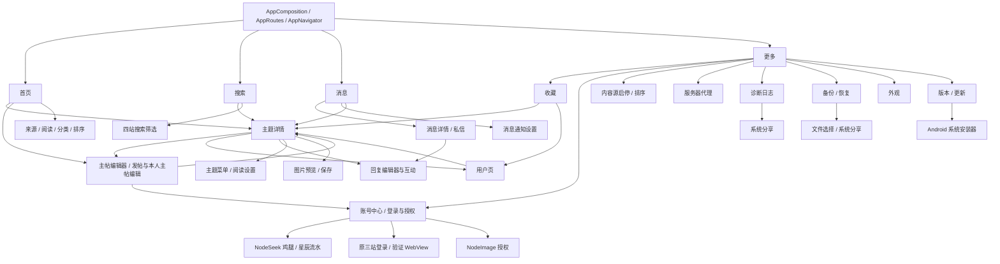

# 产品地图

## 阅读导航

先从[能力清单](#能力清单)定位入口，再查看[共享实现边界](#共享-seam-与证据展开)和[证据覆盖](#证据覆盖索引)。各能力先列 ID、实现归属和验收路径，再补充专项契约。

本文将多个入口共用的实现边界称为 seam。修改这类实现时，需检查所有依赖它的入口。owner 表示实现或测试的职责归属，canonical evidence 表示当前行为的主要验证证据；具体规则见[代码规范](code-standards.md)和[测试标准](testing-standard.md)。

| 能力 | 入口 |
| --- | --- |
| 导航与发现 | [NAV](#nav导航与状态恢复)、[FEED](#feed首页与发现)、[SEARCH](#search搜索) |
| 阅读与资料 | [TOPIC](#topic主题详情与阅读)、[USER](#user用户页)、[LIBRARY](#library本机收藏关注与历史) |
| 账号与互动 | [ACCOUNT](#account账号cookie-与站点会话)、[NOTIFY](#notify统一消息与-android-通知)、[WRITE](#write发帖回复编辑删除互动与上传) |
| 本机工具与交付 | [DATA](#data本机资料持久化与备份)、[MORE](#more工具代理诊断外观与更新)、[RELEASE](#release构建打包与发布) |

来源差异见[四站矩阵](#四站能力矩阵)，实现走向见[调用链](#主要调用链)，风险和缺口见[数据与回退](#数据迁移与回退风险)及[真实验收边界](#自动测试空白与真实验收边界)。

## 文档职责与当前接受基线

本文列出当前 App 的能力、用户入口、改动影响范围和交付前的回归要求。实现方式以 `docs/architecture.md` 为准，测试强度与写操作授权以 `docs/testing-standard.md` 为准，具体命令以 `docs/operator-runbook.md` 为准。

- 当前接受基线是保持仓库现有能力可用，不表示当前版本没有缺陷。
- 用户最新明确要求优先；当前代码和实际运行结果是当前事实。本文与它们冲突时，先按事实处理，再修正文档。
- 精确的 Git revision、APK SHA、设备、登录态和一次性授权只记录在本机 `docs/emulator-baseline.md`，不得复制成长期稳定事实。
- 能力 ID 用于关联产品行为或运行时改动与回归范围，不是测试用例编号。纯测试、文档或治理改动记录证据归属，不虚构产品 ID。
- 历史回归事故只在 `docs/regression-corpus.md` 追溯。表内「自动测试」和证据覆盖索引列出当前主要验证证据，不按事故追加测试清单。
- 证据按 `STATIC_PASS`、`UNIT_PASS`、`UI_PASS`、`DEVICE_REPLAY_PASS`、`LIVE_PASS`、`APK_SANITY`、`NOT_VERIFIED`、`BLOCKED_BY_ENV` 分层；任何单层通过都不能代替其他层。

## 导航拓扑


```mermaid
flowchart TD
  APP["AppComposition / AppRoutes / AppNavigator"] --> FEED["首页"]
  APP --> SEARCH["搜索"]
  APP --> MESSAGES["消息"]
  APP --> MORE["更多"]
  MORE --> LIBRARY["收藏"]
  FEED --> TOPIC["主题详情"]
  FEED --> CREATE_TOPIC["主帖编辑器 / 发帖与本人主帖编辑"]
  TOPIC --> CREATE_TOPIC
  CREATE_TOPIC --> TOPIC
  CREATE_TOPIC --> ACCOUNT
  FEED --> FEED_FILTER["来源 / 阅读 / 分类 / 排序"]
  SEARCH --> TOPIC
  SEARCH --> SEARCH_FILTER["四站搜索筛选"]
  LIBRARY --> TOPIC
  TOPIC --> USER["用户页"]
  USER --> TOPIC
  LIBRARY --> USER
  TOPIC --> COMPOSER["回复编辑器与互动"]
  TOPIC --> TOPIC_MENU["主题菜单 / 阅读设置"]
  TOPIC --> IMAGE["图片预览 / 保存"]
  MESSAGES --> MESSAGE_DETAIL["消息详情 / 私信"]
  MESSAGES --> MESSAGE_SETTINGS["消息通知设置"]
  MESSAGES --> TOPIC
  MESSAGE_DETAIL --> COMPOSER
  MORE --> ACCOUNT["账号中心 / 登录与授权"]
  ACCOUNT --> CREDITS["NodeSeek 鸡腿 / 星辰流水"]
  MORE --> SOURCES["内容源启停 / 排序"]
  ACCOUNT --> VERIFY["原三站登录 / 验证 WebView"]
  ACCOUNT --> NODEIMAGE["NodeImage 授权"]
  MORE --> PROXY["服务器代理"]
  MORE --> DIAG["诊断日志"]
  MORE --> BACKUP["备份 / 恢复"]
  MORE --> APPEARANCE["外观"]
  MORE --> UPDATE["版本 / 更新"]
  DIAG --> SHARE["系统分享"]
  BACKUP --> FILE_PICKER["文件选择 / 系统分享"]
  UPDATE --> INSTALLER["Android 系统安装器"]
```

详情和用户页可以嵌套打开；返回时必须恢复前一层 route、列表、筛选、草稿、回复状态和滚动上下文，而不是简单回到某个固定首页。

Modal、BottomSheet、WebView、系统浏览器、文件选择器、系统分享和安装器也是产品入口。验收不能只检查其父页面存在，必须检查打开、取消/返回及原页面状态恢复。

## 能力清单

表内「模拟器路径」是验收定位，不自动授予真实写操作权限。涉及回复、编辑、删除、互动、上传、投票、收藏切换、清空或登录清除时，仍按 `docs/testing-standard.md` 判断授权和恢复要求。

每个能力的完整契约由本节对应行、下方四站矩阵、证据覆盖索引和共享 seam 表共同组成：本节固定入口/前置状态、用户可见行为、代码与 Vitest；证据索引固定 UI、Replay、Live 和不可自动化边界；共享 seam 表固定改动时必须展开的关联能力。证据不足的行为必须标记 `NOT_VERIFIED`，不能靠缺少入口或一次空结果推断不支持。

下文「固定四站」「三个可登录来源」描述默认全部启用时的能力集合；用户通过 `MORE-05` 停用或重排后，Feed、Search、Library、Account 与 Notifications 必须改用同一偏好的已启用子集和用户顺序，静态 Catalog 能力本身不变。内容源偏好只持久化 `source + enabled`；operation-level ReadPlan 由当前 Catalog、启用集合和账号快照纯派生，不持久化，也不把账号核对 activity 或 unknown 变成整站不可用。

### NAV：导航与状态恢复

`NAV-01`、`FEED-01/02`、`SEARCH-01/02`：主 Tab 按首次访问懒挂载，`detachInactiveScreens=false` 保留已访问页面的原生附着，最多驻留首页、搜索、消息、更多四个 Tab，不预挂载 Search。Feed/Search 关闭 `freezeOnBlur`，允许隐藏页继续结算 React 更新；消息/更多与外层 native stack 继续冻结。隐藏页不接收触摸或无障碍焦点，Route 的焦点、Query、候选读取和媒体 gate 保持生效。返回不重新附着整棵 Tab，但驻留可能增加内存，因此验收同时记录切页帧时与同 PID 往返前后的 PSS。性能关闭条件由 `docs/operator-runbook.md` 的 Search Release 回归拥有；真实导航的懒挂载、四页状态、嵌套返回及无障碍边界由 `tests/ui/app/app-navigator.test.tsx` 与 Feed/Search 既有 controller owner 承接。

| ID | 用户入口与行为契约 | 主要代码入口 | 自动测试 | 模拟器路径 |
| --- | --- | --- | --- | --- |
| `NAV-01` | 底部固定提供首页、搜索、消息、更多；收藏从「更多」进入原生二级页；四个入口的点击区分别铺满现有底栏内容区内的等宽 slot、互不重叠，第三格「消息」使用铃铛图标 `Bell`，第四格「更多」保留 `MoreHorizontal`，间距、底栏尺寸和安全区保持原规格；普通点击不产生 ripple、压暗/变蓝、hover 或触感，选中、禁用、展开等功能状态仍即时显示；切换 tab 不应破坏各页已有状态。 | `src/app/AppRoutes.tsx`、`src/app/AppNavigator.tsx`、`src/features/feed/FeedRoute.tsx`、`src/features/search/SearchRoute.tsx`、`src/features/library/LibraryRoute.tsx`、`src/features/more/MoreRoute.tsx`、`src/ui/navigation/NavBar.tsx` | `src/app/AppNavigator.test.ts`、`tests/integration/style-ownership.test.ts`、`tests/ui/app/app-navigator.test.tsx`、`tests/tooling/android-smoke-guard.test.ts`、`tests/tooling/interaction-policy.test.ts` | `LIVE-NAV-01` 在匹配 APK 上检查四格边缘点击与视觉不变；再依次切换四个底部入口并回到原 tab 检查状态。 |
| `NAV-02` | Feed、Search、Library 可进入 Topic；Topic 和 Library 可进入 User；User 可再次进入 Topic。共享 TopicCard 的一次快速连点只允许产生一个 Topic route，窗口结束后可再次打开。NodeSeek 的 `/member?t=username` 是内部 User route，当前 Topic 找不到 UID 也不得降级为外部链接；`/space/{uid}` 直接使用 canonical UID。 | `src/app/AppNavigator.tsx`、`src/ui/topic/TopicCard.tsx`、`src/features/topic/TopicRoute.tsx`、`src/features/user/UserRoute.tsx`、`src/features/user/useUserController.ts` | `src/features/topic/useTopicSessionController.test.ts`、`src/domain/forum/userNavigation.test.ts`、`tests/integration/forum-presentation-contracts.test.ts`、`tests/ui/app/app-navigator.test.tsx`、`tests/ui/feed/feed-screen.test.tsx` | Agent Live 选择满足前置条件的对象执行列表 → Topic → User → Topic；固定数据 UI 测试不依赖动态首条。列表连点后一次 Android Back 必须返回原列表；NodeSeek 用户链接专项见 `LIVE-READ-04`。 |
| `NAV-03` | 顶栏返回、Android 物理返回和嵌套详情返回一致；每个 native Topic route 自持筛选、回复顺序、列表、草稿、回复页和滚动状态。inactive route 停止 Query、写后刷新和原图升级；返回按图片预览 → composer → 主楼选择 → native stack pop 处理，Topic A → B、Topic → User/ReadingSettings 返回原 route 实例，不依赖 snapshot restore。 | `src/app/AppNavigator.tsx`、`src/features/topic/TopicRoute.tsx`、`src/features/topic/useTopicRouteBeforeRemove.ts`、`src/features/topic/useTopicSessionController.ts` | `src/app/AppNavigator.test.ts`、`src/features/topic/useTopicSessionController.test.ts`、`tests/ui/app/app-navigator.test.tsx`、`tests/ui/topic/topic-session-controller.test.tsx`、`tests/ui/topic/topic-rich-text-selection.test.tsx` | Agent Live 从嵌套详情逐层返回并复查原列表、回复顺序与搜索条件；选择中首次 Back 只取消，下一次退出。nested Topic Loading 时立即返回一次回到原详情，转场无 B 内容或空白。 |

`NAV-01` 的冷启动使用原生 App 图标，取消正常文字启动页；本机资料和账号恢复完成后挂载导航，仅在导航就绪与实际页面容器布局均完成后隐藏一次。原生 Splash 与带启动语义的 React 图标占位共用一份无损 WebP，保持 200 dp 图标与原生 288 dp 画布，不重复打包 Metro 图标或五档启动位图；保留原有通知/深链接回调；不等待首页远端内容、代理 apply、通知或更新，不新增超时放行。`ACCOUNT-01/02` 的本机记录提前与 ReaderData 并行读取，但来源设置就绪前不发布账号、不迁移、不发起身份相关读取。Canonical evidence 为 `tests/ui/app/app-composition.test.tsx`、`tests/ui/app/app-runtime-startup.test.tsx`、`tests/ui/account/account-status-controller.test.tsx`；重模块导入边界由 `tests/ui/app/startup-imports.test.tsx` 与公式/编辑器/诊断既有 owner 共同验证。

`NAV-01`、`MORE-01` 共用 `NetworkProxyModule.getConstants` 的 Android 默认 User-Agent 读取入口：`readDefaultWebViewUserAgentOnMainThread` 在主线程直接读取，后台调用只派发一次并最多等待 10 秒，避免后台 UA 读取先触发 Chromium 异步启动、随后首个 WebView 同步初始化与之竞争。超时或中断取消尚未执行的读取，中断保留标记，provider 原异常继续交由既有空字符串 fallback 处理；已经开始的主线程读取不被中断。不新建全局 WebView，不改变代理启动事务或清理共享认证资产。Canonical owner 为 `modules/forum-platform/android/src/test/java/com/wz/reader/network/NetworkProxyRuntimeTest.kt` 的线程派发、返回值、失败与取消 oracle；本机 WebView 156 的竞态与对照记录见 `REG-NAV-007`。无临时 marker 的正式集成 APK 覆盖安装首启、UA 保持和编辑器可用性仍须独立验证，不能由 JVM 测试替代。

`NAV-01/WRITE-07` 的业务前后台状态与 Query focus 在监听挂载时共同读取当前 AppState，覆盖初始化 render 后、监听注册前回到前台的时序；后续继续由原生 change 驱动，不绕过账号或发送守卫。Canonical evidence 为 `tests/ui/app/app-lifecycle-request-timeout.test.tsx`。

`NAV-01` 同时覆盖 `MainTabs.notifications → NotificationDetail / NotificationSettings` 与 `More → Library` native stack：消息列表为第三个底部 tab，Android 摘要点击只进入指定来源的消息列表且不触发已读；可见 native header 统一取消 Android elevation 阴影，并由静态 RN `Pressable` 接管返回与右侧按钮，丢弃 Navigation 注入的 ripple、hover 和 press-opacity。实现与固定 UI 证据见 `src/app/AppNavigator.tsx`、`src/app/appNavigation.ts`、`tests/ui/app/app-navigator.test.tsx`、`tests/tooling/interaction-policy.test.ts`。

`NAV-01/02/03`：收藏由 More 打开 `Library` 原生二级页，帖子、关注用户、历史及来源/分类筛选沿用原列表；进入 Topic/User 后返回保留原 Library 实例，退出 Library 返回同一 More 实例及其账号中心、外观展开、站点与滚动位置。More 失焦只停止活动读取，不关闭内联外观；切换底部 tab 后返回同样保留展开状态。消息列表保留自身来源、分类、未读筛选；Android 摘要通过既有 MainTabs 路由选择消息 tab，并消费来源参数，同一来源再次点击也重新应用目标。消息设置和详情使用父 native stack，返回原消息 tab，不叠加 MainTabs。

`NAV-01` 的静默普通点击策略覆盖全部共享控件和页面内按钮：不得自动增加 ripple、pressed 临时样式、普通点击触感、WebView `:hover/:active` 或点击过渡；焦点、选中、展开、禁用、错误和加载等功能状态仍保留。明确拥有的 route `slide_from_right`、滚动/横滑、图片缩放翻页、拖排、弹层、播放器进度和 Android 正文选择原生触感不属于普通点击反馈，继续按各自能力验收。

`NAV-01`、`SEARCH-02` 的共享 Reanimated 事件入口只处理存在指定 tag 或全局监听者的 UI 事件，无监听 SVG 布局事件不得反复同步应用 retained 动画属性；正常 scroll、全局订阅/退订与 RAF 沿用原生命周期。补丁应用由 `tests/tooling/patch-artifacts.test.ts` 承接，原生行为由 `dev/reanimated-events-proof/index.tsx` 与 runbook 专项验收。

`NAV-02/03` 的主题导航统一使用 `TopicLocationTarget`（`opening` 或携带 `ReplyLocationTarget` 的 `reply`），缺省表示普通打开：点击用户名进入 User route，点击楼层才在同主题定位或把目标传给新的 Topic route；普通主题链接不得多出伪目标。`exp+wz-android://open-topic` 与 Custom Tab explicit `PendingIntent` 送入的 canonical HTTP(S) 主题 URL，在 warm event 与 cold pending queue 中都传递完整 `{ topic, location?, locationRequestId? }`；四站楼层格式在进入导航前必须完整保留。HTTP(S) 入口只由明确送达 App 的 intent 消费，manifest 不声明第三方域名 intent filter；非主题、Google 页面、用户页和非受信域名拒绝。每个 Topic route 自持当前 `ReplyOrder` 与锚点窗口，定位只清内容筛选/查找而不改变顺序，嵌套返回恢复原顺序；目标身份和重复定位语义保持一致。

`NAV-02/03`：Feed、Search、Library 和 User 的共享 TopicCard 在 native push 尚未使来源页失焦时同步拒绝同一主题的快速重复 press。500 ms 门禁以 `topicKey` 的来源与主题 ID 为身份；同一卡片实例回收绑定新主题后，首击立即生效，同主题的等价 payload 更新不清除门禁。窗口结束后恢复正常打开，不影响不同卡片、Topic 内链接或楼层重复定位；canonical owner 为 `tests/ui/shared/topic-card.test.tsx`。

`NAV-03`，共享 `TOPIC-01/03`：主题更多菜单与回复排序菜单只属于当前活动页面。路由失焦或 App 进入后台时关闭，返回原主题后保持关闭，再次点击才打开；不重置已选回复顺序、作者筛选或阅读位置。Canonical owner 为 `tests/ui/topic/topic-reply-filters.test.tsx`。

### NAV/TOPIC：四站导航与定位覆盖矩阵

`NAV-02/03` 的冷启动 URL 查询不能覆盖本次订阅已接受的较新有效链接；新目标即使立即打开，也必须清除旧排队目标。非主题/不受支持链接不废弃有效启动目标，卸载结束待处理导航；canonical owner 为 `tests/ui/app/app-deep-link-navigation.test.tsx`。

已消费的回复定位命令只属于发起时的回复窗口；切换正倒序后按新顺序正常读取首批评论，不能被旧 route 目标永久阻断，也不能重放旧定位。主楼 ID 经主题详情确认后，与显式 `opening` 一样使旧回复请求失效。

通知同时携带评论 ID 和首帖楼号时保留评论 ID，待 Topic 详情确认主楼；不能先按楼号丢弃 ID。没有评论 ID 的 Discourse 首帖目标直接分类为 `opening`。目标缺失的 loading 跟随实际请求结束，不使用被禁用 Query 的 pending 状态制造永久转圈。

`NAV-02/03`、`TOPIC-03`、`NOTIFY-02`：普通打开同主题不强制滚动；主楼目标在同主题回顶部、跨主题打开主楼，且不阻断正常评论加载。回复目标必须匹配唯一身份才提交定位窗口，成功读取不等于完成滚动；列表等待当前楼层头部（续读时为内容锚点）进入实际原生视口后才确认定位，回复跳转的高亮计时从到位开始，不以滚动 Promise 的结束代替到位。已经对齐或受短页底部限制时，只要目标可见就能完成；旧命令、其他主题和 inactive route 的回调不能确认当前目标。显式主楼与新回复命令使旧目标读取失效；刷新不重发已消费命令，inactive route 不发定位。

| 入口 / 目标来源 | linux.do | NodeSeek | V2EX | 妖火 | 生产者 → 消费者与 canonical evidence |
| --- | --- | --- | --- | --- | --- |
| Feed/Search/Library/User 主题卡片及用户回复动态 | 普通打开 | 普通打开 | 普通打开 | 普通打开 | TopicCard/UserScreen → Topic route；`tests/ui/shared/topic-card.test.tsx`、`tests/ui/user/user-screen.test.tsx`。展示楼层不自动成为命令。 |
| 正文、回复 HTML / 相对链接 | `/1` 主楼，后续 post number 回复 | 有效数字 hash 回复，路径页码只作 hint | `#r_ID` 回复，`?p=` 只作 hint，`#replyN` 不造目标 | 完整回复链接 `tofloor` 回复，普通页码不造目标 | links/useHtmlRenderingController → TopicRoute；`src/domain/forum/links.test.ts`、`tests/ui/topic/topic-components.test.tsx`、`tests/ui/topic/topic-rich-text-selection.test.tsx`。 |
| 主楼和回复结构化引用：编号/标题 | 同主题与跨主题保留主楼/回复身份 | 无 Discourse 结构化引用，HTML 归上一行 | 无 Discourse 结构化引用，HTML 归上一行 | 无 Discourse 结构化引用，HTML 归上一行 | TopicContentList/ReplyItem → 导航/定位；`tests/ui/topic/topic-components.test.tsx`、`tests/ui/topic/topic-reply-filters.test.tsx`。展开只读取引用内容，不导航。跨主题缺少 URL 时使用合法的 canonical 引用身份；URL 与引用身份冲突时拒绝跳转，不能退回当前主题同楼层。 |
| 回复关系、楼层编号、已采纳答案 | 首帖回顶部，其余精确定位；采纳答案复用引用读取 | 楼层/回复关系精确定位 | 可靠 ID 或已有内部作者约束定位 | 楼层/回复关系精确定位 | ReplyItem/AcceptedAnswerPreview → TopicContentList/useTopicController；`tests/ui/topic/topic-reply-filters.test.tsx`、`src/domain/forum/replyLocation.test.ts`、`src/domain/forum/topicLocation.test.ts`。 |
| 通知/消息正文与查看主题按钮 | topic 普通打开，首帖 opening，具体回复 reply | topic 普通打开，评论 ID/楼层保留 | 不适用：未提供消息能力 | 消息 HTML 普通主题/完整回复分开 | NotificationScreens/NotificationRoute → Topic route；`tests/ui/notifications/notifications-screen.test.tsx`、`tests/ui/notifications/notifications-route.test.tsx`、来源 notification tests。 |
| 外部 URL / open-topic 冷热启动 | 保留主楼/回复 | 保留回复与页码 hint | 保留评论 ID | 保留 tofloor | links/useAppDeepLinkNavigation → pending queue/Topic route；`tests/ui/app/app-deep-link-navigation.test.tsx`。 |
| 写后定位、刷新、缓存与返回 | 已确认新回复生成新命令 | 已确认新回复生成新命令 | 不适用：只读 | 已确认新回复生成新命令 | useTopicController → TopicRoute；`tests/ui/topic/topic-session-controller.test.tsx`、`tests/ui/app/content-source-route-gates.test.tsx`。固定写后证据使用 mock，不执行 Live 写入。 |
| 普通分页/正倒序/目标窗口 | stream cursor 与 near-post 分离，ID 定位最多取单帖再取窗口 | start/cursor 不携 target，ID 搜索限来源页界 | 页码与真实 ID 分离，有界读取已发现页 | start 的 tofloor hint 只确认页，实体校验仅限 target | 各站 reader → ReadGateway；`tests/integration/source-read-contracts/discourse.test.ts`、`tests/integration/source-read-contracts/nodeseek.test.ts`、`src/sources/v2ex/reader.test.ts`、`src/sources/yaohuo/reader.test.ts`。 |

固定回归同时覆盖正反方向：`2885866` 第 9 楼的「引用 #1」和引用标题均打开 `2686247` 主楼，不请求回复目标；「回复 #6」仍定位第 6 楼。主楼正文跨主题引用也必须保留实际 post number，不能退化为普通主题。Live 只在匹配当前构建后按 `tests/live/agent-live.md` 的 `LIVE-NAV-02` 执行，测试通过不代替各站现场证据。

### FEED：首页与发现

`FEED-01/02`、`NAV-01`、`SEARCH-02`：首页使用已安装 FlashList 的默认预绘距离，不再覆盖为 900；Topic 列表配置、首页回收池 120 和位置策略保持原行为；原生 Tab 附着契约见 `NAV-01`。Feed 的筛选、滚顶、分页与手势继续由既有 Feed screen/controller owner 承接；预绘窗口的取舍须同时核对返回页面的原生附着/绘制成本与快滚补绘，不能只凭初始视图减少宣称流畅度通过。

`FEED-02` 的每次分页在 Promise 结算时释放自身页锁，取消或快速失败不依赖中间 loading props 是否提交；失败后新拖动或明确重试才再次请求。新拖动重新计算滚动距离门槛，底部原位置也可恢复。Controller 在发起前核对当前 Query 的 fetchStatus 与 page/cursor，旧页面动作不能继续加载已推进缓存的下一页；canonical evidence 为既有 `tests/ui/feed/feed-screen.test.tsx` 的真实 Controller/Query 时序用例。

`FEED-01` 的聚合请求、buffer 和 cursor 只包含当前 ReadPlan 可读取的来源；当前被阻止的来源不保留伪重试页，无可推进来源时正常终止。暂时网络失败仍保留原页重试，登录/来源/epoch 变化由既有 Query scope 重建计划恢复读取。Canonical owner 为 `src/sources/feedRead.test.ts`、`src/sources/readGateway.test.ts` 与 `tests/ui/feed/feed-controller-session.test.tsx`。

`FEED-01/04` 的单站登录失效不得连带清空其他可信来源。Gateway 在账号事件取消聚合 Query 前交出已完成的首屏，Feed 仅保留通过原页面校验的展示快照；每次 scope 变化按现有 ReadPlan 过滤，来源、分类、排序或启用集合不匹配时不复用。后续重读失败仍显示可信内容并报告错误，失效身份内容不得随账号状态恢复而重新出现。快照不写入新 scope 的 Query、不驱动分页，成功读取后由真实 Query 结果替换。Canonical owner 为 `tests/ui/feed/feed-controller-session.test.tsx` 的真实 Gateway → Query → Controller 401 链路及连续 scope 变化用例。

`FEED-01/02` 首屏内容终态须有实际布局证据：非空列表使用 FlashList `onLoad`，空列表使用空状态容器 `onLayout`，因为 FlashList 空列表不触发 `onLoad`。通知和更新仍等待该终态；诊断分别记录 `feed-content`、`feed-empty`、`feed-error`，空结果与失败不计作已有帖子。Canonical evidence 为 `tests/ui/feed/feed-screen.test.tsx`。

`NAV-01`、`FEED-01/02`、`SEARCH-01/02`：共享分类按来源、ReadPlan scope 和 session epoch 复用单站 Query。冷启动先并行读取帖子、linux.do 必需的分类元数据和本地分类；其他远程分类等首批 Feed 完成实际布局后读取，提前进入单站或 Search 时立即按需读取。单站切换复用相同 scope 的分类，账号变化只替换受影响来源；离开 Feed 不取消 Search 仍在使用的分类请求。分类的单来源 5 秒预算、帖子排序、分页和错误处理保持原规则。Canonical evidence 为 `tests/ui/app/forum-catalog-runtime.test.tsx`、`tests/ui/app/app-runtime-startup.test.tsx` 与 `tests/ui/feed/feed-controller-session.test.tsx`。

| ID | 用户入口与行为契约 | 主要代码入口 | 自动测试 | 模拟器路径 |
| --- | --- | --- | --- | --- |
| `FEED-01` | 首页「全部」按用户顺序聚合所有已启用来源，条目保留完整 TopicCard 信息与视觉层级，包括来源/分类/访问徽章、标签、标题、摘要、作者头像与等级、时间、收藏/已读、同链来源、回复和浏览；Feed 不得以性能优化为由切换成信息合并或装饰删减的另一套 presentation。每个来源使用显式 operation ReadPlan：没有确认身份的公开 child 继续以无 Cookie lane 结算，严格 child 以 typed blocked 终态退出，不能暂停整页或借另一站成功证明；authenticated 温缓存不得投影到 public scope。单站请求或凭据存储失败不应抹掉其他已成功来源。HTTP 成功但带 `parse_empty` 诊断的页面不得当作合法空列表应用。聚合分页只追加新页，不得重新排序或平衡已加载主题；计划、启用集合或会话变化时保留仍属当前 scope 的可信来源，取消并清除失效来源及对应聚合页，迟到结果不得让列表退回 Loading、旧快照或旧 cursor。 | `src/features/feed/FeedScreen.tsx`、`src/ui/topic/TopicCard.tsx`、`src/features/feed/useFeedController.ts`、`src/platform/query/serverState.ts`、`src/sources/readGateway.ts` | `tests/ui/feed/feed-screen.test.tsx`、`tests/ui/shared/topic-card.test.tsx`、`tests/ui/feed/feed-controller-session.test.tsx`、`tests/integration/query-session-contracts.test.ts`、`src/sources/readGateway.test.ts`、`src/sources/readGatewayContract.test.ts`、`src/sources/sourceErrors.test.ts` | 首页 → 全部；确认所有已启用来源按用户顺序显示完整 TopicCard，触发分页或自然身份核对后公开来源不暂停、原可见主题不回跳，并能打开主题。 |
| `FEED-02` | 首页可切换所有已启用来源；标准 TabBar 的蓝标位置、宽度与文字高亮直接跟随 TabView 连续 `position`，拖动和回拖中均有反馈；文字两层使用完全相同的字重与布局，避免交叉淡变时重影或裁切。二级导航在所属 scene 中纵向置顶、横向随页面进出；分类、排序与 Loading 按 `route.key` 投影，复用 controller 的分类数据和只读 `feedFilters`，非当前来源的控件不提交筛选，开始滑动关闭菜单。业务只消费上游 Pager 经 `onIndexChange` 提交的最终来源，取消零提交，不从 fractional position 或 idle 推导读取；点击立即切换且不播放 Pager 点击动画，不增加按压阴影、波纹或淡入淡出。来源重排或启停后沿既有 Feed 会话重建统一回到「全部」，一级来源、二级阅读筛选与实际结果一致；首次横滑按新顺序进入相邻来源，不能跳回旧选中项。新原生 Pager 必须等宿主获得有效视口后再创建 composition，避免零尺寸首测量把初始「全部」推进到末页；同一会话的暂时离开仍保留现有 composition 与列表位置。首页 FlashList 通过 `renderScrollComponent` 复用 RNGH `ScrollView`，并使用同库 `RefreshControl` 建立刷新阻断滚动的手势关系；显式设置 `nestedScrollEnabled=false`，让单个纵向列表只通过该手势关系刷新，避免 RN 0.85 起默认开启的 Android nested-scroll 路径与其竞争。轻拉不足阈值不读取，松手后圆圈收起；长拉和回拉松手后必须有限结算。不得混用 RN `RefreshControl`，以免下拉被滚动手势取消、指示器滞留且不触发刷新。纵向意图的斜滑由列表持有，保留正常横滑、刷新、惯性与回到顶部，不添加另一套方向锁。保留单个完整列表，非当前 scene 预铺轻量 Loading；每次完成切换重新读取目标来源并从首项开始，刷新失败保留可信列表和分页位置。公开来源继续可读，需要身份的来源显示可恢复状态。 | `src/features/feed/FeedScreen.tsx`、`src/features/feed/useFeedController.ts`、`src/sources/feedRead.ts`、`src/sources/readGateway.ts` | `tests/device/feed-gesture-priority.ad`、`tests/ui/feed/feed-navigation-motion.test.tsx`、`tests/ui/feed/feed-screen.test.tsx`、`tests/ui/feed/feed-controller-session.test.tsx`、`src/sources/feedRead.test.ts`、`src/sources/readGatewayContract.test.ts` | 1264×2780 设备回放横移 650 px / 纵移 1100 px 的快慢斜滑，上下方向及列表首段/中段/已加载尾部都不得误切（其他 viewport 覆盖 replay 坐标变量）；慢拖、快甩、途中回拖、取消、连续反向和跨页点选；逐帧确认蓝标、文字与二级栏在移动中已有反馈，结束时无第二次跳换；取消零读取，成功切换只读取一次并从首项开始。核对来源重排、全部停用、大字号与筛选归属。 |
| `FEED-03` | 聚合页提供全部、未读、已读、收藏；收藏来自本机资料，已读合并本机点开记录与当前账号可信的 L 站阅读证据。点开后从聚合未读结果退出，不自动补页；筛选本身不改变原站数据。 | `src/features/feed/useFeedController.ts`、`src/domain/reader/readerData.ts`、`src/domain/forum/topicListItemState.ts` | `src/domain/reader/readerData.test.ts`、`src/domain/forum/topicListItemState.test.ts`、`src/domain/forum/discourseReading.test.ts`、`tests/ui/feed/feed-screen.test.tsx` | 在首页逐个切换阅读筛选，核对条目状态。 |
| `FEED-04` | 单站排序进入读取条件：V2EX 全部/最新/最热，linux.do 支持最新/热门/新·所有/新·话题/新·回复，NodeSeek 新帖子/新评论。切换排序回到首项；刷新、分页、旧请求和重复 cursor 不得串列表。刷新失败保留旧列表；分页失败保留重试位置；成功分页只在现有顺序后追加唯一主题。账号或启用集合变化后，不得显示旧身份或已停用来源的页面。 | `src/domain/forum/feedOptions.ts`、`src/domain/forum/feed.ts`、`src/features/feed/useFeedController.ts`、`src/platform/query/serverState.ts` | `src/domain/forum/feed.test.ts`、`tests/ui/feed/feed-controller-session.test.tsx`、`tests/integration/query-session-contracts.test.ts`、`tests/ui/feed/feed-screen.test.tsx` | 单站切换排序并触发刷新和分页，确认首项、归属、加载状态及旧页顺序。 |

`FEED-01/02/04`：聚合 Feed/Categories 的每个来源以连续墙钟 5 秒为上限；超时或已有内容后的分页全失败保留可重试 cursor，普通首屏全失败不制造空 cursor。手动刷新取消并替换同一读取；从下拉回调开始同步保持 refreshing，跨取消旧请求与新请求读取保持连续，成功或失败后结束。来源/会话改变或页面离开时复位，旧请求结算不得关闭新请求的刷新指示器。首页与搜索来源栏保持紧凑并随 Reader 字号缩放；其他共享 Tab 继续满足无障碍点击范围。

`FEED-01/02/04` 与共享 `NOTIFY-01`：首页与通知列表均只有一个纵向列表，显式关闭 nestedScrollEnabled，避免额外的嵌套滚动累积与提交路径。Android 刷新控件的系统取消必须完整结束 Native gesture、nested-scroll 累积与 active pointer，再收起未提交的指示器；内部列表持有触摸时也须在 CANCEL 分发给子节点之前清理，不能只依赖刷新控件的 onTouchEvent。迟到 UP/stop 或动画回调不得刷新，下一次拖动仍能显示圆弧并提交，已开始的刷新不得被取消触摸停止。共享 source patch 与行为测试由 `patches/react-native+0.86.3.patch` 内的 ReactSwipeRefreshLayout/ReactSwipeRefreshLayoutTest 承接；列表配置由各自 screen UI 测试固定，命令见 operator runbook。

`FEED-02` 的预铺二级导航通过共享 `PillRail` 禁用 inactive scene；进入当前来源时必须明确把 `disabled` 与 `accessibilityState.disabled` 设为 `false`，同时恢复触摸和 Android 无障碍可操作状态。不能仅省略属性而留下原生禁用态。

`FEED-02` 的二级分类通过点击选择，横滑只滚动分类栏以露出隐藏项，不改变选中分类或一级来源；分类首尾边界也不向来源 Pager 交接。正文区域仍可横滑切换来源。共享 `PillRail` 使用 RNGH `ScrollView` 参与原生手势协调，不增加页面级方向锁或临时禁用 Pager。分类栏保持同一实例，排序按钮显隐只改变布局，不能使分类栏重建并跳回起点。设备 owner `scripts/check-feed-boundaries.mjs` 验证四站分类双向位移、两端边界、隐藏分类点击后选中项仍可见与来源不变。

`FEED-02`、`FEED-04` 切换来源、分类、排序或阅读筛选并回到首项时，必须清除上一列表的「回到顶部」按钮状态。返回同一列表或取消横滑不重置该按钮；只有新列表再次实际滚离顶部才重新出现。

`FEED-02` 的横向归位动画被下一次纵向拖动打断时，Pager 必须结束旧的触摸等待并归位，内部列表继续滚动并保留惯性。RNGH 逐 View 调用 `onTouchEvent(CANCEL)`，Compose Pager 的 source patch 将该取消接到 Compose 的 `dispatchTouchEvent`；这次桥接只取消 Pager，PageHost 不重复取消由 RNGH 管理的原生子列表。真实系统 CANCEL 仍沿正常 dispatch 路径取消子树。不新增页面级滚动开关、方向锁或归位计时器。连续触摸由 `scripts/check-feed-gestures.mjs` 与 `tests/device/TouchTrace.java` 承接，普通终止事件与惯性继续由现有独立 oracle 承接。

同一 `FEED-02` native owner 还必须隔离每次手势的按下与松手：Compose 1.7.8 的方向检测未结束 consumed CANCEL，可能拿上一次纵滚的按下位置计算本次横拖。Pager source patch 在原生归位入口以本次 MotionEvent 位移修正 `PagerState.upDownDifference`，仍委托 `PagerDefaults.flingBehavior`，不更改默认距离阈值、速度、动画或 JS 提交协议。该兼容修正依赖锁定 Compose 的 internal 字段；升级时必须重验并在上游修复取消检测后移除。现有连续手势矩阵的 `horizontal` 已覆盖纵滚后双向长慢拖，`short-slow-horizontal` 与 `reverse` 分别覆盖短慢拖、回拖结算。

`FEED-02` 的原生 Pager 即使在列表滚动后被 RNGH 拦截，也必须在本轮系统 CANCEL 时收到取消并自行结算，不能等待下一次触摸才归位。正常 UP 已由 native handler 交给原生控件，不得再向子树补发终止事件，否则会打断刚启动的列表惯性。共享 owner 为 `patches/react-native-gesture-handler+3.2.1.patch`；`scripts/check-feed-pager-cancel.mjs` 分别验证系统取消保持来源、正常松手按原生速度结算到完整页面；`scripts/check-feed-fling.mjs` 独立验证快速甩动后无需再次触摸，列表仍继续滚动。

`NOTIFY-01` 同样依赖 RNGH root 及时向 RN RefreshControl 分发本轮终止事件；其真实圆圈取消与下一次刷新由 `scripts/check-notification-refresh-cancel.mjs` 承接，不能仅用 Feed 的分页归位或 RefreshControl JVM 结果代替。

`FEED-02` 的下拉取消与再次刷新由 `scripts/check-feed-refresh.mjs` 验证可见指示器收尾；首尾页、真实加载尾部、分类栏横滑及底栏返回由 `scripts/check-feed-boundaries.mjs` 承接。整套执行顺序以 `docs/operator-runbook.md` 为准，相关手势改动必须按 `docs/testing-standard.md` 全部回归。

`FEED-02/04`、`SEARCH-02/04` 与共享 `ACCOUNT-01/02`：未登录妖火对每次显式首页来源/分类/刷新或单站搜索/重试意图最多自动打开一次登录页；用户关闭后，auth surface barrier、账号核对、ReadPlan scope 恢复及 Query 自动 refetch 都不得重开。已有已提交关键词时切换搜索来源会立即读取，登录页可能在再次点击「搜索」前打开。新的显式意图或一次真实成功读取后，后续登录失败仍可再打开一次。

### SEARCH：搜索

`SEARCH-02/03` 的 limit 控制上游请求批量，不因排除词擅自放大；共享过滤与聚合必须交付已消费页中的全部合法命中，不能再截断后沿下一页跳过剩余结果。概览仍由展示层只显示两条，单站分页追加全部合法结果并保持已加载前缀。Canonical owner 为 `src/sources/searchRead.test.ts` 与 `tests/ui/search/search-controller-ai.test.tsx`。

`SEARCH-02/04` 的 V2EX adapter 遵守 SOV2EX 单次最多 50 条、可访问深度 1000 条的协议；页偏移使用稳定批量，末尾请求缩至剩余窗口，达到上限后不产生下一页或再发越界请求。30 条批量的第 34 页只请求最后 10 条，不把服务端总命中数当成全部可访问。Canonical owner 为 `tests/integration/source-read-contracts/v2ex.test.ts`。

| ID | 用户入口与行为契约 | 主要代码入口 | 自动测试 | 模拟器路径 |
| --- | --- | --- | --- | --- |
| `SEARCH-01` |「全部」按用户顺序结算所有已启用来源：可原生搜索的来源并行请求并渐进展示最多 2 条完整 TopicCard；处于 public lane 的 linux.do/NodeSeek 不发请求，各显示一个已结算的 Google 外部搜索入口，且绝不自动打开两个 Tab。原生来源继续使用干净默认筛选、局部失败隔离、可信预览保留、稳定结算标记和可靠作者契约；外部入口不计作空结果，不参与分页、跨站混排或「查看全部」。 | `src/features/search/SearchScreen.tsx`、`src/features/search/useSearchController.ts`、`src/features/search/listItems.ts`、`src/domain/forum/externalSearch.ts`、`src/ui/topic/TopicCard.tsx` | `src/features/search/listItems.test.ts`、`tests/ui/search/search-screen.test.tsx`、`tests/ui/search/search-controller-ai.test.tsx`、`tests/device-logged-out/logged-out-readonly.ad` | 未登录 AVD 在「全部」提交关键词，确认 L/NS 按来源顺序各有一个外部入口且没有自动弹窗；主登录 AVD 确认原生来源仍显示预览并可进入单站。 |
| `SEARCH-02` | 可切换当前已启用的单站。authenticated lane 保持 V2EX、linux.do、NodeSeek 与妖火既有原站搜索、连续分页、最近搜索、筛选和 linux.do AI 行为；public lane 的 linux.do/NodeSeek 提交后立即打开 exact `site:` Google Custom Tab，返回 Search 后保留关键词并显示「打开 Google」入口，不调用 gateway、不显示空结果或分页。清空关键词仍清空当前结果，最近搜索仍最多 20 条且可逐条删除。 | `src/features/search/SearchScreen.tsx`、`src/features/search/useSearchController.ts`、`src/features/search/history.ts`、`src/features/search/listItems.ts`、`src/domain/forum/externalSearch.ts` | `src/features/search/history.test.ts`、`src/features/search/listItems.test.ts`、`tests/ui/search/search-screen.test.tsx`、`tests/ui/search/search-controller-ai.test.tsx` | 未登录 AVD 分别提交 L/NS 查询并返回，确认关键词和再次打开入口保留；主登录 AVD 分别确认原站结果、分页和 linux.do AI 行为不变。 |
| `SEARCH-03` | 单站筛选只属于会消费它的原站协议：V2EX 与 authenticated linux.do/NodeSeek/妖火保留各自既有筛选、候选、防抖、草稿事务、分页一致性和 linux.do AI 门禁；public lane 的 linux.do/NodeSeek 隐藏筛选，不把排序、时间、分类或标签伪装成 Google 参数。Android 键盘与共享弹层几何继续遵循共享 Modal 的当前契约。 | `src/domain/forum/searchFilters.ts`、`src/features/search/SearchFilterSheet.tsx`、`src/features/search/SearchFilterForm.tsx`、`src/features/search/useSearchController.ts` | `src/domain/forum/searchFilters.test.ts`、`tests/integration/source-read-contracts/`、`tests/ui/search/search-screen.test.tsx`、`tests/ui/search/search-controller-ai.test.tsx`、`tests/ui/shared/modal-sheet-frame.test.tsx` | 未登录 L/NS 不出现筛选入口；登录态逐站检查既有筛选、候选、取消/重置/确认和分页。 |
| `SEARCH-04` | 登录、验证、授权、空结果和来源错误必须有可理解状态。L/NS authenticated lane 保持原站搜索；public lane 保持 `public:omit` scope 但 transport 为 `none`，Controller 只构造 exact Google URL，单站显式打开 Custom Tab，「全部」只显示 settled action。Google HTML、DOM selector、SearchGuard、JS gate、隐藏 WebView connector 和会话失效后的隐式降级均已删除。Custom Tab 菜单「在阅坛中打开当前主题」以 explicit mutable `PendingIntent` 回到 `MainActivity`；Deep Link 只接受既有 L/NS 主题/楼层 URL，拒绝 Google 页、首页、用户页和非受信域名，不声明第三方 intent filter/App Links。provider 不可用时退回普通浏览器并提示只能浏览。会话变为 public 时停止展示旧原站结果且不自动弹窗；重新确认 authenticated 后新 scope 才请求原站。 | `src/domain/forum/externalSearch.ts`、`src/features/search/useSearchController.ts`、`src/platform/android/forumSearchCustomTab.ts`、`modules/forum-platform/android/src/main/java/com/wz/reader/navigation/ForumSearchCustomTabModule.kt`、`src/app/useAppDeepLinkNavigation.ts`、`src/domain/forum/readPlan.ts` | `src/domain/forum/readPlan.test.ts`、`src/sources/readGatewayContract.test.ts`、`src/platform/android/forumSearchCustomTab.test.ts`、`tests/integration/security-boundaries.test.ts`、`tests/tooling/forum-platform-package.test.ts`、`tests/ui/app/app-deep-link-navigation.test.tsx`、`tests/ui/search/search-screen.test.tsx`、`tests/ui/search/search-controller-ai.test.tsx` | 未登录 AVD 验证 L/NS exact Google 页面、浏览、菜单回到原生主题和 Back 保留 Search；若 Chrome 首启条款阻断则不代替用户接受并记 `BLOCKED_BY_ENV`。 |

`SEARCH-02`、`SEARCH-04`：NodeSeek 搜索只统计当前解析器实际选择的数据面；正式 `.post-list` 为空时，即使页面其他区域含 `post-*` 链接或页面壳含旧 embedded topics 也必须显示正常空态，不能误报 `parse_empty`。合法 `.empty-state` 与无渲染搜索面时的 embedded 结果数组继续支持空结果；空响应、无可确认结果面的 HTML、只有表单或通用 `.alert/.notice` 提示均保持可重试失败，不能结束分页或复用旧 embedded topics。纯数字查询不改写为帖子直达。Canonical owner 为 `tests/integration/source-read-contracts/nodeseek.test.ts`。

`SEARCH-02/03/04`、`USER-01` 及共享 `ACCOUNT-01`：妖火搜索与用户发帖列表共用列表解析，兼容原站 `.post-items > li.post-item` 与旧结构。现代行从 `.post-author/.post-count/.post-time` 读取作者、统计和时间，绝对时间按北京时间解析，保留原站时间文案；标题仅剥离 `.post-flag` 标记，保留搜索高亮和其他内联文字，不修改原 DOM；没有作者链接时不虚构 UID。搜索保持原站顺序和分页，用户首轮聚合不丢已消费页的条目。Canonical owner 为 `src/sources/yaohuo/reader.test.ts`、`src/sources/sourceUserRead.test.ts`。

`USER-01` 及共享 `ACCOUNT-01`：妖火现代资料页优先从 `.uinfo-nickname` 读取可信昵称，保留旧资料结构兼容；用户标题、回复作者和摘要剥离共用该身份，不回退到数字 UID 占位。原站结构化帖子/回复统计与等级保持既有解析。Canonical owner 为 `src/sources/yaohuo/parser.test.ts`。

`SEARCH-03` 的筛选状态 owner 固定为 `src/features/search/SearchFilterSheet.tsx`、`src/features/search/SearchFilterForm.tsx` 与 `src/features/search/DiscourseFilterPickers.tsx`：sheet 自持筛选入口、visibility 和草稿事务，picker 自持 visibility、debounce、候选 Query、取消和 stale-response 拒绝。关闭 picker 时，即使默认空标签查询的 key 未变，也要取消本 owner 从激活转为失活的 exact query key；不按来源前缀取消其他候选请求。重开重新读取，旧请求迟到不能覆盖新候选；对应可见行为由 `tests/ui/search/search-screen.test.tsx` 固定。

`SEARCH-02/03`：重复点击当前来源保留列表位置和分页反馈，不触发来源切换；真正切换来源仍回到首项。V2EX 与 linux.do 的「更多筛选」展开态、草稿和当前滚动位置由 Sheet 持有，Android 收键盘重建避让容器时恢复；普通输入更新不重新控制正在滚动的原生容器，取消后重新打开从顶部开始。标签与作者选择器为候选保留稳定、可收缩的视口，加载、空态、错误和候选数量变化不移动输入入口，键盘避让仍可缩小候选区；分类与主筛选不固定高度。取消、重开和重置沿用原筛选事务。Canonical owner 为 `tests/ui/search/search-screen.test.tsx`，共享键盘几何仍由 `tests/ui/shared/modal-sheet-frame.test.tsx` 承接。

`SEARCH-02`、`SEARCH-04`：单站搜索累计结果为 0 时，不显示分页哨兵或触发自动续页。若当前无错误且仍有有效 `hasMore/nextPage`，提供明确的「继续搜索」按钮，由用户逐次读取后页；概览允许进入该来源。真正终页不显示继续入口。这样排除词筛空一页不会被误当成整次搜索结束；非空结果的既有自动分页与分页失败重试保持不变。

`SEARCH-02`、`NAV-01`：自动分页的防重状态随本次请求结算释放，失焦取消、跳过或拒绝后再次滑动仍可读取原页；旧请求结算不能解除新请求的防重。Controller 在请求时以 Query 当前缓存核对在途状态与目标页，React 尚未提交新结果时的旧哨兵不能提前读取再下一页。相同搜索输入保持 Query key 与列表 renderer 引用稳定。分页完成提示只在实际结果推进后出现，不能把取消当成功，也不能因 Promise 早于 React 提交而丢失。Canonical owner 为 `tests/ui/search/search-screen.test.tsx` 的真实 Route/Controller/Query 取消恢复、请求交错与无关刷新用例。

`SEARCH-02`、`NAV-01`：空关键词且存在最近搜索时，「最近搜索」标题与最多 20 条记录必须作为 `FlashList` 的稳定 typed items 参与虚拟化，不能塞回 `ListHeaderComponent`；Header 只拥有标题、输入、来源、筛选与 AI 控件。迁移不得改变顺序、点击搜索、逐条删除、禁用态或无障碍文案；视觉继续是一张圆角分组面板和相邻 hairline 分隔，单行点击区至少 `48dp` 且不得通过负 margin 互相覆盖。

Android 最近搜索行的 History/X 装饰图标使用 `modules/forum-platform/android/src/main/java/com/wz/reader/SearchHistoryIconViewManager.kt` 提供的系统 `ImageView` 和本地位图，避免每条记录创建两棵 SVG 子树；原始路径、描边和许可保存在 `modules/forum-platform/assets/` 与 `modules/forum-platform/lucide.LICENSE`。颜色随当前主题同步更新，图标不独立接收无障碍焦点；非 Android 保留原 Lucide 图标。点击、删除、尺寸和主题由既有 `tests/ui/search/search-screen.test.tsx` 承接，首挂载和预热帧时仍须按 runbook 分别验收，不能只凭节点减少判为性能通过。

`SEARCH-01/02` 共享 Android TextInput：`patches/react-native+0.86.3.patch` 在 underline 完全透明时只移除系统原生底图，保存该 Drawable，并在恢复非透明或默认颜色时重新接入。React 自有填充、边框、阴影及既有 padding 不变；连续透明更新不重建已移除的层，主题和样式更新不得丢失保存的原生底图。此规则也覆盖其他默认透明 underline 的 RN 输入框。Canonical native owner 为补丁内 `ReactTextInputUnderlineBackgroundTest`，由 `scripts/native-test-plan.mjs` 的 RN 测试组运行；Search 的输入、清空与主题交互仍归 `tests/ui/search/search-screen.test.tsx`。原生 Drawable 不再绘制不等于整个 Search 首挂载通过，cold 与 warm 门槛分别验收。


`SEARCH-03`，共享 `ACCOUNT-05`、`MORE-01`：未接入 `ComposerKeyboardHost` 的 Android `ModalSheetFrame` 只在软键盘实际显示时启用高度避让，键盘隐藏后禁用并重建残留内部补偿的 KAV，弹层关闭同样回到干净实例；V2EX 节点、Discourse 标签/分类/作者候选连续操作不得累积位移。账号凭据编辑器的显式开关和代理表单的手动 inset 保持原行为；接入 Host 的编辑 Modal 按下述 `WRITE` 本地 Insets 契约避让。

`SEARCH-01/02/04`：「全部」每站预览与单站连续分页的 Query key 必须以 `preview/pages` lane 区分数据形状，且记录逐站实际生效的排序；既有 `forum → source → search` 前缀继续统一取消和失效。某站原生预览成功结算后，进入该单站时若来源、关键词、筛选、实际排序、ReadPlan scope 与 session epoch 完全一致，且目标分页缓存为空，则把已返回的完整第一页显式转换为合法 InfiniteData 并提升到 `pages` lane，不重复请求第一页。已有分页缓存保留全部页，不因预览较新截断后续结果；显式重搜或重试仍读取第一页。任一身份不匹配、外部/失败/未结算结果不能晋升，加载更多只读取下一页。正文合并保持首屏原顺序及重复条目、权限优先级，全部页只做一次线性合并。

`SEARCH-02`、`NAV-01`：等价 runtime 更新不应重新提交搜索输入头、重新派生已结算列表或重发请求。SearchRoute 按实际依赖保留候选读取 scope 和事件处理函数，并让稳定来源切换入口消费最新 controller；AppComposition 保持路由通知函数稳定，实际下游处理函数更换时仍调用新处理函数。这是减少无关 React 提交的优化，canonical evidence 为 `tests/ui/search/search-screen.test.tsx` 与 `tests/ui/app/app-composition.test.tsx`；零多余提交不能替代正式帧时门槛或证明切页已经无卡顿。

### TOPIC：主题详情与阅读

`TOPIC-02`，共享 `TOPIC-01/03`、`NOTIFY-02`：每次打开图片预览，首次可见提交的三槽必须来自本次 preview catalog；关闭期间不保留可重新提交的内容实例，不能等 effect 才把空页或上次图片换成当前图片。下拉、系统返回和关闭按钮只关闭所属的当前预览；旧内容卸载后的迟到关闭回调不能关闭重新打开的图片。打开期间的手势轮换、会话隔离和全局媒体缓存仍由既有 owner 管理。Canonical evidence 为 `tests/ui/topic/image-preview.test.tsx` 的首次提交、关闭重开与迟到关闭用例；图片属性提交和事件测试不代替设备实际绘制与解码证据。

`TOPIC-01/03`：妖火只读响应中的独立「提示信息」页保留站点提示（例如「正在审核中！」），不解析为普通主题或空回复窗口；无已加载详情时不展示虚构作者、正文或回复入口。正文内引用的提示样式不触发此判断。共享 `fetchYaohuoHtml` 保持登录检查优先，诊断原因记为 `site_notice`，不记录提示正文。Canonical evidence：`src/sources/yaohuo/reader.test.ts`、`tests/ui/topic/topic-reply-filters.test.tsx`、`src/platform/diagnostics/diagnostics.test.ts`。

妖火已确认窗口的楼号允许不连续；全部候选回复正常解析且楼号明确时保持 complete，不因原站缺号误报丢行或隐藏末端。缺明确楼号、解析截断和未确认边缘仍 partial，主题/分页身份不匹配仍拒绝。末端继续由当前顺序的全部已加载页质量、相邻游标和加载/错误状态共同决定，不用楼号连续性推导。对应 owner 为 `src/sources/yaohuo/reader.test.ts` 与既有 `tests/ui/topic/topic-reply-filters.test.tsx`。

`TOPIC-01/03`、`NAV-02/03`、`FEED-03`，共享 `SEARCH-02`、`LIBRARY-01/03`、`USER-01`、`NOTIFY-02`：L 站普通话题在 route 接受进入时立即记录一次本机 visit，正文失败也保留已读反馈；成功正文和可信回复计数仅补全摘要，不重复计次。Feed/Search/Library/User 使用同一已读计算；本机历史淘汰后仍可用当前账号服务端证据恢复已读，清空历史不改变原站状态。老话题有后续楼层时保留已读标题，另显示「有新回复」，不把受通知级别影响的 `unread_posts` 当成新增总数。新回复标记使用进入时固定的此前阅读基准，上传确认不改变本次标记。

普通新进入先合并本地最后位置与本次服务器快照；本地回看位置不因最高阅读楼层确认而被清除，其他入口产生更远进度才替换续读候选。没有本地锚点时定位 `min(last_read_post_number + 1, highest_post_number)`，无进度显示主楼。通知、指定楼层和「回到主楼」优先，保留的 route 返回沿用原滚动、排序、筛选、草稿与窗口。缓存进入的访问登记最多等待一秒作首次决策，晚到进度只影响下次进入；定位不先展示顶部再滚动。等待阅读进度或定位时复用正常主题头部，保留标题、作者、来源、标签和内容区间距，加载反馈位于头部下方；隐藏的正文窗口不接受交互或无障碍访问。只加载目标窗口；隐式目标删除时选择有效窗口中的后继或前驱，显式引用仍严格匹配。块和内容修订匹配才恢复块内偏移，否则退回楼层开头。更多菜单提供「回到主楼」，没有续读横条或同步开关。

L 普通帖自动续读得到的有效评论窗口由现有 Query 缓存保留，退出 route 不因它来自定位请求而删除；再次进入且目标已在未失效窗口内时，不重复读取评论。新目标超出窗口或缓存已失效时仍读取目标窗口；新进入选择主楼但缓存只含中段时读取起始窗口，不恢复已失效的详情内嵌回复。目标读取失败保留可读窗口，不自动追加起始窗口请求。访问登记、最多一秒的首次决策和其他来源的显式定位策略保持原有规则。

隐式续读只在本次目标窗口确认后定位，不能把旧缓存中的末楼当作删楼回退。定位未完成时失焦或转后台保留目标，恢复后仅重读尚未完成的目标；旧请求不清除新命令。已完成定位的保留 route 返回不重读。筛选、排序或内容替换改变可见项身份时，重新观察实际可见内容，旧楼层立即退出连续可见计时。

每次新进入登记一次访问，冷加载附加在既有详情 GET；缓存进入使用只提取阅读元数据的登记请求。返回列表或保留 route 不额外 GET，不失效列表。常规加载合并可信阅读元数据，缺少字段的列表在该次加载期间按 ID 批量补充，每批最多 50 个且显式分页；未返回 ID 保持未知，失败不阻断列表或在返回时重试，接口忽略 ID 筛选时拒绝结果。此兼容性仍须以实际 L 站部署验收，不能用逐卡请求替代。

`ACCOUNT-01/04`、`TOPIC-01/03` 与共享 `NOTIFY-01`：前台 transport 的 L 站 XHR 请求统一在实际发送前决定 `Discourse-Present`。明确前台且最近真实交互不足 60 秒时为 true，后台、未知或满 60 秒时移除；等级 JSON 同样携带 XHR 标识。启动/恢复、触摸与拖动、输入、共享按钮无障碍触发续期，自动请求、渲染和程序滚动不续期；独立后台任务不装配前台修饰函数。只补请求标记，不新增请求或改变阅读三分钟规则、Track-View、CSRF、批次及重试。Canonical evidence：`tests/ui/more/network-proxy-controller.test.tsx`、`src/sources/linuxdo/presence.test.ts`、既有 lifecycle、Modal、搜索、composer UI owner 与生成的 Native 网络诊断测试；原站访问和等级入账仍需独立 Live 验收。

可见内容连续满一秒才进入 `/topics/timings`；FlashList 的正文/评论块按实际楼层合并，预加载、跳过楼层、初始定位、后台、隐藏 route、编辑与验证遮挡不计时。带可信话题/楼层来源的图片预览可计入该楼，歧义来源暂停。每秒采样、三分钟无阅读交互暂停、同一阅读会话每楼最多六分钟。首次有效阅读提交，新楼层最多五秒快提交，持续阅读六十秒或离开收尾；冻结批次确认只移除对应增量，不清本地位置。单批不超过六十秒，超过一百秒的积压不补报；未知是否处理的失败不重放，明确未发送/限流拒绝才有界重试。进程退出不持久化队列，等级由原站统计决定。

阅读上报或其 CSRF 获取明确遇到 CF 验证时，同步暂停计时及队列发送，复用 Account 验证面板；已有同站面板不重建，阅读恢复独立于面板是否来自手动登录及原页面 Query 是否仍活跃。新建专用验证网页直接进入 CDK，可信返回主域后自动检测一次，也保留手动「检测并继续」；检测先等待 Cookie 交接，再刷新 CSRF 并补发原批次，成功才结算及恢复队列。再次拦截保留结果，需用户点击「重新验证」，不自动循环。普通失败不自动补发本批次。后台不弹窗或发起补报；检测中切后台取消本轮并保留中断结果，未确认的 POST 不重放。刷新 CSRF 后在实际 POST 前再次核对前后台及批次期限。取消会清理本轮待报数据并暂停本次阅读会话，重新进入话题或主动验证后恢复；过期、身份变化与销毁不补发，等待期间不延长一百秒期限。CF 恢复不改变已确认账号与阅读位置，真实身份变化仍隔离旧批次。Canonical wiring evidence：`tests/ui/account/account-runtime.test.tsx`；批次和时限由现有 reading runtime owner 承接，面板复用由 verification controller owner 承接。

Canonical evidence：`src/domain/forum/discourseReading.test.ts`、`src/platform/query/discourseReadingRuntime.test.ts`、`src/sources/linuxdo/reading.test.ts`、`src/sources/readGateway.test.ts`、`src/platform/storage/readerDataStore.test.ts`、`tests/ui/topic/topic-session-controller.test.tsx`、`tests/ui/topic/topic-rich-text-selection.test.tsx` 与共享 TopicCard/UI owner。设备必须独立验证统计增量、App/网页续读、返回请求预算、后台暂停与账号归属；HTTP 成功不能替代 `LIVE_PASS`。

`TOPIC-01/03`、`NAV-02/03`、`WRITE-01`：四站分页、评论刷新、写后刷新和楼层定位确认新回复窗口后，原详情内嵌回复与另一排序的回复缓存标记失效。Feed、Search、Library、User 或通知再次进入时，失效回复窗口必须重读；失效详情不得重新播种旧回复。仍可信的缓存继续复用，失败或已取消读取不清除已加载内容；播种只填空缓存，不能把既有失效缓存重新标成新鲜。Canonical evidence 为 `tests/ui/topic/topic-session-controller.test.tsx`，现场重进与排序验收归 `TOPIC-03`。

`TOPIC-01/03`、`LIBRARY-03`：确认的回复窗口带有可信 `totalCount` 时，同步当前身份下的详情计数，主题头、回复区与历史记录共同消费该值；允许计数减少或归零，不以当前页条数推算总数，不补发主题请求。未知或非法总数保留既有值，失败、取消和未获窗口所有权的响应不更新。妖火沿用详情的最新楼号统计口径，只有原站确认的第一页且楼号解析未降级时提供该统计，旧页不提供；NodeSeek 未知总数继续保持未知。Canonical evidence 为 `tests/ui/topic/topic-session-controller.test.tsx` 与 `src/sources/yaohuo/reader.test.ts`。

`TOPIC-01/03`、`WRITE-01`：LinuxDo 关闭主题与妖火已结束主题统一禁止新增回复与回复图片上传，主回复和楼层回复入口共同消费 action decision；Discourse 的 `canCreatePost` 不得覆盖 `closed`。活动页面收到关闭状态时收起新增回复编辑器并保留草稿，选图、CSRF 与代理等待之后在实际请求发送前复核关闭状态。已有回复的合法编辑及其附件继续按原编辑权限和缓存目标校验；阅读、收藏不因关闭状态被禁用。Canonical evidence 为 `src/features/topic/actions/topicActionDecision.test.ts`、`tests/ui/topic/topic-actions-controller.test.tsx` 与 `tests/ui/topic/topic-reply-filters.test.tsx`。

`TOPIC-03`、`WRITE-01`：允许回复的主题在 `src/features/topic/TopicScreen.tsx` 右下角显示圆角「回复」按钮，以绝对定位悬浮在阅读列表上方，没有通栏底色。进入或返回详情时显示，向下阅读隐藏、向上回看显示；同方向累计滚动 12 dp 后切换，忽略边界回弹；列表内容高度或视口高度变化时重建方向基线，不把布局修正当成反向滚动，回到顶部恢复显示。首页发帖按钮共用该显隐规则，同一次 React 提交前快速反向也按最后满足阈值的滚动方向结算；方向交错与布局变化的 canonical owner 为 `tests/ui/feed/feed-screen.test.tsx`。显隐在固定位置使用 160 ms 的整体淡入淡出，不下移、不额外叠加禁用透明度；Android 容器启用整体 alpha 合成，图标、底色与阴影同步变化，并遵循系统减少动态效果设置。隐藏时不可交互或被无障碍聚焦。按钮避开系统底部区域，列表按入口实测高度、离底距离与间距保留末尾留白，显隐不改变留白，末条回复及其操作可以完整滚到按钮上方。原回复列表标题旁的主题回复按钮移除，各楼层回复入口保留。悬浮入口复用现有 Composer 与草稿；编辑器打开时入口隐藏，关闭后恢复此前阅读显隐状态。未登录、只读来源、已关闭或已结束、详情未加载时沿用统一 action decision 隐藏入口。Canonical evidence 为 `tests/ui/topic/topic-reply-filters.test.tsx`、`tests/ui/topic/topic-session-controller.test.tsx` 和 `tests/ui/topic/structured-reply-composer.test.tsx`；Android 核对滚动方向切换与抖动、长帖顶部/末尾、编辑器开合、返回、浅深色、大字号和安全区。

| ID | 用户入口与行为契约 | 主要代码入口 | 自动测试 | 模拟器路径 |
| --- | --- | --- | --- | --- |
| `TOPIC-01` | 四站主题详情展示来源、分类、标题、作者、时间、正文、适用统计和回复；Discourse 主题展示关闭、归档、置顶、已解决、采纳楼层和慢速模式等原站状态，正文后展示可折叠的已采纳答案；当前页缺少采纳楼层时静默精确补取并可就地展开全文，受限主题不得补取。linux.do emoji 目录必须经 `ReadGateway` 复用代理 fetcher、站点凭据、诊断和取消信号，迟到结果不得落地。详情请求进入后台且进程存活时不得因 AppState 被取消，后台墙钟继续计入原 timeout；deadline 内先结算则复用原请求，逾期则恢复时立即进入既有 typed timeout/fallback/recovery，不重置预算或全局 refetch；读取本地 Cookie 的 `cookie-loaded` 观察事件不得取消正在执行的同站 Query，新凭据的 `session-updated` 及其他真实身份变化必须清除该来源旧详情、释放 Loading 并保留可重试目标；来源失败或 `parse_empty` 应给出可重试状态且不得覆盖可信详情。 | `src/features/topic/TopicRoute.tsx`、`src/features/topic/TopicScreen.tsx`、`src/features/topic/components/TopicContentList.tsx`、`src/features/topic/components/ReplyItem.tsx`、`src/features/topic/useTopicController.ts`、`src/platform/query/serverState.ts`、`src/sources/discourse/reactions.ts`、`src/sources/linuxdo/reader.ts`、`src/sources/readGateway.ts` | `src/features/topic/model/replyPagination.test.ts`、`src/features/account/sessionQueryOwnership.test.ts`、`src/features/account/browserFetchQueue.test.ts`、`tests/integration/query-session-contracts.test.ts`、`src/sources/discourse/reactions.test.ts`、`src/sources/yaohuo/parser.test.ts`、`src/features/topic/model/topicDerivedData.test.ts`、`tests/integration/source-read-contracts/`、`src/sources/readGatewayContract.test.ts`、`tests/ui/app/app-lifecycle-request-timeout.test.tsx`、`tests/ui/topic/topic-components.test.tsx`、`tests/ui/topic/topic-reply-filters.test.tsx`、`tests/ui/topic/topic-session-controller.test.tsx` | 从四站首页或搜索各打开一个主题；请求仍在飞时按 Home，分别在 deadline 内与超过 deadline 后返回，前者原请求只结算一次，后者不得再等待完整 timeout；linux.do 另核对主题状态、回应图片和采纳预览/完整回复。 |
| `TOPIC-02` | 正文正确呈现 HTML、链接、表格、代码、图片、附件、音频、视频、Emoji、贴纸、SVG 和站点格式；可信站内用户链接进入 App User route。块图先显示适屏版本并可渐进升级原图，失败时保留可读底图；预览支持相邻页、缩放、下拉关闭、重试、Back、无障碍翻页和按授权保存。安全 HTTP(S) 音频在主楼、回复、展开引用和采纳答案的原位置显示原生播放器，空源保留来源 fallback，危险源拒绝；播放器不自动播放，支持播放/暂停、连续拖动跳转、时间、失败重试与无障碍进度操作。同一 Topic 的原生音视频统一互斥，切换时保存各自位置；缓冲中仍可暂停与拖动，暂停不计入无进展超时；播放中的音频行被回收后继续播放，重新进入直接显示当前进度；route/App inactive 或媒体 paused 时暂停并保留位置，恢复后不自动续播，只有离开或切换 Topic 才释放。正文视频使用平台原生 controls 提供内联进度拖动、暂停与全屏，加载时只显示不挡控件的 loading，不请求或展示 HTML 临时 poster；视频先挂载空 player，视图完成非零布局后只加载一次；VideoView 的 onFirstFrameRender 确认实际首帧后撤下首次 loading，readyToPlay 不代表已出画面；同一 player 后续 seek 保留视频画面；中央播放/暂停保留简洁图形，内联 40 dp、全屏 48 dp，触控范围 56 dp。视频行回收时暂停并记住位置，重新加载首次 ready 后恢复进度；全屏期间保留 player 与网络 lease，退出后按行生命周期释放；帖子外层与主楼选择行固定原生容器，App 活跃状态切换不折叠/重建视频祖先。音视频使用最多 256 MiB 的 LRU 临时缓存，按来源、会话和有效请求语义分区，网络切代不改变缓存身份；缓存淘汰或损坏后允许回源，不承诺永久离线。inline 媒体保持文字基线，表格与代码可横滑且不破坏文字选择；Android 当前实际显示的主楼正文可跨虚拟 row 连续拖动、全选和复制，回收不改变复制顺序或原布局；起止端点使用与同页原生标题一致的平台方向手柄和 caret hotspot，手柄主体不得压住端点文字，拖动只在逻辑端点真实变化时给出系统选择触感。所有媒体遵守来源 Referrer、身份隔离、取消、有限并发和有限重试；不可信 URL、恶意或超大正文必须有限结算，安全文字不得被静默删除。 | `src/features/topic/components/TopicContentList.tsx`、`src/features/topic/components/TopicContentBlock.tsx`、`src/features/topic/selection/TopicSelectionSurface.tsx`、`modules/forum-content-selection`、`src/features/topic/rendering/useHtmlRenderingController.tsx`、`src/features/topic/media/TopicAudioSession.tsx`、`src/ui/content/ForumContentAudio.tsx`、`src/ui/content/ForumContentVideo.tsx`、`src/platform/media/imagePreviewCatalog.ts`、`src/platform/media/mediaRequestContext.ts` | `src/domain/forum/topicContentSplit.test.ts`、`src/platform/media/mediaRequestContext.test.ts`、`tests/integration/html-sanitization-contracts.test.ts`、`tests/ui/topic/topic-rich-text-selection.test.tsx`、`tests/ui/topic/topic-image-loading.test.tsx`、`tests/ui/topic/image-preview.test.tsx`、`tests/ui/topic/topic-table-rendering.test.tsx`、`npm run test:native:forum-selection`、`npm run test:instrumented:forum-selection` | 打开含表格、代码、图片、音频、视频和引用的四站主题，检查阅读、主楼跨 row 选择/复制、横滑、音频控制、预览/返回、失败重试与页面位置；选择手柄另与同页原生标题对照形状、热点和触感；保存或其他写入需另获授权。 |
| `TOPIC-03` | 回复区支持分页、正序/倒序、全部/只看楼主/只看带图、评论内查找、引用关系和楼层定位；筛选、查找、刷新及嵌套返回后保持一致。四站定位后均按当前顺序双向续读，前插页面、分页控件变化和后续行高变化不顶走阅读内容；真实拖动、再次定位、返回顶部及选择自动滚动优先于旧锚点。可信作者、回复目标、引用和签名用户链接进入 App User route。评论引用默认显示简介，可展开完整内容；跨主题引用按来源、主题和楼层隔离并共享同一读取。Android 回复、评论和已采纳答案不注册主楼连续选择，继续使用原有整条长按复制。回复身份优先使用原站实体 ID，同楼层不同实体不得互相覆盖。采纳答案保留普通回复能力；系统动作显示可读事件行。分页、定位和写后刷新只能合并已确认窗口，失败保留已加载内容与原 cursor。 | `src/features/topic/components/ReplyItem.tsx`、`src/features/topic/components/TopicContentList.tsx`、`src/features/topic/model/replyPagination.ts`、`src/features/topic/useTopicSessionController.ts`、`src/sources/readGateway.ts`、`patches/@shopify+flash-list+2.3.2.patch` | `src/features/topic/model/replyPagination.test.ts`、`src/domain/forum/quotedPosts.test.ts`、`tests/integration/source-read-contracts/`、`tests/ui/topic/topic-components.test.tsx`、`tests/ui/topic/topic-reply-filters.test.tsx`、`tests/ui/topic/topic-session-controller.test.tsx` | 组合四站的回复筛选、查找、顺序、双向分页、楼层定位和同/跨主题引用，核对补页及晚测高前后同一回复的坐标、主动操作接管；确认回复/评论/采纳答案仍是整条长按复制、不进入主楼连续选择；进入作者或嵌套主题后返回，确认原位置和状态。 |
| `TOPIC-04` | 详情提供本机收藏；主题菜单提供分享、仅刷新评论、完整刷新、阅读设置和原站打开；操作后保持当前详情上下文。V2EX 超过 100 条时首屏只读取并展示第一页，保留可信总数与显式下一页游标；仅在用户触底或点击「加载更多回复」时读取下一页。「仅刷新评论」重建当前顺序的 start 窗口，「完整刷新」重取正文并复用新的 Topic 首页窗口。后续页失败保留可信正文、已加载评论和同游标评论级重试；静置不自动补齐、重试或轮询。 | `src/features/topic/components/TopicMenu.tsx`、`src/features/topic/useTopicController.ts`、`src/features/topic/useTopicSessionController.ts`、`src/sources/sourceRead.ts`、`src/app/useReaderRuntime.ts` | `src/app/AppNavigator.test.ts`、`src/features/topic/model/replyPagination.test.ts`、`src/features/topic/useTopicSessionController.test.ts`、`src/app/useReaderRuntime.test.ts`、`tests/integration/source-read-contracts/`、`tests/ui/shared/topic-and-more-controls.test.tsx`、`tests/ui/topic/topic-reply-filters.test.tsx`、`tests/ui/topic/topic-session-controller.test.tsx`、`tests/ui/app/app-navigator.test.tsx` | 打开右上菜单；分享后取消，按授权检查可恢复的本机收藏；V2EX 只读核对首屏不后台补齐、触底只追加相邻页、两种刷新不清空正文和已确认评论；阅读设置返回回归。 |

`TOPIC-01/03`、`WRITE-01`：妖火只从正文区域外的原站 `div.tipmini` 结束记录识别 `closed`，详情以中性「已结束」标签展示，隐藏主回复和楼层回复入口；已打开的编辑器在状态更新后关闭并保留草稿，提交与上传在异步准备后仍须复核结束状态。结束不删除已有评论或禁止阅读定位、收藏和分享。原站 `view-no-reply-tip` 的明确空态确认零评论，优先于旧列表计数；零评论首屏仅在同主题原站回复页或有效页码字段确认后允许无楼层页码的完整空窗口，显式 target/cursor 和异常响应不放宽。已结束且零评论显示「回复列表 0 条 / 暂无回复」，不展示筛选、排序或评论查找；请求顺序不变。Canonical evidence 为 `src/sources/yaohuo/reader.test.ts`、`src/features/topic/actions/topicActionDecision.test.ts`、`tests/ui/topic/topic-actions-controller.test.tsx` 与 `tests/ui/topic/topic-reply-filters.test.tsx`。

`TOPIC-01/02/03`：共享 cooked HTML 样式补齐 `bbcode-b/i/u/s`、`kbd`、`mark/ins/del`、固定正文基准的 `big/small` 与 `mention-group`；默认颜色继续由 App 主题拥有，但来源显式旧式 `<font color>` 保留有效文字颜色，`size="1"` 至 `size="7"` 按 App 当前正文字号恢复相对层级。旧式字号的 `fontSize` 与 `lineHeight` 使用同一个相对 factor，RNRH `emSize` 跟随 App 正文基准，行高再乘当前紧凑/标准/宽松阅读倍率；来源 `line-height` 与背景样式不进入白名单。table 保持现有等宽列、最小列宽和横滑，`td/th` 只把扣除 padding/边框后的实际内容宽度提供给内部图片、贴纸和嵌套 table；视频继续随父容器 stretch，表外媒体继续使用正文宽度。不得以帖子特判、裁剪、列角色或状态机代替该宽度 owner。

`TOPIC-04` 的主题菜单通过一个「分享」入口打开方式面板，提供「分享链接」「复制链接」「生成长图」；正文未加载时长图不可用，加载完成后原地启用，链接功能始终可用。长图页使用当前已读主帖的标题、作者、时间、完整文字与图片、原帖链接，不包含评论，不重新读取帖子；纸张预览与底部「保存到相册 / 分享图片」操作栏分离，操作栏不进入 PNG，返回可回到方式面板。独立非虚拟容器展开折叠正文和终端页签；音视频以原链接说明、数学以源码、投票以选项文字呈现。图片沿 `TOPIC-02` 的来源身份和 Referrer 规则加载，等待最终显示和布局后生成本地 PNG；失败或超时可原地重新加载，旧尝试的回调不能放行新截图；超出 150,000 字符、24MP/32,000 px 高度预算时明确反馈，不静默截断。分享和保存共用单次操作门禁；关闭、路由失焦或会话变化取消尚未开始的导出副作用，系统分享使 App 暂时后台不丢失预览。相册保存使用调用者拥有的本地 PNG，Android API 30+ 不请求照片读取权限，旧版只请求写权限；权限或文件检查等待后复核有效性，原生写入已开始后不承诺撤销。专用分享缓存保留副本 24 小时且不超过 128 MiB，不在 chooser 返回时删除接收方仍可能读取的文件。Owner 为 `src/features/topic/components/TopicShareOptions.tsx`、`src/features/topic/components/TopicShareSheet.tsx`、`src/features/topic/topicShareContent.ts`、`src/features/topic/shareTopicImageFile.ts` 与 `src/platform/media/imageSave.ts`；canonical evidence 为现有正文/分享文件与图片保存单测、`tests/ui/topic/topic-share-options.test.tsx`、`tests/ui/topic/topic-share-sheet.test.tsx`、`tests/ui/topic/topic-route-external-links.test.tsx` 与 `tests/ui/shared/topic-and-more-controls.test.tsx`。设备另验真实 PNG、相册保存、复制反馈、系统分享取消返回及详情位置。

`TOPIC-02`：表格 caption 的安全文字、链接和媒体沿现有正文编译路径在表格前呈现一次，并进入预览和连续选择；typed directive 与分段表格不重复消费标题。正文图片按所属块扫描，祖先遇到拥有独立 owner 的块时不重复遍历其后代。对应 owner 为 `src/domain/forum/topicContentSplit.test.ts` 与 `src/domain/forum/forumContentMedia.test.ts`。

`TOPIC-02/03`：NodeSeek 原站 Markdown 删除线输出原生 `<s>`，共享 Topic renderer 必须显式映射为 `line-through`，但不得复用 `<del>` 的危险语义底色。NodeSeek Composer 恢复原站支持的删除线并继续隐藏原站未提供的下划线；linux.do 仍保留两项。两站继续共用同一 Runtime，不增加帖子特判、站点样式分支或能力状态机。

`TOPIC-02/03`：NodeSeek 主楼、首屏评论、分页评论和定位评论统一归一 poll/Stardust marker；Stardust anchor 优先读取原站 `data-href` 中的完整 canonical marker，只有该属性不存在时才兼容完整可见文本，普通 `href`、`pre/code` 与非法 marker 保持惰性。每段正文只绑定自己的投票，并在 marker 原位置复用现有投票与 Stardust UI。评论投票不得进入主楼或其他评论，相同 ID 在当前加载窗口只读取一次；投票空壳清理不得删除相邻的 Stardust placeholder。Stardust renderer 保持组件身份，通过 Context 接收最新 actions；前后台或无关操作更新不得重挂卡片、重复查询或清除付款结果未知的保护状态。挂载与权限/回调 wiring 由 `tests/ui/topic/topic-rich-text-selection.test.tsx` 拥有。

`TOPIC-02/03` 的正文、回复和引用继续先走既有图片预览、站内主题/楼层和用户导航；只有剩余 HTTP(S) 外链使用默认浏览器 Custom Tab。`TOPIC-04` 的「原站打开」继续使用完整系统浏览器。Route/Expo 边界由 `tests/ui/topic/topic-route-external-links.test.tsx` 独立固定 rejection 反馈与完整浏览器分流，App route-gate 测试不再兼任该 owner。

`TOPIC-01/02/03`、`NAV-02/03`：HTML 表格保留完整行列、`colspan`、`rowspan` 和来源顺序；窄表适配正文宽度，宽表可横向滑动，分段表格视觉连续并共享横向位置，不同表格互不影响。前后台切换或操作状态更新不得重建仍挂载的表格滚动容器和单元格；renderer 身份只随字号与样式变化，生产渲染链的挂载稳定性由 `tests/ui/topic/topic-rich-text-selection.test.tsx` 拥有。

`TOPIC-01/02/03`、`NAV-02/03`：正文图片加载后使用真实自然尺寸并限制在正文宽度内；滚动、离窗重进、重试和列表回收不得让已显示图片退回占位比例、错误放大窄图或接受旧请求的迟到结果。WebView 阻断提示只更新 iframe renderer，不得重建普通图片、贴纸、链接卡片或音视频；图片已显示状态、播放器及进度保持，iframe 阻断与恢复继续即时生效，由 `tests/ui/topic/topic-image-loading.test.tsx` 拥有。


`TOPIC-01/03`、`NAV-02/03`：虚拟与非虚拟回复共用 Header → ReplyTarget → Body → Tail 顺序。reply target 只属于首 row，必须位于正文之前；尾 row 只承载签名、统计与操作区，正文切割不得把回复关系移动到内容之后。


`TOPIC-01/02/03`、`NAV-02/03`：NodeSeek magic tabs/ANSI report 以可分段的终端报告呈现；混合 Tab 不丢 terminal 外的 code、table、rich text、media、poll 或 details，超预算只 fail-close 最小不安全 body/header child。来源入口用同条评论的完整 Markdown 恢复可唯一对应的 ANSI 终端，不能把空骨架、部分 xterm 行当完整正文，也不等待图片或终端绘制；评论身份或块数量有歧义时保留原 DOM，不猜配别人的文字。bridge 与 rendered 路径、主楼与回复共用该转换；无源码时兼容原站无 class 的终端行。plain/terminal code 共用选择、高亮、完整复制、横向位置与 ANSI 样式。accepted-answer preview 至少保留 header 与默认 Tab 首个 body；active tab 在同一 Topic 的过滤、回收和重挂后保持，切换 Topic 时重置。来源证据由 `tests/integration/hidden-browser-scripts.test.ts` 与 `tests/integration/source-read-contracts/nodeseek.test.ts` 承接，真实页签交互仍单独验收。

`TOPIC-01/02/03`、`NAV-02/03`：切换 terminal Tab 后，当前 Tab 的文字和媒体必须立即可见，隐藏 Tab 不预加载；切回已查看 Tab 保留其内容，仍遵守正文媒体 warm 8、running 4 的资源上限。

`TOPIC-03`、`NAV-02/03`：楼层目标身份与定位命令分离。NodeSeek 正文 `forum-floor-link` 的同主题路径由 `TopicRoute` 为每次显式点击递增 `locationRequestId`，并把同一命令同时交给 controller 与列表；LinuxDo 等结构化回复关系则由 `TopicContentList` 的稳定 ref 生成本地 request command。两条入口都让同一楼层连续点击或切换目标后再点重新定位与高亮；目标已加载时不得发网，未加载目标的每次新命令都沿既有有界定位。没有 request ID 的 route 初始 target 仍只自动处理一次，普通刷新不得重跳。

`TOPIC-01/02/03`、`NAV-02/03`：语义 owner 先于物理预算。`pre`、独立块级 `code`、terminal code 与无离散媒体的连续富文本 subtree 不从内部切割；inline `code` 仍属于所在富文本 owner。details、callout、blockquote、list 只在自然子块或 list item 边界分段，table 只在完整 `tr`/rowspan 连通区域之间分段；图片、视频等离散媒体继续独立调度且每 row 最多 4 个网络媒体。malformed HTML、深度越界或单个不可拆媒体/table row 仍在最小单元 fail-close。

`TOPIC-01/02/03`、`NAV-02/03`：可横滑的 code/table 只在明确横向拖动时接管手势；纵向滚动、多指、无溢出和静止长按继续交给外层滚动或文字选择。横向位置在同一内容内保持并受边界限制；拖到边缘后反向移动立即响应，不需要抵消此前越界距离，无障碍增减滚动继续可用。Canonical evidence 为 `tests/ui/topic/topic-table-rendering.test.tsx`。

2026-10-09 主 AVD 冷启动后的真实来源补验：普通 APK `e876b8ac…` 打开 LinuxDo `2979626` 的宽表格，5 秒慢横拖录像有 152 个不同中间位置，实际横移 242 px，未误触长按；左右端点的同触摸反拖在 UP/CANCEL 四条路径均立即移动 81 px。双指后单指恢复、斜拖方向锁定、表格内纵拖交给整页及静止长按选择、Back 取消选择分别通过。原帧、输入时序和几何回执保留在 ignored `.codex-tmp/scroll-followup-20261009/`；这些 `LIVE_PASS` 只覆盖上述入口，不代表整页零掉帧、全部真实帖子或物理设备通过。

`TOPIC-03`，共享 `TOPIC-01/02`：普通回复、分段回复、展开引用和采纳答案共用静止长按复制规则。单指按住 450 ms 可复制，移动超过 4 dp、多指、取消或抬起后不再触发该次复制；移回起点也不恢复长按。少评论或列表已到边缘时仍采用同一规则，不依赖外层列表先接管拖动。主楼的原生连续选择保持独立。正常阅读已加载内容时，悬浮回复按钮的显隐不使阅读列表重新渲染。Canonical evidence 为 `tests/ui/topic/topic-components.test.tsx` 与 `tests/ui/topic/topic-reply-filters.test.tsx`。

`TOPIC-01/02/03`：详情列表关闭 Android 首尾边缘拉伸，避免同一次触摸内的反向拖动先被拉伸回收消耗；普通拖动与松手惯性保持原生行为。边界行为由 `scripts/check-topic-scroll-boundaries.mjs` 在隔离 AVD 的生产列表上比较实际位置，覆盖顶部/底部、回复文字/空白、UP/CANCEL；100% 与 140% 字号分别执行。它是设备补充证据，不代替真实来源 Replay、物理设备手感或帧率验收。

`FEED-02`、`SEARCH-01/02/03`、`LIBRARY-*`、`NOTIFY-01`、`USER-*`、`MORE-01/03`、`ACCOUNT-*`、`WRITE-01/05/07` 与 `TOPIC-*` 的原生列表和横向选项栏采用相同边界策略：FlashList 沿用 `src/ui/list/performance.ts`，PillRail 与各页面的 ScrollView/FlatList 显式关闭 Android 边缘拉伸。手动驱动的代码/表格、图片手势与 WebView 按各自 owner 验收，不改变其滚动模型。`scripts/check-reader-scroll-boundaries.mjs` 在主 AVD 的 More 页面和真实 V2EX 分类栏验证同一次触摸内回拖立即移动，覆盖 UP/CANCEL，并先证明内容确实溢出；首页/消息的下拉刷新、惯性与 Pager 取消继续运行各自原生 oracle。该几何证据不等于全部页面或物理设备手感通过。

`TOPIC-02`、`NAV-03`：文字选择取消在 JS 同步解除拖动和 Back 拦截，原生 `cancelSelection` 的 Promise 由 `TopicSelectionSurface` 接收；视图已移除等异步失败只记录脱敏诊断，不重试、不弹窗、不清除之后的新选区。换文档或页面失活的取消仍覆盖尚未触发的长按，不能仅依赖原生已形成选区时的清理。此边界由 `topic-rich-text-selection` 和 `topic-table-rendering` UI owner 覆盖。

`TOPIC-02` 连续拖选：静止长按仍严格命中可见主楼文字；接管后按可见行与各行行高求解端点，允许微斜、左右出框和段落空白，不扩大选择入口。MOVE 在 pre-draw 合并，UP 结算最终位置；多指、取消和指针丢失只结束拖动，revision/页面失效才取消选区。拖动期间同一 ActionMode 持续隐藏，松手后按最终范围更新平台动作。边缘纵滚继续走 FlashList `scrollToOffset` 并在主楼端点停止；宽代码/表格的横滚通过 Native event → Reanimated 更新既有共享 offset，同表片段同步。每个 viewport 独立注册 nativeID，事件校验 revision/dragId，卸载注销；普通横滑仍取消选区。Native instrumentation、`topic-rich-text-selection`、`topic-table-rendering` 与独立 `dev/forum-selection-proof` 分别拥有几何、接线和真实 Fabric/FlashList 证据；物理设备手感与性能对照单独报告。


`TOPIC-01/02/03`、`NAV-02/03`：`TopicHorizontalScroll` 是 code/table 的唯一方向仲裁者。共享 Pan 复用既有 `blocksExternalGesture()` 关系取消后代内容 Native gesture；只有越过既有 `4dp` 产品锁、确认横向占优且确有 overflow 后，才调用 route 级 `TopicSelectionSurface` 已有的原生 `cancelSelection` 命令并接管横滑。整页不注册第二个 `Gesture.Native()` owner；纵向、多指、无 overflow 和未决手势均让行且不调用取消。Native 选择容差、静止长按选择、完整复制、四个 terminal Tab、表格与无障碍滚动保持；不靠调小阈值、重启计时器或新增状态机掩盖 owner 断流。

`TOPIC-01/02/03`、`NAV-02/03`：Android 连续选择的唯一身份是当前实际显示的 opening row 根 View marker；manifest 直接由 details/callout/引用、签名和 terminal Tab 可见性过滤后的 opening collection 生成，范围不含作者栏、操作按钮、折叠中的隐藏正文、回复、评论或已采纳答案。回复、评论和已采纳答案保持零 marker，整条长按复制由各自 `ReplyItem` 独立拥有，不能进入主楼 manifest、映射或诊断。compiler 在既有单次 post-order 内给每个 row 生成只服务逻辑复制的 opaque UTF-16 tape；正文/代码保持原文，段落和块以换行连接，表格按 row-major 以 tab 分列、换行分行，图片、Emoji 与贴纸复制 `alt` 优先、`title` 次之的标签，无标签媒体零文字但不阻断范围。RNRH 在每个当前渲染上下文只折叠最后一个末尾 `<br>`；compiler 用仅编译期 marker 保留已折叠事实，最终 row owner 只折叠因物理分段新成为末尾且尚未折叠的 `<br>`，marker 在 version 1 token 序列化前消费。主楼 coordinator 不从 `TextView` 的 selectable/layout 状态猜 selection 身份，也不以全 mounted window 完整匹配作为进入门槛；公开 `TextView.Layout` 只服务当前端点命中和 mounted `TextView` 的视觉投影；全部 opening renderer 显式设置 `selectable=false`，因此双击不产生原生局部选区。coordinator 不安装 row-wide double-tap detector、不吞普通链接 tap，只有未发生移动的静止长按进入自定义选择。选区激活后，普通短按先沿既有子树完成点击再取消选区；严格超过选择意图阈值的滚动继续交给 FlashList、保留逻辑选区且不触发取消。未挂载范围由逻辑 anchor 保持；回收或布局提交中的瞬态映射缺失只跳过当前帧绘制，不取消逻辑选区，重挂后恢复可见投影。每个参与当前可见投影的 mounted `TextView` 在自身 `ViewOverlay` 绘制只补本 View padding 的 `Layout.getSelectionPath()`；两个端点使用平台主题 left/right handle、`getLineBottom(line, false)`、bidi primary/secondary horizontal 与 1/4、3/4 hotspot，主体从行底向下且不得覆盖字形行。TextView/marked-row host 会裁剪越界手柄的用户 falsifier 已成立，因此 handle wrapper 只挂到同一 ViewRoot 内的列表 viewport overlay；找不到唯一全尺寸 viewport child 时回退 `TopicSelectionSurface.overlay`，不创建 `PopupWindow` 或独立窗口。wrapper 不缓存最终 screen 坐标，而在每次 draw 读取 source/host 屏幕位置，加 host scroll、减 source `TextView` 内部 scroll 后绘制，使 pre-draw 后的纵滚、code/table 横滑、translation 与 cell 移动在同一 draw 内仍贴住 caret。route surface 不缓存全文 Path，只拥有手势、逻辑映射、ActionMode、两个触摸命中点与上述同 ViewRoot wrappers；viewport 裁剪只隐藏命中点和越界视觉。只要端点 owner 仍 mounted，wrapper 就保持与 source 绑定，使其回流首帧随文字同步出现；只有 owner 真正卸载/回收重绑、取消或 revision 失效时才从实际 viewport/surface overlay 移除，高亮则只从旧 `TextView.overlay` 移除。拖动命中至少 `48dp` 并保留手指到 hotspot 的偏移；Android 27+ 只有逻辑端点真实变化才请求 `TEXT_HANDLE_MOVE`。`ForumContentSelectionView` 不关闭 `clipChildren/clipToPadding`。FlashList 继续回收且不 pin 全文、不扩大 `drawDistance`，每 row `<=4`、warm `<=8`、running `<=4`、original `<=1` 和文字、表格、Emoji、贴纸的 bounds/baseline 全部不变。主楼 opening collection、正文身份、字号或宽度改变使 revision 失效并取消旧选区；空白或重复 row/marker、无效 tape、revision 复用时 fail closed。不创建 Compose/WebView/PopupWindow/第二 renderer。

`TOPIC-01/02/03`、`NAV-02/03`：Android ActionMode 保留稳定语义层与动态平台动作层。有效非空选区始终提供可执行 Copy；Select all 只在尚未覆盖全文时显示，全选后物理移除、端点缩回后恢复，不依赖浮动菜单是否提供返回箭头。平台层提供标准 Android Share/系统 Sharesheet，API 23+ 从设备当前可见且满足 exported/permission 边界的 `ACTION_PROCESS_TEXT` `text/plain` Activity 动态生成动作；API 24–25 不提供 classifier 动作，API 26–27 接入 TextClassifier 的单个 legacy label/icon/onClick-or-intent 动作，API 28+ 异步接入 enabled `RemoteAction` 列表。classifier 只接收当前选区纯文本；动态动作的标题、图标与组件身份来自 Android/OEM/已安装 App，不硬编码「翻译」或第三方分享目标，也不按相同标题误合并不同动作。分类结果与点击执行都必须再次匹配当前 ActionMode、generation 和 canonical 选区快照，选择变化先清旧动作，取消/destroy 后的晚到结果直接丢弃。Share 与 `PROCESS_TEXT` 只在用户点击时传递当下 canonical 纯文本，后者固定只读；classifier 动作也只在点击时执行 legacy listener/intent 或发送 `PendingIntent`。这些边界不新增 JS API、菜单阶段状态机或站点动作，且不得携带 Cookie、凭据、来源 URL、HTML、marker、manifest、logical tape 或布局诊断。

`TOPIC-02`：连续选择 document、复制顺序和公开 JS 接口保持不变；本能力只把 Android 原生选择已有的 Copy、Select all、Share、当前可用 `PROCESS_TEXT` 与 TextClassifier 动作接入同一个 ActionMode。Select all 后 Copy 仍可一级直达；平台/OEM/已安装 App 没有提供的动态动作不制造替代项，迟到动作也不能跨选区快照存活。

`TOPIC-01/03`、`NAV-02/03`：主楼引用的 summary 与展开正文共享同一引用实例 scope。summary→body 和同一 body continuation rows 之间 separator 为 0，外框按 top/continuation/bottom 连续显示；展开、收起、引用缓存、同主题当前楼层优先和正文虚拟化语义不变。

`TOPIC-02`：正文媒体调度窗口改变时，当前排序前四个不同 request identity 才能持有运行 permit；仍在 warm window 但已排到其后的旧 row 请求必须让位给新进入 viewport 的媒体。并发上限、同 identity 去重、最多一个原图和暂停语义不变；已显示的 base/frame 保留，自动原图只随当前 viewport/prefetch row window 驻留。

`TOPIC-01/02/03`、`NAV-03`：同主题主楼引用同时存在当前页 floor 1 投影和引用 Query 缓存时，`replyForQuotedPost` 只在当前页对象可直接渲染时保持本地优先；若本地投影没有预编译计划而缓存对象已有计划，展开必须使用缓存。普通同主题回复继续优先当前页，跨主题继续只使用目标缓存，主楼投影的回复目标与作者解析职责不变。


`TOPIC-01/02/03`：结构化 details 与 Callout 共用的 continuation Frame 在 `only/first/middle/last` 每个状态都必须提供确定的边框几何；展开切到收起时不得从 Native props 中移除上下 edge width。Android 上标题、图标和箭头必须继续绘制，正文仍按原状态挂载或卸载。

`TOPIC-02/03`：正文折叠块只在整体末尾保留底部内边距，连续段落不重复显示分隔线。代码复制入口固定在横滚区域上方的工具栏，复制完整原文，工具栏标签随阅读字体与字号缩放，保留 48 dp 触摸目标、失败提示、原生文字选择与横向手势。details、Callout 与引用复用 200 ms 箭头过渡，并遵循系统减少动态效果设置；正文行继续即时挂载或卸载，Callout 标题不单独做尺寸动画，不对虚拟列表配置全局高度动画。冷引用的预先挂载行按完整内容确定末尾，测量完成后不把原中间行改成新的外框边界。Canonical evidence 为 `tests/ui/topic/topic-table-rendering.test.tsx`、`tests/ui/topic/topic-reply-filters.test.tsx`、`tests/ui/shared/expandable-controls.test.tsx` 与 `tests/ui/shared/forum-callout.test.tsx`。

`TOPIC-02/03`、`MORE-03`、`NOTIFY-02`：共享 HTML 正文段落间距为 18 dp，作用于实际段落，不在每个物理拆分行额外叠加内边距；原生引用外框与 HTML 引用均使用 2 dp 左边线。提示块采用更淡的主题底色与边线。通知消息气泡保留独立的 6 dp 段距，详情和原文使用共享正文样式。Canonical evidence 为 `tests/ui/notifications/notifications-screen.test.tsx`、`tests/ui/topic/topic-rich-text-selection.test.tsx` 与 `tests/ui/shared/forum-callout.test.tsx`。

`TOPIC-01`：linux.do 详情已取得可读主楼时，以本次读取成功为准；只有明确的 HTTP 或原站协议权限错误进入权限页。Feed、搜索、分类和历史列表的权限规则不变。

`TOPIC-01/02/03`、`NAV-02/03`：正文图片以原图方向和自然尺寸决定布局，不能把下采样后的显示尺寸误作原图尺寸；单图与多图按有效媒体身份隔离，重复回调和离窗重进不得增加请求或布局跳动。全局尺寸缓存只保存事实，不代替实例提交；两个排队或并存的相同 URL 实例最终都必须取得自己的自然尺寸。

同 URL 的另一实例已经写入尺寸缓存，不代表当前 row 已完成布局；当前实例从占位变成真实尺寸时仍须通知列表。图片逐个完成即可阅读、定位和双向续页，不设「全部图片加载完成」门槛。拖动开始即建立实际位置基线，旧原生内容上界的临时截短不得使晚到图片取消当前阅读目标；新拖动和显式导航始终优先。

`TOPIC-01/02/03`、`NAV-02/03`：linux.do 主楼或回复被作者删除但仍返回可渲染占位正文时，继续作为普通内容显示；回复流必须先保留候选，再由共享归一化入口决定占位是否有效，使首屏、双向窗口、目标窗口和单条直达顺序一致。原始 fetched window 的身份、重复项和完整性验证与归一化后展示子集排序分离：全空删除窗口返回 empty partial，混合窗口保留有效回复及原 `post_stream` 顺序/newest 反转。空正文或明确 `deleted_at` 仍按缺失处理；不修改 cursor、total、offset 或其他来源行为。

`TOPIC-01/02/03`、`NAV-02/03`：linux.do 明确标记的 block/inline 公式分别进入 canonical 公式节点，主楼、回复、展开引用和采纳答案共用 MathJax 4.1.3 + NewCM 4.1.3 的本地 SVG renderer，并静态注册全部 40 个 NewCM SVG dynamic ranges；普通 `$...$` 文本保持原文。SVG 接受 `viewBox`/`data-mjx-viewBox`，百分比宽度按正文容器换算且保留原始变换；块公式只按正文宽度等比缩小，行内公式随正文字号和基线排版。块公式在正常上下文保留 `8dp`，位于物理 continuation 首尾时只由共享 content-boundary 裁掉对应人工边界，SVG 与 TeX fallback 必须一致。原始 TeX 同时进入 version 1 selection tape，block 带边界、inline 对应 `ReplacementSpan` 插入点；等待或失败显示原始 TeX，但固定 `selectable=false`，不形成第二个选择 owner。不得使用 WebView、远程服务、自动重试或页面级公式状态机。

`TOPIC-01/03`、`NOTIFY-02`、`WRITE-01/07`：linux.do Emoji 目录首次成功后在本次 App 运行期复用，详情、回复、私信和发帖编辑器重进不应先显示英文 ID 或重复读取。首次失败在当前有效入口内按 1/2/4/8/16/30 秒退避自动重试，后续间隔封顶 30 秒，成功或取消后停止；离页、后台及编辑上下文更换取消旧请求，迟到结果无效。重新进入会恢复读取，显式整页刷新立即重试，不等待旧退避；读取不阻塞发帖规则或重置草稿。canonical owner 为 `tests/ui/topic/topic-reply-filters.test.tsx`、`tests/ui/notifications/notifications-route.test.tsx` 与 `tests/ui/topic-composer/topic-draft-controller.test.tsx`。

`TOPIC-01/02/03`、`NAV-02/03`：四站 inline 图片、Emoji 和 GIF 在文字流中保持正确尺寸、基线和占位；系统字体缩放可以改变文字度量，但不得改变 inline View 以 DIP 测量的占位宽高。Fabric 对齐像素后仍须满足当前段落的最大约束；DIP 到物理像素的转换须保留已经对齐的整数像素，仅真实小数部分向上取整，不能因小字体缩窄占位或浮点往返误差多占一个像素。原生尺寸换算由 source patch 内 `TextLayoutManagerInlineViewSizeTest` 验证，真实 Fabric 换行与最终 bounds 由 `dev/inline-layout-proof/index.tsx` 和原帖只读 Live 验证，执行入口见 operator runbook。同一图片只有一个 Native 加载 owner，加载、进度、失败、取消和显式重试必须有限结算，旧请求事件不得覆盖当前内容。正文媒体同时运行最多 4 个，不按帖子、站点或图片数量特判。

`TOPIC-01/02/03`、`NAV-02/03`：图片位置由作者 HTML 的节点顺序、`br`、块级父容器和继承的显式 `text-align` 决定；共享 compiler 让 mixed 普通图在原锚点走 textual projection，让作者独立行的 standalone 普通图在同一锚点复用既有 block image owner，明确的 figure/lightbox 继续保持显式块图。尺寸与位置解耦，显式尺寸或加载后的自然尺寸只能等比调整占用空间，不能重新分类位置；无作者对齐信号的块图在主楼、回复和引用中统一靠起始边。有界内联语义只接受 sanitizer 后由来源 adapter 写入的可信 marker；外部 `/face/` 仍是普通预览，不得按来源、角色、GIF、class、URL 或尺寸阈值猜位置。

`TOPIC-01/02/03`、`NAV-02/03`、`ACCOUNT-01`：Topic Presentation Contract 把作者位置、媒体能力和文档生命周期作为三条正交轴。sanitizer 先移除来源伪造的旧 `data-forum-inline-sized` 和内部 flow context；compiler 只在最近块边界或 `br` 作者行中忽略空白与透明 inline wrapper 后，确认「唯一一张普通图片且没有文字、Emoji、贴纸或第二媒体」时重写可信 standalone context，相邻多图仍是 mixed。standalone 保留标准 `img` 并复用 block image owner，mixed 才投影为 textual attachment；前者未知尺寸使用当前内容宽度的 `4:3` frame，已知尺寸按真实比例且不放大窄图，waiting/loading/displayed/error/retry 共用 `6dp` 上、`8dp` 下、`10dp` 圆角的同一 frame，并遵循继承对齐。block 与 textual 投影必须共用 Referrer/Cookie/session epoch、warm `8`、running `4`、original `1`、自然尺寸、动态 SVG poster、原图渐进、预览、失败重试、回收和迟到 generation owner；改变排版不得静默删除这些能力，表格/引用/采纳答案继续使用各自实际内容宽度。

`TOPIC-02/03`、`NAV-02/03`：单独一行的用户 mention 只包住文字，不拉伸成整行；混排 mention、颜色、字重和站内用户导航保持一致。

`TOPIC-01/02/03`、`NAV-02/03`：inline Emoji 与相邻文字垂直居中；较大的 sticker 不因额外偏移而裁切。四站主楼、回复和展开引用共用该行为，不按素材、帖子或站点维护偏移例外。

`TOPIC-01/02/03`、`NAV-02/03`：展开 details、callout、terminal Tab、引用或采纳答案后，当前可见区域的新媒体无需再次滚动即可进入既有有界加载队列；隐藏或离屏内容不预热，主题或会话变化立即隔离旧媒体。

`TOPIC-01/02/03`、`MORE-03`：四站主楼、回复与展开引用只保留获准的来源语义和文字颜色，由 App 统一排版；紧凑、标准、宽松三档行高保持清晰递增并随 Reader 字号缩放。物理分段不能形成重复文章边界，不引入原站 CSS、站点或帖子特判。


`TOPIC-02`、`NAV-03`：正文适屏图在原图显示后继续作为稳定底图；预览返回、原图加载、失败恢复或重试不得清空同一可见图片，原图失败时仍保留可读的适屏图。

`TOPIC-02/03`：四站 HTML 表格只显示一层周界和一套内部网格，末行末列不得叠出更粗边缘；分段表格保持连续，表头、列宽、`colspan`、横滑和 Markdown 语义不变。

`TOPIC-01/02/03`：正文、原图、预览、保存、音频、视频、贴纸和卡片图共用媒体首跳 Referrer 规则；最终策略由元素、文档和真实 URL 关系决定，不能从站点名猜测。视频按固有比例显示并使用平台 controls；音频使用受控原生卡片且不自动播放，提供播放/暂停、时间、连续拖动和手动重试。音频离窗继续播放，route/App inactive 时暂停但保留 player、lease 与位置，返回后保持暂停；只有 Topic 改变或卸载才释放。错误或超时后等待用户重试，卸载后不再访问已释放资源；poster、暂停帧、附件语义和已显示图片在滚动或 Tab 切换后保持稳定。

`TOPIC-01/02/03`：主楼、回复、完整引用和采纳答案共用同一内容守恒协议；净化后的安全文字、链接、图片、表格、代码及其顺序不得因展示分类而删除。`compileForumContent()` 一次产出不可变的 `row.html`、`selectionToken` 与 `previewImages`，renderer 只投影，不在运行期重新分类或 materialize。图片位置来自作者 DOM 锚点、换行、块容器和显式对齐，无信号时从行首开始；图片尺寸不得反向改变位置。普通 textual 图片按自然尺寸并受正文宽度限制，来源明确标记的有界内联图按自然比例限制最长边且不随正文字号放大；无法选源或最终加载失败时显示完全转义且可重试的降级内容，不得空白消失或重新注入节点。


`TOPIC-02/03`：预览、引用、评论、查找、筛选和动作状态变化不得重载已显示的图片、Emoji、贴纸、音频、视频、链接卡片或 WebView；真实主题、会话或渲染配置变化时必须隔离旧内容。音频虚拟行不拥有 player 或 generation lease，离窗不能回收播放；route/App inactive 只暂停，返回后不得自动续播。

读取网络恢复只重试受影响来源仍在进行中的媒体；已经显示、尚未开始、明确失败或其他来源的媒体保持不变。保存、上传、回复和其他写入不得被自动重放。

`TOPIC-01/03`、`NAV-02`：共享 HTML 清洗在编译前还原 Cloudflare 明确标记的邮箱保护内容；保护占位还原为安全文字，带编码 fragment 的邮件链接保留原标签。支持 UTF-8，畸形编码保留可读原文，解码内容不得生成 HTML 节点。普通占位文字、周围文本流、媒体占位、编译分段、选择顺序与预览目录保持原契约；不执行原站脚本。canonical owner 为 `tests/integration/html-sanitization-contracts.test.ts`、`tests/integration/source-read-contracts/nodeseek.test.ts` 与 `src/domain/forum/topicContentSplit.test.ts`。

`TOPIC-03`：超长完整引用必须按当前详情列表分段呈现，展开时先尽快显示首段再补齐其余内容；折叠重开复用已确认内容，跨主题或内容变化重新读取。头像、作者、标题和连续卡片不能因加载、分段或滚动产生跳位和空带。

`TOPIC-03` 的分页模型是任意楼层锚定后的双向窗口，不是从第一页连续加载的完整前缀。已加载目标零请求；未加载目标由来源 adapter 确认窗口，之后只允许以前一/后一 cursor 相邻扩展。四站均可不点加载按钮，只靠正常上下滑动续读：实际拖动接近回复窗口起点约一个可视屏时预取上一窗口，下端触边读取下一窗口；静置不自动连页，同一手势的重复通知不重复请求；定位已经落在窗口边缘时，下一次正常拖动仍能续读，不必先退回再触边或点击按钮。详情 FlashList 持续保持实际内容行的位置，筛选栏和分页按钮不能抢占回复锚点；前插页面、分页提示行及后续异步行高变化都不能顶走当前回复。方向随当前 `ReplyOrder`，不是固定的时间前后；主动定位、排序和返回顶部仍执行显式滚动，楼层及排序后的定位以回复行起点对齐，首次布局及长图加载前后都不能藏住目标 header；新手势或再次定位接管后，旧定位不得回来改动位置。失败保留窗口与位置并提供原方向重试，重复 cursor 停止。编辑/删除刷新实体所在真实 `pageParam`，新回复按服务端权威尾楼重新锚定，普通整帖刷新清窗并按当前顺序重建。NodeSeek 不扩大固定 10 楼，只从有序窗口剔除页外 `hot/pinned` 展示副本；Discourse 使用 near-post，普通 hydration 漏回单条时保留其他已验证回复；妖火必须确认 resolved page。V2EX 未加载目标只建立一个 target Query，由 adapter 在既有显式页码与有界发现内精确命中；不后台预取全集，结果允许为 partial。

`TOPIC-02/03`、`NAV-02/03`：V2EX 已知主题正文中的 `@用户名 #123`、`@用户名 # 123` 是 App 阅读增强，不声称原站普通 mention 自带跳楼能力。用户名仍进入 User，明确楼层进入当前 Topic 的精确定位；原文字、空格和复制顺序保留，代码、数学、链接内部、无明确主题身份或单独数字不推断目标。楼层、作者与唯一性在提交窗口及滚动前校验，同回复 ID 的矛盾元数据不能被去重掩盖；不匹配、缺失或过期结果保留可信窗口。原站 `#r_回复ID` 按 comment ID 定位，`?p=` 仅为提示；`#replyN` 是普通主题链接，不再解释成第 N 楼。canonical evidence 为 `src/domain/forum/topicContentSplit.test.ts`、`src/domain/forum/replyLocation.test.ts`、`src/domain/forum/links.test.ts`、`src/sources/v2ex/reader.test.ts`、`tests/ui/topic/topic-rich-text-selection.test.tsx`、`tests/ui/topic/topic-session-controller.test.tsx` 与 `tests/ui/topic/topic-reply-filters.test.tsx`；实际 Live 入口与设备锚定独立验收。

`TOPIC-02`、`NAV-03`：选择活动只更新所属 route 的返回拦截，优先级为图片预览 → composer → 主楼选择 → 页面返回；首次系统/边缘返回取消选择，下一次才退出。Native 事件携带本次 document revision，重绑、停用、A→B→A 和卸载后的旧事件不得恢复或取消新选区；活动变化不驱动正文重新渲染。

`TOPIC-02/03`：Tab、引用、details/callout 和列表的实际边框、内边距及缩进逐层扣减内容可用宽度。图片、代码、表格与公式复用同一个宽度边界，不靠裁剪隐藏溢出；连续代码单一 owner、ANSI、完整复制、横向位置与媒体回收不变。

`WRITE-01/02/04/05/07`、`NOTIFY-02`：NodeSeek 与 linux.do 共用表情懒加载和图片失败恢复。当前文档首次打开表情后才创建面板，未打开分类不设置图片地址；图片继续使用浏览器原生懒加载。初次加载与重试期间显示固定尺寸的图片占位，并标记 `aria-busy`，成功或失败后移除加载占位。可见面板与分类中的失败项按 1/2/4/8/16/30 秒退避自动重试，后续间隔封顶 30 秒，成功后停止；关闭面板、切换分类、文档隐藏或卸载会取消等待，重新进入只立即重试失败项。失败项保留可访问的点击重试入口，失败点击及重试未完成时不插入表情，旧 attempt 回调无效。成功图片节点与面板滚动位置保持，不清缓存、不添加随机 URL。NodeSeek 分类与关闭按钮固定在图片滚动区外的同一行，不使用滚动内容内部的 sticky；切换到不同分类把内容滚回最上方，重复点击当前分类不重置位置，切回已打开分类复用成功图片。打开图片表情时收起格式工具与发送栏；可用高度不足时由选择器占用当前正文区域，不强制半屏变全屏。可用高度达到 560 CSS px 时，表情面板限高 360 CSS px，上方保留可访问正文，点正文即可关闭面板。linux.do Emoji 使用 32 px 纯图标网格，触控区域至少 48 px，名称留在无障碍标签中；搜索框沿主题使用浅底和单层焦点边框，图片失败重试不改变格子高度。选中表情只在当前选区插入并推进光标，保持面板、搜索词、分类、滚动位置与现有焦点，允许连续点选；显式关闭、点正文或切换富文本/源码后恢复编辑控件；正文键盘聚焦前关闭表情面板，搜索框聚焦则保留面板且整个选择器位于真实 IME 上方；重新打开保留分类、成功图片节点和滚动位置，表情搜索框聚焦不关闭面板。妖火表情为打开后才渲染的文本选项，无预览图片请求。owner 为 `src/ui/composer/editorRuntime.test.ts`，实际可选行数、固定栏遮挡、正文预览、加载占位和键盘边界由 `scripts/composer-expression-geometry.mjs` 与匹配 APK 的 `scripts/run-composer-device-proof.mjs` 单独验收，截图必须人工检查。

宿主 `StructuredReplyComposer` 显式启用 WebView 默认 HTTP 资源缓存，缓存有效期遵循原站响应头；内联编辑器文档仍由 source 与版本化 bridge 提供。关闭再开和切换分类复用成功节点，新建编辑器可复用资源缓存，不以禁用缓存或随机 URL 强制回源。`tests/ui/topic/structured-reply-composer.test.tsx` 持有 cacheEnabled 接线与共享登录态保护，实际资源缓存命中由匹配 APK 的 Composer WebView 单独验证。

`TOPIC-03` 另以独立 `ReplyOrder = oldest | newest` 表示服务端回复流的遍历方向，不把倒序塞进内容筛选。界面在同一行左侧保留全部、只看楼主、只看带图，右侧用显示当前值的单选菜单切换正序/倒序；排序入口、菜单与回复边界随阅读字号一致缩放。正序/倒序使用不同 Query key，并可与内容筛选和评论内查找组合；部分集合切换倒序时清空旧列表并建立真实尾窗，完整集合只有在条目数与权威回复数严格相等时才可复用。NodeSeek 按响应的 `postPageCount`、严格 pager 和当前页确认建立双向窗口，不使用主题回复总数定位或否决页面；尾窗先读入口页拓扑，最多再直达一次其中声明的末页，第二页仍指向更新页时立即失败，绝不沿 `next` 逐页爬取。页内完整性只统计固定 10 楼范围内的唯一回复：页外且明确标记为 `hot/pinned` 的展示副本先过滤，范围内热门回复保留；只有来源楼层完整覆盖当前窗口时，额外普通页外楼层才证明错页，稀疏页或缺 floor marker 的回退楼层继续展示。已确认错页、缺楼和重复 cursor 仍失败。linux.do 按 `post_stream` 真实 ID 取尾组；批量 hydration 漏回个别 ID 时展示已返回的唯一、可解析子集，cursor 仍由权威 stream offset 决定。未请求/重复 ID、整窗空缺、错误 cursor 和显式 target 未命中仍失败。妖火以主题页 `reply` / `tofloor` 链接中的最大真实楼层作为边缘路由 hint，倒序向 page + 1、正序从 `tofloor=1` 向 page - 1 遍历。`start` 请求在 `page/replyPage` 已确认且回复非空时优先展示：被删除的首楼或并发变化造成 hint 缺失，不得阻断整页；最新窗口仍限 page 1，最早窗口不生成更早 cursor，显式楼层 target 仍须精确命中。V2EX 只沿同主题正整数 `p` 的显式 HTML 链接遍历，每个窗口按自身节点、连续楼层和声明独立判断 complete/partial，不等待全集闭合；已验证窗口按当前 order 排列，并交换前后 cursor 支持双向续读。partial 保留有效内容，不伪造已到边界。未确认边缘窗口、`parse_empty` 或重复 cursor 不应用；已由原站页码和连续楼层自证的 NodeSeek 相邻页不得被任何旧总数否决。最后一个 `next` 结算后当次显示「已到最新回复」或「已到最早回复」，不额外确认、不显示图标或装饰线，最终回复和系统事件不保留多余底边。整帖刷新清两个顺序缓存并重建当前顺序，楼层定位保持顺序，写后按真实窗口刷新。

`TOPIC-01`、`TOPIC-03`：NodeSeek 的当前页条数与页拓扑是两种不同事实，详情响应没有总回复数时 `replyCount` 保持缺失。`comments.length` 只表示当前页已加载条数；`postPageCount`、严格 pager、响应 `postPage` 和显式连续楼层共同确认当前窗口及前后页。详情不得为制造总数额外请求末页，主题头和未筛选的「回复列表」也不得把已加载条数显示成总数。普通正序、倒序和楼层定位都忽略外部传入的旧 `replyCount`；只有已确认 POST 的写后回读可把当前详情计数与已加载最高楼层作为一次直达页 hint，响应页仍须自行确认。正文里的同帖引用不得生成分页。Controller 沿用现有精确 cursor 合并，不增加 NodeSeek 边缘计数恢复状态。linux.do 和妖火继续按各自原站 cursor/stream 证据翻页，V2EX 按显式 HTML 页码读取相邻窗口，已加载目标零 transport。

`TOPIC-01/03/04`、`NAV-02/03`：V2EX 不再把主题 API、公共回复 API 与主题 HTML 的不同缓存快照拼成一份回复集合。首个主题 HTML 独立提供正文和所有逐条可解析、身份唯一的评论；不闭合时以 partial 结算，不显示权威总数。完整回复由 `ReadGateway.getReplies` 从新第一页快照开始，优先使用同一 HTML 页面集合自证。只有 HTML 不可用或无声明且无法自证时才延迟使用公共回复 API；数量匹配可 complete，非空数量不符仍返回可信 partial，合法 0/0 为 complete empty。HTML 继续提供 `Pro` 与回复元数据；其他三站窗口模型不变。

`TOPIC-01/03`、`NAV-02/03`、`NOTIFY-02`：NodeSeek 热门/置顶回复是页面展示投影，不自动属于当前 10 楼窗口。仅在 `start/cursor` 有序路径按当前页合法楼层范围过滤来源明确楼层且标记为 `hot/pinned` 的页外副本，再按 comment ID、回退楼层去重并升序用于窗口与完整性证明；范围内唯一热门回复必须保留。普通页外回复只有在来源楼层已完整覆盖固定窗口时才形成错页证据；稀疏页和缺 floor marker 的回退楼层不得因名义范围被丢弃，已确认错页、真实楼层缺口和重复 cursor 继续失败。Topic 首屏既有热门/置顶展示不变。

`TOPIC-01/03/04`、`NAV-02/03`：V2EX 首次 Topic 读取到超过 100 条的第一页时只返回正文、可信总数、第一页评论和原站明确的下一页游标，不读取第二页。Reply cursor 每次只读取对应的同主题、正整数 `p=N` 链接；query-relative 链接仍须通过同 origin、同 topic path 校验，不猜未链接页码、不把 100 当总评论上限。倒序 start 可沿显式链接定位末页窗口，target 可沿显式链接寻找目标；普通正序不聚合全集。每页按自身原始节点、有效行、楼层连续性和声明证据决定 complete/partial，已声明 HTML 不得由公共回复 API 掩盖。

`TOPIC-01/03/04`、`NAV-02/03`：V2EX 跨页快照、单条解析或计数暂时不一致不得阻断正文和其他可信评论。有效第一页即使后面还有页面也属于 complete 窗口，并以 `replyHasMore + replyNextPage` 驱动既有下拉加载；普通打开静置零 Reply transport。第二页缺一条时追加其余 46 条并标 partial，不得退回 100 条；第二页整页失败则保留前 100 条和同游标重试。倒序、楼层定位、仅刷新评论和完整刷新使用通用窗口命令，不等待或构造全集。

`TOPIC-01/03`、`NAV-02/03`：妖火楼层号是长期实体身份，主题页最大楼层和 `tofloor` 只是边缘路由 hint，不能把 hint 在当前页缺失等同为整页不可用。adapter 同时识别旧 `page` 与新 `replyPage` 页码字段；`start` 请求只要服务端确认 resolved page 且返回非空可解析回复，就展示该窗口。删除首楼时正序从当前最早可见楼开始且不生成更早 cursor；最新页 hint 因删帖或并发回复过期时仍展示确认的 page 1。显式楼层 target 仍必须精确命中，未确认页、空窗口和错页 cursor 继续失败；不修改共享 Query、窗口类型或其他来源。

`TOPIC-01/03`、`NAV-02/03`：linux.do 的 `post_stream.stream` 是窗口身份和 cursor 权威，`/posts.json` 是可能与删帖竞态的 hydration 投影。普通 `start/cursor` 请求中，只要 hydration 至少返回一条已请求、唯一的实体，adapter 就按 stream 顺序展示可解析子集，并保留原 stream offset 的相邻 cursor。未请求 ID、重复 ID、整窗空缺、错误 cursor 仍失败；显式 target/near-post 继续必须命中目标实体。不伪造楼层、不压实 post number，不修改 NodeSeek、V2EX 或妖火的来源协议。

`TOPIC-01/02/03` 的 linux.do cooked HTML 共享完整 Callout 协议：13 个主类型、alias、大小写、未知类型 Note 回退、富文本标题、`+/-` 折叠、嵌套和普通引用混排统一归一化；每个 Callout 只拥有一个初始折叠状态，当前 Topic route 是展开状态 owner，`ForumCallout` 渲染 header、配色与无障碍语义。marker 不得泄漏到正文、搜索、用户活动或引用简介；来源伪造的 canonical 属性/class、非 Discourse 内容和普通 blockquote 不得取得 Callout 语义。折叠正文未展开时不进入可见列表，标题链接不触发折叠；主题正文、普通回复、同/跨主题引用、采纳答案和超长分块行为一致。

`TOPIC-01/02/03` 的任意不可信正文必须先安全归一，再按语义边界规划物理 row；主楼、普通回复与签名、完整引用和已采纳答案遵循同一规则。投票、引用、音频和视频保持原文顺序；每 row 最多 4 个网络媒体；80 个渲染节点、16,384 个序列化字符和 12,000 文本字符只约束可安全拆分的媒体或相邻 row packing，64 层保持安全边界。无离散媒体的连续富文本及 plain/terminal code 保持单一 owner，完整复制、ANSI 样式与横向位置不得因旧通用预算描述被拆坏；malformed 或不可拆媒体/table row 只在最小语义单元 fail-closed。普通 block pre/code 保持语义，明确 ANSI 与 NodeSeek magic tabs 仍显示为可复制的终端报告。图片预览目录按未分片原文顺序建立；只有当前可见内容申请未完成媒体工作，inactive route 暂停等待和运行；已显示 base/frame 保持稳定，自动原图只随当前 viewport/prefetch row window 驻留。正文后控件与回复保持同一阅读顺序，非正文状态更新不得重新处理正文，Loading 返回的取消必须先于重型内容处理生效。返回行为同时展开 `NAV-02/03`。

`TOPIC-02` 的媒体 request identity 包含冻结的内容来源、进程 namespace 与该来源当前 session epoch。epoch 变化后，正文图、头像、预览图的 source headers、cache/recycling key 和 Expo Video 音视频 source 必须重建；预览仍打开时也必须重置旧缩放、Pager 和动画遮罩状态，旧解码结果与 player 不得进入新页面。JS 不读取或拼接媒体 Cookie，只发送内部来源 marker 与 opaque identity；Android 在发网前移除两个内部头，并以首跳目标和整条重定向链单调决定 Cookie 资格。identity 保留在 Expo/Glide request model 中：同进程同 epoch 可复用，不同 epoch 不得合并在途请求，重启后不得复用旧私有磁盘条目。Expo Image clone 使用 `connectTimeout=15 秒`、`readTimeout=30 秒`、`callTimeout=0`；正文图片、贴纸、iframe、音频与视频统一由 route-local `TopicBodyMediaCoordinator` 的单一最近 deadline timer 判断 30 秒无进展，图片/WebView progress 或 Expo Video `bufferedPosition` 严格增长才延后对应 deadline。普通 RN client 保持独立预算。

`TOPIC-01/02/03` 的 focused route 统一持有 `TopicBodyMediaCoordinator`：当前可见与小范围预取最多 warm 8 个未完成重媒体、同时运行最多 4 个，正文原图升级同时最多 1 个；未获许可的未完成 row 只显示稳定占位，不创建 Expo Image、player 或 OkHttp call。离开窗口或 inactive 会释放 waiting/running 工作；base、自然尺寸和 frame 保持，自动原图离开当前 viewport/prefetch row window 即卸载，回窗后以原 150 ms 过渡恢复，forced 预览不受自动 gate 限制。Sibling `TopicAudioSession` 唯一持有已获许可音频的 player、generation lease、活动身份和各段位置，FlashList row 回收只移除订阅；同 Topic 切换音频复用 player，route/App inactive 只暂停，Topic 结束各释放一次。正文复杂 SVG 的 consumer subscription 随未完成工作释放，最后一个 consumer 离开时排队 work 不启动、可取消 fetch 立即 abort、不可取消 Native 读取返回后不再进入 poster 阶段。同 identity 仍有其他 consumer 时继续复用进程级有界 artifact service 的 single-flight；该全局 cache/queue 不归 coordinator 所有。失败 identity 只在同一门禁内自动重试一次，第二次失败后不会因滚动/recycling/runtime 再形成请求波，同一 Topic session 只允许一次用户显式重试。runtime generation 变化只重启当前 running attempt；普通 displayed/waiting/failed 不动，当前音频 session 则暂停并保留位置后按新代换源，不自动续播。图片 renderer 的稳定视觉 key 不包含 attempt，attempt 只切换网络 source 并拒绝迟到回调；正常原图 lease 只使用稳定 progressive identity，成功 display revision 不旋转 lease，只有真实失败记录允许一次稳定 recovery identity。每个 Topic session 只输出一次包含 planned/media 与 warm/running/timer 高水位、`firstRowElapsedMs` 的隐私聚合。正文媒体 timeout/cancel 不触发读取 runtime rotation。

`TOPIC-02` 的原图显示订阅随完整 request identity 存续；同身份重渲染保持已显示 revision，即使活跃条目超过缓存预算也不能因临时退订被淘汰。真实身份变化仍切换订阅并隔离旧结果，重复旧退订不能释放后来建立的监听。Canonical owner 为 `tests/ui/topic/topic-image-loading.test.tsx` 与 `src/platform/media/originalImageLoading.test.ts`。

`TOPIC-02` 的 Glide `GlideUrl` 与 Expo wrapper 共用 close-safe fetcher：成功 body 保持到 cleanup，cancel 原子取消并关闭，迟到响应只关闭不回调，cleanup/cancel 任意顺序幂等，非 2xx 在失败回调前关闭且 wrapper progress 不丢失。

`TOPIC-02` 的复杂 SVG 全屏预览按 artifact 能力分流：静态 artifact 继续显示正文已经生成的 poster，不再创建第二个 Chromium renderer；只有 `animated` artifact 的当前页可挂载隔离 document view，并以同一 poster 保持首帧连续。

`TOPIC-02` 的普通栅格图全屏预览保留完整逻辑 catalog，但 Pager 只挂三个稳定 physical slots，并以无动画回中复用；槽内三组 raster/underlay Native owner 同样稳定，logical page 只更换 `source/recyclingKey` 和 logical load ownership，不按已访问页重建 Expo Image 或让 Android Pager holder 持有旧 target。旧 logical source 的迟到回调不得结算新图，不可见 underlay 必须用 `source=null` 清 target。当前与相邻页都读取原图资源、使用 disk-only cache 和显式 Native decode target，长边 `<=2,048px`、总像素 `<=4,194,304`，升为当前只改变优先级，不能把已访问页转成 decoded memory working set。相同 display/original URL 不创建第二层；不同 URL 只以普通 disk-only、downscaled Expo Image 作连续显示 underlay，远程图片不得传入 Expo `placeholder` decoder。underlay 与原图必须原子替换，不得在黑色背景上 cross-dissolve。缩放手势继续可用，保存仍读取原始文件；像素级深度缩放不通过重新启用完整 Bitmap 解码实现。正文原图覆盖层仍保留独立的 `150ms` 渐进升级。

`TOPIC-02` 的行内大图后续文字仍使用当前行的字体度量与固定行高，不能继承 attachment 撑高后的 metrics 而把基线画到行框之外。`patches/react-native+0.86.3.patch` 中的 `CustomLineHeightSpanTest` 使用真实 Android `StaticLayout` 与像素绘制固定此行为，并覆盖两档字号、大小 attachment 和普通紧凑行高；图片尺寸、源码顺序、选择与预览 owner 不变。

### USER：用户页

`USER-01` 与 `ACCOUNT-01/04` 共享本人资料读取和主题/回复入口：账号中心摘要与用户页复用同一来源、canonical user ID、ReadPlan scope 和 session epoch 的 Profile Query；「我的主题/帖子」「我的回复」携带显式初始活动 tab 进入既有 User route，返回保留账号中心上下文。鸡腿、星辰、妖晶、经验、会员、签到及鸡腿/星辰流水属于本人私有概要，使用独立 `account-data` Query，不把它们写入公开 Profile、持久化身份或登录核验。资料字段缺失只隐藏对应指标，真实零值仍显示；加入日期沿用用户页的本地 `YYYY-MM-DD` 格式。Canonical evidence 为 `tests/ui/account/account-center.test.tsx`、`tests/ui/more/more-screen.test.tsx`、`tests/ui/user/user-screen.test.tsx` 与 `tests/ui/user/user-route.test.tsx`；Profile 与私有数据的 owner/epoch 隔离由来源 account-data 和 ReadGateway owner 承接。

`USER-01`：切换主题/回复的回顶只完成一次；开始新的拖动或惯性滚动后，先前尚未结算的帧/内容尺寸复位不得覆盖用户位置。进入 Topic 后返回继续保留当前用户页上下文。Canonical owner 为 `tests/ui/user/user-screen.test.tsx`，真实列表布局与手势位置由匹配设备另验。

`USER-01/02`：用户页使用 RN FlatList 的原生滚动动画让同一活动栏吸顶，不在滚动阈值处经 JS 隐藏普通行后另挂副本；资料头仍随列表滚动，切换活动复用同一列表。窗口与批量沿用列表默认值；原生子节点裁剪从资料加载前就保持关闭，避免空数据转为吸顶列表时丢失栏节点。主题/回复分页继续由各自 cursor 与用户滚动意图驱动。Canonical owner 使用真实列表核对两组分页、回顶取消与数据保持；吸顶连续性及进入主题后返回位置仍由匹配 APK 的设备证据判断。

`USER-01/02`：资料、主题、回复独立结算；活动失败显示所属区域错误并可独立重试，不能显示「暂无」或覆盖成功区域。刷新失败保留旧可信数据，刷新与分页由现有 Query 取消能力协调。Canonical evidence 增加 `tests/ui/user/user-activity-reads.test.tsx`（真实 gateway/controller，四站 HTTP 边界）及既有 `tests/ui/user/user-controller-session.test.tsx`（实际 Query 竞态）。

`USER-01` 的 V2EX 活动 cursor 只来自当前用户、当前活动路径的原站分页区域，页码读取唯一的正整数 `p` 参数；正文链接和用户名中的数字不参与分页。妖火缺楼层活动用完整正文区分同主题、同分钟的不同回复，展示摘要截断不改变身份；同一活动的跨页重复及无内容重复块仍折叠。Canonical owner 为 `src/sources/sourceUserRead.test.ts` 与 `src/sources/yaohuo/parser.test.ts`。

V2EX 用户回复活动的 `#replyN` 是主题回复总数，不能用作活动身份或楼层。活动保留每个原站行，读取相邻正文作摘要，以页、正文指纹和同文出现序号区分；同页插入不同正文或总回复数改变不改旧行身份。原站没有稳定回复 ID 时，不能承诺准确消除更新期间移到另一页的相同活动。该边界归 `src/sources/sourceUserRead.test.ts`。

linux.do 的合法 summary 可以不含目标 user；此时沿用请求身份及实际可用统计。root users 只补充明确匹配的用户资料，不能默认选第一位关联用户或徽章授予者。无合法摘要或身份的响应仍按解析失败处理；同一 source user owner 固定这组协议边界。

linux.do summary 的 `post_count` 是排除主题首帖的回复数，直接映射 `replyCount`；不另造「发言」指标，也不减去 `topic_count`。原站概要也将该字段链接到回复列表。账号中心显示可点击的「回复」，携带 `initialTab: 'replies'`；缺少数字时才保留「我的回复」入口。来源口径与零值由 `src/sources/sourceUserRead.test.ts` 承接，数字导航与入口去重由 `tests/ui/more/more-screen.test.tsx` 承接。

| ID | 用户入口与行为契约 | 主要代码入口 | 自动测试 | 模拟器路径 |
| --- | --- | --- | --- | --- |
| `USER-01` | 从作者、可信正文用户链接或关注列表进入用户页，展示来源、身份、适用统计、主题/回复列表和原站主页；分页与来源错误可恢复，已缓存或刚由 Profile Query 显示的下一 cursor 必须立即可加载。`hasMore=true` 只能来自来源明确 next、权威总数与已验证页容量或有界前瞻，并同时提供非空且前进的 cursor；当前页非空本身不是下一页证据，`parse_empty` 不得覆盖可信资料或推进 cursor。凭据观察不得取消同站用户 Query；真实会话变化必须清除该来源旧资料、释放 Loading 并保留可重试定位字段，且不影响其他站。每个 User route 持有轻量 `UserReference`、controller、主题/回复筛选、列表 ref 与滚动状态；inactive route 停止 Query、刷新、分页和验证恢复。NodeSeek username-only reference 先在当前 session epoch 解析 canonical 数字 UID，再启用 Profile、主题和回复 Query，分页始终复用 UID。解析中和失败时留在 App User 页并提供顶栏刷新与唯一显式「原站」入口；无匹配、非法响应、网络或 429 均不自动重试或外开。头像、显示名、简介、等级、统计与活动列表只来自当前 epoch 的 canonical Profile Query。NS 资料头将头像和用户名独立成行，统计与等宽操作按钮在下方对齐，窄屏和大字号自然换行。他人资料头提供 48 dp 私信入口，仅使用当前 epoch Profile 的 canonical 数字 UID；自己的主页隐藏，未确认消息访问状态时进入现有 NS 登录/验证流程。App 组合层投影当前消息身份与访问状态，UserRoute 只推入已有 NotificationDetail，返回保留当前主页上下文。资料随列表滚动，主题/回复标签吸顶；切换标签复用同一列表与资料头，两组活动项各自按数据变化计算；重复用户名和 NodeSeek/V2EX 的同义发言统计不重复展示，零值保留，简介超过两行才提供展开。首次加载显示轻量进度；已有内容刷新只在顶栏原按钮位置显示忙碌并防止重复点击，等待期间保留资料、活动、空状态及列表位置，分页忙碌独立显示在底部。刷新失败保留两组已加载分页及原游标并返回失败；取消或过期刷新不重建分页，只有当前身份的新成功结果才重置两组分页。 | `src/features/user/UserRoute.tsx`、`src/features/user/UserScreen.tsx`、`src/features/user/useUserController.ts`、`src/platform/query/serverState.ts`、`src/sources/readGateway.ts` | `tests/integration/forum-presentation-contracts.test.ts`、`tests/integration/source-read-contracts/`、`src/sources/readGateway.test.ts`、`src/sources/readGatewayContract.test.ts`、`src/features/user/useUserController.test.ts`、`src/features/account/sessionQueryOwnership.test.ts`、`src/features/account/browserFetchQueue.test.ts`、`tests/integration/query-session-contracts.test.ts`、`src/features/user/userScreenItems.test.ts`、`tests/ui/user/user-route.test.tsx`、`tests/ui/user/user-screen.test.tsx`、`tests/ui/user/user-controller-session.test.tsx`、`tests/ui/app/app-navigator.test.tsx` | Topic → 作者或正文用户链接；Library → 关注用户；切换主题/回复。NodeSeek username-only 专项见 `LIVE-READ-04`。 |
| `USER-02` | 本机关注可切换，状态立即反映到用户页和 Library；从用户主题进入详情并返回时保留用户页状态，User A → User B → A 也恢复 A 的筛选与滚动。关注按钮位于身份区，关注/已关注切换保持同位同宽并提供选中语义；同一 User route 保留简介展开状态，切换用户重置。只有 canonical Profile 成功后才显示关注入口并以 canonical ID 持久化；未解析的 `UserReference` 不得进入 ReaderData。 | `src/features/user/UserRoute.tsx`、`src/features/user/useUserController.ts`、`src/app/useReaderRuntime.ts`、`src/ui/topic/TopicCard.tsx` | `src/domain/forum/userNavigation.test.ts`、`src/domain/reader/readerData.test.ts`、`tests/ui/shared/topic-card.test.tsx`、`src/app/useReaderRuntime.test.ts`、`tests/ui/user/user-screen.test.tsx`、`tests/ui/app/app-navigator.test.tsx` | 在获授权时关注后恢复原状态，再执行 User → Topic → 返回；解析中确认关注入口隐藏。 |

### LIBRARY：本机收藏、关注与历史

`LIBRARY-01/02/03`、`FEED-02/04`：保留列表宿主不代表展示旧筛选数据。Feed 同来源冷筛选期间保留 RNGH RefreshControl，仅禁用刷新；Android 移除该控件会改变 ScrollView 原生父子结构，重建底层滚动视图。成功/失败的组合 owner 为 `tests/ui/feed/feed-screen.test.tsx`，真实 FlashList 原生宿主由 `dev/review-remediation-proof/index.tsx` 的隔离设备检查承接；Library 已访问集合的数据及所属分页由 `tests/ui/library/library-route.test.tsx` 通过真实 Route/Screen 验证。设备滚动位置和手势单独验收。

| ID | 用户入口与行为契约 | 主要代码入口 | 自动测试 | 模拟器路径 |
| --- | --- | --- | --- | --- |
| `LIBRARY-01` | 收藏帖子支持来源、该来源下的分类筛选和筛选数/总数提示，能打开详情和确认后取消本机收藏；它与原站收藏/书签是两套状态。切换 Library tab 会恢复「全部来源/全部分类」。 | `src/features/library/LibraryScreen.tsx`、`src/features/library/libraryScreenItems.ts`、`src/domain/forum/text.ts`、`src/app/useReaderRuntime.ts` | `tests/integration/feature-helper-contracts.test.ts`、`tests/tooling/android-smoke-guard.test.ts`、`src/app/useReaderRuntime.test.ts`、`tests/ui/library/library-screen.test.tsx` | 更多 → 收藏 → 收藏帖子 → 来源/分类筛选 → Topic → 返回；取消收藏按授权。 |
| `LIBRARY-02` | 关注用户支持来源筛选，能打开用户页和取消关注；数量与用户页状态一致。关注记录只保存 canonical ID，不保存 username-only `UserReference`；切换到关注用户时不显示分类筛选。 | `src/features/library/LibraryScreen.tsx`、`src/features/library/libraryScreenItems.ts` | `tests/tooling/android-smoke-guard.test.ts`、`src/domain/forum/userNavigation.test.ts`、`src/domain/reader/readerData.test.ts`、`tests/ui/library/library-screen.test.tsx` | 更多 → 收藏 → 关注用户 → 来源筛选 → User → 返回。 |
| `LIBRARY-03` | 历史记录支持来源和分类筛选，可打开主题、删除单条或经确认后清空全部；读取、筛选和取消确认不能意外写原站。重读更新最近访问顺序，返回仍保留未点击的可见旧记录锚点。 | `src/features/library/LibraryScreen.tsx`、`src/domain/forum/text.ts`、`src/domain/reader/readerData.ts` | `tests/integration/feature-helper-contracts.test.ts`、`src/domain/reader/readerData.test.ts`、`src/app/useReaderRuntime.test.ts`、`tests/ui/library/library-screen.test.tsx` | 更多 → 收藏 → 历史 → 来源/分类筛选 → Topic → 返回；删除和清空按授权。 |

`LIBRARY-01`、`TOPIC-01`：主题顶栏收藏优先保存同来源、同主题的已加载摘要，链接入口的占位信息不能覆盖真实标题、作者、分类和统计。详情缺失或失配时保留当前路由摘要；新增与取消使用同一主题键。既有 `topicSummary` 白名单在提交与落盘边界排除正文、回复和凭据。四站共用入口的 canonical owner 为 `tests/ui/topic/topic-route-external-links.test.tsx`。

`DATA-02` 的资料权威为按记录 SQLite。旧资料完整迁移、事务提交并经新连接复核后立即定向删除 `reader-data` 与 `reader-settings`，清理失败下次重试且不回退旧快照。历史正常上限 5000，旧超额记录完整保留并在显式删除后自然收敛；读取和导出不裁剪。备份保持 v2 与现有容量保护。`LIBRARY-01..03` 只查询当前子页，每页 50 条，数据库筛选与稳定游标排序，保留卡片、横滑和返回位置。普通启动只准备设置、key 集合和计数；重复访问不重建已读集合。Canonical storage evidence 为 `src/platform/storage/readerDataStore.test.ts`，Android 事务与中断证据由 `dev/reader-storage-proof/index.tsx` 和隔离 runner 补充，不能以 JS mock 代替。

清空历史、批量删除和容量裁剪按有界批次读写 SQLite，保留单事务、删除标记容量、同时间 ordinal、membership 与备份字节计数；不逐条跨桥查询和删除。现有 storage owner 同时核结果、工作量上界和故障回滚，Android proof 补充真实批量清理。

`LIBRARY-01..03` 的「全部来源」固定第一，其余筛选按内容源偏好的用户顺序只显示已启用来源；停用只隐藏对应收藏、关注和历史，不删除 ReaderData。全部停用时显示「尚未启用内容源」和管理入口，旧 Topic/User 路由由停用门禁接管且不挂载远端 controller，见 `MORE-05`。

`LIBRARY-01/03` 的分类来自当前收藏或历史整个本机集合中已启用来源的 SQLite `source/categoryKey/categoryLabel`，不依赖首页远端 taxonomy 是否已读取，也不从当前 50 条分页推算。分类使用独立的本地 Query，与列表分页、当前来源和当前分类筛选分离，复用 `reader-library` 失效前缀；收藏、历史、导入及来源启用集合变化后按现有失效规则更新。沿用现有 schema，不新增网络读取；Feed/Search 的分类读取和预取保持各自原有契约。分类读取失败由分类区提供错误与重试，不误判成没有分类。启用来源集合变化后的冷读或失败保留已选分类及名称，仅当前 scope 的真实分类数据到达后才校验失效分类；分类 placeholder 只复用同一 collection 并过滤仍启用的来源，不复用旧帖子分页。Canonical owner 为 `src/platform/storage/readerDataStore.test.ts` 与 `tests/ui/library/library-route.test.tsx`。

`LIBRARY-01..03` 的筛选控件保持稳定 Native topology：无状态 Pill 按位置槽复用，选中语义仍由外部 `value` 驱动；收藏与历史各自保留始终挂载的分类按钮宿主，没有可选分类时按钮禁用，菜单项只在用户显式打开现有 `PopupMenu` 时创建。关注用户的 viewport 不创建分类按钮或占位槽。收藏、历史和关注用户各自稳定拥有一个 viewport；当前页先可用，其余页延后挂载，离开 Library 后释放非活动 viewport。收藏与历史数据独立派生，普通 tab 切换不应重算或重渲染已有列表；筛选重置和位置锚定行为保持稳定。

`NAV-01/03`、`LIBRARY-01..03`：More 的收藏入口没有副标题时，共享 `MenuButton` 不渲染空的元数据行；非空值与字符串 `0` 正常显示。Library 在 native header 下不重复添加状态栏或底栏留白；帖子卡片使用全宽列表并保留内部 16 dp 留白，筛选头、日期分组和用户行各自保持 16 dp 侧边距。页面先展示 tab 与来源，其后将分类、条数和清空历史放在同一控制行；关注用户只展示人数。数据未加载或读取失败时不发布零条计数；无筛选差异时显示单个总数，有差异时显示当前数/总数。切换来源在同一提交中重置分类并回顶，不查询新来源与旧来源分类的组合；重复点击当前来源或分类不重新查询或滚顶。Canonical owner 为 `tests/ui/shared/expandable-controls.test.tsx`、`tests/ui/library/library-screen.test.tsx` 和 `tests/ui/library/library-route.test.tsx`，原生布局及返回另由匹配 APK 验收。

最终匹配 APK 已取得 `APK_SANITY` 与 `library-return`、`more-readonly` 两条零重试 `DEVICE_REPLAY_PASS`，前者已包含展开外观 → Library → 返回仍展开且主题选项可见。人工模拟器复核确认 More 收藏入口对齐、收藏行返回位置及外观展开保留、收藏和关注用户空态、非空历史、四来源及全部的计数/分类，以及实际 V2EX 详情返回后的筛选与未点击旧记录位置。非空收藏、非空关注用户仅有 canonical UI 证据，真实写入未执行；构建、红绿及验收边界见 `REG-LIBRARY-003`。

`LIBRARY-03`、`NAV-03`：历史默认及筛选载入沿用禁用可见内容锚定的列表结构；只有用户从当前历史筛选打开主题时才复用 FlashList 的 Native 锚定，选择首个合格、未被本次打开的可见旧记录，日期分组标题与本次重读行不作锚点。访问提交和分页数据更新期间保留该锚定，不通过 effect 提前关闭；来源、分类、tab 或已启用来源集合变化使它失效，不在筛选布局回执中自动重新开启，列表宿主不重建。重读仍更新 `savedAt` 与最近访问排序，空日期分组照常移除；锚定不要求所有旧卡片同时保持坐标，普通 tab 切换的回顶契约不变。Canonical owner 为 `tests/ui/library/library-screen.test.tsx` 的真实分组与 patched FlashList controller 位置 oracle、真实 `RecyclerViewManager`/`ScrollAnchor` 属性边界，查询接线沿用 `tests/ui/library/library-route.test.tsx`；上述 UI 证据不证明 Android 实际绘制，Native 返回位置与冷/缓存筛选另由匹配 APK 验收。

`LIBRARY-01/03`：分类菜单取得当前按钮的测量位置后才显示，首个可见提交已有正确锚点；关闭、换来源/页签、页面失活、尺寸或分类变化及卸载均使旧测量失效，旧回调不得重开菜单或覆盖新位置。Canonical owner 为 `tests/ui/library/library-screen.test.tsx`，筛选查询接线由 `tests/ui/library/library-route.test.tsx` 承接。

### ACCOUNT：账号、Cookie 与站点会话

`ACCOUNT-01/04`：三站核心统计始终保留四个固定位置，首次读取、读取受限或字段缺失时使用「—」占位，不把未知值补成 0；已取得的 0 正常显示，刷新保留已有值。主题、回复和两种流水始终通过同一统计项进入，不在数据返回前后切换入口。无障碍区分加载中与暂无数据。展示与入口证据由 `tests/ui/more/more-screen.test.tsx` 承接，缓存与读取门禁仍由既有 lifecycle owner 维护。

`ACCOUNT-01/04` 与 `NAV-01/02/03` 共享 Android 动画更新入口：Reanimated 4.5.1 的 source patch 回补上游 [PR #10435](https://github.com/software-mansion/react-native-reanimated/pull/10435)，在 RN 0.86 反射同步更新前检查 Fabric view 是否存在。缺失视图跳过当次原生更新，属性继续留在 registry，由正常 React commit 应用；不清空待处理属性、不关闭动画，也不回到会污染 settled props 的旧同步路径。未知异常保留简短日志。可安装性由 `tests/tooling/patch-artifacts.test.ts` 拥有；最低运行证据为匹配 Release 的实际切站、展开和页面进退，核对同步更新异常与长帧，不能用依赖文本检查代替。

`ACCOUNT-01/03/04/05`：账号中心按当前来源展示身份、核心数据和常用入口，并在来源面板内提供默认折叠的「站点设置」。保存凭据、自动填入配置、已登录时的重新登录、NodeSeek 读取通道自愈阈值及 NodeImage Key 等特殊配置收入站点设置；未登录或异常时的登录与核验、签到和私有数据刷新保持主体区可达。展开账号中心且 More active、来源启用、身份 confirmed、认证 surface 关闭时才读取资料及私有概要；收起、离开或换号停止非活动读取，旧结果不投影到新 owner。NodeSeek 概要展示主题、回复、鸡腿和星辰，鸡腿与星辰余额均可点击进入对应流水；妖火展示帖子、回复、妖晶、经验和会员资料；linux.do 使用已有 Profile 字段。私有概要使用 `account-data` ReadPlan 与 `forumQueryKeys.accountData`，按来源、用户、session epoch、ReadPlan scope 和数据种类隔离；真实会话清理覆盖私有概要、签到及鸡腿/星辰流水 Query。它们不进入 `AccountSessionSnapshot`、身份落盘、备份或 Account 核对。Canonical source/gateway evidence 为 `src/sources/nodeseek/accountData.test.ts`、`src/sources/yaohuo/accountData.test.ts`、`src/sources/readGatewayAccountData.test.ts` 与 `src/domain/forum/readPlan.test.ts`；UI owner 为 `tests/ui/account/account-center.test.tsx` 与 `tests/ui/more/more-screen.test.tsx`。

`ACCOUNT-01/03/04`：切站复用账号卡片及共有统计宿主；站点设置和低频资料正文首次打开时才挂载，同一站点/用户收起及重开复用子树，沿用共享展开动画与隐藏触摸/无障碍门禁。切换来源或真实用户后释放旧设置子树及凭据、NodeImage 草稿；低频资料的展开与正文在 site/UID 变化的同次提交中重置。linux.do 等级正文首次展开时创建，同 owner 收起保留，离站释放隐藏正文但保留原展开意图；内部 UID key 继续重置等级面板的 tab。Canonical owner 为 `tests/ui/account/account-center.test.tsx`、`tests/ui/more/more-screen.test.tsx`、`tests/ui/account/account-site-panels.test.tsx` 与 `tests/ui/shared/expandable-controls.test.tsx`；宿主和懒挂载 UI 证据不替代实际设备流畅度验收。

`ACCOUNT-01/04`、`USER-01`：每个当前 owner/epoch/scope 的账号概要、共享本人 Profile、签到看板和两种流水首次查看时读取，后续切站、收起再展开、返回、回前台或网络重连使用内存缓存。沿 `createAppQueryClient` 的手动刷新默认策略，相关 Query 不因 inactive GC 重新读取；新身份与新 scope 仍独立首次加载。手动刷新、错误重试及已确认写入后的失效更新保持有效；签到提交前始终重新 GET 看板核实资格。缓存不持久化，进程重启后重新首次读取。Canonical lifecycle owner 为 `tests/ui/more/account-overview.test.tsx`；界面门禁由现有 More UI owner 承接。签到 controller 对 owner、epoch、服务端日及实际签到内容均相同的看板观察跳过状态提交；收益、记录、排名、日期或身份变化仍更新，canonical owner 为 `tests/ui/account/nodeseek-check-in-controller.test.tsx`。

`ACCOUNT-04` 的 NodeSeek 签到在未签到时提供普通和随机两个按钮，取得本人 `record` 后以 `CalendarCheck` 显示完成状态与收益并收起按钮。签到资格和实际 `gain` 以 `GET /api/attendance/board?page=1` 的本人 `record` 为准。原站明确把该第一页作为今日签到榜；`record.dayId` 或非空且全部相同的 `list.dayId` 只作为服务端日标识，不换算本机日期。按钮共用 owner/epoch 内的同步锁，锁先于 writable-session 核验；每次真实提交先 GET，已有本人 record 则零 POST。POST 成功或结果未知后即时 GET 核对收益；若仅临时网络失败或 record 尚未可见，按 200/400 ms 短退避最多读取三次，全程保持提交锁。401/403/429、验证、过期/取消及协议无效立即停止自动 GET，保留原错误 reason；换号或 controller 卸载取消等待，不再发起下一次读取。响应 `current` 是余额，不能当作本次奖励。本人 record 不要求榜单 Entry 才有的 member_name。明确拒绝后只读确认：已签则显示 record，明确未签允许用户再次选择方式并重新 preflight。可能已发送但响应丢失、非 JSON 或无明确成功的结果进入未知状态；HTTP 408/409 和 5xx 只有明确拒绝 payload 才可归类为 retry-safe。有限核对后仍未取得收益进入「收益暂时无法读取」；两类待确认状态保留只读确认，不自动重发，同服务端日的 null、空榜或混合 dayId 不解除锁。确认新服务端日且 record 为 null 时仅恢复可选状态，后续仍需用户新操作和 fresh preflight。切 owner 不被旧操作或旧 MutationCache 串行 scope 阻挡，迟到结果不通知、不改新状态；原始 401 仍只交回请求所属 owner/epoch。Canonical evidence 为 `tests/ui/account/nodeseek-check-in-controller.test.tsx`、`src/sources/nodeseek/actionClient.test.ts`、`src/sources/nodeseek/actionRequest.test.ts` 与 `src/sources/nodeseek/accountData.test.ts`；真实签到属于远端写入，未经逐项授权记 `NOT_VERIFIED`。

`ACCOUNT-04` 的鸡腿和星辰余额分别进入 More native stack 的同一 `NodeSeekCredits` 只读 route，以 `currency: coin | stardust` 选择对应流水，余额缺失时仍可点击对应的占位统计项。两种货币沿 `account-data` ReadPlan 分别使用 `credits`、`stardust-credits` Query kind，继续绑定当前 NodeSeek owner、session epoch 和 scope，不互相复用缓存。两种流水均不读取签到 board；鸡腿流水的今日签到收益使用账本本机日期汇总 `summary.today.attendanceIncome`，仅在今日记录完整时显示合计，零收益正常显示 0，未完整时显示统计中或待补齐。看板只用于账号区签到资格与原站签到收益，不能替代本机日期的账本统计。两种流水刷新均不发签到 POST，也不增加登录核验请求。账号与流水刷新均使用右上角图标，流水同时支持下拉刷新，不在内容区重复提供刷新按钮。两种流水复用今日净变化、收入/支出和按日分组；今日汇总在读到今日边界或服务端末页前显示未完整状态，不把首屏合计当作全天收益。显式刷新取消旧读取，从首批重建分页；刷新、分页、返回、来源停用、认证 surface 和 owner/epoch 变化继续使用既有门禁，迟到结果不修改新 owner 或新货币。

流水自动补齐今日记录仅属于本次首次读取或本次手动刷新，绑定开始读取时的设备日期；离开后保留已加载分页，返回或跨日不自动继续旧链。未完成的缓存继续显示未完整状态，可手动刷新或加载更多；首批尚无缓存就被取消时，再进入可重新首次读取。两类缓存、返回、长时间离开、跨日、显式失效更新和分页门禁沿 `tests/ui/more/nodeseek-credits.test.tsx`。

鸡腿流水通过当前 owner 的 `GET /api/account/credit/page-{page}` 每页读取 20 条 `[change, balance, reason, ISO time]`，按权威 `total` 推进页码。星辰流水通过 `GET /api/stardust/list?count=10&member_id=<owner>` 读取首批，后续使用服务端 `cursor` 作为 `before_id`，仅由 `exist_more` 与有效前进游标证明续页。星辰原始记录为 `{id, member_id, peer_id, type, diff, result, ref_id, created_at, comment_id}`，`member_id` 必须匹配当前 owner，`diff` 映射变化、`result` 映射余额；`type` 按原站映射为 `system` 系统、`admin` 管理、`transfer` 转账、`upvote` 点赞、`buyCode` 购买邀请码。来源与 owner/分页契约由 `src/sources/nodeseek/accountData.test.ts` 与 `src/sources/readGatewayAccountData.test.ts` 承接；共享汇总 oracle 为 `src/features/more/nodeSeekCredits.test.ts`，货币隔离、分页、刷新重建、完整汇总和 owner/query gate 为 `tests/ui/more/nodeseek-credits.test.tsx`，两种余额入口与签到图标由 `tests/ui/more/more-screen.test.tsx` 承接，route 参数与返回由 `tests/ui/app/app-navigator.test.tsx` 承接。当天真实流水与 Android 返回仍需匹配构建只读验收，不能由 mock 结果标为 `LIVE_PASS`。

`ACCOUNT-02`、`TOPIC-01/04`：Topic 手动验证直接使用 Account host；取消后可重新打开，恢复只作用于当前页面和身份。组合 owner 为 `tests/ui/topic/topic-route-verification.test.tsx`。hidden fallback 的 JSON 正文完整读取，挑战检测仍采样；超过既有 900,000 字符 bridge envelope 明确失败。脚本 owner 为 `tests/integration/hidden-browser-scripts.test.ts`，展开 `USER-01` 的 JSON 消费者。

`ACCOUNT-01/02`：L 站手动「检测登录」或验证页「检测并继续」先停止并卸载 WebView，等待共享 Cookie 交接和落盘完成，再调用唯一 Account 核对。期间保留面板及账号业务 barrier；成功后关闭，匿名/未知/交接失败保留说明，允许重试检测或显式刷新。刷新重新取得网页写入权后才挂载；旧检查不能关闭新页面、放开新屏障或重复核对。切后台本身不销毁网页，已因显式检测卸载的页面不自动重建。Canonical evidence：`tests/ui/account/account-runtime.test.tsx`、`src/features/account/useVerificationController.test.ts`、`modules/forum-platform/android/src/test/java/com/wz/reader/network/ManagedCookieResponsesTest.kt`。

`ACCOUNT-01/02/05`：NodeSeek 与妖火由 `SiteLoginHost` 和 `useLoginWebViewLifecycle` 共享登录页面与生命周期。普通打开原站供用户浏览，收到已登录提示也不自动检测或关闭；手动点击「检测登录」后才发起权威账号检测，成功关闭，失败留页。NodeSeek 仅在有待恢复的 exact 读取时，接受当前可信主文档的无挑战登录或游客提示，每次打开至多自动检测一次并恢复原读取；DOM 提示不直接提交身份。错误来源、旧页面、加载失败或后台消息不触发自动检测；手动检测或刷新消耗本轮自动机会。检测期间保留同一 WebView，原读取再次受阻也留在当前页面，不重开弹窗或循环重试。妖火没有独立的原请求恢复意图，删除无消费者的自动登录探针，保留手动检测成功收尾。保存凭据的填入仍需既有用户意图，不自动提交，也不清 Cookie。L 站普通账号页同样保持打开，只有主动「网站验证」或原请求恢复才启用既有 CDK 返回后的自动检测。Canonical evidence 为既有账号 controller/runtime、`tests/ui/account/account-site-panels.test.tsx` 与 `src/platform/network/loginWebViewScripts.test.ts`；设备证据与边界见 `REG-ACCOUNT-055`。

`ACCOUNT-02`：L 站读取恢复由现有 verification controller 统一拥有 `idle → web → checking → result`。首次打开说明页面读取或阅读同步；检测时面板连续存在，WebView 卸载提交后才释放 Cookie barrier、等待交接并恢复本轮 exact Query / 阅读 batchId。重复通知只合并目标，不重建 WebView、不覆盖结果或自动重试。页面与阅读分别结算，完成项不重发；失败结果页不占认证 barrier，但仍遮挡阅读计时并参与顶层返回、切站和页面离开。关闭、系统返回或「返回原页面」直接取消未完成目标，迟到响应不得重开面板。取消抑制只绑定旧目标及 Query 错误版本，新页面进入或用户刷新依旧走原入口，没有全站冷却。

读取恢复新建网页直接使用 `https://cdk.linux.do/`，不再绕经主站 `/challenge` 或把 404 遮盖为验证结束。手动登录和已复用的登录网页保留原地址；账号页可主动选择「网站验证」。当前文档须精确为 CDK `/login`、无已知加载错误，且收到既有原生注入探针的合格消息、无挑战标记，才授权返回 `https://linux.do/latest`，不证明业务放行；CDK 阶段不在 `onLoadEnd` 手动补注入，避免 Android 网络错误先发送普通 finish 的误判。CDK 消息不进入主域账号、UA 或出口采样处理，其他最终页仍保留手动检测。页面状态由 `src/features/account/components/useLinuxDoVerificationPage.ts` 统一拥有，Modal 只呈现阶段和操作。

`ACCOUNT-02`、共享 `TOPIC-01/03`：从 CDK 可信返回后，controller 等待同一主域文档的已知页面状态、无挑战标记及既有五秒出口探针结算，再自动调用一次当前检测；探针失败、超时或出口不同均不直接决定业务结果。恢复面板只恢复本轮 exact Query / 阅读 batchId，账号页「网站验证」则走既有账号检测。保留手动「检测并继续」，手动检测消耗本轮自动机会；重复消息或加载结束不重复检测，关闭、刷新、真实导航、后台、身份变化或页面错误撤销等待中的自动动作。检测仍先卸载 WebView 并完成 Cookie 交接，不清登录、不切换业务传输，阅读的原始 100 秒期限不延长。

恢复失败结果留在同一面板，只有用户点击「重新验证」才重新进入 CDK；不再按失败结果自动引导备用页或循环请求。普通登录表单不自动进入验证流程。Canonical evidence：`tests/ui/account/account-site-panels.test.tsx` 承接页面与原生事件顺序，`src/features/account/useVerificationController.test.ts` 承接自动检测去重、撤销和 Cookie 交接，`tests/ui/account/account-runtime.test.tsx` 承接真实 reading 接线；诊断由既有安全序列化与导出 owner 承接。匹配构建在已登录主 AVD 的深色/140% 下连续两次账号「网站验证」自动完成，后续两次自然阅读 POST 200，获该范围 `LIVE_PASS`；新受阻原批次恢复、新 CF 挑战、实体机及小屏原生结果态仍为 `NOT_VERIFIED`。证据与首个候选失败历史见 `REG-ACCOUNT-054`。

`ACCOUNT-02/03`：linux.do 登录 / 验证面板在 App 切后台再返回时保留同一个 WebView、页面导航、滚动及未提交表单；App 活跃状态不拥有页面销毁权，也不触发新的账号核对或 Cookie 交接。手动登录的后台切换只使当前身份检测的迟到界面结果失效，返回后可再次检测；读取恢复的检测中断按上一段处理；关闭、显式刷新、来源停用和页面实际错误仍由既有 owner 处理。`tests/ui/account/account-runtime.test.tsx` 连接真实 runtime 与 AccountHosts，验证加载中/完成后的实例连续性及零额外 probe/交接；`src/features/account/useVerificationController.test.ts` 覆盖待挂载任务和迟到检测。主模拟器按打开原站 → Home → 返回核对页面、滚动位置与登录状态，不以新挂载恢复首页代替原页面保留。

| ID | 用户入口与行为契约 | 主要代码入口 | 自动测试 | 模拟器路径 |
| --- | --- | --- | --- | --- |
| `ACCOUNT-01` | 更多 → 账号中心按用户顺序显示已启用的 NodeSeek、linux.do、妖火。每来源稳定 `AccountSessionSnapshot` 是唯一账号事实；检查活动只由 `isVerifying` 表达，不覆盖 confirmed 身份。普通冷启动从 `account-session.v1.*` 恢复 authenticated/anonymous 终态，零 Account probe；首次升级仅对有 Cookie/SecureStore 候选的已启用来源做一次连续墙钟 5 秒迁移核对，取消并等待候选 probe 清理后才写全局 marker。正常公共刷新没有账号总预算，并行核对已启用来源，同来源快速重复刷新复用一个 Promise；同身份只更新资料，明确 anonymous/A→B 才立即发布内存终态、推进该站 epoch、隔离旧私有 Query 后串行落盘。Cookie、旧 ID、公开资料和页面可读都不是新身份正证据；失败只标记该站并保留原事实。持久化只含 `source/id/username/displayName/avatar/url`，不含 Cookie、token、密码、topics 或活动，也不进入备份。 | `src/features/more/components/AccountCenterPanel.tsx`、`src/features/account/useAccountStatusController.ts`、`src/platform/storage/accountSessionStore.ts`、`src/domain/session/siteSessionState.ts` | `src/platform/storage/accountSessionStore.test.ts`、`tests/ui/account/account-status-controller.test.tsx`、`tests/ui/app/app-runtime-startup.test.tsx`、`src/domain/session/siteSessionState.test.ts`、`tests/integration/query-session-contracts.test.ts` | 更多 → 账号中心 → 连续点击刷新，逐站结算且同身份不刷新首页；保留数据连续冷启动时零 Account probe。真实换号、退出或清 Cookie 需另行授权。 |
| `ACCOUNT-02` | NodeSeek、linux.do、妖火登录必须在 App 内 WebView 完成；NodeImage 授权页共享 NodeSeek 身份。打开会改变 Cookie 的登录 surface 只建立现有内存 barrier，零预检、不改身份、不清 Cookie；页面 DOM 提示只触发既有权威核对，不直接提交持久身份。关闭按钮、系统返回、离开 More、切站及 NodeImage 结束均先收起页面，再只核对该来源一次；已由权威检测成功关闭时不重复核对。终态提交后释放 barrier，核对失败则本进程继续阻断并允许手动重试。发帖等写入口等待已关闭窗口的核对；核对失败后显式重试可重新核对，打开中的窗口仍阻断，unknown 不清身份。进程中断不增加持久恢复协议，下次启动恢复上次已保存终态。首页/读取触发的 linux.do Cloudflare 面板属于 read recovery：不进入 Account barrier，不改 snapshot/epoch/ReadPlan/query key；聚合其他来源照常显示，每轮手动或已授权的自动检测最多恢复 exact Query 一次。原站 Cookie 只由网站与 Android `CookieManager` 持有；只有用户明确点击「清除登录」才定向删除。 | `src/domain/session/authSurfaceCoordinator.ts`、`src/platform/network/managedCookies.ts`、`src/features/account/useAccountStatusController.ts`、`src/features/account/useVerificationController.ts`、`src/features/account/AccountHosts.tsx`、`src/features/account/components/SiteLoginHost.tsx`、`src/features/account/components/useLoginWebViewLifecycle.ts` | `src/domain/session/authSurfaceCoordinator.test.ts`、`src/platform/network/managedCookies.test.ts`、`tests/ui/account/account-status-controller.test.tsx`、`src/features/account/useVerificationController.test.ts`、`tests/ui/feed/feed-controller-session.test.tsx`、`tests/ui/account/account-site-panels.test.tsx` | 保留数据打开登录页，验证打开零 probe、关闭一次核对；可信页面自动检测至多一次，失败留页；自然 CF 时验证其他来源保留且只恢复当前 Query。真实换号、退出和 Cookie clear 需另行授权。 |
| `ACCOUNT-03` | 保存的账号密码按站点隔离在 SecureStore；只在可信登录 URL/字段主动填入且不自动提交。单站摘要读取失败不得隐藏其他站已保存摘要，NodeSeek 登录桥接只接受站点自身 HTTPS 消息；凭据删除与网站退出互不等价。 | `src/platform/storage/credentialVault.ts`、`src/domain/session/loginFormAdapters.ts`、`src/features/account/useAccountCredentialController.ts`、`src/features/account/credentialDiagnostics.ts`、`src/features/account/useAccountController.ts` | `src/platform/storage/credentialVault.test.ts`、`src/domain/session/loginFormAdapters.test.ts`、`src/features/account/useAccountCredentialController.test.ts`、`src/features/account/credentialDiagnostics.test.ts`、`tests/ui/account/account-controller.test.tsx` | 打开可信登录页检查填入行为；不展示或记录密码。 |
| `ACCOUNT-04` | 账号中心保留 NodeSeek 签到、鸡腿/星辰流水与 NodeImage、linux.do 等级要求和三个可登录来源的原站主页等站点服务；linux.do LV2+ 查看等级先直连 Connect 官方入口，只有未返回可解析官方卡片时才以 JS 内部 foreground Account intent 让既有隐藏 WebView 精确加载一次 `GET https://connect.linux.do/`，沿 linux.do SSO 与 Connect callback 续签并解析最终页；有效直连零 WebView，取消不恢复，恢复失败才保留本机估算，原生请求只读取平台当前 Cookie，合格 L 站响应沿统一受控入口回写。NodeSeek 签到使用独立的全局 mutation 身份，不能继承残留 Topic。用户主动「获取 / 恢复授权」时，NodeImage 必须先确认 NodeSeek owner/epoch，再以独立 WebView mount 和声明式脚本探测现有 NodeImage session；页面已有 `#apiKeyInput` 时直接读取，否则请求 `/api/user/api-key`，取得 Key 即保存并关闭且 Connect 为零。只有该 API 返回精确 `401 + JSON error` 才进入一次 NodeSeek Connect，随后自动回到 NodeImage verify；API 的 HTML 403、网络、5xx、解析失败或成功响应缺 Key 均停止且不得再用 DOM 掩盖错误或猜成失效。Native 消息来源只证明 HTTPS origin，脚本另报精确 phase `documentUrl`；Connect ready 可每 500 ms 重发，但 `/api/cAuth` 仍最多一次。三个 phase 分别在 30/60/30 秒内结算；Connect 超时必须区分尚未调用与调用后结果未知，且不自动重试。网页不可点击或刷新，不依赖按钮、popup 或 `window.opener`。三份状态保持独立，不复制 Cookie；nonce、owner、epoch、credential generation 与最终对账门禁继续生效。 | `src/features/account/useAccountRuntime.ts`、`src/features/account/useAccountController.ts`、`src/features/account/useNodeImageAuthController.ts`、`src/features/more/MoreRoute.tsx`、`src/features/more/MoreScreen.tsx`、`src/features/more/components/LinuxDoLevelPanel.tsx`、`src/sources/discourse/level.ts`、`src/sources/linuxdo/level.ts`、`src/sources/linuxdo/browserFallback.ts`、`src/sources/nodeseek/actionRequest.ts`、`src/sources/nodeimage/authFlow.ts`、`src/sources/nodeimage/credentials.ts`、`src/platform/network/loginWebViewScripts.ts`、`modules/forum-platform/android/src/main/java/com/wz/reader/network/NetworkProxyModule.kt`、`modules/forum-platform/android/src/main/java/com/wz/reader/network/NetworkProxyRuntime.kt`、`plugins/withForumPlatform.js` | `src/sources/linuxdo/level.test.ts`、`tests/integration/source-read-contracts/`、`tests/integration/security-boundaries.test.ts`、`tests/tooling/release-packaging.test.ts`、`tests/ui/more/more-screen.test.tsx`、`tests/ui/topic/topic-actions-controller.test.tsx`、`src/sources/nodeseek/actionRequest.test.ts`、`src/sources/nodeimage/authFlow.test.ts`、`src/platform/network/loginWebViewScripts.nodeimage.test.ts`、`src/platform/network/loginWebViewScripts.test.ts`、`src/sources/nodeimage/credentials.test.ts`、`tests/ui/account/nodeimage-auth-controller.test.tsx`、`tests/ui/account/account-host.test.tsx`、`src/platform/diagnostics/diagnostics.test.ts`、`src/domain/session/accountSessionLabels.test.ts` | 保留 linux.do 当前登录态且不预先打开 Connect，点击「查看等级」应直接显示官方要求并可重复刷新；只在自然遇到 Connect 会话失效时验证单次 SSO 恢复，不清 Cookie 制造状态。保留现有 NodeImage session 时点击「获取 / 恢复授权」，应自动保存、关闭且诊断无 `connect-started`；真实失效 Connect 需配额可用时另验。 |
| `ACCOUNT-05` | 支持时，保存的账号密码使用 Android 用户身份认证保护；设备不支持时必须明确确认后才降级为本机加密。填入和删除的认证取消不得损坏凭据，用户界面统一使用「用户身份认证」。 | `src/platform/storage/credentialVault.ts`、`src/features/more/components/AccountCenterPanel.tsx`、`src/features/account/useAccountCredentialController.ts` | `src/platform/storage/credentialVault.test.ts`、`tests/ui/account/account-center.test.tsx` | 账号中心 → 自动填入；只检查设置、管理、提示和取消，不展示密码，不通过清登录制造状态。 |

`ACCOUNT-01` 与 `ACCOUNT-02` 共享账号终态契约：上次已确认的 authenticated/anonymous 是下次启动的有效事实，普通冷启动零 Account probe。核对中的 busy 与身份事实分离；正常账号核对不复用 Feed 的 5 秒聚合预算，只等待站点协议终态，单个 HTTP 请求继续使用连续墙钟 15 秒 watchdog。网络、解析、403、429、Cloudflare 或超时只结束本次核对并保留原 snapshot/ReadPlan。只有账号协议明确终态、用户显式清除，或当前 authenticated epoch 的原始 HTTP 401 才改变身份；本地退出绝不清理 WebView Cookie。

`ACCOUNT-01`、`SEARCH-02/04`、`WRITE-01` 区分核对触发与身份结论：L 站读取或主题 mutation 的失败响应明确要求登录时，协议 adapter 保留原站文案并发布 `account-recheck-required`，由 Account runtime 对仍有效的 confirmed authenticated epoch 发起核对；普通权限、等级、Cloudflare 与 CSRF 错误不触发此路径。直接错误和聚合来源错误共用入口，同站并发复用在途核对，账号请求自身不再次触发。核对中及失败时保持原身份；只有明确终态才更新账号、搜索 ReadPlan 与回复权限，不自动弹登录页或重发写操作。核对 trace 关联原失败 trace，旧 epoch、已停用来源和登录 surface barrier 的信号不生效。`src/sources/readGateway.test.ts`、`src/sources/linuxdo/actionClient.test.ts`、`tests/ui/account/account-runtime.test.tsx` 与 `tests/ui/topic/topic-actions-controller.test.tsx` 分别拥有解析/聚合、写协议、账号生命周期和回复失败的 canonical evidence。


`ACCOUNT-01/02/04` 共用稳定 Account Query 中唯一的 `AccountSessionSnapshot`。核对开始和失败只改 `isVerifying/lastError`，不替换 confirmed 身份；A→A 只更新资料并持久化，A→B、A→anonymous 或已知 anonymous→B 立即提交内存终态、推进目标站 epoch 并隔离旧私有 Query，随后串行落盘。登录 surface barrier 阻止该来源 strict/private/write/notification；普通核对 activity 不阻止原 confirmed 会话。公开 ReadPlan 不受阻断。

`ACCOUNT-01/02` 的账号状态协议归 `src/sources/accountRead.ts` 与三个 provider `accountStatus` adapter，统一返回 `AccountStatusObservation`；`useAccountStatusController` 负责按来源 single-flight、generation 和唯一 snapshot 提交。妖火身份读取先以首页、必要时精确登录页证明会话；只有昵称仍为数字 ID 才读取一次资料，并至多再读主题第一页推断昵称，禁止读取回复和主题分页。昵称补全失败仍一次提交已证明身份并标记 partial。可见/隐藏登录页由 `src/features/account/AccountHosts.tsx` 在 Account 内组合，App 不接收 WebView ref 或 setter。`src/platform/storage/accountSessionStore.test.ts`、`src/sources/sourceAccountRead.test.ts`、`src/sources/yaohuo/accountStatus.test.ts`、`src/domain/session/siteSessionState.test.ts`、`tests/ui/account/account-status-controller.test.tsx` 与 `tests/ui/account/account-site-panels.test.tsx` 分别固定本机终态、协议分发、妖火有限请求、snapshot 不变量、对账和 host 行为。

`ACCOUNT-04` 的 linux.do 等级刷新使用 error-first 语义：失败时可以保留旧可信数据，但必须返回本次错误、不得提示成功或自动重试。RNTL 固定成功/错误恢复入口和零自动重试；Device Replay 只确认「查看等级」入口，不发起实时 transport。动态等级由 `tests/live/agent-live.md` 独立核实，明确限流只阻塞数据验证，不得覆盖正确错误流程或阻断 Release。

`ACCOUNT-04` 的 Connect 等级卡以页面语义为唯一事实：ring/bar 是「至少达到」的正向要求，quota/veto 是「不得超过」的风险上限。通过与否只采用 Connect 的 `met/unmet` class，配额上限从页面数字读取，不在 App 内猜测边界；风险配额显示已用与剩余段，零容忍项显示通过/未通过状态，汇总统一表达为「通过 X/Y 项」。零容忍卡片保留 52 dp 最小高度，名称与状态在同一主行垂直居中，较上次变化单独右对齐显示在下方；有无变化说明均沿用该结构。Canonical UI owner 为 `tests/ui/account/account-site-panels.test.tsx`，原生视觉样本归 `tests/ui/visual/scenarios/account/manifest.tsx` 的 `account.services.linuxdo-level`，同时覆盖零值通过与带变化说明的未通过状态。

`ACCOUNT-01/02` 的 NodeSeek `verified` 是访客 Cloudflare 验证状态，不是账号登录：它与 `anonymous` 一样保持 `isLoggedIn=false`、不增加网站登录计数、关闭写入，并让搜索展示受控 Google 外部入口而不是发起站内或外部搜索请求。隔离 AVD Replay 必须接受「未登录」与仅访客「已验证」两个准确终态，同时拒绝「已登录」、unknown 和未结算状态。

`ACCOUNT-02` 补充契约：linux.do 手动检测只由当前 WebView session、唯一 probeId 与合法 linux.do documentKey 的回执结算；事件 URL 与页面内 URL 只要求同为允许的 HTTPS host，不要求重定向后的路径逐字一致。固定延时不得提前判定，无回执超时保持 `unknown`，导航、关闭或新检查取消旧 probe。

`ACCOUNT-02` 补充契约：NodeSeek/妖火凭据填入 attempt 只关联当前 probe/fill，不得作为 WebView key；新 attempt 必须注入当前已挂载页面，只有 renderer 退出后的显式刷新才允许 remount。NodeSeek 登录 Cookie 清理必须覆盖 host-only 与 `Domain=nodeseek.com; Path=/` 身份，完成后回读确认目标 Cookie 不再可见，并保留 `cf_clearance` 与其他站状态。

`ACCOUNT-01`、`SEARCH-04`、`TOPIC-01`、`WRITE-01/03` 共享登录投影 seam：普通页面读取凭据只能发布不带身份结论的观察事件，不得把账号检测确认的登录降级；明确的当前账号验证结果仍按站独立生效。NodeSeek 当前身份只读当前首页/设置页的 `__config__.user` 或专属 self-account 结构，不调用不存在的无 ID `getInfo` 路由，也不把 `/api/account/getInfo/{id}` 公开资料当作登录证明；Account 直连响应无证据时才补 WebView，渲染脚本不得把帖子列表 ready 当作身份 ready，配置对象自有 `user === null` 或页面准确游客控件只能授权 App 投影为失效，不能授权删除原站 Cookie。清除登录是独立的用户破坏性操作。

`ACCOUNT-01`、`SEARCH-02/04`、`WRITE-01`、`TOPIC-01/02/03`、`MORE-01/02` 共用 L 站原站响应续期 seam：Android CookieManager 仍是唯一存储；只将当前受管 HTTPS L 站请求的原始响应 Cookie 转交平台，完整保留新增、续期与过期指令。默认 CookieJar 保存保持 no-op，public/omit、其他站、匿名/离源媒体均零写入；账号隔离代次只在账号交接时推进；正常响应只推进诊断回写序号，不因其他 Cookie 更新或整份 Header 改变拒绝同账号续签。同一代次按平台回写临界区顺序逐条应用，含同名覆盖与服务端删除。登录页挂载前等待原生屏障并取消旧隐藏请求，关闭后使旧代次失效、落盘再允许账号核对；业务写入仍等 Account 核对。显式清除先隔离后定向删除。回调超时保留已提交项跟踪，收敛前禁止后续回写与交接；平台拒绝不回滚已接受项。后台 flush 与平台接受分开记录，落盘失败保留内存 Cookie，在下次合法响应（含无 Cookie）重试，不重发 HTTP、不改变身份。`modules/forum-platform/android/src/test/java/com/wz/reader/network/ManagedCookieResponsesTest.kt` 负责实际 HTTP 续期与隔离，`modules/forum-platform/android/src/hostTest/java/com/wz/reader/network/ManagedCookieResponsesInstrumentedTest.kt` 在隔离 AVD 验证平台 CookieManager，既有 `NetworkProxyRuntimeTest` 保留容器、代理与媒体生命周期 owner；`src/features/account/useVerificationController.test.ts` 和账号 RNTL 固定交接。原站实际轮换后成功续期和后续核对才是 Live 证据，单元通过不证明频繁失效根因闭合。

`ACCOUNT-01/02/04` 的 WebView 持久化还覆盖加载完成前取消：依赖原有完成回调负责正常 flush，`patches/react-native-webview+14.0.1.patch` 的 native destroy 入口负责提前销毁后的 flush；不改变 Cookie 内容或身份。`ManagedCookieResponsesInstrumentedTest` 通过真实安装依赖的 WebView、CookieManager、loopback HTTP 与进程重启分别验证正常完成、网络错误和取消。只有无关的 React 消息传输被替身隔离，这一证据不代表整条 React 页面或 L 站 Live 登录。

`ACCOUNT-01/02/04` 补充 WebView 共享状态所有权：Android 同进程全部 WebView 共用认证资产，App 只有 Account 用户明确按站清除事务可以主动生成登录 Cookie 删除；合格 L 站原站响应的过期指令属于原站维护权限。编辑器、预览器、read recovery 和普通页面只拥有自己的文档与页面状态，不得影响进程级认证资产；具体禁止项由 `docs/code-standards.md` 和 `global-webview-state-owner` 架构门禁唯一维护。

`ACCOUNT-01/02` 补充当前身份接口门禁：生产 endpoint 必须来自官方源码/文档、当前站点实际调用或成熟客户端，测试 mock 不能创造接口或状态码契约。三站分别以 NodeSeek 当前页 `__config__.user` 对象/本人控件、linux.do Cookie session current user、妖火 WAP `div.top2` 本人导航作为登录正证据；NodeSeek 不递归接受无关嵌入 profile，退出只接受渲染后配置对象自有 `user === null` 或完整游客控件。Cookie 名只用于摘要，不能直接证明登录，也不能阻止已有候选进入真实 current-session 验证；adapter 无 current user 不能保存。退出证据按站点协议分别判断，未获契约支持的状态一律 unknown。妖火公开首页 unknown 时只补读精确登录页，必须同时验证 form 名称、POST 方法、账号和密码字段，不能只看 URL，且完整 form 的退出结论不得被同页验证码脚本改成 verification。公开资料只补全已证明身份并用真实昵称替换数字 ID 占位，补全失败不得退出或清理。

`ACCOUNT-01/02` 与通知共享 canonical identity：已确认 `source:userId` 在普通账号核对、网络失败或 challenge 期间继续有效，不因 `isVerifying` 从 active 来源移除。只有确认 anonymous/退出或不同身份才按站清理 Query、投递水位和摘要，其他站不变。前台通知在首页首次内容 settled 且本机账号恢复完成后启动；后台 worker 保持 fail-closed，遇到 401 只停止本次任务，不成为第二个账号状态 owner。

### NOTIFY：统一消息与 Android 通知

`NOTIFY-02` 的前台来源/身份授权是同步读取当前状态的判定；共享 gateway 通过最终发送守卫，在代理准备等异步步骤完成后、真正 dispatch 前再次复核。取消、停用来源或认证屏障使私信、已读和上传等共享请求零发送；后台持久化权限检查保持自己的异步 owner。Canonical evidence 为 `tests/ui/more/network-proxy-controller.test.tsx` 与 `src/sources/notificationGateway.test.ts`，受控 HTTP 响应不代表真实写入已验收。

`NOTIFY-02`：详情已读尝试绑定来源、身份、条目与当前请求，区分 idle/pending/confirmed/retryable。初次进入、重新聚焦、同身份恢复访问或点击「重试已读状态」可发起；显式重试先重读详情，进行中不重复发送，详情刷新和普通渲染不触发循环或取消。失焦、身份失效、来源停用、换条目和卸载取消在途请求；迟到回调不能覆盖新请求。确认后不重复写入，对账失败不能降级已确认结果；成功、失败和取消仍核对列表及 snapshot。NodeSeek 与 linux.do 非私信的直接已读写入、妖火/Discourse 私信读取详情即产生已读的协议差异保持不变。canonical owner：`tests/ui/notifications/notifications-route.test.tsx`。

`NOTIFY-01/02/03`：共享 snapshot 对账先精确取消当前身份的在途未读 GET，再重新读取总数；首次 Query 尚无数据也必须如此，已读写入后不能复用写前的初始 GET。取消等待结束时复核 runtime 仍挂载、前台读取已就绪、来源仍可用且生命周期未变、身份和 session epoch 未变；失效的刷新不继续读取旧身份，也不因来源重新启用而恢复。此取消只作用于 snapshot，不取消列表或详情；总数仍以原站 GET 为准，失败保留可信提示，不强制清零。canonical owner 为 `tests/ui/notifications/notifications-route.test.tsx` 的首次 GET 与已读交叉对账，以及 `tests/ui/notifications/notifications-runtime.test.tsx` 的取消窗口与 Query 隔离。

`NOTIFY-01/03`：初始化存储/权限失败提供显式重试；存储失败不覆盖原数据，权限未知不启用系统通知，站内消息按已恢复状态和身份继续读取。投递扫描的样本未读数不覆盖 snapshot 总数。真实 runtime/Route owner 为 `tests/ui/notifications/notifications-runtime.test.tsx`、`tests/ui/notifications/notifications-route.test.tsx`；worker/Store 组合覆盖 80 条总数与 60 条扫描上限、重挂载且 snapshot 失败的可信提示。

| ID | 用户入口与行为契约 | 主要代码入口 | 自动测试 | 模拟器路径 |
| --- | --- | --- | --- | --- |
| `NOTIFY-01` | 底栏「消息」按内容源偏好的用户顺序展示当前已启用且支持通知的 NodeSeek、linux.do、妖火；聚合「全部」固定第一且不显示子分类，进入单站后由该站 adapter 提供原站分类，分类进入列表 Query key，切站重置为本站默认分类。NodeSeek 为「全部/@我/回复主题/私信」，linux.do 为「所有通知/回复/赞/个人信息/聊天通知/其他通知」，妖火为「收件箱/系统/聊天」；Discourse mention 归「回复」，「其他」由服务器类型集合扣除已命名类型得出。来源、分类、未读筛选、分页、刷新和错误按站隔离，无法解析的时间保持未知，未知类型显示「其他消息」。单站和聚合分页都只有在 `hasMore=true` 且来源 cursor 非空、不同于本次请求 cursor 时继续；gateway 拒绝 hasMore 与缺失/本次重复 cursor 的矛盾响应；跨页循环由 notificationPagination 按已消费的 pageParams 检查。异常 cursor 停止该站续读并保留可重试错误，不能冒充正常完成。聚合页每个失败来源各显示自己的紧凑恢复动作；普通「重试」先通过 Account 核对该来源一次，确认同一身份才请求原失败页，不能重读或覆盖其他站可信数据。来源级重试绑定发起时的 exact identity 与 route-owned cancel signal；若其他来源已经翻页，恢复来源的 cursor 必须传播到聚合末页，保证后续页仍可达。消息列表使用扁平 tab header，详情与设置使用无 elevation 阴影的 native header。V2EX 当前不显示，未来只有在 `sourceCatalog.notifications` 开启并补齐 adapter 后才能进入。列表 Query 只在消息列表 route focused 时启用；push 详情或主题后隐藏 route 不得继续每分钟读取。进入列表、切换筛选、下拉刷新及点击 Android 摘要均不标已读；消息列表 tab 的硬件返回回到首页，消息详情与设置使用 native stack，硬件返回原消息 tab，条目读屏文案包含来源、已读状态和动作，来源与分类 Tab 双轴至少 48 dp。 | `src/domain/notifications/models.ts`、`src/sources/notificationGateway.ts`、`src/sources/notificationAdapters.ts`、`src/features/notifications/NotificationRoute.tsx`、`src/features/notifications/NotificationScreens.tsx` | `src/sources/notificationGateway.test.ts`、三站 adapter 测试、`src/features/notifications/notificationPresentation.test.ts`、`src/app/AppNavigator.test.ts`、`tests/ui/notifications/notifications-screen.test.tsx`、`tests/ui/notifications/notifications-runtime.test.tsx`、`tests/ui/notifications/notifications-route.test.tsx`、`tests/ui/shared/accessibility-basics.test.tsx`、`tests/ui/more/more-screen.test.tsx`、`tests/ui/app/app-navigator.test.tsx` | 底栏「消息」；按用户顺序切换「全部」与当前已启用通知来源及各站原生分类，每站接受当前请求的 `data/empty/partial/error/auth` 合法终态；设备硬件返回和 TalkBack/大字号检查未执行时记 `NOT_VERIFIED`。 |
| `NOTIFY-02` | 点击具体条目先读取详情，再按原站真实协议尝试已读；失败不阻止查看且刷新后以原站状态为准。详情 route 捕获条目所属 `identityKey`，把 expected identity 与 route-owned `AbortSignal` 传给 `loadDetail/markRead/markAllRead/replyToConversation/uploadReplyImage`；gateway 在发网前复核身份、取消状态，换号、离开 route 或 unmount 取消在途 access。NodeSeek @我/回复以稳定 `comment_id`（兼容 `message_id`）为主身份；列表与完整主题链路都传递完整 `ReplyLocationTarget`，floor 缺失、无效或指向错误楼层时仍按 comment ID 匹配，floor/pageHint 只作首选分页提示，已知页界只来自响应 `postPageCount` / pager；只有缺少 comment ID 才按 floor 降级。后续页首条回复不能因共享主楼过滤而丢失；详情失败时仍可进入现有完整主题。通知 target 只表达原站明确提供的语义：只有显式 `post_id` / `post_number` / comment ID / floor 才生成 `topic-post`；只有主题 ID/URL 的主题提醒、系统通知或普通主题行生成 `topic`，详情不做帖子查找，「查看相关主题」不传 `targetReply`。Discourse `postNumber=1` 虽保留 `topic-post` 供详情读取 opening post，但进入 Topic 时不得把首帖转换成回复定位；首帖传 `location.kind=opening`，真实回复传 `location.kind=reply`。NodeSeek 私信、Discourse 精确帖子/PM、妖火站内正文与最近聊天保持独立协议；Discourse 的 `/notifications` 与「个人信息」菜单只要把条目标识为私信并提供 `topic_id`，都必须生成同一个 `private-conversation` target，不能让「所有通知」退化为普通帖子详情。妖火当前详情按 `.msgview-page[data-message-id]` 与唯一 `.chat-msg.is-anchor[data-message-id]` 双重匹配目标消息，只提取该气泡正文，身份不符、缺锚点或正文为空时明确失败；聊天按稳定消息 ID 排除当前消息，保留内容相同的其他消息，并按 `data-date` 与 `.chat-time` 的北京时间正序展示，系统通知保持只读。正文不混入加载按钮、回复表单或其他气泡，聊天注明仅展示原站当前返回的记录；旧详情页仍沿既有「内容」字段协议，但新版容器异常不回退；「查看完整回复」以一次 `tofloor` 请求直接定位，响应页码成为后续分页锚点；原站 page 1 最新，正序定位到第 16 页后向下只能请求第 15 页，向上才请求第 17 页，不得线性抓取中间页或被同名「下一页」用户链接劫持。妖火逐条已读复核必须回到条目原分类和原页。Discourse 使用顶层 serializer 字段。现有私信会话按时间正序、靠底显示双方气泡并首次定位最新消息；作者与时间在气泡上方的辅助信息行展示，消息区与回复入口统一 16 dp 横向边距；底部固定整行回复入口并消费设备 bottom safe-area；普通通知的固定主题操作栏使用同一规则。NodeSeek/Discourse 发送 Markdown，并复用 `StructuredReplyComposer` 的本地结构化文档、图片与表情：NodeSeek 图片走 NodeImage，linux.do 走 `/uploads.json`，上传确认后只插入 Markdown 草稿，不自动发送；妖火由独立 `YaohuoReplyComposer` 按原表单 hidden fields 发送纯文本且不显示未核实的附件入口。失败或未确认保留内存草稿；真正 unknown 或登录 surface barrier 只暂停访问，检查中的 confirmed 身份继续有效；只有原站明确确认发送或身份已确认退出/换号才清空。正文、文件名和凭据不得进入 diagnostics。聚合页与子分类不提供批量已读；单站默认分类只为 NodeSeek、linux.do 保留批量已读，妖火需逐条打开。NS 可从他人主页主动打开会话，临时描述只作 route 参数，不插入消息列表、未读状态或持久化；空会话显示明确提示，点击底部输入区才编辑，沿用现有收发 API、防重、失败/未确认草稿保留与发送后刷新。其他来源不提供新建私信；不提供搜索私信、妖火发件箱、删除或收藏。 | `src/sources/nodeseek/notifications.ts`、`src/sources/discourseNotifications.ts`、`src/sources/yaohuo/notifications.ts`、`src/sources/notificationGateway.ts`、`src/features/notifications/NotificationRoute.tsx`、`src/features/notifications/MessageReplyComposerSheet.tsx`、`src/ui/composer/StructuredReplyComposer.tsx`、`src/ui/composer/YaohuoReplyComposer.tsx` | 三站 adapter 测试、`src/sources/notificationGateway.test.ts`、`tests/integration/source-read-contracts/`、`tests/ui/notifications/notifications-screen.test.tsx`、`tests/ui/notifications/notifications-route.test.tsx`、`tests/ui/user/user-route.test.tsx`、`tests/ui/topic/structured-reply-composer.test.tsx`、`tests/ui/topic/yaohuo-reply-composer.test.tsx` | Tracked Replay 不点击未读消息或触发真实写入；匹配 APK 的手动/只读 Live 可打开已有已读会话核对气泡与 composer，但不上传图片或发送；点击已有图片预览属于只读查看。NS 会话会按原站未读 ID 自动标记已读；真实主页会话验收须逐项授权已读写入，或确认无未读且对端不会新发消息；真实主动私信发送、逐条/批量已读、图片上传和私信回复默认 `NOT_VERIFIED`；每站写入必须另获对应站点与测试对象/内容授权后才执行 `LIVE_PASS`。 |
| `NOTIFY-03` | Android 通知默认关闭；首次主动启用才说明约 15 分钟调度并请求权限。首次 opt-in 只启用首发三站的意图，未来新增来源默认关闭。本地身份与通知设置恢复后，远端前台 snapshot 等首页首次内容 settled 再启动；普通前台约 5 分钟、消息中心约 60 秒刷新；后台 WorkManager 调度可能受 force-stop、省电和系统策略延迟。前后台共用同一身份门禁、baseline、200-ID 去重和每站摘要事务：后台每站沿 opaque cursor 逐页扫描，直到无下一页、cursor 重复、deadline 或累计 60 条；前台无论消息中心是否可见，发现新 @我、回复或私信都显示同一条 Android 每站摘要，中心可见性只改变前台未读 snapshot 的检查频率，不能跳过 native system sink 后仍消耗投递水位。列表另按 route focus、已加载页数与手动刷新控制请求。snapshot 持久化按来源 all-settled，单次失败不能阻断其他成功来源。摘要不含标题、正文或私信内容；首次启用、重新启用、换号和恢复本机旧未读只建立静默 baseline，不发原生 Toast。后台注册只接受当前可读取的 active 来源；真正 unknown、未登录、登录 surface barrier 或权限撤销均保留意图但暂停任务，注册/注销串行并以最新意图为准。代理恢复失败时整轮 fail-closed。快速连续换号时只有最新 identity reconciliation 能清水位和 Query。系统通知或 identifier 保存失败必须释放本轮投递 ID；记录后、发送前及 native `notify()` ack 后再次确认全局/来源开关和身份。摘要 identifier 绑定来源与账号，native present/exact dismiss 共用串行队列，同一 source/identity 的 worker 进程内 single-flight，并在读取前以 Store current 对账已知槽；状态已变时撤销 exact identifier、释放 ID，旧账号不得复活或误删新账号摘要。NodeSeek 私信只有对方发送且原站未读的会话行才进入系统投递，自己发出但对方未查看的行不得误报。NodeSeek 缺失远端 ID 时只能派生不含参与者/对端、标题、预览和顺序的稳定 opaque ID；同一时间产生歧义时保守丢弃而不是持久化 participant-derived ID。未读消息只点亮底栏「消息」；版本更新只点亮「更多」，两类提示独立。进入/返回消息中心与下拉刷新同步重读未读 snapshot；逐条/批量已读请求无论成功、失败或被返回取消，结算后都重新核对原站列表与总数，不能仅在详情仍挂载且成功时刷新。原站总数为零时消息红点消失，仍有未读或读取失败时不得强制清零。 | `src/features/notifications/useNotificationsRuntime.ts`、`src/app/notificationBackgroundTask.ts`、`src/platform/notifications/`、`app.json`、`index.ts` | `src/platform/notifications/notificationStore.test.ts`、`src/platform/notifications/notificationWorker.test.ts`、`src/platform/notifications/notificationSystem.test.ts`、`tests/integration/notification-delivery-contracts.test.ts`、`src/sources/nodeseek/notifications.test.ts`、`src/sources/notificationForegroundAccess.test.ts`、`tests/ui/notifications/notifications-screen.test.tsx`、`tests/ui/notifications/notifications-runtime.test.tsx`、`tests/ui/more/more-screen.test.tsx`、`tests/tooling/release-packaging.test.ts` | `tests/device/notifications-readonly.ad` 固定只读消息中心、未读开关、设置三站和系统返回；权限 grant/deny/revoke、前台/后台摘要替换、锁屏隐私和冷/热点击需一次性 Android 13+ AVD，不能清主登录设备。 |

#### 三站消息能力与原站差异

`NOTIFY-02`：妖火现有会话回复沿已存在表单的 hidden fields 发送纯文本，并设置原站 `ajax=1`；只有响应正文去除首尾空白后恰为 `OK`，或旧协议的明确发送成功提示，才确认发送、清空当前草稿并执行既有发送后刷新。错误、含糊或其他成功文案不确认，不自动重发；失败和未知保留草稿，继续沿用 route identity、取消与防重复提交边界。Canonical owner 为 `src/sources/yaohuo/actionRequest.test.ts`、`src/sources/yaohuo/actionClient.test.ts`、`src/sources/yaohuo/notifications.test.ts` 和 `tests/ui/notifications/notifications-route.test.tsx`；原站已发送但 App 未确认的事故与最终实装验收范围见 `REG-WRITE-134`。

`NOTIFY-01/03`：妖火收件箱按当前原站 `.msglist-rows .msglist-row` 读取详情链接、`.msglist-text` 标题、`.msglist-from` 发送者、`.msglist-uid` 数字身份和 `.msglist-time` 的绝对时间；`is-unread` 是未读标记，`.msglist-page .msglist-empty` 是明确空态。分页仍由 `.showpage` 的页码确认。只解析当前页面协议，不保留旧 `.listmms` 收件箱分支；缺失列表/空态或无有效详情目标仍报错，部分损坏保留有效消息与质量证据。列表、后台未读扫描和打开后核对已读共用此 owner。Canonical evidence 为 `src/sources/yaohuo/notifications.test.ts`，后台组合接线沿用 `tests/ui/notifications/notifications-performance-stress.test.tsx`。

`NOTIFY-01`：普通消息重试的账号核对与后续读取由同一恢复请求持有忙态。失焦或切换筛选取消该恢复意图，返回后的显式重试可立即接管，旧回执不能释放新请求的忙态。账号核对继续沿用共享请求；验证页面返回后的恢复回调仍有效，所属消息页离开或卸载后失效。Canonical owner 为 `tests/ui/notifications/notifications-route.test.tsx`。

下表描述当前 App 能力。原站存在入口不等于 App 已映射，也不等于真实写入已验收。

| 来源 | 分类与列表历史 | 详情、会话与回复 | 单条与全部已读 | 当前未映射范围 |
| --- | --- | --- | --- | --- |
| NodeSeek | 全部、@我、回复主题、私信。按原站分页响应继续读取，无「近期菜单」限制；「全部」合并本站三个通知分组。 | @我和回复定位原帖；私信读取对方会话并发送 Markdown，支持既有图片、表情编辑器。他人主页可用可靠数字 UID 主动打开会话。 | 非私信按通知 ID 标记；私信只提交会话中原站明确未读的对方消息 ID。仅本站默认「全部」提供全部已读。 | 不提供消息搜索、删除或收藏。 |
| linux.do | 所有通知、回复、赞、个人信息、其他通知；原站声明聊天类型时显示聊天通知。普通通知沿 offset 分页；「个人信息」来自原站近期私信菜单，明确提示不含全部历史会话。 | 精确帖子与私信话题分别读取；会话首读最新 30 条，通过「加载更早消息」沿稳定 post ID 游标分批读取历史，发送 Markdown。公告 policy 阅读确认是独立动作，消息详情和完整主题共用。 | 普通通知使用原站通知已读接口；私信保留原站读取话题的协议。仅本站默认「所有通知」提供全部已读。 | 不提供新建私信或独立聊天客户端；聊天分类只展示原站通知，不宣称完整聊天能力。 |
| 妖火 | 收件箱、系统、聊天。沿原站收件箱页码读取；综合列表仍将其视作该站独立 cursor。 | 精确目标消息正文与当前返回的聊天分别展示；不假定固定 20 条，不读取更多历史。沿已存在的回复表单发送纯文本，不提供未经核实的附件入口。 | 打开详情后回原分类、原页核对已读；没有全部已读入口。 | 原站搜索消息、发件箱、主动发私信、逐条删除、清空系统消息、清空聊天和清空收件箱均尚未映射。 |

2026-10-03 从更多中的原站入口只读核对：NodeSeek `/notification` 有「@我、回复主题、私信」和「全部标为已读」；App 的本站「全部」为三个分组的汇总。妖火收件箱有 GET 搜索与跳页表单、发件箱和发私信入口，以及逐条删除和各类清空链接。读取这些控件只证明原站提供入口，未执行删除、清空、新私信或批量已读，也未证明其服务端确认和成功协议。后续表单证据不自动扩大上表的已支持范围。

`NOTIFY-01` 的分页在途请求由 Query 复用；单站、聚合列表连续触底及空分类页自动补齐都不得取消并重发相同 cursor。新页已写入缓存但尚未提交到列表时，旧触底回调不得提前读取下一 cursor；列表已显示的 Query snapshot 与当前缓存一致后才接受续页。综合页不用统一页码，各来源独立持有 cursor；结束来源不再续读，失败来源暂停并可单独重试，其他来源继续。按来源拒绝已消费 cursor，包括跨页循环；失败不能显示为全部加载完成。linux.do「个人信息」分类明确说明只展示原站菜单的近期私信，不冒充完整历史。普通后台刷新不能吞掉加载更多意图，分页应能接替刷新；用户主动下拉刷新独立持有忙态，完成前触底与空页续读不能打断刷新。加载多页历史后暂停每分钟列表轮询，保留手动刷新、重新聚焦读取及独立未读检查，避免周期性重读整个历史列表。判定使用当前 Query 请求方向与手动刷新 owner，不依赖尚未提交的 loading props；失焦、来源不可访问或存储未就绪时不执行迟到操作。批量已读在切换来源、分类、未读筛选或失焦时释放忙态，尚未确认的原生对话框同步失效；迟到结果不能改变新请求的按钮与提示。重复选择当前来源保留分类。`tests/ui/notifications/notifications-route.test.tsx`、`src/features/notifications/notificationPagination.test.ts` 核对实际 gateway 请求、原 AbortSignal、独立游标和最终列表。

`NOTIFY-02` 的 linux.do 私信历史独立于通知列表分页。首读按话题 stream 选择最新至多 30 条，按时间正序显示；不足 30 条时包含首帖。读取话题元数据后仅补取本批缺少的帖子，首读和每次历史分页各最多两次内容 GET，不串行遍历整段会话，也不为显示消息额外读取可编辑 raw 正文。「加载更早消息」以最早已消费的 post ID 为锚点，每次最多向前取 30 条；新消息追加不会移动该锚点。`messageHistory` 缺失表示来源没有此分页协议，`olderCursor=null` 才表示已到开头；NodeSeek 保持自己的会话响应，妖火只展示原站当前返回的聊天范围，不伪造历史游标。

历史分页失败保留已显示会话和当前游标，用户可重试；空或不完整 stream、已不存在的锚点、缺少本批帖子都明确报错，不静默跳过历史。锚点失效时提供重新读取会话的入口。原站明确标记删除的帖子可不显示，但仍按已消费的 stream 范围推进；空消息页若还有游标，仍可继续加载。刷新最新页的首条 post ID 已在现有会话中时，保留此前历史并以权威新响应替换整个最新尾段，移除已经删除的消息并保持原站顺序；首条 ID 未知或没有重叠时不能证明中间连续，重建最新批次并提示历史显示范围已重置，早期消息仍可重新分页到达。加载更早消息保留可见位置，不把阅读历史的用户拉回底部。历史读取沿用 gateway 的身份、session epoch 和取消守卫，换号、来源停用或离页后的结果不能插入当前会话。

`NOTIFY-02` 的成功历史请求保持 cursor 忙态，直到对应已消费 cursor 随 `messageHistory` 提交，连续点击不能在 Promise 已结束、历史尚未显示时重读同页。失败或取消立即释放当前请求，重试沿用原 cursor；旧请求的迟到结算不能释放重开后的新请求。`tests/ui/notifications/notifications-route.test.tsx` 同时固定提交后读取下一 cursor、取消后重开与旧回执隔离。

`NOTIFY-02`、`TOPIC-01/03`、`WRITE-01` 的 linux.do 公告阅读确认使用共享 `DiscoursePostPolicy`。通知的 `unread=false` 只代表通知已读，不能推导 policy 已接受。2026-10-03 原站公告 [社区准则更新公告](https://linux.do/t/topic/293017) 的 policy 版本为 `2604181600`，接受文案为「我已知晓此更新内容」，撤销文案为「等我再仔细阅读一番」；当时该通知已读，但原站接受按钮仍可用。App 从帖子 serializer 的明确状态与权限、policy 的版本和文案生成原生面板，保留公告正文并移除网页注入的操作和用户统计装饰。按钮分别调用 `/policy/accept` 与 `/policy/unaccept`，只有明确成功响应才确认提交；提交后重新读取原站状态，不乐观更改已接受状态。成功提交但回读失败时禁用旧动作，离页返回同一身份仍保留待核对状态，直到读取成功；撤销需要独立确认，重复点击、后台、换号和迟到对话框不能产生额外写入。消息详情与完整主题、回复共用模型、parser 和动作，不能以通知已读代替公告确认。原站 serializer 与动作契约依据 [Discourse policy serializer](https://github.com/discourse/discourse/blob/main/plugins/discourse-policy/lib/extensions/post_serializer_extension.rb) 和 [policy controller](https://github.com/discourse/discourse/blob/main/plugins/discourse-policy/app/controllers/discourse_policy/policy_controller.rb)；2026-10-03 在用户本次明确授权下，消息详情的接受、撤销与原站状态回读已取得下述 `LIVE_PASS`。

公告提交成功后，Topic 显式重新读取当前主题和回复，不以仅标记缓存失效代替状态核对。消息详情取得当前认证身份的权威 policy GET 后，通过 `src/platform/query/discoursePolicyCache.ts` 同步已有 Topic、单条回复与分页回复缓存中同一 post ID、同一 policy 版本的状态；只更新当前 authenticated session epoch，不创建缓存、不改正文或页参数，也不影响匿名、其他身份或旧版本。同步依据是原站 GET，不是接受或撤销动作的本地预期。提交响应不明确时，只有当前动作的权威回读确认同一帖子、同一版本已达到目标状态，才清除过期的未确认提示。

私信对方主页入口放在会话标题的头像和姓名中：NodeSeek、妖火使用原生导航标题，linux.do 保留独立话题标题并在正文上方显示紧凑的对方信息。普通通知可点击可靠作者信息。入口只采用当前可访问详情中的原站身份：NodeSeek、妖火使用明确数字 ID，linux.do 使用明确 username；显示名不能猜作账号，缺少可靠身份不显示可点击主页入口。linux.do 会话不把自己当作对方，近期菜单仅在参与者身份完整且只有一位非本人时提供对方主页，多人或身份不完整的会话保持中性标题。导航继续进入已有 User route，换号或访问失效后不保留旧身份动作。

新增共享 seam 的 canonical owner：`src/sources/discourse/policy.test.ts`、`src/sources/linuxdo/policy.test.ts`、`src/sources/linuxdo/reader.test.ts` 和 `src/sources/discourseNotifications.test.ts` 固定解析、请求确认、详情投影，以及长会话的首读预算和稳定历史锚点；`src/sources/notificationGateway.test.ts` 固定身份守卫、取消及诊断隐私；`tests/ui/notifications/notifications-route.test.tsx` 固定公告读写、防重、迟到响应、待核对恢复、标题主页导航和历史加载/刷新；完整主题动作由 `tests/ui/topic/topic-actions-controller.test.tsx` 承接，policy 缓存隔离由 `src/platform/query/discoursePolicyCache.test.ts` 承接。身份解析另由 `src/features/notifications/notificationActor.test.ts` 与三站 adapter owner 承接。

2026-10-03 验收边界：最终普通 Release/Hermes 包 `e33fa58…` 在主 API 35 模拟器取得 `APK_SANITY`、只读 `DEVICE_REPLAY_PASS` 和消息列表/公告的 `LIVE_PASS`。综合列表由 75 增至 90，固定筛选工具栏的位置与高度不变，已加载数量同步更新；公告 293017 的标题、作者、正文、图片和未接受 policy 面板正常，未点击接受或撤销。三站登录、通知设置、系统显示设置与 firstInstallTime 保持，最终停在综合消息页。上述数量为当次账号样本，不是固定页容量或总数契约。此前普通包 `38b2ee…` 验证刷新 CANCEL 后下一次刷新正常；更早一轮曾验证 linux.do 列表 30→45，两项不算最终包的独立复验。

与最终页面代码一致的 fixture-v5 在同一主模拟器验证浅色、深色和 140% 字号：横图/竖图预览返回分别为 513→513、1448→1448，历史前插常规/大字号分别为 671→671、687→687。单站工具栏完整且互不重叠，普通竖图为 213.33×320 dp、保留 640:960 比例；联系人主页往返与回到最新正常。该本地样本为 `DEVICE_FIXTURE_PASS`，不代表真实长私信请求；长会话首读预算与历史游标由受控 HTTP `UNIT_PASS` 承接。真实发送、私信自动已读、删除和清空仍为 `NOT_VERIFIED`；公告操作的本次授权与真实证据见下段。

2026-10-03 公告写入补验：同一主模拟器、普通包 `e33fa58…`，在本次授权范围内测试 linux.do 公告 293017、post 2795001、policy 版本 `2604181600`。从消息详情接受后，原站回读显示「已确认阅读当前版本」及撤销按钮；返回列表再进入仍一致。撤销确认框先取消一次，状态保持已接受；随后正式撤销，回读及再次进入均显示「已撤销阅读确认」，接受按钮恢复。`NOTIFY-02` 此入口的接受/撤销为 `LIVE_PASS`，状态依据实际 detail GET 与重进 refetch，不是本地乐观状态。最终 `accepted=false`，原站保留 `revoked=true` 的撤销记录；不宣称恢复成从未操作过。未从完整 Topic 或网页按钮提交，亦未扩大到其他写操作。


`NOTIFY-01/02` 的消息页把来源、分类和未读筛选固定在列表上方；筛选变化回到列表起点，刷新和详情返回保留位置。列表按作者与动作、标题、独立摘要、来源与时间分层，标题为主要阅读层级，分隔线从正文列起。未读同时使用文字与背景区分；计数并入未读筛选工具栏，仅表示已加载条目，不冒充原站总数。聚合页尾仅在仍有分页或错误时展示各站进度，全部完成时只显示一条总状态。公告详情先显示标题，再显示作者与来源时间；正文保留原站标题、引用和图片层级。读取失败不显示「暂无消息」，未读空态可切回全部，分页提供显式加载与结束反馈；账号确认中或未知时不误导用户重新登录。私信草稿在底部入口展示，详情刷新失败保留旧内容并提供重试。首次私信内容增长跟随到底；开始阅读历史后新消息不抢位置，回到底部或点击「回到最新消息」恢复跟随。返回最新的入口是消息视口右下角的小悬浮按钮，不增加整条底栏，也不缩短消息可视区域；它位于输入区和错误恢复栏上方。纯文本私信可选择复制。Canonical owner 为 `tests/ui/notifications/notifications-screen.test.tsx` 与 `src/features/notifications/conversationAutoScroll.test.ts`，浅深主题及长摘要/草稿视觉样本复用 `tests/ui/visual/scenarios/notifications/manifest.tsx`；真实滚动与键盘几何仍需匹配构建的设备验收。

`NOTIFY-03` 的前台投递扫描随前台可读取状态失效，切后台时丢弃排队任务；迟到未读结果不能启动新的前台列表扫描，返回前台后按当前身份恢复。该生命周期由 `tests/ui/notifications/notifications-performance-stress.test.tsx` 的真实 worker/store owner 验证，系统后台 worker 的调度与设置不变。

`NOTIFY-02` 的公告、原消息和私信正文继续把论坛主题/楼层链接交给 App 内导航；只有剩余 HTTP(S) 外链使用默认浏览器 Custom Tab，非 HTTP(S) 仍在本地拒绝。

`NOTIFY-02`、`TOPIC-02` 共用 `src/ui/content/forumHtmlStyles.ts` 的 HTML 标签、站点类名与行内样式策略；帖子专属交互和分页边界仍由 Topic 持有。通知正文显式启用基础 HTML 样式与受限行内 CSS，并提供对应 em 字号及 Android 字体，不能依赖函数组件的 `defaultProps`。详情/原消息保持 15、气泡保持 14 的基础字号，跟随阅读字号、行距和深浅主题；保留气泡与底部对齐。通知中的 Emoji 按共享识别与尺寸规则进入 textual 图片附件，跟随前后文字换行，加载失败在原位置保留替代文字；普通图片和贴纸保留原有块/贴纸布局。共享样式由 `src/ui/content/forumHtmlStyles.test.ts` 承接，三种通知容器的真实渲染由 `tests/ui/notifications/notifications-screen.test.tsx` 使用与 Metro 一致的库源码入口验证，避免 CommonJS 的旧 `createElement` 默认值掩盖样式丢失。

`NOTIFY-02` 的详情失败态「前往主题回复/查看完整主题」只使用通知解析出的主题与原目标回复；Native press event 不得作为 `Topic` 参数。`tests/ui/notifications/notifications-route.test.tsx` 以带事件的真实按钮点击固定失败态导航参数，screen owner 同时覆盖无回复动作的「查看完整主题」。


`NOTIFY-01` 与 `ACCOUNT-01/02` 共用恢复入口：分类、单站和聚合列表保留结构化错误，登录失效显示「去登录」、验证挑战显示「去验证」，仅在用户点击后打开现有站点面板。三站普通失败重试均先核验账号，明确 anonymous 才打开登录，核验被验证阻断时打开验证，unknown 保留身份并报告原因。单站账号未就绪空态与聚合中的不可用站点均提供直接登录入口。L 站可选分类探测不得吞掉登录、验证或取消。通知 runtime 只维护按来源/epoch 的内存暂停标记，阻止受阻来源列表与前台未读轮询继续请求；其他站照常工作，不增加账号事实或恢复状态机。L 站验证复用 exact Query recovery，每轮手动或已授权的自动检测只恢复一次；离页、切站或身份变更使旧恢复失效，关闭面板不自动再弹，正常登录仍由 Account 关闭后核验。新恢复的通知读取须等待 Account 私有访问屏障释放；已因登录/验证暂停的 Query 保留观察者供原恢复动作使用。分类读取失败时列表尚未启动，不得显示永久「正在读取消息」。canonical evidence 为 `tests/ui/notifications/notifications-route.test.tsx`、`tests/ui/notifications/notifications-runtime.test.tsx` 与共享 Account owner。

`NOTIFY-03` 的本机事务边界以 native `notify()` ack 为提交前提：ack pending 时 Store 水位与 identifier 均不变；ack 后一次 compound write 原子提交二者，随后才 exact-dismiss 旧槽。native present/exact dismiss 共享 graceful-draining 的单线程 Executor；顶层 deadline 可以 bounded 返回，但同身份 single-flight lane 必须持有到已开始的槽位对账、channel 初始化、native present、Store 写入与必要 exact dismiss 全部结算。对账中单个撤销失败也要等其余已启动的撤销结束；超时前尚未开始 commit 的迟到 present 必须先等待 ack 再 exact-dismiss，不能先清理后显示。强杀在 ack 与 Store commit 之间最多导致下轮重复覆盖，不得永久漏报。

冷启动时通知设置和本机调度状态可以立即恢复，但前台远端 snapshot 必须等本机账号终态恢复且首页首次内容 settled 后再启动；它不等待或触发 Account batch。headless 401 只停止本轮任务，不写 canonical Account snapshot。

`NOTIFY-03` 的 Android headless 生命周期由 Expo 原生 TaskService 持有至业务事件全部结算；注册给 RN 的占位 Promise 不得提前 resolve，否则后台 JS timer 和原 50 秒 deadline 会暂停。`patches/expo-task-manager+57.0.15.patch` 保留这一所有权，`tests/tooling/expo-task-manager-headless.test.ts` 执行真实 RN/Expo 源码验证成功、失败事件不会提前释放 headless；真实 WorkManager、Hermes timer、原生存储和 native finish 由 `dev/review-remediation-proof/background.ts` 的隔离设备入口验证。强制触发调度只证明后台执行，不替代系统自然唤醒或厂商省电兼容性。

同一 capability 的冷进程入口依赖 Expo 从 manifest 字符串反射创建 `RNHeadlessAppLoader`；Release 的 R8 必须保留该类名和无参构造。此构建契约由 `app.json` 的精确 ProGuard 规则负责，设备 owner 继续复用 `scripts/run-notification-background-device-proof.mjs` 与上述业务入口：结束后台进程后，必须由系统拉起新 PID、建立新的 JS process session 并完成业务及原生任务。已有 ReactContext 的暖进程通过、关闭压缩的 proof 或字符串规则断言均不能替代冷进程验收。

升级 Expo 后，只有实际安装版本包含类级 `DoNotStrip` 且 consumer 规则仍保留该类，并在移除本地规则、重新 prebuild 的 R8 Release 上通过相同冷启动 owner，才删除这条兼容规则。

`NOTIFY-02`、`WRITE-01`：NodeSeek 私信把十进制 `conversationId` 校验为正安全整数，并以 number `receiverUid` 发送；内容继续 trim，`markdown: true`，且只有原站精确返回 `success === true` 才确认成功。无效 ID 零请求，失败或未确认继续保留草稿，不乐观插入消息。

私信发送按实际 POST dispatch 区分未发出、原站明确拒绝和结果未知。未发出或明确拒绝可直接重试；已经发出但响应不确定、超时或被离页取消时，再次发送相同草稿须先提示核对会话，避免重复发送。发送中禁止重复提交；换号、失焦或后台使旧确认及旧回调失效。确认成功后清除草稿，详情、单站列表、综合列表及未读数分别刷新，后续读取失败不得误报发送失败。该保护仅保留当前会话的内存尝试状态，不持久化正文；canonical owner 为 `tests/ui/notifications/notifications-route.test.tsx` 与 `src/sources/notificationGateway.test.ts`。

`NOTIFY-02`、`TOPIC-02`：NodeSeek 私信 Markdown 中的已知表情码由来源 adapter 转成原站同语义的 sticker HTML，通知详情复用评论的 sticker 布局、ExpoImage、媒体身份与尺寸缓存 seam；代码字面量、未知表情码和普通 Markdown 图片保持原语义，不新增私信专用 renderer。首次进入会话时继续跟随 sticker 异步尺寸变化定位最新消息，用户开始拖动后停止自动跟随。

`NOTIFY-02`、共享 `TOPIC-02`：私信、原消息与公告正文中的普通图片和贴纸可点击进入现有 `ImagePreviewModal`，支持横向切图、缩放与关闭返回。目录按当前已显示正文和会话顺序生成，复用 `imagePreviewCatalog` 的原图选择、去重、请求头和 referrer policy；小 Emoji 保持行内显示，不进入预览目录。普通消息图片使用实际图片组件的 onLoad 尺寸与共享缓存适配气泡宽度，不先调用独立尺寸查询；声明的小图尺寸保持，私信普通图片在气泡内同时按可用宽度和 320 dp 最大高度等比缩放，不裁切；预览仍读取完整图片。气泡段落和图片采用较紧的局部间距，不改变公告正文排版。真实加载失败显示替代文字并保留预览入口。预览打开和关闭不重挂消息滚动区、不触发回到底部；离页、会话变化、媒体 session epoch 变化或详情不可访问时关闭旧预览。普通主题与外链仍沿各自导航入口。Canonical owner 为 `src/features/notifications/notificationImagePreview.test.ts`、`tests/ui/notifications/notifications-screen.test.tsx` 和 `tests/ui/topic/image-preview.test.tsx`；真实位图、手势和返回位置由匹配代码的设备样本另验。

`NOTIFY-02` 的 `topic` target 只传主题；`topic-post` 根据真实目标生成 `TopicLocationTarget`，Discourse 首帖为 `opening`，具体回复为 `reply`。只有后者的 `ReplyLocationTarget(commentId/floor/pageHint)` 进入 Gateway 与来源 adapter。只有评论 ID 的目标先与已读 Topic 主楼身份核对；linux.do 未加载回复按原站 ID 查询真实 post number，再读取 near-post 窗口，不猜楼层。`TOPIC-03` 以 `commentId` 为主身份、仅在缺少它时使用楼层。已加载目标零请求；未加载目标只应用原站确认的锚点窗口，NodeSeek 可在已知主题页界内做有界精确 ID 查找，Controller 不得逐页追赶。同楼层不同实体不得误定位，定位前恢复「全部、空搜索」但保留当前 `ReplyOrder`；任意顺序的目标窗口都可沿该顺序双向加载。不新增消息专用主题页。

`NOTIFY-01` 的一级来源 Tab 标签必须在各自至少 48 dp 的点击区与选中线内水平居中；保留内容宽度和横向滚动，不强制五等分。

`NOTIFY-01/02` 的列表、设置、详情、会话、共享 Tab/按钮和回复器统一消费 Reader 字号，支持到 App 现有 130% 档位；所有已知时间统一为 `YYYY-MM-DD HH:mm`。通知富文本链接使用当前主题 primary。妖火原消息与最近聊天必须去重、清理原站协议标签并按提取后的真实时间正序显示；「回复时间」即使位于气泡正文外也必须保留，「查看主题帖/查看完整回复」链接则必须保留并进入 App 内 Topic；后者还要把原站 `tofloor` 作为精确 `location.target.floor` 传入现有主题定位链。

`NOTIFY-02` 与 `WRITE-01/05` 共用回复模块：linux.do/NodeSeek 使用结构化编辑器，妖火使用独立纯文本编辑器；两者在 100%/130% 字号下都保持工具单行横向滑动、末尾可达，并把操作按钮保持在 Android bottom safe-area 上方。Discourse Emoji 使用按真实可用宽度自适应的图片网格，光标/选区跟随主题。

`WRITE-01/05`、`NOTIFY-02` 的提交成功须完成服务端确认、草稿结算、面板退出和底层页面恢复交互；写后刷新失败不撤销已确认的提交，也不自动重发。共享 `ComposerBottomSheet` 的关闭终点随 IME/container height 更新，直接定位也须结算 index/onClose，关闭后的退场帧不得重新露出面板；关闭动画中重新打开，即使新目标恰等于当前位置，也须取消旧动画。动画回调读取已提交的当前可见状态；同索引重开没有 onChange 时，由原生 index/animation state 的停稳信号补足首次聚焦，每次打开仍只触发一次，旧关闭回调不释放新会话的键盘订阅。Composer 通过已有 Gorhom Portal 挂到生产 `AppFrame` 根层，保持 zIndex 30 并覆盖状态栏底色层；全屏背景铺到顶部，Insets 只作为内部 padding，系统状态栏图标保留。普通/全屏切换保持同一 WebView。Bridge 的 `documentEpoch` 区分每次 INIT 的文档，旧代消息及已超时请求不能恢复旧正文；初始化在途不重复 INIT。Topic 的异步完成同时核对当前主题键与原编辑 intent；离开页面仍可结算原草稿，但不能结算后来打开的新会话。

根 Portal 的可见性还须满足 `routeActive`；离开页面立即隐藏面板与键盘，保留原 WebView 并完成草稿 snapshot，不得遮挡新路由。私信发送期间既有 launcher 保持 disabled，不能用直接调用回调模拟用户在此时重新打开。

完整提交组合的 canonical UI owner 为 `tests/ui/topic/composer-submission.test.tsx`：Topic 保留 session/controller/parser，私信保留详情 route/gateway，仅在 fetcher/adapter 边界返回合成响应。文档清空继续由 `src/ui/composer/editorRuntime.test.ts` 拥有；原生位置、遮罩、触摸与安全区由 `dev/composer-proof/` 和 `scripts/run-composer-device-proof.mjs` 拥有，复用生产 AppFrame、native stack、BottomSheet、WebView 和真实 IME。原有 `close()` mock 仅证明接线。关联 `WRITE-04` 的选图返回仍须独立原生验收。

`NOTIFY-02/WRITE-01` 的消息详情 owner：`StructuredReplyComposer` 是 snapshot 唯一发布者，Topic/Notification wrapper 只等待请求完成；LinuxDo 模板列表、usage accounting 与 poll capabilities 由 `notificationGateway` 接收 route 捕获的 `identityKey + AbortSignal`，并经现有 `withFetchGuard` 在每个 GET、CSRF 和 POST 前后复核。App runtime 不再直接实现这三套协议，离开 route、换号或 unmount 必须取消在途请求。

### WRITE：发帖、回复、编辑、删除、互动与上传

`WRITE-01/02/04/05/07`、`NOTIFY-02`：StructuredReplyComposer 的正值 `focusSignal` 是一次显式聚焦意图，只在编辑器 ready 且可写时消费；预览、提交或其他 readOnly 往返不重放已消费意图，新的未消费意图等待可写后再执行。回复/私信的展开表单正常关闭恢复原窗口；若 Android Back 已将 fullscreen 收为 sheet，则同步更新表单恢复目标，迟到的关闭消息不能再次全屏。两条合同均由 `tests/ui/topic/structured-reply-composer.test.tsx` 穿过真实组件验证，保留同一 WebView 与文档，不外推实际 IME 动画。

`WRITE-02/07`，共享 `WRITE-01/04/05`、`NOTIFY-02` 的编辑器事件：用户从工具层返回正文是独立意图，不能用普通「面板已关闭」推断。富文本/源码在关闭工具前发送带当前 documentEpoch 的 `RETURN_TO_EDITOR`；Native 只接受当前 ready、可见、可写且未被遮挡或失去 renderer 的文档。妖火原生输入器在工具层向实际输入焦点交接、或插入 inline 表情后自动返回时走同一回调；普通面板关闭、选择式表情、更多操作和 blur 不制造聚焦意图。发帖页在意图发出到首个有效 IME 帧之间保持分类/标题折叠，随后由实际键盘状态接管；标题编辑、页面失活、只读/预览、其他面板、新草稿或新工具层接管时取消未完成交接。不增加定时补偿或重挂编辑器。Canonical owner 为 `src/ui/composer/editorRuntime.test.ts`、`tests/ui/topic/structured-reply-composer.test.tsx`、`tests/ui/topic/yaohuo-reply-composer.test.tsx` 和 `tests/ui/topic-composer/create-topic-screen.test.tsx`；真实 IME 连续动画仍单独验收。

`WRITE-01/02/03/04`：普通写操作、模板使用、上传和阅读上报在实际发送前复核票据/归属，代理准备不能绕过校验；成功响应继续遵守现有 `serverConfirmed` 边界。分页中同一回复的一致重复观察可编辑，所有观察都须明确允许；未知/否定权限或内容冲突拒绝。Canonical evidence 为 `tests/ui/topic/topic-actions-controller.test.tsx`、`tests/ui/more/network-proxy-controller.test.tsx` 和 `src/sources/linuxdo/reading.test.ts`；不以受控 HTTP 证明真实发帖验收。

`WRITE-01`、`TOPIC-03`：妖火普通回复和楼层回复在每次提交前，通过同一认证通道读取当前帖子表单，只从同站、同帖子回复表单取得 `__CSRFToken`，不缓存验证值。字段缺失、读取失败或写票据失效时不得发送 POST；仅接受明确的「评论成功」或原站「回复成功！」及其已确认的奖励/跳转尾文，随后完成提交并触发既有写后刷新。其他提示保留失败信息、草稿和当前列表，不关闭编辑器或跳到旧末楼。Canonical evidence 为 `src/sources/yaohuo/actionClient.test.ts` 与 `tests/ui/topic/topic-actions-controller.test.tsx`；真实提交仅按用户逐项授权验证。

`WRITE-02/03`：妖火删除回复与投票仅在当前动作的明确完成文案下确认成功；过期、频繁、验证码、处理中、含糊提示或其他动作的成功文案均不得确认。删除请求与确认链接的 `action/id/reid/classid` 不允许重复或大小写变体造成歧义，确认链接的主题 `id` 与回复 `reid` 必须匹配原请求；异常链接不产生第二次请求。旧投票结构的多选读取与重复 `vid` 请求构造保留兼容；现代单选按当前页面已验证的按钮字段提交。Canonical evidence 为 `src/sources/yaohuo/actionRequest.test.ts`、`src/sources/yaohuo/actionClient.test.ts`；真实写入仍须逐项授权，设备证据与未验证范围见 `REG-WRITE-132/133`。

`WRITE-03`：妖火取消收藏先读取独立收藏 CSRF 令牌，再向 `/bbs/favlist.aspx` 发送含动作、收藏记录目标、`ajax=1` 和令牌的表单 POST；只有 JSON `success=true` 才确认并更新本地状态，令牌失败或目标响应异常时不重放写入。现代未投单选从正文与回复之外的 `.vote-container/.vote-button` 读取选项、参与人数与计数；已投状态接受原站 `body[data-has-voted=true]` 或可信 `.vote-message` 的明确已投文案，不受正文、回复或选项中的状态文字影响。已投结果从 `.vote-option-result/.vote-option-label/.vote-chart-text` 读取，使用本地稳定选项键并标为只读，不虚构上游 `vid` 或本人所选项。已识别的原始投票控件与结果不重复作为正文显示，继续使用妖火既有尾部投票卡片，不扩大共享正文编译器。

投票提交前读取当前主题的同源容器与选项元数据、取得新令牌，并按原站按钮字段发送单次 POST；同主题、站点、选项或按钮有效性无法确认时不提交。已投结果没有按钮或 `vid` 时拒绝再次提交，不退回旧 GET，不缓存令牌。Canonical owner 为 `src/sources/yaohuo/reader.test.ts`、`src/sources/yaohuo/actionRequest.test.ts`、`src/sources/yaohuo/actionClient.test.ts` 和 `tests/ui/topic/topic-actions-controller.test.tsx`；未投入口与首次提交已有匹配设备证据，最终已投只读结果的实装验收边界见 `REG-WRITE-133`。

`WRITE-04/07`：妖火文件帖在本地选择与最终发布时共用原站大小规则：JPEG、PNG、WebP、HEIC、HEIF 按 MIME 或扩展名识别，最大 10 MiB；GIF 和其他文件最大 1 MiB。允许的扩展名仍来自原站，不能以图片大小规则放行被禁止的后缀。文件随帖 multipart 上传，正文图片继续走既有图床；两者不合并。Canonical owner 为 `src/domain/forum/topicComposer.test.ts`、`src/features/topic-composer/topicCreationActions.test.ts`。

`TOPIC-01/03`、`NAV-02/03`、`WRITE-01`：分页窗口合并为展示列表时，按同一回复身份保留首个实体，去掉跨页重叠；保留原窗口、游标、完整性与顺序。评论 ID 优先，缺少 ID 时以楼层、作者身份和发表时间组成稳定备用 key，正文更新不改变 key，同楼层的不同作者/时间不相互吞并。列表单元格、媒体、引用展开与位置锚点共用 `replyKey`。Canonical evidence 为 `src/features/topic/model/replyPagination.test.ts` 和 `src/features/topic/model/replyListModel.test.ts`。

`TOPIC-02`：视频收到 `playToEnd` 后，Android 随后的 `idle` 表示播放结束，不再显示加载海报或转圈；原生重播开始后恢复正常加载/就绪状态。同一播放器保留原生控件与进度，销毁时移除事件订阅，新 source/会话/尝试不继承结束状态。Canonical evidence 为 `tests/ui/topic/topic-image-loading.test.tsx`，实际结束和重播在 Android 原帖核对。

| ID | 用户入口与行为契约 | 主要代码入口 | 自动测试 | 模拟器路径 |
| --- | --- | --- | --- | --- |
| `WRITE-01` | NodeSeek、linux.do、妖火详情按账户 Query 与当前验证 workflow 合并后的登录态显示回复和楼层回复，不能读取旧 workflow state 造成账号页与入口相反；某站明确失效后该站 Account Query 必须立即清空并关闭写入口，其他站不变。三站写请求只允许原 credential generation 提交结果，换号后的旧失败不得清新会话或弹登录。Topic 与私信继续共用 Bottom Sheet、草稿、楼层目标、上传和防重复写事务；linux.do/NodeSeek 的普通回复、楼层回复、回复编辑与 Markdown 私信使用 APK 内离线 `StructuredReplyComposer`，妖火继续使用独立 UBB/纯文本 `YaohuoReplyComposer`，V2EX 保持只读。Sheet 默认不超过可用高度 75%，用户可在同一 WebView 实例内手动切换全屏；关闭、路由离开、后台、切换模式和提交前结算 snapshot。 | `src/ui/composer/StructuredReplyComposer.tsx`、`src/ui/composer/YaohuoReplyComposer.tsx`、`src/ui/sheets/ComposerBottomSheet.tsx`、`src/features/topic/components/ReplyComposerSheet.tsx`、`src/features/notifications/MessageReplyComposerSheet.tsx`、`src/features/topic/actions/useTopicActionsController.ts`、各站 action client | `src/ui/composer/editorRuntime.test.ts`、`src/ui/composer/structuredComposerBridge.test.ts`、`tests/ui/topic/structured-reply-composer.test.tsx`、`tests/ui/topic/topic-components.test.tsx`、`tests/ui/topic/topic-actions-controller.test.tsx`、`tests/ui/notifications/notifications-screen.test.tsx`、`tests/ui/notifications/notifications-route.test.tsx` | 检查四类结构化 intent、妖火独立输入器、收起/恢复、Sheet/全屏和权限；真实上传与评论/私信提交必须按站点授权。 |
| `WRITE-02` | 本人主帖在主题菜单进入共享 `TopicComposer`，标题、原文及来源字段按权限编辑；保存成功返回原主题并保留评论窗口、筛选与阅读位置。回复编辑/删除只按原站解析出的逐条权限显示；Discourse 权限缺失必须 fail-closed。NodeSeek 编辑使用真实 commentId；当前请求在未传 token 时生成 16 位 `csrf-token`。linux.do 使用原站 edit/delete 权限；删除经服务器确认后本地移除并只静默刷新回复切片，不整篇重载。妖火回复仅在存在删除链接时可删且不提供回复编辑；NodeSeek 未确认删除时不显示。 | `src/features/topic-composer/`、三站 `src/sources/*/topicEditing.ts`、`src/platform/persistence/topicDrafts.ts`、`src/features/topic/actions/useTopicActionsController.ts`、`src/sources/discourse/model.ts`、`src/sources/discourse/actionRequest.ts`、`src/sources/nodeseek/actionRequest.ts`、`src/sources/yaohuo/actionRequest.ts` | 三站 `src/sources/*/topicEditing.test.ts`、`src/platform/persistence/topicDrafts.test.ts`、`tests/ui/topic-composer/`、`src/sources/discourse/model.test.ts`、`src/sources/discourse/actionRequest.test.ts`、`src/sources/nodeseek/actionRequest.test.ts`、`src/sources/yaohuo/actionRequest.test.ts`、`src/features/topic/actions/actionHelpers.test.ts`、`tests/ui/topic/topic-actions-controller.test.tsx` | 检查自己的回复操作菜单和编辑器预填；真实编辑/删除评论必须按授权和清理约束。 |
| `WRITE-03` | NodeSeek 支持点赞、鸡腿、反对、原站收藏和投票；其投票只在读取/提交请求携带原站已验证的动态签名，未投时隐藏结果票数，成功加载后在原标记位置的同一正文树内渲染卡片，不拆散前后文本、不增加正文分隔线且不追加底部副本，部分失败保留失败标记并降级为 `partial`。NodeSeek 提交前必须确认「提交后不可修改」，取消为零请求；确认后只 POST 一次，再 GET 一次权威快照并同步当前 Topic 的精确 Query cache，GET 失败只保留已投/所选项和未知票数，不重投。原站 poll snapshot 的 `uid` 是普通作者管理权的唯一依据；只有当前可信 member 匹配且 `locked=false` 时显示锁定入口。取消零请求，确认只执行一次 `POST /api/vote/lock/{id}` 和一次权威 GET；POST 明确成功但刷新失败时本地保留已锁定，POST 结果不明只 GET 对账且绝不重发。linux.do 的点赞、原站书签和投票使用同一 Discourse 语义，先由合并会话投影确认站点可写，再叠加主题或逐条对象权限；该投影按站隔离，目标站失效后不得由旧 Account Query 继续开放互动；系统事件无论原始权限字段如何都不显示回复、点赞、编辑、删除或投票入口。点赞/书签先局部显示 optimistic 状态，请求失败恢复原状态，确认后同步当前 route 的精确 Query cache。linux.do 首次投票成功后的已知选项票数与参与人数只增量一次。妖火支持可切换的原站收藏和投票：收藏查询失败不阻断详情且诊断为 `partial`，只有服务端确认后才局部更新，不进入整页忙碌态或重新提交正文。NodeSeek、linux.do、妖火互动的成功/失败提交也受 credential generation 所有权保护。所有已确认 action 同步当前 route 的精确 Query cache。V2EX 只展示互动信息；不可逆或客户端不能撤销的操作不得按「可恢复切换」验收。 | `src/features/topic/components/TopicActionBar.tsx`、`src/features/topic/components/TopicPolls.tsx`、`src/features/topic/actions/useTopicActionsController.ts`、`src/features/topic/useTopicSessionController.ts`、`src/sources/discourse/actionRequest.ts`、`src/sources/discourse/permissions.ts`、`src/sources/nodeseek/polls.ts`、各站 action client、`src/sources/yaohuo/reader.ts` | `src/sources/discourse/actionRequest.test.ts`、`src/sources/discourse/permissions.test.ts`、`tests/integration/source-read-contracts/`、`src/sources/nodeseek/actionRequest.test.ts`、`src/sources/nodeseek/actionClient.test.ts`、`tests/ui/topic/topic-actions-controller.test.tsx`、`src/domain/forum/topicActionState.test.ts`、`src/sources/yaohuo/reader.test.ts`、`src/features/topic/components/TopicPolls.test.ts`、`tests/ui/topic/topic-components.test.tsx`、`tests/ui/topic/topic-reply-filters.test.tsx`、`tests/ui/topic/topic-session-controller.test.tsx` | 先看入口和权限；NodeSeek 未投目标只可打开确认并取消，真实提交必须按具体对象和选项逐次授权且不得重试；其余互动按站点、对象和可逆性核对最终状态。 |
| `WRITE-04` | NodeSeek 经 NodeImage、linux.do 经 `/uploads.json`、妖火经原站默认图床 `aapi.helioho.st` 上传并插入对应 Markdown/UBB；NodeSeek 只读取已保存且属于当前身份的 Key，缺失、归属不符或上传返回 401/403 时只提示到账号中心获取授权或手动粘贴，不打开授权页、不清 Key、不重试上传或重新打开文件选择器，草稿保持不变。其他上传失败同样不得提交残缺正文或泄露凭据；三站都由完整上传工作流持有忙碌态，草稿写入后立即恢复编辑器。 | `src/sources/nodeimage/upload.ts`、`src/sources/discourse/actionRequest.ts`、`src/sources/yaohuo/imageUpload.ts`、`src/features/topic/actions/useTopicActionsController.ts`、`src/features/topic-composer/topicCreationActions.ts` | `tests/integration/image-upload.test.ts`、`src/features/topic-composer/topicCreationActions.test.ts`、`src/sources/discourse/actionRequest.test.ts`、`src/sources/discourse/imageUpload.test.ts`、`tests/ui/topic/topic-actions-controller.test.tsx` | 只检查选择/授权入口；真实上传因残留文件风险需单独授权。 |
| `WRITE-05` | linux.do、NodeSeek 共用结构化回复编辑器，但只展示各站真实支持的工具。默认富文本，可切换 Markdown 源码；Markdown 是草稿和发送边界。支持 GFM 表格、常用 Markdown、Emoji/贴纸、图片、投票和站点私有节点；未知块与未修改私有 marker 保留原文，合并单元格拒绝进入状态。按钮和菜单满足无障碍点击范围，工具栏可横滑；投票选项逐项编辑。表格操作只提供行、列、对齐和删除，源码模式不显示富文本菜单；命令完成后归还原选区与焦点。表情面板支持连续点选，每次插入一次并保留面板、搜索词、分类及滚动位置；点选不自动关闭面板或唤起正文键盘，只有显式关闭、返回正文或切换编辑模式才离开面板。动态样式必须携带本地 CSP nonce。NodeSeek 投票创建与回复提交保持幂等，结果不明时禁止重复创建。新主题容器与完整草稿由 `WRITE-07` 持有。 | `src/ui/composer/editorRuntime.tsx`、`src/domain/forum/structuredComposer.ts`、`src/domain/forum/linuxDoPoll.ts`、`src/features/topic/actions/useTopicActionsController.ts` | `src/ui/composer/editorRuntime.test.ts`、`src/domain/forum/structuredComposer.test.ts`、`src/domain/forum/linuxDoPoll.test.ts`、`tests/ui/topic/structured-reply-composer.test.tsx`、`tests/ui/topic/topic-actions-controller.test.tsx` | 在两站检查富文本/源码切换、表格、站点私有工具、焦点、退格和同实例全屏；真实回复、投票、付款或上传必须另获授权。 |
| `WRITE-06` | NodeSeek 回复可在本地插入 `nsapp://stardust-receive` 收款 marker；receiver 固定当前登录 member，新卡 Ref 按原站 `100 + floor(100000000 * random)` 生成并可编辑，修改旧卡保留原 Ref。Reader 仍显示旧 Ref，但发布、修改和付款统一要求安全整数且 `>=100`，非法 Ref 零写请求。自定义 scheme 只按已验证前缀后的 query 解析，不依赖 Android WebView 的 `URL` 支持；源码与富文本往返必须保持结构化卡片。详情 renderer 在原正文位置显示 `NodeSeekStardustCard`，头像固定读取 `/avatar/{member_id}.png`；状态只接受原站 `{success,records,exist_more}`，数据层保留服务端业务失败 message 供诊断，卡片仅在状态成功时展示统计，加载、限额或失败在 UI 静默且不隐藏静态卡或付款入口。人数取全部 records、金额只累计正 `diff`、当前用户已付取 peer records；非一次性已付仍可再次付款，只有一次性已关闭才阻断。付款只走本地 Ref 校验 → 固定 NodeSeek origin 的 prepare → 收款人确认 → 单次 `{member_id,diff,ref_id,onetime}` send，不做 status preflight；明确 send 成功即成功，展示刷新失败不得改成 unknown，send 结果不明不猜测、不重发并在当前卡片生命周期阻断再次点击。 | `src/sources/nodeseek/stardust.ts`、`src/sources/nodeseek/stardustMarkup.ts`、`src/features/topic/components/NodeSeekStardustCard.tsx`、`src/features/topic/actions/useTopicActionsController.ts`、`src/features/topic/rendering/htmlElementModels.ts` | `src/domain/forum/structuredComposer.test.ts`、`src/sources/nodeseek/actionRequest.test.ts`、`src/sources/nodeseek/actionClient.test.ts`、`src/sources/nodeseek/stardust.test.ts`、`src/ui/composer/editorRuntime.test.ts`、`tests/ui/topic/topic-actions-controller.test.tsx`、`tests/ui/topic/topic-components.test.tsx`、`tests/integration/source-read-contracts/` | 在指定测试帖核对真实 `data-href` 卡片、旧 Ref 禁用、限额响应不进入 UI 且付款入口可用；真实付款只有用户指定对象和金额后才能单次执行，任何 unknown 立即停止。 |
| `WRITE-07` | 首页发帖按钮首次显示，下滑隐藏、上滑显示；进入独立发帖页，可切 NodeSeek、linux.do、妖火。每站每账号独立保存标题、正文、分类、选项和附件，切站不转换、不丢稿。NodeSeek 支持动态 rank/私有及内版费用确认；linux.do 支持分类模板、受限标签、正文投票与问答主题；妖火支持普通/悬赏、派币、投票、外站资源和本地文件帖。校验失败与明确拒绝保稿；仅权威成功或审核确认清当前稿；发送后结果未知禁止直接重发。linux.do 发帖或主帖编辑的规则读取返回普通 HTTP 400、或当前用户响应为空时，复用 Account 核验；仅权威匿名结果更新登录态，核验失败或仍为原账号不误退出，CF 挑战继续走读取验证。收起正文键盘时，标题区域、紧凑摘要与无障碍可见性在同次 React 提交切换；底部避让继续跟随原生键盘动画。 | `src/features/topic-composer/TopicComposerRoute.tsx`、`src/features/topic-composer/useTopicComposerController.ts`、`src/domain/forum/topicComposer.ts`、三站 `src/sources/*/topicCreation.ts`、`src/platform/persistence/topicDrafts.ts`、`src/platform/media/topicDraftAttachments.ts` | `src/domain/forum/topicComposer.test.ts`、三站 `src/sources/*/topicCreation.test.ts`、`src/platform/persistence/topicDrafts.test.ts`、`src/platform/media/topicDraftAttachments.test.ts`、`tests/ui/topic-composer/topic-draft-controller.test.tsx`、`tests/ui/topic-composer/topic-submit-controller.test.tsx`、`tests/ui/topic-composer/create-topic-screen.test.tsx`；隔离 `topic-*` proof 使用 `tests/ui/topicCreationFixture.tsx` 的真实 route 链路，证据守卫为 `tests/tooling/composer-device-proof.test.ts` | 原站空表单只读核对不代表发布成功；隔离 Release Hermes proof 核对三站结果、妖火五类协议、切站与重启保稿，不能标为 Live。所有真实发帖、创建投票和上传仍须逐项授权。 |

`WRITE-02/07` 的本机草稿、提交 attempt 与丢弃标记写入专用 SQLite，按 source + identityKey + target 隔离；target 为 `create` 或 `edit:<topicId>`。v1→v2 事务迁移原稿为 `create`，保留 revision、附件与未决提交；失败回滚，不清库。离开、切站与提交前先结算编辑器快照和本机持久化，保存失败不得悄悄离开。系统选图或进入后台时先保存最后确认稿，恢复前台后由编辑器恢复排队中的自动快照，不在渲染器尚未恢复时额外请求快照；本地选图结果按草稿、账号与会话归属接收，网络发送另需前台状态校验。恢复发现发送中的 attempt 时按结果未知处理；只有用户先核对原站并确认未发布，才解除同稿的重发限制。原站返回确认后，仅结算该 attempt 的原稿；不得清其他站点、账号或后续修订。文件帖只在最终发布时一次 multipart 上传；普通图片/附件上传另有明确动作，未知上传不得自动重试。

`WRITE-02` 本人主帖编辑只开放给当前作者且原站允许的字段，不因管理员或 Wiki 权限开放他人主帖。编辑直接读取原始 Markdown/UBB，固定站点与目标，无改动不发送；未编辑正文时保留原始文本，切分类不套用新帖模板。NodeSeek 只编辑标题、正文、阅读权限，转私有确认 10 鸡腿；linux.do 分别使用主题与首帖权限编辑标题、分类、标签、正文；妖火仅在修改表单暴露时允许追加悬赏，金额须确认，fresh token 只留内存。退出保留当前编辑稿，明确丢弃仅清当前目标。上传、预览、快照与键盘共用现有主帖编辑器，不扩展回复或私信流程。

`WRITE-02` 编辑结果区分 saved/partial/conflict/rejected/unknown。L 站先保存主题属性、再保存正文；每步确认先持久化，重启后已确认字段不重发，409 保留本机修改并提供最新内容核对与显式重新设定基线。本机落盘失败后，解除重试限制前必须先保存已确认基线；恢复进度不能覆盖后续输入，等待落盘时的晚到快照仍保留。NodeSeek/妖火发送前回读基线，发现外部变化即停止；这是客户端预检，不是服务端原子冲突保护。结果未知先核对原站，由用户明确解除限制；妖火不能凭标题正文一致推断追加悬赏成功。成功回执只关联本次草稿，不能阻止再次编辑同一主题。保存成功刷新主楼、失效相关摘要，同时保留已加载回复与原 route。

`WRITE-02` 的三站原文、权限、请求与失败分类由三站 `src/sources/*/topicEditing.test.ts` 持有；多目标隔离、v1 迁移回滚、分步提交跨进程恢复由 `src/platform/persistence/topicDrafts.test.ts` 持有；共用 UI/controller owner 在 `tests/ui/topic-composer/`；`tests/ui/topic-composer/topic-composer-route.test.tsx` 固定保存返回后的缓存更新、回复窗口保留与迟到 epoch 拒绝。`src/domain/forum/topicComposer.test.ts` 固定编辑分类不套用创建专属的帖子投票类型限制。隔离 `topic-edit-*` proof 使用 `tests/helpers/topicEditingTransport.ts` 的无网络回退模拟传输，覆盖三站连续两次编辑保存、未知保稿、中文标题、键盘、返回与重启；不形成 Live 保存证据。linux.do 协议依据固定上游提交 `b1016b1bfb353b271ccc88b3d413ec51a81452fd` 的 Composer/Controller，实际部署兼容性待用户实测；三站真实保存仍为 `NOT_VERIFIED`。

发帖页因其他 native route 暂时失焦时，回执仍结算原账号、原草稿的内存状态；成功或审核确认后，未改动的原稿换为可继续编辑的新草稿，不在后台跳转。`tests/ui/topic-composer/topic-submit-controller.test.tsx` 覆盖四种回执，隔离 `topic-inactive-receipt` 另验证真实 native stack 返回后编辑与离页。

`WRITE-07` 从首页直接进入发帖页，站点规则不作为切页前置条件。页面先显示顶栏和已恢复草稿的字段，原生进入动画结束后再挂载 NodeSeek/linux.do 正文 WebView；等待只占正文区域，提前输入的标题保留。首次根路由无需等待进入动画，妖火保留原生输入路径。正文初始化与站点规则读取相互独立，规则失败仍保留编辑内容并提供重试。`tests/ui/topic-composer/create-topic-screen.test.tsx` 持有字段先显示、延后挂载与早期输入保留的 oracle；原生进入动画顺序由匹配 APK 的设备截图另验。

`WRITE-07` 分类和标签面板使用 Paper Searchbar/List.Item/Chip/Button，配合原生 FlatList；`TopicSelectionPanel` 只负责显示和选择，分类权限与标签请求仍由创建主题 controller 持有。搜索固定在列表上方，分类按自身或父分类名称过滤，受限项显示原因；标签保留已选项、数量上限和可移除状态，失败可重试，旧查询结果不覆盖当前查询。已选标签使用可横滑的完整单行，避免固定高度裁切下一行标签。列表文字与勾选图标在至少 48 dp 的整行内垂直居中，双行分类及大字号按内容增高，左右内边距保持对称；更多操作的标题与说明共用文本列，图标相对整组文字居中。正文图片与附件入口保持原归属。Canonical evidence 为 `tests/ui/topic-composer/create-topic-screen.test.tsx`，原生位置与字形由 `write.topic.create` 设备视觉验收持有；共享主题 seam 为 `src/ui/theme/ReaderStyleProvider.tsx`，使用 PaperProvider 映射已有主题并保留系统减少动画设置，其他旅程仍逐步迁移。

`WRITE-07` 的分类与标签入口在规则首次读取时直接显示加载文字、进度与无障碍 busy；规则到达即恢复可用，不等可选表情。linux.do 标签勾选、取消和移除仅更新本地草稿，不发请求、不清空或替换候选，也不取消正在进行的搜索；本地即时检查数量、重复和已知标签组规则。首次打开、改搜索词、换分类/账号或显式重试时才读取候选，查询携带当时已选标签 ID；同一页面、同一规则上下文重开面板复用已完成查询。远端限制提示及新建标签入口只采用与当前选择一致的成功响应，选择变化后不能继续展示旧的缺组结论。改词、换分类/账号、关闭面板或进入后台取消旧搜索，迟到结果与错误不回写。发布前仍独立复核原站标签规则，不把本地选中当成服务器已接受。Canonical evidence 为 `tests/ui/topic-composer/create-topic-screen.test.tsx`、`tests/ui/topic-composer/topic-draft-controller.test.tsx` 和 `tests/ui/topic-composer/topic-submit-controller.test.tsx`。

`WRITE-07` 同一草稿、账号 epoch 和刷新版本内保留已完成的站点规则；选图或后台返回不重新清空规则，未完成读取仍可恢复，显式重试与身份变化重新加载。可选表情独立读取，不阻塞分类或发布。重复选择当前分类不重新取正文或套用模板；切分类的被动校验就地提示，不自动打开标签面板。切站只取得一次离开站点的最新快照。文件选择先检查身份，网络准备留到实际上传；重复点击只打开一个系统选择器。批选中单个文件校验失败不丢弃其他有效文件，失败文件名直接显示在当前文件面板。活动提交只显示发送状态，结束或重启后仍未结算的记录才提供核对入口，核对动作不能解锁正在发送的请求。上述行为复用 `tests/ui/topic-composer/` 三个 canonical owner。

`WRITE-07/ACCOUNT-02` 的 linux.do 发帖规则及标签读取遭遇 CF 时，携带当前草稿、账号 epoch 和读取参数的 recovery 打开既有专用验证页；保留编辑器、搜索词、已选标签与候选。检测动作在 Cookie 交接后只恢复对应只读请求，实际读取成功才关闭验证页；再次 CF 留在验证结果页等待显式重试，不能循环弹窗。取消验证结算本地等待，标签失败原因与重试直接显示在标签面板；改词、离页、转后台或换号使旧恢复失效。普通登录失效仍走账号入口，恢复读取不自动触发发布、投票或上传。显式读取 recovery 的可选 `cancel` 回调由既有验证 owner 在关闭或失效时调用；canonical evidence 为 `tests/ui/topic-composer/topic-draft-controller.test.tsx`、`tests/ui/app/app-runtime-startup.test.tsx` 与 `src/features/account/useVerificationController.test.ts`，专用页面与 Cookie 交接仍归已有 Account UI owner。

`WRITE-02/07`：linux.do 尚未选择版块时打开标签面板，只显示「请先选择版块，再选择标签」及版块选择入口；不启动标签搜索、不显示读取失败或重试。选择版块后再次打开标签面板才正常读取候选；已有标签约束、失败重试与验证恢复保持原契约。Canonical owner 为 `tests/ui/topic-composer/create-topic-screen.test.tsx`。编辑主帖改版块时，即使标签本身没变，也校验新板块的最少标签数和已知标签组要求；未修改的旧正文仍不参与字段校验，由 `src/domain/forum/topicComposer.test.ts` 持有。正文或待创建投票变化会清除相关旧错误，保留标题等其他字段错误；仅切换编辑模式不清错，再次提交仍完整校验，由 `tests/ui/topic-composer/topic-submit-controller.test.tsx` 持有。

`WRITE-07/FEED-02`：首页选择 V2EX 时不渲染发帖入口，包括加载中与加载完成；切回全部或支持发帖的站点后，恢复既有滚动显隐规则。首页发帖与主题回复入口的 160 ms 淡入淡出只由阅读滚动驱动；页面失活或编辑器打开时立即隐藏，不启动额外的切页淡出，滚动中的动画状态仍由既有共享 hook 保持。Canonical owner 为 `tests/ui/feed/feed-screen.test.tsx`；主题编辑器开合继续由 `tests/ui/topic/topic-reply-filters.test.tsx` 覆盖。此行为 oracle 不代替原生帧门槛。

发帖页顶栏显示站点、账号和草稿保存状态，发布保持在右上角；其下依次为分类/标签、标题、常驻页面操作栏与正文。页面操作栏直接显示「帖子设置」及默认或当前权限、帖型状态，以及「附件与草稿」；键盘或编辑工具面板打开时，分类与标题收起，同一操作栏左侧增加「标题信息」入口（无障碍名称为「查看标题与标签」），不另占一行，帖子设置及附件与草稿仍保持可见。没有可修改设置的编辑页不显示空入口，设置继续遵守原有站点与编辑权限。尚未选择的必填项使用中性提示；发布校验失败或已选内容失效时明确显示错误。三站底部正文工具栏提供图片、表情、文字格式与输入正文，NodeSeek/linux.do 另有更多正文操作；工具栏只控制正文，点击范围至少 48 dp；未聚焦时保留在底部，聚焦后贴键盘上沿。格式面板用等宽图标网格，站点特有工具和更多操作使用图标加短标签；NodeSeek 表情分类用下划线标记当前项，图片预览按紧凑网格显示。NodeSeek/linux.do 格式与表情面板在正文下方展开并交出键盘焦点；源码切换、预览与撤销/重做收入更多；帖子设置和附件与草稿从页面入口直接打开既有面板，不出现在正文工具栏中。妖火使用同样的底部入口展开已有 UBB 工具。格式操作继续作用于原选区，面板保持打开，允许连续点选；输入正文按钮再交回键盘。回复的常用工具栏也位于正文下方，三站优先使用图标，表情在底部按需展开。紧凑面板高度不随正文增长压缩；链接、投票和 Stardust 使用独立展开表单，隐藏其他工具，投票与收款的完成按钮固定在滚动区外。回复打开这类表单时暂时全屏，关闭后恢复原窗口状态。进入任何工具面板时隐藏表格浮条，返回正文后恢复。正文空白处与输入正文按钮均可唤起键盘。图片直接选择并在编辑位置插入；上传记录、linux.do 普通附件、妖火文件帖的随帖文件与丢弃草稿位于页面「附件与草稿」面板中，NodeSeek 不显示普通文件入口。保存失败与正文校验提示不随标题折叠，失败保留重试。图片记录与文件面板共用紧凑文件行，同排显示缩略图或图标、文件名、大小、上传状态和操作，妖火文件说明按需展开。上传完成可插入正文，失败可重试，结果未知先核对。移出草稿只移除本地附件记录与归属文件，已插入正文的链接及远端文件不会随之删除。

`WRITE-01/04/05/07`、`NOTIFY-02`：NodeSeek/linux.do 的共享 `StructuredReplyComposer` 由原生 `ComposerToolbar` 渲染正文下方的常用入口，与原生 footer 使用同一宿主布局；runtime 继续持有正文、逻辑选区、格式面板及业务表单。正文常用工具栏只由原生宿主渲染，runtime 保留格式 builder 内的工具，不重建编辑器或将格式逻辑复制到原生层；不保留重复的 HTML 底栏或工具栏切换配置。原生操作以携带当前 documentEpoch 的 `toolbar-action` 复用既有编辑动作，runtime 的 `TOOLBAR_STATE` 回传同 epoch 的模式、面板、选中格式与上传忙碌状态；旧文档消息不得更新新工具栏。未就绪、隐藏、只读、提交或图片交接中不能执行操作，展开业务表单时隐藏底部常用栏。普通点击保持既有静默反馈契约，不添加临时 pressed 背景；选中、展开、禁用与上传忙碌状态仍即时显示。上传完成或取消须同时恢复按钮标签、可用性和原生无障碍 busy=false，不能只恢复可见文字。图片继续复用上传锚点和原生收起→激活 ACK→picker 的交接，不另建上传或选区 owner；妖火原生 UBB 入口保持原实现。Canonical owner 为 `tests/ui/topic/composer-toolbar.test.tsx`、`src/ui/composer/structuredComposerBridge.test.ts`、`src/ui/composer/editorRuntime.test.ts` 与 `tests/ui/topic/structured-reply-composer.test.tsx`。工具栏与 footer 的完整动画贴合须以匹配 APK 另验，不能由迁移到原生层本身推定通过。

共享工具面板通过同一 `showBuilder → prepare-panel` 交接：runtime 在请求宿主前同步通知 `PANEL_CHANGED.open=true`，将交接 pending 纳入面板占用，使键盘已收起、工具尚未显示时 Topic 标题元数据仍保持折叠。宿主完成受控收键盘与既有布局就绪等待，runtime 收到当前文档的成功确认后才 blur 并打开面板；pending 到实际面板之间不发布一次 false，等待或失败时不提前撤走正文焦点、展示表单。pending 不改变原有 `expanded` 状态，不提前切换全屏或隐藏正文。此入口同时覆盖原生栏和 HTML 面板内部的工具。失败或取消释放所属 pending；`closeBuilder` 统一显式关闭、页面 blur、返回正文与预览时的取消，关闭/重开、只读后恢复、模式或文档切换等不能让旧确认重新打开面板或释放新请求的占用。展开表单继续由既有 `PANEL_CHANGED` 切换/恢复窗口状态，不新增全屏就绪 owner；图片保留独立上传 ACK 顺序。Canonical owner 为上述 runtime、Bridge 与 Structured UI 测试。

发帖页的原生键盘观察只在当前页面位于前台且没有设置面板时生效；Native Modal 或外部 Activity 接管输入窗口时，释放该观察并清除页面键盘留白，返回后重新观察。共享 Reanimated 观察在开始/停止周期时重置未完成动画计数，新周期读取当前窗口 Insets；首消费者先登记再发布初值，旧周期回调不得污染新周期，最后一个消费者退出才停止观察。交接不重挂编辑器、不清草稿、不自动聚焦。正文键盘或编辑工具面板打开时暂收分类与标题，在同一操作栏保留标题信息（无障碍名称为「查看标题与标签」）、帖子设置和附件与草稿入口；关闭键盘和面板后原位恢复。页面设置与附件入口复用原生收键盘与布局就绪交接。展开标题时收起工具面板，标题获得焦点时继续显示并可编辑，底部单行工具栏始终保留。`tests/ui/topic-composer/create-topic-screen.test.tsx` 覆盖短视口字段恢复，以及缺失 Activity 最终 hide 帧的面板开合和后台恢复；原生订阅中断与重启归 `tests/native/ComposerKeyboardTest.kt`。原生窗口几何、正文空白点击、长正文下工具面板保持高度与至少一个工具按钮高度的正文空间由隔离设备 proof 与匹配 APK 另验。

linux.do 分类模板仅替换空正文或未改过的旧模板；已编辑正文保留。动态标签组必须由原站候选查询确认，未知成员归属不当作已满足。当前原站普通创建凭据要求合法 post ID、topic ID 和首帖序号；审核必须 HTTP 成功、`success === true`、`action === enqueued` 且无错误。NodeSeek 必须显式 `success === true` 且无错误。妖火仅识别明确成功/审核提示，通用页面或任意帖子链接均为未知。

`WRITE-01`、`NOTIFY-02`：妖火回复与纯文本私信共用的原生输入器由 IME 管理正常输入期间的选区；原生选区事件只记录位置，正文变化不回写 `selection`，`keyboardDidHide` 不主动撤销焦点。UBB 格式工具仍按实际选区插入、钳制光标并主动定位；表情面板显式交出焦点，关闭 Composer 继续收起键盘。Canonical owner 为 `tests/ui/topic/yaohuo-reply-composer.test.tsx`；真实语音连续输入须按具体设备与输入法另行验收。

`WRITE-03/05/06`：NodeSeek Composer 可生成的 Markdown、poll 与 Stardust 必须由统一详情正文 seam 完整读回；纯文本及「完整 marker 作为可见文字」的原站 anchor 均可识别，href 不参与 marker 身份判断；普通链接、`pre/code` 和非法 marker 保持惰性，投票 action cache 与 Stardust payment controller 不另建读取状态。

`WRITE-01`、`TOPIC-03`、`NAV-03`：NodeSeek 新回复以 POST 成功响应的 `redirect + redirectHash` 确认当前帖子、新回复楼层与所在页，一次列表 GET 直读该页，不依赖旧计数、已加载最高楼层或正文匹配。新窗口与相邻游标保持当前正倒序，只对唯一匹配的真实楼层发出一次 route-scoped 定位命令；回读获得 commentId 后定位到该实体，并发他人回复不改变目标。正序可向上加载前页，倒序可向下加载更早回复；第一页与末页之间的缺口不拼成连续列表。目标缺失、非法、冲突或回读失败时保留旧窗口，以「已提交、暂未能显示」提示手动刷新，禁止自动补扫或重发。linux.do 新回复使用 POST 返回的评论 ID 与楼层直读一个附近窗口，细则见下文；妖火保持既有写后刷新。Canonical owner 为 `src/sources/nodeseek/actionRequest.test.ts`、`tests/ui/topic/topic-actions-controller.test.tsx` 与 `tests/ui/topic/topic-session-controller.test.tsx`，后者通过真实 NodeSeek reader 验证正倒序和相邻分页。


`WRITE-05/06` 的结构化编辑边界：编辑器只在 Markdown 代码范围之外识别私有语法，inline/fenced/indented code 保持原文；source-mode 图片上传保留上传开始时的选区，pending 时只拒绝跨模式，当前模式仍可编辑。LinuxDo 模板先进入本地草稿，再异步记录 usage；计数失败不撤回正文、不触发评论。NodeSeek poll 在任何网络前完整核对 token/sidecar/journal，journal 仅 key 不存在时默认返回空，合法空数组仍有效，读取、JSON、结构或条目损坏均阻断物化且不覆盖原记录；remote ID 单调不降级，且只有明确业务拒绝或其他 4xx 才是 `serverRejected`；创建投票的 HTTP 408/409 缺少明确业务拒绝时保留 unknown journal，5xx、timeout、网络和畸形响应同样阻止重发。Stardust 卡片只依赖真实 loader 与收款字段，等价 `actions` wrapper 不得重复读取。

`WRITE-05/07` 发帖选图和附件选择完成后，先保存有效文件，再直接上传，不再弹出上传确认窗；妖火文件帖仍随整帖提交。未确认结果的重复上传、账号变化、后台状态和文件有效性检查保持原边界。Canonical owner 为 `tests/ui/topic-composer/topic-draft-controller.test.tsx`。

`WRITE-05/07` 的图片/附件上传使用临时占位，占位不进入 Markdown、持久草稿或发帖正文。富文本与源码的正文工具栏先保留当前逻辑选区的不可见上传锚点，不安装占位或写入 DOM Selection；原生工具栏通过异步 Bridge 进入上传动作；runtime 请求宿主前仅把当前编辑根节点的 `virtualkeyboardpolicy` 临时设为 `manual`，阻止 Chromium 为仍聚焦的输入区重新请求显示 IME，不主动收起已经可见的键盘。临时策略由同一上传 owner 管理，不把原生点击与 runtime 消息宣称为同一 click task。原生键盘交接完成后，专用 begin 先同步 blur 输入区，再恢复原策略并在已映射的锚点安装占位。临时策略归属于上传 ID、原编辑节点和原属性值；未激活取消、失败、文档替换、销毁及卸载均恢复，旧 `id/epoch` 的迟到结算不能改新请求的策略。原属性缺失时恢复为缺失，不强写全局 auto；外部直接 begin 不创建该手势策略。共享 Bridge 只有实际安装占位后才确认 begin，预览、旧文档或未就绪必须拒绝；成功、取消与失败按原文档结算，异步插入不主动聚焦或滚动。当前模式内继续输入会映射上传选区，空选区的新文字不得被迟到图片替换；交接中取消须清理不可见锚点，旧请求不能激活后续上传。回复/私信的 ComposerBottomSheet 区分用户打开与页面暂时失活；主题路由仍聚焦但系统选图使 App 暂退后台时，回复弹层保持原 index，不执行关闭再打开。App 暂退后台或恢复前台时，只要原生键盘已隐藏，IME viewport 就忽略上次残留高度，直到新一次键盘打开开始。系统选图返回、恢复前台不得产生新的首次聚焦意图，也不得重置全屏状态。原生 IME 同一高度帧控制容器与底部安全区，键盘覆盖导航区时不重复保留其 padding。Canonical evidence 为 `src/ui/composer/editorRuntime.test.ts`、`tests/ui/topic/structured-reply-composer.test.tsx`、`tests/ui/topic/composer-keyboard-viewport.test.tsx`、`tests/ui/topic/topic-components.test.tsx`、`tests/ui/topic/topic-route-external-links.test.tsx`、`tests/ui/topic/topic-reply-filters.test.tsx`；新帖接入由 `tests/ui/topic-composer/topic-draft-controller.test.tsx` 覆盖。

上传完成的 Bridge 确认超时或拒绝同样释放宿主上传占用；只补发原 token/epoch 的空占位清理，不能重发图片正文或上传请求，迟到 ACK 不得结算后来开始的上传。linux.do 投票创建权限优先采用原站 `current_user.can_create_poll`，明确禁用站点投票时仍拒绝；仅字段缺失时兼容旧等级设置。对应 owner 为 `tests/ui/topic/structured-reply-composer.test.tsx` 与 `src/sources/linuxdo/pollCapabilities.test.ts`。

`WRITE-05/06`：业务 Builder 复用一致的 Input、checkbox、Button 和 Card 状态；Emoji/贴纸目录必须在 Bridge 上限内结算，晚到目录只更新资源，不重置草稿。表达式面板关闭重开或分类切换后保留已加载资源，当前分类独占显示并支持明确的搜索空态；硬换行和站点私有节点仍按原发布协议序列化。

`WRITE-01/02/05/07`，共享 `NOTIFY-02`：结构化编辑器的源码输入区具有可访问名称。新帖与编辑主帖为「主题正文源码编辑器」，回复与私信为「回复正文源码编辑器」；切换模式保留输入名称，只暴露当前模式。同实例初始化新文档时，即使正文仍为空，名称也随当前用途更新。Canonical owner 为 `src/ui/composer/editorRuntime.test.ts`，使用真实 CodeMirror 输入 DOM 验证名称、textbox、多行属性与模式可见性。

`WRITE-05` 的私有节点共享同一完整编辑生命周期：连续插入不同 atom 必须保留前一个节点并把文本选区放入尾随段落；INIT、编辑预填和源码重解析后的任意终止 block 也由 Tiptap 官方 TrailingNode 保证尾随可输入段落，不能把横向 GapCursor 当成正文光标。源码未变化时不重建 Tiptap 文档；真正的程序同步不进入 Tiptap/CodeMirror 用户 undo history。Emoji/贴纸文档节点只持有 raw marker，资源预览属于 NodeView，目录晚到不产生文档 transaction。LinuxDo Emoji 不再固定截断 120 项，完整目录按 120 项增量呈现且搜索覆盖全部目录。LinuxDo poll 使用逐项选项、条件化高级字段和动态 Group Chooser；组目录与 Staff 能力由现有 host-action seam 在有效 writable ticket 内读取，搜索、多选、可删除 Chip、不可用已选组保留及失败重试均不退回自由文本。投票卡片由 raw 派生真实标题、类型、公开/结果/组/关闭摘要。

`WRITE-01/04/05`：块间 GapCursor 由共享编辑器转为当前位置的真实文字段落，图片之间可直接输入；这个空段落属于文档结构，会体现为 Markdown 空行，但不进入用户撤销历史，也不因模式切换重复生成。图片上传复用块插入后的选区规则，只落入紧邻新图的段落，不跳过后续旧图。`ComposerTextCaret` 统一观察文档与视口尺寸，在编辑或移动文字选区后保持当前光标可见，覆盖图片撑高及全屏/键盘改变视口；用户触摸或滚轮浏览时暂停跟随，继续编辑或改变选区后恢复，失焦时不滚动，销毁时释放观察和监听。canonical owner 为 `src/ui/composer/editorRuntime.test.ts`。

`WRITE-01/02/04/05`：共享图片 NodeView 独占预览加载状态。编辑预填、源码解析与上传插入的图片在请求未完成时显示有高度的加载占位，失败时提供单张重试；重试保留原 URL，不重载编辑器。linux.do 的合法 `upload://标识.后缀` 经既有 Composer Bridge 与站点登录通道调用 Discourse 只读 `POST /uploads/lookup-urls`，只在图片显示层使用返回的 HTTPS 存储/CDN 地址；隔离编辑器不能直接依赖可能需要站点 Cookie 的 `short-url` 路由。Markdown、文档节点、草稿与撤销历史始终保留短地址，不持久化映射、不放宽第三方 Cookie 或 CSP；其他站或非法短地址明确失败，普通 HTTPS 不变。加载状态不进入 Markdown 或撤销历史，源码往返保留已加载节点，旧图片回调和销毁节点不能改变当前预览。canonical owner 为 `src/ui/composer/editorRuntime.test.ts`，上传响应到真实 NodeView 的链路由 `tests/integration/composer-upload-preview.test.ts` 固定；设备检查正文已就绪而图片慢到的空白场景。

`WRITE-01/02/04/05/07`、`NOTIFY-02`：图片删除由共享 `ComposerImage` 处理 IME 的 `beforeinput`。已选中的图片，以及段落首尾紧邻的图片，按退格或向前删除只删除该图、保留文字段落与撤销历史；普通文字和范围选区沿用原有行为。阻止原生删除后，下一帧才移除 DOM，避免 Android 在输入事件中关闭输入连接；期间文档被替换、进入只读或编辑器销毁则放弃旧删除。canonical owner 为 `src/ui/composer/editorRuntime.test.ts`；发帖与回复必须另用真实软键盘检查连续删图、继续输入与撤销，不能只验证程序调用删除命令。

`WRITE-04`、`NOTIFY-02`：NodeImage 共享上传入口先通过 `src/platform/media/prepareUploadImage.ts` 生成原尺寸、WebP 质量 100 的缓存副本，MIME/后缀与实际编码一致；实际文件头为 GIF/WebP 时保留原文件。输入与输出均检查 20 MiB 限制，空文件、解码或保存失败不发送；原图不覆盖，转换副本在成功、失败或取消后清理。转换属于原忙碌事务，Topic 回复/编辑与私信在实际发网前再次检查身份、取消和 Key generation。诊断区分 `image_conversion_failed`、`upload_rejected`、凭据与网络错误；NodeImage 的 401 不代表 NodeSeek 会话失效。转换策略不扩展到 linux.do/妖火。Canonical owner 为 `tests/integration/image-upload.test.ts`、`tests/ui/topic/topic-actions-controller.test.tsx`、`src/sources/notificationGateway.test.ts`。

`WRITE-04/07`：妖火回复与新帖正文图片共用 `src/sources/yaohuo/imageUpload.ts`，使用原站正文旁默认上传图标的通道 `https://aapi.helioho.st/upload.php`，单次发送字段为 `image` 的 multipart 原文件，由原生 FormData 生成边界；显式携带网页自动发送的妖火 `Origin`，否则图床返回 HTTP 403。选择器没有提供大小时读取本地文件大小，空文件、无效大小和超过 20 MB 的文件在上传前拒绝。不转换图片、不向图床复制妖火凭据。只有 HTTP 成功、业务 `code === 200` 且 `data.url` 为有效 HTTP(S) 图片地址才自动插入 UBB；失败保留服务端 `msg`，未知结果不自动切换图床或重传。协议与响应边界由 `tests/integration/image-upload.test.ts` 持有，新帖 UBB 接入由 `src/features/topic-composer/topicCreationActions.test.ts` 持有；原站网页成功与 App 原生上传按不同验收入口报告。

`WRITE-01/07`：妖火表情选择器显示原站 GIF 和名称，使用已有站点媒体上下文及内存/磁盘图片缓存。普通回复选择表情只更新独立 `face` 字段，并显示所选图片；新帖连续选择按选区插入图片 UBB，不改变已有正文。选择后面板保持打开，用户通过表情入口或输入正文显式结束选择，输入正文恢复插入后的光标。标题进入正文工具时复用键盘交接，隐藏完成后释放发起交接的标题焦点；后来接管输入的标题不受旧正文交接影响，再次编辑标题会收起面板。妖火发帖页采用独立标题层级、紧凑设置入口和正文标签；类别、帖子类型、附件与草稿行为不变。纯文本私信不提供 UBB 表情工具。Canonical owner 为 `tests/ui/topic/yaohuo-reply-composer.test.tsx` 与 `tests/ui/topic-composer/create-topic-screen.test.tsx`。

`WRITE-01/05/07`、`NOTIFY-02`：妖火原生编辑器在输入事件中同步更新当前正文，外层草稿回传前不得把上一版本写回 TextInput；Gorhom Portal 的延迟更新不拥有键盘组合文本和选区。父级清空、恢复或切换草稿仍同步到输入框。格式和行内表情插入使用原生 `setSelection` 定位，普通输入不控制 selection。sheet 表情及 embedded 表情/文字格式共用宿主键盘交接，完成后才 blur 并展开；现有 onPanelChange 的占用状态包含交接 pending，使 Topic 在原生 IME 已收起、工具尚未显示时仍保持标题元数据折叠，成功切入工具时不经过一次 false。失败或取消释放占用，pending 中返回正文先交给既有返回意图 owner。等待期间不重复发起，不与上传或格式插入并发，关闭、返回正文、只读/忙碌失效、模式变更及卸载均使旧请求失效，迟到回执不能重新展开。Canonical owner 为 `tests/ui/topic/yaohuo-reply-composer.test.tsx`，覆盖父级尚未回传时的连续插入、删除和外部替换；Topic 标题在交接间隙保持折叠归 `tests/ui/topic-composer/create-topic-screen.test.tsx`。Gboard 中间插入及格式后继续输入由隔离设备录屏验证。

`WRITE-01/02/04/05/07`、`NOTIFY-02` 与导航、列表等 Reanimated 消费者共享全局提交策略：`package.json` 的 `reanimated.staticFeatureFlags.DISABLE_COMMIT_PAUSING_MECHANISM=true` 取消 React commit 期间暂停 Reanimated registry 提交的分支；RN source patch 同时将 C++ 与 Android Kotlin defaults 的 `preventShadowTreeCommitExhaustion` 设为 true，竞争重试后由 RN 加锁完成 React commit，避免只关暂停造成提交饥饿。Android stable provider 经 JNI 覆盖 C++ 默认 provider，Kotlin 侧必须同值；沿用 `buildReactNativeFromSource`，不切 experimental release level，也不顺带启用其他实验开关。配置和补丁安装归 `tests/tooling/patch-artifacts.test.ts`，现有键盘 UI/native owner 继续覆盖业务与生命周期；实际并发需以运行时双开关、提交分支和几何核对，视觉另用普通包原帧验证。当前主 AVD 普通默认 GL 的 Topic 空正文六轮回升已为 `LIVE_PASS`；该全局策略仍须按受影响入口分别验证 React 更新进展、列表与输入，不能把编辑器通过写成所有 Reanimated 消费者通过，物理设备及未测入口为 `NOT_VERIFIED`。

`WRITE-02/07`：新帖与主帖编辑页的 `TopicComposerKeyboardObserver` 只在页面 active 且无独立 Modal 时订阅 Activity 的 IME，向页面发布稳定的 Reanimated keyboard source。viewport animated style 直接读取当前 `height` 并扣除底部安全区，不经逐帧 reaction 复制 padding；释放时只清除本次 source，Modal 继续使用自己的窗口交接。键盘回升仍由新的 OPEN 状态确认正文返回意图，同一 WebView 与草稿不因订阅切换重挂。Canonical owner 为 `tests/ui/topic-composer/create-topic-screen.test.tsx` 的当前帧与生命周期 oracle，共享几何由 `tests/ui/topic/composer-keyboard-viewport.test.tsx` 承接；原生布局及时不代表 App buffer 已呈现，工具栏遮挡仍须匹配 APK 的原帧证据。

`WRITE-01/05`、`NOTIFY-02`：共享 Composer 的 Android 窗口为 `adjustResize`，边到边窗口提供 IME insets。固定内容的回复/私信编辑器由 `ComposerBottomSheet` 内的 `FixedComposerPanel` 绘制；其同一个 animated style 直接读取原始 Reanimated IME 高度，一次计算可见 viewport、受限面板高度和纵向位置，不经 container → detents → position 的多级共享值复制。面板始终保留 bottom safe-area padding，只以 `max(0, 原始 IME 高度 − bottom safe inset)` 作为有效重叠计算 viewport 与位移，使面板自身背景持续覆盖导航安全区；完全打开时 header/footer 目标坐标与正文有效高度不因这段背景延伸而变化。面板在父容器底部锚定，打开态位移只取负有效重叠，不把新面板高度再次写入位移，避免原生高度尚未应用时把差值暴露在底边；显式开合仍按面板高度计算隐藏位移。半屏目标高度包含底部安全区，未受视口约束时内容高度保持不变；全屏和受限短视口按实际可用高度布局。选图就绪仍要求原始 IME 高度为零及关闭状态，不能把有效重叠为零当成键盘已收起。键盘变化不另开动画，220 ms timing 仅用于显式打开/关闭及半屏/全屏切换，并遵循系统 Reduce Motion。动态内容的妖火回复/私信也复用该面板，由原生自然高度与 maxHeight 保持既有 75% 内容上限，父面板随子内容在同一次原生 layout 中扩缩，不再等待 onLayout 回传后重写父 height；内容测量仅确认首测完成并计算显式开合的移动距离。内容与导航安全区高度保持独立，键盘变化只移动底边，不重启打开或首次聚焦。妖火输入使用普通 TextInput，不再经过 Gorhom viewport/detent 传播，也不伪造 WebView 焦点目标。固定面板的键盘 source 作为编辑器兄弟节点，订阅从打开持续到关闭完成，释放/重新订阅不重挂正文；初始聚焦每次打开只触发一次，收键盘、全屏变化与旧关闭回调不重新聚焦或关闭新一轮面板。Canonical owner 为 `tests/ui/topic/composer-keyboard-viewport.test.tsx`、`tests/ui/topic/topic-components.test.tsx`；动画效果必须用匹配 Android 构建逐帧核对，mock 几何断言不能代替设备录屏。

`WRITE-01/04/05/07`、`NOTIFY-02`：回复/私信的 Portal、新帖/编辑页、其独立原生 Modal 及妖火原生输入共用 `ComposerKeyboardHost` 键盘交接。原生 `WzComposerKeyboardHost` 仅在 enabled 且所属窗口前台时处理当前子输入的 Back 或 `hideKeyboard` 命令；API 30+ 对可控且可见的 IME 使用公开 `controlWindowInsetsAnimation`，保持输入焦点。`FixedComposerPanel` 的实际面板自身承载 Host，传入独立于中间 IME 帧的无键盘目标高度；收起到隐藏端点后，须在 pre-draw 核对实际面板高度、零位移和无待处理布局，再等待这一目标的硬件帧提交回调，复核请求、目标和当前几何后才 `finish(false)`。尺寸或位移变化撤销旧提交回调，目标撤回取消原请求；无硬件提交能力走既有系统 hide。Topic/Modal 未提供该面板高度，保留原端点完成路径。请求绑定原焦点与窗口，失焦、禁用、detach 或取消使旧请求失效，不能隐藏新 owner 的键盘；已无 IME 时不重新申请控制。不可控、零高度或旧 API 的标准 hide 只代表请求已发出，须等待本 Host 的 IME 动画结束、实际兼容 Insets 隐藏归零并跨两次 pre-draw 确认布局，才回报成功。API 30+ 的本地动画观察继续向子树分发，不接管全局窗口或修改子 Insets；完成与取消清理局部等待。原生完成不等于 GPU 最终帧已经显示。Canonical native owner 为 `tests/native/ComposerKeyboardHostTest.kt`，manager 注册归 `modules/forum-platform/android/src/test/java/com/wz/reader/ForumPlatformPackageTest.kt`。

接入 Host 的编辑 Modal 在 Android API 30+ 仅于可见且启用避让时开启 `trackImeInsets`：沿所属窗口的本地 `WindowInsetsAnimation.Callback` 输出实际 IME 与 Host 的重叠高度，扣除布局已让出的空间并转换为 DIP；`onImeInsets` 由 Reanimated UI worklet 直接更新稳定容器的 `paddingBottom`，不经 JS 逐帧状态、不订阅 Activity 的键盘 source。`onPrepare` 后的目标 Insets 归零不撤掉当前避让，`onProgress` 才更新实际高度，最后一个动画结束及稳定布局、窗口获焦时重新同步。普通 Host 默认不发送该逐帧事件；关闭跟踪、禁用、失焦或 detach 清理旧值。此路径不使用 KAV，也不因 `keyboardDidHide` 清 padding 或重挂输入节点；API 30 以下保留既有 KAV padding 回退。Canonical owner 为 `tests/native/ComposerKeyboardHostTest.kt` 与 `tests/ui/topic/composer-keyboard-host.test.tsx`；Modal 的高面板、说明输入和选文件仍须独立做匹配 APK 的像素验收。

图片与附件入口先由共享 `src/ui/hooks/useKeyboardHandoff.ts` 等待原生收起确认，再在相邻两次 UI 检查中确认 viewport 就绪。正文图片入口复核当前文档、epoch 和可编辑状态后，富文本/源码通过既有 `begin-image-upload` 激活锚点，等待同步 DOM blur 与占位安装完成的匹配 ACK；ACK 后再次核对挂载、前台、可见、可编辑、忙碌状态及原 intent/epoch，才启动 picker。错误 `id/epoch`、激活拒绝、超时或交接失效均不能启动 picker，失败清理属于原请求，迟到 ACK 不能放行新请求。交接期间一旦关闭、进入只读/忙碌或离开前台，当前交接永久作废；即使同 intent/epoch 快速恢复，旧 ACK 也不能继续。只取消该交接 `id/epoch` 的 begin 回执；picker 已启动后的正常后台与上传忙碌不撤销合法上传。妖火输入仍在原生交接后执行原生 blur；Modal 附件入口复核当前面板、草稿及忙碌状态后启动文件选择。上传成功只更新正文与逻辑选区，取消、失败或成功均不主动弹出键盘，用户点回输入区才继续输入。固定面板须处于前台、已呈现且键盘 source 有效，原始 IME 高度归零、状态为 `CLOSED`、窗口高度有效、打开及半屏/全屏进度到达目标；动态内容分支另须完成首次内容测量，并复用同一面板的原始 IME 与开合就绪条件。`TopicComposerScreen` 的 Activity 观察器等待原始 IME 高度归零且状态为 `CLOSED`，首次尚未弹过键盘的 `UNKNOWN` 零高度也可放行；页面 padding 直接派生于同一高度，不再检查另一个复制值。Modal 使用自己窗口内的 Host 确认，不另订阅 Activity 的键盘；接入 Host 的 `ModalSheetFrame` 使用稳定的 padding 避让，`keyboardDidHide` 不再重挂输入节点。打开/切换选项面板以及 Modal 的附件、妖火文件选择也经过对应窗口交接。hook 不新增 Reanimated 键盘订阅；缺少 Host/handler、关闭、离开前台、卸载或 2.5 秒超时均拒绝并取消原生命令，`keyboardDidHide` 或 deadline 不能替代完成条件。Bridge 与共享等待的 canonical UI owner 为 `tests/ui/topic/composer-keyboard-host.test.tsx`、`tests/ui/topic/composer-keyboard-handoff.test.tsx`；viewport 与调用方归 `tests/ui/topic/composer-keyboard-viewport.test.tsx`、`tests/ui/topic/structured-reply-composer.test.tsx`、`tests/ui/topic/yaohuo-reply-composer.test.tsx` 与 `tests/ui/topic-composer/create-topic-screen.test.tsx`。原生窗口绘制、工具栏裁切、返回闪烁和底部间距仍须匹配 APK 的同设备逐帧录屏验证，不由 UI mock 推定通过。

`WRITE-01/04/05/07`、`NOTIFY-02`、`DATA-03`：系统文件选择共用 `patches/expo-document-picker+57.0.1.patch` 的原生 IO 层。四个调用方分别为新帖/编辑及附件的 `src/features/topic-composer/useTopicComposerController.ts`、主题回复/编辑的 `src/features/topic/actions/useTopicActionsController.ts`、私信的 `src/features/notifications/NotificationRoute.tsx` 和备份导入的 `src/features/more/useBackupStatusController.ts`。仅 `copyToCacheDirectory=true` 且原生 MIME 列表精确为 `["image/*"]` 时使用 `ACTION_GET_CONTENT`；图片保留原 URI、通配附件和 JSON 混合类型继续使用 `ACTION_OPEN_DOCUMENT`，均保留 `CATEGORY_OPENABLE`、MIME 过滤与原多选参数。图片导入可由系统 Photo Picker 承接，并保留 Browse 到 DocumentsUI/文件提供者的路径；照片页每批数量遵循平台上限，本次不增加应用侧每批选择上限，既有站点附件校验保持。Activity 启动在主线程；成功返回后的 provider 元数据查询和缓存复制在 `Dispatchers.IO` 执行，所需复制全部完成才交付结果，保持多选顺序。处理中继续拒绝重入；取消不读取 provider，失败和模块销毁只结算所属请求一次，迟到结果不能结算后续请求。Canonical owner 为 `tests/native/DocumentPickerThreadingTest.kt`，覆盖真实 Expo 模块启动的 Intent、Activity result、阻塞 provider、主 Looper 可用性及请求生命周期。四个入口共享此原生修复，不表示它们的键盘交接或返回视觉流程全部通过；正式图片导入的 Photos 与 Browse 文件路径仍须分别完成设备视觉验收。

`WRITE-01/04/05/07`、`NOTIFY-02`：`react-native-webview+14.0.1.patch` 提供默认关闭的 Android `androidPrewarmOnWindowVisible`，仅 `StructuredReplyComposer` 恒定启用以标记编辑器身份，不绑定暂停输入或工具栏的 `visible`。同一共享编辑器保持 `androidLayerType="hardware"`，返回预热结束后恢复原层类型；不使用会使文字变形的软件绘制。编辑器窗口曾可见、被外部 Activity 隐藏后再次可见时，原生首个 pre-draw 仅对 `isShown` 且 `getGlobalVisibleRect` 非空的 WebView 暂缓窗口绘制，临时设为硬件层并执行 `buildLayer`，收到所属 `VisualStateCallback` 后恢复原 layer 类型并释放绘制；首次可见不进入此流程。GONE 祖先或整个屏幕外的编辑器不会阻塞窗口，实际进入可见范围后才预热；此判断不声称识别 alpha 或其他视图遮挡。关闭开关、再次隐藏、detach 或 destroy 都清理等待，旧 epoch 回调不能释放新一轮；绘制异常或 2 秒 deadline 只作失败释放，不算预热成功。此机制不重建编辑器、不动草稿或进程级认证资产。Canonical owner 为 `tests/native/ComposerWebViewPrewarmTest.kt`，编辑器身份的 prop 接线归 `tests/ui/topic/structured-reply-composer.test.tsx`；原生生命周期通过不代表 GPU 首帧、键盘动画或完整选图视觉路径通过。

Reanimated 键盘补丁在 Android `onPrepare` 接管过渡，禁止把布局阶段的目标 Insets 当成当前动画帧；动画中断或结束后以窗口实际 Insets 校正静止高度，重叠动画未结束时不提前应用下一动画目标。Canonical owner 为 `src/ui/composer/editorRuntime.test.ts` 与 `tests/native/ComposerKeyboardTest.kt`；设备分别核对选图返回、快速收起后重开、半屏与全屏。Composer 在 Android 显式关闭 WebView 自动 IME 避让：`react-native-webview+14.0.1.patch` 将既有 `automaticallyAdjustContentInsets=false` 接到原生 wrapper，在目标布局和逐帧动画中只将已处理的 IME Insets 置零，继续传递系统栏 Insets 和归零通知；其他 WebView 保持默认行为。最低可靠 owner 为 `tests/native/ComposerWebViewInsetsTest.kt`，跨层 prop wiring 归 `tests/ui/topic/structured-reply-composer.test.tsx`。Reanimated 4.5.1 同时回补上游 PR #9527：已结束动画按是否已同步到 React 回收，重新动画时使旧 settledProps 失效，防止外部 Activity 返回后旧样式覆盖当前几何；不关闭优化开关或增加延迟补偿。重复 native tag 卸载的同步生命周期归 `tests/tooling/reanimated-settled-props.test.ts`，暂停/恢复后的实际坐标归匹配 APK 的同设备录屏。Composer 离线文档由 `scripts/build-composer-editor.mjs` 生成懒加载 JS 模块，纳入 Gradle 的 JS 输入追踪；不可改回不会触发增量 bundle 的 JSON 资源，启动懒加载 owner 为 `tests/ui/app/startup-imports.test.tsx`。

`WRITE-05` 的 NodeSeek 投票创建必须先持久化意图再发送，已知 ID 按原账号复用，结果未知阻止自动重建；旧 fingerprint 保留，移除 32 条淘汰。`src/platform/persistence/nodeSeekPollJournal.test.ts` 拥有数据库原子性与迁移证据，`tests/ui/topic/topic-actions-controller.test.tsx` 拥有创建/复用/未知和身份交互证据。具体事务边界见 architecture。

`WRITE-01..06` 的远端写请求与 NodeSeek 签到统一先经 `ensureWritableSession(source)` 取得一次性 identity/epoch ticket；只有当前身份 unknown 时才在执行前定向核对。换号、退出、surface barrier 或 ticket 过期均在 Query snapshot、optimistic update、确认、文件选择、上传、transport 和写后刷新结算前终止，所有等待后再次校验。底层 response 由 `rejectUnauthorizedResponse` 在 adapter 前拦截：只有当前 ticket 的原始 HTTP 401 通知统一 Account owner，零补账号请求、零自动重放；403、429、Cloudflare、typed auth hint、ordinary 与 permission 只结算本次 mutation。任何自动逻辑都不清 WebView Cookie。NodeImage Key 继续绑定当前已确认 NodeSeek identity。

`WRITE-01/05` 的离线 `StructuredReplyComposer` 保持单一编辑器实例与既有草稿/Bridge 生命周期；它只管理自己的文档状态，不得创建、切换或清理进程级 WebView 认证资产。挂载隐藏 Composer、切换 Sheet/全屏、renderer 恢复和覆盖安装都不得改变任一站点登录态。

`WRITE-01/04/05/07`、`NOTIFY-02`：共享编辑器在关闭、进入只读或完成工具面板交接时同步释放正文 DOM 焦点，不能把失焦推迟到下一帧而清掉新的聚焦请求。关闭后立即重新打开和只读恢复后显式聚焦均保留新焦点及正文；表情的连续点选与搜索焦点沿既有契约。canonical owner 为 `src/ui/composer/editorRuntime.test.ts`，真实键盘和提交后重开由隔离 Composer proof 独立验收。

`WRITE-01/05` 在提交成功、宿主清空草稿后，帖子回复和私信共用空正文 `INIT` 重置编辑文档，不能把清空解释为插入空字符串。收起未发送草稿不重置文档；失败继续保留正文。Canonical owner 为 `tests/ui/topic/structured-reply-composer.test.tsx`，两站富文本/源码实际清空归 `src/ui/composer/editorRuntime.test.ts`。

`WRITE-01/04/05`、`NOTIFY-02`：新文档 `INIT`、销毁和卸载结算旧文档尚未完成的宿主请求；旧上传、模板结果及其错误/忙碌回调不得污染新草稿。新文档重新建立图片节点及短链接解析，同文档的富文本/源码切换继续保持图片节点。该异步文档边界归 `src/ui/composer/editorRuntime.test.ts`，关闭编辑后打开新回复的真实宿主接线归 `tests/ui/topic/topic-components.test.tsx`。

`WRITE-01/02` 的服务端确认后刷新保持当前 `ReplyOrder`：编辑和删除只重读实体所在的真实服务端窗口，成功后失效另一顺序缓存；NodeSeek 与 linux.do 新增回复共用服务端确认目标的单窗口回读和定位，站点响应解析各自归 action adapter；妖火沿用既有权威刷新。刷新失败保留可信窗口并报告 `partial`，不得追加第二次列表读取、把旧正序片段反转成写后倒序结果或自动重发已确认 POST。

写成功后只以 `refetchType: none` 标记精确 Topic/Replies Query stale，随后由权威窗口刷新独占 transport。相邻窗口失败保留列表和对应 start/end 重试入口；同一 Reply Query 的普通分页由 Query 单飞。target、整帖刷新和写后刷新取消旧 Query，以 generation 保证后发命令胜出；route、Query identity 或 order 改变后旧结果必须 stale，不保存 Promise、恢复闭包或 Controller 调度队列。

`WRITE-01`、`TOPIC-03`：linux.do 新回复确认后不重读主题详情、不扫描最新评论、不以当前最新项猜测本人回复。校验 POST 响应的 `topic_id/id/post_number` 后，以楼层发起一次 `/t/{id}/{floor}.json?include_raw=true` 窗口回读，并核对返回实体的评论 ID 和楼层；正倒序共用该响应，本地定向后更新计数、失效另一顺序缓存并定位一次。窗口携带原文，正常情况下不再逐条补读编辑正文。缺失目标、待审核、回读失败或目标不匹配时保留旧窗口并提示已提交但暂未能显示，不自动补扫或重发；切页/换号后旧请求不得落地。canonical owner 为 `src/sources/discourse/actionRequest.test.ts`、`tests/integration/source-read-contracts/discourse.test.ts`、`tests/ui/topic/topic-actions-controller.test.tsx` 与 `tests/ui/topic/topic-session-controller.test.tsx`。

`WRITE-01/02/03` 的入口与 controller 共用 `src/features/topic/actions/topicActionDecision.ts`，按来源 capability、身份可信度、对象权限、必需 target、already-complete 和 pending 返回单一 reason；`src/features/topic/actions/topicActionDecision.test.ts` 与 `tests/ui/topic/topic-actions-controller.test.tsx` 固定零请求、单次成功和完整 rollback。

`NOTIFY-02`：NodeSeek 个人页的临时会话不依赖入口 descriptor 的未读标记或 remoteGroup。每次重进会话、回前台及活动会话每 60 秒读取最新详情；失焦、后台、来源阻断和身份变化停止轮询。已读只提交原站返回的对方未读消息 ID，确认过的 ID 不重复提交；同一失败或未确认批次不因刷新自动重发，保留显式重试，新到达的 ID 可独立确认；新批次成功不撤销旧失败批次的重试入口。取消时同步释放该请求持有的 ID，迟到结算不得修改后续请求的去重记录；后台返回的详情不新发已读，等待授权或代理准备的已读请求随前台退出取消。结算后只失效消息列表并重读权威未读总数，避免重读刚取得的详情；无未读 ID 时只核对总数，不发已读 POST。Canonical owner 为 `src/sources/nodeseek/notifications.test.ts`、`tests/ui/notifications/notifications-route.test.tsx`。

### DATA：本机资料、持久化与备份

`DATA-01`、`FEED-03`、`SEARCH-01/02`、`TOPIC-01`、`USER-02`：AppRuntime 向 Feed/Search/Topic/User 共享只含 settings 与集合 membership 的稳定 `ReaderView`。重复访问已读帖或更新主题摘要只改变存储元数据时，不重新发布这些页面的阅读输入；首次已读、收藏、关注、设置、删除和导入仍按实际 membership/settings 变化更新。Library/More 继续消费完整 `ReaderState`，历史顺序、访问次数、revision 与持久化事务不变。Canonical owner 为 `tests/ui/app/app-runtime-startup.test.tsx` 的真实 ReaderRuntime 命令组合，存储语义由既有 store owner 维护；该证据不替代匹配 APK 的返回帧率与内存对照。

历史回复数量和最高楼号是两个独立可缺失字段；旧版备份缺 `replyWatermark` 继续兼容，不能解释为 0 或按数量推断逐楼新回复。ReaderData 导入、清空与恢复不得触碰独立的投票防重复 journal。首次旧设置读取与旧键清理各自最多等待 3 秒，仅约束 AsyncStorage I/O；SQLite 事务和恢复保护保持原边界。

`DATA-02`、`MORE-05`：ReaderRuntime 的 `loading | ready | recovery` 分别表达未结算、可信可修改与只读恢复。读取或回滚失败进入 recovery，失败导入不放行，成功导入才进入 ready；本地路由与账号本地恢复可结算。AppRuntime 只从 ready 设置派生有效来源和缓存 key，各页面消费同一投影；recovery 下来源业务请求为空，Notifications 的设置可信标志仍为 false，不将未知许可当作用户停用而清理持久状态。更多显示恢复说明并允许导入；普通修改和导出受保护。首次安装成功读取的默认设置仍可信。owner：`tests/ui/library/reader-data-controller.test.tsx`、`tests/ui/app/app-runtime-startup.test.tsx`、`tests/ui/notifications/notifications-runtime.test.tsx`。

`DATA-03`：导入先用完整删除标记并集解决记录冲突，时间相等时删除优先，再裁剪至每类 1000 条删除标记；不承诺超过保留窗口的永久删除历史。领域 owner 覆盖三类集合与 999/1000/1001 边界，storage owner 验证实际导入并重开数据库。

`DATA-01/02/03`：来源帖子的发布日期可以明确未知（`createdAt: ''`，可选的未知 `lastReplyAt` 规范为缺省），收藏、历史和关注用户内嵌帖子在旧资料迁移、导出和合并后必须保留，不补造发布日期。保存、关注及删除的本机操作时间仍必须有效；缺失必需字段和非法非空日期继续拒绝。Canonical owner 为 `src/domain/reader/readerData.test.ts`、`src/platform/storage/readerDataStore.test.ts`；Android 补充复用 `dev/reader-storage-proof/index.tsx` 的未知日期样本。

| ID | 用户入口与行为契约 | 主要代码入口 | 自动测试 | 模拟器路径 |
| --- | --- | --- | --- | --- |
| `DATA-01` | 已读、本机收藏、关注和历史作为一个 ReaderData 领域保存；写入排队、失败回滚、旧保存完成和多次快速修改不得丢数据。 | `src/domain/reader/readerData.ts`、`src/platform/storage/readerDataStore.ts`、`src/app/useReaderRuntime.ts` | `src/domain/reader/readerData.test.ts`、`src/platform/storage/readerDataStore.test.ts`、`src/app/useReaderRuntime.test.ts` | 重启前后核对收藏/关注/历史；真实切换后恢复原状态。 |
| `DATA-02` | 升级后 ReaderData 由 `reader-data.db` 按记录保存，备份格式仍为 version 2；旧 `reader-data` / `reader-settings` 完整迁移、核对后定向删除。正常启动只读设置、key 和计数，锁等待最多 3 秒，首次迁移不设总超时。已迁移设备和后台设置读取只认新库；旧 sidecar 缺失或损坏时沿用原内容源默认规则，不覆盖已成功读取的其他资料。数据库异常进入恢复保护，不回退旧快照。搜索历史仍用 `reader-search-history`。 | `src/platform/storage/readerDataStore.ts`、`src/domain/reader/readerData.ts`、`src/app/useReaderRuntime.ts`、`src/features/search/history.ts`、`src/features/search/useSearchController.ts` | `src/platform/storage/readerDataStore.test.ts`、`src/domain/reader/readerData.test.ts`、`src/features/search/history.test.ts`、`src/app/useReaderRuntime.test.ts` | 覆盖安装/重启后核对既有本机数据、四站默认与启动可达；不得清 App 数据制造状态。 |
| `DATA-03` | JSON 备份只包含允许的本机资料和设置，包括内容源顺序与开关；限制大小/深度并拒绝敏感字段。合法 `source:id` 记录键及删除标记不能因用户名含 sid/token/proxy 被过滤，记录内部敏感字段仍拒绝。导出使用系统保存文件，完整写入并关闭后才提示已保存，取消不报成功；provider 失败不回退分享；关闭前检查可靠描述符已经报告的错误，不等待云端同步。损坏导入、合并和失败回滚要有明确结果。Cookie、密码、代理和 token 永不进入备份。 | `src/features/more/components/MoreUtilityPanels.tsx`、`src/features/more/useBackupStatusController.ts`、`src/domain/reader/readerBackup.ts`、`src/platform/storage/backupImportFile.ts`、`src/platform/storage/backupOperation.ts`、`src/platform/storage/backupFiles.ts`、`src/platform/storage/backupExport.ts`、`modules/forum-platform/android/src/main/java/com/wz/reader/storage/BackupExportModule.kt` | `src/domain/reader/readerBackup.test.ts`、`src/platform/storage/backupImportFile.test.ts`、`src/platform/storage/backupOperation.test.ts`、`tests/integration/security-boundaries.test.ts`、`tests/ui/more/more-screen.test.tsx`、`tests/ui/more/backup-status-controller.test.tsx`、`modules/forum-platform/android/src/test/java/com/wz/reader/storage/BackupExportTest.kt`、`modules/forum-platform/android/src/hostTest/java/com/wz/reader/storage/PlatformFileFaultInstrumentedTest.kt`、`modules/forum-platform/android/src/hostTest/java/com/wz/reader/storage/PlatformExportInstrumentedTest.kt` | 更多 → 备份/恢复；导出或导入需按数据风险授权。 |

`DATA-02/03` 与 `NOTIFY-02` 的隔离 Android 补充 owner 为 `dev/reader-storage-proof/deletionBoundaries.ts`、`dev/review-remediation-proof/acceptance.tsx` 及同目录 recovery/notification `.ad`。它们验证原生存储、系统文件选择器和详情导航生命周期；原站写入不在该证据范围。

### MORE：工具、代理、诊断、外观与更新

`MORE-04` 的「关于阅坛」与版本更新面板位于「更多」滚动内容最底部，在外观设置之后；检查、下载、恢复与安装仍沿用同一 App 级更新 runtime。

`MORE-02`、`ACCOUNT-02` 共用 linux.do 验证出口诊断：可见验证 WebView 的每个就绪文档触发一对同源 `/cdn-cgi/trace` 只读探测，原生侧使用现有代理 fetcher，网页侧使用该验证文档的 fetch；双方均不带凭据，不进入隐藏 WebView fallback，不做业务重试。独立 `egress-probe` trace 关联账号验证 trace，记录两端结果、HTTP 状态、协议、出口地址族；只有双方有效才记录 `isSameEgress`。IP 与响应正文仅用于内存比较，不落日志。导航、检测、关闭、后台和卸载取消所属探测，五秒内未完成明确记为 timeout。手动检测不等待探测；CDK 返回后的自动检测等待当前主域探针结算，失败或超时也继续既有检测，不把出口结果作为业务准入条件。Canonical owner 为 `src/platform/network/cloudflareEgressDiagnostics.test.ts`、`src/features/account/useVerificationController.test.ts` 与 `tests/ui/account/account-runtime.test.tsx`；结果只证明采样时 trace 请求的出口，不替代实际业务终态或服务端规则归因。

检测检查点保留安全的探针摘要、采样年龄与最后页面结构观察；两侧失败分类、耗时及取消阶段区分网络证据缺失与实际出口差异。页面结构变化经现有 `linuxdo-webview` 消息报告，仅记录登录标记分类及挑战结构是否存在，不记录页面正文或原始 URL。检测的 Cookie 交接通过 `parentTraceId` 关联，阅读恢复通过 `batchId` 关联原始请求及补发终态；Cookie 交接顺序不变，手动检测不因诊断等待。页面脚本边界由 `src/platform/network/loginWebViewScripts.test.ts` 覆盖，序列化脱敏由 `src/platform/diagnostics/diagnostics.test.ts` 覆盖。

验证页面分类与动作使用闭集日志，沿当前检测 trace 和 WebView 会话的 `webViewKey` 关联；重新验证的 trace 通过 intent 的 `parentTraceId` 接续上一轮检测。`challenge-open → return-to-forum → auto-check` 描述直接入口、可信返回和自动检测，历史 `alternate-*` 分类继续保留以读取旧日志。仅合格 CDK 文档消息用于返回，其余 CDK 消息每文档至多记录一次 `message-ignored`；不保存 URL 或消息内容。HTTP 错误保留实际状态及 URL 匹配布尔值，`load-end.hasLoadError=false` 仍不证明 HTTP 或业务成功。字段及判读边界见[维护手册](operator-runbook.md#cf-验证循环先核对实际出口)。新动作已由现有 diagnostics owner 验证真实序列化与导出；最终模拟器实际 UI 分享导出与 66 个关键 journal 事件匹配，JS/Native 健康计数相对基线零新增，未检出原始凭据字段，日志链获 `LIVE_PASS`。回执及历史证据见 `REG-ACCOUNT-054`。

NodeSeek 与妖火的可信页面自动检测在该来源当前 credential check trace 记录 `verificationAction=auto-check`，既有权威核对记录最终身份结果；提示脚本不转发用户 ID、用户名或 CSRF。账号检测成功不等于 NodeSeek 原读取恢复成功，后者仍以原请求的实际结果为准。

`MORE-02`、共享 `ACCOUNT-02`：原生 CF Cookie 诊断比较全部同名值及顺序，记录请求和平台当前集合的数量、不同值数量，避免首枚相同掩盖其他变体遗漏或变化。验证窗口打开/交接时，只读平台 Cookie 属性并记录分区与非分区数量；不支持或读取失败单独结算，不阻断 Cookie 交接，也不推断为零。仅允许数字和受控状态进入诊断，不保存凭据值或其摘要，不改发送选择或存储。Canonical owner 为 `ManagedCookieResponsesTest`、`DiagnosticLogStoreTest` 与 `src/platform/diagnostics/diagnosticFileStore.test.ts`；模拟器须对照真实 WebView Cookie 元数据和最终导出，不能由纯字符串测试证明 CF 已恢复。

Android 的现代 WebMessageListener 消息来源只有 origin，旧桥接则携带完整页面 URL；验证 controller 必须接受这两种实际平台契约，并独立校验消息中的完整 `documentKey` 属于固定 `https://linux.do` 来源及有效文档时间戳。完整文档身份仅在内存中用于注入脚本的当前主文档校验，不写入日志。`egressProbeState=not-started` 只表示没有采样，不能判定出口相同或不同；controller 与 Account runtime 的 canonical owner 必须覆盖 origin-only 及完整 URL 两种消息形状。Android history 更新也会发送 `onLoadStart`，其 `loading` 按进度计算，true 与 false 均不证明新文档导航；该布尔值只更新加载 UI，不撤销当前探针或自动检测。允许的顶层 `onShouldStartLoadWithRequest` 才通知 `beginLinuxDoDocumentNavigation(key)`，真实 `documentKey` 变化同样使旧文档证据失效；当前 key、来源和生命周期门禁不变。宿主边界由 `tests/ui/account/account-site-panels.test.tsx` 补充，修前 RED 与最终模拟器两次自动闭环的对照见 `REG-ACCOUNT-054`。

| ID | 用户入口与行为契约 | 主要代码入口 | 自动测试 | 模拟器路径 |
| --- | --- | --- | --- | --- |
| `MORE-01` | HTTP/SOCKS5 服务器代理保存在安全存储，可做完整 TLS/HTTP 连通性测试并启停；密码输入必须遮蔽。proxy SecureStore load 最多等待 3 秒，且不阻断本地 routes；在 saved state 与完整 native apply 结算前，App 管理的网络请求和 WebView 仍 fail-closed，读取失败/超时、JSON/结构损坏或 enabled 缺少有效 active profile 均阻断联网并显示恢复入口，慢 native apply 不被额外 JS deadline 误判为可直连。原生 apply 先等待 AndroidX `startUpWebView` 的完整启动结果，再开始代理事务；启动失败或超时继续阻断网络，不清本机配置。原生启动、启用、切换、关闭、WebView 回调失败或配置读取失败时旧 tunnel、受管请求和 bridge 资源必须释放，并限制正常并发；共享 deadline 必须在阻塞写时仍能终止 worker。只读 WebView CookieJar 安装在同一受管 OkHttp client 上；普通站点失败不得全局 cancel/evict 或误伤其他站请求。App 级读取 runtime 必须能原子轮换并覆盖四站后续 fetch、图片和视频。普通页面请求进入 App 后台不改变 owner，共享 JS request deadline 按连续墙钟计时且不得被 AppState 暂停。 | `src/platform/network/networkProxy.ts`、`src/platform/network/readNetworkRuntime.ts`、`src/platform/network/useNetworkProxyRuntime.ts`、`src/features/more/components/NetworkProxyModal.tsx`、`modules/forum-platform/android/src/main/java/com/wz/reader/network/NetworkProxyModule.kt`、`modules/forum-platform/android/src/main/java/com/wz/reader/network/NetworkProxyRuntime.kt`、`plugins/withForumPlatform.js` | `src/platform/network/networkProxy.test.ts`、`tests/ui/app/app-lifecycle-request-timeout.test.tsx`、`tests/ui/app/app-runtime-startup.test.tsx`、`tests/ui/more/network-proxy-controller.test.tsx`、`tests/ui/more/network-proxy-modal.test.tsx`、`tests/ui/account/hidden-browser-host.test.tsx`、`tests/ui/account/account-host.test.tsx`、`tests/ui/account/account-site-panels.test.tsx`、`tests/ui/topic/topic-image-loading.test.tsx`、`tests/tooling/release-packaging.test.ts`、模块内 `NetworkProxyRuntimeTest.kt` | 冷启动先核对本地 Library/More 可达，再只读核对服务器代理配置与密码遮蔽；真实启停和公网连通性测试必须另获授权并最终恢复关闭。 |
| `MORE-02` | 诊断记录请求阶段、归属、恢复决策和终态，局部来源、凭据、解析或写后刷新失败将整体终态提升为 `partial`。普通请求以 session/trace/request ID 关联 JS、Native 和 fallback；Android 私有非备份目录持久化 JS/Native 各四份 2 MiB、保留七天及独立最近崩溃记录，跨进程导出保留原 build/process 身份。导出按时间合并，并声明时间范围、丢弃、损坏、轮转与读写失败；不记录 URL、Host、IP、Cookie、正文或原始错误消息。分享文件至少保留 24 小时，只清理本功能过期文件；32 份/128 MiB 满额明确失败，chooser 返回后不得删除。 | `src/platform/diagnostics/diagnosticPolicy.ts`、`src/platform/diagnostics/diagnostics.ts`、`src/platform/diagnostics/diagnosticFileStore.ts`、`src/platform/diagnostics/diagnosticExportFiles.ts`、`src/platform/diagnostics/diagnosticRuntime.ts`、`src/platform/diagnostics/nativeReadNetworkDiagnostics.ts`、`plugins/withDiagnosticJournal.js`、`src/sources/readGateway.ts` | `src/platform/diagnostics/diagnostics.test.ts`、`src/platform/diagnostics/diagnosticFileStore.test.ts`、`src/platform/diagnostics/diagnosticRuntime.test.ts`、`src/sources/forumSourceReadAttempt.test.ts`、`src/sources/readGatewayContract.test.ts`、`tests/integration/source-read-contracts/gateway.test.ts`、`tests/tooling/diagnostic-symbols.test.ts`、模块内 `NetworkProxyRuntimeTest.kt`、`DiagnosticLogStoreTest.kt` 与 `modules/forum-platform/android/src/hostTest/java/com/wz/reader/storage/PlatformExportInstrumentedTest.kt` | 更多 → 问题诊断 → 生成/分享后取消；隔离崩溃与重启 proof 见 runbook，不在保留登录态设备注入故障。 |
| `MORE-03` | 外观支持字号、浅/深色主题、列表密度、行距、正文宽度和字体；切换立即生效并持久化，不应挤压主要页面。内联外观的展开由同一 More route 保留，进入 Library 或切换底部 tab 再返回不自动收起。 | `src/features/more/MoreRoute.tsx`、`src/features/more/components/AppearancePanel.tsx`、`src/features/more/useReaderSettingsController.ts`、`src/ui/theme/tokens.ts`、`src/ui/theme/ReaderStyleProvider.tsx` | `src/features/more/useReaderSettingsController.test.ts`、`tests/integration/style-ownership.test.ts`、`tests/ui/shared/topic-and-more-controls.test.tsx`、`tests/ui/app/content-source-navigation.test.tsx` | 更多 → 外观；逐项切换，检查首页/详情/弹层，并恢复原值；展开外观 → 收藏 → 返回，再切首页 → 更多，检查仍展开。 |
| `MORE-04` | 检查只更新服务器新版，不替换或隐藏本地下载目标。App 级 runtime 先恢复本地任务再自动检查，统一阶段与同步互斥；离开 More 继续下载，后台尽力继续且完成不自动安装，前台完成打开安装确认。私有持久目录按 versionCode/SHA 保存 `.part`，暂停、断网、进程重启按磁盘长度手动续传；校验后改名 `.apk`，返回、取消、权限不足或安装器失败都可离线再次安装。每次安装核对 SHA、包名、版本及内置 signer；只显示已打开安装确认。显式下载不同新版才替换目标，确认已安装或文件损坏时限定清理；兼容迁移同身份完整旧缓存。受管 Expo DownloadTask 使用 identity 编码，校验 206 区间、200 覆盖、416 核验后至多全量重试一次；网络/代理失败保留有效断点。面板按真实阶段显示恢复、检查、暂停结算、校验及安装确认提示；进度支持未知总大小与无障碍读数，下载新版前说明替换本地任务。 | `src/platform/update/appUpdate.ts`、`src/platform/update/appUpdateDownload.ts`、`src/platform/update/useAppUpdateRuntime.ts`、`modules/forum-platform/android/src/main/java/com/wz/reader/update/ApkInstallerModule.kt`、`patches/expo-file-system+57.0.6.patch` | `src/platform/update/appUpdate.test.ts`、`tests/ui/more/app-update-runtime.test.tsx`、`modules/forum-platform/android/src/test/java/com/wz/reader/update/ApkInstallerSignerTest.kt`、`tests/tooling/patch-artifacts.test.ts`；原生 `DownloadResponseTest` | 更多 → 检查/下载/暂停/继续/安装；`tests/live/agent-live.md` 的 `LOCAL-UPDATE-01`，受控 HTTP 与设备流程见 runbook。 |
| `MORE-05` |「内容源」面板始终按用户顺序列出四站；开关独立于右侧 48 dp 排序手柄，长按手柄拖拽，TalkBack 使用同一手柄的上移/下移动作。普通视觉模式在拖动和提交期间保持 source host 与 Reanimated 位置映射；screen reader 初始状态未结算或已开启时，Native children 直接按当前用户顺序渲染且 transform 为 `[]`，模式切换取消未完成 drag、清槽位并零额外持久化。排序列表只在面板展开时挂载；停用来源不删除本机内容、Cookie、凭据或可信身份，但所有业务入口 fail-closed；排序零 refetch。重新启用来源时若已有持久化终态便直接恢复，若没有则进入 unknown/public lane，不自动核对；用户可在账号中心手动刷新，通知只建立新 baseline、不补旧消息。 | `src/domain/reader/contentSourcePreferences.ts`、`src/features/more/components/ContentSourcesPanel.tsx`、`src/app/useContentSourceQueryCleanup.ts`、`src/sources/readGateway.ts`、`src/sources/notificationGateway.ts` | `src/domain/reader/contentSourcePreferences.test.ts`、`tests/ui/app/content-source-query-cleanup.test.tsx`、`tests/ui/app/content-source-navigation.test.tsx`、`tests/ui/app/content-source-route-gates.test.tsx`、`tests/ui/more/more-screen.test.tsx` | `LIVE-LOCAL-04`：记录并恢复原设置；TalkBack 下核对遍历顺序、位置朗读、上移/下移和焦点连续，关闭后再核对普通视觉拖动。不得清 Cookie 制造状态。 |

`MORE-01..05` 的 route-local 组合归 `src/features/more/MoreRoute.tsx`；账号、更新和工具/设置分别由 `src/features/more/components/MoreAccountPanel.tsx`、`src/features/more/components/MoreUpdatePanel.tsx`、`src/features/more/components/MoreUtilityPanels.tsx` 持有局部状态，`src/features/more/MoreScreen.tsx` 只布局。`tests/ui/more/more-screen.test.tsx` 固定 capability 投影与 panel 行为。

`MORE-01` 的代理弹层每次打开及每个异步操作各自持有身份。路由失焦关闭后重开，旧操作的 success、error 与 finally 不得关闭新草稿、显示旧错误或解除新操作的忙态；同次提交被忙态拒绝的操作不显示虚假进度。弹层只隔离 UI 回执，不取消用户已授权的底层保存、代理切换或连通性测试。Canonical owner 为 `tests/ui/more/network-proxy-modal.test.tsx`。

`MORE-03`，共享 `FEED-01`、`SEARCH-02`、`TOPIC-01/04`：视觉上下文只投影主题、字号、列表密度、行距、正文宽度和字体。网络及内容源设置更新不得重建主题或通知卡片样式消费者，字号的 deferred 中间值不得造成额外卡片及图标提交；六项外观设置仍实际生效。`tests/ui/shared/topic-card.test.tsx` 使用真实 App theme hook、Provider 与卡片承接此契约。共享 PaperProvider 显式关闭组件库默认按压波纹，保留默认图标和无障碍行为；`tests/ui/topic/topic-share-sheet.test.tsx` 的 Android 原生 props oracle 固定该边界。

`MORE-03` 的内联外观正文在收起期间保持完整可测量内容，由外层 `ExpandableContent` 控制高度、透明度与隐藏命中，不能先卸载设置导致「关于」突然跳上。展开态变化时保留设置表单和原生滑块实例，显式取消未提交字号预览，已提交设置不变；隐藏期间的滑块回调不能修改草稿或设置。外层测量容器和动画实例持续存在。Canonical owner 为 `tests/ui/more/more-screen.test.tsx`；实际过渡仍需匹配 APK 的设备录像验证。

`TOPIC-04` 的正文长图仅在用户选择保存时加载相册模块，普通阅读、路由加载和图片预览不依赖相册模块初始化。`tests/ui/app/content-source-navigation.test.tsx`、`tests/ui/app/content-source-route-gates.test.tsx` 保留真实路由导入，保存本身继续由 `tests/ui/topic/topic-share-sheet.test.tsx` 与 `src/platform/media/imageSave.test.ts` 验证；不得为导航测试伪造相册实现。

共享 `ACCOUNT-01/03/04`、`MORE-02/03/05`、`DATA-03` 的展开面板由 `src/ui/controls/ExpandableControls.tsx` 在展开与收起时提供 200 ms 进度过渡，高度和透明度共享该进度，箭头同步旋转，遵守系统减少动态效果设置。展开完成后，切站、异步资料和内层展开产生的新测量高度直接生效，祖先不再次插值追赶，不裁住新卡片底部。正文按实际布局测量高度，异步资料与字号变化后重新测量，不预设最大高度；快速反向操作直接转向最新状态，不依赖延迟卸载。收起开始即禁用正文触摸与无障碍遍历，普通表单局部状态保留；标题和折叠开关至少 48 dp，并提供 expanded 语义；普通点击保持静默。账号的站点设置、更多资料、linux.do 等级及 NodeImage 授权沿用同一正文动效；切站直接显示对应身份与缓存内容，不重新淡入整张卡片；受控选站由 More owner 持有，不在子面板重复同步或回传。认证处理与来源停用后的实际站点仍被记住，重复点击当前站点保持设置展开状态。NodeImage 手动保存期间保留输入，用户收起或离开设置后清空并释放输入焦点，不把未知保存结果当成功；凭据编辑器在设置收起后关闭并清理草稿。内容源排序行仍由自身 owner 在收起时卸载，重开按持久化顺序重建槽位。`tests/ui/shared/expandable-controls.test.tsx` 固定中途收起/重开、测量高度、草稿保留及隐藏命中，账号 UI owner 覆盖嵌套展开与无额外读取；真实 Android 命中必须另用匹配 APK 的 Emulator 窗口鼠标在滚动停止后核对，ADB 注入点击不能替代该历史故障的验收。

`MORE-01` 的读取网络 runtime 是整个 App 共用的 generation，不是四站各自的专用 client。每代拥有新的 ProxySelector wrapper、Dispatcher、forum/media pool、Expo Image client 与 Cronet media generation，同时复用稳定 CookieJar、代理配置及 RN TLS/缓存语义；RN fetch 每次建请求读取 current，Expo Video 先取得 generation lease 再建 player，Fresco、Glide 与 SVG 持有稳定 `Call.Factory`，执行时原子绑定 current generation 并取得请求 lease；Fresco 的取消执行器独立于会退休的 generation，Glide loader 仅在启动时注册。NodeSeek/linux.do 在 Direct 失败、WebView fallback 成功且内容被确认可读时触发；V2EX/妖火在当前页面的显式 foreground `content GET/HEAD` 达到 15 秒 deadline 且读取仍有效时触发，并最多整体重放一次。全 App Native fetch 边界把读取 intent 标成内部 `content/health/retained` 归属并在出网前移除 header；未标记请求不按同域猜测归属。一次 trigger 会先发布新代，再只取消旧代同来源 `content GET/HEAD` 与对应非视频媒体；同站后台 Account health、retained、无关来源、健康视频、Cronet response body 和全部写请求自然 drain，四站之后的新请求都走新代。`all` 的 5 秒单来源聚合预算、普通错误、页面/后台取消和全部写入均不触发；只有代理 transition 保留跨 generation 全局 cancel/evict 权限。

`TOPIC-02` 图片网络生命周期的 canonical owner 为 模块内 `NetworkProxyRuntimeTest`：真实保留的 Glide loader 在旧执行器关闭后请求未缓存图片必须成功；创建后延迟执行、响应流跨连续切换、取消、EOF/关闭/读取失败、clone 与 SVG timeout/deadline 共同约束请求 lease。RN patch 的 `ReactOkHttpNetworkFetcherTest` 只负责注入与默认行为 wiring。模块 `modules/forum-platform/android/src/hostTest` 的 `NetworkImageRuntimeInstrumentedTest` 在独立 AVD 验证已初始化 Fresco、挂载图片、Glide 两种 model、缓存/回收/重试及 SVG 下载；展开 `MORE-01`、`TOPIC-03` 和共享媒体 Cookie/代理边界。该缺陷的红绿证据不等同于已复现用户手机的原始事故。

`TOPIC-01/03` 的内容读取由路由焦点和身份控制，切后台不取消或重置原 deadline；媒体和交互继续受前台状态控制。取消不结算未完成的 reading entry，真实错误返回保留页仍须显式重试。新回复逐楼标记使用进入时冻结的可信 watermark，不能从窗口尾部和数量差推断。

`TOPIC-02` 图片保存复用原生 imageCallFactory 流式写私有文件，JS 只接收文件描述；账号/取消在发起、返回和相册写入前核对，下载失败或取消清理本次文件，相册创建后释放。canonical evidence 为 `src/platform/media/imageSave.test.ts`、`tests/ui/topic/image-preview-controller.test.tsx`、`modules/forum-platform/android/src/test/java/com/wz/reader/media/ImageDownloadTest.kt` 与 `modules/forum-platform/android/src/hostTest/java/com/wz/reader/media/ImageDownloadInstrumentedTest.kt`。

`TOPIC-02/03`、`MORE-01` 的 HTTP/2 连接健康由原生 `modules/forum-platform/android/src/main/java/com/wz/reader/network/MediaConnectionHealth.kt` 拥有：媒体 client 使用协议 PING 检出静默失联；请求头写入另有独立于 HTTP/2 写队列的有界保护，直接关闭该连接的原始 TCP socket，再由 OkHttp 自身恢复。页面取消不重置仍被阻塞的写入检测；不增加页面重试预算、不轮换整个 runtime、不清缓存或 Cookie。runtime 退休后，图片在发送下一次网络请求前以不可原生重试的错误结算，使 Fresco/Glide 收到失败而非静默取消；已有健康响应流继续 drain。`NetworkProxyRuntimeTest` 经共享 `Http2ImageFaultFixture.kt` 验证实际 factory 的旧连接成功→失联→取消重开、TLS 写阻塞、明确断连、并发健康连接、持续下载和断网终态；真实 Fresco/Glide 的显示由独立 AVD instrumentation 验证。10 秒开始新连接、15 秒显示只用于新连接可用的受控小图环境。

图片诊断不拥有显示请求生命周期：同一加载尝试与相同原生 source 参数（包括请求头、cache key 和解码尺寸）在滚动、预览返回或等值对象重建时必须沿用 trace 和原生 source；真实重试、换图、会话/请求头或解码参数变化才建立新 trace。`tests/ui/shared/android-image-headers.test.tsx` 验证两种图片消费者的等值与真实变化边界，`tests/ui/topic/topic-image-loading.test.tsx` 验证已显示正文图的原生请求连续性。

图片诊断同时展开 `MORE-02`：`src/platform/media/imageLoadDiagnostics.ts` 为正文和预览的每次加载记录脱敏 media ref、独立 trace 与显示/失败/取消终态；Native Call 导出相同 session/trace、consumer、generation、callId、响应类型、读取字节和 lease 释放事件。`fresco/glide` 显示请求与 `svg-probe` 兼容探测必须分别判断，HTTP 200 不等同于显示成功。内部关联 header 在 Native factory 建立实际请求前移除，不进入网络；SVG 的 JS fallback 同样移除，缓存 key 与媒体身份计算不包含诊断字段。诊断 canonical owner 为 `src/platform/media/imageLoadDiagnostics.test.ts`、现有 `src/platform/diagnostics/diagnosticFileStore.test.ts` 和 `NetworkProxyRuntimeTest`，正文/预览 UI owner 验证真实回调接线；`tests/ui/shared/android-image-headers.test.tsx` 调用实际 RN Android Image 组件，验证单个图片源的身份与诊断 header 到达原生 props。


`MORE-02` 的 operation 与枚举字段从同一常量派生 TypeScript 类型，运行时仍对白名单外输入脱敏。普通请求的独立 `requestId` 随 RequestInit 复制保持关联，内部 header 仅在 Android fetch 边界添加并在出网前移除；并发、子请求、Direct 与 WebView fallback 不得混入其他请求。Native 继续记录 generation、opaque client/pool/connection ID、Dispatcher/player lease/Cronet active 数量、DNS/connect/acquired/response、协议和地址族；`rotate-read-runtime` 复用 JS trigger trace 贯穿 `intent/publish/cancel/drain/finish` 与 JS apply，构建前先写 intent，任一路径只有一个 finish。`recovery-decision` 区分证据接受/拒绝/待确认、聚合结算、阈值未到、失效与实际切代；V2EX/妖火保留旧/新 generation、超时门禁、整体单次重放与重放终态，重复 drain 不刷屏。

诊断初始化先于 App 与后台任务模块，观察 RN renderer/JS 异常和发布版未处理 Promise；异常仅保留类型、脱敏帧坐标与 `stackFormat`，致命 JS 和 Java/Kotlin 未捕获异常同步写入最多 256 KiB 最近崩溃文件，再交还原异常处理。Android 30+ 下次启动按前一进程身份读取 `ApplicationExitInfo`，记录可取得的崩溃、ANR、内存不足、资源限制或用户结束原因及原始 exitReasonCode；系统资源限制不因同时存在 JS 致命异常而被改写成 crash，这不提供完整 ANR trace 或 native tombstone。后台被杀前的异步队列、超出容量/保留期与不可写存储仍可能缺失，导出健康记录不能省略。JS frame 还原必须使用对应 buildId 的 exact combined source map，R8 mapping 与 APK SHA 一并归档；操作与证据边界分别见 runbook/testing-standard。

业务阶段覆盖账号会话/阅读设置恢复、更新恢复/下载/校验/安装器打开、通知读取/解析/身份门禁/后台 worker/投递/清理、编辑器初始化/快照/renderer gone、原生选择错误、音视频加载/播放失败/媒体预算、普通 Topic/User 同类页面跳转与冷暖 deep link。普通导航仅记录来源、匿名目标和是否有目标楼层，返回同一目标复用匿名引用；播放器 ready 后的错误以 parentTraceId 指向原加载。账号核验成功但本机快照保存失败时，诊断整体为 partial，产品返回值与身份处理规则不变。主资料恢复区分首次无键、有效空资料、格式损坏、读取失败和超时。以封闭阶段、计数、opaque ref 和结果定位，不保存原文、文件路径或身份；安装器打开不宣称安装成功，正常通知筛选不宣称解析损坏。

`NOTIFY-01/03` 的解析质量是业务状态：partial 前台显示有效内容及提示，invalid 保留同账号同查询同页旧可信内容；后台单来源整轮质量或游标异常不推进 baseline/投递集合/成功时间。首次可信扫描静默，分页按来源与 ID 去重再计算摘要，仍按原始条目执行 60 条预算。缺失/坏未读计数不能当成零。

NodeSeek 私信列表以原 `id` 优先、正安全整数 `max_id` 备用确定最新消息身份；两者均缺失时的时间 fallback 仍不可信。已读提交只使用详情返回的消息 ID。升级账本中仍含 `message:fallback:` 的 NodeSeek 基线，仅在整轮可信扫描后静默重建，随后新消息照常去重投递；读取账本或失败扫描不提前清除旧状态。对应 owner 为 `src/sources/nodeseek/notifications.test.ts`、`src/platform/notifications/notificationStore.test.ts` 和 `tests/integration/notification-delivery-contracts.test.ts`。

`MORE-02` 同时约束消息诊断与持久化：正文、预览、参与者、会话、Cookie、token 和原始响应不得进入诊断、ReaderData、备份或 Android 通知存储；通知状态存储只允许保存公开身份键、开关、每站最多 200 个投递 ID、最后成功状态及 Android identifier，这些原始身份键不因此进入诊断。结构化未读状态只点亮底栏「消息」，可用更新只点亮「更多」，两类圆点独立；不能从摘要文案或更新状态猜测未读状态。

`DATA-02/03` 的 `reader-settings` 与 JSON 备份现包含 `nodeSeekRecoveryThreshold`；旧数据使用默认 1，导入时取整并 clamp 到 1–5，不增加数据迁移。

`MORE-01/04` 的原生 HTTP relay 在完整转发首个 `Content-Length` 请求体后停止读取下一请求，但保持上游连接直到 `Connection: close` 响应收完，不用 TCP 半关闭表示 HTTP 请求结束。只有 CONNECT 透明隧道传播双向 EOF。模块内 `NetworkProxyRuntimeTest.kt` 以真实 socket 和延迟二进制响应证明无请求体 GET、有请求体 POST 均不截断；更新设备证据使用标准 HTTP fixture server，不依赖服务器内部半关闭开关。

### RELEASE：构建、打包与发布

`RELEASE-01`：正式发布的所有子进程移除继承的 `ENTRY_FILE`（包括空值和 Windows 混合大小写名称），由项目生产入口配置决定打包入口。开发 proof 的入口覆盖只留在各自显式开发构建中。Canonical owner 为 `tests/tooling/release-environment.test.ts`，验证 unsigned 与 signed 两阶段的实际环境对象。

| ID | 用户入口与行为契约 | 主要代码入口 | 自动测试 | 验收路径 |
| --- | --- | --- | --- | --- |
| `RELEASE-01` | `package.json`、`app.json`、更新 manifest 和产物版本一致；versionName 变化时 versionCode 必须高于上一正式 tag。发布前按仓库根解析并验证 keystore，正式 arm64 APK 必须由内置 pin 对应的唯一当前 signer 签名，x86_64 smoke 包不得上传；manifest 的 Java provenance 只接受唯一标准版本行。 | `package.json`、`app.json`、`scripts/check-version.mjs`、`scripts/release-android.mjs`、`scripts/release-environment.mjs`、`modules/forum-platform/android/src/main/java/com/wz/reader/update/ApkInstallerModule.kt` | `tests/tooling/version-check.test.ts`、`tests/tooling/release-environment.test.ts`、`tests/tooling/release-signing.test.ts`、`tests/tooling/release-workflow.test.ts`、`src/platform/update/appUpdate.test.ts`、`modules/forum-platform/android/src/test/java/com/wz/reader/update/ApkInstallerSignerTest.kt`、`tests/tooling/release-packaging.test.ts` | 按 `docs/operator-runbook.md` 运行 release，只在明确发布任务中执行。 |
| `RELEASE-02` | 发布候选必须覆盖安装到指定的保留登录态设备；包级启动与日志只形成 `APK_SANITY`，普通和未登录旅程分别形成 `DEVICE_REPLAY_PASS`。Replay 只证明 App-owned 流程与当前请求 outcome，不证明第三方当天有数据；设备身份、session、录屏和清理的完整操作约束由 `docs/operator-runbook.md` 唯一维护。 | `scripts/agent-device-runtime.mjs`、`scripts/smoke-android.mjs`、`scripts/run-device-replay.mjs`、`scripts/run-logged-out-device-replay.mjs`、`scripts/release-android.mjs`、`tests/device/*.ad`、`tests/device-logged-out/*.ad` | `tests/tooling/android-smoke-guard.test.ts`、`tests/tooling/release-packaging.test.ts` | 仅在明确发布任务中按 `docs/operator-runbook.md` 执行 APK sanity、普通 Replay 与隔离未登录 Replay；不得清数据、恢复旧 APK、清理未知录屏或上传 smoke APK。 |

当前发布采用撤回额外打包优化后的基线；配置边界、fresh prebuild 核对与手势候选的发布前验证只以 `docs/operator-runbook.md` 的「打包基线」为准。

## 回归检索

本文件只保留稳定能力契约和共享 seam；逃逸问题的历史症状、根因、状态与当前 owner 只维护在 `docs/regression-corpus.md`。产品/runtime 改动按能力 ID 检索，纯测试、文档或治理改动按 evidence owner 检索：

```powershell
rg -n 'FEED-01' docs/regression-corpus.md
```

回归条目已记录关联能力 ID，可据此展开受影响入口；本文件不再维护第二份事故绑定或历史问题反查表。
## 筛选、排序与列表状态契约

共享派生与生命周期：`TOPIC-02/03` 的全部 keyed row（主楼、回复、签名、各类引用、采纳答案）共用 viewport 自动原图 gate，主动预览独立；真实注册重建后不得复用旧准入或接受旧 progress/settle/retry。`DATA-01/02`、`LIBRARY-01/02/03` 的空删除不保存，批删保留删除保护、时间并列顺序和现有上限；无关分区不重建。`SEARCH-02/04`、`USER-01` 与 `NOTIFY-01` 的加载或无关 lane 状态变化不得重新派生列表；`NOTIFY-03` 前台待办按来源有界合并，过期身份、停用、权限撤回及卸载后零过期待办执行。canonical evidence 分别由 `tests/ui/topic/topic-media-coordinator.test.tsx`、`tests/ui/topic/topic-reply-filters.test.tsx`、`src/domain/reader/readerData.test.ts`、`src/app/useReaderRuntime.test.ts`、`tests/ui/library/reader-data-controller.test.tsx`、`tests/ui/search/search-controller-ai.test.tsx`、`tests/ui/user/user-controller-session.test.tsx`、`tests/ui/notifications/notifications-screen.test.tsx`、`tests/ui/notifications/notifications-runtime.test.tsx` 拥有。

筛选不是一个按钮，而是「选项 → 是否应用 → 请求/本机数据归属 → 分页 → 返回恢复」的完整能力。修改下列任一状态时，必须按同一行展开回归。

| 能力 ID | 入口与当前选项 | 状态与数据契约 | 最低回归 |
| --- | --- | --- | --- |
| 关联 `FEED-02` | 首页来源：全部、V2EX、linux.do、NodeSeek、妖火。 | 默认「全部」；一级视觉反馈消费 Pager 连续进度，二级导航按 route 随 scene 移动并提前展示该站独立保留的排序。最终选择通过一次 `onIndexChange` 清空分类、删除目标来源所有 Feed Query 变体并读取；取消或最终返回起点零请求，途中反向只提交最终目标。点击直接提交且不播放 Pager 动画；inactive scene 只有轻量导航和 Loading，筛选不可提交。不能把上一个或目标温缓存的列表、可视位置、错误或分页 cursor 带入。 | `tests/ui/feed/feed-navigation-motion.test.tsx`、`tests/ui/feed/feed-screen.test.tsx`、`tests/ui/feed/feed-controller-session.test.tsx`、`tests/integration/query-session-contracts.test.ts`；逐站切换、取消并确认视觉反馈在手势中连续变化、二级栏归属正确、最终请求次数、旧标题不可见与首项。 |
| 关联 `FEED-03` | 聚合首页阅读筛选：全部、未读、已读、收藏。 | 仅「全部来源」显示；已读合并本机历史与当前账号可信的 L 站阅读投影，收藏来自本机资料；筛选不改变原站数据，非「全部」时不触发远端自动分页循环。 | `src/domain/forum/feedOptions.test.ts`、`src/domain/reader/readerData.test.ts`、`src/domain/forum/discourseReading.test.ts`；逐项切换并核对可见状态。 |
| 关联 `FEED-02`、`FEED-04` | 单站分类来自当前站；排序默认分别为 V2EX「全部」、linux.do「最新」、NodeSeek「新帖子」，妖火无额外排序；linux.do 提供最新、热门、新·所有、新·话题、新·回复。 | linux.do 可同时使用分类和排序；V2EX/NodeSeek 选中分类后隐藏排序入口但保留该站已选排序，清空分类后恢复；分类或排序变化前及下一帧显式滚顶，稳定列表不 remount，刷新、加载更多和空态必须属于当前组合；加载更多只追加唯一主题，旧 topic key 序列保持为完整前缀。 | `src/domain/forum/feedOptions.test.ts`、`src/domain/forum/feed.test.ts`、`src/sources/feedRead.test.ts`、`src/sources/searchRead.test.ts`、`src/sources/sourceTopicRead.test.ts`、`src/sources/sourceUserRead.test.ts`、`src/sources/sourceAccountRead.test.ts`、`tests/ui/feed/feed-screen.test.tsx`、`tests/ui/feed/feed-controller-session.test.tsx`；固定数据覆盖默认、分类、非默认排序、稳定列表滚顶和跨页前缀不变。Replay 只证明四站入口与聚合请求结算，真实候选与当天内容由 Agent Live。 |
| 关联 `SEARCH-02` | 关键词输入/清空/提交、最近搜索点击提交与逐条删除；「全部」按站点固定预览，单站为连续完整列表。 | 空关键词不请求；点历史立即使用当前来源和筛选提交；输入与已提交词不一致时旧结果立即失效；分页使用已提交词而不是正在编辑的词。自动分页只有单站用户滚动后才能 arm，一次滚动最多一页；「全部」不生成分页入口。 | `src/features/search/history.test.ts`、`src/features/search/listItems.test.ts`、`src/features/search/searchRun.test.ts`、`tests/ui/search/search-screen.test.tsx`、`tests/ui/search/search-controller-ai.test.tsx`；检查历史提交/删除、概览预览、单站列表、局部错误、自动分页和。 |
| 关联 `SEARCH-03` | V2EX：默认最新，另有相关、时间范围、节点、作者、任一/全部关键词；linux.do：默认最新，首层为排序、时间、全文/标题、分类和标签，作者、回访、状态、精确日期、帖子/浏览量范围及 linux.do 专家回应收入「更多筛选」；NodeSeek：默认新帖子，另有分类/新评论；妖火：版块并保持原站顺序。 | 仅单站显示筛选；四站草稿和已应用值互相隔离，「全部」始终使用逐站干净默认筛选。linux.do 标签/作者不接受任意文本，候选旧响应不得覆盖新查询。有高级条件时重开自动展开，手动收起显示「已设置」；关闭不应用，重置只重置草稿，确认后有关键词则重跑第一页。AI 只在已登录、单一 linux.do、相关度排序及已提交查询下出现。 | `src/domain/forum/searchFilters.test.ts`、`tests/integration/source-read-contracts/`、`src/sources/readGatewayContract.test.ts`、`src/features/search/searchRun.test.ts`、`tests/ui/search/search-screen.test.tsx`、`tests/ui/search/search-controller-ai.test.tsx`、`tests/ui/shared/modal-sheet-frame.test.tsx`；UI 覆盖四站默认/筛选、草稿事务、过期候选、AI 与共享键盘释放。Replay 清空关键词后遍历来源，另打开 V2EX 节点输入并收起键盘；真实候选与几何由 Agent Live。 |
| 关联 `TOPIC-03` | 回复筛选：全部、只看楼主、只看带图；可叠加「评论内查找」。 | 数量应显示当前筛选结果；筛选、查找、回复分页和新增回复状态由 mounted Topic route 持有，Topic → User → Topic 返回同一实例。由 4 个普通 UI 回归测试保护，其中包含查询 debounce 过渡。 | `src/features/topic/useTopicSessionController.test.ts`、`tests/ui/topic/topic-reply-filters.test.tsx`；动态 Topic 的选择与停止条件按 Agent Live，筛选和作者返回使用独立目标。 |
| 关联 `USER-01` | 用户页主题/回复 tab、刷新和各自加载更多。 | 两个 tab 使用各自列表、cursor 和加载态；切换 tab 回到列表顶部，进入 Topic 后返回保留当前用户页上下文。 | `src/features/user/useUserController.test.ts`、`src/features/user/userScreenItems.test.ts`；两 tab 各打开一项并返回。 |
| 关联 `LIBRARY-01`、`LIBRARY-02`、`LIBRARY-03` | 帖子/关注用户/历史 tab；全部或四站来源；帖子和历史的分类来自对应整个本机集合，与首页读取和当前分页无关，关注用户没有分类占位。 | 切换 tab 重置来源和分类；切换来源同批重置分类并回顶，不能查询新来源与旧分类的组合；重复点击当前来源或分类不重新查询或滚顶。加载成功后显示总数，存在筛选差异时显示「当前/总数」，未加载或读取失败时不补零；分类读取失败独立重试。取消收藏、取消关注、删除和清空不属于只读筛选。 | `tests/integration/feature-helper-contracts.test.ts`、`src/features/library/libraryScreenItems.ts`、`src/platform/storage/readerDataStore.test.ts`、`tests/ui/library/library-screen.test.tsx`、`tests/ui/library/library-route.test.tsx`、`tests/device/library-return.ad`；UI 覆盖空库、非空库、三 tab、来源、分类、计数和重置，Replay 只要求设备无关的 ready/empty 与筛选状态，不要求本机已有对象。 |

## 四站能力矩阵

「支持」仍受当前登录态和原站逐对象权限约束；静态 capability 不能替代主题/回复解析出的 `canEdit`、`canDelete` 等事实。

| 能力 | V2EX | linux.do | NodeSeek | 妖火 |
| --- | --- | --- | --- | --- |
| 首页与分类 | 聚合/单站；全部、最新、最热 | 聚合/单站；分类；最新、热门、新·所有、新·话题、新·回复 | 聚合/单站；分类；新帖子、新评论 | 聚合/单站；分类 |
| 搜索 | 公开搜索；相关性/时间、时间范围、节点、用户、OR/AND | 登录后原站搜索与完整筛选/AI；匿名为受控 Google 页面 | 登录后原站搜索与分类/排序；匿名为受控 Google 页面 | 登录后搜索；分类 |
| 主题与回复读取 | 支持 | 支持 | 支持 | 支持，含附件/UBB 等站点内容 |
| 用户页 | 主题、回复/发言、原站主页 | 适用资料、主题/回复、原站主页 | 适用资料、主题/回复、原站主页 | 适用资料、主题/回复、原站主页 |
| 消息中心 | 当前不支持，不显示占位 | 原站分类、Discourse 通知与 PM 会话、Markdown 回复、单条/默认分类批量已读 | @我/回复主题/私信分类、会话与 Markdown 回复、单条/默认分类批量已读 | 收件箱/系统/聊天、最近会话与纯文本回复；逐条详情后复核已读，无批量 |
| 创建主题 | 不支持 | 分类/标签/模板、正文投票、问答主题 | 分类、动态阅读权限/私有、投票/收款正文 | 普通/悬赏、派币、投票、外站资源、本地文件 |
| 回复/楼层回复 | 只读 | 支持 | 支持 | 支持 |
| 编辑自己的回复 | 不支持 | 原站给出权限时支持 | 原站给出 `canEdit` 且有真实 commentId 时支持 | 不支持 |
| 删除自己的回复 | 不支持 | 原站给出 `can_delete` 时支持 | 当前未确认，不显示 | 原站给出删除链接时支持 |
| 主题互动 | 只展示适用互动信息 | 点赞、原站书签与投票 | 点赞、鸡腿、反对、原站收藏与投票 | 原站收藏与投票 |
| 图片上传 | 不支持 | 原站 `/uploads.json` | NodeImage | 图床后插入 UBB |
| 账号专项 | 无 App 登录要求 | App 内登录/验证、等级 | App 内登录/验证、签到、NodeImage | App 内登录 |

## 主要调用链

```text
读取页面
Screen → feature use*Controller → readGateway → feedRead / searchRead / sourceRead → provider reader

创建主题
Feed → TopicComposerRoute → useTopicComposerController → 独立 draft/attempt SQLite
  → 当前身份与发出前门禁 → 三站 topicCreation adapter → 原站请求

主题写入
TopicScreenBody / Composer / ActionBar → useTopicActionsController
  → NodeSeek action client / Discourse action request + linux.do action client / 妖火 action client
  → 各站 action client → 原站请求

本机资料
Feed / Topic / User / Library → useReaderRuntime
  → readerData domain → readerDataStore → AsyncStorage

登录与会话
More / Login WebView → account/session/verification controller
  → 三站 Android CookieManager exact-URL 读取 + L 站受控原站响应 / 独立 SecureStore 凭据边界
  → Account canonical Query + Auth surface workflow → Session Epoch → gateway / writable ticket

消息
底栏“消息” / Android 摘要 → MainTabs.notifications route → notification gateway → 三站 notification adapter
  → 前台 Query（正文只在内存）/ 后台 TaskManager + WorkManager（身份复核、代理 fail-closed、按站去重摘要）

代理
More → useNetworkProxyRuntime → networkProxy + Android generated module
  → 普通请求 / WebView / 更新请求共同门禁
```

## 证据覆盖索引

能力表中的「自动测试」列是当前 canonical evidence；下表只汇总跨文件 UI、设备和动态边界。历史 REG 不在这里绑定测试，追溯统一进入 `docs/regression-corpus.md`。

| 能力族 | Canonical UI / 设备证据 | 动态或写入边界 |
| --- | --- | --- |
| `NAV-*` | `tests/ui/app/app-navigator.test.tsx`、`tests/ui/topic/topic-session-controller.test.tsx`、`tests/ui/library/library-screen.test.tsx`；`tests/device/library-return.ad` | 真实 Feed/Search → Topic → User → Topic 与 native 转场空白帧使用匹配 APK 只读验收。 |
| `FEED-*` | `tests/ui/feed/feed-screen.test.tsx`、`tests/ui/feed/feed-controller-session.test.tsx`、`src/features/feed/useFeedController.test.ts`；`tests/device/feed-source-controls.ad` | 四站当天数据、分页与帧指标由 Agent Live/Release trace 分层取证。 |
| `SEARCH-*` | `src/domain/forum/searchFilters.test.ts`、`src/features/search/searchRun.test.ts`、`tests/integration/source-read-contracts/`、`tests/ui/search/search-screen.test.tsx`、`tests/ui/search/search-controller-ai.test.tsx`；`tests/device/search-multi-source.ad` | 真实候选、Custom Tab 回接与键盘几何需匹配 APK；外部页面受阻记 `BLOCKED_BY_ENV`。 |
| `TOPIC-*` | `tests/integration/forum-presentation-contracts.test.ts`、`tests/integration/source-read-contracts/`、`tests/ui/topic/topic-components.test.tsx`、`tests/ui/topic/topic-rich-text-selection.test.tsx`、`tests/ui/topic/topic-image-loading.test.tsx`、`tests/ui/topic/topic-table-rendering.test.tsx`、`tests/ui/topic/image-preview.test.tsx`、`npm run test:native:forum-selection`、独立 AVD 上的 `npm run test:instrumented:forum-selection` | 原站动态正文、媒体、分页、选择与手势按 `tests/live/agent-live.md`；NodeSeek `post-877083-1` 核对主楼正文→标题→表格→表后文字的连续选择与复制顺序，`post-652056-1` 核对回复同时挂载时不阻断主楼选择且自身仍走整条长按复制，实际显示的评论/采纳答案同样做负向注册验收；`post-863650-1` 核对选择前/中/后的 row/media 预算、同条件基线的 PSS 曲线与非回退判定，以及 `0px` 布局位移；保存、互动和分享按授权。 |
| `USER-*` | `src/features/user/useUserController.test.ts`、`tests/ui/user/user-screen.test.tsx`、`tests/ui/user/user-controller-session.test.tsx`、`tests/ui/app/app-navigator.test.tsx` | 真实 Profile/活动分页与关注切换需有效对象；本机写入记录并恢复原状态。 |
| `LIBRARY-*` | `tests/ui/library/library-route.test.tsx`、`tests/ui/library/library-screen.test.tsx`、`tests/ui/library/reader-data-controller.test.tsx`、`tests/ui/shared/avatar.test.tsx`；`tests/device/library-return.ad` | Replay 不要求本机存在收藏/关注/历史；删除与清空不进入默认只读验收。 |
| `ACCOUNT-*` | session/store/controller、Cookie、NodeImage 与 WebView host 测试；`tests/ui/account/account-controller.test.tsx`、`tests/ui/account/account-host.test.tsx`、`tests/device/account-readonly.ad` | App 内原站是登录事实源；真实登录、退出、Cookie clear、NodeImage Connect 与动态等级分别授权或记 `NOT_VERIFIED`。 |
| `NOTIFY-*` | notification adapter/gateway/store/worker 测试；`tests/ui/notifications/notifications-screen.test.tsx`、`tests/ui/notifications/notifications-runtime.test.tsx`、`tests/ui/notifications/notifications-route.test.tsx`；`tests/device/notifications-readonly.ad` | 当天消息、Android 权限/后台调度/锁屏与冷启动点击需匹配 APK；已读和私信回复属于远端写入。 |
| `WRITE-*` | `WRITE-02/07` 的 domain/source/SQLite 与 `tests/ui/topic-composer/`，隔离 `topic-*` proof；action client/controller 测试、`src/ui/composer/editorRuntime.test.ts`、`tests/ui/topic/structured-reply-composer.test.tsx`、`tests/ui/topic/topic-actions-controller.test.tsx` | 默认 Replay 不提交评论、投票、上传或付款；Live 写入逐项绑定站点、对象、内容与停止条件。 |
| `DATA-*` | ReaderData/store/backup Vitest、`tests/ui/library/reader-data-controller.test.tsx`、`tests/ui/more/backup-status-controller.test.tsx` | 覆盖安装、重启、真实文件导入和代码回退兼容必须使用保留数据设备。 |
| `MORE-*` | `tests/ui/more/more-screen.test.tsx`、proxy/update/backup controller 测试、生成 Kotlin JUnit；`tests/device/more-readonly.ad` | 未经授权不启用真实代理、不打开安装器、不改变 TalkBack 或用户外观设置后遗留。 |
| `RELEASE-*` | release/version/signing/workflow/tooling 测试、fresh prebuild/native test/compile、APK sanity 与两类 Replay | 只有用户明确要求正式发布才执行完整 release；Chrome/设备阻碍不得产生部分发布。 |

## 共享 seam 与证据展开

修改共享 seam 时，不能只测触发 bug 的页面；至少展开到下表能力范围。

| 共享 seam | 可能影响 | 必选能力 ID | 最小回归 |
| --- | --- | --- | --- |
| `src/domain/forum/accountData.ts`、`src/domain/forum/readPlan.ts`、`src/platform/query/serverState.ts`、`src/sources/readGateway.ts`、`src/features/more/useAccountOverview.ts`、`src/features/more/useNodeSeekCredits.ts`、`src/features/account/useNodeSeekCheckInController.ts` | 账号中心核心数据、共享本人 Profile、私有概要、今日签到与鸡腿/星辰流水分页、owner/epoch 清理和写后只读同步 | `ACCOUNT-01/03/04/05`、`USER-01`、`NAV-01` | source/gateway/unit/UI owner；资料缺失与零值、折叠站点设置、活动 tab 导航、展开/离开/认证 barrier 的读取 gate、跨 owner Query 隔离、双模式同步防重、发送前 ticket guard、明确拒绝/未知/跨服务端日、余额与奖励分离、coin/stardust Query 隔离、两类流水权威分页与刷新重建及不完整汇总、鸡腿今日签到收益的本机日期与完整性、两种流水零签到 board 和零 POST；所有固定写入 evidence 使用 mock，真实签到另行授权。 |
| `patches/react-native-gesture-handler+3.2.1.patch` 的 root 终止事件分发、ScrollView 惯性接触与父容器横滚仲裁 | Compose 分页、滚动/刷新与正文原生触摸子树 | `FEED-02`、`NOTIFY-01`、`TOPIC-01/02/03`、`NAV-03` | 列表中段双向短横拖 CANCEL 后完整归位；静止、惯性中及横纵交接后短快滑必须切页，交接后带上下偏移的短横滑也必须实际换来源；方向按屏幕坐标判断，不能被 Pager 自身平移抵消。轻点停止惯性且不误开帖子；正常横滑、纵向主导斜滑、刷新取消与再次刷新；正文滚动、长按选择/取消、预览返回。 |
| `src/app/AppNavigator.tsx`、`src/features/topic/TopicRoute.tsx`、`src/features/topic/useTopicSessionController.ts` | 四 tab、Topic/User 嵌套、route-local list ref、返回和 epoch 状态隔离 | `NAV-*`、`TOPIC-03`、`USER-02` | 导航自动测试；A → B → A 保留草稿、筛选、滚动和已提交 UI；Feed/Search/Library 各进 Topic；Topic → User/ReadingSettings → Topic。 |
| `src/sources/readAggregation.ts`、`src/sources/feedRead.ts`、`src/app/useForumCatalogRuntime.ts`、`src/features/account/useAccountStatusController.ts` |「全部」Feed/Categories 的单来源时限、partial/cursor/cancel，以及本机账号恢复后唯一 ReadPlan | `FEED-01/02/04`、`ACCOUNT-01/02` | 5 秒 child budget、父/child abort、冷启动零 Account probe、Feed 一次聚合、分类按来源共享且非必要远程分类延后、刷新 single-flight。 |
| `src/sources/readGateway.ts` | 四站首页、搜索、详情、回复、用户页，NodeSeek username→UID 解析，Cookie/WebView fallback 与诊断 | `FEED-*`、`SEARCH-*`、`TOPIC-01`、`TOPIC-03`、`USER-01`、`ACCOUNT-02` | gateway/controller 测试；四站 Feed、Search、Topic；至少一个用户页；NodeSeek candidate hit/miss、session epoch、取消与登录态提示。 |
| `src/ui/controls/ModalSheetFrame.tsx` | 搜索筛选、账号凭据编辑器与代理表单的 Android 键盘避让和弹层几何 | `SEARCH-03`、`ACCOUNT-05`、`MORE-01` | ModalSheetFrame 启用/禁用与 hide 后干净实例 UI oracle、Search Replay/Live 两轮键盘边界，以及账号凭据与代理 Modal 既有 UI 回归；不保存凭据、不启用代理。 |
| `src/features/topic-composer/`、`src/domain/forum/topicComposer.ts`、三站 `src/sources/*/topicCreation.ts` / `src/sources/*/topicEditing.ts`、`src/platform/persistence/topicDrafts.ts` 与 `src/platform/media/topicDraftAttachments.ts` | 发帖与本人主帖编辑、目标草稿和附件持久化、身份隔离、分步提交状态结算 | `WRITE-02/07`、`ACCOUNT-01/02`、`DATA-01`、`NAV-01`、`FEED-02` | domain/source/storage/UI canonical 测试；三站切换、断连未知、审核、仅清当前稿；隔离 Release Hermes 重启与原生输入器。 |
| `src/ui/composer/StructuredReplyComposer.tsx`、editor runtime 与 `src/sources/nodeseek/pendingPolls.ts` | 回复/编辑/私信/新主题的 Markdown、快照、私有块和投票物化 | `WRITE-01/02/04/05/06/07`、`NOTIFY-02` | editor 与 poll journal 测试；回复和创建主题均检查快照版本、失败保稿、未知不重发；不得以一个入口替代另一个。 |
| `src/features/topic/actions/useTopicActionsController.ts` | 三个可写来源的回复、编辑、删除、互动、投票、上传和详情刷新 | `WRITE-*`、`TOPIC-03`、`ACCOUNT-01` | action controller/client 测试；分别回归 NodeSeek 确认/写后同步、linux.do、妖火和 V2EX 只读；逐站权限和入口；真实写入只按授权。 |
| `src/platform/media/mediaPlaybackSession.tsx`、`src/features/topic/media/TopicAudioSession.tsx`、`src/ui/content/ForumContentVideo.tsx`、`patches/expo-video+57.0.3.patch` | 同 Topic 音视频互斥、用户意图/缓冲预算、回收与全屏 lease、按来源/会话/Referer 分区的有限字节缓存；Android 全屏启动到 Activity 接管之间保留原 View/player，行回收不使待接管对象丢失，player 释放或模块销毁取消待接管对象 | `TOPIC-01`、`TOPIC-02`、`TOPIC-03`、`NAV-03`、`ACCOUNT-01` | `mediaPlaybackSession`、`topic-image-loading`、`topic-media-coordinator`、媒体请求 owner 与独立 `ReaderPlaybackInstrumentedTest`；`dev/media-pressure-proof/index.tsx` 与 `scripts/run-media-pressure-device-proof.mjs` 持有真实 Native 全屏启动时立即回收行、退出释放及 HOME 往返的压力 oracle。真实来源按 runbook 单独验收，不以 JS mock 或隐藏转圈代替缓存命中和目标帧耗时。 |
| `src/domain/forum/topicContentSplit.ts`、`src/features/topic/selection/TopicSelectionSurface.tsx`、`modules/forum-content-selection` | Android 主楼正文连续选择、visible opening marker/manifest、回复/评论/采纳答案零 marker、UTF-16 logical tape、TextView-local 高亮、同 ViewRoot viewport/surface overlay 的 draw-time 平台手柄 wrapper、AOSP caret hotspot、route 触摸命中、真实端点变化的 `TEXT_HANDLE_MOVE`、稳定 Copy/Select all、标准 `ACTION_SEND` Sharesheet、API 23+ `PROCESS_TEXT` catalog、API 24–25 无 classifier / API 26–27 legacy 单动作 / API 28+ snapshot-scoped TextClassifier `RemoteAction` 列表、瞬态映射与 FlashList 回收恢复、code/table 横滑仲裁及正文/Emoji/贴纸零位移 | `TOPIC-01`、`TOPIC-02`、`TOPIC-03`、`NAV-02`、`NAV-03` | compiler、`topic-rich-text-selection` 与 `topic-components` 行为测试、`npm run test:native:forum-selection`、独立 `WZ_ForumSelection_Test_API35` 的 instrumentation；Native 另固定平台动作 query/权限/身份/排序、只读当前选区 payload、Share chooser、classifier API 分层/工作线程与 stale discard/legacy click/PendingIntent；Live 核对 `post-832584-1` 大选区三轮快速往返逐帧贴合及同页原生标题手柄对照、`post-877083-1` 主楼复制顺序、`post-652056-1` 的主楼/回复隔离及 `post-863650-1` 预算/同条件基线的 PSS 曲线与非回退判定，选择前中后 bounds/baseline 位移必须为 `0px`；模拟器只证明触感事件，物理设备缺失时实际手感记 `NOT_VERIFIED`，外部动作执行未经逐项授权时记 `NOT_VERIFIED`。 |
| `src/features/topic/components/TopicContentList.tsx`、`src/features/topic/components/ReplyItem.tsx`、`src/features/topic/components/TopicContentBlock.tsx`、`src/features/topic/styles.ts`、引用 session/cache | 正文引用、评论引用、跨主题目标链接、opening-body 虚拟化、四站回复末尾内容、操作栏、分隔线和 Loading 返回恢复 | `TOPIC-01`、`TOPIC-02`、`TOPIC-03`、`NAV-03` | 来源协议、Query、UI/theme、一次编译与 route ownership 测试；正文与评论引用分别展开；跨主题引用不得命中当前主题同楼层；opening-body 内容必须进入同一阅读列表；按四站评论末尾分支矩阵做只读视觉验收并检查 Loading/完成态返回。 |
| `src/domain/forum/forumContentMedia.ts`、`src/platform/media/imageRequestSource.ts`、`src/platform/media/imagePreviewCatalog.ts`、`src/platform/media/inlineMedia.ts`、`src/features/topic/rendering/previewRenderers.tsx`、`src/features/topic/rendering/contentMediaRenderers.tsx`、`src/platform/media/originalImageLoading.tsx`、`src/features/topic/components/TopicContentList.tsx`、`src/platform/media/compatibleImageSources.ts`、`src/ui/media/ImagePreviewModal.tsx`、`src/platform/media/imageSave.ts`、图片请求头与生成的 Android 拦截器 | Topic Presentation Contract：四站 authored-flow 位置、block/textual 共享媒体能力、selection/preview/回收生命周期、表格等局部内容宽度、适屏候选、原图渐进、动态 SVG fallback、沉浸式预览/保存、会话隔离和详情返回 | `TOPIC-01`、`TOPIC-02`、`TOPIC-03`、`NOTIFY-02`、`NAV-03`、`ACCOUNT-01`；身份 seam 展开 `USER-01`、`ACCOUNT-02`、`MORE-02` | sanitizer→compiler→production renderer canonical 测试及 unit/UI/native 测试；四站 × 主楼/回复/引用/采纳答案/签名固定顺序、selection tape 与 preview catalog；standalone/mixed/figure/table、waiting/displayed/SVG/original/error/retry/cache/recycle/inactive/epoch；消息原文与私信气泡检查普通图片/贴纸预览、Emoji 排除及返回位置；四站各检查含图与纯文本主题，冷/热完整刷新、长帖附近加载、全屏返回清晰、失败保底、动态 SVG 三图横滑、NodeSeek 凭据和返回；真实保存按授权。 |
| `src/features/topic/rendering/useHtmlRenderingController.tsx` | renderer registry 生命周期、最新链接动作，以及正文/评论/引用媒体连续性 | `TOPIC-02`、`TOPIC-03`、`NAV-03` | UI 红绿测试；媒体 epoch 反向重建；90Hz 设备逐帧检查图片预览返回和引用/评论展开收起。 |
| `src/domain/reader/readerData.ts`、`src/platform/storage/readerDataStore.ts` | 阅读状态、本机收藏、关注、历史、首页筛选、NodeSeek 恢复阈值和备份 | `FEED-03`、`USER-02`、`LIBRARY-*`、`DATA-*`、`ACCOUNT-01` | domain/store/backup 测试；NodeSeek 恢复阈值默认/取整/clamp/merge；重启前后 Library 数量与 Feed 状态；旧数据迁移。 |
| `src/domain/session/authSurfaceCoordinator.ts`、`src/platform/network/managedCookies.ts`、Account/session 状态 | 三个可登录来源状态、登录 WebView、NodeImage、受限读取和所有写权限 | `FEED-01/02`、`SEARCH-03/04`、`TOPIC-01/03`、`USER-01`、`ACCOUNT-*`、`WRITE-*` | surface/cookie/verifier/session epoch/writable gate 测试；App 内三站状态、登录页和 NodeImage；禁止清数据代测。 |
| `src/platform/network/networkProxy.ts`、`src/platform/network/readNetworkRuntime.ts`、`src/sources/readGateway.ts`、`src/sources/nodeseek/browserFallback.ts`、`src/sources/linuxdo/browserFallback.ts` 与原生代理 plugin | 四站读取、WebView、更新、登录、媒体和诊断 | `FEED-01/02/04`、`SEARCH-01/02/04`、`TOPIC-01/02/03`、`USER-01`、`ACCOUNT-01/02`、`MORE-01/02/04` | fallback/typed timeout、整体单次重放、JS generation single-flight、媒体 UI、Native 显式 ownership/诊断导出、生成 Kotlin JUnit、fresh prebuild 与 Release Kotlin 编译；默认只做本机回环/Mock transport，真实启用与公网读取需授权并恢复关闭。 |
| `src/ui/theme/tokens.ts`、`src/ui/theme/ReaderStyleProvider.tsx`、`src/ui/controls/SelectionControls.tsx`、ReaderSettings | 全部 Screen、列表、详情、编辑器和弹层；首页与搜索来源 Tab 的局部 compact 几何 | `NAV-01`、`FEED-02/04`、`SEARCH-01/02`、`TOPIC-02`、`WRITE-01`、`MORE-03` | settings/theme 测试；浅/深色、字号、密度和 compact/默认 Tab 组合检查主要页面。 |
| `app.json`、`plugins/`、release scripts | 原生能力、签名、安装、版本、代理、通用 SecureRandom 和发布 smoke | `MORE-01`、`MORE-04`、`RELEASE-*` | version/release guard 测试；fresh Expo prebuild、Native unit test 与 Release Kotlin 编译固定原生模块可生成；明确发布任务才运行完整 release。 |

## 数据、迁移与回退风险

- `reader-data` 当前是单键、格式版本 2。改变 key、schema、序列化或保存调度时，必须同时设计向前迁移、失败回滚和代码回退后的可读性；不能只证明新代码能读新数据。
- 旧 `reader-settings` 只在 ReaderData 首次迁移时合入同库设置并删除；`reader-search-history` 与 `account-session.v1.*` 仍由各自 owner 管理，不能合并。账号 session store 只保存列出的最小非敏感 identity 或 anonymous 终态，不进入备份；原三站网站 Cookie 只在 Android WebView `CookieManager`，账号密码、NodeImage API Key、代理配置按各自边界进入 SecureStore。
- 备份格式是用户迁移边界。字段增删必须验证旧备份导入、新备份敏感字段过滤、超限/损坏输入和导入失败后的原数据保持。
- 覆盖安装用于保留真实本机数据；不得用卸载、清数据、清 Cookie 或重置模拟器让迁移测试「通过」。
- 原生配置只通过 `app.json` 与 `plugins/` 持久化；直接修改生成的 `android/` 不能作为完成。

## 自动测试空白与真实验收边界

- Vitest 主要固定解析、请求构造、权限映射、状态机、存储、隐私和源码 guard；它不证明原站当天 DOM/API、Cloudflare、登录态或 Android WebView 真机行为。
- 模拟器专项必须按受影响 ID 走真实入口并记录 revision、版本、APK SHA、设备、登录来源、已验证和未验证范围。
- 动态目标、真实账号和获授权写操作统一使用 `tests/live/agent-live.md`；它是 `targeted`/`full` 受监督验收，不进入 CI，不替代 Replay。
- 默认「全面测试」不授权发帖/回复、编辑、删除、上传、点赞、投票、收藏切换或其他真实写入；授权、临时内容和恢复规则见 `docs/testing-standard.md`。登录清除、清 Cookie、清 App 数据、卸载和重置设备始终需要明确授权。
- 单一账号未显示某入口、一次网络请求无变化或已加载 JS 未找到行为，只能记录为未确认，不能据此删能力或宣称成功/不支持。

## 维护规则

1. 产品/runtime 改动在任务中列出直接影响和共享 seam 展开的能力 ID；纯测试、文档或治理改动列 evidence owner。
2. 新增、移除或改变用户可见能力时，同一改动更新本文件；纯实现重构只在入口、seam 或回归范围变化时更新。
3. 产品地图只记录稳定契约和路径，不保存账号名、实时条数、主题标题、Cookie、代理地址、设备状态、APK hash 或某次临时授权。
4. 交付按能力 ID 报告：改动、自动测试、模拟器路径、真实写操作结果、已恢复状态和未验证范围。
5. 确认且获准修复的逃逸 Bug 同步更新 `docs/regression-corpus.md`，并先建立修复前失败的最低可靠 owner；历史条目可以共享 owner，不要求一条 REG 永久对应一个测试。
6. 代码、测试或路径变化后运行 `npm run test:docs`、`npm run check:docs` 和 `git diff --check`，确保引用存在且本机资料未进入 Git。

### CF 验证交接与关闭回复面板的触摸边界

`ACCOUNT-02` 与 `FEED-*`、`TOPIC-01/03`、`USER-01` 共享 ReadGateway：L/NS 公开读取省略账号 Cookie，但通过 `native-clearance-only` 携带平台当前 URL 的 `cf_clearance`；已确认登录继续完整会话。CF Cookie 不证明账号登录，也不把 `public:omit` 缓存升级为 authenticated。NS 有待恢复的公开读取时，账号检测得到未登录仍可恢复；身份改变、取消、旧任务失效不能恢复，成功以实际原请求完成为准。V2EX 保留不带 Cookie 的公开读取；药火远程读取仍要求登录；L/NS 公开搜索仍走既有外部入口。

`WRITE-01` 与 `TOPIC-01/03`、消息回复共享 `ComposerBottomSheet` / `FixedComposerPanel`：首次实际打开前不创建面板和编辑器，普通阅读与已读重进不承担隐藏 WebView 的布局和绘制成本；首次打开后保持同一编辑器，关闭、重开和路由暂时离开保留原实例与草稿。关闭动画完成后面板以 `display=none` 停止绘制，重开立即恢复布局，不能提前截断关闭动画或由旧关闭回调隐藏新面板。生命周期 owner 为 `tests/ui/topic/composer-keyboard-viewport.test.tsx`，实际进退绘制仍须匹配 APK 的模拟器验收。关闭背景必须 `pointerEvents=none`，视觉动画值不拥有触摸命中权；打开时保持遮挡，背景不作为无障碍元素。

canonical evidence：`src/domain/forum/readPlan.test.ts`、`src/sources/readGatewayContract.test.ts`、`modules/forum-platform/android/src/test/java/com/wz/reader/network/NetworkProxyRuntimeTest.kt`（真实 HTTP 重试与重定向）、`tests/ui/account/account-runtime.test.tsx`（NS 未登录恢复与失效）、`tests/ui/topic/topic-components.test.tsx`（关闭背景命中与布局切换）。HarmonyOS/卓易通和普通 Android 的实际触摸、原站 CF 为独立设备验收，不能以 UI 测试代替。


`ACCOUNT-02` 的 L/NS/妖火登录与验证页由 `LoginWebViewModal`/`loginWebViewStyles` 共享布局：底部保留检测主操作及带完整无障碍名称的刷新按钮，顶部集中填入、清除登录等工具与独立关闭入口；清除登录保留明确文字与危险色。操作采用至少 48 dp 触控尺寸、16 dp 图标和 6 dp 圆角，顶部工具在大字号或窄屏下可横向滚动，检测中显示忙碌状态并阻止重复操作。NodeSeek 与妖火复用 `SiteLoginHost`，L 站保留 CDK 返回、Cookie 交接与恢复结果的专用流程；布局共用不合并站点协议。交互回归仍由 `tests/ui/account/account-site-panels.test.tsx` 承接。


### 搜索历史与用户内容的并发边界

`SEARCH-02` 的持久化去重依据是最新已排队的目标快照；添加仍在写入时的删除和 A→B→A 都必须入队。旧写入完成不得覆盖新目标，最新失败仅使去重标记失效，等待下一次用户操作重试；读取失败保护和 20 条上限保留。owner：`tests/ui/search/search-controller-ai.test.tsx`。

`TOPIC-01/03` 的 NodeSeek embedded/DOM 合并只接受唯一且不矛盾的 comment ID 或楼层，数字 DOM `id` 是楼层、`comment-123` 是评论身份，楼层 0 有效。缺行、重复身份、重复楼层或交叉证据冲突时保留 embedded 内容；正文与签名使用同一匹配结果。owner：`tests/integration/hidden-browser-scripts.test.ts` 同时核对真实注入桥接和最终解析的作者/身份/正文。

`USER-01` 的妖火首轮聚合返回已读取页的全部去重条目后再交付 cursor，不截断丢弃已消耗页的尾部；首次最多读取 10 页，续页一次一页，当前页容量下最多 59 条。NodeSeek 解析错误、提示与验证恢复只归属当前确需 username→UID 的路由；来源、用户名、epoch、canonical UID 或挂载状态变化后旧恢复动作失效，不清理其他页面缓存。owner：`src/sources/sourceUserRead.test.ts`、`tests/ui/user/user-controller-session.test.tsx`。
